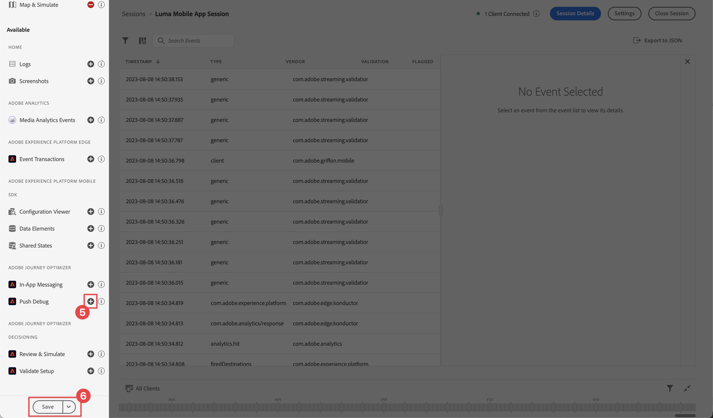

# Messagerie push Adobe Journey Optimizer

Découvrez comment créer des messages push pour les applications mobiles avec le SDK Mobile Platform et Adobe Journey Optimizer.

Journey Optimizer vous permet de créer vos parcours et d’envoyer des messages à des audiences ciblées. Avant d’envoyer des notifications push avec Journey Optimizer, vous devez vous assurer que les configurations et intégrations appropriées sont en place. Pour comprendre le flux de données des notifications push dans Adobe Journey Optimizer, voir [la documentation](https://experienceleague.adobe.com/docs/journey-optimizer/using/configuration/configuration-message/push-config/push-gs.html).

>[!NOTE]
>
>Cette leçon est facultative et s’applique uniquement aux utilisateurs de Adobe Journey Optimizer qui souhaitent envoyer des messages push.


## Conditions préalables

* Création et exécution de l’application avec les SDK installés et configurés.
* Accès à Adobe Journey Optimizer et autorisations suffisantes, comme décrit [here](https://experienceleague.adobe.com/docs/journey-optimizer/using/configuration/configuration-message/push-config/push-configuration.html?lang=en). Vous avez également besoin d’autorisations suffisantes pour les fonctionnalités Adobe Journey Optimizer suivantes.
   * Créez une surface d’application.
   * Créer un parcours
   * Créez un message.
   * Création de préréglages de message.
* Compte de développeur Apple payant disposant d’un accès suffisant pour créer des certificats, identifiants et clés.
* Appareil ou simulateur iOS physique à tester.

## Objectifs d&#39;apprentissage

Dans cette leçon, vous allez :

* Enregistrez l’ID d’application avec le service Apple Push Notification (APN).
* Créez un **[!UICONTROL Surface de l’application]** dans AJO.
* Mettez à jour votre **[!UICONTROL schema]** pour inclure des champs de messagerie push.
* Installez et configurez la variable **[!UICONTROL Adobe Journey Optimizer]** extension de balise.
* Mettez à jour votre application pour inclure l’extension de balise AJO.
* Validez la configuration dans Assurance.
* Envoyez un message de test.
* Définissez votre propre événement, parcours et expérience de notification push dans Journey Optimizer.
* Envoyez votre propre notification push depuis l’application.


## Enregistrement de l’ID d’application avec l’APN

Les étapes suivantes ne sont pas spécifiques à Adobe Experience Cloud et sont conçues pour vous guider tout au long de la configuration de l’APN.

### Création d’une clé privée

1. Sur le portail destiné aux développeurs Apple, accédez à **[!UICONTROL Clés]**.
1. Pour créer une clé, sélectionnez **[!UICONTROL +]**.
   

1. Fournissez une **[!UICONTROL Nom de la clé]**.
1. Sélectionnez la variable **[!UICONTROL APN]** .
1. Sélectionnez **[!UICONTROL Continuer]**.
   
1. Vérifiez la configuration et sélectionnez **[!UICONTROL Enregistrer]**.
1. Téléchargez la `.p8` clé privée. Il est utilisé dans la configuration Surface de l’application.
1. Prenez note de la [!UICONTROL ID de clé]. Il est utilisé dans la configuration Surface de l’application.
1. Prenez note de la [!UICONTROL Identifiant de l’équipe]. Il est utilisé dans la configuration Surface de l’application.
   

Une documentation supplémentaire peut être [se trouve ici](https://help.apple.com/developer-account/#/devcdfbb56a3).

## Ajout des informations d’identification push de votre application à la collecte de données

1. Dans la [Interface de collecte de données](https://experience.adobe.com/data-collection/), sélectionnez **[!UICONTROL Surfaces de l’application]** dans le panneau de gauche.
1. Pour créer une configuration, sélectionnez **[!UICONTROL Création de surfaces d’application]**.
   
1. Saisissez un **[!UICONTROL Nom]** pour la configuration, par exemple `Luma App Tutorial`  .
1. Dans Configuration de l’application mobile, sélectionnez **[!UICONTROL Apple iOS]**.
1. Renseignez l&#39;ID de bundle de l&#39;application mobile dans le champ ID de l&#39;application (ID de bundle iOS). Si vous suivez l’application Luma, cette valeur est `com.adobe.luma.tutorial.swiftui`.
1. Activez l’option **[!UICONTROL Informations d’identification push]** pour ajouter vos informations d’identification.
1. Faites glisser et déposez votre `.p8` **Clé d’authentification des notifications push Apple** fichier .
1. Fournissez les **[!UICONTROL ID de clé]**, chaîne de 10 caractères attribuée lors de la création de la variable `p8` clé auth. Il se trouve sous **[!UICONTROL Clés]** dans **Certificats, identifiants et profils** page des pages du portail des développeurs Apple.
1. Indiquez l&#39;**[!UICONTROL identifiant d&#39;équipe]**. L’ ID d’équipe est une valeur qui se trouve sous la variable **Abonnement** ou dans la partie supérieure des pages du portail des développeurs Apple.
1. Sélectionnez **[!UICONTROL Enregistrer]**.

   

## Installation de l’extension de balises Adobe Journey Optimizer

1. Accédez à **[!UICONTROL Balises]** > **[!UICONTROL Extensions]** > **[!UICONTROL Catalogue]**,
1. Ouvrez votre propriété, par exemple **[!UICONTROL Tutoriel sur l’application mobile Luma]**.
1. Sélectionner **[!UICONTROL Catalogue]**.
1. Recherchez le **[!UICONTROL Adobe Journey Optimizer]** extension .
1. Installation l’extension.
1. Dans le **[!UICONTROL Installer l’extension]** dialog
   1. Sélectionnez un environnement, par exemple **[!UICONTROL Développement]**.
   1. Sélectionnez la variable **[!UICONTROL Jeu de données d’événement de suivi push AJO]** jeu de données à partir du **[!UICONTROL Jeu de données d’événement]** liste déroulante
      
   1. Sélectionner **[!UICONTROL Enregistrer dans la bibliothèque et créer]**.

>[!NOTE]
>
>Si vous ne voyez pas `AJO Push Tracking Experience Event Dataset` contactez l’assistance clientèle.
>

## Mise en oeuvre de Adobe Journey Optimizer dans l’application

Comme indiqué dans les leçons précédentes, l’installation d’une extension de balise mobile fournit uniquement la configuration. Vous devez ensuite installer et enregistrer le SDK de messagerie. Si ces étapes ne sont pas claires, passez en revue la [Installation des SDK](install-sdks.md) .

>[!NOTE]
>
>Si vous avez terminé la [Installation des SDK](install-sdks.md) , le SDK est déjà installé et vous pouvez passer à l’étape #7.
>

1. Dans Xcode, assurez-vous que [Messagerie AEP](https://github.com/adobe/aepsdk-messaging-ios.git) est ajouté à la liste des modules dans les dépendances de modules. Voir [Swift Package Manager](install-sdks.md#swift-package-manager).
1. Accédez à **[!UICONTROL Luma]** > **[!UICONTROL Luma]** > **[!UICONTROL AppDelegate]**.
1. Assurez-vous que `AEPMessaging` fait partie de votre liste d’importations.

   `import AEPMessaging`

1. Assurez-vous que `Messaging.self` fait partie du tableau des extensions que vous enregistrez.

   ```swift
   let extensions = [
       AEPIdentity.Identity.self,
       Lifecycle.self,
       Signal.self,
       Edge.self,
       AEPEdgeIdentity.Identity.self,
       Consent.self,
       UserProfile.self,
       Places.self,
       Messaging.self,
       Optimize.self,
       Assurance.self
   ]
   ```

1. Ajoutez la variable `MobileCore.setPushIdentifier` à la fonction `func application(_ application: UIApplication, didRegisterForRemoteNotificationsWithDeviceToken deviceToken: Data)` de la fonction

   ```swift
   // Send push token to Experience Platform
   MobileCore.setPushIdentifier(deviceToken)
   ```

   Cette fonction récupère le jeton de l’appareil unique sur lequel l’application est installée. Définit ensuite le jeton pour la diffusion de la notification push à l’aide de la configuration que vous avez configurée et qui repose sur le service de notification push Apple (APNS).

## Validation avec Assurance

1. Consultez la section [instructions de configuration](assurance.md) .
1. Installez l’application sur votre appareil physique ou sur le simulateur.
1. Lancez l’application à l’aide de l’URL générée par Assurance.
1. Dans l’interface utilisateur d’assurance, sélectionnez **[!UICONTROL Configurer]**.
   
1. Sélectionnez la variable  bouton en regard de **[!UICONTROL Débogage Push]**.
1. Sélectionnez **[!UICONTROL Enregistrer]**.
   
1. Sélectionner **[!UICONTROL Débogage Push]** dans le volet de navigation de gauche.
1. Sélectionnez la variable **[!UICONTROL Validation de la configuration]** .
1. Sélectionnez votre périphérique dans le **[!UICONTROL Client]** liste.
1. Confirmez que vous n’obtenez aucune erreur.
   
1. Sélectionnez la variable **[!UICONTROL Envoyer le test push]** .
1. (Facultatif) Modifiez les détails par défaut de la variable **[!UICONTROL Titre]** et **[!UICONTROL Corps]**
1. Sélectionner  **[!UICONTROL Envoi de la notification push de test]**.
1. Vérifiez les **[!UICONTROL Résultats du test]**.
1. La notification push devrait apparaître dans votre application.

   


## Créer votre propre notification push

Pour créer votre propre notification push, vous devez définir un événement dans Journey Optimizer qui déclenche un parcours chargé de l&#39;envoi d&#39;une notification push.

### Définition d’un événement

1. Dans l’interface utilisateur de Journey Optimizer, sélectionnez **[!UICONTROL Configurations]** dans le rail de gauche.

1. Dans le **[!UICONTROL Tableau de bord]** sélectionnez l’écran **[!UICONTROL Gérer]** dans le **[!UICONTROL Événements]** mosaïque.

1. Dans le **[!UICONTROL Événements]** écran, sélectionnez **[!UICONTROL Créer un événement]**.

1. Dans le **[!UICONTROL Modifier event1]** Volet :

   1. Entrée `LumaTestEvent` comme la propriété **[!UICONTROL Nom]** de l’événement .
   1. Fournissez une **[!UICONTROL Description]**, par exemple `Test event to trigger push notifications in Luma app`.

   1. Sélectionnez le schéma d’événement d’expérience d’application mobile que vous avez créé précédemment dans [Créer un schéma XDM](create-schema.md) de la **[!UICONTROL Schéma]** liste, par exemple **[!UICONTROL Schéma d’événement d’application mobile Luma v.1]**.
   1. Sélectionner  en regard de la liste Champs .

      

      Dans le **[!UICONTROL Champs]** vérifiez que les champs suivants sont sélectionnés (en plus des champs par défaut qui sont toujours sélectionnés (_id, id et horodatage)). Vous pouvez basculer entre les **[!UICONTROL Sélectionné]**, **[!UICONTROL Tous]** et **[!UICONTROL Principal]** ou utilisez la fonction  champ .

      * **[!UICONTROL Application identifiée (id)]**,
      * **[!UICONTROL Type d’événement (eventType)]**,
      * **[!UICONTROL Principal (principal)]**.

      

      Sélectionnez **[!UICONTROL Ok]**.

   1. Sélectionner  en regard de **[!UICONTROL Condition d’identifiant d’événement]** champ .

      1. Dans le **[!UICONTROL Ajout d’une condition d’identifiant d’événement]** boîte de dialogue, glisser-déposer **[!UICONTROL Identifiant (id) de l’application]** underneath **[!UICONTROL Application (application)]** à **[!UICONTROL Faire glisser et déposer un élément ici]**.
      1. Dans la fenêtre contextuelle, saisissez l’identifiant du lot à partir de Xcode, par exemple `com.adobe.luma.tutorial.swiftui` dans le champ en regard de **[!UICONTROL égal à]**.
      1. Cliquez sur **[!UICONTROL OK]**.
      1. Cliquez sur **[!UICONTROL OK]**.
         

   1. Sélectionner **[!UICONTROL ECID (ECID)]** de la **[!UICONTROL Espace de noms]** liste. Automatiquement la variable **[!UICONTROL Identifiant de profil]** est renseigné par **[!UICONTROL ID du premier élément de l’ECID clé pour la carte identityMap]**.
   1. Sélectionnez **[!UICONTROL Enregistrer]**.
      

Vous venez de créer une configuration d’événement basée sur le schéma d’événements d’expérience d’application mobile que vous avez créé précédemment dans le cadre de ce tutoriel. Cette configuration d’événement filtre les événements d’expérience entrants à l’aide de l’identifiant de votre application mobile. Vous êtes donc certain que seuls les événements initiés à partir de votre application mobile déclencheront le parcours que vous allez créer à l’étape suivante.

### Création du parcours

L’étape suivante consiste à créer le parcours qui déclenche l’envoi de la notification push lors de la réception de l’événement approprié.

1. Dans l’interface utilisateur de Journey Optimizer, sélectionnez **[!UICONTROL Parcours]** dans le rail de gauche.
1. Sélectionner **[!UICONTROL Créer un Parcours]**.
1. Dans le **[!UICONTROL Propriétés du parcours]** panel :

   1. Saisissez un **[!UICONTROL Nom]** pour le parcours, par exemple `Luma - Test Push Notification Journey`.
   1. Saisissez un **[!UICONTROL Description]** pour le parcours, par exemple `Journey for test push notifications in Luma mobile app`.
   1. Assurez-vous que **[!UICONTROL Autoriser une rentrée]** est sélectionné et défini. **[!UICONTROL Période d’attente de rentrée]** to **[!UICONTROL 30]** **[!UICONTROL Secondes]**.
   1. Cliquez sur **[!UICONTROL OK]**.
      

1. De retour dans la zone de travail du parcours, à partir de la **[!UICONTROL ÉVÉNEMENTS]**, effectuez un glisser-déposer de la  **[!UICONTROL LumaTestEvent]** sur le canevas où il est lu **[!UICONTROL Sélectionner un événement d’entrée ou une activité de lecture d’audience]**.

   * Dans les événements : **[!UICONTROL LumaTestEvent]** , saisissez une **[!UICONTROL Libellé]**, par exemple `Luma Test Event`.

1. Dans la **[!UICONTROL ACTIONS]** menu déroulant, glisser-déposer  **[!UICONTROL Push]** sur le  en paraissant juste à votre **[!UICONTROL LumaTestEvent]** activité. Dans le **[!UICONTROL Actions : Push]** Volet :

   1. Fournissez une **[!UICONTROL Libellé]**, par exemple `Luma Test Push Notification`, fournissez une **[!UICONTROL Description]**, par exemple `Test push notification for Luma mobile app`, sélectionnez **[!UICONTROL Transactionnel]** de la **[!UICONTROL Catégorie]** répertorier et sélectionner **[!UICONTROL Luma]** de la **[!UICONTROL Surface push]**.
   1. Sélectionner  **[!UICONTROL Modifier le contenu]** pour commencer à modifier la notification push réelle.
      

      Dans le **[!UICONTROL Notification push]** editor:

      1. Saisissez un **[!UICONTROL Titre]**, par exemple `Luma Test Push Notification` et saisissez un **[!UICONTROL Corps]**, par exemple `Test push notification for Luma mobile app`.
      1. Pour enregistrer et quitter l’éditeur, sélectionnez .
         

   1. Pour enregistrer et terminer la définition de la notification push, sélectionnez **[!UICONTROL Ok]**.

1. Votre parcours devrait ressembler à celui-ci. Sélectionner **[!UICONTROL Publier]** pour publier et activer votre parcours.
   


## Déclenchement de la notification push

Vous avez tous les ingrédients en place pour envoyer une notification push. Reste à savoir comment déclencher cette notification push. Essentiellement, c’est la même chose que vous l’avez déjà vu : envoyez simplement un événement d’expérience avec la charge utile appropriée.

Cette fois, l’événement d’expérience que vous êtes sur le point d’envoyer n’est pas créé en créant un dictionnaire XDM simple. Vous allez utiliser un struct représentant une payload de notification push. La définition d’un type de données dédié est une autre manière de mettre en oeuvre la création de payloads d’événement d’expérience dans votre application.

1. Accédez à **[!UICONTROL Luma]** > **[!UICONTROL Luma]** > **[!UICONTROL Modèle]** > **[!UICONTROL XDM]** > **[!UICONTROL TestPushPayload]** et inspectez le code.

   ```swift
   import Foundation
   
   // MARK: - TestPush
   struct TestPushPayload: Codable {
      let application: Application
      let eventType: String
   }
   
   // MARK: - Application
   struct Application: Codable {
      let id: String
   }
   ```

   Le code est une représentation de la payload simple suivante que vous allez envoyer pour déclencher votre parcours de notification push de test.

   ```json
   {
      "eventType": string,
      "application" : [
          "id": string
      ]
   }
   ```

1. Accédez à **[!UICONTROL Luma]** > **[!UICONTROL Luma]** > **[!UICONTROL Utils]** > **[!UICONTROL MobileSDK]** dans le navigateur de projet Xcode et ajoutez le code suivant à `func sendTestPushEvent(applicationId: String, eventType: String)`:

   ```swift
   Task {
       let testPushPayload = TestPushPayload(
           application: Application(
               id: applicationId
           ),
           eventType: eventType
       )
       // send the final experience event
       await sendExperienceEvent(
           xdm: testPushPayload.asDictionary() ?? [:]
       )
   }
   ```

   Ce code crée une `testPushPayload` à l’aide des paramètres fournis à la fonction (`applicationId` et `eventType`), puis les appels `sendExperienceEvent` lors de la conversion de la payload en dictionnaire. Cette fois-ci, ce code prend également en compte les aspects asynchrones de l’appel du SDK Adobe Experience Platform à l’aide du modèle d’accès simultané de Swift basé sur `await` et `async`.

1. Accédez à **[!UICONTROL Luma]** > **[!UICONTROL Luma]** > **[!UICONTROL Vues]** > **[!UICONTROL Général]** > **[!UICONTROL ConfigView]** dans le navigateur de projet Xcode. Dans la définition du bouton de notification push, ajoutez le code suivant pour envoyer la payload de l’événement d’expérience de notification push de test afin de déclencher votre parcours lorsque ce bouton est activé.

   ```swift
   // Setting parameters and calling function to send push notification
   let eventType = "mobileapp.testpush"
   let applicationId = Bundle.main.bundleIdentifier ?? "No bundle id found"
   await MobileSDK.shared.sendTestPushEvent(applicationId: applicationId, eventType: eventType)   
   ```


## Validation à l’aide de votre application

1. Ouvrez votre application sur un appareil ou dans le simulateur.

1. Accédez au **[!UICONTROL Paramètres]** .

1. Appuyer **[!UICONTROL Notification push]**. La notification push apparaît dans votre application.
   


## Mise en oeuvre dans votre application

Vous devriez maintenant disposer de tous les outils pour commencer à ajouter des notifications push, le cas échéant et de manière applicable, à l’application Luma. Par exemple, accueillir l’utilisateur lorsqu’il se connecte à l’application ou à l’approche d’une géolocalisation spécifique.

>[!SUCCESS]
>
>Vous avez désormais activé l’application pour la notification push à l’aide de Adobe Journey Optimizer et de l’extension Adobe Journey Optimizer pour le SDK Adobe Experience Platform Mobile.<br/>Merci d’investir votre temps à apprendre sur le SDK Adobe Experience Platform Mobile. Si vous avez des questions, souhaitez partager des commentaires généraux ou avez des suggestions sur le contenu futur, partagez-les à ce sujet. [Article de discussion de la communauté Experience League](https://experienceleaguecommunities.adobe.com/t5/adobe-experience-platform-launch/tutorial-discussion-implement-adobe-experience-cloud-in-mobile/td-p/443796).

Suivant : **[Messagerie in-app avec Journey Optimizer](journey-optimizer-inapp.md)**

