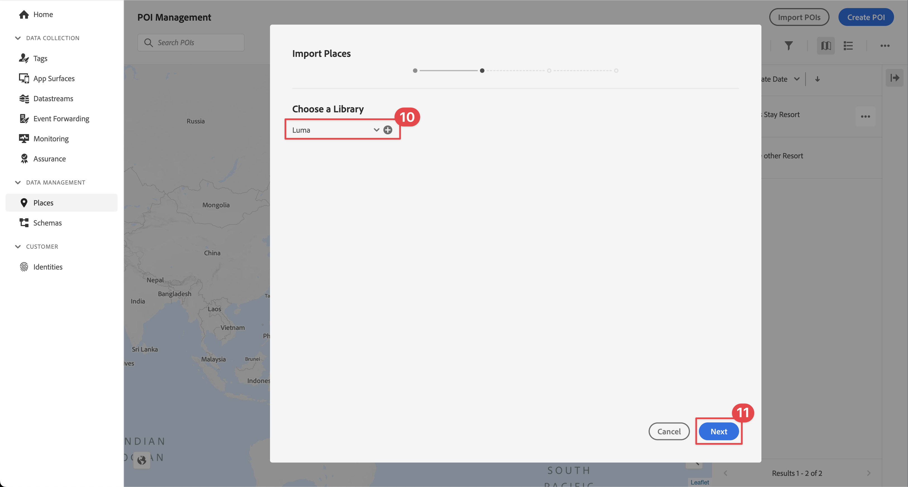

# Utilisation des services de géolocalisation

Découvrez comment utiliser le service de géolocalisation dans votre application.

Le service Adobe Experience Platform Data Collection Places est un service de géolocalisation qui permet aux applications mobiles reconnaissant l’emplacement de l’application de comprendre le contexte de l’emplacement. Le service utilise des interfaces SDK riches et faciles à utiliser, accompagnées d’une base de données flexible de points ciblés (POI).

## Conditions préalables

* Toutes les dépendances de package sont en place dans le projet Xcode.
* Extensions enregistrées dans AppDelegate.
* Configuré MobileCore pour utiliser votre appId de développement.
* SDK importés.
* Création et exécution de l’application réussie avec les modifications ci-dessus.

## Objectifs d&#39;apprentissage

Dans cette leçon, vous allez

* Découvrez comment définir des points ciblés dans le service Places.
* Mettez à jour votre propriété de balise avec l’extension Places.
* Mettez à jour votre schéma pour capturer les événements de géolocalisation.
* Validez la configuration dans Assurance.
* Mettez à jour votre application pour enregistrer l’extension Places.
* Mettez en oeuvre le suivi de la géolocalisation à partir du service Places dans votre application.


## Configuration

Pour que le service Places fonctionne dans votre application et dans le SDK Mobile, vous devez effectuer une configuration.

### Définition des emplacements

Vous définissez certains points ciblés dans le service Places.

1. Dans l’interface utilisateur de la collecte de données, sélectionnez **[!UICONTROL Places]**.
1. Sélectionner .
1. Dans le menu contextuel, sélectionnez **[!UICONTROL Gestion des bibliothèques]**.
   
1. Dans le **[!UICONTROL Gestion des bibliothèques]** boîte de dialogue, sélectionnez **[!UICONTROL Nouveau]**.
1. Dans le **[!UICONTROL Créer une bibliothèque]** entrée dans une boîte de dialogue **[!UICONTROL Nom]**, par exemple `Luma`.
1. Sélectionner **[!UICONTROL Confirmer]**.
   
1. Pour fermer la variable **[!UICONTROL Gestion des bibliothèques]** boîte de dialogue, sélectionnez **[!UICONTROL Fermer]**.
1. Retour à **[!UICONTROL Gestion des points ciblés]**, sélectionnez **[!UICONTROL Importation de points ciblés]**.
1. Sélectionner **[!UICONTROL Début]** en t**[!UICONTROL Importer des emplacements]Boîte de dialogue **.
1. Sélectionner **[!DNL Luma]** de la liste des bibliothèques,
1. Sélectionnez **[!UICONTROL Suivant]**.
   
1. Téléchargez la [Fichier ZIP des points ciblés Luma](assets/luma_pois.csv.zip) et extrayez-le vers un emplacement de votre ordinateur.
1. Dans le **[!UICONTROL Importer des emplacements]** Boîte de dialogue, effectuez un glisser-déposer de l’élément extrait `luma_pois.csv` sur **[!UICONTROL Choisir un fichier CSV - Effectuez un glisser-déposer de votre fichier]**. Vous devriez voir **[!UICONTROL Validation Success]** - **[!UICONTROL Validation réussie du fichier CSV]**.
1. Sélectionner **[!UICONTROL Lancer l’importation]**. Vous devriez voir **[!UICONTROL Succès]** - **[!UICONTROL Ajout réussi de 6 nouveaux points ciblés]**.
1. Sélectionnez **[!UICONTROL Terminé]**.
1. Dans **[!UICONTROL Gestion des points ciblés]**, vous devriez constater que six nouveaux magasins Luma sont ajoutés à la liste. Vous pouvez basculer entre les  list et  vue map.
   .


### Installation de l’extension Places

1. Accédez à **[!UICONTROL Balises]** et recherchez la propriété de balise mobile et ouvrez-la.
1. Sélectionner **[!UICONTROL Extensions]**.
1. Sélectionner **[!UICONTROL Catalogue]**.
1. Recherchez le **[!UICONTROL Places]** extension .
1. Installation l’extension.

   

1. Dans le **[!UICONTROL Installer l’extension]** dialog :
   1. Sélectionner **[!DNL Luma]** de la **[!UICONTROL Sélection d’une bibliothèque]** liste.
   1. Vérifiez que vous avez sélectionné votre bibliothèque de travail, par exemple : **[!UICONTROL Version initiale]**.
   1. Sélectionner **[!UICONTROL Enregistrer dans la bibliothèque et créer]** de **[!UICONTROL Enregistrer dans la bibliothèque]**.
      .

1. Votre bibliothèque est en cours de reconstruction.


### Vérification de votre schéma

Vérifiez si votre schéma est défini dans la section [Créer un schéma](create-schema.md), intègre les groupes de champs et classes nécessaires pour collecter les données des points ciblés et de géolocalisation.

1. Accédez à l’interface de collecte de données et sélectionnez **[!UICONTROL Schémas]** dans le rail de gauche.
1. Sélectionner **[!UICONTROL Parcourir]** dans la barre supérieure.
1. Sélectionnez votre schéma pour l’ouvrir.
1. Dans l’éditeur de schéma, sélectionnez **[!UICONTROL Événement d’expérience client]**.
1. Vous voyez une **[!UICONTROL placeContext]** avec objet et champs pour capturer les données d’interaction et de géolocalisation des points ciblés.
   .


### Mettre à jour votre balise

L’extension Places pour les balises permet de surveiller les événements de géolocalisation et de déclencher des actions en fonction de ces événements. Vous pouvez utiliser cette fonctionnalité pour minimiser le codage de l’API que vous devez implémenter dans l’application.

**Éléments de données**

Vous devez d’abord créer plusieurs éléments de données.

1. Accédez à la propriété de balise dans l’interface utilisateur de la collecte de données.
1. Sélectionner **[!UICONTROL Éléments de données]** dans le rail de gauche.
1. Sélectionnez **[!UICONTROL Ajouter un élément de données]**.
1. Dans le **[!UICONTROL Créer un élément de données]** , saisissez un nom, par exemple `Name - Entered`.
1. Sélectionner **[!UICONTROL Places]** de la **[!UICONTROL Extension]** liste.
1. Sélectionner **[!UICONTROL Nom]** de la **[!UICONTROL Type d’élément de données]** liste.
1. Sélectionner **[!UICONTROL Point ciblé actuel]** underneath **[!UICONTROL TARGET]**.
1. Sélectionner **[!UICONTROL Enregistrer dans la bibliothèque]**.
   

1. Répétez les étapes 4 à 8 en utilisant les informations du tableau ci-dessous, pour créer des éléments de données supplémentaires.

   | Nom | Extension | Type d’élément de données | TARGET |
   |---|---|---|---|
   | `Name - Exited` | Places | Nom | Dernier point ciblé de sortie |
   | `Category - Current` | Places | Catégorie | Point ciblé actuel |
   | `Category - Exited` | Places | Catégorie | Dernier point ciblé de sortie |
   | `City - Current` | Places | Ville | Point ciblé actuel |
   | `City - Exited` | Places | Ville | Dernier point ciblé de sortie |

   La liste des éléments de données doit être la suivante.

   

**Règles**

Vous allez ensuite définir des règles pour travailler avec ces éléments de données.

1. Dans la propriété de balise. select **[!UICONTROL Règles]** dans le rail de gauche.
1. Sélectionner **[!UICONTROL Ajouter une règle]**.
1. Dans le **[!UICONTROL Créer une règle]** , saisissez un nom pour la règle, par exemple `POI - Entry`.
1. Sélectionner  underneath **[!UICONTROL ÉVÉNEMENTS]**.
   1. Sélectionner **[!UICONTROL Places]** de la **[!UICONTROL Extension]** répertorier et sélectionner **[!UICONTROL Entrée dans le point ciblé]** de la **[!UICONTROL Type d’événement]** liste.
   1. Sélectionnez **[!UICONTROL Conserver les modifications]**.
      .
1. Sélectionner  underneath **[!UICONTROL ACTIONS]**.
   1. Sélectionner **[!UICONTROL Mobile Core]** de la **[!UICONTROL Extension]** list, select **[!UICONTROL Joindre des données]** de **[!UICONTROL Type d’action]** la liste. Cette action associe des données de payload.
   1. Dans le **[!UICONTROL Charge utile JSON]**, collez la charge utile suivante :

      ```json
      {
          "xdm": {
              "eventType": "location.entry",
              "placeContext": {
                  "geo": {
                      "city": "{%%City - Current%%}"
                  },
                  "POIinteraction": {
                      "poiDetail": {
                          "name": "{%%Name - Current%%}",
                          "category": "{%%Category - Current%%}"
                      },
                      "poiEntries": {
                          "value": 1
                      }
                  }
              }
          }
      }
      ```

      Vous pouvez également insérer `{%% ... %%}` valeurs d’espace réservé de l’élément de données dans le fichier JSON en sélectionnant . Une boîte de dialogue contextuelle vous permet de sélectionner un élément de données que vous avez créé.

   1. Sélectionnez **[!UICONTROL Conserver les modifications]**.
      

1. Sélectionner  en regard de **[!UICONTROL Noyau mobile - Joindre des données]** action.
   1. Sélectionner **[!UICONTROL Adobe Experience Platform Edge Network]** de la **[!UICONTROL Extension]** répertorier et sélectionner **[!UICONTROL Transfert d’un événement vers Edge Network]**. Cette action garantit que l’événement et les données de charge utile supplémentaires sont transférés vers le réseau Edge.
   1. Sélectionnez **[!UICONTROL Conserver les modifications]**.

1. Pour enregistrer la règle, sélectionnez **[!UICONTROL Enregistrer dans la bibliothèque]**.

   

Créons une autre règle

1. Dans le **[!UICONTROL Créer une règle]** , saisissez un nom pour la règle, par exemple `POI - Exit`.
1. Sélectionner  underneath **[!UICONTROL ÉVÉNEMENTS]**.
   1. Sélectionner **[!UICONTROL Places]** de la **[!UICONTROL Extension]** répertorier et sélectionner **[!UICONTROL Entrée dans le point ciblé]** de la **[!UICONTROL Type d’événement]** liste.
   1. Sélectionnez **[!UICONTROL Conserver les modifications]**.
1. Sélectionner  underneath **[!UICONTROL ACTIONS]**.
   1. Sélectionner **[!UICONTROL Mobile Core]** de **[!UICONTROL Extension]** list, select **[!UICONTROL Joindre des données]** de **[!UICONTROL Type d’action]** liste.
   1. Dans le **[!UICONTROL Charge utile JSON]**, collez la charge utile suivante :

      ```json
      {
          "xdm": {
              "eventType": "location.exit",
              "placeContext": {
                  "geo": {
                      "city": "{%%City - Exited%%}"
                  },
                  "POIinteraction": {
                      "poiExits": {
                          "value": 1
                      },
                      "poiDetail": {
                          "name": "{%%Name - Exited%%}",
                          "category": "{%%Category - Exited%%}"
                      }
                  }
              }
          }
      }
      ```

   1. Sélectionnez **[!UICONTROL Conserver les modifications]**.

1. Sélectionner  en regard de **[!UICONTROL Noyau mobile - Joindre des données]** action.
   1. Sélectionner **[!UICONTROL Adobe Experience Platform Edge Network]** de la **[!UICONTROL Extension]** répertorier et sélectionner **[!UICONTROL Transfert d’un événement vers Edge Network]**.
   1. Sélectionnez **[!UICONTROL Conserver les modifications]**.


Pour vous assurer que toutes les modifications apportées à votre balise sont publiées

1. Sélectionner **[!UICONTROL Version initiale]** comme bibliothèque à créer.
1. Sélectionner **[!UICONTROL Build]**.
   


## Validation de la configuration dans Assurance

Pour valider votre configuration dans Assurance :

1. Accédez à l’interface utilisateur d’assurance.
1. Si elle n’est pas déjà disponible dans le rail de gauche, sélectionnez **[!UICONTROL Configurer]** dans le rail de gauche et sélectionnez  en regard de **[!UICONTROL Événements]** et **[!UICONTROL Carte et simulation]** underneath **[!UICONTROL SERVICE PLACES]**.
1. Sélectionnez **[!UICONTROL Enregistrer]**.
1. Sélectionner **[!UICONTROL Carte et simulation]** dans le rail de gauche.
1. Sélectionnez l’un des points ciblés définis dans le service Places et, dans la fenêtre contextuelle, sélectionnez  **[!UICONTROL Simulation de l’événement d’entrée]**.
   
1. Sélectionner **[!UICONTROL Événements]** dans le rail de gauche, et vous devriez voir les événements que vous avez simulés.
   


## Mise en oeuvre de Places dans votre application

Comme indiqué dans les leçons précédentes, l’installation d’une extension de balise mobile fournit uniquement la configuration. Vous devez ensuite installer et enregistrer le SDK Places. Si ces étapes ne sont pas claires, passez en revue la [Installation des SDK](install-sdks.md) .

>[!NOTE]
>
>Si vous avez terminé la [Installation des SDK](install-sdks.md) , le SDK Places est déjà installé et vous pouvez ignorer cette étape.
>

1. Dans Xcode, assurez-vous que [Places AEP](https://github.com/adobe/aepsdk-places-ios) est ajouté à la liste des modules dans les dépendances de modules. Voir [Swift Package Manager](install-sdks.md#swift-package-manager).
1. Accédez à **[!DNL Luma]** > **[!DNL Luma]** > **[!DNL AppDelegate]** dans le navigateur de projet Xcode.
1. Assurez-vous que `AEPPlaces` fait partie de votre liste d’importations.

   `import AEPPlaces`

1. Assurez-vous que `Places.self` fait partie du tableau des extensions que vous enregistrez.

   ```swift
   let extensions = [
       AEPIdentity.Identity.self,
       Lifecycle.self,
       Signal.self,
       Edge.self,
       AEPEdgeIdentity.Identity.self,
       Consent.self,
       UserProfile.self,
       Places.self,
       Messaging.self,
       Optimize.self,
       Assurance.self
   ]
   ```

1. Accédez à **[!DNL Luma]** > **[!DNL Luma]** > **[!DNL Utils]** > **[!UICONTROL MobileSDK]** dans le navigateur de projet Xcode et recherchez le `func processRegionEvent(regionEvent: PlacesRegionEvent, forRegion region: CLRegion) async` function.Ajoutez le code suivant :

   ```swift
   // Process geolocation event
   Places.processRegionEvent(regionEvent, forRegion: region)
   ```

   Ceci [`Places.processRegionEvent`](https://developer.adobe.com/client-sdks/documentation/places/api-reference/#processregionevent) L’API communique les informations de géolocalisation au service Places.

1. Accédez à **[!DNL Luma]** > **[!DNL Luma]** > **[!DNL Views]** > **[!DNL Location]** > **[!DNL GeofenceSheet]** dans le navigateur de projet de Xcode.

   1. Pour le bouton Entrée, saisissez le code suivant :

   ```swift
   // Simulate geofence entry event
   Task {
       await MobileSDK.shared.processRegionEvent(regionEvent: .entry, forRegion: region)
   }
   ```

   1. Pour le bouton Quitter , saisissez le code suivant :

   ```swift
   // Simulate geofence exit event
   Task {
       await MobileSDK.shared.processRegionEvent(regionEvent: .exit, forRegion: region)
   }
   ```

Cette leçon ne s’applique pas aux détails de l’implémentation de Location Manager dans iOS.


## Validation à l’aide de votre application

1. Ouvrez votre application sur un appareil ou dans le simulateur.

1. Accédez au **[!UICONTROL Emplacement]** .

1. Déplacez la carte pour vous assurer que le cercle bleu au milieu se trouve au-dessus de l’un de vos points ciblés, par exemple Londres.

1. Pression  tant que la catégorie et le nom ne s’affichent pas dans la partie inférieure droite.

1. Appuyez sur le libellé du point ciblé, ce qui ouvre la variable **[!UICONTROL Point ciblé voisin]** feuille.

   

1. Appuyez sur la touche **[!UICONTROL Entrée]** ou **[!UICONTROL Quitter]** pour simuler les événements d’entrée et de sortie de géobarrière de l’application.

   

1. Les événements doivent s’afficher dans l’interface utilisateur d’Assurance.


## Étapes suivantes

Vous devriez maintenant disposer de tous les outils pour commencer à ajouter d’autres fonctionnalités à votre fonctionnalité de géolocalisation dans l’application. Lorsque vous avez transféré les événements vers le réseau Edge, une fois que vous avez configuré l’application pour [Experience Platform](platform.md), vous devriez voir les événements d’expérience apparaissant pour le profil utilisé dans l’application.

Dans la section Journey Optimizer de ce tutoriel, vous verrez que les événements d’expérience peuvent être utilisés pour déclencher des parcours (voir [notification push](journey-optimizer-inapp.md) et [messagerie in-app](journey-optimizer-push.md) avec Journey Optimizer). Par exemple, l’exemple habituel d’envoi à l’utilisateur de votre application d’une notification push avec une promotion de produit lorsque cet utilisateur accède à la clôture d’une boutique physique.

Vous avez vu une mise en oeuvre de la fonctionnalité de votre application, principalement pilotée par le service Places, ainsi que par les éléments de données et les règles que vous avez définis dans votre propriété de balise. Par conséquent, minimisez le code dans votre application. Vous pouvez également mettre en oeuvre la même fonctionnalité directement dans votre application à l’aide du [`Edge.sendEvent`](https://developer.adobe.com/client-sdks/documentation/edge-network/api-reference/#sendevent) API (voir [Événements](events.md) pour plus d’informations) avec un payload XDM contenant un `placeContext` .

>[!SUCCESS]
>
>Vous avez désormais activé l’application pour les services de géolocalisation à l’aide de l’extension Places dans le SDK Mobile Experience Platform.<br/>Merci d’investir votre temps à apprendre sur le SDK Adobe Experience Platform Mobile. Si vous avez des questions, souhaitez partager des commentaires généraux ou avez des suggestions sur le contenu futur, partagez-les à ce sujet. [Article de discussion de la communauté Experience League](https://experienceleaguecommunities.adobe.com/t5/adobe-experience-platform-launch/tutorial-discussion-implement-adobe-experience-cloud-in-mobile/td-p/443796).

Suivant : **[Mappage des données à Adobe Analytics](analytics.md)**
