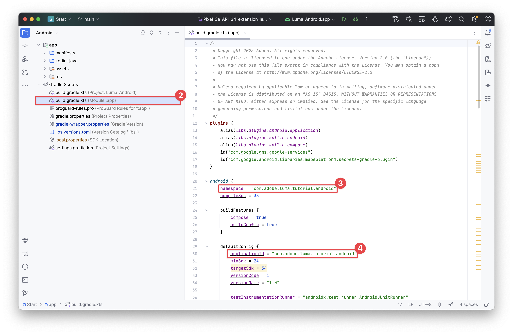

# Configuration d’Assurance

Découvrez comment configurer Adobe Experience Platform Assurance dans une application mobile.

Connu officiellement sous le nom de projet Griffon, Assurance est conçu pour vous aider à inspecter, à tester, à simuler et à valider la manière dont vous collectez des données ou dont les expériences sont diffusées dans votre application mobile.

Assurance vous aide à inspecter les événements SDK bruts générés par Adobe Experience Platform Mobile SDK. Tous les événements collectés par le SDK sont disponibles à des fins d’inspection. Les événements SDK sont chargés dans une vue Liste, triés par heure. Chaque événement possède une vue détaillée qui fournit plus de détails. Des vues supplémentaires permettant de parcourir la configuration de SDK, les éléments de données, les états partagés et les versions d’extension de SDK sont également fournies. En savoir plus sur l’[Assurance](https://experienceleague.adobe.com/fr/docs/experience-platform/assurance/home) dans la documentation du produit.


## Conditions préalables

* L’application a été configurée avec les SDK installés et configurés.

## Objectifs d’apprentissage

Dans cette leçon, vous allez :

* Vérifiez que votre organisation dispose d’un accès (et demandez-le si ce n’est pas le cas).
* Configurez votre URL de base.
* Ajoutez le code spécifique à iOS requis.
* Se connecter à une session

## Confirmer l’accès

Vérifiez que votre organisation a accès à Assurance. Vous, en tant qu’utilisateur, devez être ajouté au profil pour Adobe Experience Platform. Voir [Accès utilisateur](https://experienceleague.adobe.com/en/docs/experience-platform/assurance/user-access) dans le guide Assurance pour plus d’informations.

## Implémenter

Pour implémenter Assurance dans votre application, procédez comme suit :

>[!BEGINTABS]

>[!TAB iOS]

Outre l’installation générale de [SDK](install-sdks.md), iOS requiert également le code supplémentaire suivant pour démarrer la session Assurance de votre application.

1. Accédez à **[!DNL Luma]** > **[!DNL Luma]** > **[!UICONTROL SceneDelegate]** dans le navigateur de projet de votre Xcode.

1. Ajoutez le code suivant à `func scene(_ scene: UIScene, openURLContexts URLContexts: Set<UIOpenURLContext>` :

   ```swift
   // Called when the app in background is opened with a deep link.
   if let deepLinkURL = URLContexts.first?.url {
       // Start the Assurance session
       Assurance.startSession(url: deepLinkURL)
   }
   ```

   Ce code démarre une session d’assurance lorsque l’application est en arrière-plan et ouverte à l’aide d’un lien profond.

>[!TAB Android]

Outre l’installation générale de [SDK](install-sdks.md), Android requiert également le code supplémentaire suivant pour démarrer la session Assurance de votre application.

1. Dans Android Studio, dans la vue **[!UICONTROL Android]**, accédez à **[!UICONTROL app]** > **[!UICONTROL kotlin+java]** > **[!UICONTROL com.adobe.luma.tutorial.android]** > **[!UICONTROL LumaApplication]**.

1. Ajoutez le code suivant à `fun handleDeeplink(deeplink: String?)` :

   ```kotlin
   // Called when the app in background is opened with a deep link.
   if (deeplink.isNullOrEmpty()) {
      Log.w("Luma", "Deeplink is null or empty")
      return
   }
   
   Log.i("Luma", "Handling deeplink: $deeplink")
   Assurance.startSession(deeplink)
   ```

   Ce code démarre une session d’assurance lorsque l’application est en arrière-plan et ouverte à l’aide d’un lien profond.

>[!ENDTABS]


Voir [Référence de l’API Assurance](https://developer.adobe.com/client-sdks/documentation/platform-assurance-sdk/api-reference/){target="_blank"} pour plus d’informations.


## Définition d’un identifiant de lot

Vous devez fournir un identifiant de lot unique pour votre application.

>[!BEGINTABS]

>[!TAB iOS]

1. Ouvrez le projet dans Xcode.
1. Sélectionnez **[!DNL Luma]** dans l’explorateur de projets.
1. Sélectionnez la cible **[!DNL Luma]**.
1. Sélectionnez l’onglet **Signature et fonctionnalités**.
1. Définissez un **[!UICONTROL Identifiant de lot]**.

Veillez à utiliser un identifiant de lot _unique_ et à remplacer l’identifiant de lot `com.adobe.luma.tutorial.swiftui`, car chaque identifiant de lot doit être unique. En règle générale, vous utilisez un format de DNS inversé pour les chaînes d’ID de lot, telles que `com.organization.brand.uniqueidentifier`. La version terminée de ce tutoriel, par exemple, utilise `com.adobe.luma.tutorial.swiftui`.

{zoomable="yes"}

>[!TAB Android]

1. Ouvrez le projet dans Android Studio.
1. Sélectionnez **[!UICONTROL build.gradle.kts (module :app)]** dans le navigateur.
1. Veillez à utiliser un identifiant de lot _unique_ et à remplacer la valeur `com.adobe.luma.tutorial.android` pour `namespace` dans `android`
1. Veillez à utiliser le même identifiant de lot _unique_ et à remplacer le `com.adobe.luma.tutorial.android` pour `applicationId` dans `defaultConfig` dans `android`

En règle générale, vous utilisez un format de DNS inversé pour les chaînes d’ID de lot, telles que `com.organization.brand.uniqueidentifier`. La version terminée de ce tutoriel, par exemple, utilise `com.adobe.luma.tutorial.android`.

{zoomable="yes"}{zoomable="yes"}

>[!ENDTABS]


## Configurer une URL de base

Vous devez configurer une URL de base pour que les liens profonds fonctionnent.

>[!BEGINTABS]

>[!TAB iOS]

1. Accédez à votre projet dans Xcode.
1. Sélectionnez **[!DNL Luma]** dans l’explorateur de projets.
1. Sélectionnez la cible **[!DNL Luma]**.
1. Sélectionnez l’onglet **Infos**.
1. Pour ajouter une URL de base, faites défiler l’écran jusqu’à **Types d’URL** et sélectionnez le bouton **+** .
1. Définissez **Identifiant** sur l’identifiant de lot de votre choix et définissez un **Schémas d’URL** de votre choix .

   {zoomable="yes"}

Veillez à utiliser un identifiant de lot _unique_ et à remplacer l’identifiant de lot `com.adobe.luma.tutorial.swiftui`, car chaque identifiant de lot doit être unique. En règle générale, vous utilisez un format de DNS inversé pour les chaînes d’ID de lot, telles que `com.organization.brand.uniqueidentifier`. Vous pouvez utiliser le même identifiant de lot que celui utilisé dans [Définir l’identifiant du lot](#define-bundle-identifier).<br/>De même, utilisez un modèle d’URL unique et remplacez le `lumatutorialswiftui` déjà fourni par votre modèle d’URL unique.

Pour en savoir plus sur les schémas d’URL dans iOS, consultez la [documentation d’Apple](https://developer.apple.com/documentation/xcode/defining-a-custom-url-scheme-for-your-app){target="_blank"}.

Assurance fonctionne en ouvrant une URL, soit par le biais d’un navigateur, soit par le biais d’un code QR. Cette URL commence par l’URL de base qui ouvre l’application et contient des paramètres supplémentaires. Ces paramètres uniques sont utilisés pour connecter la session. Dans l’exemple d’application, le lien profond est `lumatutorialswiftui://`.

>[!TAB Android]

1. Accédez à la vue **[!UICONTROL Android]** de votre projet dans Android Studio.
1. Sélectionnez **[!UICONTROL app]** > **[!UICONTROL manifests]** > **[!UICONTROL AndroidManifest.xml]** dans le navigateur.
1. Assurez-vous que l’élément XML **[!UICONTROL manifest]** > **[!UICONTROL application]** > **[!UICONTROL activity]** ressemble à ce qui suit :

   ```xml
   <activity
      android:name=".MainActivity"
      android:exported="true"
      android:theme="@style/Theme.LumaAndroid">
      <intent-filter>
            <action android:name="android.intent.action.MAIN" />
            <category android:name="android.intent.category.LAUNCHER" />
      </intent-filter>
      <intent-filter
            android:label="@string/app_name">
            <action android:name="android.intent.action.VIEW" />
            <category android:name="android.intent.category.DEFAULT" />
            <category android:name="android.intent.category.BROWSABLE" />
            <data android:scheme="lumatutorialandroid"
               android:host="default" />
      </intent-filter>
   </activity>
   ```

Veillez à spécifier un `android:scheme` (par exemple, . `lumatutorialandroid`) et `android:host` (par exemple, `default`) pour définir l’URL de base.

Pour en savoir plus sur les liens profonds dans Android, consultez [Création de liens profonds](https://developer.android.com/training/app-links/create-deeplinks){target="_blank"} dans la documentation d’Android.

Assurance fonctionne en ouvrant une URL, soit par le biais d’un navigateur, soit par le biais d’un code QR. Cette URL commence par l’URL de base, qui ouvre l’application et contient des paramètres supplémentaires. Ces paramètres uniques sont utilisés pour connecter la session.  Dans l’exemple d’application, le lien profond est `lumatutorialandroid://default`.

>[!ENDTABS]


## Connexion à une session

Vous pouvez désormais utiliser Assurance pour vous connecter à une session.

>[!BEGINTABS]

>[!TAB iOS]

Dans Xcode :

1. Créez ou recréez et exécutez l’application dans le simulateur ou sur un appareil physique à partir de Xcode, à l’aide de .

   Vous pouvez éventuellement *nettoyer* votre version, en particulier lorsque vous voyez des résultats inattendus. Sélectionnez **[!UICONTROL Nettoyer le dossier de build...]** dans le menu Xcode **[!UICONTROL Produit]**.


1. Dans la boîte de dialogue **[!UICONTROL Autoriser l’application Luma à utiliser votre emplacement]** sélectionnez **[!UICONTROL Autoriser lors de l’utilisation de l’application]**.

   

1. Dans la boîte de dialogue **[!UICONTROL l’application Luma Souhaite vous envoyer des notifications]** sélectionnez **[!UICONTROL Autoriser]**.

   

1. Sélectionnez **[!UICONTROL Continuer...]** pour permettre à l’application de suivre votre activité.

   

1. Dans la boîte de dialogue **[!UICONTROL Autoriser l’« application Luma » à suivre votre activité sur les applications et sites web d’autres sociétés]** sélectionnez **[!UICONTROL Autoriser]**.

   

1. Sélectionnez **[!UICONTROL Continuer]**.


Dans votre navigateur :

1. Accédez à l’interface utilisateur de la collecte de données.
1. Sélectionnez **[!UICONTROL Assurance]** dans le rail de gauche.
1. Sélectionnez **[!UICONTROL Créer une session]**, puis l’option **[!UICONTROL Connexion de lien profond]**.
1. Sélectionnez **[!UICONTROL Démarrer]**.
1. Indiquez un **[!UICONTROL Nom de session]** tel que `Luma Mobile App Session` et l’**[!UICONTROL URL de base]**, qui correspond aux schémas d’URL que vous avez saisis dans Xcode, suivis de `://` Par exemple : `lumatutorialswiftui://`
1. Sélectionnez **[!UICONTROL Suivant]**.
   {zoomable="yes"}
1. Dans la boîte de dialogue modale **[!UICONTROL Créer une session]** :

   Si vous utilisez un appareil physique :

   * Sélectionnez **[!UICONTROL Scanner le code QR]**. Pour ouvrir l’application, utilisez la caméra de votre appareil physique pour scanner le code QR et appuyez sur le lien.

     {zoomable="yes"}

   Si vous utilisez un simulateur :

   1. Sélectionnez **[!UICONTROL Copier le lien]**.
   1. Copiez le lien profond à l’aide de  et utilisez le lien profond pour ouvrir l’application avec Safari dans le simulateur.
      {zoomable="yes"}

1. Au chargement de l’application, une boîte de dialogue modale s’affiche, vous demandant de saisir le code confidentiel illustré à l’étape 7.

   

   Saisissez le code confidentiel et sélectionnez **[!UICONTROL Connexion]**.


1. Si la connexion a réussi, vous voyez :
   * Une icône Assurance flottante au-dessus de votre application.

     

   * Mises à jour d’Experience Cloud arrivant dans l’interface utilisateur d’Assurance, affichant :

      1. Événements d’expérience provenant de l’application.
      1. Détails d’un événement sélectionné.
      1. Appareil et chronologie.

         {zoomable="yes"}

1. Sélectionnez **[!UICONTROL Continuer]** pour accéder à l’écran d’accueil.

>[!TAB Android]

Dans Android Studio :

1. Créez ou recréez et exécutez l’application dans le simulateur ou sur un appareil physique à partir d’Android Studio, à l’aide de .

   Vous pouvez éventuellement *nettoyer* votre version, en particulier lorsque vous voyez des résultats inattendus. Sélectionnez **[!UICONTROL Nettoyer le projet]** dans le menu Android Studio **[!UICONTROL Créer]**.


1. Dans la boîte de dialogue **[!UICONTROL Autoriser Luma Android à vous envoyer des notifications]**, sélectionnez **[!UICONTROL Autoriser]**.

   

1. Sélectionnez **[!UICONTROL Afficher la boîte de dialogue des autorisations]**.

   

1. Dans l’**[!UICONTROL Autoriser Luma Android à accéder à l’emplacement de cet appareil ?]**...

   

   * Sélectionnez **[!UICONTROL Précis]**.
   * Sélectionnez **[!UICONTROL Lors de l’utilisation de l’application]**.

1. De retour dans l’écran d’introduction de l’application, sélectionnez **[!UICONTROL Ouvrir les paramètres de l’appareil]**.

1. Dans l’écran **[!UICONTROL Autorisation de l’emplacement]**, sélectionnez **[!UICONTROL Autoriser tout le temps]**. Sélectionnez ensuite **[!UICONTROL ←]** pour revenir à l’écran de l’application d’introduction.

   

1. Sélectionnez **[!UICONTROL Continuer]** pour accéder à l’écran d’accueil.


Dans votre navigateur :

1. Accédez à l’interface utilisateur de la collecte de données.
1. Sélectionnez **[!UICONTROL Assurance]** dans le rail de gauche.
1. Sélectionnez **[!UICONTROL Créer une session]**, puis l’option **[!UICONTROL Connexion de lien profond]**.
1. Sélectionnez **[!UICONTROL Démarrer]**.
1. Fournissez un **[!UICONTROL Nom de session]** tel que `Luma Mobile App Session` et l’**[!UICONTROL URL de base]**, qui correspond aux `android:scheme` et `android:host` que vous avez définis dans **[!UICONTROL AndroidManifest.xml]** dans Android Studio, séparés par `://` Par exemple : `lumatutorialandroid://default`.
1. Sélectionnez **[!UICONTROL Suivant]**.
   {zoomable="yes"}

1. Dans la boîte de dialogue modale **[!UICONTROL Créer une session]** :

   Si vous utilisez un appareil physique :

   * Sélectionnez **[!UICONTROL Scanner le code QR]**. Pour ouvrir l’application, utilisez la caméra de votre appareil physique pour scanner le code QR et appuyez sur le lien.

     {zoomable="yes"}

   Si vous utilisez un simulateur :

   1. Sélectionnez **[!UICONTROL Copier le lien]**.
   1. Copiez le lien profond à l’aide de  et utilisez le lien profond pour ouvrir l’application avec Chrome dans le simulateur.

   {zoomable="yes"}

   Lorsque vous êtes invité dans Chrome à **Continuer vers Luma Android**, sélectionnez **Continuer**.

1. Au chargement de l’application, une boîte de dialogue modale s’affiche, vous demandant de saisir le code confidentiel illustré à l’étape 7.

   

   Saisissez le code confidentiel et sélectionnez **[!UICONTROL Connexion]**.


1. Si la connexion a réussi, vous voyez :
   * Une icône Assurance flottante au-dessus de votre application.

     

   * Mises à jour d’Experience Cloud arrivant dans l’interface utilisateur d’Assurance, affichant :

      1. Événements d’expérience provenant de l’application.
      1. Détails d’un événement sélectionné.
      1. Appareil et chronologie.

         {zoomable="yes"}

>[!ENDTABS]

Si vous rencontrez des difficultés, consultez la [documentation technique](https://developer.adobe.com/client-sdks/documentation/platform-assurance-sdk/){target="_blank"} et [documentation générale](https://experienceleague.adobe.com/fr/docs/experience-platform/assurance/home){target="_blank"}.


## Vérifier les extensions

Pour vérifier si votre application utilise les extensions les plus récentes :

1. Sélectionnez **[!UICONTROL Configurer]**.

1. Sélectionnez  pour  **[!UICONTROL Versions d’extension]**.

1. Sélectionnez **[!UICONTROL Enregistrer]**.

   {zoomable="yes"}

1. Sélectionnez  **[!UICONTROL Versions des extensions]** pour afficher un aperçu des dernières extensions disponibles et des extensions utilisées dans votre version de l’application.

>[!BEGINTABS]

>[!TAB iOS]

{zoomable="yes"}

Pour mettre à jour les versions de vos extensions (par exemple, **[!UICONTROL Messagerie]** et **[!UICONTROL Optimiser]**), sélectionnez le package (extension) dans **[!UICONTROL Dépendances de package]** (par exemple, **[!UICONTROL AEPMessaging]**) et, dans le menu contextuel, sélectionnez **[!UICONTROL Mettre à jour le package]**. Xcode met à jour les dépendances des packages.

>[!TAB Android]

{zoomable="yes"}

Si des extensions obsolètes s’affichent, consultez la [documentation d’Android Studio](https://developer.android.com/build/agp-upgrade-assistant) sur la mise à jour des modules de dépendance de votre projet.


>[!ENDTABS]

>[!NOTE]
>
>Une fois que vous avez mis à jour vos extensions (packages) dans votre environnement de développement, fermez et supprimez votre session en cours et répétez toutes les étapes des sections [Connexion à une session](#connecting-to-a-session) et [Vérification des extensions](#verify-extensions) pour vous assurer qu’Assurance signale correctement les extensions correctes dans une nouvelle session Assurance.
>


>[!SUCCESS]
>
>Vous avez maintenant configuré votre application de sorte qu’elle utilise Assurance pour la suite du tutoriel.
>
>Merci d’avoir consacré votre temps à découvrir Adobe Experience Platform Mobile SDK. Si vous avez des questions, souhaitez partager des commentaires généraux ou des suggestions sur le contenu futur, partagez-les dans ce [article de discussion de la communauté Experience League](https://experienceleaguecommunities.adobe.com/t5/adobe-experience-platform-data/tutorial-discussion-implement-adobe-experience-cloud-in-mobile/td-p/443796)


Suivant : **[Implémenter le consentement](consent.md)**
