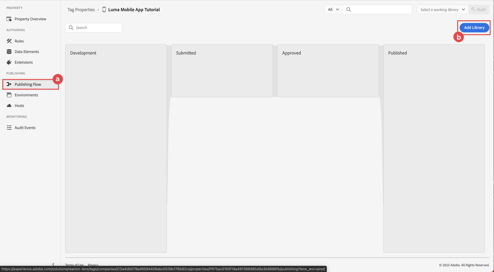

# Configuration d’une propriété de balise

Découvrez comment configurer une propriété de balise dans l’interface [!UICONTROL Collecte de données].

Les balises dans Adobe Experience Platform Launch représentent la nouvelle génération des fonctionnalités de gestion des balises dʼAdobe. Les balises offrent aux clients un moyen simple de déployer et de gérer les balises d’analyse, de marketing et de publicité nécessaires pour offrir des expériences client pertinentes. En savoir plus sur les [&#x200B; Balises &#x200B;](https://experienceleague.adobe.com/fr/docs/experience-platform/tags/home) dans la documentation du produit.

## Conditions préalables

Pour suivre la leçon, vous devez disposer des autorisations nécessaires pour créer une propriété de balise. Il est également utile d’avoir une compréhension de base des balises.

>[!NOTE]
>
> Platform Launch (côté client) s’appelle désormais [&#x200B; Balises &#x200B;](https://experienceleague.adobe.com/fr/docs/experience-platform/tags/home)

## Objectifs d’apprentissage

Dans cette leçon, vous allez :

* Installez et configurez les extensions de balise mobile.
* Générez les instructions d’installation de SDK.

## Configuration initiale

1. Créez une propriété de balise mobile dans l’interface de collecte de données :
   1. Sélectionnez **[!UICONTROL Balises]** dans le volet de navigation de gauche.
   1. Sélectionnez **[!UICONTROL Nouvelle propriété]**
      {zoomable="yes"}.
   1. Pour le **[!UICONTROL Nom]**, saisissez `Luma Mobile App Tutorial`.
   1. Pour le **[!UICONTROL Plateforme]**, sélectionnez **[!UICONTROL Mobile]**.
   1. Sélectionnez **[!UICONTROL Enregistrer]**.

      {zoomable="yes"}

      >[!NOTE]
      >
      > Les paramètres de consentement par défaut pour les implémentations de Mobile SDK Edge, comme celle que vous faites dans cette leçon, proviennent de l’extension [!UICONTROL Consentement] et non du paramètre [!UICONTROL Confidentialité] dans la configuration de la propriété de balise. Vous ajoutez et configurez l’extension de consentement plus loin dans cette leçon. Pour plus d’informations, voir [la documentation](https://developer.adobe.com/client-sdks/edge/consent-for-edge-network/).

1. Ouvrez la nouvelle propriété.
1. Créez une bibliothèque :

   1. Accédez à **[!UICONTROL Flux de publication]** dans le volet de navigation de gauche.
   1. Sélectionnez **[!UICONTROL Ajouter une bibliothèque]**.

      {zoomable="yes"}

   1. Pour le **[!UICONTROL Nom]**, saisissez `Initial Build`.
   1. Pour le **[!UICONTROL Environnement]**, sélectionnez **[!UICONTROL Développement (développement)]**.
   1. Sélectionnez  **[!UICONTROL Ajouter toutes les ressources modifiées]**.
   1. Sélectionnez **[!UICONTROL Enregistrer et créer dans le développement]**.

      {zoomable="yes"}

   1. Enfin, sélectionnez **[!UICONTROL Version initiale]** comme bibliothèque de travail dans le menu **[!UICONTROL Sélectionner une bibliothèque de travail]**.
      {zoomable="yes"}
1. Vérifier les extensions :

   1. Assurez-vous que **[!UICONTROL Version initiale]** est sélectionné comme bibliothèque par défaut.

   1. Sélectionnez **[!UICONTROL Extensions]** dans le rail de gauche.

   1. Sélectionnez l’onglet **[!UICONTROL Installé]**.

      Les extensions [!UICONTROL Mobile Core] et [!UICONTROL Profile] doivent être préinstallées.

      {zoomable="yes"}

## Configuration d’extension

1. Vérifiez que vous êtes dans **[!UICONTROL Extensions]** au sein de la propriété de votre application mobile.

1. Sélectionnez **[!UICONTROL Catalogue]**.

   {zoomable="yes"}

1. Utilisez le champ  **[!UICONTROL Recherche]** pour rechercher l’extension **Identité**.

   1. Recherchez `Identity`.

   2. Sélectionnez l’extension **[!UICONTROL Identity]**.

   3. Sélectionnez **[!UICONTROL Installer]**.

      {zoomable="yes"}

   Cette extension ne nécessite aucune configuration supplémentaire.

1. Utilisez le champ  **[!UICONTROL Recherche]** pour rechercher et installer l’extension **AEP Assurance**.

   Cette extension ne nécessite aucune configuration supplémentaire.

1. Utilisez le champ  **[!UICONTROL Recherche]** pour rechercher et installer l’extension **Consentement**. Dans l’écran de configuration :

   1. Sélectionnez **[!UICONTROL En attente]**. Dans ce tutoriel, vous allez apprendre à gérer le consentement dans l’application. En savoir plus sur l’extension de consentement dans [la documentation](https://developer.adobe.com/client-sdks/documentation/consent-for-edge-network/).
   1. Sélectionnez **[!UICONTROL Enregistrer dans la bibliothèque]**.

      {zoomable="yes"}

1. Utilisez le champ  **[!UICONTROL Recherche]** pour rechercher et installer l’extension **Adobe Experience Platform Edge Network**.

   1. Dans **[!UICONTROL Flux de données]** sélectionnez le **[!UICONTROL Flux de données]** que vous avez créé à l’étape [précédente](create-datastream.md) pour chacun des environnements, par exemple **[!DNL Luma Mobile App]**.

   1. Si ce n’est pas déjà fait, spécifiez le domaine **[!UICONTROL Edge Network]** dans **[!UICONTROL Configuration du domaine]**. Le domaine Edge Network est le nom de votre organisation, suivi de `data.adobedc.net`, par exemple `techmarketingdemos.data.adobedc.net`.

   1. Dans le menu **[!UICONTROL Enregistrer dans la bibliothèque]**, sélectionnez **[!UICONTROL Enregistrer dans la bibliothèque et créer]**.

      {zoomable="yes"}

Votre bibliothèque est conçue pour les nouvelles extensions et configurations. Une ● du bouton **[!UICONTROL Version initiale]** a indiqué une version réussie.

## Génération des instructions d’installation de SDK

Les balises fournissent des instructions et des fragments de code pour installer Adobe Experience Platform Mobile SDK dans votre application.

>[!BEGINTABS]

>[!TAB iOS]

1. Sélectionnez **[!UICONTROL Environnements]** dans le rail de gauche.

1. Sélectionnez l’icône d’installation **[!UICONTROL Développement]**  .

   {zoomable="yes"}

1. Dans la boîte de dialogue **[!UICONTROL Instructions d’installation mobile]**, sélectionnez l’onglet **[!UICONTROL iOS]**.

1. Vous pouvez copier  les instructions pour configurer votre projet à l’aide de CocoaPods. Les CocoaPods sont utilisés pour gérer les versions et les téléchargements de SDK. Pour en savoir plus, consultez la documentation [CocoaPods](https://cocoapods.org/).

   Les [&#x200B; instructions d’installation &#x200B;](https://developer.adobe.com/client-sdks/documentation/getting-started/get-the-sdk/) constituent un bon point de départ pour la mise en œuvre.

   Pour le reste de ce tutoriel, vous n’utilisez **pas** les instructions CocoaPods . Au lieu de cela, vous utilisez la configuration native basée sur le gestionnaire de packages Swift (SPM).

1. Sélectionnez l’onglet **[!UICONTROL Swift]** ci-dessous **[!UICONTROL Ajouter le code d’initialisation]**. Ce bloc de code montre comment importer les SDK requis et enregistrer les extensions lors du lancement. Cette importation et cet enregistrement sont traités plus en détail dans la section [Installation des SDK](install-sdks.md).

1. Copiez  l’**[!UICONTROL ID de fichier d’environnement]** et stockez-le à un emplacement adapté. Cet identifiant unique pointe vers votre environnement de développement. Chaque environnement (production, évaluation, développement) possède sa propre valeur d’identifiant unique.

   {zoomable="yes"}

>[!TAB Android]

1. Sélectionnez **[!UICONTROL Environnements]** dans le rail de gauche.
1. Sélectionnez l’icône d’installation **[!UICONTROL Développement]**  .

   {zoomable="yes"}

1. Dans la boîte de dialogue **[!UICONTROL Instructions d’installation mobile]**, sélectionnez l’onglet **[!UICONTROL Android]**.
1. Vous pouvez copier  les instructions pour configurer votre projet à l’aide de Gradle. Gradle est utilisé pour gérer les versions et les téléchargements de SDK. Pour en savoir plus, consultez la [documentation Gradle](https://gradle.org/)

   Les [&#x200B; instructions d’installation &#x200B;](https://developer.adobe.com/client-sdks/documentation/getting-started/get-the-sdk/) constituent un bon point de départ pour la mise en œuvre.

1. Ce bloc de code montre comment importer les SDK requis et enregistrer les extensions lors du lancement. Cette importation et cet enregistrement sont traités plus en détail dans la section [Installation des SDK](install-sdks.md).

1. Copiez  l’**[!UICONTROL ID de fichier d’environnement]** et stockez-le à un emplacement adapté. Cet identifiant unique pointe vers votre environnement de développement. Chaque environnement (production, évaluation, développement) possède sa propre valeur d’identifiant unique.

   {zoomable="yes"}

>[!ENDTABS]

>[!NOTE]
>
>Les instructions d’installation doivent être considérées comme un point de départ et non comme une documentation définitive. Vous trouverez les dernières versions de SDK et des exemples de code dans la [documentation](https://developer.adobe.com/client-sdks/home/) officielle.

## Architecture des balises mobiles

Si vous connaissez la version web des balises, anciennement Launch, il est important de comprendre les différences sur les appareils mobiles.

* Sur le web, une propriété de balise est rendue dans JavaScript qui est ensuite (généralement) hébergée dans le cloud. Ce fichier JavaScript est référencé directement dans le site web.

* Dans une propriété de balise mobile, les règles et les configurations sont rendues dans des fichiers JSON hébergés dans le cloud. Les fichiers JSON sont téléchargés et lus par l’extension Mobile Core dans l’application mobile. Les extensions sont des SDK distincts qui fonctionnent ensemble. Si vous ajoutez une extension à votre propriété de balise, vous devez également mettre à jour l’application. Si vous modifiez un paramètre d’extension ou créez une règle, ces modifications sont répercutées dans l’application une fois que vous avez publié la bibliothèque de balises mise à jour. Cette flexibilité vous permet de modifier les paramètres (comme l’identifiant de suite de rapports Adobe Analytics). Vous pouvez même modifier le comportement de votre application (à l’aide d’éléments de données et de règles, comme vous le verrez dans les leçons ultérieures) sans avoir à modifier le code de votre application et à la soumettre à nouveau à l’App Store.

>[!SUCCESS]
>
>Vous disposez désormais d’une propriété de balise mobile à utiliser dans la suite de ce tutoriel.
>
>Merci d’avoir consacré votre temps à découvrir Adobe Experience Platform Mobile SDK. Si vous avez des questions, souhaitez partager des commentaires généraux ou des suggestions sur le contenu futur, partagez-les dans ce [article de discussion de la communauté Experience League](https://experienceleaguecommunities.adobe.com/t5/adobe-experience-platform-data/tutorial-discussion-implement-adobe-experience-cloud-in-mobile/td-p/443796?profile.language=fr)

Suivant : **[Installation des SDK](install-sdks.md)**
