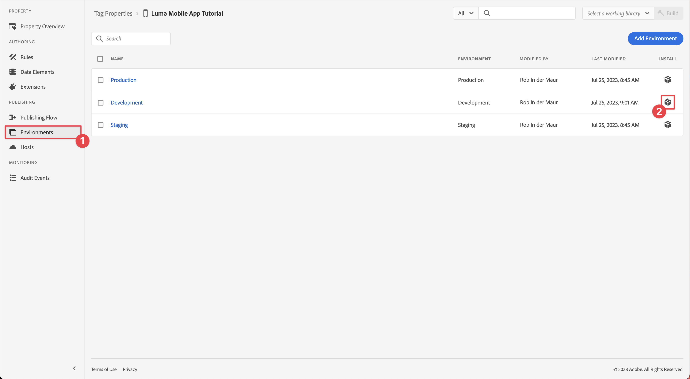

# Configuration d’une propriété de balise

Découvrez comment configurer une propriété de balise dans l’interface [!UICONTROL Collecte de données].

Les balises dans Adobe Experience Platform Launch représentent la nouvelle génération des fonctionnalités de gestion des balises dʼAdobe. Les balises offrent aux clients un moyen simple de déployer et gérer des balises d’analyse, de marketing et de publicité nécessaires pour offrir des expériences client pertinentes. Pour en savoir plus sur [Balises](https://experienceleague.adobe.com/docs/experience-platform/tags/home.html?lang=fr) dans la documentation du produit.

## Conditions préalables

Pour terminer la leçon, vous devez disposer des autorisations nécessaires pour créer une propriété de balise. Il est également utile d’avoir une compréhension de base des balises.

>[!NOTE]
>
> Le platform launch (côté client) est désormais [Balises](https://experienceleague.adobe.com/docs/experience-platform/tags/home.html?lang=fr)

## Objectifs d&#39;apprentissage

Dans cette leçon, vous allez :

* Installez et configurez les extensions de balise mobile.
* Générez les instructions d’installation du SDK.

## Configuration initiale

1. Créez une nouvelle propriété de balise mobile dans l’interface de collecte de données :
   1. Sélectionnez **[!UICONTROL Balises]** dans le volet de navigation de gauche.
   1. Sélectionnez **[!UICONTROL Nouvelle propriété]**

      .
   1. Pour le **[!UICONTROL nom]**, saisissez `Luma Mobile App Tutorial`.
   1. Pour la **[!UICONTROL Plateforme]**, sélectionnez **[!UICONTROL Mobile]**.
   1. Sélectionnez **[!UICONTROL Enregistrer]**.

      

      >[!NOTE]
      >
      > Les paramètres de consentement par défaut pour les implémentations de sdk mobile basées sur les périphériques, comme celui que vous effectuez dans cette leçon, proviennent de l’[!UICONTROL extension de consentement] et non du paramètre [!UICONTROL Privacy] dans la configuration de la propriété de balise. Vous allez ajouter et configurer l’extension Consentement plus loin dans cette leçon. Pour plus d’informations, voir [la documentation](https://developer.adobe.com/client-sdks/edge/consent-for-edge-network/).

1. Ouvrez la nouvelle propriété.
1. Créer une bibliothèque :

   1. Accédez à **[!UICONTROL Flux de publication]** dans le volet de navigation de gauche.
   1. Sélectionnez **[!UICONTROL Ajouter une bibliothèque]**.

      

   1. Pour le **[!UICONTROL nom]**, saisissez `Initial Build`.
   1. Pour l’ **[!UICONTROL environnement]**, sélectionnez **[!UICONTROL Développement (développement)]**.
   1. Sélectionnez  **[!UICONTROL Ajouter toutes les ressources modifiées]**.
   1. Sélectionnez **[!UICONTROL Enregistrer et créer dans le développement]**.

      

   1. Enfin, sélectionnez **[!UICONTROL Version initiale]** comme bibliothèque de travail dans le menu **[!UICONTROL Sélectionner une bibliothèque de travail]**.

      
1. Vérifier les extensions :

   1. Assurez-vous que **[!UICONTROL Initial Build]** est sélectionné comme bibliothèque par défaut.

   1. Sélectionnez **[!UICONTROL Extensions]** dans le rail de gauche.

   1. Sélectionnez l’onglet **[!UICONTROL Installé]** .

      Les extensions [!UICONTROL Mobile Core] et [!UICONTROL Profile] doivent être préinstallées.

      

## Configuration d’extension

1. Vérifiez que vous vous trouvez dans **[!UICONTROL Extensions]** au sein de la propriété de votre application mobile.

1. Sélectionnez **[!UICONTROL Catalog]**.

   

1. Utilisez le champ  **[!UICONTROL Rechercher]** pour rechercher l’extension **Identité**.

   1. Recherchez `Identity`.

   2. Sélectionnez l’extension **[!UICONTROL Identity]**.

   3. Sélectionnez **[!UICONTROL Install]**.

      

   Cette extension ne nécessite aucune configuration supplémentaire.

1. Utilisez le champ  **[!UICONTROL Rechercher]** pour rechercher et installer l’extension **AEP Assurance**.

   Cette extension ne nécessite aucune configuration supplémentaire.

1. Utilisez le champ  **[!UICONTROL Search]** pour rechercher et installer l’extension **Consent**. Dans l’écran de configuration :

   1. Sélectionnez **[!UICONTROL En attente]**. Dans ce tutoriel, vous gérez davantage le consentement dans l’application. Pour en savoir plus sur l&#39;extension Consent, consultez la [documentation](https://developer.adobe.com/client-sdks/documentation/consent-for-edge-network/).
   1. Sélectionnez **[!UICONTROL Enregistrer dans la bibliothèque]**.

      

1. Utilisez le champ  **[!UICONTROL Rechercher]** pour rechercher et installer l’extension **Adobe Experience Platform Edge Network**.

   1. Dans **[!UICONTROL Datastreams]**, sélectionnez le **[!UICONTROL Datastream]** que vous avez créé à l’ [étape précédente](create-datastream.md) pour chacun des environnements, par exemple **[!DNL Luma Mobile App]**.

   1. S’il n’est pas déjà renseigné, spécifiez le **[!UICONTROL domaine Edge Network]** dans **[!UICONTROL Configuration de domaine]**. Le domaine Edge Network est le nom de votre organisation, suivi de `data.adobedc.net`, par exemple `techmarketingdemos.data.adobedc.net`.

   1. Dans le menu **[!UICONTROL Enregistrer dans la bibliothèque]**, sélectionnez **[!UICONTROL Enregistrer dans la bibliothèque et créer]**.

      

Votre bibliothèque est créée pour les nouvelles extensions et configurations. Une version réussie est indiquée par un ● dans le bouton **[!UICONTROL Initial Build]**.

## Instructions d’installation du SDK Generate

1. Sélectionnez **[!UICONTROL Environments]** dans le rail de gauche.

1. Sélectionnez l&#39;icône **[!UICONTROL Development]** install  .

   

1. Dans la boîte de dialogue **[!UICONTROL Instructions d’installation mobile]**, sélectionnez l’onglet **[!UICONTROL iOS]**.

1. Vous pouvez copier  les instructions pour configurer votre projet à l’aide de CocoaPods. Les CocoaPods sont utilisés pour gérer les versions et téléchargements de SDK. Pour en savoir plus, consultez la [documentation CocoaPods](https://cocoapods.org/). Si vous utilisez Android™ comme plateforme de développement, Gradle est l’outil permettant de gérer la version, les téléchargements et les dépendances du SDK. Pour en savoir plus, consultez la [documentation Gradle](https://gradle.org/)

   Les instructions d’installation vous fournissent un bon point de départ pour la mise en oeuvre. Vous trouverez des informations supplémentaires [ici](https://developer.adobe.com/client-sdks/documentation/getting-started/get-the-sdk/).

   >[!INFO]
   >
   >Pour le reste de ce tutoriel, vous **n’utiliserez pas** les instructions CocoaPods, mais utiliserez plutôt une configuration SPM (Swift Package Manager) native.
   >

1. Sélectionnez l’onglet **[!UICONTROL Swift]** sous **[!UICONTROL Ajouter un code d’initialisation]**. Ce bloc de code indique comment importer les SDK requis et enregistrer les extensions au lancement. Ceci est décrit plus en détail dans la section [Installation des SDK](install-sdks.md).

1. Copiez  l’ **[!UICONTROL identifiant de fichier d’environnement]** et stockez-le à un endroit où vous en aurez besoin ultérieurement. Cet identifiant unique pointe vers votre environnement de développement. Chaque environnement (production, évaluation, développement) possède sa propre valeur d’identifiant unique.

   

>[!NOTE]
>
>Les instructions d’installation doivent être considérées comme un point de départ et non comme une documentation définitive. Les dernières versions du SDK et des exemples de code se trouvent dans la [documentation](https://developer.adobe.com/client-sdks/home/) officielle.

## Architecture des balises mobiles

Si vous connaissez la version web des balises, anciennement Launch, il est important de comprendre les différences sur mobile.

* Sur le Web, une propriété de balise est rendue dans JavaScript qui est ensuite (généralement) hébergée dans le cloud. Ce fichier JavaScript est référencé directement dans le site web.

* Dans une propriété de balise mobile, les règles et les configurations sont rendues dans des fichiers JSON hébergés dans le cloud. Les fichiers JSON sont téléchargés et lus par l’extension Mobile Core dans l’application mobile. Les extensions sont des SDK distincts qui fonctionnent ensemble. Si vous ajoutez une extension à votre propriété de balise, vous devez également mettre à jour l’application. Si vous modifiez un paramètre d’extension ou créez une règle, ces modifications sont répercutées dans l’application une fois que vous avez publié la bibliothèque de balises mise à jour. Cette flexibilité vous permet de modifier les paramètres (comme l’identifiant de suite de rapports Adobe Analytics) ou même de modifier le comportement de votre application (à l’aide d’éléments de données et de règles, comme vous le verrez dans les leçons ultérieures) sans avoir à modifier le code de votre application et envoyer de nouveau l’app store.

>[!SUCCESS]
>
>Vous devez maintenant utiliser une propriété de balise mobile dans le reste de ce tutoriel.
>
>Merci d’investir votre temps à apprendre sur le SDK Adobe Experience Platform Mobile. Si vous avez des questions, souhaitez partager des commentaires généraux ou avez des suggestions sur le contenu à venir, partagez-les sur cet [post de discussion de la communauté Experience League](https://experienceleaguecommunities.adobe.com/t5/adobe-experience-platform-data/tutorial-discussion-implement-adobe-experience-cloud-in-mobile/td-p/443796?profile.language=fr)

Suivant : **[Installation des SDK](install-sdks.md)**
