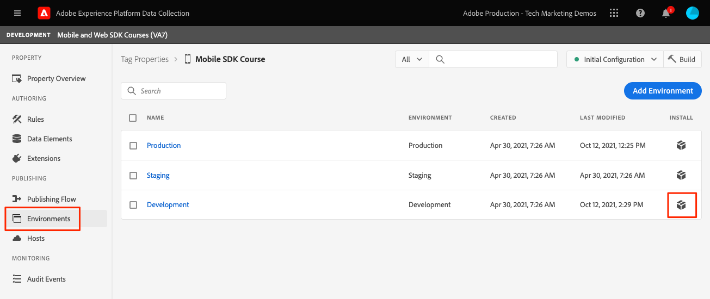

# Configuration d’une propriété de balise

Découvrez comment configurer une propriété de balise dans le [!UICONTROL Collecte de données] .

Les balises dans Adobe Experience Platform Launch représentent la nouvelle génération des fonctionnalités de gestion des balises dʼAdobe. Les balises offrent aux clients un moyen simple de déployer et de gérer toutes les balises dʼanalyse, de marketing et de publicité nécessaires pour offrir des expériences client pertinentes. En savoir plus sur [tags](https://experienceleague.adobe.com/docs/experience-platform/tags/home.html?lang=fr) dans la documentation du produit.

## Conditions préalables

Pour terminer la leçon, vous devez disposer des autorisations nécessaires pour créer une propriété de balise. Il est également utile d’avoir une compréhension de base des balises.

>[!NOTE]
>
> Le platform launch (côté client) est désormais [tags](https://experienceleague.adobe.com/docs/experience-platform/tags/home.html?lang=fr)

## Objectifs d&#39;apprentissage

Dans cette leçon, vous allez :

* Installez et configurez les extensions de balise mobile.
* Générez les instructions d’installation du SDK.

## Configuration initiale

1. Créez une propriété de balise mobile :
   1. Dans le [Interface de collecte de données](https://experience.adobe.com/data-collection/){target="_blank"}, sélectionnez **[!UICONTROL Balises]** dans le volet de navigation de gauche
   1. Sélectionnez **[!UICONTROL Nouvelle propriété]**
      .
   1. Pour le **[!UICONTROL Nom]**, saisissez `Mobile SDK Course`.
   1. Pour le **[!UICONTROL Plateforme]**, sélectionnez **[!UICONTROL Mobile]**.
   1. Sélectionnez **[!UICONTROL Enregistrer]**.

      

      >[!NOTE]
      >
      > Les paramètres de consentement par défaut pour les implémentations de sdk mobile basées sur les périphériques, comme celle que vous effectuez dans ce tutoriel, proviennent de la [!UICONTROL Extension de consentement] et non le [!UICONTROL Confidentialité] dans la configuration de la propriété de balise. Vous allez ajouter et configurer l’extension Consentement plus loin dans cette leçon. Pour plus d’informations, voir [la documentation](https://developer.adobe.com/client-sdks/documentation/privacy-and-gdpr/).

1. Ouvrir la nouvelle propriété
1. Création d’une bibliothèque :

   1. Accédez à **[!UICONTROL Flux de publication]** dans le volet de navigation de gauche.
   1. Sélectionner **[!UICONTROL Ajouter une bibliothèque]**.

      

   1. Pour le **[!UICONTROL Nom]**, saisissez `Initial Build`.
   1. Pour le **[!UICONTROL Environnement]**, sélectionnez **[!UICONTROL Développement]**.
   1. Sélectionner  **[!UICONTROL Ajouter toutes les ressources modifiées]**.
   1. Sélectionner **[!UICONTROL Enregistrement et création pour le développement]**.

      

   1. Enfin, définissez-le comme **[!UICONTROL Bibliothèque de travail]**.
      
1. Sélectionner **[!UICONTROL Extensions]**.

   Les extensions Mobile Core et Profile doivent être préinstallées.

1. Sélectionner **[!UICONTROL Catalogue]**.

   

1. Utilisez la variable [!UICONTROL Rechercher] pour rechercher et installer les extensions suivantes. Aucune de ces extensions ne nécessite de configuration :
   * Identité
   * Assurance AEP

## Configuration d’extension

1. Installez le **Consentement** extension .

   Pour les besoins de ce tutoriel, sélectionnez **[!UICONTROL En attente]**. En savoir plus sur l’extension Consent dans [la documentation](https://developer.adobe.com/client-sdks/documentation/consent-for-edge-network/).

   

1. Installez le **Adobe Experience Platform Edge Network** extension .

   Dans le **[!UICONTROL Configuration Edge]** , sélectionnez le flux de données que vous avez créé dans la [étape précédente](create-datastream.md).

1. Sélectionner **[!UICONTROL Enregistrer dans la bibliothèque et créer]**.

   

## Instructions d’installation du SDK Generate

1. Sélectionner **[!UICONTROL Environnements]**.

1. Sélectionnez la **[!UICONTROL Développement]** icône d’installation.

   

1. Sélectionner **[!UICONTROL iOS]**.

1. Sélectionner **[!UICONTROL Swift]**.

   

1. Les instructions d’installation vous fournissent un bon point de départ pour la mise en oeuvre.

   Vous trouverez des informations supplémentaires [here](https://developer.adobe.com/client-sdks/documentation/getting-started/get-the-sdk/).

   * **[!UICONTROL Identifiant de fichier d’environnement]**: Cet identifiant unique pointe vers votre environnement de développement. Notez cette valeur. Les valeurs d’ID de production/d’évaluation/de développement sont toutes différentes.
   * **[!UICONTROL Podfile]**: Les CocoaPods sont utilisés pour gérer les versions et téléchargements de SDK. Pour en savoir plus, consultez la section [documentation](https://cocoapods.org/).
   * **[!UICONTROL Code d’initialisation]**: Ce bloc de code indique comment importer les SDK requis et enregistrer les extensions au lancement.

>[!NOTE]
>Les instructions d’installation doivent être considérées comme un point de départ et non comme une documentation définitive. Vous trouverez les dernières versions du SDK et des exemples de code dans la [documentation](https://developer.adobe.com/client-sdks/documentation/).

## Architecture des balises mobiles

Si vous connaissez la version web des balises, anciennement Launch, il est important de comprendre les différences sur mobile.

Sur le Web, une propriété de balise est rendue dans JavaScript, qui est ensuite (généralement) hébergée dans le cloud. Ce fichier JS est référencé directement dans le site web.

Dans une propriété de balise mobile, les règles et les configurations sont rendues dans des fichiers JSON hébergés dans le cloud. Les fichiers JSON sont téléchargés et lus par l’extension Mobile Core dans l’application mobile. Les extensions sont des SDK distincts qui fonctionnent ensemble. Si vous ajoutez une extension à votre propriété de balise, vous devez également mettre à jour l’application. Si vous modifiez un paramètre d’extension ou créez une règle, ces modifications sont répercutées dans l’application une fois que vous avez publié la bibliothèque de balises mise à jour.

Suivant : **[Installation des SDK](install-sdks.md)**

>[!NOTE]
>
>Merci d’avoir consacré votre temps à l’apprentissage du SDK Adobe Experience Platform Mobile. Si vous avez des questions, souhaitez partager des commentaires généraux ou avez des suggestions sur le contenu futur, partagez-les à ce sujet. [Article de discussion de la communauté Experience League](https://experienceleaguecommunities.adobe.com/t5/adobe-experience-platform-launch/tutorial-discussion-implement-adobe-experience-cloud-in-mobile/td-p/443796)