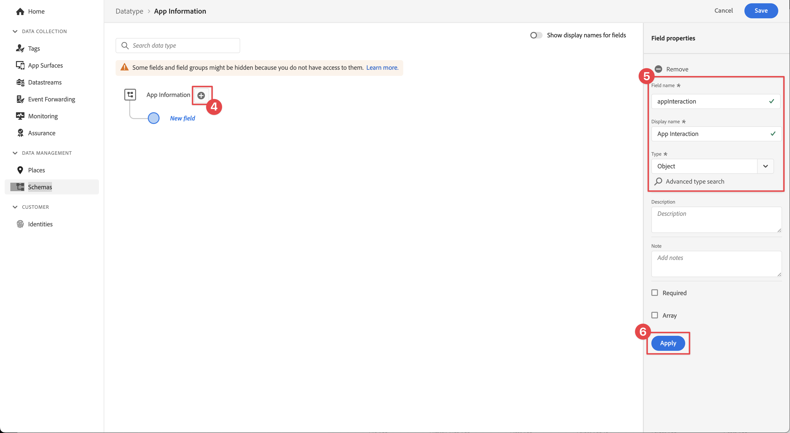
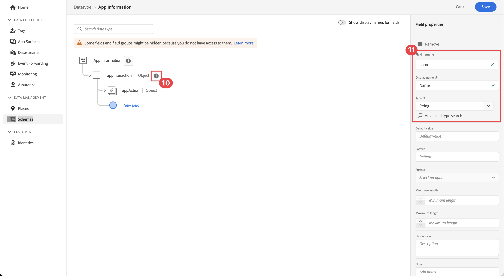

# Créer un schéma XDM

Découvrez comment créer un schéma XDM pour les événements d’application mobile.

La normalisation et l’interopérabilité sont les concepts clés d’Adobe Experience Platform. Le modèle de données d’expérience (XDM), optimisé par Adobe, vise à normaliser les données d’expérience client et à définir des schémas pour la gestion de l’expérience client.

## Que sont les schémas XDM ?

XDM est une spécification documentée publiquement conçue pour améliorer la puissance des expériences digitales. Il fournit des structures et des définitions communes qui permettent à toute application de communiquer avec les services Platform. L’adhésion aux normes XDM permet d’intégrer toutes les données d’expérience client dans une représentation commune afin de fournir des informations de manière plus rapide et intégrée. Vous obtenez des informations précieuses à partir des actions des clients, définissez des audiences de clients par le biais de segments et utilisez les attributs du client à des fins de personnalisation.

Experience Platform utilise des schémas pour décrire la structure des données de manière cohérente et réutilisable. En définissant les données de manière cohérente sur l’ensemble des systèmes, il est plus simple de leur donner du sens et donc d’en tirer profit.

Avant que les données puissent être ingérées dans Platform, il est nécessaire de composer un schéma pour décrire la structure des données et fournir des contraintes au type de données pouvant être contenues dans chaque champ. Les schémas se composent d’une classe de base et de zéro ou plusieurs groupes de champs.

Pour plus d’informations sur le modèle de composition de schémas, notamment sur les principes de conception et les bonnes pratiques, consultez les [principes de base de la composition de schémas](https://experienceleague.adobe.com/fr/docs/experience-platform/xdm/schema/composition) ou la liste de lecture [Modéliser vos données d’expérience client avec XDM](https://experienceleague.adobe.com/fr/playlists/experience-platform-model-your-customer-experience-data-with-xdm).

>[!TIP]
>
>Si vous connaissez les références de conception de solution (SDR) Analytics, vous pouvez considérer un schéma comme un SDR plus robuste. Pour plus d’informations[ consultez la section ](https://experienceleague.adobe.com/fr/docs/analytics-learn/tutorials/implementation/implementation-basics/creating-and-maintaining-an-sdr)Créer et gérer un document de conception de solution (SDR).

## Conditions préalables

Pour suivre la leçon, vous devez disposer des autorisations nécessaires pour créer un schéma Experience Platform.

## Objectifs d’apprentissage

Dans cette leçon, vous allez :

* Création d’un schéma dans l’interface de collecte de données
* Ajout d’un groupe de champs standard au schéma
* Création et ajout d’un groupe de champs personnalisé au schéma

## Accès aux schémas

1. Connectez-vous au Adobe Experience Cloud.

1. Assurez-vous d’être dans le sandbox Experience Platform que vous utilisez pour ce tutoriel.

1. Ouvrez le sélecteur d’applications  (en haut à droite),

1. Sélectionnez **[!UICONTROL Collecte de données]** dans le menu.

   {zoomable="yes"}

   >[!NOTE]
   >
   > Les clients des applications basées sur Platform telles que Real-Time CDP doivent utiliser un sandbox de développement pour ce tutoriel. D’autres clientes et clients utilisent le sandbox de production par défaut.

1. Sélectionnez  **[!UICONTROL Schémas]** sous **[!UICONTROL Gestion des données]** dans le rail de gauche.

   {zoomable="yes"}

Vous êtes maintenant sur la page principale des schémas. La liste des schémas existants vous est présentée. Vous pouvez également voir des onglets correspondant aux blocs de création principaux d’un schéma :

* Les **groupes de champs** sont des composants réutilisables qui définissent un ou plusieurs champs pour capturer des données spécifiques, telles que des détails personnels, les préférences de l’hôtel ou l’adresse.
* Les **classes** définissent les aspects comportementaux des données que le schéma contient. Par exemple : `XDM ExperienceEvent` capture les séries temporelles et les données d’événement, et `XDM Individual Profile` capture les données d’attribut d’un individu.
* Les **types de données** sont utilisés comme types de champs de référence dans les classes ou les groupes de champs de la même manière que les champs littéraux de base.

Les descriptions ci-dessus sont un aperçu général. Pour plus d’informations, consultez la vidéo [Blocs de création de schéma](https://experienceleague.adobe.com/fr/docs/platform-learn/tutorials/schemas/schema-building-blocks) ou lisez [Principes de base de la composition des schémas](https://experienceleague.adobe.com/fr/docs/experience-platform/xdm/schema/composition) dans la documentation du produit.

Dans ce tutoriel, vous allez utiliser le groupe de champs Événement d’expérience client et créer un champ personnalisé pour démontrer le processus.

>[!NOTE]
>
>Adobe continue à ajouter des groupes de champs plus standard. Ils doivent être utilisés dans la mesure du possible. Ces champs sont compris de manière implicite par les services Experience Platform et fournissent une plus grande cohérence lorsqu’ils sont utilisés sur les composants Platform. L’utilisation de groupes de champs standard offre des avantages tangibles, tels que le mappage automatique dans Analytics et les fonctionnalités d’IA dans Platform.

## Architecture du schéma de l’application Luma

Dans un scénario réel, le processus de conception de schéma peut se présenter comme suit :

* Rassemblez les besoins de l’entreprise.
* Recherchez des groupes de champs préconfigurés pour couvrir autant d’exigences que possible.
* Créez des groupes de champs personnalisés pour tous les intervalles.

À des fins d’apprentissage, vous utilisez des groupes de champs préconfigurés et personnalisés.

* **Événement d’expérience client** : groupe de champs prédéfini qui comporte de nombreux champs communs.
* **Informations sur l’application** : groupe de champs personnalisé conçu pour imiter les concepts TrackState/TrackAction Analytics.

<!--Later in the tutorial, you can [update the schema](lifecycle-data.md) to include the **[!UICONTROL AEP Mobile Lifecycle Details]** field group.-->

## Créer un schéma

1. Sélectionnez  **[!UICONTROL Create Schema]**.

1. Dans la boîte de dialogue **[!UICONTROL Créer un schéma]**, sélectionnez **[!UICONTROL Manuel]**. Utilisez **[!UICONTROL Sélectionner]** pour continuer.

   {zoomable="yes"}

1. À l’étape **[!UICONTROL Sélectionner une classe]** de l’assistant **[!UICONTROL Créer un schéma]**, sélectionnez **[!UICONTROL Événement d’expérience]** sous **[!UICONTROL Sélectionner une classe de base pour ce schéma]**.

1. Sélectionnez **[!UICONTROL Suivant]**.

   {zoomable="yes"}

1. À l’étape **[!UICONTROL Nom et révision]** de l’assistant **[!UICONTROL Créer un schéma]**, saisissez un **[!UICONTROL Nom d’affichage du schéma]**, par exemple `Luma Mobile Event Schema` et un [!UICONTROL Description] par exemple `Schema for Luma mobile app experience events`.

   >[!NOTE]
   >
   >Si vous suivez ce tutoriel avec plusieurs personnes sur un seul sandbox ou que vous utilisez un compte partagé, pensez à ajouter ou à ajouter une identification dans le cadre de vos conventions de nommage. Par exemple, au lieu de `Luma Mobile App Event Schema`, utilisez `Luma Mobile App Event Schema - Joe Smith`. Consultez également la remarque dans [Présentation](overview.md).

1. Sélectionnez **[!UICONTROL Terminer]** pour terminer l’assistant.

   {zoomable="yes"}

1. Sélectionnez  **Ajouter** en regard de **[!UICONTROL Groupes de champs]**.

   {zoomable="yes"}

1. Recherchez `Consumer Experience Event`.

1. Sélectionnez  pour prévisualiser les champs et/ou lire la description pour plus d’informations avant de sélectionner un groupe de champs.

1. Sélectionnez **Événement d’expérience client**.

1. Sélectionnez **[!UICONTROL Ajouter des groupes de champs]**.

   {zoomable="yes"}

   Vous revenez à l’écran principal de composition de schémas dans lequel vous pouvez voir tous les champs disponibles.

1. Sélectionnez **[!UICONTROL Enregistrer]**.
1. Sélectionnez  **[!UICONTROL Schémas]** sous **[!UICONTROL Gestion des données]** pour revenir à l’interface principale **[!UICONTROL Schémas]**.

>[!NOTE]
>
>Gardez à l’esprit que vous n’avez pas besoin d’utiliser tous les champs d’un groupe. Vous pouvez également supprimer des champs pour que le schéma reste concis et compréhensible. Si cela s’avère utile, vous pouvez considérer un schéma comme une couche de données vide. Dans votre application, vous renseignez les valeurs appropriées au moment approprié.

Le groupe de champs [!UICONTROL Événement d’expérience client] comporte un type de données appelé [!UICONTROL Informations web] qui décrit des événements tels que les clics sur des pages vues et des liens. Au moment de la rédaction de cet article, il n’y a pas de parité d’application mobile avec cette fonctionnalité, vous allez donc créer la vôtre.

## Créer un type de données personnalisé

Vous commencez par créer un type de données personnalisé décrivant les deux événements :

* Affichage de l’écran
* Interaction avec l’application

1. Sélectionnez l’onglet **[!UICONTROL Types de données]**.

1. Sélectionnez **[!UICONTROL Créer un type de données]**.

   {zoomable="yes"}

1. Fournissez un **[!UICONTROL Nom d’affichage]** et **[!UICONTROL Description]**, par exemple `App Information` et `Custom data type describing "Screen Views" & "App Actions"`

   {zoomable="yes"}

   >[!TIP]
   >
   > Utilisez toujours des [!UICONTROL noms d’affichage] lisibles et descriptifs pour vos champs personnalisés. Cette pratique rend les champs personnalisés plus accessibles aux marketeurs lorsque les champs apparaissent dans des services en aval tels que le créateur de segments.

1. Pour ajouter un champ, sélectionnez le bouton .

1. Ce champ est un objet conteneur pour l’interaction de l’application. Vous devez donc fournir un **[!UICONTROL Nom du champ]** `appInteraction`, **[!UICONTROL Nom d’affichage]** `App Interaction` en Camel-Case, puis sélectionner `Object` dans la liste **[!UICONTROL Type]**.

1. Sélectionnez **[!UICONTROL Appliquer]**.

   {zoomable="yes"}

1. Pour mesurer la fréquence à laquelle une action s’est produite, ajoutez un champ en sélectionnant le bouton  en regard de l’objet **[!UICONTROL appInteraction]** que vous avez créé.

1. Donnez-lui une casse mixte **[!UICONTROL Nom du champ]** `appAction`, **[!UICONTROL Nom d’affichage]** de `App Action` et **[!UICONTROL Type]** `Measure`.

   Cette étape équivaut à un événement de succès dans Adobe Analytics.

1. Sélectionnez **[!UICONTROL Appliquer]**.

   {zoomable="yes"}

1. Ajoutez un champ décrivant le type d’interaction en sélectionnant le bouton  en regard de l’objet **[!UICONTROL appInteraction]**.

1. Donnez-lui un **[!UICONTROL Nom du champ]** `name`, **[!UICONTROL Nom d’affichage]** de `Name` et **[!UICONTROL Type]** `String`.

   Cette étape est l’équivalent d’une dimension dans Adobe Analytics.

   {zoomable="yes"}

1. Faites défiler jusqu’au bas du rail de droite et sélectionnez **[!UICONTROL Appliquer]**.

1. Pour créer un objet `appStateDetails` contenant un champ **[!UICONTROL Mesure]** appelé `screenView` et deux champs **[!UICONTROL Chaîne]** appelés `screenName` et `screenType`, procédez comme vous l&#39;avez fait lors de la création de l&#39;objet **[!UICONTROL appInteraction]**.

1. Sélectionnez **[!UICONTROL Enregistrer]**.

   {zoomable="yes"}

## Ajout d’un groupe de champs personnalisé

Ajoutez maintenant un groupe de champs personnalisé à l’aide de votre type de données personnalisé :

1. Ouvrez le schéma que vous avez créé précédemment dans cette leçon.

1. Sélectionnez  **[!UICONTROL Ajouter]** en regard de **[!UICONTROL Groupes de champs]**.

   {zoomable="yes"}

1. Sélectionnez **[!UICONTROL Créer un groupe de champs]**.

1. Fournissez un **[!UICONTROL Nom d’affichage]** et **[!UICONTROL Description]** par exemple, `App Interactions` et `Fields for app interactions`.

1. Sélectionnez **Ajouter des groupes de champs**.

   {zoomable="yes"}

1. Dans l’écran de composition principal, sélectionnez **[!UICONTROL Interactions d’application**].

1. Ajoutez un champ à la racine du schéma en sélectionnant le bouton  en regard du nom du schéma.

1. Dans le rail de droite, indiquez un **[!UICONTROL Nom du champ]** de `appInformation`, un **[!UICONTROL Nom d’affichage]** de `App Information` et un **[!UICONTROL Type]** de `App Information`.

1. Sélectionnez **[!UICONTROL Interactions de l’application]** dans le menu déroulant **[!UICONTROL Groupe de champs]** pour affecter les champs à votre nouveau groupe de champs.

1. Sélectionnez **[!UICONTROL Appliquer]**.

1. Sélectionnez **[!UICONTROL Enregistrer]**.

   {zoomable="yes"}

>[!NOTE]
>
>Les groupes de champs personnalisés sont toujours placés sous votre identifiant d’organisation Experience Cloud.

>[!SUCCESS]
>
>Vous disposez à présent d’un schéma à utiliser pour la suite du tutoriel.
>
>Merci d’avoir consacré votre temps à découvrir Adobe Experience Platform Mobile SDK. Si vous avez des questions, souhaitez partager des commentaires généraux ou des suggestions sur le contenu futur, partagez-les dans ce [article de discussion de la communauté Experience League](https://experienceleaguecommunities.adobe.com/t5/adobe-experience-platform-data/tutorial-discussion-implement-adobe-experience-cloud-in-mobile/td-p/443796?profile.language=fr).

Suivant : **[Créer un [!UICONTROL flux de données]](create-datastream.md)**
