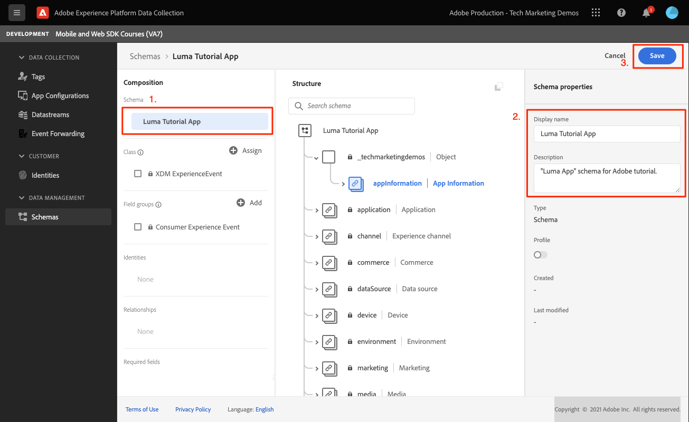
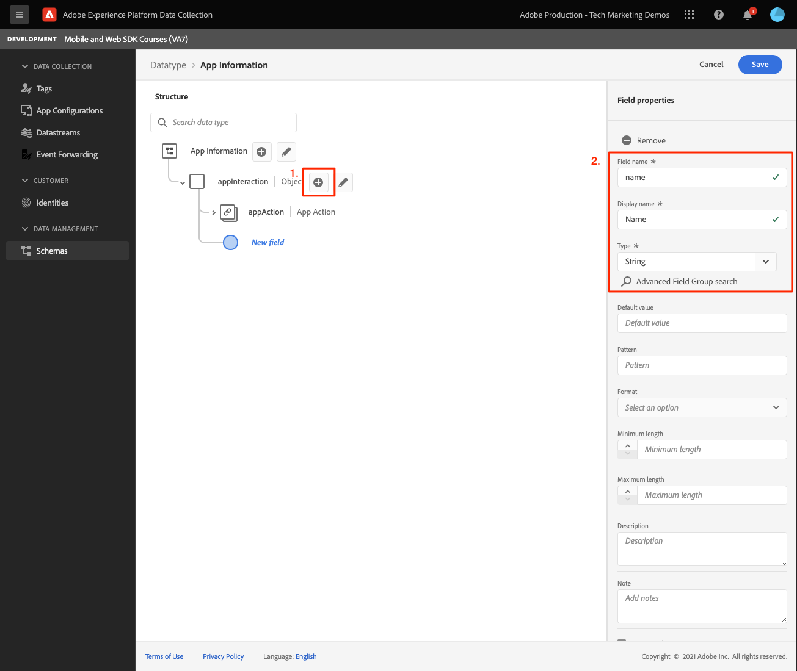

# Créer un schéma XDM

Découvrez comment créer un schéma XDM pour les événements d’application mobile.

>[!INFO]
>
> Ce tutoriel sera remplacé par un nouveau tutoriel utilisant un nouvel exemple d’application mobile à la fin novembre 2023.

La normalisation et l’interopérabilité sont les concepts clés d’Adobe Experience Platform. Le modèle de données d’expérience (XDM), optimisé par Adobe, vise à normaliser les données d’expérience client et à définir des schémas pour la gestion de l’expérience client.

## Que sont les schémas XDM ?

XDM est une spécification documentée publiquement conçue pour améliorer la puissance des expériences digitales. Il fournit des structures et des définitions communes qui permettent à toute application de communiquer avec les services Platform. L’adhésion aux normes XDM permet d’intégrer toutes les données d’expérience client dans une représentation commune afin de fournir des informations de manière plus rapide et intégrée. Vous pouvez obtenir des informations précieuses à partir des actions des clients, définir des audiences de clients par le biais de segments et utiliser les attributs du client à des fins de personnalisation.

Experience Platform utilise des schémas pour décrire la structure des données de manière cohérente et réutilisable. En définissant les données de manière cohérente sur l’ensemble des systèmes, il est plus simple de leur donner du sens et donc d’en tirer profit.

Avant que les données puissent être ingérées dans Platform, il est nécessaire de composer un schéma pour décrire la structure des données et fournir des contraintes au type de données pouvant être contenues dans chaque champ. Les schémas se composent d’une classe de base et de zéro ou plusieurs groupes de champs.

Pour plus d’informations sur le modèle de composition de schémas, y compris les principes de conception et les bonnes pratiques, voir la section [principes de base de la composition des schémas](https://experienceleague.adobe.com/docs/experience-platform/xdm/schema/composition.html?lang=fr) ou le cours [Modèle de vos données d’expérience client avec XDM](https://experienceleague.adobe.com/?recommended=ExperiencePlatform-D-1-2021.1.xdm&amp;lang=fr).

>[!TIP]
>
>Si vous connaissez les DTS (Solution Design Reference) d’Analytics, vous pouvez considérer un schéma comme un DTS plus robuste.

## Conditions préalables

Pour terminer la leçon, vous devez disposer des autorisations nécessaires pour créer un schéma Experience Platform.

## Objectifs d&#39;apprentissage

Dans cette leçon, vous allez :

* Création d’un schéma dans l’interface de collecte de données
* Ajouter un groupe de champs standard au schéma
* Création et ajout d’un groupe de champs personnalisé au schéma

## Accès aux schémas

1. Connectez-vous à Adobe Experience Cloud.

1. Ouvrez le sélecteur d’applications, puis sélectionnez **[!UICONTROL Collecte de données]**

   

1. Vérifiez que vous vous trouvez dans l’environnement de test Experience Platform que vous utilisez pour ce tutoriel.

   >[!NOTE]
   >
   > Les clients d’applications basées sur Platform telles que Real-Time CDP doivent utiliser un environnement de test de développement pour ce tutoriel. Les autres clients utiliseront l’environnement de test de production par défaut.

1. Sélectionner **[!UICONTROL Schémas]** under **[!UICONTROL Data Management]**.

   

Vous vous trouvez maintenant sur la page des schémas principaux et une liste des schémas existants s’affiche. Vous pouvez également voir les onglets correspondant aux blocs de création principaux d’un schéma :

* **Groupes de champs** sont des composants réutilisables qui définissent un ou plusieurs champs pour capturer des données spécifiques, telles que des détails personnels, des préférences d’hôtel ou des adresses.
* **Classes** définir les aspects comportementaux des données que le schéma contient ; Par exemple : `XDM ExperienceEvent` capture les séries temporelles, les données d’événement et `XDM Individual Profile` capture les données d’attribut d’un individu.
* **Types de données** sont utilisés comme types de champs de référence dans des classes ou des groupes de champs de la même manière que les champs littéraux de base.

Les descriptions ci-dessus constituent un aperçu général. Pour plus d’informations, voir [Blocs de création de schéma](https://experienceleague.adobe.com/docs/platform-learn/tutorials/schemas/schema-building-blocks.html?lang=fr) vidéo ou lecture [Principes de base de la composition des schémas](https://experienceleague.adobe.com/docs/experience-platform/xdm/schema/composition.html?lang=fr) dans la documentation du produit.

Dans ce tutoriel, vous utilisez le groupe de champs Événement d’expérience client et créez un groupe personnalisé pour démontrer le processus.

>[!NOTE]
>
>Adobe continue d’ajouter davantage de groupes de champs standard et ils doivent être utilisés chaque fois que cela est possible, car ces champs sont implicitement compris par les services Experience Platform et offrent une plus grande cohérence lorsqu’ils sont utilisés dans les composants Platform. L’utilisation de groupes de champs standard offre des avantages tangibles, tels que le mappage automatique dans les fonctionnalités Analytics et AI dans Platform.

## Architecture du schéma de l’application Luma

Dans un scénario réel, le processus de conception de schéma peut se présenter comme suit :

* Rassemblez les besoins de l’entreprise.
* Recherchez des groupes de champs prédéfinis pour répondre au plus grand nombre d’exigences possible.
* Créez des groupes de champs personnalisés pour les espaces.

À des fins d’apprentissage, vous utiliserez des groupes de champs prédéfinis et personnalisés.

* **Événement d’expérience client**: groupe de champs prédéfini contenant de nombreux champs communs.
* **Informations sur l’application**: groupe de champs personnalisé conçu pour imiter les concepts TrackState/TrackAction Analytics.

<!--Later in the tutorial, you can [update the schema](lifecycle-data.md) to include the **[!UICONTROL AEP Mobile Lifecycle Details]** field group.-->

## Créer un schéma

1. Sélectionner **[!UICONTROL Création d’un schéma]** pour afficher le menu déroulant des options, sélectionnez **[!UICONTROL XDM ExperienceEvent]**.

   

1. Recherchez `Consumer Experience Event`.

1. Vous pouvez prévisualiser les champs et/ou lire la description pour plus de détails avant de sélectionner.

1. Cochez la case, puis **[!UICONTROL Ajouter des groupes de champs]**.

   

   Vous revenez à l’écran principal de composition de schéma où vous pouvez voir tous les champs disponibles.

1. Attribuez un nom à votre schéma en sélectionnant **[!UICONTROL Schéma sans titre]** en haut à gauche, puis en fournissant un **[!UICONTROL Nom d’affichage]** &amp; **[!UICONTROL Description]**, par exemple `Luma Tutorial Mobile` et `"Luma App" schema for Adobe Tutorial`

1. Sélectionnez **[!UICONTROL Enregistrer]**.

   

>[!NOTE]
>
>Gardez à l’esprit que vous n’avez pas à utiliser tous les champs d’un groupe. Si cela s’avère utile, vous pouvez considérer un schéma comme une couche de données vide. Dans votre application, vous renseignez les valeurs appropriées au moment approprié.
>
>La variable `Consumer Experience Event` possède un type de données appelé `Web information`, qui décrit les événements tels que les pages vues et les clics sur les liens. Au moment de la rédaction de cet article, il n’existe pas de parité d’application mobile pour cette fonctionnalité. Vous allez donc créer la vôtre.

## Créer un type de données personnalisé

Vous commencez par créer un type de données personnalisé décrivant les deux événements :

* Affichage d’écran
* Interaction de l’application

1. Sélectionnez la variable **[!UICONTROL Types de données]** , puis sélectionnez **[!UICONTROL Création d’un type de données]**.

   

1. Donnez-lui **[!UICONTROL Nom d’affichage]** et **[!UICONTROL Description]**, par exemple `App Information` et `Custom data type describing "Screen Views" & "App Actions"`

   

   >[!TIP]
   >
   > Toujours utiliser un contenu lisible, descriptif [!UICONTROL noms d’affichage] pour vos champs personnalisés, car cette pratique les rend plus accessibles aux marketeurs lorsque les champs apparaissent dans les services en aval comme le créateur de segments.

1. Pour ajouter un champ, cliquez sur le bouton (+).

   Ce champ est un objet conteneur pour l’interaction de l’application. Donnez-lui un chameau. **[!UICONTROL Nom du champ]** `appInteraction`, **[!UICONTROL nom d&#39;affichage]** `App Interaction`, et **[!UICONTROL type]** `Object`.

1. Sélectionnez **[!UICONTROL Appliquer]**.

   

1. Pour mesurer la fréquence d’exécution d’une action, ajoutez un champ en cliquant sur le bouton (+) en regard de l’option `appInteraction` objet que vous avez créé.

1. Donnez-lui un chameau. **[!UICONTROL Nom du champ]** `appAction`, **[!UICONTROL nom d&#39;affichage]** de `App Action` et **[!UICONTROL type]** `Measure`.

   Cette étape serait l’équivalent d’un événement de succès dans Adobe Analytics.

1. Sélectionnez **[!UICONTROL Appliquer]**.

   

1. Ajoutez un champ décrivant le type d’interaction en cliquant sur le bouton (+) en regard de l’option `appInteraction` .

1. Donnez-lui **[!UICONTROL Nom du champ]** `name`, **[!UICONTROL nom d&#39;affichage]** de `Name` et **[!UICONTROL type]** `String`.

   Cette étape équivaut à une dimension dans Adobe Analytics.

   

1. Faites défiler l’écran vers le bas du rail de droite et sélectionnez **[!UICONTROL Appliquer]**.

1. Suivez le même modèle pour créer une `appStateDetails` objet contenant un champ de mesure appelé `screenView` et deux chaînes appelées `screenName` et `screenType`.

1. Sélectionnez **[!UICONTROL Enregistrer]**.

   

## Ajouter un groupe de champs personnalisé

Ajoutez maintenant un groupe de champs personnalisé à l’aide de votre type de données personnalisé :

1. Ouvrez le schéma que vous avez créé précédemment dans cette leçon.

1. Sélectionner **[!UICONTROL Ajouter]** en regard de **[!UICONTROL Groupes de champs]**.

   

1. Cette fois, vous créez un groupe de champs personnalisé en sélectionnant l’option **[!UICONTROL Créer un groupe de champs]** Bouton radio situé en haut, puis indiquez un nom et une description, par exemple : `App Interactions` et `Fields for app interactions`.

   

1. Depuis l’écran de composition principal, ajoutez un champ à la racine du schéma.

1. Sélectionnez le (+) en regard du nom du schéma.

1. Dans le rail de droite, indiquez un **[!UICONTROL Nom du champ]** de `appInformation`, un nom d’affichage de `App Information`.

1. Sélectionner `App Information` de la **[!UICONTROL Type]** , le type de données que vous avez créé lors de l’exercice précédent.

1. Sélectionnez **[!UICONTROL Appliquer]**.

   

>[!NOTE]
>
>Les groupes de champs personnalisés sont toujours placés sous l’identifiant de votre organisation Experience Cloud.
>
>`_techmarketingdemos` est remplacé par la valeur unique de votre organisation.

Vous devez maintenant utiliser un schéma pour le reste du tutoriel.

Suivant : **[Créez un [!UICONTROL datastream]](create-datastream.md)**

>[!NOTE]
>
>Merci d’investir votre temps à apprendre sur le SDK Adobe Experience Platform Mobile. Si vous avez des questions, souhaitez partager des commentaires généraux ou avez des suggestions sur le contenu futur, partagez-les à ce sujet. [Article de discussion de la communauté Experience League](https://experienceleaguecommunities.adobe.com/t5/adobe-experience-platform-launch/tutorial-discussion-implement-adobe-experience-cloud-in-mobile/td-p/443796)