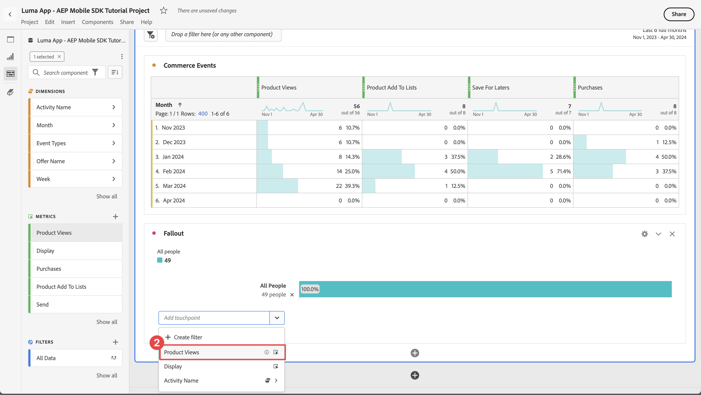

# Rapport et analyse à l’aide de Customer Journey Analytics

Découvrez comment signaler et analyser vos interactions avec Customer Journey Analytics.

Les données d’événement d’application mobile, que vous avez collectées et envoyées à Platform Edge Network dans des leçons précédentes, sont transférées vers les services configurés dans votre flux de données. Si vous avez suivi la leçon [Envoyer des données à Experience Platform](platform.md), ces données sont désormais stockées dans un jeu de données Experience Platform et sont disponibles pour que Customer Journey Analytics les utilise à des fins de création de rapports et d’analyse.

Contrairement à Adobe Analytics, Customer Journey Analytics *utilise* les données des jeux de données créés dans Experience Platform. Les données ne sont pas envoyées directement à Customer Journey Analytics à l’aide de Adobe Experience Platform Mobile SDK, mais sont envoyées aux jeux de données. Les connexions sont ensuite configurées dans Customer Journey Analytics pour sélectionner les jeux de données que vous utiliserez dans vos projets de création de rapports et d’analyse.

Cette leçon du tutoriel porte sur le compte rendu des performances et l’analyse des données capturées à partir de l’application de tutoriel Luma. L’une des fonctionnalités uniques de Customer Journey Analytics consiste à combiner des données provenant de plusieurs sources (CRM, point de vente, application de fidélité, centre d’appel) et canaux (web, mobile, hors ligne) pour obtenir des informations détaillées sur les parcours clients. Cette capacité dépasse le cadre de cette leçon. Voir [Présentation de Customer Journey Analytics](https://experienceleague.adobe.com/fr/docs/analytics-platform/using/cja-overview/cja-overview) pour plus d’informations.

## Conditions préalables

Votre organisation doit être configurée et une autorisation doit être accordée pour Customer Journey Analytics. Vous devez disposer d’un accès administrateur à Customer Journey Analytics.

## Objectifs d’apprentissage

Dans cette leçon, vous allez :

- Créez une connexion pour définir les jeux de données d’Experience Platform à utiliser dans Customer Journey Analytics.
- Créez une vue de données pour préparer les données des jeux de données pour vos rapports et analyses
- Créez un projet pour créer des rapports et des visualisations afin de pouvoir analyser les données de votre application mobile.

La séquence est intentionnelle. Les connexions utilisent des jeux de données et les vues de données utilisent des connexions.

## Création d’une connexion

Une connexion dans Customer Journey Analytics définit les jeux de données (et les données qu’ils contiennent) d’Experience Platform que vous souhaitez utiliser pour la création de rapports et l’analyse.

1. Accédez à l’interface de Customer Journey Analytics à l’aide du menu Applications  en haut à droite.

1. Sélectionnez **[!UICONTROL Connexions]** dans la barre de menus supérieure.

1. Veillez à sélectionner l’onglet **[!UICONTROL Liste]** dans l’interface Connexions. La liste des connexions existantes s’affiche.

1. Sélectionnez **[!UICONTROL Créer une connexion]**.

1. Sur l’écran **[!UICONTROL Connexions]** > **[!UICONTROL Connexion sans titre]**, dans **[!UICONTROL Paramètres de connexion]**

   1. Saisissez un **[!UICONTROL Nom de la connexion]** par exemple `Luma App - AEP Mobile SDK Tutorial Connection`.
   2. Saisissez une **[!UICONTROL Description de la connexion]** par exemple `Connection for the Luma app used in the AEP Mobile SDK tutorial`.

      Dans **[!UICONTROL Paramètres des données]** :

   3. Sélectionnez le sandbox que vous avez utilisé pour collecter les données de votre application mobile, par exemple **[!UICONTROL Cours sur mobile et Web SDK]**.
   4. Sélectionnez **[!UICONTROL moins de 1 million]** dans le champ **[!UICONTROL Nombre moyen d’événements quotidiens]**.

   5. Sélectionnez **[!UICONTROL Ajouter des jeux de données]** pour sélectionner les jeux de données d’Experience Platform à utiliser dans Customer Journey Analytics.

      {zoomable="yes"}

   6. Dans l’assistant **[!UICONTROL Ajouter des jeux de données]**, **[!UICONTROL Sélectionner des jeux de données]**

      1. Sélectionnez les jeux de données suivants :

         - **[!UICONTROL Jeu de données d’événement d’application mobile Luma]**, le jeu de données que vous avez créé dans le cadre de la section [Créer un jeu de données](platform.md#create-a-dataset) de la leçon Experience Platform.
         - **[!UICONTROL ODE DecisionEvents - *nom du sandbox*] prise de décision**
         - **[!UICONTROL Jeux De Données D’Événement De Suivi Des Notifications Push AJO]**

      1. Sélectionnez **[!UICONTROL Suivant]**.

         {zoomable="yes"}

   7. Dans l’étape **[!UICONTROL Ajouter des jeux de données]**, **[!UICONTROL Paramètres des jeux de données]** de l’assistant, vous devez définir les détails de chacun des jeux de données d’événement.
      1. Pour une configuration correcte, consultez les tableaux suivants :

         | Jeu de données | ID de personne  ① | Date et heure ② | Type de source de données ③ | Importer tous les nouveaux ④ de données | Renvoyer tous les ⑤ de données existants |
         |---|---|---|---|---|---|
         | Jeu De Données D’Événement D’Application Mobile Luma | identityMap | date et heure | Données d’application mobile | Activer | Activer |
         | ODE DecisionEvents - *nom du sandbox* prise de décision | identityMap | date et heure | Données d’application mobile | Activer | Activer |
         | Jeu de données d’événement d’expérience de tracking de notifications push AJO | identityMap | date et heure | Données d’application mobile | Activer | Activer |

      1. Sélectionnez **[!UICONTROL Ajouter des jeux de données]**.

         {zoomable="yes"}

1. De retour dans **[!UICONTROL Connexions]** > **[!UICONTROL Application Luma - Connexion du tutoriel AEP Mobile SDK]**, sélectionnez **[!UICONTROL Enregistrer]** pour enregistrer votre connexion.

   {zoomable="yes"}

Vous avez maintenant défini votre connexion et Customer Journey Analytics ajoute les données des jeux de données à sa propre base de données interne. Cette collecte de données peut prendre un certain temps, selon la quantité de données. Pour votre application de tutoriel, attendez quelques heures pour que les données apparaissent dans Customer Journey Analytics.

Pour afficher le statut de votre connexion :

1. Sélectionnez **[!UICONTROL Connexions]** dans l’interface principale de Customer Journey Analytics.
1. Sélectionnez le nom de votre connexion, par exemple **[!UICONTROL Application Luma - Connexion du tutoriel AEP Mobile SDK]**.

Dans le tutoriel **[!UICONTROL Connexions]** > **[!UICONTROL Application Luma - Connexion au tutoriel AEP Mobile SDK]**, vous voyez :

1. Informations sur le nombre total d’enregistrements ajoutés, d’enregistrements ignorés et d’enregistrements supprimés. Veillez à sélectionner **[!UICONTROL Tous les jeux de données]** et à sélectionner une période appropriée pour afficher les détails de votre connexion. Vous pouvez utiliser  pour ouvrir une boîte de dialogue afin de sélectionner la période.
1. Informations pour les jeux de données individuels sur les enregistrements ajoutés, les enregistrements ignorés, les enregistrements supprimés, etc.

   {zoomable="yes"}

## Création d’une vue de données

Une fois les enregistrements ajoutés des jeux de données à Customer Journey Analytics, vous pouvez créer une vue de données pour définir les composants des données sur lesquelles vous souhaitez créer des rapports.

Une vue de données est un conteneur spécifique à Customer Journey Analytics qui vous permet de déterminer comment interpréter les données d’une connexion. Vous pouvez configurer des champs standard et de schéma à partir de n’importe quel jeu de données que vous avez défini dans votre Connexion en tant que composants (dimensions, mesures) dans Analysis Workspace.

Une vue de données dans Customer Journey Analytics offre une énorme flexibilité pour configurer et définir correctement les données à partir de votre connexion. Dans ce tutoriel, vous n’utilisez que la fonctionnalité requise pour la création de rapports et l’analyse. Voir [Vues de données](https://experienceleague.adobe.com/fr/docs/analytics-platform/using/cja-dataviews/data-views) pour plus d’informations.

Pour créer votre vue de données :

1. Accédez à l’interface de Customer Journey Analytics à l’aide du menu Applications  en haut à droite.

1. Sélectionnez **[!UICONTROL Vues de données]** dans la barre de menus supérieure.
1. Sélectionnez **[!UICONTROL Créer une vue de données]**.
1. Dans **[!UICONTROL Vues des données >]**, assurez-vous que l’onglet **[!UICONTROL Configurer]** est sélectionné.

   1. Sélectionnez votre connexion dans la liste déroulante Paramètres de connexion , par exemple **[!UICONTROL Application Luma - Connexion au tutoriel AEP Mobile SDK]**.
   1. Saisissez un Nom pour votre vue de données, par exemple : `Luma App - AEP Mobile SDK Tutorial Data view`.
   1. Sélectionnez **[!UICONTROL Enregistrer et continuer]**.

      {zoomable="yes"}

1. Dans l’onglet **[!UICONTROL Composants]** de la vue **[!UICONTROL Données du tutoriel de l’application Luma - AEP Mobile SDK]**, vous pouvez définir les mesures et les dimensions à utiliser lors de la création de rapports sur votre application mobile. Par défaut, un certain nombre de mesures et de dimensions standard (conjointement appelées composants) sont déjà configurées pour votre vue de données. Mais votre vue de données nécessite davantage de composants.  Pour ajouter un champ de schéma à partir du schéma ou des schémas d’usine définis précédemment (voir la leçon [Créer un schéma](create-schema.md)), sous la forme d’un composant (dimension ou mesure) :

   1. Recherchez le champ de schéma :

      - recherchez le composant à l’aide du champ de recherche  ***[!UICONTROL Rechercher des champs de schéma]***. Par exemple, `productListAdd`, ou

        {zoomable="yes"}

      - Descendez jusqu’au champ de schéma dans  **[!UICONTROL Jeux de données d’événement]** .  Par exemple,  **[!UICONTROL Jeux de données d’événements]**   **[!UICONTROL commerce]** ChevronproductListAddsChevron **&#x200B;**&#x200B;

        {zoomable="yes"}

   1. Faites glisser le champ de schéma spécifique depuis le volet Champs de schéma et déposez-le sur la liste **[!UICONTROL MESURES]** ou **[!UICONTROL DIMENSIONS]** dans le volet [!UICONTROL Composants inclus].

      {zoomable="yes"}

   1. Vous pouvez configurer les paramètres d’un composant. Sélectionnez le composant et configurez les paramètres dans le volet de droite.  Par exemple, vous pouvez renommer **[!UICONTROL commerce.productListAdds]** en `Product Add To Lists` à l’aide du champ **[!UICONTROL PARAMÈTRES DU COMPOSANT]** > **[!UICONTROL Nom du composant]** dans le volet de droite.

      {zoomable="yes"}

      Ou configurez **[!UICONTROL INCLURE/EXCLURE LES VALEURS]**.

      {zoomable="yes"}

   1. Maintenant que vous comprenez comment ajouter des champs à votre vue de données et configurer le composant obtenu, utilisez les tableaux ci-dessous pour obtenir une liste de champs de schéma à ajouter en tant que mesures ou dimensions. Utilisez la valeur de la colonne **Chemin du schéma** du tableau ci-dessous pour rechercher ou accéder au champ de schéma spécifique. Une fois les mesures et les dimensions ajoutées, vérifiez dans la valeur de la colonne **Paramètres des composants** du tableau si des paramètres spécifiques sont requis pour un composant, comme son **[!UICONTROL Nom du composant]** ou la définition de **[!UICONTROL INCLURE/EXCLURE LES VALEURS]**.

      **MESURES**

      | Nom du composant | Jeu de données | Type de données de schéma | Chemin du schéma | Paramètres de composant |
      |---|---|---|---|---|
      | Ignorer | Jeu De Données D’Événement D’Expérience De Suivi Des Notifications Push AJO, Jeu De Données D’Événement D’Application Mobile Luma | Nombre entier | _experience.decisioning. propositionEventType.dismiss | Nom du composant : `Dismiss` |
      | Se désabonner | Jeu De Données D’Événement D’Expérience De Suivi Des Notifications Push AJO, Jeu De Données D’Événement D’Application Mobile Luma | Nombre entier | _experience.decisioning. propositionEventType.unsubscribe | Nom du composant : `Unsubscribe` |
      | Déclencheur | Jeu De Données D’Événement D’Expérience De Suivi Des Notifications Push AJO, Jeu De Données D’Événement D’Application Mobile Luma | Nombre entier | _experience.decisioning. propositionEventType.trigger | Nom du composant : `Trigger` |
      | Affichage | Jeu De Données D’Événement D’Expérience De Suivi Des Notifications Push AJO, Jeu De Données D’Événement D’Application Mobile Luma | Nombre entier | _experience.decisioning. propositionEventType.display | Nom du composant : `Display` |
      | Envoyer | Jeu De Données D’Événement D’Expérience De Suivi Des Notifications Push AJO, Jeu De Données D’Événement D’Application Mobile Luma | Nombre entier | _experience.decisioning. propositionEventType.send | Nom du composant : `Send` |
      | Interaction | Jeu De Données D’Événement D’Expérience De Suivi Des Notifications Push AJO, Jeu De Données D’Événement D’Application Mobile Luma | Nombre entier | _experience.decisioning. propositionEventType.interact | Nom du composant : `Interact` |
      | Événements d’emplacement | Jeu de données d’événement d’expérience de suivi des notifications push AJO, jeu de données d’événement d’application mobile Luma, ODE DecisionEvents - prise de décision sur les cours avec sdk mobile et web | Chaîne | Type d’événement | Nom du composant : `Location Events`  {zoomable="yes"} |
      | Produits vus | Jeu De Données D’Événement D’Application Mobile Luma | Double | commerce.productViews.value | Nom du composant : `Product Views` |
      | Ajout De Produits Aux Listes | Jeu De Données D’Événement D’Application Mobile Luma | Double | commerce.productListAdds.value | Nom du composant : `Product Add To Lists` |
      | Achats | Jeu De Données D’Événement D’Application Mobile Luma | Double | commerce.purchases.value | Nom du composant : `Purchases` |
      | Enregistrer pour plus tard | Jeu De Données D’Événement D’Application Mobile Luma | Double | commerce.saveForLaters.value | Nom du composant : `Save For Laters` |
      | Interactions avec l’application | Jeu De Données D’Événement D’Application Mobile Luma | Double | _techmarketingdemos.appInformation. appInteraction.appAction.value | Nom du composant : `App Interactions` |
      | Vues d’écran | Jeu De Données D’Événement D’Application Mobile Luma | Double | _techmarketingdemos.appInformation. appStateDetails.screenView.value | Nom du composant : `Screen Views` |

      {style="table-layout:auto"}

      >[!NOTE]
      >
      >Notez comment le champ de schéma de la mesure Événements d’emplacement utilise **[!UICONTROL INCLURE/EXCLURE LES VALEURS]** pour compter les types d’événements contenant des `location`.

      La configuration de votre vue de données pour **[!UICONTROL MESURES]** doit correspondre à celle ci-dessous après avoir ajouté tous les champs de schéma du tableau ci-dessus en tant que composant de mesure :

      {zoomable="yes"}

      **DIMENSIONS**

      | Nom du composant | Jeu de données | Type de données de schéma | Chemin du schéma | Paramètres de composant |
      |---|---|---|---|---|
      | Ville | Jeu De Données D’Événement D’Expérience De Suivi Des Notifications Push AJO, Jeu De Données D’Événement D’Application Mobile Luma | Chaîne | placeContext.geo.city | Nom du composant : `City` |
      | Types d’événement | Jeu de données d’événement d’expérience de suivi des notifications push AJO, jeu de données d’événement d’application mobile Luma, ODE DecisionEvents - prise de décision sur les cours avec sdk mobile et web | Chaîne | eventType | Nom du composant : `Event Types` |
      | Nom de l’option de décision | Jeu de données d’événement d’expérience de suivi des notifications push AJO, jeu de données d’événement d’application mobile Luma, ODE DecisionEvents - prise de décision sur les cours avec sdk mobile et web | Chaîne | _experience.decisioning. propositions.items.name | Nom du composant : `Decision Option Name` |
      | Nom de l&#39;interaction de l&#39;application | Jeu De Données D’Événement D’Application Mobile Luma | Chaîne | _techmarketingdemos.appInformation. appInteraction.name | Nom du composant : `App Interaction Name` |
      | Nom de l’écran | Jeu De Données D’Événement D’Application Mobile Luma | Chaîne | _techmarketingdemos.appInformation. appStateDetails.screenName | Nom du composant : `Screen Name` |
      | Nom de l’activité | ODE DecisionEvents - prise de décision de cours avec un sdk mobile et web | Chaîne | _experience.decisioning. propositionDetails.activity.name | Nom du composant : `Activity Name` |
      | Nom de l’offre | ODE DecisionEvents - prise de décision de cours avec un sdk mobile et web | Chaîne | _experience.decisioning. propositionDetails.selections.name | Nom du composant : `Offer Name` |

      {style="table-layout:auto"}

      La configuration de votre vue de données pour **[!UICONTROL DIMENSIONS]** doit correspondre à celle ci-dessous après avoir ajouté tous les champs de schéma du tableau ci-dessus en tant que composant de dimension :

      {zoomable="yes"}

   1. Sélectionnez **[!UICONTROL Enregistrer et continuer]**.

1. L’onglet **[!UICONTROL Paramètres]** de la vue des données du tutoriel **[!UICONTROL application Luma - AEP Mobile SDK]** vous permet de configurer des filtres et des paramètres de session. Aucune configuration supplémentaire n’est requise pour ce tutoriel.

   - Sélectionnez **[!UICONTROL Enregistrer et terminer]**.

Vous avez défini votre vue de données et tout est en place pour commencer à créer vos rapports et visualisations.

## Créer un projet

Les projets Workspace sont utilisés dans Customer Journey Analytics pour créer des rapports et des visualisations. Il existe de nombreuses possibilités de créer des rapports complets et des visualisations attrayantes, mais cela n’entre pas dans le cadre de ce tutoriel. Voir [Présentation de Workspace](https://experienceleague.adobe.com/fr/docs/customer-journey-analytics-learn/tutorials/analysis-workspace/workspace-projects/analysis-workspace-overview) et [Créer un nouveau projet](https://experienceleague.adobe.com/fr/docs/customer-journey-analytics-learn/tutorials/analysis-workspace/workspace-projects/build-a-new-project) pour plus d’informations.

Dans cette section de la leçon, vous allez créer un projet qui affiche des rapports et des visualisations sur :

- Utilisation de l’application : utilisation des informations sur les interactions de l’écran et de l’application.
- Commerce : à l’aide des événements commerciaux, tels que la consultation des produits, l’ajout au panier et l’achat.
- Offres : à l’aide des offres affichées, événements dans l’application.
- Visites de magasin : à l’aide des événements de limite géographique (simulés) de l’application.

Pour créer votre projet :

1. Accédez à l’interface de Customer Journey Analytics à l’aide du menu Applications  en haut à droite.

1. Sélectionnez **[!UICONTROL Workspace]** dans la barre de menus supérieure.

1. Sélectionnez **[!UICONTROL Créer un projet]**.

   1. Sélectionnez **[!UICONTROL Projet Workspace vierge]** dans la boîte de dialogue contextuelle.

   1. Sélectionnez **[!UICONTROL Créer]**.

      {zoomable="yes"}

1. L’interface **[!UICONTROL Nouveau projet]** s’affiche. Dans cette interface, vous créez vos rapports et visualisations.

1. Sélectionnez le nom du projet (**[!UICONTROL Nouveau projet]**) et indiquez votre propre nom pour le projet. Par exemple : `Luma App - AEP Mobile SDK Tutorial Project`.
   {zoomable="yes"}

1. Pour enregistrer le projet, sélectionnez **[!UICONTROL Projet]** > **[!UICONTROL Enregistrer]**.
   {zoomable="yes"}

1. Dans la boîte de dialogue **[!UICONTROL Enregistrer]**, ignorez tous les autres champs et sélectionnez **[!UICONTROL Enregistrer]**.
   {zoomable="yes"}

>[!IMPORTANT]
>
>   N’oubliez pas d’enregistrer votre projet régulièrement, sinon vos modifications seront perdues. Vous pouvez enregistrer rapidement votre projet à l’aide de **[!UICONTROL ctrl + s]** (Windows) ou **[!UICONTROL ⌘(cmd) + s]** (macOS).

Vous avez maintenant configuré votre projet. Un tableau à structure libre est fourni par défaut. Avant d’ajouter des composants, assurez-vous que le panneau à structure libre utilise la vue de données et la période correctes.

1. Sélectionnez la vue de données dans la liste déroulante. Par exemple, **[!UICONTROL Application Luma - Vue de données du tutoriel AEP Mobile SDK]**. Si votre vue de données ne s’affiche pas dans la liste, sélectionnez **[!UICONTROL Tout afficher]** au bas de la liste déroulante.
   {zoomable="yes"}

1. Pour définir la période appropriée pour le panneau, sélectionnez le paramètre prédéfini par défaut **[!UICONTROL Ce mois-ci]** saisissez une date de début et de fin personnalisée, ou utilisez un **[!UICONTROL paramètre prédéfini]** (comme **[!UICONTROL 6 derniers mois complets]**) et sélectionnez **[!UICONTROL Appliquer]**.
   {zoomable="yes"}

### Utilisation de l’application

Vous êtes maintenant prêt à créer des rapports sur l’utilisation de l’application. Vous avez ajouté le code nécessaire dans l’application pour enregistrer les interactions avec l’application et les écrans utilisés dans l’application (voir la leçon [Suivi des événements](events.md)) et vous souhaitez maintenant créer des rapports sur ces données.

#### Noms d’écran

Pour créer des rapports sur les écrans affichés dans l’application :

1. Renommez votre panneau **[!UICONTROL à structure libre]** en `App Usage`.

1. Renommez votre **[!UICONTROL tableau à structure libre]** en `Screen Names`.

1. Sélectionnez **[!UICONTROL Tout afficher]** sous la liste **[!UICONTROL MESURES]**.

1. Faites glisser et déposez le composant **[!UICONTROL Vues d’écran]** sur [!UICONTROL _Déposez une **mesure**&#x200B;ici (ou tout autre composant_)].
   {zoomable="yes"}
Votre tableau à structure libre affiche désormais les vues d’écran pour chaque jour de la période sélectionnée. Cependant, vous souhaitez afficher le nombre de vues d’écran pour chacun des différents écrans utilisés dans l’application.

1. Pour afficher la liste **[!UICONTROL DIMENSIONS]** des composants, sélectionnez  afin de supprimer le filtre  **[!UICONTROL Mesures]** du rail des composants.
   {zoomable="yes"}

1. Sélectionnez **[!UICONTROL Tout afficher]** sous la liste **[!UICONTROL DIMENSIONS]**.

1. Faites glisser et déposez le composant **[!UICONTROL Nom de l’écran]** dans l’en-tête **[!UICONTROL Jour]**. L’opération affiche  **[!UICONTROL Remplacer]** pour indiquer le remplacement de la dimension.
   {zoomable="yes"}

Le premier tableau à structure libre de votre rapport est terminé.

{zoomable="yes"}

>[!NOTE]
>
>Enregistrez votre projet avant de continuer.

#### Interactions avec l’application

Ensuite, vous allez créer un tableau à structure libre pour rendre compte de la manière dont les utilisateurs et utilisatrices ont interagi avec l’application.

1. Sélectionnez  et dans la fenêtre contextuelle  pour ajouter un nouveau tableau à structure libre.
   {zoomable="yes"}

1. Renommez **[!UICONTROL tableau à structure libre (2)]** en `App Interactions`.

1. Effectuez un glisser-déposer de la mesure **[!UICONTROL Interactions d’application]** sur [!UICONTROL _Déposez une **mesure**&#x200B;ici (ou tout autre composant_)].

1. Faites glisser et déposez la dimension **[!UICONTROL Nom de l’interaction de l’application]** dans l’en-tête **[!UICONTROL Jour]** pour remplacer cette dimension.

Votre deuxième rapport est maintenant prêt, affichant les interactions de l’application.
{zoomable="yes"}

Les informations sont limitées, principalement parce que vous avez implémenté `MobileSDK.shared.sendAppInteractionEvent(actionName: "<actionName>")` appels API uniquement sur l’écran de connexion. Si vous ajoutez cet appel API à d’autres écrans de votre application, ce rapport devient plus informatif.

>[!NOTE]
>
>Enregistrez votre projet avant de continuer.

### Commerce

Vous souhaitez désormais signaler, dans un panneau distinct, les événements commerciaux se produisant dans l’application.

#### Événements Commerce

1. Sélectionnez  en dehors du panneau [!UICONTROL Utilisation des applications] actuel pour créer un panneau.
   {zoomable="yes"}

1. Veillez à sélectionner la période appropriée.

1. Sélectionnez  **[!UICONTROL Tableau à structure libre]** pour créer un tableau à structure libre.
   {zoomable="yes"}

1. Renommez **[!UICONTROL Panneau]** en `Commerce`.

1. Renommez **[!UICONTROL tableau à structure libre]** en `Commerce Events`.

1. Effectuez un glisser-déposer de la mesure **[!UICONTROL Vues des produits]** sur pour [!UICONTROL _Déposez une **mesure**&#x200B;ici (ou tout autre composant_)].

1. Faites glisser et déposez la mesure **[!UICONTROL Ajout de produits aux listes]** à droite de la colonne **[!UICONTROL Vues des produits]** pour insérer cette colonne dans le tableau à structure libre. Assurez-vous que **[!UICONTROL + Ajouter]** (en bleu) s’affiche lors de l’insertion de la colonne.
   {zoomable="yes"}

1. Répétez l’étape précédente pour ajouter la mesure **[!UICONTROL Enregistrer pour plus tard]** et la mesure **[!UICONTROL Achats]** au tableau à structure libre.

1. Faites glisser et déposez la dimension **[!UICONTROL Mois]** en haut de la dimension **[!UICONTROL Jour]** pour remplacer les rapports quotidiens par des rapports mensuels.

Votre rapport d’événements Commerce est terminé.

{zoomable="yes"}

>[!NOTE]
>
>Enregistrez votre projet avant de continuer.

#### Abandon

Ensuite, vous allez créer une visualisation des abandons pour l’entonnoir de commerce qui montre le nombre d’utilisateurs qui ont consulté des produits et qui ont ajouté ces produits à leur panier, et à partir de là, le nombre d’utilisateurs qui ont enregistré ces produits pour plus tard.

1. Sélectionnez  dans le panneau **[!UICONTROL Commerce]** et dans la fenêtre contextuelle, sélectionnez  (représentant la visualisation des abandons).

1. Sélectionnez **[!UICONTROL Vues des produits]** dans la liste déroulante [!UICONTROL *Ajouter un point de contact*].
   {zoomable="yes"}
Vous pouvez également faire glisser et déposer la dimension **[!UICONTROL Vue des produits]** sous la dimension **[!UICONTROL Toutes les personnes]** dans la visualisation **[!UICONTROL Abandons]**.

1. Répétez l’étape ci-dessus pour les dimensions **[!UICONTROL Ajout de produit aux listes]** et **[!UICONTROL Achats]**.

Votre rapport de visualisation des abandons est terminé.
{zoomable="yes"}

>[!NOTE]
>
>Enregistrez votre projet avant de continuer.

### Offres

Vous souhaitez générer des rapports sur le nombre d’offres et les offres présentées aux utilisateurs et utilisatrices de votre application.

#### Monthly Overview

1. Sélectionnez  en dehors du panneau Commerce actuel, pour créer un nouveau panneau.

1. Renommez le **[!UICONTROL Panneau]** en `Offers`.

1. Veillez à sélectionner la période appropriée.

1. Sélectionnez  Tableau à structure libre pour créer un tableau à structure libre.

1. Renommez le **[!UICONTROL tableau à structure libre]** en `Monthly Overview`.

1. Faites glisser et déposez la mesure **[!UICONTROL Affichage]** sur pour [!UICONTROL _Déposez une **mesure**&#x200B;ici (ou tout autre composant_)].

1. Faites glisser et déposez la dimension **[!UICONTROL Mois]** dans la colonne **[!UICONTROL Jour]** pour remplacer la dimension.

Votre présentation mensuelle des offres est terminée.

{zoomable="yes"}

>[!NOTE]
>
>Enregistrez votre projet avant de continuer.

#### Offres aux personnes

Vous souhaitez également disposer d’un rapport indiquant les offres présentées en quels nombres aux utilisateurs et utilisatrices de l’application.

1. Sélectionnez  dans le panneau **[!UICONTROL Offres]** et  dans la fenêtre contextuelle pour ajouter un nouveau tableau à structure libre.

1. Renommez **[!UICONTROL tableau à structure libre (2)]** en `People`.

1. Faites glisser et déposez la mesure **[!UICONTROL Personnes]** sur pour [!UICONTROL _Déposez une **mesure**&#x200B;ici (ou tout autre composant_)].

1. Faites glisser et déposez la colonne **[!UICONTROL Nom de l’activité]** sur la colonne **[!UICONTROL Jour]** pour remplacer la dimension.

1. Cliquez avec le bouton droit de la souris sur la ligne, identifiant une ou plusieurs des décisions d’offre que vous avez définies dans la leçon [Créer et afficher des offres avec gestion des décisions](journey-optimizer-offers.md). Par exemple, **[!UICONTROL Luma - Décision sur l’application mobile]**.

1. Dans le menu contextuel, sélectionnez **[!UICONTROL Répartition]** > **[!UICONTROL Dimensions]** > **[!UICONTROL Nom de l’offre]**. Cette sélection répartit la dimension Nom de l’activité en Noms des offres.
   {zoomable="yes"}

Le rapport Offres aux personnes est terminé.

{zoomable="yes"}

>[!NOTE]
>
>Enregistrez votre projet avant de continuer.

### Visites de magasin

Enfin, vous souhaitez créer des rapports sur les visites de magasin.

1. Sélectionnez  en dehors du panneau Offres actuel pour créer un nouveau panneau.

1. Renommez le **[!UICONTROL Panneau]** en `Store Visits`.

1. Veillez à sélectionner la période appropriée.

1. Sélectionnez  Tableau à structure libre pour créer un tableau à structure libre.

1. Renommez **[!UICONTROL tableau à structure libre]** en `Store Entries / Exits Across Cities`.

1. Faites glisser et déposez la mesure **[!UICONTROL Événements d’emplacement]** sur pour [!UICONTROL _Déposez une **mesure**&#x200B;ici (ou tout autre composant_)]. Le rapport affiche désormais un aperçu quotidien de tous les événements de localisation qui se sont produits dans l’application. Rappelez-vous comment vous avez spécifiquement configuré cette dimension dans le cadre de votre [vue de données](#create-a-data-view).

1. Faites glisser et déposez la dimension **[!UICONTROL Ville]** dans l’en-tête de colonne **[!UICONTROL Jour]** pour remplacer la dimension. Le rapport affiche désormais les villes pour les événements de localisation.

1. Pour supprimer des événements de géolocalisation sans ville associée, sélectionnez , et dans la fenêtre contextuelle **[!UICONTROL Rechercher]**, désactivez **[!UICONTROL Inclure « Aucune valeur »]**, puis sélectionnez **[!UICONTROL Appliquer]**.

   {zoomable="yes"}

   Cette action supprime la ligne **[!UICONTROL Aucune valeur]** du rapport.

1. Sélectionnez toutes les lignes du tableau, cliquez avec le bouton droit de la souris, puis, dans le menu contextuel, sélectionnez Répartition > Dimension > Types d’événement.

Votre rapport Visites de boutique est terminé. Vous disposez désormais d’un rapport qui indique les utilisateurs se trouvant à proximité de vos magasins (comme vous l’avez défini dans la leçon [Places](places.md)).

{zoomable="yes"}

Notez que si vous souhaitez vraiment signaler les personnes qui visitent physiquement votre magasin, vous pouvez utiliser des balises. Mais j&#39;espère que vous avez saisi le concept de rapport sur les données de géolocalisation.

## Étapes suivantes

Vous devriez maintenant avoir une compréhension de base de la manière de générer des rapports et de visualiser l’utilisation de votre application mobile, vos interactions, etc. à l’aide de Customer Journey Analytics.

>[!SUCCESS]
>
>
>Merci d’avoir consacré votre temps à découvrir Adobe Experience Platform Mobile SDK. Si vous avez des questions, souhaitez partager des commentaires généraux ou des suggestions sur le contenu futur, partagez-les dans ce [article de discussion de la communauté Experience League](https://experienceleaguecommunities.adobe.com/t5/adobe-experience-platform-data/tutorial-discussion-implement-adobe-experience-cloud-in-mobile/td-p/443796?profile.language=fr).

Suivant : **[Conclusion et prochaines étapes](conclusion.md)**
