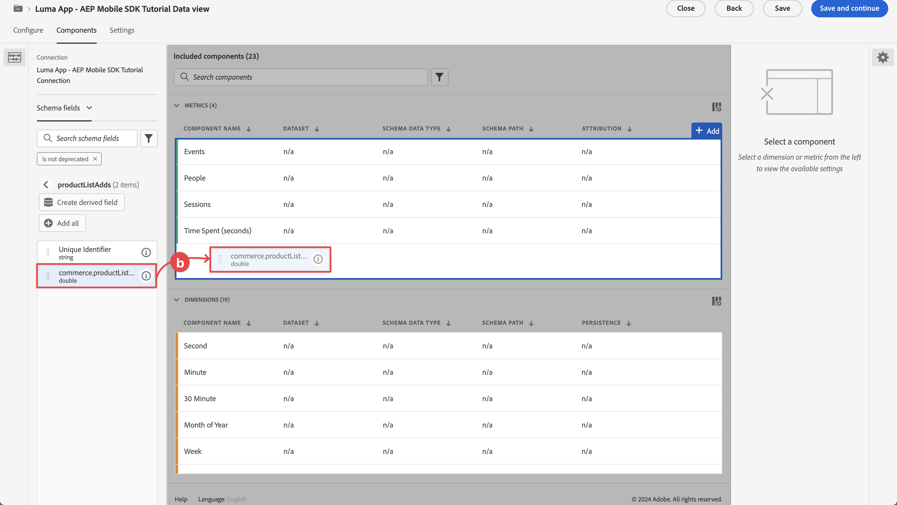
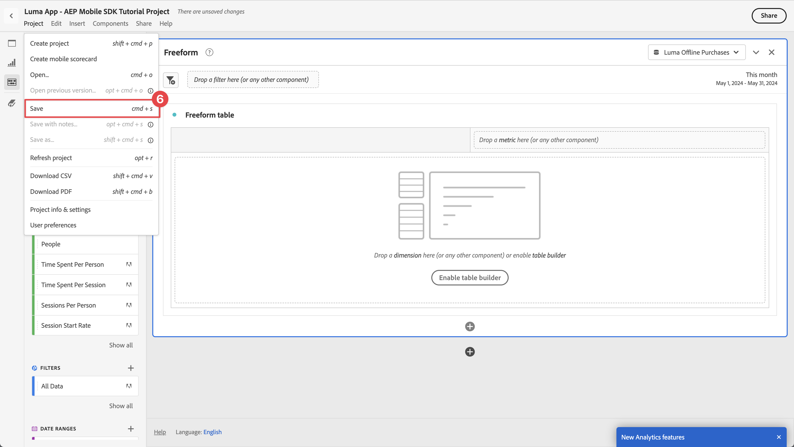
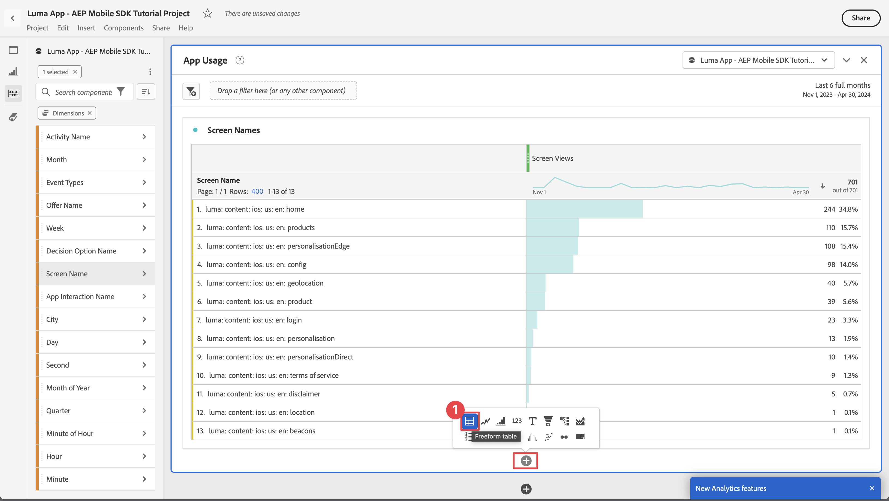
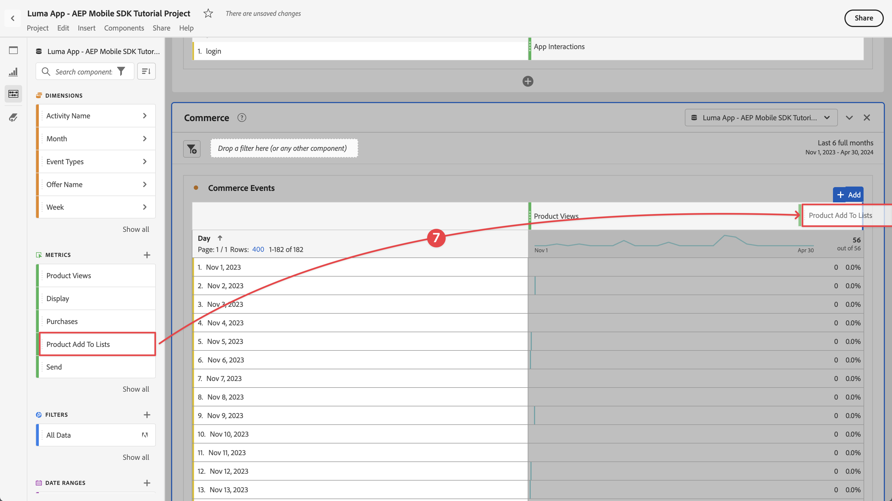

# Rapport et analyse à l’aide de Customer Journey Analytics

Découvrez comment créer des rapports et analyser les interactions de votre application mobile avec Customer Journey Analytics.

Les données d’événement d’application mobile, que vous avez collectées et envoyées à l’Edge Network Platform dans les leçons précédentes, sont transférées aux services configurés dans votre flux de données. Si vous avez suivi la leçon [Envoyer des données à l’Experience Platform](platform.md), ces données sont désormais stockées dans un jeu de données Experience Platform et peuvent être utilisées par Customer Journey Analytics pour la création de rapports et l’analyse.

Contrairement à Adobe Analytics, Customer Journey Analytics *utilise des données* de jeux de données créés dans Experience Platform. Les données ne sont pas directement envoyées à Customer Journey Analytics à l’aide du SDK Adobe Experience Platform Mobile, mais elles sont envoyées aux jeux de données. Les connexions sont ensuite configurées dans Customer Journey Analytics pour sélectionner les jeux de données que vous utiliserez dans vos projets de création de rapports et d’analyse.

Cette leçon du tutoriel porte sur la création de rapports et l’analyse des données capturées à partir de l’application de tutoriel Luma. L’une des fonctionnalités uniques de Customer Journey Analytics consiste à combiner des données provenant de plusieurs sources (CRM, point de vente, application de fidélité, centre d’appel) et canaux (web, mobile, hors ligne) afin d’obtenir des informations détaillées sur les parcours client. Cette capacité dépasse le cadre de cette leçon. Pour plus d’informations, voir [Présentation du Customer Journey Analytics](https://experienceleague.adobe.com/fr/docs/analytics-platform/using/cja-overview/cja-overview) .

## Conditions préalables

Votre organisation doit être configurée et l’autorisation doit être accordée pour Customer Journey Analytics. Vous devez disposer d’un accès administrateur à Customer Journey Analytics.

## Objectifs d&#39;apprentissage

Dans cette leçon, vous allez :

- Créez une connexion pour définir les jeux de données de l’Experience Platform que vous souhaitez utiliser dans Customer Journey Analytics.
- Créer une vue de données pour préparer les données des jeux de données à vos rapports et analyses
- Créez un projet pour créer des rapports et des visualisations afin d’analyser les données de votre application mobile.

La séquence est intentionnelle. Les connexions utilisent des jeux de données et les vues de données utilisent des connexions.

## Création d’une connexion

Une connexion en Customer Journey Analytics définit les jeux de données (et les données de ces jeux de données) de l’Experience Platform que vous souhaitez utiliser pour la création de rapports et l’analyse.

1. Accédez à l’interface du Customer Journey Analytics à l’aide du menu Applications  en haut à droite.

1. Sélectionnez **[!UICONTROL Connexions]** dans la barre de menu supérieure.

1. Assurez-vous de sélectionner l’onglet **[!UICONTROL Liste]** dans l’interface Connexions. Vous voyez une liste des connexions existantes.

1. Sélectionnez **[!UICONTROL Créer une connexion]**.

1. Dans l&#39;écran **[!UICONTROL Connexions]** > **[!UICONTROL Connexion sans titre]**, dans **[!UICONTROL Paramètres de connexion]**

   1. Saisissez un **[!UICONTROL nom de connexion]**, par exemple `Luma App - AEP Mobile SDK Tutorial Connection`.
   2. Saisissez une **[!UICONTROL description de la connexion]**, par exemple `Connection for the Luma app used in the AEP Mobile SDK tutorial`.

      Dans **[!UICONTROL Paramètres des données]** :

   3. Sélectionnez l’environnement de test que vous avez utilisé pour collecter les données de votre application mobile, par exemple **[!UICONTROL Cours de SDK mobile et web]**.
   4. Sélectionnez **[!UICONTROL moins de 1 million]** dans le **[!UICONTROL nombre moyen d&#39;événements quotidiens]**.

   5. Sélectionnez **[!UICONTROL Ajouter des jeux de données]** pour sélectionner les jeux de données de l’Experience Platform que vous souhaitez utiliser dans Customer Journey Analytics.

      

   6. Dans l’assistant **[!UICONTROL Ajouter des jeux de données]**, **[!UICONTROL Sélectionner des jeux de données]** ,

      1. Sélectionnez les jeux de données suivants :

         - **[!UICONTROL Jeu de données d’événement d’application mobile Luma]**, le jeu de données que vous avez créé dans la section [Créer un jeu de données](platform.md#create-a-dataset) de la leçon Experience Platform.
         - **[!UICONTROL ODE DecisionEvents - *nom de l’environnement de test*] prise de décision**
         - **[!UICONTROL Jeux de données d’événement de suivi push AJO]**

      1. Sélectionnez **[!UICONTROL Suivant]**.

         

   7. Dans l’étape **[!UICONTROL Ajouter des jeux de données]** de l’assistant **[!UICONTROL Paramètres des jeux de données]**, vous devez définir les détails de chacun des jeux de données d’événement.
      1. Consultez les tableaux suivants pour connaître la configuration appropriée :

         | Jeu de données | ID de personne 1 | Horodatage 2 | Type de source de données : dates limites | Importer toutes les nouvelles données | Renvoi de toutes les ⑤ de données existantes |
         |---|---|---|---|---|---|
         | Jeu de données d’événement d’application mobile Luma | identityMap | date et heure | Données de l’application mobile | enable | enable |
         | ODE DecisionEvents - *nom de l’environnement de test* prise de décision | identityMap | date et heure | Données de l’application mobile | enable | enable |
         | Jeu de données d’événement d’expérience de tracking de notifications push AJO | identityMap | date et heure | Données de l’application mobile | enable | enable |

      1. Sélectionnez **[!UICONTROL Ajouter des jeux de données]**.

         

1. De retour dans **[!UICONTROL Connexions]** > **[!UICONTROL Luma App - AEP Mobile SDK Tutorial Connection]**, sélectionnez **[!UICONTROL Enregistrer]** pour enregistrer votre connexion.

   

Vous avez maintenant défini votre connexion et Customer Journey Analytics ajoute les données des jeux de données à sa propre base de données interne. Cette collecte de données peut prendre un certain temps, selon la quantité de données. Pour votre application de tutoriel, prévoyez quelques heures pour que les données s’affichent en Customer Journey Analytics.

Pour afficher l’état de votre connexion :

1. Sélectionnez **[!UICONTROL Connexions]** dans l’interface principale de Customer Journey Analytics.
1. Sélectionnez le nom de votre connexion, par exemple **[!UICONTROL Application Luma - AEP Mobile SDK Tutorial Connection]**.

Dans la **[!UICONTROL connexion]** > **[!UICONTROL Luma App - AEP Mobile SDK Connection]**, vous voyez :

1. Informations sur le total des enregistrements ajoutés, des enregistrements ignorés et des enregistrements supprimés. Veillez à sélectionner **[!UICONTROL Tous les jeux de données]** et à sélectionner une période appropriée pour afficher les détails sur votre connexion. Vous pouvez utiliser  pour ouvrir une boîte de dialogue afin de sélectionner la période.
1. Informations relatives à des jeux de données individuels sur des enregistrements ajoutés, des enregistrements ignorés, des enregistrements supprimés, etc.

   

## Création d’une vue de données

Une fois les enregistrements ajoutés des jeux de données à Customer Journey Analytics, vous pouvez créer une vue de données pour définir les composants des données sur lesquels vous souhaitez créer des rapports.

Une vue de données est un conteneur spécifique au Customer Journey Analytics qui vous permet de déterminer comment interpréter les données d’une connexion. Vous pouvez configurer des champs standard et de schéma à partir des jeux de données que vous avez définis dans votre connexion en tant que composants (dimensions, mesures) dans Analysis Workspace.

Une vue de données dans Customer Journey Analytics offre une flexibilité énorme pour configurer et définir correctement les données de votre connexion. Dans ce tutoriel, vous utilisez uniquement les fonctionnalités requises pour vos rapports et analyses. Voir [Vues de données](https://experienceleague.adobe.com/fr/docs/analytics-platform/using/cja-dataviews/data-views) pour plus d’informations.

Pour créer votre vue de données :

1. Accédez à l’interface du Customer Journey Analytics à l’aide du menu Applications  en haut à droite.

1. Sélectionnez **[!UICONTROL Vues de données]** dans la barre de menu supérieure.
1. Sélectionnez **[!UICONTROL Créer une vue de données]**.
1. Dans **[!UICONTROL Vues de données >]**, assurez-vous que l’onglet **[!UICONTROL Configurer]** est sélectionné.

   1. Sélectionnez votre connexion dans la liste déroulante Paramètres de connexion, par exemple **[!UICONTROL Connexion à l’application Luma - Tutoriel SDK AEP Mobile]**.
   1. Saisissez un Nom pour votre vue de données, par exemple : `Luma App - AEP Mobile SDK Tutorial Data view`.
   1. Sélectionnez **[!UICONTROL Enregistrer et continuer]**.

      

1. Dans l’onglet **[!UICONTROL Composants]** de la vue **[!UICONTROL Tutoriel sur les données de l’application Luma - SDK AEP Mobile]**, vous pouvez définir les mesures et les dimensions à utiliser lors de la création de rapports sur votre application mobile. Par défaut, un certain nombre de mesures et de dimensions standard (référencées conjointement à un composant) sont déjà configurées pour votre vue de données. Mais votre vue de données nécessite plus de composants.  Pour ajouter un champ de schéma à partir de votre schéma défini précédemment ou de vos schémas d’usine (voir la leçon [Créer un schéma](create-schema.md) ), en tant que composant (dimension ou mesure) :

   1. Recherchez le champ de schéma :

      - recherchez le composant à l’aide du champ de recherche  ***[!UICONTROL Rechercher des champs de schéma]***. Par exemple, `productListAdd` ou

        

      - Parcourez jusqu’au champ de schéma dans  **[!UICONTROL Event datasets]** .  Par exemple,  **[!UICONTROL Jeux de données d’événement]**   **&#x200B;**&#x200B;  **[!UICONTROL productListAdds]** &rbrace;

        

   1. Faites glisser le champ de schéma spécifique depuis le volet Champs de schéma et déposez-le sur la liste **[!UICONTROL MESURES]** ou **[!UICONTROL DIMENSIONS]** dans le volet [!UICONTROL Composants inclus].

      

   1. Vous pouvez configurer les paramètres d’un composant. Sélectionnez le composant et configurez les paramètres dans le volet de droite.  Par exemple, vous pouvez renommer **[!UICONTROL commerce.productListAdds]** en `Product Add To Lists` à l’aide du champ **[!UICONTROL PARAMÈTRES DU COMPOSANT]** > **[!UICONTROL Nom du composant]** dans le volet de droite.

      

      Ou configurez **[!UICONTROL INCLURE LES VALEURS D’EXCLUSION]**.

      

   1. Maintenant que vous comprenez comment ajouter des champs à votre vue de données et configurer le composant résultant, utilisez les tableaux ci-dessous pour obtenir une liste de champs de schéma à ajouter en tant que mesures ou dimensions. Utilisez la valeur de colonne **Chemin du schéma** du tableau ci-dessous pour rechercher ou parcourir le champ de schéma spécifique. Une fois les mesures et les dimensions ajoutées, vérifiez la valeur de colonne **Paramètres du composant** dans le tableau si des paramètres spécifiques sont requis pour un composant, comme son **[!UICONTROL nom de composant]** ou la définition de **[!UICONTROL INCLURE LES VALEURS D’EXCLUSION]**.

      **MESURES**

      | Nom du composant | Jeu de données | Type de données de schéma | Chemin du schéma | Paramètres des composants |
      |---|---|---|---|---|
      | Ignorer | Jeu de données d’événement de suivi push AJO, jeu de données d’événement d’application mobile Luma | Nombre entier | _experience.decisioning. propositionEventType.dismiss | Nom du composant : `Dismiss` |
      | Se désabonner | Jeu de données d’événement de suivi push AJO, jeu de données d’événement d’application mobile Luma | Nombre entier | _experience.decisioning. propositionEventType.unsubscribe | Nom du composant : `Unsubscribe` |
      | Déclencheur | Jeu de données d’événement de suivi push AJO, jeu de données d’événement d’application mobile Luma | Nombre entier | _experience.decisioning. propositionEventType.trigger | Nom du composant : `Trigger` |
      | Affichage | Jeu de données d’événement de suivi push AJO, jeu de données d’événement d’application mobile Luma | Nombre entier | _experience.decisioning. propositionEventType.display | Nom du composant : `Display` |
      | Envoyer | Jeu de données d’événement de suivi push AJO, jeu de données d’événement d’application mobile Luma | Nombre entier | _experience.decisioning. propositionEventType.send | Nom du composant : `Send` |
      | Interact | Jeu de données d’événement de suivi push AJO, jeu de données d’événement d’application mobile Luma | Nombre entier | _experience.decisioning. propositionEventType.interaction | Nom du composant : `Interact` |
      | Événements d’emplacement | Jeu de données d’événement de suivi push AJO, jeu de données d’événement d’application mobile Luma, événements de décision ODE - prise de décision sur les sdk mobiles et web | Chaîne | Type d’événement | Nom du composant : `Location Events`   |
      | Consultations produits | Jeu de données d’événement d’application mobile Luma | Double | commerce.productViews.value | Nom du composant : `Product Views` |
      | Produit ajouté aux listes | Jeu de données d’événement d’application mobile Luma | Double | commerce.productListAdds.value | Nom du composant : `Product Add To Lists` |
      | Achats | Jeu de données d’événement d’application mobile Luma | Double | commerce.purchases.value | Nom du composant : `Purchases` |
      | Enregistrer pour plus tard | Jeu de données d’événement d’application mobile Luma | Double | commerce.saveForLaters.value | Nom du composant : `Save For Laters` |
      | Interactions de l’application | Jeu de données d’événement d’application mobile Luma | Double | _techmarketingdemos.appInformation appInteraction.appAction.value | Nom du composant : `App Interactions` |
      | Vues d’écran | Jeu de données d’événement d’application mobile Luma | Double | _techmarketingdemos.appInformation appStateDetails.screenView.value | Nom du composant : `Screen Views` |

      {style="table-layout:auto"}

      >[!NOTE]
      >
      >Notez comment le champ de schéma de la mesure Événements d’emplacement utilise **[!UICONTROL INCLURE LES VALEURS EXCLURE]** pour comptabiliser les types d’événements qui contiennent `location`.

      Votre configuration de vue de données pour **[!UICONTROL METRICS]** doit correspondre ci-dessous après avoir ajouté tous les champs de schéma du tableau ci-dessus en tant que composant de mesure :

      

      **DIMENSIONS**

      | Nom du composant | Jeu de données | Type de données de schéma | Chemin du schéma | Paramètres des composants |
      |---|---|---|---|---|
      | Ville | Jeu de données d’événement de suivi push AJO, jeu de données d’événement d’application mobile Luma | Chaîne | placeContext.geo.city | Nom du composant : `City` |
      | Types d’événement | Jeu de données d’événement de suivi push AJO, jeu de données d’événement d’application mobile Luma, événements de décision ODE - prise de décision sur les sdk mobiles et web | Chaîne | eventType | Nom du composant : `Event Types` |
      | Nom de l’option de décision | Jeu de données d’événement de suivi push AJO, jeu de données d’événement d’application mobile Luma, événements de décision ODE - prise de décision sur les sdk mobiles et web | Chaîne | _experience.decisioning. propositions.items.name | Nom du composant : `Decision Option Name` |
      | Nom de l’interaction de l’application | Jeu de données d’événement d’application mobile Luma | Chaîne | _techmarketingdemos.appInformation appInteraction.name | Nom du composant : `App Interaction Name` |
      | Nom de l’écran | Jeu de données d’événement d’application mobile Luma | Chaîne | _techmarketingdemos.appInformation appStateDetails.screenName | Nom du composant : `Screen Name` |
      | Nom de l’activité | Événements de décision ODE - prise de décision sur mobile et web-sdk-courses | Chaîne | _experience.decisioning. propositionDetails.activity.name | Nom du composant : `Activity Name` |
      | Nom de l’offre | Événements de décision ODE - prise de décision sur mobile et web-sdk-courses | Chaîne | _experience.decisioning. propositionDetails.selections.name | Nom du composant : `Offer Name` |

      {style="table-layout:auto"}

      Votre configuration de vue de données pour **[!UICONTROL DIMENSIONS]** doit correspondre ci-dessous après avoir ajouté tous les champs de schéma du tableau ci-dessus en tant que composant de dimension :

      

   1. Sélectionnez **[!UICONTROL Enregistrer et continuer]**.

1. L’onglet **[!UICONTROL Paramètres]** de la **[!UICONTROL vue Tutoriel sur les données de l’application Luma - SDK AEP Mobile]** vous permet de configurer des filtres et des paramètres de session. Pour ce tutoriel, aucune configuration supplémentaire n’est requise.

   - Sélectionnez **[!UICONTROL Enregistrer et terminer]**.

Vous avez défini votre vue de données et tout est en place pour commencer à créer vos rapports et visualisations.

## Création d’un projet

Les projets Workspace sont utilisés dans Customer Journey Analytics pour créer des rapports et des visualisations. Il existe de nombreuses possibilités pour créer des rapports complets et des visualisations attrayantes, mais cela ne fait pas partie du cadre de ce tutoriel. Pour plus d’informations, voir [Présentation de Workspace](https://experienceleague.adobe.com/fr/docs/customer-journey-analytics-learn/tutorials/analysis-workspace/workspace-projects/analysis-workspace-overview) et [Création d’un projet](https://experienceleague.adobe.com/fr/docs/customer-journey-analytics-learn/tutorials/analysis-workspace/workspace-projects/build-a-new-project) .

Dans cette section de la leçon, vous créez un projet qui affiche des rapports et des visualisations sur :

- Utilisation de l’application : utilisation des informations sur les interactions de l’écran et de l’application.
- Commerce : l’utilisation des événements de commerce, comme la consultation de produit, est ajoutée au panier et à l’achat.
- Offres : utilisation des offres affichées dans l’application.
- Visites de magasin : utilisation des événements de géobarrière (simulés) de l’application.

Pour créer votre projet :

1. Accédez à l’interface du Customer Journey Analytics à l’aide du menu Applications  en haut à droite.

1. Sélectionnez **[!UICONTROL Workspace]** dans la barre de menu supérieure.

1. Sélectionnez **[!UICONTROL Créer un projet]**.

   1. Sélectionnez **[!UICONTROL Projet Workspace vierge]** dans la boîte de dialogue contextuelle.

   1. Sélectionnez **[!UICONTROL Créer]**.

      

1. L’interface **[!UICONTROL Nouveau projet]** vous est présentée. Dans cette interface, vous pouvez créer des rapports et des visualisations.

1. Sélectionnez le nom du projet (**[!UICONTROL Nouveau projet]**) et indiquez votre propre nom pour le projet. Par exemple : `Luma App - AEP Mobile SDK Tutorial Project`.
   

1. Pour enregistrer le projet, sélectionnez **[!UICONTROL Projet]** > **[!UICONTROL Enregistrer]**.
   

1. Dans la boîte de dialogue **[!UICONTROL Save]**, ignorez tous les autres champs et sélectionnez **[!UICONTROL Save]**.
   

>[!IMPORTANT]
>
>   N’oubliez pas d’enregistrer votre projet régulièrement, sinon vos modifications sont perdues. Vous pouvez rapidement enregistrer votre projet à l’aide de **[!UICONTROL ctrl + s]** (Windows) ou **[!UICONTROL ⌘ (cmd) + s]** (macOS).

Vous avez maintenant configuré votre projet. Un tableau à structure libre est fourni par défaut. Avant d’ajouter des composants, assurez-vous que le panneau à structure libre utilise la vue de données et la période correctes.

1. Sélectionnez votre vue de données dans la liste déroulante. Par exemple, **[!UICONTROL Application Luma - Vue de données du tutoriel SDK AEP Mobile]**. Si vous ne pouvez pas voir votre vue de données dans la liste, sélectionnez **[!UICONTROL Tout afficher]** au bas de la liste déroulante.
   

1. Pour définir la période appropriée pour le panneau, sélectionnez le paramètre prédéfini par défaut **[!UICONTROL Ce mois-ci]** saisissez une date de début et de fin personnalisée, ou utilisez un **[!UICONTROL paramètre prédéfini]** (comme **[!UICONTROL 6 derniers mois complets]**) et sélectionnez **[!UICONTROL Appliquer]**.
   

### Utilisation de l’application

Vous êtes maintenant prêt à rendre compte de l’utilisation de l’application. Vous avez ajouté le code nécessaire dans l’application pour enregistrer les interactions de l’application et les écrans qui sont utilisés dans l’application (voir la leçon [Suivi des événements](events.md) ). Vous souhaitez maintenant créer des rapports sur ces données.

#### Noms d’écran

Pour créer un rapport sur les écrans affichés dans l’application :

1. Renommez votre panneau **[!UICONTROL Structure libre]** en `App Usage`.

1. Renommez votre **[!UICONTROL table à structure libre]** en `Screen Names`.

1. Sélectionnez **[!UICONTROL Tout afficher]** sous la liste **[!UICONTROL MESURES]**.

1. Faites glisser et déposez le composant **[!UICONTROL Vues d’écran]** sur [!UICONTROL _Déposez une **mesure**&#x200B;ici (ou tout autre composant_)].
   
Votre tableau à structure libre affiche désormais les vues d’écran pour chaque jour pendant la période sélectionnée. Cependant, vous souhaitez afficher le nombre de vues d’écran pour chacun des différents écrans utilisés dans l’application.

1. Pour afficher la liste des **[!UICONTROL DIMENSIONS]** de composants, sélectionnez  pour supprimer le filtre  **[!UICONTROL Metrics]** du rail des composants.
   

1. Sélectionnez **[!UICONTROL Tout afficher]** sous la liste **[!UICONTROL DIMENSIONS]**.

1. Faites glisser et déposez le composant **[!UICONTROL Nom d’écran]** sur l’en-tête **[!UICONTROL Jour]** . L’opération affiche  **[!UICONTROL Replace]** pour indiquer le remplacement de la dimension.
   

Votre premier tableau à structure libre dans votre rapport est terminé.

>[!NOTE]
>
>Enregistrez votre projet avant de continuer.

#### Interactions de l’application

Ensuite, vous allez créer un tableau à structure libre qui présentera la manière dont les utilisateurs ont interagi avec l’application.

1. Sélectionnez  et dans la fenêtre contextuelle  pour ajouter une nouvelle table à structure libre.
   

1. Renommez **[!UICONTROL Table à structure libre (2)]** en `App Interactions`.

1. Faites glisser et déposez la mesure **[!UICONTROL Interactions de l’application]** sur [!UICONTROL _Déposez une **mesure**&#x200B;ici (ou tout autre composant_)].

1. Faites glisser et déposez la dimension **[!UICONTROL Nom de l’interaction de l’application]** sur l’en-tête **[!UICONTROL Jour]** pour remplacer cette dimension.

Votre second rapport est maintenant prêt, affichant les interactions de l’application.

Les informations sont limitées principalement parce que vous avez implémenté des appels d’API `MobileSDK.shared.sendAppInteractionEvent(actionName: "<actionName>")` uniquement sur l’écran de connexion. Si vous ajoutez cet appel d’API à plus d’écrans de votre application, ce rapport devient plus informatif.

>[!NOTE]
>
>Enregistrez votre projet avant de continuer.

### Commerce

Vous souhaitez maintenant créer un rapport, dans un panneau distinct, sur les événements commerciaux qui se produisent dans l’application.

#### Événements Commerce

1. Sélectionnez  en dehors du panneau actuel [!UICONTROL Utilisation de l’application] pour créer un panneau.
   

1. Veillez à sélectionner la période appropriée.

1. Sélectionnez  **[!UICONTROL Table à structure libre]** pour créer une table à structure libre.
   

1. Renommez **[!UICONTROL Panel]** en `Commerce`.

1. Renommez **[!UICONTROL Table à structure libre]** en `Commerce Events`.

1. Faites glisser et déposez la mesure **[!UICONTROL Consultations produits]** sur [!UICONTROL _Déposez une **mesure**&#x200B;ici (ou tout autre composant_)].

1. Faites glisser et déposez la mesure **[!UICONTROL Product Add To List]** à droite de la colonne **[!UICONTROL Product Views]** pour insérer cette colonne dans le tableau à structure libre. Assurez-vous que **[!UICONTROL + Ajouter]** (en bleu) s’affiche lors de l’insertion de la colonne.
   

1. Répétez l’étape précédente pour ajouter la mesure **[!UICONTROL Enregistrer pour plus tard]** et la mesure **[!UICONTROL Achats]** à la table à structure libre.

1. Faites glisser et déposez la dimension **[!UICONTROL Mois]** au-dessus de la dimension **[!UICONTROL Jour]** pour modifier la création de rapports tous les jours vers tous les mois.

Votre rapport Événements Commerce est terminé.

>[!NOTE]
>
>Enregistrez votre projet avant de continuer.

#### Abandon

Ensuite, vous allez créer une visualisation des abandons pour l’entonnoir de commerce qui indique le nombre d’utilisateurs qui ont consulté des produits qui ont ajouté ces produits à leur panier, et à partir de là, le nombre d’utilisateurs qui ont enregistré ces produits pour plus tard.

1. Sélectionnez  dans le panneau **[!UICONTROL Commerce]** et, dans la fenêtre contextuelle, sélectionnez  (représentant la visualisation Abandons).

1. Sélectionnez **[!UICONTROL Consultations produits]** dans la liste déroulante [!UICONTROL *Ajouter un point de contact*].
   
Vous pouvez également faire glisser et déposer la dimension **[!UICONTROL Vue Produits]** sous la dimension **[!UICONTROL Toutes les personnes]** dans la visualisation **[!UICONTROL Abandons]** .

1. Répétez l’étape ci-dessus pour les dimensions **[!UICONTROL Product Add To List]** et **[!UICONTROL Achats]** .

Votre rapport de visualisation Abandons est terminé.

>[!NOTE]
>
>Enregistrez votre projet avant de continuer.

### Offres

Vous souhaitez créer un rapport sur le nombre d’offres et les offres affichées pour les utilisateurs de votre application.

#### Présentation mensuelle

1. Sélectionnez  en dehors du panneau Commerce actuel pour créer un panneau.

1. Renommez le **[!UICONTROL panneau]** en `Offers`.

1. Veillez à sélectionner la période appropriée.

1. Sélectionnez  pour créer une table à structure libre.

1. Renommez la **[!UICONTROL table à structure libre]** en `Monthly Overview`.

1. Faites glisser et déposez la mesure **[!UICONTROL Display]** sur [!UICONTROL _Déposez une **mesure**&#x200B;ici (ou tout autre composant_)].

1. Faites glisser et déposez la dimension **[!UICONTROL Mois]** sur la colonne **[!UICONTROL Jour]** pour remplacer la dimension.

Votre aperçu mensuel des offres est terminé.

>[!NOTE]
>
>Enregistrez votre projet avant de continuer.

#### Offres à des personnes

Vous souhaitez également disposer d’un rapport indiquant les offres qui ont été affichées dans les numéros des utilisateurs de l’application.

1. Sélectionnez  dans le panneau **[!UICONTROL Offres]** et  dans la fenêtre contextuelle pour ajouter une nouvelle table à structure libre.

1. Renommez **[!UICONTROL Table à structure libre (2)]** en `People`.

1. Faites glisser et déposez la mesure **[!UICONTROL Personnes]** sur [!UICONTROL _Déposez une **mesure**&#x200B;ici (ou tout autre composant_)].

1. Faites glisser et déposez le **[!UICONTROL Nom de l’activité]** dans la colonne **[!UICONTROL Jour]** pour remplacer la dimension.

1. Cliquez avec le bouton droit sur la ligne, en identifiant une ou plusieurs des décisions d’offre que vous avez définies dans la leçon [Créer et afficher des offres avec la gestion de décision](journey-optimizer-offers.md). Par exemple, **[!UICONTROL Luma - Décision de l’application mobile]**.

1. Dans le menu contextuel, sélectionnez **[!UICONTROL Ventilation]** > **[!UICONTROL Dimensions]** > **[!UICONTROL Nom de l’offre]**. Cette sélection répartit la dimension Nom de l’activité dans Noms des offres.
   

Votre rapport Offres aux personnes est terminé.

>[!NOTE]
>
>Enregistrez votre projet avant de continuer.

### Visites de magasin

Enfin, vous souhaitez créer des rapports sur les visites de magasin.

1. Sélectionnez  en dehors du panneau Offres actuel pour créer un panneau.

1. Renommez le **[!UICONTROL panneau]** en `Store Visits`.

1. Veillez à sélectionner la période appropriée.

1. Sélectionnez  pour créer une table à structure libre.

1. Renommez **[!UICONTROL Table à structure libre]** en `Store Entries / Exits Across Cities`.

1. Faites glisser et déposez la mesure **[!UICONTROL Événements d’emplacement]** sur [!UICONTROL _Déposez une **mesure**&#x200B;ici (ou tout autre composant_)]. Le rapport présente désormais une vue d’ensemble quotidienne de tous les événements d’emplacement qui se sont produits dans l’application. N’oubliez pas comment vous avez spécifiquement configuré cette dimension dans le cadre de votre [vue de données](#create-a-data-view).

1. Faites glisser et déposez la dimension **[!UICONTROL Ville]** dans l’en-tête de colonne **[!UICONTROL Jour]** pour remplacer la dimension. Le rapport présente maintenant les villes pour les événements de localisation.

1. Pour supprimer les événements de géolocalisation sans ville qui y sont associés, sélectionnez , puis, dans la fenêtre contextuelle **[!UICONTROL Rechercher]**, désactivez **[!UICONTROL Inclure &quot;aucune valeur&quot;]**, puis sélectionnez **[!UICONTROL Appliquer]**.

   

   Cette action supprime la ligne **[!UICONTROL Aucune valeur]** du rapport.

1. Sélectionnez toutes les lignes du tableau, cliquez avec le bouton droit de la souris, puis choisissez Ventilation > Dimension > Types d’événements dans le menu contextuel.

Le rapport Visites de magasin est terminé. Vous disposez maintenant d’un rapport montrant les utilisateurs se trouvant dans et hors des environs de vos emplacements de magasin (comme vous l’avez défini dans la leçon [Places](places.md) ).

Notez que si vous souhaitez réellement signaler les personnes qui visitent physiquement votre magasin, vous pouvez utiliser des balises. Mais nous espérons que vous avez capturé le concept de reporting sur les données de géolocalisation.

## Étapes suivantes

Vous devez à présent avoir une compréhension de base de la manière de créer des rapports et de visualiser sur l’utilisation et les interactions de vos applications mobiles, et plus encore sur l’utilisation de Customer Journey Analytics.

>[!SUCCESS]
>
>
>Merci d’investir votre temps à apprendre sur le SDK Adobe Experience Platform Mobile. Si vous avez des questions, souhaitez partager des commentaires généraux ou avez des suggestions sur le contenu à venir, partagez-les sur cet [post de discussion de la communauté Experience League](https://experienceleaguecommunities.adobe.com/t5/adobe-experience-platform-data/tutorial-discussion-implement-adobe-experience-cloud-in-mobile/td-p/443796?profile.language=fr).

Suivant : **[Conclusion et étapes suivantes](conclusion.md)**
