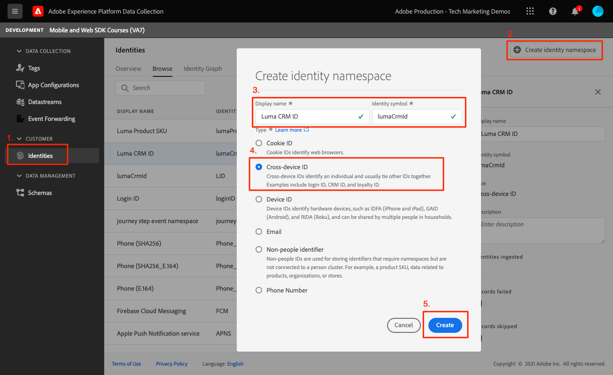

# Identité

Découvrez comment collecter des données d’identité dans une application mobile.

>[!INFO]
>
> Ce tutoriel sera remplacé par un nouveau tutoriel utilisant un nouvel exemple d’application mobile à la fin novembre 2023.

Adobe Experience Platform Identity Service vous permet de mieux connaître vos clients et leurs comportements en rapprochant des identités entre appareils et systèmes, ce qui vous permet de proposer des expériences numériques personnelles et percutantes en temps réel. Les champs d’identité et les espaces de noms sont la colle qui relie différentes sources de données pour créer le profil client en temps réel à 360 degrés.

En savoir plus sur les [Extension Identity](https://developer.adobe.com/client-sdks/documentation/identity-for-edge-network/) et la variable [service d’identité](https://experienceleague.adobe.com/docs/experience-platform/identity/home.html?lang=fr) dans la documentation.

## Conditions préalables

* Création et exécution de l’application avec les SDK installés et configurés.

## Objectifs d&#39;apprentissage

Dans cette leçon, vous allez :

* Mettre à jour une identité standard.
* Configurez une identité personnalisée.
* Mettre à jour une identité personnalisée.
* Validez le graphique d’identités.
* Obtenez l’ECID et d’autres identités.

## Mise à jour d’une identité standard

Commencez par mettre à jour la carte d’identité de l’utilisateur lorsqu’il se connecte.

1. Accédez à `Login.swift` si l’application Luma et recherchez la fonction appelée `loginButt`.

   Dans l’exemple d’application Luma, il n’existe aucune validation de nom d’utilisateur ou de mot de passe. Vous appuyez simplement sur les boutons pour vous &quot;connecter&quot;.

1. Créez le `IdentityMap` et `IdentityItem`.

   ```swift
   let identityMap: IdentityMap = IdentityMap()
   let emailIdentity = IdentityItem(id: emailAddress, authenticatedState: AuthenticatedState.authenticated)
   ```

1. Ajoutez la variable `IdentityItem` à la fonction `IdentityMap`

   ```swift
   identityMap.add(item:emailIdentity, withNamespace: "Email")
   ```

1. Appeler `updateIdentities` pour envoyer les données à Platform Edge Network.

   ```swift
   Identity.updateIdentities(with: identityMap)
   ```

>[!NOTE]
>
>Vous pouvez envoyer plusieurs identités dans un seul appel updateIdentities . Vous pouvez également modifier les identités envoyées précédemment.


## Configuration d’un espace de noms d’identité personnalisé

Les espaces de noms d’identité sont des composants de [Identity Service](https://experienceleague.adobe.com/docs/experience-platform/identity/home.html?lang=fr) qui servent d’indicateurs du contexte auquel une identité se rapporte. Par exemple, ils distinguent une valeur de &quot;name@email.com&quot; comme adresse électronique ou &quot;443522&quot; comme identifiant CRM numérique.

1. Dans l’interface Collecte de données, sélectionnez **[!UICONTROL Identités]** à partir du rail de navigation de gauche.
1. Sélectionnez **[!UICONTROL Créer un espace de noms d’identité]**.
1. Fournissez une **[!UICONTROL Nom d’affichage]** de `Luma CRM ID` et un **[!UICONTROL Symbole d’identité]** valeur de `lumaCrmId`.
1. Sélectionner **[!UICONTROL Identifiant multi-appareils]**.
1. Sélectionnez **[!UICONTROL Créer]**.



## Mise à jour d’une identité personnalisée

Maintenant que vous avez créé une identité personnalisée, commencez à la collecter en modifiant la variable `updateIdentities` code que vous avez ajouté à l’étape précédente. Il vous suffit de créer un élément d’identité et de l’ajouter à la carte d’identité. Voici à quoi devrait ressembler le bloc de code complet :

```swift
//Hardcoded identity values
let emailAddress = "testuser@gmail.com"
let crmId = "112ca06ed53d3db37e4cea49cc45b71e"

// Create identity map
let identityMap: IdentityMap = IdentityMap()
// Add email (standard)
let emailIdentity = IdentityItem(id: emailAddress, authenticatedState: AuthenticatedState.authenticated)
identityMap.add(item:emailIdentity, withNamespace: "Email")
// Add lumaCrmId (custom)
let crmIdentity = IdentityItem(id: crmId, authenticatedState: AuthenticatedState.authenticated)
identityMap.add(item: crmIdentity, withNamespace: "lumaCrmId")
// Update
Identity.updateIdentities(with: identityMap)
```

## Suppression d’une identité

Vous pouvez utiliser `removeIdentity` pour supprimer l’identité de la carte d’identité côté client stockée. L’extension Identity cesse d’envoyer l’identifiant au réseau Edge. L’utilisation de cette API ne supprime pas l’identifiant du graphique de profil utilisateur ou d’identité côté serveur.

Ajoutez ce qui suit : `removeIdentity` code au bouton de déconnexion, cliquez sur dans `Account.swift`.

```swift
// Logout
let logout = UIAlertAction(title: "Logout", style: .destructive, handler: { (action) -> Void in
    isLoggedIn = false;
    ////Hardcoded identity values
    let emailAddress = "testuser@gmail.com"
    let crmId = "112ca06ed53d3db37e4cea49cc45b71e"
    // Adobe Experience Platform - Remove Identity
    Identity.removeIdentity(item: IdentityItem(id: emailAddress), withNamespace: "Email")
    Identity.removeIdentity(item: IdentityItem(id: crmId), withNamespace: "lumaCrmId")
})
```

>[!NOTE]
>Dans les exemples ci-dessus, `crmId` et `emailAddress` sont codées en dur, mais dans une application réelle, les valeurs sont dynamiques.

## Validation avec Assurance

1. Consultez la section [instructions de configuration](assurance.md) et connectez votre simulateur ou votre appareil à Assurance.
1. Dans l’application, sélectionnez l’icône Compte en bas à droite.

   
1. Sélectionnez la variable **Connexion** bouton .
1. Vous avez la possibilité de saisir un nom d’utilisateur et un mot de passe. Ces deux options sont facultatives. Vous pouvez simplement sélectionner **Connexion**.

   
1. Dans l’interface utilisateur web d’Assurance, recherchez la variable `Edge Identity Update Identities` de l’événement `com.adobe.griffon.mobile` fournisseur.
1. Sélectionnez l’événement et passez en revue les données de la variable `ACPExtensionEventData` . Vous devriez voir les identités que vous avez mises à jour.
   

## Validation avec le graphique d’identités

Une fois que vous avez terminé les étapes de la section [leçon Experience Platform](platform.md), vous pourrez également confirmer la capture d’identité dans la visionneuse de graphiques d’identités de Platform :


Suivant : **[Profil](profile.md)**

>[!NOTE]
>
>Merci d’investir votre temps à apprendre sur le SDK Adobe Experience Platform Mobile. Si vous avez des questions, souhaitez partager des commentaires généraux ou avez des suggestions sur le contenu futur, partagez-les à ce sujet. [Article de discussion de la communauté Experience League](https://experienceleaguecommunities.adobe.com/t5/adobe-experience-platform-data/tutorial-discussion-implement-adobe-experience-cloud-in-mobile/td-p/443796)