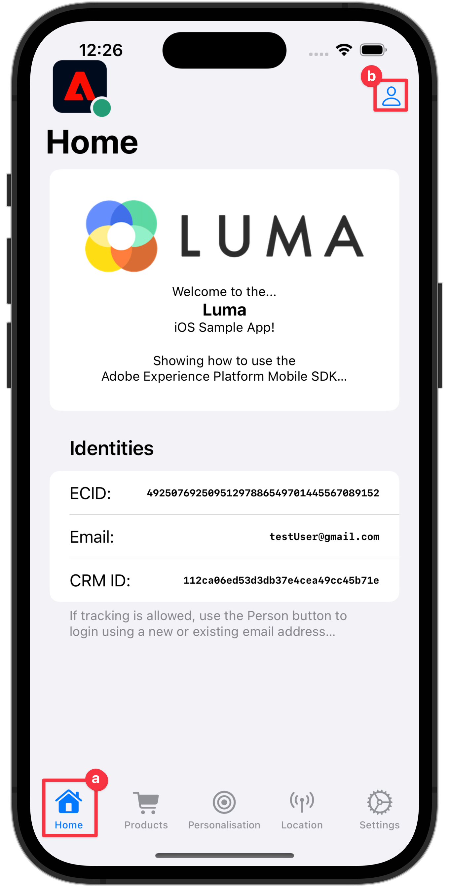

# Collecter des données d’identité

Découvrez comment collecter des données d’identité dans une application mobile.

Adobe Experience Platform Identity Service vous permet de mieux connaître vos clients et clientes ainsi que leurs comportements. Ce service relie les identités des différents appareils et systèmes et vous permet de proposer des expériences digitales personnelles et percutantes en temps réel. Les champs d’identité et les espaces de noms sont le ciment qui relie différentes sources de données pour créer le profil client en temps réel à 360 degrés.

En savoir plus sur l’[extension d’identité](https://developer.adobe.com/client-sdks/documentation/identity-for-edge-network/) et le [service d’identités](https://experienceleague.adobe.com/fr/docs/experience-platform/identity/home) dans la documentation.

## Conditions préalables

* Application créée et exécutée avec succès avec les SDK installés et configurés.

## Objectifs d’apprentissage

Dans cette leçon, vous allez :

* Configurez un espace de noms d’identité personnalisé.
* Mettre à jour les identités.
* Validez le graphique d’identité.
* Obtenez l’ECID et d’autres identités.


## Configurer un espace de noms d’identité personnalisé

Les espaces de noms d’identité sont des composants du [Service d’identités](https://experienceleague.adobe.com/fr/docs/experience-platform/identity/home) qui servent d’indicateurs du contexte auquel une identité se rapporte. Par exemple, ils distinguent une valeur `name@email.com` comme adresse e-mail ou `443522` comme identifiant CRM numérique.

>[!NOTE]
>
>Mobile SDK génère une identité unique dans son propre espace de noms, appelée Experience Cloud ID (ECID) lors de l’installation de l’application. Cet ECID est stocké dans la mémoire persistante sur l’appareil mobile et est envoyé avec chaque accès. L’ECID est supprimé lorsque l’utilisateur désinstalle l’application ou définit le statut de confidentialité global de Mobile SDK sur Désinscription. Dans l’exemple d’application Luma, vous devez supprimer et réinstaller l’application pour créer un profil avec son propre ECID unique.


Pour créer un espace de noms d’identité :

1. Dans l’interface de collecte de données, sélectionnez **[!UICONTROL Identités]** dans le volet de navigation du rail de gauche.
1. Sélectionnez **[!UICONTROL Créer un espace de noms d’identité]**.
1. Fournissez une valeur **[!UICONTROL Nom d’affichage]** de `Luma CRM ID` et une valeur **[!UICONTROL Symbole d’identité]** de `lumaCRMId`.
1. Sélectionnez **[!UICONTROL Identifiant sur l’ensemble des appareils]**.
1. Sélectionnez **[!UICONTROL Créer]**.

   {zoomable="yes"}


## Mise à jour d’identités

Vous souhaitez mettre à jour l’identité standard (e-mail) et l’identité personnalisée (identifiant CRM de Luma) lorsque l’utilisateur se connecte à l’application.

>[!BEGINTABS]

>[!TAB iOS]

1. Accédez à **[!DNL Luma]** > **[!DNL Luma]** > **[!DNL Utils]** > **[!UICONTROL MobileSDK]** dans le navigateur de projet Xcode et recherchez l’implémentation de la fonction `func updateIdentities(emailAddress: String, crmId: String)`. Ajoutez le code suivant à la fonction .

   ```swift
   // Set up identity map, add identities to map and update identities
   let identityMap: IdentityMap = IdentityMap()
   
   let emailIdentity = IdentityItem(id: emailAddress, authenticatedState: AuthenticatedState.authenticated)
   let crmIdentity = IdentityItem(id: crmId, authenticatedState: AuthenticatedState.authenticated)
   identityMap.add(item:emailIdentity, withNamespace: "Email")
   identityMap.add(item: crmIdentity, withNamespace: "lumaCRMId")
   
   Identity.updateIdentities(with: identityMap)
   ```

   Ce code :

   1. Crée un objet `IdentityMap` vide.

      ```swift
      let identityMap: IdentityMap = IdentityMap()
      ```

   1. Configure les objets `IdentityItem` pour l’e-mail et l’identifiant CRM.

      ```swift
      let emailIdentity = IdentityItem(id: emailAddress, authenticatedState: AuthenticatedState.authenticated)
      let crmIdentity = IdentityItem(id: crmId, authenticatedState: AuthenticatedState.authenticated)
      ```

   1. Ajoute ces objets `IdentityItem` à l’objet `IdentityMap`.

      ```swift
      identityMap.add(item:emailIdentity, withNamespace: "Email")
      identityMap.add(item: crmIdentity, withNamespace: "lumaCRMId")
      ```

   1. Envoie l’objet `IdentityItem` dans le cadre de l’appel API `Identity.updateIdentities` à Edge Network.

      ```swift
      Identity.updateIdentities(with: identityMap) 
      ```

1. Accédez à **[!DNL Luma]** > **[!DNL Luma]** > **[!DNL Views]** > **[!DNL General]** > **[!UICONTROL Feuille de connexion]** dans le navigateur du projet Xcode et recherchez le code à exécuter lors de la sélection du bouton **[!UICONTROL Connexion]**. Ajoutez le code suivant :

   ```swift
   // Update identities
   MobileSDK.shared.updateIdentities(emailAddress: currentEmailId, crmId: currentCRMId)                             
   ```


>[!TAB Android]

1. Accédez à **[!UICONTROL Android]**  > **[!DNL app]** > **[!DNL kotlin+java]** > **[!DNL com.adobe.luma.tutorial.android]** > **[!UICONTROL models]** > **[!UICONTROL MobileSDK]** dans le navigateur d’Android Studio et recherchez l’implémentation de la fonction `fun updateIdentities(emailAddress: String, crmId: String) `. Ajoutez le code suivant à la fonction .

   ```kotlin
   // Set up identity map, add identities to map and update identities
   val identityMap = IdentityMap()
   
   val emailIdentity = IdentityItem(emailAddress, AuthenticatedState.AUTHENTICATED, true)
   val crmIdentity = IdentityItem(crmId, AuthenticatedState.AUTHENTICATED, true)
   identityMap.addItem(emailIdentity, "Email")
   identityMap.addItem(crmIdentity, "lumaCRMId")
   
   Identity.updateIdentities(identityMap)
   ```

   Ce code :

   1. Crée un objet `IdentityMap` vide.

      ```kotlin
      val identityMap = IdentityMap()
      ```

   1. Configure les objets `IdentityItem` pour l’e-mail et l’identifiant CRM.

      ```kotlin
      val emailIdentity = IdentityItem(emailAddress, AuthenticatedState.AUTHENTICATED, true)
      val crmIdentity = IdentityItem(crmId, AuthenticatedState.AUTHENTICATED, true)
      ```

   1. Ajoute ces objets `IdentityItem` à l’objet `IdentityMap`.

      ```kotlin
      identityMap.addItem(emailIdentity, "Email")
      identityMap.addItem(crmIdentity, "lumaCRMId")
      ```

   1. Envoie l’objet `IdentityItem` dans le cadre de l’appel API `Identity.updateIdentities` à Edge Network.

      ```kotlin
      Identity.updateIdentities(identityMap)
      ```

1. Accédez à **[!UICONTROL Android]**  > **[!DNL app]** > **[!DNL kotlin+java]** > **[!DNL com.adobe.luma.tutorial.android]** > **[!UICONTROL views]** > **[!UICONTROL LoginSheet.kt]** dans le navigateur d’Android Studio et recherchez le code à exécuter lors de la sélection du bouton **[!UICONTROL Login]**. Ajoutez le code suivant :

   ```kotlin
   // Update identities
   MobileSDK.shared.updateIdentities(
      MobileSDK.shared.currentEmailId.value,
      MobileSDK.shared.currentCRMId.value
   )                             
   ```


>[!ENDTABS]


>[!NOTE]
>
>Vous pouvez envoyer plusieurs identités dans un seul appel `updateIdentities`. Vous pouvez également modifier les identités précédemment envoyées.


## Supprimer une identité

Vous pouvez utiliser l’API [`Identity.removeIdentity`](https://developer.adobe.com/client-sdks/documentation/identity-for-edge-network/api-reference/#removeidentity) pour supprimer l’identité du mappage d’identités côté client stocké. L’extension d’identité cesse d’envoyer l’identifiant à Edge Network. L’utilisation de cette API ne supprime pas l’identifiant du graphique d’identités côté serveur. Voir [Afficher les graphiques d’identités](https://experienceleague.adobe.com/fr/docs/platform-learn/tutorials/identities/view-identity-graphs) pour plus d’informations sur les graphiques d’identités.


>[!BEGINTABS]

>[!TAB iOS]

1. Accédez à **[!DNL Luma]** > **[!DNL Luma]** > **[!DNL Utils]** > **[!UICONTROL MobileSDK]** dans le navigateur de projet Xcode et ajoutez le code suivant à la fonction `func removeIdentities(emailAddress: String, crmId: String)` :

   ```swift
   // Remove identities and reset email and CRM Id to their defaults
   Identity.removeIdentity(item: IdentityItem(id: emailAddress), withNamespace: "Email")
   Identity.removeIdentity(item: IdentityItem(id: crmId), withNamespace: "lumaCRMId")
   currentEmailId = "testUser@gmail.com"
   currentCRMId = "b642b4217b34b1e8d3bd915fc65c4452"
   ```

1. Accédez à **[!DNL Luma]** > **[!DNL Luma]** > **[!DNL Views]** > **[!DNL General]** > **[!UICONTROL Feuille de connexion]** dans le navigateur du projet Xcode et recherchez le code à exécuter lors de la sélection du bouton **[!UICONTROL Déconnexion]**. Ajoutez le code suivant :

   ```swift
   // Remove identities
   MobileSDK.shared.removeIdentities(emailAddress: currentEmailId, crmId: currentCRMId)                  
   ```

>[!TAB Android]

1. Accédez à **[!UICONTROL Android]**  > **[!DNL app]** > **[!DNL kotlin+java]** > **[!DNL com.adobe.luma.tutorial.android]** > **[!UICONTROL models]** > **[!UICONTROL MobileSDK]** dans le navigateur d’Android Studio et ajoutez le code suivant à la fonction `fun removeIdentities(emailAddress: String, crmId: String)` :

   ```kotlin
   // Remove identities and reset email and CRM Id to their defaults
   Identity.removeIdentity(IdentityItem(emailAddress), "Email")
   Identity.removeIdentity(IdentityItem(crmId), "lumaCRMId")
   currentEmailId.value = "testUser@gmail.com"
   currentCRMId.value = "112ca06ed53d3db37e4cea49cc45b71e"
   ```

1.Accédez à **[!DNL app]** > **[!DNL kotlin+java]** > **[!DNL com.adobe.luma.tutorial.android]** > **[!UICONTROL views]** > **[!UICONTROL LoginSheet.kt]** dans le navigateur d’Android Studio et recherchez le code à exécuter lors de la sélection du bouton **[!UICONTROL Logout]**. Ajoutez le code suivant :

```kotlin
// Remove identities
MobileSDK.shared.removeIdentities(
   MobileSDK.shared.currentEmailId.value,
   MobileSDK.shared.currentCRMId.value
)              
```


>[!ENDTABS]

## Valider avec Assurance

1. Consultez la section [instructions de configuration](assurance.md#connecting-to-a-session) pour connecter votre simulateur ou votre appareil à Assurance.
1. Dans l’application Luma
   1. Sélectionnez l’onglet **[!UICONTROL Accueil]** et déplacez l’icône Assurance vers la gauche.
   1. Sélectionner le  en haut à droite.

>[!BEGINTABS]

>[!TAB iOS]



>[!TAB Android]


>[!ENDTABS]

1. Indiquez une adresse e-mail et un identifiant CRM, ou
1. Sélectionner  (iOS) ou **[!UICONTROL Générer un e-mail aléatoire]** (Android) pour générer de manière aléatoire un **[!UICONTROL e-mail]** et un **[!UICONTROL identifiant CRM]**.
1. Sélectionnez **[!UICONTROL Connexion]**.

>[!BEGINTABS]

>[!TAB iOS]


>[!TAB Android]


>[!ENDTABS]

De retour dans Assurance :

1. Inspectez l’interface web d’Assurance pour l’événement **[!UICONTROL Identités de mise à jour d’identité Edge]** à partir du fournisseur **[!UICONTROL com.adobe.griffon.mobile]**.
1. Sélectionnez l’événement et passez en revue les données de l’objet **[!UICONTROL ACPExtensionEventData]**. Vous devriez voir les identités que vous avez mises à jour.
   {zoomable="yes"}

## Validation avec un graphique d’identités

Une fois les étapes de la [leçon Experience Platform terminées](platform.md), vous pouvez confirmer la capture d’identité dans la visionneuse de graphiques d’identités Experience Platform :

1. Sélectionnez **[!UICONTROL Identités]** dans l’interface utilisateur de la collecte de données.
1. Sélectionnez **[!UICONTROL Graphique d’identités]** dans la barre supérieure.
1. Saisissez `Luma CRM ID` comme **[!UICONTROL Espace de noms d’identité]** et votre ID CRM (par exemple `24e620e255734d8489820e74f357b5c8`) comme **[!UICONTROL Valeur d’identité]**.
1. Les **[!UICONTROL identités]** sont répertoriées.

   {zoomable="yes"}

>[!INFO]
>
>Il n’existe aucun code dans l’application pour réinitialiser l’ECID. Vous pouvez uniquement réinitialiser l’ECID (et créer efficacement un profil avec un nouvel ECID) par le biais d’une désinstallation et d’une réinstallation de l’application. Pour implémenter la réinitialisation des identifiants, voir les appels API [`Identity.resetIdentities`](https://developer.adobe.com/client-sdks/documentation/mobile-core/identity/api-reference/#resetidentities) et [`MobileCore.resetIdentities`](https://developer.adobe.com/client-sdks/documentation/mobile-core/api-reference/#resetidentities). Gardez à l&#39;esprit que lorsque vous utilisez un identifiant de notification push (voir [Envoi de notifications push](journey-optimizer-push.md)), celui-ci devient un autre identifiant de profil persistant sur l&#39;appareil.


>[!SUCCESS]
>
>Vous avez maintenant configuré votre application pour mettre à jour les identités dans Edge Network et (lorsqu’elle est configurée) avec Adobe Experience Platform.
>
>Merci d’avoir consacré votre temps à découvrir Adobe Experience Platform Mobile SDK. Si vous avez des questions, souhaitez partager des commentaires généraux ou des suggestions sur le contenu futur, partagez-les dans ce [article de discussion de la communauté Experience League](https://experienceleaguecommunities.adobe.com/t5/adobe-experience-platform-data/tutorial-discussion-implement-adobe-experience-cloud-in-mobile/td-p/443796?profile.language=fr)

Suivant : **[Collecter des données de profil](profile.md)**
