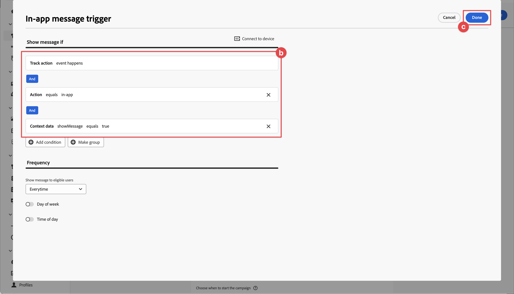

# Créer et envoyer des messages in-app

Découvrez comment créer des messages in-app pour les applications mobiles avec le SDK Mobile Experience Platform et Journey Optimizer.

Journey Optimizer vous permet de créer des campagnes pour envoyer des messages in-app aux audiences ciblées. Les campagnes dans Journey Optimizer sont utilisées pour diffuser du contenu ponctuel vers une audience spécifique à l’aide de divers canaux. Avec les campagnes, les actions sont exécutées simultanément, immédiatement ou selon un planning spécifié. Lors de l’utilisation de parcours (voir la leçon [Notifications push Journey Optimizer](journey-optimizer-push.md)), les actions sont exécutées en séquence.


Avant d’envoyer des messages in-app avec Journey Optimizer, vous devez vous assurer que les configurations et intégrations appropriées sont en place. Pour comprendre le flux de données de messagerie in-app dans Journey Optimizer, reportez-vous à la [documentation](https://experienceleague.adobe.com/docs/journey-optimizer/using/in-app/inapp-configuration.html?lang=en).

>[!NOTE]
>
>Cette leçon est facultative et s’applique uniquement aux utilisateurs de Journey Optimizer qui souhaitent envoyer des messages in-app.


## Conditions préalables

* Création et exécution de l’application avec les SDK installés et configurés.
* Configurez l’application pour Adobe Experience Platform.
* Accès à Journey Optimizer et autorisations suffisantes comme décrit [ici](https://experienceleague.adobe.com/docs/journey-optimizer/using/push/push-config/push-configuration.html). Vous avez également besoin d’une autorisation suffisante pour accéder aux fonctionnalités Journey Optimizer suivantes.
   * Gérer les campagnes.
* Appareil ou simulateur iOS physique à tester.


## Objectifs d&#39;apprentissage

Dans cette leçon, vous allez

* Créez une surface d’application dans AJO.
* Installez et configurez l’extension de balise Journey Optimizer.
* Mettez à jour votre application pour enregistrer l’extension de balise Journey Optimizer.
* Validez la configuration dans Assurance.
* Définissez votre propre campagne et votre propre expérience de message in-app dans Journey Optimizer.
* Envoyez votre propre message in-app depuis l’application.

## Configuration

>[!TIP]
>
>Si vous avez déjà configuré votre environnement dans le cadre de la leçon [Messagerie push Journey Optimizer](journey-optimizer-push.md), vous avez peut-être déjà effectué certaines des étapes de cette section de configuration.


### Ajout d’une surface d’application dans la collecte de données

1. Dans l’ [ interface de collecte de données ](https://experience.adobe.com/data-collection/), sélectionnez **[!UICONTROL App Surfaces]** dans le panneau de gauche.
1. Pour créer une configuration, sélectionnez **[!UICONTROL Créer une surface d’application]**.
   
1. Saisissez un **[!UICONTROL Nom]** pour la configuration, par exemple `Luma App Tutorial` .
1. Dans **[!UICONTROL Configuration d&#39;application mobile]**, sélectionnez **[!UICONTROL Apple iOS]**.
1. Saisissez l’ID du lot de l’application mobile dans le champ **[!UICONTROL ID de l’application (ID du lot iOS)]** . Par exemple, `com.adobe.luma.tutorial.swiftui`.
1. Sélectionnez **[!UICONTROL Enregistrer]**.

   

### Mise à jour de la configuration des flux de données

Pour vous assurer que les données envoyées de votre application mobile à l’Edge Network sont transférées vers Journey Optimizer, mettez à jour votre configuration Experience Edge.


1. Dans l’interface utilisateur de la collecte de données, sélectionnez **[!UICONTROL Datastreams]**, puis sélectionnez votre flux de données, par exemple **[!DNL Luma Mobile App]**.
1. Sélectionnez  pour **[!UICONTROL Experience Platform]** et  **[!UICONTROL Modifier]** dans le menu contextuel.
1. Dans l’écran **[!UICONTROL Datastreams]** >  > **[!UICONTROL Adobe Experience Platform]**, assurez-vous que **[!UICONTROL Adobe Journey Optimizer]** est sélectionné. Voir [Paramètres Adobe Experience Platform](https://experienceleague.adobe.com/docs/experience-platform/datastreams/configure.html?lang=en#aep) pour plus d’informations.
1. Pour enregistrer votre configuration de flux de données, sélectionnez **[!UICONTROL Enregistrer]**.


   


### Installation de l’extension de balises Journey Optimizer

Pour que votre application fonctionne avec Journey Optimizer, vous devez mettre à jour la propriété de balise.

1. Accédez à **[!UICONTROL Balises]** > **[!UICONTROL Extensions]** > **[!UICONTROL Catalogue]**.
1. Ouvrez votre propriété, par exemple **[!DNL Luma Mobile App Tutorial]**.
1. Sélectionnez **[!UICONTROL Catalog]**.
1. Recherchez l’extension **[!UICONTROL Adobe Journey Optimizer]**.
1. Installez l’extension .

Lorsque *uniquement* utilise des messages in-app dans votre application, dans **[!UICONTROL Installer l’extension]** ou **[!UICONTROL Configurer l’extension]**, vous n’avez rien à configurer. Cependant, si vous avez déjà suivi la leçon [Notifications push](journey-optimizer-push.md) du tutoriel, vous verrez que pour l’environnement de **[!UICONTROL développement]**, le jeu de données **[!UICONTROL Jeu de données d’expérience de suivi push AJO]** est sélectionné dans la liste **[!UICONTROL Jeu de données d’événement]**.


### Mise en oeuvre de Journey Optimizer dans l’application

Comme indiqué dans les leçons précédentes, l’installation d’une extension de balise mobile fournit uniquement la configuration. Vous devez ensuite installer et enregistrer le SDK de messagerie. Si ces étapes ne sont pas claires, consultez la section [Installer les SDK](install-sdks.md) .

>[!NOTE]
>
>Si vous avez terminé la section [Installer les SDK](install-sdks.md) , le SDK est déjà installé et vous pouvez ignorer cette étape.
>

1. Dans Xcode, assurez-vous que [AEP Messaging](https://github.com/adobe/aepsdk-messaging-ios) est ajouté à la liste des packages dans les dépendances de modules. Voir [Swift Package Manager](install-sdks.md#swift-package-manager).
1. Accédez à **[!DNL Luma]** > **[!DNL Luma]** > **[!UICONTROL AppDelegate]** dans le navigateur de projet Xcode.
1. Assurez-vous que `AEPMessaging` fait partie de votre liste d’importations.

   `import AEPMessaging`

1. Vérifiez que `Messaging.self` fait partie du tableau des extensions que vous enregistrez.

   ```swift
   let extensions = [
       AEPIdentity.Identity.self,
       Lifecycle.self,
       Signal.self,
       Edge.self,
       AEPEdgeIdentity.Identity.self,
       Consent.self,
       UserProfile.self,
       Places.self,
       Messaging.self,
       Optimize.self,
       Assurance.self
   ]
   ```


## Validation de la configuration avec Assurance

1. Consultez la section [instructions de configuration](assurance.md#connecting-to-a-session) pour connecter votre simulateur ou périphérique à Assurance.
1. Dans l’interface utilisateur d’assurance, sélectionnez **[!UICONTROL Configurer]**.
   
1. Sélectionnez le bouton  en regard de la **[!UICONTROL messagerie in-app]**.
1. Sélectionnez **[!UICONTROL Enregistrer]**.
   
1. Sélectionnez **[!UICONTROL Messagerie in-app]** dans le volet de navigation de gauche.
1. Sélectionnez l’onglet **[!UICONTROL Validation]** . Confirmez que vous n’obtenez aucune erreur.

   


## Créer votre propre message in-app

Pour créer votre propre message in-app, vous devez définir dans Journey Optimizer une campagne qui déclenche un message in-app en fonction des événements qui se produisent. Ces événements peuvent être :

* données envoyées à Adobe Experience Platform,
* les événements de suivi principaux, tels que l’action, l’état ou la collecte de données de PII, via les API génériques Mobile Core,
* les événements de cycle de vie des applications, tels que le lancement, l’installation, la mise à niveau, la fermeture ou le blocage,
* événements de géolocalisation, comme l’entrée ou la sortie d’un point ciblé.

Dans ce tutoriel, vous allez utiliser les API génériques Mobile Core et indépendantes de l’extension (voir [API génériques Mobile Core](https://developer.adobe.com/client-sdks/documentation/mobile-core/#mobile-core-generic-apis)) pour faciliter le suivi des événements des écrans utilisateur, des actions et des données de PII. Les événements générés par ces API sont publiés sur le centre d’événements du SDK et peuvent être utilisés par des extensions. Le hub d’événements SDK fournit la structure de données principale liée à toutes les extensions du SDK Mobile Platform, en conservant une liste d’extensions enregistrées et de modules internes, une liste d’écouteurs d’événements enregistrés et une base de données d’état partagée.

Le hub d’événements SDK publie et reçoit des données d’événement des extensions enregistrées afin de simplifier les intégrations avec les solutions d’Adobe et tierces. Par exemple, lorsque l’extension Optimize est installée, toutes les demandes et interactions avec le moteur d’offres Journey Optimizer - Gestion des décisions sont gérées par le hub d’événements.

1. Dans l’interface utilisateur de Journey Optimizer, sélectionnez **[!UICONTROL Campagnes]** dans le rail de gauche.
1. Sélectionnez **[!UICONTROL Créer une campagne]**.
1. Dans l&#39;écran **[!UICONTROL Créer une campagne]** :
   1. Sélectionnez **[!UICONTROL Message in-app]** et sélectionnez une surface d’application dans la liste **[!UICONTROL surface d’application]**, par exemple **[!DNL Luma Mobile App]**.
   1. Sélectionnez **[!UICONTROL Créer]**
      
1. Dans l’écran de définition de campagne, à l’emplacement **[!UICONTROL Propriétés]**, saisissez un **[!UICONTROL Nom]** pour la campagne, par exemple `Luma - In-App Messaging Campaign`, et une **[!UICONTROL Description]**, par exemple `In-app messaging campaign for Luma app`.
   
1. Faites défiler l’écran jusqu’à **[!UICONTROL Action]**, puis sélectionnez **[!UICONTROL Modifier le contenu]**.
1. Dans l’écran **[!UICONTROL Message In-App]** :
   1. Sélectionnez **[!UICONTROL Modal]** comme **[!UICONTROL Disposition du message]**.
   2. Saisissez `https://luma.enablementadobe.com/content/dam/luma/en/logos/Luma_Logo.png` pour l’ **[!UICONTROL URL du média]**.
   3. Saisissez un **[!UICONTROL En-tête]**, par exemple `Welcome to this Luma In-App Message`, puis un **[!UICONTROL Corps]**, par exemple `Triggered by pushing that button in the app...`.
   4. Saisissez **[!UICONTROL Ignorer]** comme **[!UICONTROL texte #1 bouton (principal)]**.
   5. Notez comment l’aperçu est mis à jour.
   6. Sélectionnez **[!UICONTROL Réviser pour activer]**.
      
1. Dans l’écran **[!UICONTROL Réviser pour activer (Luma - Campagne de messagerie in-app)]**, sélectionnez  dans la mosaïque **[!UICONTROL Planification]**.
   
1. De retour dans l&#39;écran **[!DNL Luma - In-App Messaging Campaign]**, sélectionnez  **[!UICONTROL Edit Triggers]**.
1. Dans la boîte de dialogue **[!UICONTROL Déclencheur de message in-app]**, vous configurez les détails de l’action de suivi qui déclenche le message in-app :
   1. Pour supprimer **[!UICONTROL événement de lancement d’application]**, sélectionnez  .
   1. Utilisez  **[!UICONTROL Add condition]** à plusieurs reprises pour créer la logique suivante pour **[!UICONTROL Show message if]**.
   1. Cliquez sur **[!UICONTROL Terminé]**.
      

   Vous avez défini une action de suivi, où **[!UICONTROL Action]** est égal à `in-app` et où les **[!UICONTROL données contextuelles]** avec l’action sont une paire de valeurs de clé `"showMessage" : "true"`.

1. De retour dans l’écran **[!DNL Luma - In-App Messaging Campaign]**, sélectionnez **[!UICONTROL Réviser pour activer]**.
1. Dans l’écran **[!UICONTROL Réviser pour activer (Luma - Campagne de messagerie in-app)]**, sélectionnez **[!UICONTROL Activer]**.
1. Votre **[!DNL Luma - In-App Messaging Campaign]** ayant le statut **[!UICONTROL Live]** apparaît dans la liste **[!UICONTROL Campagnes]**.
   


## Déclencher le message in-app

Vous disposez de tous les ingrédients nécessaires pour envoyer un message in-app. Reste à savoir comment déclencher ce message in-app dans votre application.

1. Accédez à **[!DNL Luma]** > **[!DNL Luma]** > **[!DNL Utils]** > **[!UICONTROL MobileSDK]** dans le navigateur de projet Xcode. Recherchez la fonction `func sendTrackAction(action: String, data: [String: Any]?)` et ajoutez le code suivant, qui appelle la fonction [`MobileCore.track`](https://developer.adobe.com/client-sdks/documentation/mobile-core/api-reference/#trackaction), en fonction des paramètres `action` et `data`.


   ```swift
   // Send trackAction event
   MobileCore.track(action: action, data: data)
   ```

1. Accédez à **[!DNL Luma]** > **[!DNL Luma]** > **[!DNL Views]** > **[!DNL General]** > **[!UICONTROL ConfigView]** dans le navigateur de projet Xcode. Recherchez le code du bouton Message in-app et ajoutez le code suivant :

   ```swift
   // Setting parameters and calling function to send in-app message
   Task {
       MobileSDK.shared.sendTrackAction(action: "in-app", data: ["showMessage": "true"])
   }
   ```

## Validation à l’aide de votre application

1. Recréez et exécutez l’application dans le simulateur ou sur un appareil physique à partir de Xcode, en utilisant .

1. Accédez à l’onglet **[!UICONTROL Paramètres]** .

1. Appuyez sur **[!UICONTROL Message in-app]**. Le message in-app apparaît dans votre application.

   


## Validation de la mise en oeuvre dans Assurance

Vous pouvez valider vos messages in-app dans l’interface utilisateur d’assurance.

1. Consultez la section [instructions de configuration](assurance.md#connecting-to-a-session) pour connecter votre simulateur ou périphérique à Assurance.
1. Sélectionnez **[!UICONTROL Messagerie In-App]**.
1. Sélectionnez **[!UICONTROL Event List]**.
1. Sélectionnez une entrée **[!UICONTROL Afficher le message]**.
1. Inspect l’événement brut, en particulier `html`, qui contient la disposition et le contenu complets du message in-app.
   


## Étapes suivantes

Vous devez maintenant disposer de tous les outils pour commencer à ajouter des messages in-app, le cas échéant et selon le cas. Par exemple, la promotion de produits en fonction d’interactions spécifiques dont vous effectuez le suivi dans votre application.

>[!SUCCESS]
>
>Vous avez activé l’application pour la messagerie in-app et ajouté une campagne de messagerie in-app à l’aide de Journey Optimizer et de l’extension Journey Optimizer pour le SDK mobile Experience Platform.
>
>Merci d’investir votre temps à apprendre sur le SDK Adobe Experience Platform Mobile. Si vous avez des questions, souhaitez partager des commentaires généraux ou avez des suggestions sur le contenu à venir, partagez-les sur cet [post de discussion de la communauté Experience League](https://experienceleaguecommunities.adobe.com/t5/adobe-experience-platform-data/tutorial-discussion-implement-adobe-experience-cloud-in-mobile/td-p/443796).

Suivant : **[Créer et afficher des offres](journey-optimizer-offers.md)**
