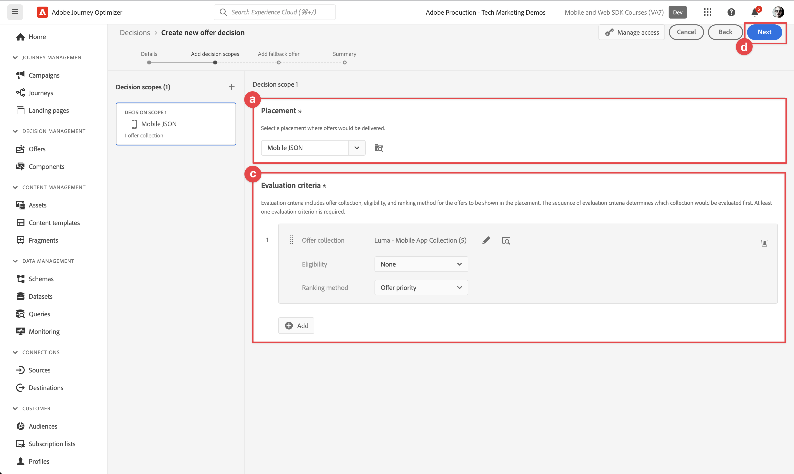
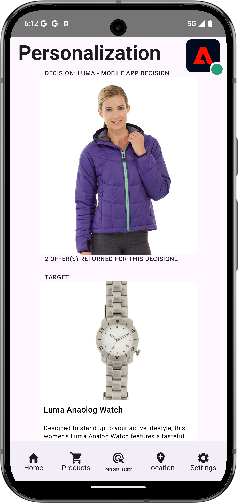

# Création et affichage d’offres avec la gestion des décisions

Découvrez comment afficher les offres de Journey Optimizer Decision Management dans vos applications mobiles avec Experience Platform Mobile SDK.

La gestion des décisions de Journey Optimizer vous permet de fournir à vos clients la meilleure offre et la meilleure expérience possible à tous les points de contact au bon moment. Une fois la conception réalisée, ciblez votre audience avec des offres personnalisées.

{zoomable="yes"}

La gestion des décisions facilite la personnalisation avec une bibliothèque centrale d’offres marketing et un moteur de décision qui applique des règles et des contraintes aux profils en temps réel riches créés par Adobe Experience Platform. Par conséquent, il vous permet d’envoyer à vos clients la bonne offre au bon moment. Voir [À propos de la gestion des décisions](https://experienceleague.adobe.com/fr/docs/journey-optimizer/using/decisioning/offer-decisioning/get-started-decision/starting-offer-decisioning) pour plus d’informations.


>[!NOTE]
>
>Cette leçon est facultative et s’applique uniquement aux utilisateurs de Journey Optimizer qui cherchent à utiliser la fonctionnalité de gestion des décisions pour afficher des offres dans une application mobile.


## Conditions préalables

* Application créée et exécutée avec succès avec les SDK installés et configurés.
* Configurez l’application pour Adobe Experience Platform.
* Accès à Journey Optimizer - Gestion des décisions avec les [autorisations appropriées pour gérer les offres et les décisions](https://experienceleague.adobe.com/fr/docs/journey-optimizer/using/access-control/high-low-permissions).


## Objectifs d’apprentissage

Dans cette leçon, vous allez :

* Mettez à jour votre configuration Edge pour la gestion des décisions.
* Mettez à jour la propriété de balise avec l’extension Offer Decisioning et Target.
* Mettez à jour votre schéma pour capturer les événements de proposition.
* Validez la configuration dans Assurance.
* Créez une décision d’offre basée sur les offres dans Journey Optimizer - Gestion des décisions.
* Mettez à jour votre application pour enregistrer l’extension Optimizer.
* Implémentez des offres à partir de la gestion des décisions dans votre application.


## Configuration

>[!TIP]
>
>Si vous avez déjà configuré votre environnement dans le cadre de la leçon [Configuration des tests A/B avec Target](target.md), il se peut que vous ayez déjà effectué certaines des étapes de cette section de configuration.

### Mettre à jour la configuration du flux de données

Pour vous assurer que les données envoyées de votre application mobile à Platform Edge Network sont transférées vers Journey Optimizer - Gestion des décisions, mettez à jour votre flux de données.

1. Dans l’interface utilisateur de collecte de données, sélectionnez **[!UICONTROL Flux de données]**, puis sélectionnez votre flux de données, par exemple **[!DNL Luma Mobile App]**.
1. Sélectionnez  pour **[!UICONTROL Experience Platform]** et sélectionnez  **[!UICONTROL Modifier]** dans le menu contextuel.
1. Dans l’écran **[!UICONTROL Flux de données]** >  > **[!UICONTROL Adobe Experience Platform]**, assurez-vous que **[!UICONTROL Offer Decisioning]**, **[!UICONTROL Segmentation Edge]** et **[!UICONTROL Adobe Journey Optimizer]** sont sélectionnés. Si vous suivez la leçon Target, sélectionnez également **[!UICONTROL Destinations Personalization]**. Voir [Paramètres Adobe Experience Platform](https://experienceleague.adobe.com/fr/docs/experience-platform/datastreams/configure) pour plus d&#39;informations.
1. Pour enregistrer la configuration de votre flux de données, sélectionnez **[!UICONTROL Enregistrer]** .

   {zoomable="yes"}


### Installation de l’extension Offer Decisioning and Target tags

1. Accédez à **[!UICONTROL Balises]** recherchez la propriété de balise mobile et ouvrez la propriété.
1. Sélectionnez **[!UICONTROL Extensions]**.
1. Sélectionnez **[!UICONTROL Catalogue]**.
1. Recherchez l’extension **[!UICONTROL Offer Decisioning et Target]**.
1. Installez l’extension . L’extension ne nécessite pas de configuration supplémentaire.

   {zoomable="yes"}


### Mise à jour du schéma

1. Accédez à l’interface de collecte de données et sélectionnez **[!UICONTROL Schémas]** dans le rail de gauche.
1. Sélectionnez **[!UICONTROL Parcourir]** dans la barre supérieure.
1. Sélectionnez votre schéma pour l’ouvrir.
1. Dans l’éditeur de schémas, sélectionnez  **[!UICONTROL Ajouter]** en regard de Groupes de champs .
1. Dans la boîte de dialogue **[!UICONTROL Ajouter des groupes de champs]**,  recherchez des `proposition`, sélectionnez **[!UICONTROL Événement d’expérience - Interactions de proposition]** et sélectionnez **[!UICONTROL Ajouter des groupes de champs]**. Ce groupe de champs collecte les données d’événement d’expérience relatives aux offres, telles que l’offre présentée, dans le cadre de quelle collection, décision et autres paramètres (voir plus loin dans cette leçon) ? Mais qu&#39;en est-il de l&#39;offre ? Est-il affiché, a-t-il interagi avec, a-t-il été ignoré, etc. ?
   {zoomable="yes"}
1. Sélectionnez **[!UICONTROL Enregistrer]** pour enregistrer les modifications apportées à votre schéma.


## Validation de la configuration dans Assurance

Pour valider votre configuration dans Assurance :

1. Accédez à l’interface utilisateur d’Assurance.
1. Sélectionnez **[!UICONTROL Configurer]** dans le rail de gauche et sélectionnez  en regard de **[!UICONTROL Valider la configuration]** sous **[!UICONTROL OFFER DECISIONING ET TARGET]**.
1. Sélectionnez **[!UICONTROL Enregistrer]**.
1. Sélectionnez **[!UICONTROL Valider la configuration]** dans le rail de gauche. La configuration des trains de données et de SDK dans votre application est validée.
   {zoomable="yes"}


## Créer un emplacement

Avant de pouvoir créer des offres, vous devez définir comment et où elles peuvent être placées dans l’application mobile. Dans la gestion des décisions, vous définissez des emplacements à cet effet ainsi qu’un emplacement pour le canal mobile prenant en charge une payload JSON :

1. Dans l’interface utilisateur de Journey Optimizer, sélectionnez  **[!UICONTROL Composants]** sous **[!UICONTROL GESTION DES DÉCISIONS]** dans le rail de gauche.

1. Sélectionnez **[!UICONTROL Emplacements]** dans la barre supérieure.

1. Si aucun emplacement nommé **[!UICONTROL Mobile JSON]**, **[!UICONTROL Mobile]** en tant que **[!UICONTROL Type de canal]** et **[!UICONTROL JSON]** en tant que **[!UICONTROL Type de contenu]** n’est répertorié, vous devez créer un emplacement. Sinon, continuez à [Créer des offres](#create-offers).

Pour créer l’emplacement JSON mobile :

1. Sélectionnez  Créer un emplacement.

   1. dans la section **[!UICONTROL Détails]**, saisissez `Mobile JSON` comme **[!UICONTROL Nom]**, sélectionnez **[!UICONTROL Mobile]** depuis **[!UICONTROL Type de canal]** et **[!UICONTROL JSON]** depuis **[!UICONTROL Type de contenu]**.
   1. Sélectionnez **[!UICONTROL Enregistrer]** pour enregistrer l’emplacement.

   {zoomable="yes"}


## Créer des offres

1. Dans l’interface utilisateur de Journey Optimizer, sélectionnez  **[!UICONTROL Offres]** dans **[!UICONTROL GESTION DES DÉCISIONS]** dans le rail de gauche.
1. Dans l’écran **[!UICONTROL Offres]**, sélectionnez **[!UICONTROL Parcourir]** pour afficher la liste des offres.
1. Sélectionnez **[!UICONTROL Créer une offre]**.
1. Dans la boîte de dialogue **[!UICONTROL Nouvelle offre]**, sélectionnez **[!UICONTROL Offre personnalisée]** et cliquez sur **[!UICONTROL Suivant]**.
1. À l’étape **[!UICONTROL Détails]** de **[!UICONTROL Créer une offre personnalisée]** :
   1. Saisissez un **[!UICONTROL Nom]** pour l’offre, par exemple `Luma - Juno Jacket`, ainsi qu’un **[!UICONTROL Date et heure de début]** et un **[!UICONTROL Date et heure de fin]**. Seules les offres comprises dans ces dates sont sélectionnées par le moteur de décision.
   1. Sélectionnez **[!UICONTROL Suivant]**.
      {zoomable="yes"}

1. À l&#39;étape **[!UICONTROL Ajouter des représentations]** de **[!UICONTROL Créer une offre personnalisée]** :
   1. Sélectionnez  **[!UICONTROL Mobile]** dans la liste **[!UICONTROL Canal]**, puis sélectionnez **[!UICONTROL Mobile JSON]** dans la liste **[!UICONTROL Emplacement]**.
   1. Sélectionnez **[!UICONTROL Personnalisé]** pour **[!UICONTROL Contenu]**.
   1. Sélectionnez **[!UICONTROL Ajouter du contenu]**. Dans la boîte de dialogue **[!UICONTROL Ajouter une personnalisation]** :
      1. Si un sélecteur [!UICONTROL Mode] est disponible, assurez-vous qu’il est défini sur **[!UICONTROL JSON]**.
      1. Saisissez le code JSON suivant :

         ```json
         { 
             "title": "Juno Jacket",
             "text": "On colder-than-comfortable mornings, you'll love warming up in the Juno All-Ways Performance Jacket, designed to compete with wind and chill. Built-in Cocona&trade; technology aids evaporation, while a special zip placket and stand-up collar keep your neck protected.", 
             "image": "https://luma.enablementadobe.com/content/dam/luma/en/products/women/tops/jackets/wj06-purple_main.jpg" 
         }  
         ```

      1. Sélectionnez **[!UICONTROL Enregistrer]**.
         {zoomable="yes"}
   1. Sélectionnez **[!UICONTROL Suivant]**.
      {zoomable="yes"}

1. À l&#39;étape **[!UICONTROL Ajouter des contraintes]** de l&#39;**[!UICONTROL Créer une offre personnalisée]** :
   1. Définissez **[!UICONTROL Priorité]** sur `10`.
   1. Désactivez le bouton (bascule) **[!UICONTROL Inclure la limitation]**.
   1. Sélectionnez **[!UICONTROL Suivant]**.
      {zoomable="yes"}

1. À l’étape **[!UICONTROL Révision]** de l’**[!UICONTROL Création d’une offre personnalisée]** :
   1. Vérifiez l’offre, puis sélectionnez **[!UICONTROL Terminer]**.
   1. Dans la boîte de dialogue **[!UICONTROL Enregistrer l’offre]**, sélectionnez **[!UICONTROL Enregistrer et approuver]**.

1. Répétez les étapes 3 à 8 pour créer quatre offres supplémentaires avec des noms et un contenu différents. Toutes les autres valeurs de configuration, par exemple la date et l’heure de début ou la priorité, sont similaires à la première offre que vous avez créée. Vous pouvez rapidement créer des offres en double et les modifier.

   1. Dans l’interface utilisateur de Journey Optimizer, sélectionnez  **[!UICONTROL Offres]** dans le rail de gauche, puis sélectionnez Offres dans la barre supérieure.
   1. Sélectionnez la ligne de l’offre que vous avez créée.
   1. Dans le volet de droite, sélectionnez  **[!UICONTROL Autres actions]** et dans le menu contextuel, sélectionnez  **[!UICONTROL Dupliquer]**.

      Utilisez le tableau ci-dessous pour définir les quatre autres offres.

      | Nom de l’offre | Contenu de l’offre au format JSON |
      |---|---|
      | Luma - Bouteille d&#39;eau Affirm | `{ "title": "Affirm Water Bottle", "text": "You'll stay hydrated with ease with the Affirm Water Bottle by your side or in hand. Measurements on the outside help you keep track of how much you're drinking, while the screw-top lid prevents spills. A metal carabiner clip allows you to attach it to the outside of a backpack or bag for easy access.", "image": "https://luma.enablementadobe.com/content/dam/luma/en/products/gear/fitness-equipment/ug06-lb-0.jpg" }` |
      | Luma - T-shirt de fitness Désiré | `{ "title": "Desiree Fitness Tee", "text": "When you're too far to turn back, thank yourself for choosing the Desiree Fitness Tee. Its ultra-lightweight, ultra-breathable fabric wicks sweat away from your body and helps keeps you cool for the distance.", "image": "https://luma.enablementadobe.com/content/dam/luma/en/products/women/tops/tees/ws05-yellow_main.jpg" }` |
      | Luma - Veste Adrienne Trek | `{ "title": "Adrienne Trek Jacket", "text": "You're ready for a cross-country jog or a coffee on the patio in the Adrienne Trek Jacket. Its style is unique with stand collar and drawstrings, and it fits like a jacket should.", "image": "https://luma.enablementadobe.com/content/dam/luma/en/products/women/tops/jackets/wj08-gray_main.jpg" }` |
      | Luma - T-shirt de remise en forme quotidienne Aero | `{ "title": "Aero Daily Fitness Tee", "text": "Need an everyday action tee that helps keep you dry? The Aero Daily Fitness Tee is made of 100% polyester wicking knit that funnels moisture away from your skin. Don't be fooled by its classic style; this tee hides premium performance technology beneath its unassuming look.", "image": "https://luma.enablementadobe.com/content/dam/luma/en/products/men/tops/tees/ms01-black_main.jpg" }` |

      {style="table-layout:fixed"}

1. La dernière étape consiste à créer une offre de secours, c’est-à-dire une offre envoyée aux clients s’ils ne sont pas éligibles à d’autres offres.
   1. Sélectionnez **[!UICONTROL Créer une offre]**.
   1. Dans la boîte de dialogue **[!UICONTROL Nouvelle offre]**, sélectionnez **[!UICONTROL Offre personnalisée]** puis sélectionnez **[!UICONTROL Suivant]**.
   1. À l’étape **[!UICONTROL Détails]** de **[!UICONTROL Créer une offre de secours]**, saisissez un **[!UICONTROL Nom]** pour l’offre, par exemple `Luma - Fallback Offer`, puis sélectionnez **[!UICONTROL Suivant]**.

   1. À l&#39;étape **[!UICONTROL Ajouter des représentations]** de **[!UICONTROL Créer une offre de secours]** :
      1. Sélectionnez  **[!UICONTROL Mobile]** dans la liste **[!UICONTROL Canal]**, puis sélectionnez **[!UICONTROL Mobile JSON]** dans la liste **[!UICONTROL Emplacement]**.
      1. Sélectionnez **[!UICONTROL Personnalisé]** pour **[!UICONTROL Contenu]**.
      1. Sélectionnez **[!UICONTROL Ajouter du contenu]**.
      1. Dans la boîte de dialogue **[!UICONTROL Ajouter une personnalisation]**, saisissez le code JSON suivant et sélectionnez **[!UICONTROL Enregistrer]** :

         ```json
         {  
            "title": "Luma",
            "text": "Your store for sports wear and equipment.", 
            "image": "https://luma.enablementadobe.com/content/dam/luma/en/logos/Luma_Logo.png" 
         }  
         ```

      1. Sélectionnez **[!UICONTROL Suivant]**.


1. À l’étape **[!UICONTROL Réviser]** de **[!UICONTROL Créer une offre de secours]** :
   1. Vérifiez l’offre, puis sélectionnez **[!UICONTROL Terminer]**.
   1. Dans la boîte de dialogue **[!UICONTROL Enregistrer l’offre]**, sélectionnez **[!UICONTROL Enregistrer et approuver]**.

Vous devriez maintenant disposer de la liste d’offres suivante :
{zoomable="yes"}


## Création d’une collection

Pour présenter une offre à l’utilisateur de votre application mobile, vous devez définir une collection d’offres composée d’une ou de plusieurs des offres que vous avez créées.

1. Dans l’interface utilisateur de Journey Optimizer, sélectionnez **[!UICONTROL Offres]** dans le rail de gauche.
1. Sélectionnez **[!UICONTROL Collections]** dans la barre supérieure.
1. Sélectionnez  **[!UICONTROL Créer une collection]**.
1. Dans la boîte de dialogue **[!UICONTROL Nouvelle collection]**, saisissez un **[!UICONTROL Nom]** pour votre collection, par exemple `Luma - Mobile App Collection`, sélectionnez **[!UICONTROL Créer une collection statique]**, puis cliquez sur **[!UICONTROL Suivant]**.
1. Dans **[!DNL Luma - Mobile App Collection]**, sélectionnez les offres à inclure dans la collection. Pour ce tutoriel, sélectionnez les cinq offres que vous avez créées. Vous pouvez facilement filtrer la liste à l’aide du champ de recherche, par exemple en saisissant **[!DNL Luma]**.
1. Sélectionnez **[!UICONTROL Enregistrer]**.

   {zoomable="yes"}


## Création d’une décision

La dernière étape consiste à définir une décision, c&#39;est-à-dire la combinaison d&#39;une ou de plusieurs portées de décision et de votre offre de secours.

Une portée de décision est la combinaison d’un emplacement spécifique (par exemple HTML dans un e-mail ou JSON dans une application mobile) et d’un ou plusieurs critères d’évaluation.

Un critère d’évaluation est la combinaison des éléments suivants :

* une collection d’offres,
* règles d’éligibilité : par exemple, l’offre est-elle disponible uniquement pour une audience spécifique,
* une méthode de classement : lorsque plusieurs offres sont disponibles, quelle méthode utilisez-vous pour les classer (par exemple par priorité d’offre, à l’aide d’une formule ou d’un modèle d’IA).

Consultez la section [Étapes clés de création et de gestion des offres](https://experienceleague.adobe.com/fr/docs/journey-optimizer/using/decisioning/offer-decisioning/get-started-decision/key-steps) si vous souhaitez comprendre comment les emplacements, les règles, les classements, les offres, les représentations, les collections, les décisions, etc. interagissent et sont liés les uns aux autres. Cette leçon se concentre uniquement sur l’utilisation du résultat d’une décision plutôt que sur la flexibilité de la définition des décisions dans Journey Optimizer - Gestion des décisions.

1. Dans l’interface utilisateur de Journey Optimizer, sélectionnez **[!UICONTROL Offres]** dans le rail de gauche.
1. Sélectionnez **[!UICONTROL Décisions]** dans la barre supérieure.
1. Sélectionnez  **[!UICONTROL Créer une décision]**.
1. À l&#39;étape **[!UICONTROL Détails]** de **[!UICONTROL Créer une nouvelle décision d&#39;offre]** :
   1. Saisissez un **[!UICONTROL Nom]** pour la décision, par exemple `Luma - Mobile App Decision`, saisissez **[!UICONTROL Date et heure de début]** et **[!UICONTROL Date et heure de fin]**.
   1. Sélectionnez **[!UICONTROL Suivant]**.

1. À l’étape **[!UICONTROL Ajouter des portées de décision]** de **[!UICONTROL Créer une décision d’offre]** :
   1. Sélectionnez **[!UICONTROL Mobile JSON]** dans la liste **[!UICONTROL Emplacement]**.
   1. Dans la mosaïque **[!UICONTROL Critères d’évaluation]**, sélectionnez  **[!UICONTROL Ajouter]**.
      1. Dans la boîte de dialogue **[!UICONTROL Ajouter une collection d’offres]**, sélectionnez votre collection d’offres. Par exemple : **[!DNL Luma - Mobile App Collection]**.
      1. Sélectionnez **[!UICONTROL Ajouter]**.

         {zoomable="yes"}

   1. Assurez-vous que **[!UICONTROL Aucun]** est sélectionné pour **[!UICONTROL Éligibilité]** et **[!UICONTROL Priorité des offres]** est sélectionné en tant que **[!UICONTROL Méthode de classement]**.
   1. Sélectionnez **[!UICONTROL Suivant]**.

      {zoomable="yes"}

1. À l&#39;étape **[!UICONTROL Ajouter une offre de secours]** de **[!UICONTROL Créer une nouvelle décision d&#39;offre]** :
   1. Sélectionnez votre offre de secours, par exemple la **[!DNL Luma - Fallback offer]**.
   1. Sélectionnez **[!UICONTROL Suivant]**.
1. À l&#39;étape **[!UICONTROL Résumé]** de **[!UICONTROL Créer une nouvelle décision d&#39;offre]** :
   1. Sélectionnez **[!UICONTROL Terminer]**.
   1. Dans la boîte de dialogue **[!UICONTROL Enregistrer la décision d’offre]**, sélectionnez **[!UICONTROL Enregistrer et activer]**.
   1. Dans l’onglet **[!UICONTROL Décisions]**, votre décision apparaît avec le statut **[!UICONTROL En ligne]**.

Votre décision d’offre, composée d’un ensemble d’offres, est maintenant prête à l’emploi. Pour utiliser la décision dans votre application, vous devez faire référence dans votre code à la portée de décision.

1. Dans l’interface utilisateur de Journey Optimizer, sélectionnez **[!UICONTROL Offres]**.
1. Sélectionnez **[!UICONTROL Décisions]** dans la barre supérieure.
1. Sélectionnez votre décision, par exemple **[!DNL Luma - Mobile App Decision]**.
1. Dans la mosaïque **[!UICONTROL Portées des décision]**, sélectionnez  **[!UICONTROL Copier]**.
1. Dans le menu contextuel, sélectionnez **[!UICONTROL Portée de décision]**.

   {zoomable="yes"}

1. Utilisez n’importe quel éditeur de texte pour coller la portée de décision en vue d’une utilisation ultérieure. La portée de décision présente le format JSON suivant.

   ```json
   {
       "xdm:activityId":"xcore:offer-activity:xxxxxxxxxxxxxxx",
       "xdm:placementId":"xcore:offer-placement:xxxxxxxxxxxxxxx"
   }
   ```

## Mise en œuvre d’offres dans votre application

Comme nous l’avons vu dans les leçons précédentes, l’installation d’une extension de balise mobile fournit uniquement la configuration . Vous devez ensuite installer et enregistrer le SDK d’optimisation. Si ces étapes ne sont pas claires, consultez la section [Installation des SDK](install-sdks.md).

>[!NOTE]
>
>Si vous avez terminé la section [Installation des SDK](install-sdks.md), le SDK est déjà installé et vous pouvez ignorer cette étape.
>

>[!BEGINTABS]

>[!TAB iOS]

1. Dans Xcode, assurez-vous que [AEP Optimize](https://github.com/adobe/aepsdk-messaging-ios) est ajouté à la liste des packages dans les dépendances de packages. Voir [Gestionnaire de packages Swift](install-sdks.md#swift-package-manager).
1. Accédez à **[!DNL Luma]** > **[!DNL Luma]** > **[!UICONTROL AppDelegate]** dans le navigateur de projet Xcode.
1. Assurez-vous que `AEPOptimize` fait partie de votre liste d’importations.

   ```swift
   import AEPOptimize
   ```

1. Assurez-vous que `Optimize.self` fait partie du tableau d’extensions que vous enregistrez.

   ```swift
   let extensions = [
       AEPIdentity.Identity.self,
       Lifecycle.self,
       Signal.self,
       Edge.self,
       AEPEdgeIdentity.Identity.self,
       Consent.self,
       UserProfile.self,
       Places.self,
       Messaging.self,
       Optimize.self,
       Assurance.self
   ]
   ```

1. Accédez à **[!DNL Luma]** > **[!DNL Luma]** > **[!DNL Model]** > **[!DNL Data]** > **[!UICONTROL décisions]** dans le navigateur de projet Xcode. Mettez à jour les valeurs `activityId` et `placementId` avec les détails de la portée de décision que vous avez copiés à partir de l’interface de Journey Optimizer.

1. Accédez à **[!DNL Luma]** > **[!DNL Luma]** > **[!DNL Utils]** > **[!UICONTROL MobileSDK]** dans le navigateur de projet Xcode. Recherchez la fonction `func updatePropositionOD(ecid: String, activityId: String, placementId: String, itemCount: Int) async`. Ajoutez le code suivant :

   ```swift
   // set up the XDM dictionary, define decision scope and call update proposition API
   Task {
      let ecid = ["ECID" : ["id" : ecid, "primary" : true] as [String : Any]]
      let identityMap = ["identityMap" : ecid]
      let xdmData = ["xdm" : identityMap]
      let decisionScope = DecisionScope(activityId: activityId, placementId: placementId, itemCount: UInt(itemCount))
      Optimize.clearCachedPropositions()
      Optimize.updatePropositions(for: [decisionScope], withXdm: xdmData) { data, error in
            if let error = error {
               Logger.aepMobileSDK.error("MobileSDK - updatePropositionsAT: Error updating propositions: \(error.localizedDescription)")
            }
      }
   }
   ```

   Cette fonction :

   * configure un `xdmData` de dictionnaire XDM, contenant l’ECID pour identifier le profil pour lequel vous devez présenter les offres.
   * définit `decisionScope`, un objet qui repose sur la décision que vous avez définie dans l’interface Journey Optimizer - Gestion des décisions et qui est défini à l’aide de la portée de décision copiée à partir de [Créer une décision](#create-a-decision).  L’application Luma utilise un fichier de configuration (`decisions.json`) qui récupère les paramètres de l’étendue en fonction du format JSON suivant :

     ```json
     "scopes": [
         {
             "name": "name of the scope",
             "activityId": "xcore:offer-activity:xxxxxxxxxxxxxxx",
             "placementId": "xcore:offer-placement:xxxxxxxxxxxxxxx",
             "itemCount": 2
         }
     ]
     ```

     Cependant, vous pouvez utiliser n’importe quel type d’implémentation pour vous assurer que les API Optimize obtiennent les paramètres appropriés (`activityId`, `placementId` et `itemCount`), afin de construire un objet [`DecisionScope`](https://developer.adobe.com/client-sdks/documentation/adobe-journey-optimizer-decisioning/api-reference/#decisionscope) valide pour votre implémentation. <br/>À titre d’information : les autres valeurs-clés du fichier `decisions.json` sont destinées à une utilisation ultérieure et ne sont pas pertinentes et utilisées actuellement dans cette leçon et dans le cadre du tutoriel.

   * appelle deux API : [`Optimize.clearCachePropositions`](https://developer.adobe.com/client-sdks/edge/adobe-journey-optimizer-decisioning/api-reference/#clearpropositions) et [`Optimize.updatePropositions`](https://developer.adobe.com/client-sdks/edge/adobe-journey-optimizer-decisioning/api-reference/#updatepropositionswithcompletionhandler).  Ces fonctions effacent toutes les propositions mises en cache et mettent à jour les propositions pour ce profil.

1. Accédez à **[!DNL Luma]** > **[!DNL Luma]** > **[!DNL Views]** > **[!UICONTROL Personalization]** > **[!UICONTROL EdgeOffersView]** dans le navigateur de projet Xcode. Recherchez la fonction `func onPropositionsUpdateOD(activityId: String, placementId: String, itemCount: Int) async` et inspectez le code de cette fonction. La partie la plus importante de cette fonction est l’appel API [`Optimize.onPropositionsUpdate`](https://developer.adobe.com/client-sdks/documentation/adobe-journey-optimizer-decisioning/api-reference/#onpropositionsupdate), qui

   * récupère les propositions du profil actif en fonction de la portée de décision (que vous avez définie dans Journey Optimizer - Gestion des décisions),
   * récupère l&#39;offre de la proposition,
   * déplie le contenu de l’offre afin qu’elle puisse être affichée correctement dans l’application, et
   * déclenche l&#39;action `displayed()` sur l&#39;offre qui renvoie un événement à l&#39;Edge Network informant de l&#39;affichage de l&#39;offre.

1. Toujours en **[!DNL EdgeOffersView]**, ajoutez le code suivant au modificateur `.onFirstAppear`. Ce code garantit que le rappel pour la mise à jour des offres n’est enregistré qu’une seule fois.

   ```swift
   // Invoke callback for offer updates
   Task {
       await self.onPropositionsUpdateOD(activityId: decision.activityId, placementId: decision.placementId, itemCount: decision.itemCount)
   }
   ```

1. Toujours dans **[!UICONTROL EdgeOffersView]**, ajoutez le code suivant au modificateur `.task`. Ce code met à jour les offres lors de l’actualisation de la vue.

   ```swift
   // Clear and update offers
   await self.updatePropositionsOD(ecid: currentEcid, activityId: decision.activityId, placementId: decision.placementId, itemCount: decision.itemCount)
   ```

>[!TAB Android]


1. Dans Android Studio, assurez-vous que [aepsdk-optimized-android](https://github.com/adobe/aepsdk-optimize-android) fait partie des dépendances dans **[!UICONTROL build.gradle.kts (module :app)]** dans **[!UICONTROL Android]**  > **[!UICONTROL Scripts Gradle]**. Voir [Gradle](install-sdks.md#gradle).
1. Accédez à **[!UICONTROL Android]**  > **[!DNL app]** > **[!DNL kotlin+java]** > **[!UICONTROL com.adobe.luma.tutorial.android]** > **[!UICONTROL MainActivity]** dans le navigateur d’Android Studio.
1. Assurez-vous que `Optimize` fait partie de votre liste d’importations.

   ```kotlin
   import com.adobe.marketing.mobile.optimize.Optimize
   ```

1. Assurez-vous que `Optimize.EXTENSION` fait partie du tableau d’extensions que vous enregistrez.

   ```kotlin
   val extensions = listOf(
      Identity.EXTENSION,
      Lifecycle.EXTENSION,
      Signal.EXTENSION,
      Edge.EXTENSION,
      Consent.EXTENSION,
      UserProfile.EXTENSION,
      Places.EXTENSION,
      Messaging.EXTENSION,
      Optimize.EXTENSION,
      Assurance.EXTENSION
   )
   ```

1. Accédez à **[!UICONTROL Android]**  > **[!DNL app]** > **[!DNL assets]** > **[!DNL data]** > **[!UICONTROL decisions.json]** dans le navigateur de projet Xcode. Mettez à jour les valeurs `activityId` et `placementId` avec les détails de la portée de décision que vous avez copiés à partir de l’interface de Journey Optimizer.

1. Accédez à **[!UICONTROL Android]**  > **[!DNL app]** > **[!DNL kotlin+java]** > **[!DNL com.adobe.luma.tutorial.android]** > **[!UICONTROL models]** > **[!UICONTROL MobileSDK]** dans le navigateur d’Android Studio. Recherchez la fonction `suspend fun updatePropositionsOD(ecid: String,        activityId: String, placementId: String, itemCount: Int) `. Ajoutez le code suivant :

   ```kotlin
   // set up the XDM dictionary, define decision scope and call update proposition API
   withContext(Dispatchers.IO) {
      val ecidMap = mapOf("ECID" to mapOf("id" to ecid, "primary" to true))
      val identityMap = mapOf("identityMap" to ecidMap)
      val xdmData = mapOf("xdm" to identityMap)
      val decisionScope = DecisionScope(activityId, placementId, itemCount)
      Optimize.clearCachedPropositions()
      Optimize.updatePropositions(listOf(decisionScope), xdmData, null, object :
            AdobeCallbackWithOptimizeError<MutableMap<DecisionScope?, OptimizeProposition?>?> {
            override fun fail(optimizeError: AEPOptimizeError?) {
               val responseError = optimizeError
               Log.i("MobileSDK", "updatePropositionsOD error: ${responseError}")
            }
            override fun call(propositionsMap: MutableMap<DecisionScope?, OptimizeProposition?>?) {
               val responseMap = propositionsMap
               Log.i("MobileSDK", "updatePropositionsOD call: ${responseMap}")
            }
      })
   }
   ```

   Cette fonction :

   * configure un `xdmData` de dictionnaire XDM, contenant l’ECID pour identifier le profil pour lequel vous devez présenter les offres.
   * définit `decisionScope`, un objet qui repose sur la décision que vous avez définie dans l’interface Journey Optimizer - Gestion des décisions et qui est défini à l’aide de la portée de décision copiée à partir de [Créer une décision](#create-a-decision).  L’application Luma utilise un fichier de configuration (`decisions.json`) qui récupère les paramètres de l’étendue en fonction du format JSON suivant :

     ```json
     "scopes": [
         {
             "name": "name of the scope",
             "activityId": "xcore:offer-activity:xxxxxxxxxxxxxxx",
             "placementId": "xcore:offer-placement:xxxxxxxxxxxxxxx",
             "itemCount": 2
         }
     ]
     ```

     Cependant, vous pouvez utiliser n’importe quel type d’implémentation pour vous assurer que les API Optimize obtiennent les paramètres appropriés (`activityId`, `placementId` et `itemCount`), afin de construire un objet [`DecisionScope`](https://developer.adobe.com/client-sdks/documentation/adobe-journey-optimizer-decisioning/api-reference/#decisionscope) valide pour votre implémentation. <br/>À titre d’information : les autres valeurs-clés du fichier `decisions.json` sont destinées à une utilisation ultérieure et ne sont pas pertinentes et utilisées actuellement dans cette leçon et dans le cadre du tutoriel.

   * appelle deux API : [`Optimize.clearCachePropositions`](https://developer.adobe.com/client-sdks/edge/adobe-journey-optimizer-decisioning/api-reference/#clearpropositions) et [`Optimize.updatePropositions`](https://developer.adobe.com/client-sdks/edge/adobe-journey-optimizer-decisioning/api-reference/#updatepropositionswithcompletionhandler).  Ces fonctions effacent toutes les propositions mises en cache et mettent à jour les propositions pour ce profil.

1. Accédez à **[!UICONTROL Android]**  > **[!DNL app]** > **[!DNL kotlin+java]** > **[!DNL com.adobe.luma.tutorial.android]** > **[!UICONTROL views]** > **[!UICONTROL EdgeOffers.kt]** dans le navigateur de projet Xcode. Recherchez la fonction `suspend fun onPropositionsUpdateOD(ecid: String, activityId: String, placementId: String, itemCount: Int)` et inspectez le code de cette fonction. La partie la plus importante de cette fonction est l’appel API [`Optimize.onPropositionsUpdate`](https://developer.adobe.com/client-sdks/documentation/adobe-journey-optimizer-decisioning/api-reference/#onpropositionsupdate), qui

   * récupère les propositions du profil actif en fonction de la portée de décision (que vous avez définie dans Journey Optimizer - Gestion des décisions),
   * récupère l&#39;offre de la proposition,
   * déplie le contenu de l’offre afin qu’elle puisse être affichée correctement dans l’application, et
   * renvoie les offres.

1. Toujours en **[!DNL EdgeOffers.kt]**, ajoutez la fonction `LaunchedEffect` pour vous assurer que les offres sont actualisées au lancement de l’onglet Personalization .

   ```kotlin
   // recompose the view when the number of received offers changes
   LaunchedEffect(offersOD.count()) {
       updatePropositionsOD(
           currentEcid,
           decision.activityId,
           decision.placementId,
           decision.itemCount
       )
       offersOD =
           onPropositionsUpdateOD(decision.activityId, decision.placementId, decision.itemCount)
   }
   ```

>[!ENDTABS]

## Validation à l’aide de l’application

>[!BEGINTABS]

>[!TAB iOS]

1. Recréez et exécutez l’application dans le simulateur ou sur un appareil physique à partir de Xcode, à l’aide de .

1. Accédez à l’onglet **[!DNL Personalization]**.

1. Faites défiler l’écran jusqu’en haut pour afficher deux offres aléatoires de la collection que vous avez définie dans la mosaïque **[!DNL DECISION LUMA - MOBILE APP DECISION]**.

   

   Les offres sont aléatoires, car vous avez donné à toutes les offres la même priorité et le classement de la décision est basé sur la priorité.


>[!TAB Android]

1. Recréez et exécutez l’application dans le simulateur ou sur un appareil physique à partir d’Android Studio, à l’aide de .

1. Accédez à l’onglet **[!DNL Personalization]**.

1. Faites défiler l’écran jusqu’en haut pour afficher deux offres aléatoires dans la zone supérieure de la collection que vous avez définie dans la mosaïque **[!DNL DECISION LUMA - MOBILE APP DECISION]**.

   

   Les offres sont aléatoires, car vous avez donné à toutes les offres la même priorité et le classement de la décision est basé sur la priorité.

>[!ENDTABS]

## Validation de la mise en œuvre dans Assurance

Pour valider l&#39;implémentation des offres dans Assurance :

1. Consultez la section [instructions de configuration](assurance.md#connecting-to-a-session) pour connecter votre simulateur ou votre appareil à Assurance.
1. Sélectionnez **[!UICONTROL Configurer]** dans le rail de gauche et sélectionnez  en regard de **[!UICONTROL Vérifier et simuler]** sous **[!UICONTROL ADOBE JOURNEY OPTIMIZER DECISIONING]**.
1. Sélectionnez **[!UICONTROL Enregistrer]**.
1. Sélectionnez **[!UICONTROL Vérifier et simuler]** dans le rail de gauche. La configuration des trains de données est validée, ainsi que la configuration SDK dans votre application.
1. Sélectionnez **[!UICONTROL Demandes]** dans la barre supérieure. Vos demandes **[!UICONTROL Offres]** s’affichent.
   {zoomable="yes"}

1. Vous pouvez explorer les onglets **[!UICONTROL Simuler]** et **[!UICONTROL Liste d’événements]** pour en savoir plus sur les fonctionnalités, en vérifiant votre configuration de la gestion des décisions de Journey Optimizer.

## Étapes suivantes

Vous devriez maintenant disposer de tous les outils nécessaires pour commencer à ajouter d’autres fonctionnalités à votre implémentation Journey Optimizer - Gestion des décisions . Par exemple :

* appliquez différents paramètres à vos offres (par exemple, priorité, limitation)
* collecter des attributs de profil dans l’application (voir [Profil](profile.md)) et les utiliser pour créer des audiences. Utilisez ensuite ces audiences dans le cadre des règles d&#39;éligibilité de votre décision.
* combinez plusieurs portées de décision.

>[!SUCCESS]
>
>Vous avez activé l’application pour afficher des offres à l’aide de l’extension Offer Decisioning and Target pour Experience Platform Mobile SDK.
>
>Merci d’avoir consacré votre temps à découvrir Adobe Experience Platform Mobile SDK. Si vous avez des questions, souhaitez partager des commentaires généraux ou des suggestions sur le contenu futur, partagez-les dans ce [article de discussion de la communauté Experience League](https://experienceleaguecommunities.adobe.com/t5/adobe-experience-platform-data/tutorial-discussion-implement-adobe-experience-cloud-in-mobile/td-p/443796?profile.language=fr).

Suivant : **[Effectuer des tests A/B](target.md)**
