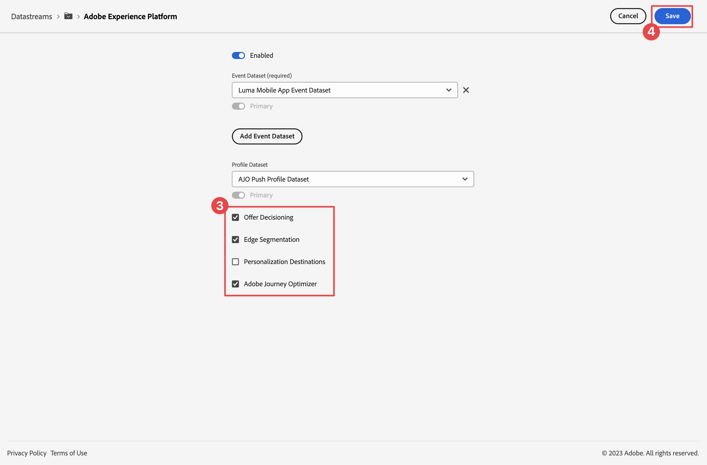

# Créer et afficher des offres avec la gestion des décisions

Découvrez comment afficher les offres de Journey Optimizer Decision Management dans vos applications mobiles avec le SDK Mobile Experience Platform.

Journey Optimizer Decision Management vous aide à offrir la meilleure offre et la meilleure expérience à vos clients sur tous les points de contact au bon moment. Une fois conçu, ciblez votre audience avec des offres personnalisées.


La gestion des décisions facilite la personnalisation grâce à une bibliothèque centrale d’offres marketing et à un moteur de décision qui applique des règles et des contraintes aux profils riches en temps réel créés par Adobe Experience Platform. Par conséquent, il vous permet d’envoyer à vos clients la bonne offre au bon moment. Voir [À propos de la gestion de la décision](https://experienceleague.adobe.com/docs/journey-optimizer/using/offer-decisioning/get-started-decision/starting-offer-decisioning.html?lang=en) pour plus d’informations.


>[!NOTE]
>
>Cette leçon est facultative et s’applique uniquement aux utilisateurs de Journey Optimizer qui souhaitent utiliser la fonctionnalité de gestion de la décision pour afficher les offres dans une application mobile.


## Conditions préalables

* Création et exécution de l’application avec les SDK installés et configurés.
* Configurez l’application pour Adobe Experience Platform.
* Accès à Journey Optimizer - Gestion des décisions avec les autorisations appropriées pour gérer les offres et les décisions, comme décrit [ici](https://experienceleague.adobe.com/docs/journey-optimizer/using/access-control/privacy/high-low-permissions.html?lang=en#decisions-permissions).


## Objectifs d&#39;apprentissage

Dans cette leçon, vous allez

* Mettez à jour votre configuration Edge pour la gestion de la décision.
* Mettez à jour votre propriété de balise avec l’extension Journey Optimizer - Decisioning.
* Mettez à jour votre schéma pour capturer les événements de proposition.
* Validez la configuration dans Assurance.
* Créez une décision d’offre en fonction des offres dans Journey Optimizer - Gestion de la décision.
* Mettez à jour votre application pour enregistrer l’extension Optimizer.
* Mettez en oeuvre les offres de la gestion de la décision dans votre application.


## Configuration

>[!TIP]
>
>Si vous avez déjà configuré votre environnement dans le cadre de la leçon [Configuration de tests A/B avec Target](target.md), vous avez peut-être déjà effectué certaines étapes de cette section de configuration.

### Mise à jour de la configuration des flux de données

Pour vous assurer que les données envoyées de votre application mobile à Platform Edge Network sont transférées à Journey Optimizer - Gestion des décisions, mettez à jour votre flux de données.

1. Dans l’interface utilisateur de la collecte de données, sélectionnez **[!UICONTROL Datastreams]**, puis sélectionnez votre flux de données, par exemple **[!DNL Luma Mobile App]**.
1. Sélectionnez  pour **[!UICONTROL Experience Platform]** et  **[!UICONTROL Modifier]** dans le menu contextuel.
1. Dans l’écran **[!UICONTROL Datastreams]** >  > **[!UICONTROL Adobe Experience Platform]**, assurez-vous que **[!UICONTROL Offer decisioning]**, **[!UICONTROL Segmentation Edge]** et **[!UICONTROL Adobe Journey Optimizer]** sont sélectionnés. Si vous souhaitez suivre la leçon sur Target, sélectionnez également **[!UICONTROL Destinations Personalization]**. Voir [Paramètres Adobe Experience Platform](https://experienceleague.adobe.com/docs/experience-platform/datastreams/configure.html?lang=en#aep) pour plus d’informations.
1. Pour enregistrer votre configuration de flux de données, sélectionnez **[!UICONTROL Enregistrer]** .

   


### Installer Journey Optimizer - Extension des balises de prise de décision

1. Accédez à **[!UICONTROL Balises]** et recherchez votre propriété de balise mobile, puis ouvrez la propriété .
1. Sélectionnez **[!UICONTROL Extensions]**.
1. Sélectionnez **[!UICONTROL Catalog]**.
1. Recherchez l’extension **[!UICONTROL Adobe Journey Optimizer - Decisioning]**.
1. Installez l’extension . L’extension ne nécessite pas de configuration supplémentaire.

   


### Mettre à jour votre schéma

1. Accédez à l’interface de collecte de données et sélectionnez **[!UICONTROL Schémas]** dans le rail de gauche.
1. Sélectionnez **[!UICONTROL Parcourir]** dans la barre supérieure.
1. Sélectionnez votre schéma pour l’ouvrir.
1. Dans l’éditeur de schéma, sélectionnez  **[!UICONTROL Ajouter]** en regard des groupes de champs.
1. Dans la boîte de dialogue **[!UICONTROL Ajouter des groupes de champs]**,  pour rechercher `proposition`, sélectionnez **[!UICONTROL Événement d’expérience - Interactions de propositions]** et sélectionnez **[!UICONTROL Ajouter des groupes de champs]**. Ce groupe de champs collecte les données d’événement d’expérience pertinentes pour les offres : quelle offre est présentée, dans le cadre de laquelle la collecte, la décision et d’autres paramètres sont définis (voir plus loin dans cette leçon). Mais que se passe-t-il avec l&#39;offre ? S’affiche, a interagi, a ignoré, etc.
   
1. Sélectionnez **[!UICONTROL Enregistrer]** pour enregistrer les modifications apportées à votre schéma.


## Validation de la configuration dans Assurance

Pour valider votre configuration dans Assurance :

1. Accédez à l’interface utilisateur d’assurance.
1. Sélectionnez **[!UICONTROL Configurer]** dans le rail gauche et sélectionnez  en regard de **[!UICONTROL Valider la configuration]** sous **[!UICONTROL ADOBE JOURNEY OPTIMIZER DECISIONING]**.
1. Sélectionnez **[!UICONTROL Enregistrer]**.
1. Sélectionnez **[!UICONTROL Valider la configuration]** dans le rail de gauche. La configuration du flux de données et celle du SDK dans votre application sont validées.
   


## Créer un emplacement

Avant de pouvoir réellement créer des offres, vous devez définir comment et où ces offres peuvent être placées dans l’application mobile. Dans la gestion de la décision, vous définissez des emplacements à cette fin et vous définirez un emplacement pour le canal mobile qui prend en charge une payload JSON :

1. Dans l’interface utilisateur de Journey Optimizer, sélectionnez  **[!UICONTROL Components]** dans la liste **[!UICONTROL GESTION DES DÉCISIONS]** du rail de gauche.

1. Sélectionnez **[!UICONTROL Emplacements]** dans la barre supérieure.

1. Si aucun emplacement nommé **[!UICONTROL Mobile JSON]**, **[!UICONTROL Mobile]** comme **[!UICONTROL Type de canal]** et **[!UICONTROL JSON]** comme **[!UICONTROL Type de contenu]** est répertorié, vous devez créer un emplacement. Sinon, continuez à [Créer des offres](#create-offers).

Pour créer l’emplacement JSON mobile :

1. Sélectionnez  Créer un emplacement.

   1. dans la section **[!UICONTROL Détails]**, saisissez `Mobile JSON` comme **[!UICONTROL Nom]**, sélectionnez **[!UICONTROL Mobile]** à partir de **[!UICONTROL Type de canal]** et **[!UICONTROL JSON]** à partir de **[!UICONTROL Type de contenu]**.
   1. Sélectionnez **[!UICONTROL Enregistrer]** pour enregistrer l’emplacement.

   


## Création d’offres

1. Dans l’interface utilisateur de Journey Optimizer, sélectionnez  **[!UICONTROL Offres]** dans **[!UICONTROL GESTION DES DÉCISIONS]** dans le rail de gauche.
1. Dans l’écran **[!UICONTROL Offres]**, sélectionnez **[!UICONTROL Parcourir]** pour afficher la liste des offres.
1. Sélectionnez **[!UICONTROL Créer une offre]**.
1. Dans la boîte de dialogue **[!UICONTROL Nouvelle offre]**, sélectionnez **[!UICONTROL Offre personnalisée]** et cliquez sur **[!UICONTROL Suivant]**.
1. À l&#39;étape **[!UICONTROL Détails]** de **[!UICONTROL Créer une offre personnalisée]** :
   1. Saisissez un **[!UICONTROL nom]** pour l’offre, par exemple `Luma - Juno Jacket`, et saisissez une **[!UICONTROL date et heure de début]** et une **[!UICONTROL date et heure de fin]**. En dehors de ces dates, l’offre ne sera pas sélectionnée par le moteur de décision.
   1. Sélectionnez **[!UICONTROL Suivant]**.
      

1. À l’étape **[!UICONTROL Ajouter des représentations]** de **[!UICONTROL Créer une offre personnalisée]** :
   1. Sélectionnez  **[!UICONTROL Mobile]** dans la liste **[!UICONTROL Canal]** et sélectionnez **[!UICONTROL Mobile JSON]** dans la liste **[!UICONTROL Placement]**.
   1. Sélectionnez **[!UICONTROL Personnalisé]** pour **[!UICONTROL Contenu]**.
   1. Sélectionnez **[!UICONTROL Ajouter du contenu]**. Dans la boîte de dialogue **[!UICONTROL Ajouter la personnalisation]** :
      1. Si un sélecteur [!UICONTROL Mode] est disponible, assurez-vous qu’il est défini sur **[!UICONTROL JSON]**.
      1. Saisissez le code JSON suivant :

         ```json
         { 
             "title": "Juno Jacket",
             "text": "On colder-than-comfortable mornings, you'll love warming up in the Juno All-Ways Performance Jacket, designed to compete with wind and chill. Built-in Cocona&trade; technology aids evaporation, while a special zip placket and stand-up collar keep your neck protected.", 
             "image": "https://luma.enablementadobe.com/content/dam/luma/en/products/women/tops/jackets/wj06-purple_main.jpg" 
         }  
         ```

      1. Sélectionnez **[!UICONTROL Enregistrer]**.
         
   1. Sélectionnez **[!UICONTROL Suivant]**.
      

1. À l’étape **[!UICONTROL Ajouter des contraintes]** de l’étape **[!UICONTROL Créer une offre personnalisée]** :
   1. Définissez **[!UICONTROL Priority]** sur `10`.
   1. Désactivez l’option **[!UICONTROL Inclusion capping]**.
   1. Sélectionnez **[!UICONTROL Suivant]**.
      

1. À l’étape **[!UICONTROL Réviser]** de **[!UICONTROL Créer une offre personnalisée]** :
   1. Vérifiez l’offre, puis sélectionnez **[!UICONTROL Terminer]**.
   1. Dans la boîte de dialogue **[!UICONTROL Enregistrer l&#39;offre]**, sélectionnez **[!UICONTROL Enregistrer et approuver]**.

1. Répétez les étapes 3 à 8 pour créer quatre offres supplémentaires avec des noms et un contenu différents. Toutes les autres valeurs de configuration, par exemple Date et heure de début ou Priorité, sont similaires à la première offre que vous avez créée. Vous pouvez rapidement créer des offres en double et les modifier.

   1. Dans l’interface utilisateur de Journey Optimizer, sélectionnez  **[!UICONTROL Offres]** dans le rail de gauche, puis sélectionnez Offres dans la barre supérieure.
   1. Sélectionnez la ligne de l’offre que vous avez créée.
   1. Dans le volet de droite, sélectionnez  **[!UICONTROL Autres actions]** et, dans le menu contextuel, sélectionnez  **[!UICONTROL Dupliquer]**.

      Utilisez le tableau ci-dessous pour définir les quatre autres offres.

      | Nom de l’offre | Contenu des offres dans JSON |
      |---|---|
      | Luma - bouteille d’eau Affirmée | `{ "title": "Affirm Water Bottle", "text": "You'll stay hydrated with ease with the Affirm Water Bottle by your side or in hand. Measurements on the outside help you keep track of how much you're drinking, while the screw-top lid prevents spills. A metal carabiner clip allows you to attach it to the outside of a backpack or bag for easy access.", "image": "https://luma.enablementadobe.com/content/dam/luma/en/products/gear/fitness-equipment/ug06-lb-0.jpg" }` |
      | Luma - Teinte de condition physique désirée | `{ "title": "Desiree Fitness Tee", "text": "When you're too far to turn back, thank yourself for choosing the Desiree Fitness Tee. Its ultra-lightweight, ultra-breathable fabric wicks sweat away from your body and helps keeps you cool for the distance.", "image": "https://luma.enablementadobe.com/content/dam/luma/en/products/women/tops/tees/ws05-yellow_main.jpg" }` |
      | Luma - Adrienne Trek Jacket | `{ "title": "Adrienne Trek Jacket", "text": "You're ready for a cross-country jog or a coffee on the patio in the Adrienne Trek Jacket. Its style is unique with stand collar and drawstrings, and it fits like a jacket should.", "image": "https://luma.enablementadobe.com/content/dam/luma/en/products/women/tops/jackets/wj08-gray_main.jpg" }` |
      | Luma - Teinte de l’état de santé quotidien d’Aero | `{ "title": "Aero Daily Fitness Tee", "text": "Need an everyday action tee that helps keep you dry? The Aero Daily Fitness Tee is made of 100% polyester wicking knit that funnels moisture away from your skin. Don't be fooled by its classic style; this tee hides premium performance technology beneath its unassuming look.", "image": "https://luma.enablementadobe.com/content/dam/luma/en/products/men/tops/tees/ms01-black_main.jpg" }` |

      {style="table-layout:fixed"}

1. En dernière étape, vous devez créer une offre de secours, c’est-à-dire une offre envoyée aux clients s’ils ne sont pas éligibles pour d’autres offres.
   1. Sélectionnez **[!UICONTROL Créer une offre]**.
   1. Dans la boîte de dialogue **[!UICONTROL Nouvelle offre]**, sélectionnez **[!UICONTROL Offre personnalisée]** et sélectionnez **[!UICONTROL Suivant]**.
   1. À l’étape **[!UICONTROL Détails]** de **[!UICONTROL Créer une offre de secours]**, saisissez un **[!UICONTROL Nom]** pour l’offre, par exemple `Luma - Fallback Offer`, puis sélectionnez **[!UICONTROL Suivant]**.

   1. À l’étape **[!UICONTROL Ajouter des représentations]** de **[!UICONTROL Créer une offre de secours]** :
      1. Sélectionnez  **[!UICONTROL Mobile]** dans la liste **[!UICONTROL Canal]** et sélectionnez **[!UICONTROL Mobile JSON]** dans la liste **[!UICONTROL Placement]**.
      1. Sélectionnez **[!UICONTROL Personnalisé]** pour **[!UICONTROL Contenu]**.
      1. Sélectionnez **[!UICONTROL Ajouter du contenu]**.
      1. Dans la boîte de dialogue **[!UICONTROL Ajouter une personnalisation]**, saisissez le code JSON suivant et sélectionnez **[!UICONTROL Enregistrer]** :

         ```json
         {  
            "title": "Luma",
            "text": "Your store for sports wear and equipment.", 
            "image": "https://luma.enablementadobe.com/content/dam/luma/en/logos/Luma_Logo.png" 
         }  
         ```

      1. Sélectionnez **[!UICONTROL Suivant]**.


1. À l’étape **[!UICONTROL Réviser]** de **[!UICONTROL Créer une offre de secours]** :
   1. Vérifiez l’offre, puis sélectionnez **[!UICONTROL Terminer]**.
   1. Dans la boîte de dialogue **[!UICONTROL Enregistrer l&#39;offre]**, sélectionnez **[!UICONTROL Enregistrer et approuver]**.

Vous devriez maintenant avoir la liste d’offres suivante :


## Création d’une collection

Pour présenter une offre à l’utilisateur de votre application mobile, vous devez définir une collection d’offres composée d’une ou de plusieurs des offres que vous avez créées.

1. Dans l’interface utilisateur de Journey Optimizer, sélectionnez **[!UICONTROL Offres]** dans le rail de gauche.
1. Sélectionnez **[!UICONTROL Collections]** dans la barre supérieure.
1. Sélectionnez  **[!UICONTROL Créer une collection]**.
1. Dans la boîte de dialogue **[!UICONTROL Nouvelle collection]**, saisissez un **[!UICONTROL nom]** pour votre collection, par exemple `Luma - Mobile App Collection`, sélectionnez **[!UICONTROL Créer une collection statique]**, puis cliquez sur **[!UICONTROL Suivant]**.
1. Dans **[!DNL Luma - Mobile App Collection]**, sélectionnez les offres que vous souhaitez inclure dans la collection. Pour ce tutoriel, sélectionnez les cinq offres que vous avez créées. Vous pouvez facilement filtrer la liste à l’aide du champ de recherche, par exemple en tapant **[!DNL Luma]**.
1. Sélectionnez **[!UICONTROL Enregistrer]**.

   


## Création d’une décision

La dernière étape consiste à définir une décision, c’est-à-dire la combinaison d’une ou de plusieurs portées de décision et de votre offre de secours.

Une portée de décision est une combinaison d’un emplacement spécifique (par exemple, un HTML dans un email ou un JSON dans une application mobile) et d’un ou plusieurs critères d’évaluation.

Un critère d’évaluation est la combinaison de

* une collection d&#39;offres,
* règles d&#39;éligibilité : par exemple, l&#39;offre n&#39;est disponible que pour une audience spécifique,
* une méthode de classement : lorsque plusieurs offres sont disponibles, quelle méthode utilisez-vous pour les classer (par priorité d’offre, à l’aide d’une formule ou d’un modèle d’IA, par exemple).

Reportez-vous à la section [Étapes clés de création et de gestion des offres](https://experienceleague.adobe.com/docs/journey-optimizer/using/offer-decisioning/get-started-decision/key-steps.html?lang=en) si vous souhaitez mieux comprendre comment les emplacements, les règles, les classements, les offres, les représentations, les collections, les décisions, etc., interagissent et se connectent les uns aux autres. Cette leçon porte uniquement sur l’utilisation des résultats d’une décision plutôt que sur la flexibilité de définition des décisions dans Journey Optimizer - Gestion des décisions.

1. Dans l’interface utilisateur de Journey Optimizer, sélectionnez **[!UICONTROL Offres]** dans le rail de gauche.
1. Sélectionnez **[!UICONTROL Decisions]** dans la barre supérieure.
1. Sélectionnez  **[!UICONTROL Créer une décision]**.
1. À l’étape **[!UICONTROL Details]** de **[!UICONTROL Créer une décision d’offre]** :
   1. Saisissez un **[!UICONTROL Nom]** pour la décision, par exemple `Luma - Mobile App Decision`, saisissez **[!UICONTROL Date et heure de début]** et **[!UICONTROL Date et heure de fin]**.
   1. Sélectionnez **[!UICONTROL Suivant]**.

1. À l’étape **[!UICONTROL Ajouter des portées de décision]** de **[!UICONTROL Créer une décision d’offre]** :
   1. Sélectionnez **[!UICONTROL Mobile JSON]** dans la liste **[!UICONTROL Placement]**.
   1. Dans la mosaïque **[!UICONTROL Critères d&#39;évaluation]**, sélectionnez  **[!UICONTROL Ajouter]**.
      1. Dans la boîte de dialogue **[!UICONTROL Ajouter une collection d’offres]**, sélectionnez votre collection d’offres. Par exemple : **[!DNL Luma - Mobile App Collection]**.
      1. Sélectionnez **[!UICONTROL Ajouter]**.
         
   1. Assurez-vous que **[!UICONTROL Aucun]** est sélectionné pour **[!UICONTROL Eligibilité]**, et que **[!UICONTROL La priorité des offres]** est sélectionnée comme **[!UICONTROL Méthode de classement]**.
   1. Sélectionnez **[!UICONTROL Suivant]**.
      .
1. À l’étape **[!UICONTROL Ajouter une offre de secours]** de **[!UICONTROL Créer une décision d’offre]** :
   1. Sélectionnez votre offre de secours, par exemple **[!DNL Luma - Fallback offer]**.
   1. Sélectionnez **[!UICONTROL Suivant]**.
1. À l’étape **[!UICONTROL Summary]** de **[!UICONTROL Create a new offer décision]** :
   1. Sélectionnez **[!UICONTROL Terminer]**.
   1. Dans la boîte de dialogue **[!UICONTROL Enregistrer la décision d’offre]**, sélectionnez **[!UICONTROL Enregistrer et activer]**.
   1. Dans l’onglet **[!UICONTROL Decisions]** , votre décision est prise avec l’état **[!UICONTROL Live]**.

Votre décision d’offre, consistant en un ensemble d’offres, est maintenant prête à être utilisée. Pour utiliser la décision dans votre application, vous devez vous référer dans votre code à la portée de la décision.

1. Dans l’interface utilisateur de Journey Optimizer, sélectionnez **[!UICONTROL Offres]**.
1. Sélectionnez **[!UICONTROL Decisions]** dans la barre supérieure.
1. Sélectionnez votre décision, par exemple **[!DNL Luma - Mobile App Decision]**.
1. Dans la mosaïque **[!UICONTROL Portées de décision]**, sélectionnez  **[!UICONTROL Copier]**.
1. Dans le menu contextuel, sélectionnez **[!UICONTROL Étendue de la décision]**.
   
1. Utilisez n’importe quel éditeur de texte pour coller la portée de la décision en vue d’une utilisation ultérieure. La portée de décision présente le format JSON suivant.

   ```json
   {
       "xdm:activityId":"xcore:offer-activity:xxxxxxxxxxxxxxx",
       "xdm:placementId":"xcore:offer-placement:xxxxxxxxxxxxxxx"
   }
   ```

## Mise en oeuvre d’offres dans votre application

Comme indiqué dans les leçons précédentes, l’installation d’une extension de balise mobile fournit uniquement la configuration. Vous devez ensuite installer et enregistrer le SDK Optimiser. Si ces étapes ne sont pas claires, consultez la section [Installer les SDK](install-sdks.md) .

>[!NOTE]
>
>Si vous avez terminé la section [Installer les SDK](install-sdks.md) , le SDK est déjà installé et vous pouvez ignorer cette étape.
>

1. Dans Xcode, assurez-vous que [AEP Optimize](https://github.com/adobe/aepsdk-messaging-ios) est ajouté à la liste des modules dans les dépendances de modules. Voir [Swift Package Manager](install-sdks.md#swift-package-manager).
1. Accédez à **[!DNL Luma]** > **[!DNL Luma]** > **[!UICONTROL AppDelegate]** dans le navigateur de projet Xcode.
1. Assurez-vous que `AEPOptimize` fait partie de votre liste d’importations.

   ```swift
   import AEPOptimize
   ```

1. Vérifiez que `Optimize.self` fait partie du tableau des extensions que vous enregistrez.

   ```swift
   let extensions = [
       AEPIdentity.Identity.self,
       Lifecycle.self,
       Signal.self,
       Edge.self,
       AEPEdgeIdentity.Identity.self,
       Consent.self,
       UserProfile.self,
       Places.self,
       Messaging.self,
       Optimize.self,
       Assurance.self
   ]
   ```

1. Accédez à **[!DNL Luma]** > **[!DNL Luma]** > **[!DNL Model]** > **[!DNL Data]** > **[!UICONTROL décisions]** dans le navigateur de projet Xcode. Mettez à jour les valeurs `activityId` et `placementId` avec les détails de la portée de décision que vous avez copiés à partir de l’interface de Journey Optimizer.

1. Accédez à **[!DNL Luma]** > **[!DNL Luma]** > **[!DNL Utils]** > **[!UICONTROL MobileSDK]** dans le navigateur de projet Xcode. Recherchez la fonction `func updatePropositionOD(ecid: String, activityId: String, placementId: String, itemCount: Int) async` . Ajoutez le code suivant :

   ```swift
   // set up the XDM dictionary, define decision scope and call update proposition API
   Task {  
      let ecid = ["ECID" : ["id" : ecid, "primary" : true] as [String : Any]]
      let identityMap = ["identityMap" : ecid]
      let xdmData = ["xdm" : identityMap]
      let decisionScope = DecisionScope(activityId: activityId, placementId: placementId, itemCount: UInt(itemCount))
      Optimize.clearCachedPropositions()
      Optimize.updatePropositions(for: [decisionScope], withXdm: xdmData)
   }
   ```

   Cette fonction :

   * configure un dictionnaire XDM `xdmData`, contenant l’ECID pour identifier le profil pour lequel vous devez présenter les offres.
   * définit `decisionScope`, un objet qui est basé sur la décision que vous avez définie dans l’interface Journey Optimizer - Gestion des décisions et qui est défini à l’aide de la portée de décision copiée depuis [Créer une décision](#create-a-decision).  L’application Luma utilise un fichier de configuration (`decisions.json`) qui récupère les paramètres de portée, en fonction du format JSON suivant :

     ```swift
     "scopes": [
         {
             "name": "name of the scope",
             "activityId": "xcore:offer-activity:xxxxxxxxxxxxxxx",
             "placementId": "xcore:offer-placement:xxxxxxxxxxxxxxx",
             "itemCount": 2
         }
     ]
     ```

     Cependant, vous pouvez utiliser n’importe quel type d’implémentation pour vous assurer que les API d’optimisation obtiennent les paramètres appropriés (`activityId`, `placementId` et, `itemCount`) pour construire un objet [`DecisionScope`](https://developer.adobe.com/client-sdks/documentation/adobe-journey-optimizer-decisioning/api-reference/#decisionscope) valide pour votre implémentation. <br/>Pour plus d’informations : les autres valeurs de clé du fichier `decisions.json` sont destinées à une utilisation ultérieure et ne sont pas pertinentes et utilisées actuellement dans cette leçon et dans le cadre du tutoriel.

   * appelle deux API : [`Optimize.clearCachePropositions`](https://support.apple.com/en-ie/guide/mac-help/mchlp1015/mac) et [`Optimize.updatePropositions`](https://developer.adobe.com/client-sdks/documentation/adobe-journey-optimizer-decisioning/api-reference/#updatepropositions).  Ces fonctions effacent toutes les propositions mises en cache et mettent à jour les propositions de ce profil.

1. Accédez à **[!DNL Luma]** > **[!DNL Luma]** > **[!DNL Views]** > **[!UICONTROL Personalization]** > **[!UICONTROL EdgeOffersView]** dans le navigateur de projet Xcode. Recherchez la fonction `func onPropositionsUpdateOD(activityId: String, placementId: String, itemCount: Int) async` et examinez le code de cette fonction. La partie la plus importante de cette fonction est l’appel API [`Optimize.onPropositionsUpdate`](https://developer.adobe.com/client-sdks/documentation/adobe-journey-optimizer-decisioning/api-reference/#onpropositionsupdate), qui

   * récupère les propositions du profil actuel en fonction de la portée de la décision (que vous avez définie dans Journey Optimizer - Gestion des décisions),
   * récupère l&#39;offre à partir de la proposition,
   * libère le contenu de l’offre afin qu’elle puisse s’afficher correctement dans l’application ; et
   * déclenche l’action `displayed()` sur l’offre qui renvoie un événement à l’Edge Network informant l’affichage de l’offre.

1. Toujours dans **[!DNL EdgeOffersView]**, ajoutez le code suivant au modificateur `.onFirstAppear`. Ce code garantit que le rappel pour la mise à jour des offres n’est enregistré qu’une seule fois.

   ```swift
   // Invoke callback for offer updates
   Task {
       await self.onPropositionsUpdateOD(activityId: decision.activityId, placementId: decision.placementId, itemCount: decision.itemCount)
   }
   ```

1. Toujours dans **[!UICONTROL EdgeOffersView]**, ajoutez le code suivant au modificateur `.task`. Ce code met à jour les offres lorsque la vue est actualisée.

   ```swift
   // Clear and update offers
   await self.updatePropositionsOD(ecid: currentEcid, activityId: decision.activityId, placementId: decision.placementId, itemCount: decision.itemCount)
   ```


## Validation à l’aide de l’application

1. Recréez et exécutez l’application dans le simulateur ou sur un appareil physique à partir de Xcode, en utilisant .

1. Accédez à l’onglet **[!DNL Personalisation]**.

1. Sélectionnez **[!DNL Edge Personalisation]**.

1. Faites défiler l’écran jusqu’en haut de l’écran pour afficher deux offres aléatoires affichées à partir de la collection que vous avez définie dans la mosaïque **[!DNL DECISION LUMA - MOBILE APP DECISION]**.

   

   Les offres sont aléatoires, car vous avez donné à toutes les offres la même priorité et le classement de la décision est basé sur la priorité.


## Validation de la mise en oeuvre dans Assurance

Pour valider la mise en oeuvre des offres dans Assurance :

1. Consultez la section [instructions de configuration](assurance.md#connecting-to-a-session) pour connecter votre simulateur ou périphérique à Assurance.
1. Sélectionnez **[!UICONTROL Configurer]** dans le rail gauche et sélectionnez  en regard de **[!UICONTROL Réviser et simuler]** sous **[!UICONTROL ADOBE JOURNEY OPTIMIZER DECISIONING]**.
1. Sélectionnez **[!UICONTROL Enregistrer]**.
1. Sélectionnez **[!UICONTROL Réviser et simuler]** dans le rail de gauche. La configuration du flux de données est validée et celle du SDK dans votre application.
1. Sélectionnez **[!UICONTROL Demandes]** dans la barre supérieure. Vos demandes **[!UICONTROL Offres]** s’affichent.
   

1. Vous pouvez explorer les onglets **[!UICONTROL Simuler]** et **[!UICONTROL Liste d’événements]** pour en savoir plus sur les fonctionnalités, en vérifiant votre configuration de la gestion des décisions Journey Optimizer.

## Étapes suivantes

Vous devriez maintenant disposer de tous les outils pour commencer à ajouter d’autres fonctionnalités à votre implémentation Journey Optimizer - Gestion des décisions . Par exemple :

* appliquer différents paramètres à vos offres (par exemple, priorité, limitation) ;
* collecter des attributs de profil dans l’application (voir [Profile](profile.md)) et utiliser ces attributs de profil pour créer des audiences ; Utilisez ensuite ces audiences dans le cadre des règles d’éligibilité de votre décision.
* combiner plusieurs portées de décision.

>[!SUCCESS]
>
>Vous avez activé l’application pour afficher les offres à l’aide de l’extension Journey Optimizer - Decisioning pour le SDK Mobile Experience Platform.
>
>Merci d’investir votre temps à apprendre sur le SDK Adobe Experience Platform Mobile. Si vous avez des questions, souhaitez partager des commentaires généraux ou avez des suggestions sur le contenu à venir, partagez-les sur cet [post de discussion de la communauté Experience League](https://experienceleaguecommunities.adobe.com/t5/adobe-experience-platform-data/tutorial-discussion-implement-adobe-experience-cloud-in-mobile/td-p/443796).

Suivant : **[Effectuer des tests A/B](target.md)**
