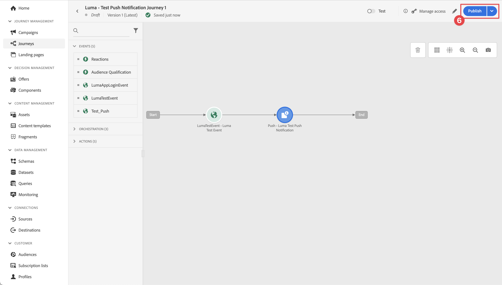

# Créer et envoyer des notifications push

Découvrez comment créer des notifications push pour les applications mobiles avec le SDK Mobile Experience Platform et Journey Optimizer.

Journey Optimizer vous permet de créer des parcours et d’envoyer des messages à des audiences ciblées. Avant d’envoyer des notifications push avec Journey Optimizer, vous devez vous assurer que les configurations et intégrations appropriées sont en place. Pour comprendre le flux de données des notifications push dans Journey Optimizer, reportez-vous au [documentation](https://experienceleague.adobe.com/docs/journey-optimizer/using/push/push-config/push-gs.html).


>[!NOTE]
>
>Cette leçon est facultative et s’applique uniquement aux utilisateurs de Journey Optimizer qui souhaitent envoyer des notifications push.


## Conditions préalables

* Création et exécution de l’application avec les SDK installés et configurés.
* Configurez l’application pour Adobe Experience Platform.
* Accès à Journey Optimizer et autorisations suffisantes, comme décrit [here](https://experienceleague.adobe.com/docs/journey-optimizer/using/push/push-config/push-configuration.html?lang=en). Vous avez également besoin d’une autorisation suffisante pour accéder aux fonctionnalités Journey Optimizer suivantes.
   * Créez une surface d’application.
   * Créez un parcours.
   * Créez un message.
   * Créer des paramètres prédéfinis de message.
* **Compte de développeur Apple payant** avec un accès suffisant pour créer des certificats, des identifiants et des clés.
* Appareil ou simulateur iOS physique à tester.

## Objectifs d&#39;apprentissage

Dans cette leçon, vous allez

* Enregistrez l’ID d’application avec le service Apple Push Notification (APNS).
* Créez une surface d’application dans Journey Optimizer.
* Mettez à jour votre schéma pour inclure les champs de messagerie push.
* Installez et configurez l’extension de balise Journey Optimizer.
* Mettez à jour votre application pour enregistrer l’extension de balise Journey Optimizer.
* Validez la configuration dans Assurance.
* Envoi d’un message de test à partir d’Assurance
* Définissez votre propre événement, parcours et expérience de notification push dans Journey Optimizer.
* Envoyez votre propre notification push depuis l’application.


## Configuration

>[!TIP]
>
>Si vous avez déjà configuré votre environnement dans le cadre de la [Messagerie in-app Journey Optimizer](journey-optimizer-inapp.md) leçon : vous avez peut-être déjà effectué certaines des étapes de cette section de configuration.

### Enregistrement de l’ID d’application avec des APNS

Les étapes suivantes ne sont pas spécifiques à Adobe Experience Cloud et sont conçues pour vous guider tout au long de la configuration des APNS.

#### Création d’une clé privée

1. Sur le portail destiné aux développeurs Apple, accédez à **[!UICONTROL Clés]**.
1. Pour créer une clé, sélectionnez **[!UICONTROL +]**.
   

1. Fournissez une **[!UICONTROL Nom de la clé]**.
1. Sélectionnez la variable **[!UICONTROL Service de notification push Apple] (APNS)** .
1. Sélectionnez **[!UICONTROL Continuer]**.
   
1. Vérifiez la configuration et sélectionnez **[!UICONTROL Enregistrer]**.
1. Téléchargez la `.p8` clé privée. Il est utilisé dans la configuration Surface de l’application plus loin dans cette leçon.
1. Prenez note de la **[!UICONTROL ID de clé]**. Il est utilisé dans la configuration Surface de l’application.
1. Prenez note de la **[!UICONTROL Identifiant de l’équipe]**. Il est utilisé dans la configuration Surface de l’application.
   

Une documentation supplémentaire peut être [se trouve ici](https://help.apple.com/developer-account/#/devcdfbb56a3).

#### Ajout d’une surface d’application dans la collecte de données

1. Dans la [Interface de collecte de données](https://experience.adobe.com/data-collection/), sélectionnez **[!UICONTROL Surfaces de l’application]** dans le panneau de gauche.
1. Pour créer une configuration, sélectionnez **[!UICONTROL Créer une surface d’application]**.
   
1. Saisissez un **[!UICONTROL Nom]** pour la configuration, par exemple `Luma App Tutorial`  .
1. De **[!UICONTROL Configuration des applications mobiles]**, sélectionnez **[!UICONTROL Apple iOS]**.
1. Saisissez l’ID du lot de l’application mobile dans la **[!UICONTROL ID d’application (ID de bundle iOS)]** champ . Par exemple :  `com.adobe.luma.tutorial.swiftui`.
1. Activez l’option **[!UICONTROL Informations d’identification push]** pour ajouter vos informations d’identification.
1. Faites glisser et déposez votre `.p8` **Clé d’authentification des notifications push Apple** fichier .
1. Fournissez les **[!UICONTROL ID de clé]**, chaîne de 10 caractères attribuée lors de la création de la variable `p8` clé auth. Elle se trouve sous la variable **[!UICONTROL Clés]** dans le **Certificats, identifiants et profils** page des pages du portail des développeurs Apple. Voir aussi [Création d’une clé privée](#create-a-private-key).
1. Indiquez l&#39;**[!UICONTROL identifiant d&#39;équipe]**. L’ ID d’équipe est une valeur qui se trouve sous la variable **Abonnement** ou dans la partie supérieure de la page Portail des développeurs Apple. Voir aussi [Création d’une clé privée](#create-a-private-key).
1. Sélectionnez **[!UICONTROL Enregistrer]**.

   

### Mise à jour de la configuration des flux de données

Pour vous assurer que les données envoyées de votre application mobile au réseau Edge sont transférées vers Journey Optimizer, mettez à jour votre configuration Experience Edge .

1. Dans l’interface utilisateur de la collecte de données, sélectionnez **[!UICONTROL Datastreams]**, puis sélectionnez votre flux de données, par exemple **[!DNL Luma Mobile App]**.
1. Sélectionner  pour **[!UICONTROL Experience Platform]** et sélectionnez  **[!UICONTROL Modifier]** dans le menu contextuel.
1. Dans le **[!UICONTROL Datastreams]** >  >  **[!UICONTROL Adobe Experience Platform]** écran :

   1. Si elle n’est pas déjà sélectionnée, sélectionnez **[!UICONTROL Jeu de données de profil push AJO]** de **[!UICONTROL Jeu de données de profil]**. Ce jeu de données de profil est requis lors de l’utilisation de la variable `MobileCore.setPushIdentifier` appel API (voir [Enregistrement du jeton de périphérique pour les notifications push](#register-device-token-for-push-notifications)) qui garantit que l’identifiant unique des notifications push (ou identifiant push) est stocké dans le profil de l’utilisateur.

   1. **[!UICONTROL Adobe Journey Optimizer]** est sélectionnée. Voir [Paramètres Adobe Experience Platform](https://experienceleague.adobe.com/docs/experience-platform/datastreams/configure.html?lang=en#aep) pour plus d’informations.

   1. Pour enregistrer votre configuration de flux de données, sélectionnez **[!UICONTROL Enregistrer]**.

   


### Installation de l’extension de balises Journey Optimizer

Pour que votre application fonctionne avec Journey Optimizer, vous devez mettre à jour la propriété de balise.

1. Accédez à **[!UICONTROL Balises]** > **[!UICONTROL Extensions]** > **[!UICONTROL Catalogue]**,
1. Ouvrez votre propriété, par exemple **[!DNL Luma Mobile App Tutorial]**.
1. Sélectionner **[!UICONTROL Catalogue]**.
1. Recherchez le **[!UICONTROL Adobe Journey Optimizer]** extension .
1. Installez l’extension .
1. Dans le **[!UICONTROL Installer l’extension]** dialog
   1. Sélectionnez un environnement, par exemple **[!UICONTROL Développement]**.
   1. Sélectionnez la variable **[!UICONTROL Jeu de données d’événement de suivi push AJO]** jeu de données à partir du **[!UICONTROL Jeu de données d’événement]** liste.
   1. Sélectionner **[!UICONTROL Enregistrer dans la bibliothèque et créer]**.
      

>[!NOTE]
>
>Si vous ne voyez pas **[!UICONTROL Jeu de données d’événement de suivi push AJO]** contactez l’assistance clientèle.
>

## Validation de la configuration avec Assurance

1. Consultez la section [instructions de configuration](assurance.md#connecting-to-a-session) pour connecter le simulateur ou l’appareil à Assurance.
1. Dans l’interface utilisateur d’assurance, sélectionnez **[!UICONTROL Configurer]**.
   
1. Sélectionner  en regard de **[!UICONTROL Débogage Push]**.
1. Sélectionnez **[!UICONTROL Enregistrer]**.
   
1. Sélectionner **[!UICONTROL Débogage Push]** dans le volet de navigation de gauche.
1. Sélectionnez la variable **[!UICONTROL Validation de la configuration]** .
1. Sélectionnez votre périphérique dans le **[!UICONTROL Client]** liste.
1. Confirmez que vous n’obtenez aucune erreur.
   
1. Sélectionnez la variable **[!UICONTROL Envoyer le test push]** .
1. (Facultatif) Modifiez les détails par défaut de la variable **[!UICONTROL Titre]** et **[!UICONTROL Corps]**
1. Sélectionner  **[!UICONTROL Envoi de la notification push de test]**.
1. Vérifiez les **[!UICONTROL Résultats du test]**.
1. La notification push de test devrait apparaître dans votre application.

   


## Signature

La signature de l’application Luma est nécessaire pour envoyer des notifications push et **nécessite un compte de développeur Apple payant**.

Pour mettre à jour la signature de votre application :

1. Accédez à votre application dans Xcode.
1. Sélectionner **[!DNL Luma]** dans le navigateur de projet.
1. Sélectionnez la variable **[!DNL Luma]** cible.
1. Sélectionnez la variable **Signature et fonctionnalités** .
1. Configurer **[!UICONTROL Gestion automatique de la signature]**, **[!UICONTROL Équipe]**, et **[!UICONTROL Identifiant du lot]** ou utilisez les détails de mise en service du développement Apple spécifiques.

   >[!IMPORTANT]
   >
   >Assurez-vous d’utiliser une _unique_ identifiant de lot et remplacez la variable `com.adobe.luma.tutorial.swiftui` identifiant de lot, car chaque identifiant de lot doit être unique. En règle générale, vous utilisez un format DNS inversé pour les chaînes d’ID de lot, comme `com.organization.brand.uniqueidentifier`. La version Terminée de ce tutoriel, par exemple, utilise `com.adobe.luma.tutorial.swiftui`.


   {zoomable=&quot;yes&quot;}


## Ajout de fonctionnalités de notification push à votre application

>[!IMPORTANT]
>
>Pour mettre en oeuvre et tester une notification push dans une application iOS, vous devez disposer d’un **paid** Compte de développeur Apple. Si vous ne disposez pas d’un compte de développeur Apple payant, vous pouvez ignorer le reste de cette leçon.

1. Dans Xcode, sélectionnez **[!DNL Luma]** de la **[!UICONTROL CIBLES]** , sélectionnez la variable **[!UICONTROL Signature et fonctionnalités]** , sélectionnez l’onglet **[!UICONTROL + Fonctionnalité]** , puis sélectionnez **[!UICONTROL Notifications push]**. Cela permet à votre application de recevoir des notifications push.

1. Vous devez ensuite ajouter une extension de notification à l’application. Revenez au **[!DNL General]** et sélectionnez l’option **[!UICONTROL +]** en bas de la page **[!UICONTROL CIBLES]** .

1. Vous êtes invité à sélectionner le modèle correspondant à votre nouvelle cible. Sélectionner **[!UICONTROL Extension du service de notification]** puis sélectionnez **[!UICONTROL Suivant]**.

1. Dans la fenêtre suivante, utilisez `NotificationExtension` comme nom de l’extension et cliquez sur le bouton **[!UICONTROL Terminer]** bouton .

Une extension de notification push doit maintenant être ajoutée à votre application, comme dans l’écran ci-dessous.


## Mise en oeuvre de Journey Optimizer dans l’application

Comme indiqué dans les leçons précédentes, l’installation d’une extension de balise mobile fournit uniquement la configuration. Vous devez ensuite installer et enregistrer le SDK de messagerie. Si ces étapes ne sont pas claires, passez en revue la [Installation des SDK](install-sdks.md) .

>[!NOTE]
>
>Si vous avez terminé la [Installation des SDK](install-sdks.md) , le SDK est déjà installé et vous pouvez ignorer cette étape.
>

1. Dans Xcode, assurez-vous que [Messagerie AEP](https://github.com/adobe/aepsdk-messaging-ios) est ajouté à la liste des modules dans les dépendances de modules. Voir [Swift Package Manager](install-sdks.md#swift-package-manager).
1. Accédez à **[!DNL Luma]** > **[!DNL Luma]** > **[!UICONTROL AppDelegate]** dans le navigateur de projet Xcode.
1. Assurez-vous que `AEPMessaging` fait partie de votre liste d’importations.

   `import AEPMessaging`

1. Assurez-vous que `Messaging.self` fait partie du tableau des extensions que vous enregistrez.

   ```swift
   let extensions = [
       AEPIdentity.Identity.self,
       Lifecycle.self,
       Signal.self,
       Edge.self,
       AEPEdgeIdentity.Identity.self,
       Consent.self,
       UserProfile.self,
       Places.self,
       Messaging.self,
       Optimize.self,
       Assurance.self
   ]
   ```

## Enregistrement du jeton de périphérique pour les notifications push

1. Ajoutez la variable [`MobileCore.setPushIdentifier`](https://developer.adobe.com/client-sdks/documentation/mobile-core/api-reference/#setpushidentifier) de l’API `func application(_ application: UIApplication, didRegisterForRemoteNotificationsWithDeviceToken deviceToken: Data)` de la fonction

   ```swift
   // Send push token to Mobile SDK
   MobileCore.setPushIdentifier(deviceToken)
   ```

   Cette fonction récupère le jeton de l’appareil unique sur lequel l’application est installée. Définit ensuite le jeton pour la diffusion de la notification push à l’aide de la configuration que vous avez configurée et qui repose sur le service Apple Push Notification (APN).

>[!IMPORTANT]
>
>La variable `MobileCore.updateConfigurationWith(configDict: ["messaging.useSandbox": true])` détermine si les notifications push utilisent un environnement de test APN ou un serveur de production pour envoyer des notifications push. Lors du test de votre application dans le simulateur ou sur un appareil, assurez-vous que la variable `messaging.useSandbox` est défini sur `true` vous recevez donc des notifications push. Lorsque vous déployez votre application en production pour effectuer des tests à l’aide d’Apple Testflight, assurez-vous que vous définissez `messaging.useSandbox` to `false` sinon votre application de production ne pourra pas recevoir de notifications push.


## Créer votre propre notification push

Pour créer votre propre notification push, vous devez définir un événement dans Journey Optimizer qui déclenche un parcours chargé de l&#39;envoi d&#39;une notification push.

### Mettre à jour votre schéma

Vous allez définir un nouveau type d’événement, qui n’est pas encore disponible dans la liste des événements définis dans votre schéma. Vous utiliserez ce type d’événement ultérieurement lors du déclenchement des notifications push.

1. Dans l’interface utilisateur de Journey Optimizer, sélectionnez **[!UICONTROL Schémas]** dans le rail de gauche.
1. Sélectionner **[!UICONTROL Parcourir]** dans la barre d’onglets.
1. Sélectionnez votre schéma, par exemple **[!DNL Luma Mobile App Event Schema]** pour l’ouvrir.
1. Dans l’éditeur de schémas :
   1. Sélectionnez la variable **[!UICONTROL eventType]** champ .
   1. Dans le **[!UICONTROL Propriétés du champ]** , faites défiler l’écran vers le bas pour afficher la liste des valeurs possibles pour le type d’événement. Sélectionner **[!UICONTROL Ajouter une ligne]** et ajoutez `application.test` comme la propriété **[!UICONTROL VALEUR]** et `[!UICONTROL Test event for push notification]` comme la propriété `DISPLAY NAME`.
   1. Sélectionnez **[!UICONTROL Appliquer]**.
   1. Sélectionnez **[!UICONTROL Enregistrer]**.
      

### Définition d’un événement

Les événements dans Journey Optimizer vous permettent de déclencher vos parcours unitairement pour envoyer des messages, par exemple des notifications push. Voir [À propos des événements](https://experienceleague.adobe.com/docs/journey-optimizer/using/configuration/configure-journeys/events-journeys/about-events.html?lang=en) pour plus d’informations.

1. Dans l’interface utilisateur de Journey Optimizer, sélectionnez **[!UICONTROL Configurations]** dans le rail de gauche.

1. Dans le **[!UICONTROL Tableau de bord]** sélectionnez l’écran **[!UICONTROL Gérer]** dans le **[!UICONTROL Événements]** mosaïque.

1. Dans le **[!UICONTROL Événements]** écran, sélectionnez **[!UICONTROL Créer un événement]**.

1. Dans le **[!UICONTROL Modifier event1]** Volet :

   1. Entrée `LumaTestEvent` comme la propriété **[!UICONTROL Nom]** de l’événement .
   1. Fournissez une **[!UICONTROL Description]**, par exemple `Test event to trigger push notifications in Luma app`.

   1. Sélectionnez le schéma d’événement d’expérience d’application mobile que vous avez créé précédemment dans [Créer un schéma XDM](create-schema.md) de la **[!UICONTROL Schéma]** liste, par exemple **[!DNL Luma Mobile App Event Schema v.1]**.
   1. Sélectionner  en regard de **[!UICONTROL Champs]** liste.

      

      Dans le **[!UICONTROL Champs]** , assurez-vous que les champs suivants sont sélectionnés (en plus des champs par défaut qui sont toujours sélectionnés (**[!UICONTROL _id]**, **[!UICONTROL id]**, et **[!UICONTROL timestamp]**). Vous pouvez basculer entre les **[!UICONTROL Sélectionné]**, **[!UICONTROL Tous]** et **[!UICONTROL Principal]** ou utilisez la fonction  champ .

      * **[!UICONTROL Application identifiée (id)]**,
      * **[!UICONTROL Type d’événement (eventType)]**,
      * **[!UICONTROL Principal (principal)]**.

      

      Sélectionnez **[!UICONTROL Ok]**.

   1. Sélectionner  en regard de **[!UICONTROL Condition d’identifiant d’événement]** champ .

      1. Dans le **[!UICONTROL Ajout d’une condition d’identifiant d’événement]** boîte de dialogue, glisser-déposer **[!UICONTROL Type d’événement (eventType)]** à **[!UICONTROL Faire glisser et déposer un élément ici]**.
      1. Dans la fenêtre contextuelle, faites défiler l’écran vers le bas et sélectionnez **[!UICONTROL application.test]** (type d’événement que vous avez ajouté précédemment à la liste des types d’événement dans le [Mettre à jour votre schéma](#update-your-schema)). Faites ensuite défiler l’écran vers le haut et sélectionnez **[!UICONTROL Ok]**.
      1. Sélectionner **[!UICONTROL Ok]** pour enregistrer la condition.
         

   1. Sélectionner **[!UICONTROL ECID (ECID)]** de la **[!UICONTROL Espace de noms]** liste. Automatiquement la variable **[!UICONTROL Identifiant de profil]** est renseigné par **[!UICONTROL ID du premier élément de l’ECID clé pour la carte identityMap]**.
   1. Sélectionnez **[!UICONTROL Enregistrer]**.
      

Vous venez de créer une configuration d’événement basée sur le schéma d’événements d’expérience d’application mobile que vous avez créé précédemment dans le cadre de ce tutoriel. Cette configuration d’événement filtrera les événements d’expérience entrants à l’aide de votre type d’événement spécifique (`application.test`), de sorte que seuls les événements de ce type spécifique, lancés à partir de votre application mobile, déclencheront le parcours que vous créez à l’étape suivante. Dans un scénario réel, vous souhaiterez peut-être envoyer des notifications push depuis un service externe. Toutefois, les mêmes concepts s’appliquent : depuis l’application externe, envoyez un événement d’expérience dans un Experience Platform contenant des champs spécifiques sur lesquels vous pouvez appliquer des conditions avant que ces événements ne déclenchent un parcours.

### Création du parcours

L’étape suivante consiste à créer le parcours qui déclenche l’envoi de la notification push lors de la réception de l’événement approprié.

1. Dans l’interface utilisateur de Journey Optimizer, sélectionnez **[!UICONTROL Parcours]** dans le rail de gauche.
1. Sélectionner **[!UICONTROL Créer un Parcours]**.
1. Dans le **[!UICONTROL Propriétés du parcours]** panel :

   1. Saisissez un **[!UICONTROL Nom]** pour le parcours, par exemple `Luma - Test Push Notification Journey`.
   1. Saisissez un **[!UICONTROL Description]** pour le parcours, par exemple `Journey for test push notifications in Luma mobile app`.
   1. Assurez-vous que **[!UICONTROL Autoriser une rentrée]** est sélectionné et défini. **[!UICONTROL Période d’attente de rentrée]** to **[!UICONTROL 30]** **[!UICONTROL Secondes]**.
   1. Cliquez sur **[!UICONTROL OK]**.
      

1. De retour dans la zone de travail du parcours, à partir de la **[!UICONTROL ÉVÉNEMENTS]**, effectuez un glisser-déposer de la  **[!DNL LumaTestEvent]** sur la zone de travail dans laquelle elle s’affiche **[!UICONTROL Sélectionner un événement d’entrée ou une activité de lecture d’audience]**.

   * Dans le **[!UICONTROL Événements : LumaTestEvent]** , saisissez une **[!UICONTROL Libellé]**, par exemple `Luma Test Event`.

1. Dans la **[!UICONTROL ACTIONS]** menu déroulant, glisser-déposer  **[!UICONTROL Push]** sur le  apparaissant à droite de votre **[!DNL LumaTestEvent]** activité. Dans le **[!UICONTROL Actions : Push]** Volet :

   1. Fournissez une **[!UICONTROL Libellé]**, par exemple `Luma Test Push Notification`, fournissez une **[!UICONTROL Description]**, par exemple `Test push notification for Luma mobile app`, sélectionnez **[!UICONTROL Transactionnel]** de la **[!UICONTROL Catégorie]** répertorier et sélectionner **[!DNL Luma]** de la **[!UICONTROL Surface push]**.
   1. Sélectionner  **[!UICONTROL Modifier le contenu]** pour commencer à modifier la notification push réelle.
      

      Dans le **[!UICONTROL Notification push]** editor:

      1. Saisissez un **[!UICONTROL Titre]**, par exemple `Luma Test Push Notification` et saisissez un **[!UICONTROL Corps]**, par exemple `Test push notification for Luma mobile app`.
      1. Pour enregistrer et quitter l’éditeur, sélectionnez .
         

   1. Pour enregistrer et terminer la définition de la notification push, sélectionnez **[!UICONTROL Ok]**.

1. Votre parcours devrait ressembler à celui-ci. Sélectionner **[!UICONTROL Publier]** pour publier et activer votre parcours.
   


## Déclencher la notification push

Vous avez tous les ingrédients en place pour envoyer une notification push. Reste à savoir comment déclencher cette notification push. Essentiellement, c’est la même chose que précédemment : envoyez simplement un événement d’expérience avec la charge utile appropriée (comme dans [Événements](events.md)).

Cette fois, l’événement d’expérience que vous êtes sur le point d’envoyer n’est pas créé en créant un dictionnaire XDM simple. Vous allez utiliser une `struct` représentant une payload de notification push. La définition d’un type de données dédié est une autre manière de mettre en oeuvre la création de payloads d’événement d’expérience dans votre application.

1. Accédez à **[!DNL Luma]** > **[!DNL Luma]** > **[!UICONTROL Modèle]** > **[!UICONTROL XDM]** > **[!UICONTROL TestPushPayload]** dans le navigateur de projet Xcode et examinez le code.

   ```swift
   import Foundation
   
   // MARK: - TestPush
   struct TestPushPayload: Codable {
      let application: Application
      let eventType: String
   }
   
   // MARK: - Application
   struct Application: Codable {
      let id: String
   }
   ```

   Le code est une représentation de la payload simple suivante que vous allez envoyer pour déclencher votre parcours de notification push de test.

   ```json
   {
      "eventType": string,
      "application" : [
          "id": string
      ]
   }
   ```

1. Accédez à **[!DNL Luma]** > **[!DNL Luma]** > **[!DNL Utils]** > **[!UICONTROL MobileSDK]** dans le navigateur de projet Xcode et ajoutez le code suivant à `func sendTestPushEvent(applicationId: String, eventType: String)`:

   ```swift
   // Create payload and send experience event
   Task {
       let testPushPayload = TestPushPayload(
           application: Application(
               id: applicationId
           ),
           eventType: eventType
       )
       // send the final experience event
       await sendExperienceEvent(
           xdm: testPushPayload.asDictionary() ?? [:]
       )
   }
   ```

   Ce code crée une `testPushPayload` à l’aide des paramètres fournis à la fonction (`applicationId` et `eventType`), puis les appels `sendExperienceEvent` lors de la conversion de la payload en dictionnaire. Cette fois-ci, ce code prend également en compte les aspects asynchrones de l’appel du SDK Adobe Experience Platform à l’aide du modèle d’accès simultané de Swift basé sur `await` et `async`.

1. Accédez à **[!DNL Luma]** > **[!DNL Luma]** > **[!DNL Views]** > **[!DNL General]** > **[!UICONTROL ConfigView]** dans le navigateur de projet Xcode. Dans la définition du bouton de notification push, ajoutez le code suivant pour envoyer la payload de l’événement d’expérience de notification push de test afin de déclencher votre parcours lorsque ce bouton est activé.

   ```swift
   // Setting parameters and calling function to send push notification
   Task {
       let eventType = testPushEventType
       let applicationId = Bundle.main.bundleIdentifier ?? "No bundle id found"
       await MobileSDK.shared.sendTestPushEvent(applicationId: applicationId, eventType: eventType)
   }
   ```


## Validation à l’aide de votre application

1. Recréez et exécutez l’application dans le simulateur ou sur un appareil physique à partir de Xcode, en utilisant .

1. Accédez au **[!UICONTROL Paramètres]** .

1. Appuyer **[!UICONTROL Notification push]**. La notification push apparaît dans votre application.

   


## Étapes suivantes

Vous devriez maintenant disposer de tous les outils pour gérer les notifications push dans votre application. Par exemple, vous pouvez créer dans Journey Optimizer un parcours qui envoie une notification push de bienvenue lorsqu’un utilisateur de l’application se connecte. Ou une notification push de confirmation lorsqu’un utilisateur achète un produit dans l’application. Ou entre dans la clôture virtuelle d’un emplacement (comme vous le verrez dans la variable [Places](places.md) leçon).

>[!SUCCESS]
>
>Vous avez maintenant activé l’application pour la notification push à l’aide de Journey Optimizer et de l’extension Journey Optimizer pour le SDK Mobile Experience Platform.
>
>Merci d’investir votre temps à apprendre sur le SDK Adobe Experience Platform Mobile. Si vous avez des questions, souhaitez partager des commentaires généraux ou avez des suggestions sur le contenu futur, partagez-les à ce sujet. [Article de discussion de la communauté Experience League](https://experienceleaguecommunities.adobe.com/t5/adobe-experience-platform-data/tutorial-discussion-implement-adobe-experience-cloud-in-mobile/td-p/443796).

Suivant : **[Créer et envoyer des messages in-app](journey-optimizer-inapp.md)**
