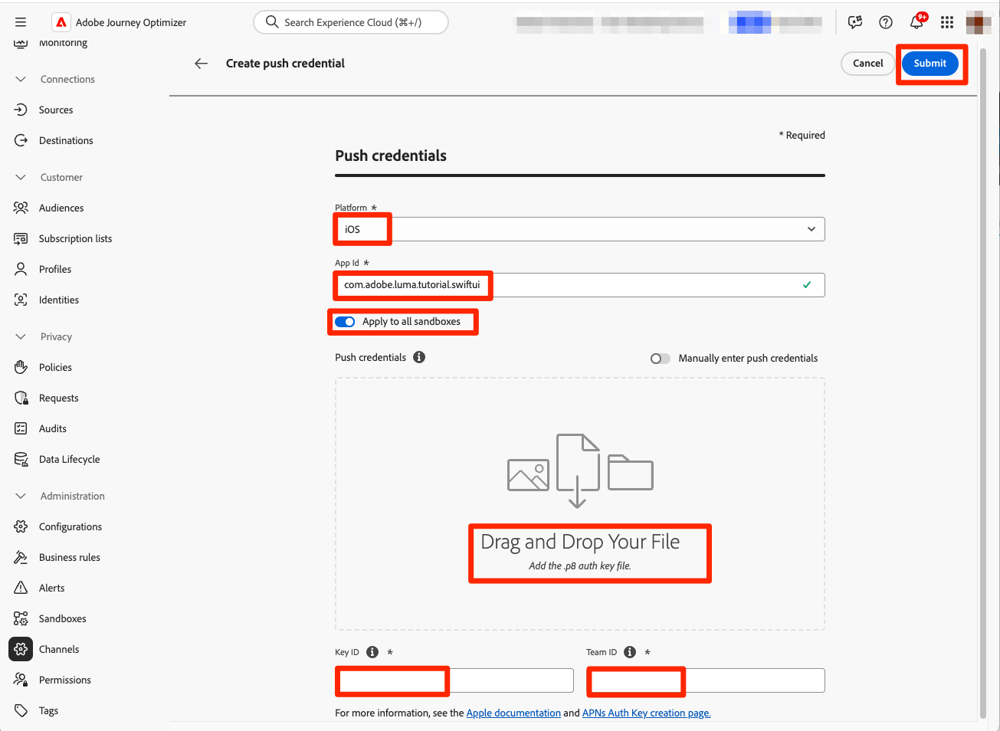

# Créer et envoyer des notifications push

Découvrez comment créer des notifications push pour les applications mobiles avec Experience Platform Mobile SDK et Journey Optimizer.

Journey Optimizer vous permet de créer des parcours et d’envoyer des messages aux audiences ciblées. Avant d’envoyer des notifications push avec Journey Optimizer, vous devez vous assurer que les configurations et intégrations appropriées sont en place. Pour comprendre le flux de données des notifications push dans Journey Optimizer, consultez la [documentation](https://experienceleague.adobe.com/docs/journey-optimizer/using/push/push-config/push-gs.html).


>[!NOTE]
>
>Cette leçon est facultative et s&#39;applique uniquement aux utilisateurs de Journey Optimizer qui souhaitent envoyer des notifications push.


## Prérequis

* Création et exécution réussies de l’application avec les SDK installés et configurés.
* Configurez l’application pour Adobe Experience Platform.
* Accès à Journey Optimizer et autorisations suffisantes comme décrit [ici](https://experienceleague.adobe.com/docs/journey-optimizer/using/push/push-config/push-configuration.html?lang=en). Vous devez également disposer des autorisations suffisantes pour accéder aux fonctionnalités de Journey Optimizer ci-après.
   * Créez des informations d’identification push.
   * Créez une configuration de canal push.
   * Création d’un parcours.
   * Créez un message.
   * Création de préréglages de message.
* **Compte de développeur Apple payant** avec un accès suffisant pour créer des certificats, des identifiants et des clés.
* Périphérique ou simulateur iOS physique à des fins de test.

## Objectifs d’apprentissage

Dans cette leçon, vous allez :

* Enregistrez l’ID d’application auprès du service Apple Push Notification (APNs).
* Créez une configuration de canal dans Journey Optimizer.
* Mettez à jour votre schéma pour inclure des champs de messagerie push.
* Installez et configurez l’extension de balise Journey Optimizer.
* Mettez à jour votre application pour enregistrer l’extension de balise Journey Optimizer.
* Validez la configuration dans Assurance.
* Envoyer un message de test depuis Assurance
* Définissez votre propre événement, parcours et expérience de notification push dans Journey Optimizer.
* Envoyez votre propre notification push depuis l’application.


## Configuration

>[!TIP]
>
>Si vous avez déjà configuré votre environnement dans le cadre de la leçon de messagerie in-app [Journey Optimizer](journey-optimizer-inapp.md), il se peut que vous ayez déjà effectué certaines des étapes de cette section de configuration.

### Enregistrer l’ID d’application auprès d’APNs

Les étapes suivantes ne sont pas spécifiques à Adobe Experience Cloud et sont conçues pour vous guider tout au long de la configuration d’APNS.

#### Création d’une clé privée

1. Dans le portail de développement Apple, accédez à **[!UICONTROL Clés]**.
1. Pour créer une clé, sélectionnez **[!UICONTROL +]**.
   

1. Fournissez un **[!UICONTROL Nom de la clé]**.
1. Cochez la case **[!UICONTROL Service de notifications push Apple &#x200B;] (APNs)**.
1. Sélectionnez **[!UICONTROL Continuer]**.
   
1. Vérifiez la configuration et sélectionnez **[!UICONTROL S’inscrire]**.
1. Téléchargez la clé privée `.p8`. Il est utilisé dans l’exercice suivant lorsque vous configurez vos informations d’identification push Journey Optimizer.
1. Notez l’identifiant **[!UICONTROL Key]**. Il est utilisé dans l’exercice suivant lorsque vous configurez vos informations d’identification push Journey Optimizer.
1. Notez l’identifiant **[!UICONTROL d’équipe]**. Il est utilisé dans l’exercice suivant lorsque vous configurez vos informations d’identification push Journey Optimizer.
   

Une documentation supplémentaire est disponible [ici](https://help.apple.com/developer-account/#/devcdfbb56a3).


#### Ajout des informations d’identification des notifications push de votre application dans Journey Optimizer

Vous devez ensuite ajouter les informations d’identification des notifications push de votre application mobile dans Journey Optimizer. (Dans les versions antérieures du produit, ces éléments étaient ajoutés dans le cadre de la configuration « Surface d’application » dans la collecte de données).

L&#39;enregistrement des informations d&#39;identification push de l&#39;application mobile est nécessaire pour autoriser Adobe à envoyer des notifications push en votre nom. Reportez-vous aux étapes détaillées ci-dessous :

1. Dans l’interface de Journey Optimizer, ouvrez le menu **[!UICONTROL Canaux]** > **[!UICONTROL Paramètres push]** > **[!UICONTROL Informations d’identification push]**.

1. Sélectionnez **[!UICONTROL Créer des informations d’identification push]**.


   

1. Dans la liste déroulante **[!UICONTROL Platform]**, sélectionnez le système d’exploitation **iOS**.

1. Saisissez l’ID de bundle de l’application mobile dans le champ **[!UICONTROL ID de l’application]** (ID de bundle iOS) . Par exemple, com.adobe.luma.tutorial.swiftui.

1. Activez l’option **[!UICONTROL Appliquer à tous les sandbox]** pour mettre ces informations d’identification push à disposition dans tous les sandbox. Si un sandbox spécifique possède ses propres informations d’identification pour la même paire d’identifiants de plateforme et d’application, ces informations d’identification spécifiques au sandbox sont prioritaires.

1. Effectuez un glisser-déposer de votre fichier .p8 **Clé d’authentification de notification push Apple** obtenu à partir de l’exercice précédent.

1. Fournissez la **[!UICONTROL Identifiant de clé]**, une chaîne de 10 caractères attribuée lors de la création de `p8` clé d’authentification. Elle se trouve sous l’onglet **[!UICONTROL Clés]** de la page **Certificats, identifiants et profils** du portail Apple Developer. (Vous auriez dû le noter au cours de l’exercice précédent.)

1. Indiquez l&#39;**[!UICONTROL identifiant d&#39;équipe]**. L’ID d’équipe est une valeur qui se trouve sous l’onglet **Abonnement** ou en haut de la page du portail Apple Developer. (Vous auriez dû le noter au cours de l’exercice précédent.)

   

1. Cliquez sur **[!UICONTROL Envoyer]** pour créer votre configuration d’informations d’identification push.

#### Création d’une configuration de canal pour les notifications push dans Journey Optimizer

Une fois que vous avez créé une configuration d’informations d’identification push, vous devez en créer une pour pouvoir envoyer des notifications push depuis Journey Optimizer.

1. Dans l’interface de Journey Optimizer, ouvrez le menu **[!UICONTROL Canaux]** > **[!UICONTROL Paramètres généraux]** > **[!UICONTROL Configurations de canal]** puis sélectionnez **[!UICONTROL Créer une configuration de canal]**.

   

1. Saisissez un nom et une description (facultatif) pour la configuration.

   >[!NOTE]
   >
   > Les noms doivent commencer par une lettre (A-Z). Ils ne peuvent contenir que des caractères alphanumériques. Vous pouvez également utiliser le trait de soulignement `_`, le point`.` et le trait d&#39;union `-`.


1. Pour attribuer des libellés d’utilisation des données personnalisés ou de base à la configuration, vous pouvez sélectionner **[!UICONTROL Gérer l’accès]**. [En savoir plus sur le contrôle d’accès au niveau de l’objet (OLAC)](https://experienceleague.adobe.com/en/docs/journey-optimizer/using/access-control/object-based-access)

1. Sélectionnez le canal **Push**.


1. Sélectionnez une **[!UICONTROL Action marketing]** ou plusieurs pour associer des politiques de consentement aux messages utilisant cette configuration. Toutes les politiques de consentement associées à cette action marketing sont utilisées afin de respecter les préférences de vos clientes et clients. [En savoir plus sur les actions marketing](https://experienceleague.adobe.com/en/docs/journey-optimizer/using/privacy/consent/consent#surface-marketing-actions).

1. Sélectionnez votre **[!UICONTROL Plateforme]**.

1. Sélectionnez le même **[!UICONTROL ID d’application]** que pour vos informations d’identification push configurées ci-dessus.

1. Sélectionnez **[!UICONTROL Envoyer]** pour enregistrer vos modifications.

   


### Mettre à jour la configuration du flux de données

Pour vous assurer que les données envoyées de votre application mobile à Edge Network sont transférées vers Journey Optimizer, mettez à jour votre configuration Experience Edge .

1. Dans l’interface utilisateur de collecte de données, sélectionnez **[!UICONTROL Flux de données]**, puis sélectionnez votre flux de données, par exemple **[!DNL Luma Mobile App]**.
1. Sélectionnez  pour **[!UICONTROL Experience Platform]** et sélectionnez  **[!UICONTROL Modifier]** dans le menu contextuel.
1. Dans l’écran **[!UICONTROL Flux de données]** >  > **[!UICONTROL Adobe Experience Platform]** :

   1. Si ce n’est pas déjà fait, sélectionnez **[!UICONTROL Jeu de données de profil push AJO]** dans **[!UICONTROL Jeu de données de profil]**. Ce jeu de données de profil est requis lors de l’utilisation de l’appel API `MobileCore.setPushIdentifier` (voir [Enregistrer le jeton d’appareil pour les notifications push](#register-device-token-for-push-notifications)), ce qui garantit que l’identifiant unique des notifications push (ou identifiant push) est stocké dans le profil de l’utilisateur.

   1. **[!UICONTROL Adobe Journey Optimizer]** est sélectionné. Voir [Paramètres Adobe Experience Platform](https://experienceleague.adobe.com/docs/experience-platform/datastreams/configure.html?lang=en#aep) pour plus d&#39;informations.

   1. Pour enregistrer la configuration de votre flux de données, sélectionnez **[!UICONTROL Enregistrer]**.

   


### Installation de l’extension de balises Journey Optimizer

Pour que votre application fonctionne avec Journey Optimizer, vous devez mettre à jour votre propriété de balise.

1. Accédez à **[!UICONTROL Balises]** > **[!UICONTROL Extensions]** > **[!UICONTROL Catalogue]**,
1. Ouvrez votre propriété, par exemple **[!DNL Luma Mobile App Tutorial]**.
1. Sélectionnez **[!UICONTROL Catalogue]**.
1. Recherchez l’extension **[!UICONTROL Adobe Journey Optimizer]**.
1. Installez l’extension .
1. Dans la boîte de dialogue **[!UICONTROL Installer l’extension]**
   1. Sélectionnez un environnement, par exemple **[!UICONTROL Développement]**.
   1. Sélectionnez le jeu de données **[!UICONTROL Jeu de données d’événement d’expérience de suivi des notifications push AJO]** dans la liste **[!UICONTROL Jeu de données d’événement]**.
   1. Sélectionnez **[!UICONTROL Enregistrer dans la bibliothèque et créer]**.

      

>[!NOTE]
>
>Si vous ne voyez pas **[!UICONTROL Jeu de données d’événement d’expérience de suivi des notifications push AJO]** comme option, contactez l’assistance clientèle.
>

## Validation de la configuration avec Assurance

1. Consultez la section [instructions de configuration](assurance.md#connecting-to-a-session) pour connecter votre simulateur ou votre appareil à Assurance.
1. Dans l’interface utilisateur d’Assurance, sélectionnez **[!UICONTROL Configurer]**.
   
1. Sélectionnez  en regard de **[!UICONTROL Débogage push]**.
1. Sélectionnez **[!UICONTROL Enregistrer]**.
   
1. Sélectionnez **[!UICONTROL Débogage push]** dans le volet de navigation de gauche.
1. Sélectionnez l’onglet **[!UICONTROL Valider la configuration]**.
1. Sélectionnez votre appareil dans la liste **[!UICONTROL Client]**.
1. Vérifiez que vous n’obtenez aucune erreur.
   
1. Sélectionnez l’onglet **[!UICONTROL Envoyer le push de test]**.
1. (facultatif) Modifiez les détails par défaut pour **[!UICONTROL Titre]** et **[!UICONTROL Corps]**
1. Sélectionnez  **[!UICONTROL Envoyer une notification push de test]**.
1. Vérifiez le **[!UICONTROL Résultats du test]**.
1. La notification push de test devrait apparaître dans votre application.

   


## Signature

La signature de l’application Luma est nécessaire pour envoyer des notifications push et **nécessite un compte de développeur Apple payant**.

Pour mettre à jour la signature de votre application :

1. Accédez à votre application dans Xcode.
1. Sélectionnez **[!DNL Luma]** dans l’explorateur de projets.
1. Sélectionnez la cible **[!DNL Luma]**.
1. Sélectionnez l’onglet **Signature et fonctionnalités**.
1. Configurez **[!UICONTROL Gestion automatique de la signature]**, **[!UICONTROL Équipe]** et **[!UICONTROL Identifiant de bundle]**, ou utilisez vos informations d’attribution de privilèges d’accès de développement Apple spécifiques.

   >[!IMPORTANT]
   >
   >Veillez à utiliser un identifiant de lot _unique_ et à remplacer l’identifiant de lot `com.adobe.luma.tutorial.swiftui`, car chaque identifiant de lot doit être unique. En règle générale, vous utilisez un format de DNS inversé pour les chaînes d’ID de lot, telles que `com.organization.brand.uniqueidentifier`. La version terminée de ce tutoriel, par exemple, utilise `com.adobe.luma.tutorial.swiftui`.


   {zoomable="yes"}


## Ajout de fonctionnalités de notification push à votre application

>[!IMPORTANT]
>
>Pour implémenter et tester les notifications push dans une application iOS, vous devez disposer d’un compte de développeur Apple **payant**. Si vous ne disposez pas d’un compte de développeur Apple payant, vous pouvez ignorer le reste de cette leçon.

1. Dans Xcode, sélectionnez **[!DNL Luma]** dans la liste **[!UICONTROL TARGETS]**, sélectionnez l’onglet **[!UICONTROL Signing &amp; Capabilities]**, cliquez sur le bouton **[!UICONTROL + Capability]**, puis sélectionnez **[!UICONTROL Notifications push]**. Cela permet à votre application de recevoir des notifications push.

1. Vous devez ensuite ajouter une extension de notification à l’application. Revenez à l’onglet **[!DNL General]** et sélectionnez l’icône **[!UICONTROL +]** au bas de la section **[!UICONTROL TARGETS]**.

1. Vous êtes invité à sélectionner le modèle pour votre nouvelle cible. Sélectionnez **[!UICONTROL Extension du service de notification]** puis sélectionnez **[!UICONTROL Suivant]**.

1. Dans la fenêtre suivante, utilisez `NotificationExtension` comme nom d’extension et cliquez sur le bouton **[!UICONTROL Terminer]**.

Vous devriez maintenant avoir une extension de notification push ajoutée à votre application, similaire à l&#39;écran ci-dessous.


## Implémentation de Journey Optimizer dans l’application

Comme nous l’avons vu dans les leçons précédentes, l’installation d’une extension de balise mobile fournit uniquement la configuration . Vous devez ensuite installer et enregistrer le SDK de messagerie. Si ces étapes ne sont pas claires, consultez la section [Installation des SDK](install-sdks.md).

>[!NOTE]
>
>Si vous avez terminé la section [Installation des SDK](install-sdks.md), le SDK est déjà installé et vous pouvez ignorer cette étape.
>

1. Dans Xcode, assurez-vous que [AEP Messaging](https://github.com/adobe/aepsdk-messaging-ios) est ajouté à la liste des packages dans Dépendances de packages. Voir [Gestionnaire de packages Swift](install-sdks.md#swift-package-manager).
1. Accédez à **[!DNL Luma]** > **[!DNL Luma]** > **[!UICONTROL AppDelegate]** dans le navigateur de projet Xcode.
1. Assurez-vous que `AEPMessaging` fait partie de votre liste d’importations.

   `import AEPMessaging`

1. Assurez-vous que `Messaging.self` fait partie du tableau d’extensions que vous enregistrez.

   ```swift
   let extensions = [
       AEPIdentity.Identity.self,
       Lifecycle.self,
       Signal.self,
       Edge.self,
       AEPEdgeIdentity.Identity.self,
       Consent.self,
       UserProfile.self,
       Places.self,
       Messaging.self,
       Optimize.self,
       Assurance.self
   ]
   ```

## Enregistrer le jeton de l’appareil pour les notifications push

1. Ajoutez l’API [`MobileCore.setPushIdentifier`](https://developer.adobe.com/client-sdks/documentation/mobile-core/api-reference/#setpushidentifier) à la fonction `func application(_ application: UIApplication, didRegisterForRemoteNotificationsWithDeviceToken deviceToken: Data)` .

   ```swift
   // Send push token to Mobile SDK
   MobileCore.setPushIdentifier(deviceToken)
   ```

   Cette fonction récupère le jeton d’appareil propre à l’appareil sur lequel l’application est installée. Définit ensuite le jeton pour la diffusion de la notification push à l’aide de la configuration que vous avez définie et qui repose sur le service de notification push Apple (APNs).

>[!IMPORTANT]
>
>Le `MobileCore.updateConfigurationWith(configDict: ["messaging.useSandbox": true])` détermine si les notifications push utilisent un sandbox APNs ou un serveur de production pour envoyer des notifications push. Lors du test de votre application dans le simulateur ou sur un appareil, assurez-vous que la `messaging.useSandbox` est définie sur `true` afin de recevoir des notifications push. Lors du déploiement de votre application pour production ou test à l’aide d’Apple Testflight, assurez-vous de `messaging.useSandbox` définir sur `false`, sinon votre application de production ne pourra pas recevoir de notifications push.


## Créer votre propre notification push

Pour créer votre propre notification push, vous devez définir un événement dans Journey Optimizer qui déclenche un parcours qui se charge de son envoi.

### Mise à jour du schéma

Vous allez définir un nouveau type d’événement, qui n’est pas encore disponible dans la liste des événements définis dans votre schéma. Vous utiliserez ce type d’événement ultérieurement lors du déclenchement des notifications push.

1. Dans l’interface utilisateur de Journey Optimizer, sélectionnez **[!UICONTROL Schémas]** dans le rail de gauche.
1. Sélectionnez **[!UICONTROL Parcourir]** dans la barre d’onglets.
1. Sélectionnez votre schéma, par exemple **[!DNL Luma Mobile App Event Schema]** pour l’ouvrir.
1. Dans l’éditeur de schémas :
   1. Sélectionnez le champ **[!UICONTROL eventType]**.
   1. Dans le volet **[!UICONTROL Propriétés du champ]**, faites défiler l’écran vers le bas pour afficher la liste des valeurs possibles pour le type d’événement. Sélectionnez **[!UICONTROL Ajouter une ligne]** et ajoutez `application.test` comme **[!UICONTROL VALEUR]** et `[!UICONTROL Test event for push notification]` comme `DISPLAY NAME`.
   1. Sélectionnez **[!UICONTROL Appliquer]**.
   1. Sélectionnez **[!UICONTROL Enregistrer]**.

      

### Définition d’un événement

Les événements dans Journey Optimizer vous permettent de déclencher vos parcours de manière unitaire pour envoyer des messages, par exemple des notifications push. Voir [À propos des événements](https://experienceleague.adobe.com/docs/journey-optimizer/using/configuration/configure-journeys/events-journeys/about-events.html?lang=en) pour plus d’informations.

1. Dans l’interface utilisateur de Journey Optimizer, sélectionnez **[!UICONTROL Configurations]** dans le rail de gauche.

1. Dans l’écran **[!UICONTROL Tableau de bord]**, cliquez sur le bouton **[!UICONTROL Gérer]** dans la mosaïque **[!UICONTROL Événements]**.

1. Dans l’écran **[!UICONTROL Événements]**, sélectionnez **[!UICONTROL Créer un événement]**.

1. Dans le volet **[!UICONTROL Modifier l’événement1]** :

   1. Saisissez `LumaTestEvent` comme **[!UICONTROL Nom]** de l’événement.
   1. Fournissez une **[!UICONTROL Description]** par exemple `Test event to trigger push notifications in Luma app`.

   1. Sélectionnez le schéma d’événement d’expérience d’application mobile que vous avez créé précédemment dans [Créer un schéma XDM](create-schema.md) dans la liste **[!UICONTROL Schéma]**, par exemple **[!DNL Luma Mobile App Event Schema v.1]**.
   1. Sélectionnez  en regard de la liste **[!UICONTROL Champs]**.

      

      Dans la boîte de dialogue **[!UICONTROL Champs]**, assurez-vous que les champs suivants sont sélectionnés (en plus des champs par défaut qui sont toujours sélectionnés (**[!UICONTROL _id]**, **[!UICONTROL id]** et **[!UICONTROL timestamp]**). À l’aide de la liste déroulante, vous pouvez basculer entre **[!UICONTROL Sélectionné]**, **[!UICONTROL Tous]** et **[!UICONTROL Principal]** ou utiliser le champ .

      * **[!UICONTROL Identifiant de l’application (id)]**,
      * **[!UICONTROL Type d’événement (eventType)]**,
      * **[!UICONTROL Principal (principal)]**.

      

      Sélectionnez ensuite **[!UICONTROL Ok]**.

   1. Sélectionnez  en regard du champ **[!UICONTROL Condition d’identifiant d’événement]**.

      1. Dans la boîte de dialogue **[!UICONTROL Ajouter une condition d’identifiant d’événement]**, effectuez un glisser-déposer **[!UICONTROL Type d’événement (eventType)]** sur pour **[!UICONTROL Faire glisser et déposer un élément ici]**.
      1. Dans la fenêtre contextuelle, faites défiler l’écran vers le bas et sélectionnez **[!UICONTROL application.test]** (qui correspond au type d’événement que vous avez ajouté précédemment à la liste des types d’événement dans le cadre de [Mettre à jour votre schéma](#update-your-schema)). Faites ensuite défiler l’écran jusqu’en haut et sélectionnez **[!UICONTROL Ok]**.
      1. Sélectionnez **[!UICONTROL Ok]** pour enregistrer la condition.

         

   1. Sélectionnez **[!UICONTROL ECID (ECID)]** dans la liste **[!UICONTROL Espace de noms]**. Le champ **[!UICONTROL Identifiant du profil]** est automatiquement renseigné avec **[!UICONTROL L’identifiant du premier élément de l’ECID de clé pour le mappage identityMap]**.
   1. Sélectionnez **[!UICONTROL Enregistrer]**.

      

Vous venez de créer une configuration d’événement basée sur le schéma d’événements d’expérience d’application mobile que vous avez créé précédemment dans le cadre de ce tutoriel. Cette configuration d’événement filtre les événements d’expérience entrants à l’aide de votre type d’événement spécifique (`application.test`). Ainsi, seuls les événements de ce type spécifique, déclenchés à partir de votre application mobile, déclencheront le parcours que vous créez à l’étape suivante. Dans un scénario réel, vous souhaiterez peut-être envoyer des notifications push à partir d’un service externe. Toutefois, les mêmes concepts s’appliquent : de l’application externe, envoyez un événement d’expérience dans Experience Platform qui comporte des champs spécifiques que vous pouvez utiliser pour appliquer des conditions sur avant que ces événements ne déclenchent un parcours.

### Création du parcours

L’étape suivante consiste à créer le parcours qui déclenche l’envoi de la notification push lors de la réception de l’événement approprié.

1. Dans l’interface utilisateur de Journey Optimizer, sélectionnez **[!UICONTROL Parcours]** dans le rail de gauche.
1. Sélectionnez **[!UICONTROL Créer un Parcours]**.
1. Dans le panneau Propriétés du Parcours **&#x200B;**&#x200B;:

   1. Saisissez un **[!UICONTROL Nom]** pour le parcours, par exemple `Luma - Test Push Notification Journey`.
   1. Saisissez une **[!UICONTROL Description]** pour le parcours, par exemple `Journey for test push notifications in Luma mobile app`.
   1. Assurez-vous que l’option **[!UICONTROL Autoriser la reprise]** est sélectionnée et définissez **[!UICONTROL Période d’attente de reprise]** sur **[!UICONTROL 30]** **[!UICONTROL Secondes]**.
   1. Cliquez sur **[!UICONTROL OK]**.

      

1. De retour dans la zone de travail de parcours, à partir de l’**[!UICONTROL ÉVÉNEMENTS]**, faites glisser et déposez votre **[!DNL LumaTestEvent]**  sur la zone de travail où elle s’affiche **[!UICONTROL Sélectionnez un événement d’entrée ou une activité de lecture d’audience]**.

   * Dans le panneau **[!UICONTROL Événements : LumaTestEvent]**, saisissez un **[!UICONTROL Libellé]**, par exemple `Luma Test Event`.

1. Dans la liste déroulante **[!UICONTROL ACTIONS]**, effectuez un glisser-déposer  **[!UICONTROL Push]** sur le  qui apparaît à droite de votre activité **[!DNL LumaTestEvent]**. Dans le volet **[!UICONTROL Actions : Push]** :

   1. Fournissez un **[!UICONTROL Libellé]**, par exemple `Luma Test Push Notification`, fournissez un **[!UICONTROL Description]** par exemple `Test push notification for Luma mobile app`, sélectionnez **[!UICONTROL Transactionnel]** dans la liste **[!UICONTROL Catégorie]** et sélectionnez **[!DNL Luma]** dans la surface **&#x200B;**&#x200B;Push.
   1. Sélectionnez  **[!UICONTROL Modifier le contenu]** pour commencer à modifier la notification push réelle.

      

      Dans l’éditeur **[!UICONTROL Notification push]** :

      1. Saisissez un **[!UICONTROL Titre]**, par exemple `Luma Test Push Notification` et saisissez un **[!UICONTROL Corps]**, par exemple `Test push notification for Luma mobile app`.
      1. Vous pouvez éventuellement saisir un lien vers une image (.png ou .jpg) dans **[!UICONTROL Ajouter un média]**. Si vous le faites, l’image fera partie de la notification push.
      1. Pour enregistrer et quitter l’éditeur, sélectionnez .

         

   1. Pour enregistrer et terminer la définition de la notification push, sélectionnez **[!UICONTROL Ok]**.

1. Votre parcours doit se présenter comme suit : Sélectionnez **[!UICONTROL Publier]** pour publier et activer votre parcours.
   


## Déclencher la notification push

Tous les ingrédients sont en place pour envoyer une notification push. Il reste à savoir comment déclencher cette notification push. En substance, il est identique à ce que vous avez vu auparavant : il vous suffit d’envoyer un événement d’expérience avec la payload appropriée (comme dans [Events](events.md)).

Cette fois, l’événement d’expérience que vous êtes sur le point d’envoyer n’est pas créé pour créer un dictionnaire XDM simple. Vous allez utiliser un `struct` représentant une payload de notification push. La définition d’un type de données dédié est une autre manière d’implémenter la création de payloads d’événement d’expérience dans votre application.

1. Accédez à **[!DNL Luma]** > **[!DNL Luma]** > **[!UICONTROL Modèle]** > **[!UICONTROL XDM]** > **[!UICONTROL TestPushPayload]** dans le navigateur de projet Xcode, puis inspectez le code.

   ```swift
   import Foundation
   
   // MARK: - TestPush
   struct TestPushPayload: Codable {
      let application: Application
      let eventType: String
   }
   
   // MARK: - Application
   struct Application: Codable {
      let id: String
   }
   ```

   Le code est une représentation de la payload simple suivante que vous allez envoyer pour déclencher votre parcours de notification push de test

   ```json
   {
      "eventType": string,
      "application" : [
          "id": string
      ]
   }
   ```

1. Accédez à **[!DNL Luma]** > **[!DNL Luma]** > **[!DNL Utils]** > **[!UICONTROL MobileSDK]** dans le navigateur de projet Xcode, puis ajoutez le code suivant à `func sendTestPushEvent(applicationId: String, eventType: String)` :

   ```swift
   // Create payload and send experience event
   Task {
       let testPushPayload = TestPushPayload(
           application: Application(
               id: applicationId
           ),
           eventType: eventType
       )
       // send the final experience event
       await sendExperienceEvent(
           xdm: testPushPayload.asDictionary() ?? [:]
       )
   }
   ```

   Ce code crée une instance de `testPushPayload` à l’aide des paramètres fournis à la fonction (`applicationId` et `eventType`), puis appelle `sendExperienceEvent` lors de la conversion de la payload en dictionnaire. Cette fois-ci, ce code prend également en compte les aspects asynchrones de l’appel du SDK Adobe Experience Platform en utilisant le modèle de simultanéité de Swift basé sur `await` et `async`.

1. Accédez à **[!DNL Luma]** > **[!DNL Luma]** > **[!DNL Views]** > **[!DNL General]** > **[!UICONTROL ConfigView]** dans le navigateur de projet Xcode. Dans la définition du bouton de notification push , ajoutez le code suivant pour envoyer la payload d’événement d’expérience de notification push de test afin de déclencher votre parcours chaque fois que vous appuyez sur ce bouton.

   ```swift
   // Setting parameters and calling function to send push notification
   Task {
       let eventType = testPushEventType
       let applicationId = Bundle.main.bundleIdentifier ?? "No bundle id found"
       await MobileSDK.shared.sendTestPushEvent(applicationId: applicationId, eventType: eventType)
   }
   ```


## Validation à l’aide de l’application

1. Recréez et exécutez l’application dans le simulateur ou sur un appareil physique à partir de Xcode, à l’aide de .

1. Accédez à l’onglet **[!UICONTROL Paramètres]**.

1. Appuyez sur **[!UICONTROL Notification push]**. La notification push apparaît dans votre application.

   


## Étapes suivantes

Vous devriez maintenant disposer de tous les outils nécessaires pour gérer les notifications push dans votre application. Par exemple, vous pouvez créer un parcours dans Journey Optimizer qui envoie une notification push de bienvenue lorsqu’un utilisateur de l’application se connecte. Ou une notification push de confirmation lorsqu’un utilisateur achète un produit dans l’application. Ou entre dans la limite géographique d&#39;un emplacement (comme vous le verrez dans la leçon [Places](places.md)).

>[!SUCCESS]
>
>Vous avez maintenant activé l’application pour les notifications push à l’aide de Journey Optimizer et de l’extension Journey Optimizer pour Experience Platform Mobile SDK.
>
>Merci d’avoir consacré votre temps à découvrir Adobe Experience Platform Mobile SDK. Si vous avez des questions, souhaitez partager des commentaires généraux ou des suggestions sur le contenu futur, partagez-les dans ce [article de discussion de la communauté Experience League](https://experienceleaguecommunities.adobe.com/t5/adobe-experience-platform-data/tutorial-discussion-implement-adobe-experience-cloud-in-mobile/td-p/443796).

Suivant : **[créer et envoyer des messages in-app](journey-optimizer-inapp.md)**
