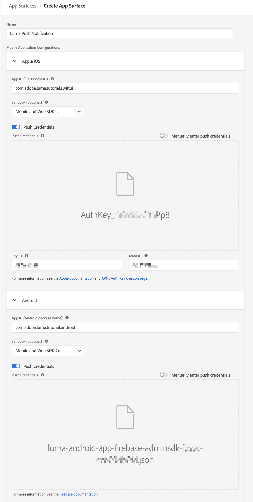
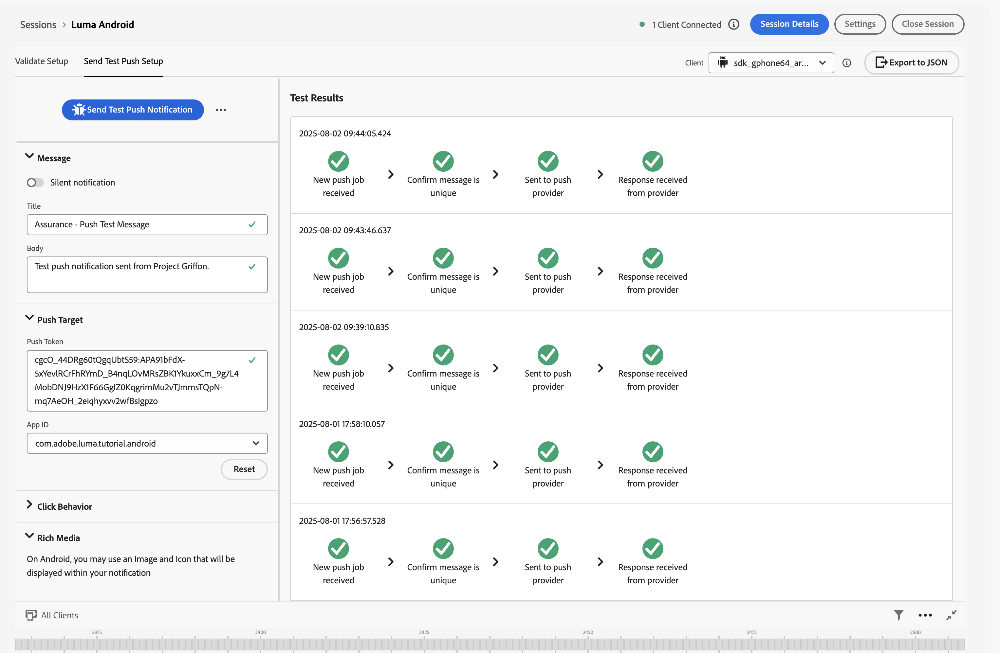
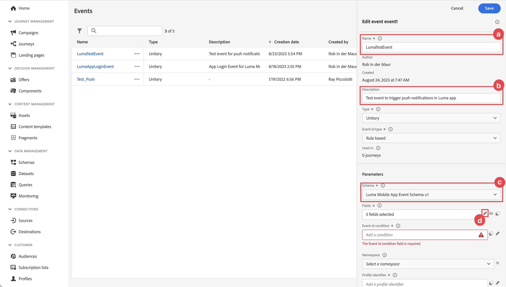
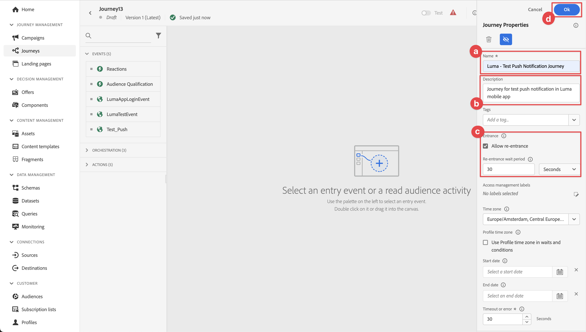
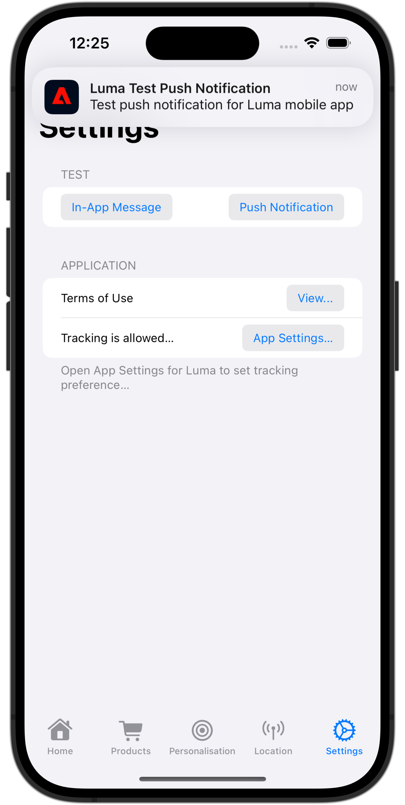

# Créer et envoyer des notifications push

Découvrez comment créer des notifications push pour les applications mobiles avec Experience Platform Mobile SDK et Journey Optimizer.

Journey Optimizer vous permet de créer des parcours et d’envoyer des messages aux audiences ciblées. Avant d’envoyer des notifications push avec Journey Optimizer, vous devez vous assurer que les configurations et intégrations appropriées sont en place. Pour comprendre le flux de données des notifications push dans Journey Optimizer, consultez la [documentation](https://experienceleague.adobe.com/fr/docs/journey-optimizer/using/channels/push/push-config/push-gs).

{zoomable="yes"}

>[!NOTE]
>
>Cette leçon est facultative et s&#39;applique uniquement aux utilisateurs de Journey Optimizer qui souhaitent envoyer des notifications push.


## Conditions préalables

* Création et exécution réussies de l’application avec les SDK installés et configurés.
* Configurez l’application pour Adobe Experience Platform.
* Accès à Journey Optimizer et [autorisations suffisantes](https://experienceleague.adobe.com/fr/docs/journey-optimizer/using/channels/push/push-config/push-configuration). Vous devez également disposer des autorisations suffisantes pour accéder aux fonctionnalités de Journey Optimizer ci-après.
   * Créez des informations d’identification push.
   * Créez une configuration de canal push.
   * Création d’un parcours.
   * Créez un message.
   * Création de préréglages de message.
* Pour iOS, il s’agit d’un **compte développeur Apple payant** disposant d’un accès suffisant pour créer des certificats, des identifiants et des clés.
* Pour Android, un compte de développeur Google disposant d’un accès suffisant pour créer des certificats et des clés.
* Périphérique ou simulateur iOS ou Android physique à des fins de test.

## Objectifs d’apprentissage

Dans cette leçon, vous allez :

* Enregistrez l’ID d’application auprès du service Apple Push Notification (APNs).
* Créez une configuration de canal dans Journey Optimizer.
* Mettez à jour votre schéma pour inclure des champs de messagerie push.
* Installez et configurez l’extension de balise Journey Optimizer.
* Mettez à jour votre application pour enregistrer l’extension de balise Journey Optimizer.
* Validez la configuration dans Assurance.
* Envoyer un message de test depuis Assurance
* Définissez votre propre événement, parcours et expérience de notification push dans Journey Optimizer.
* Envoyez votre propre notification push depuis l’application.


## Configuration

>[!TIP]
>
>Si vous avez déjà configuré votre environnement dans le cadre de la leçon de messagerie in-app [Journey Optimizer](journey-optimizer-inapp.md), il se peut que vous ayez déjà effectué certaines des étapes de cette section de configuration.

### Créer des informations d’identification push

Pour les notifications push, vous devez d&#39;abord enregistrer votre application pour les notifications push.

>[!BEGINTABS]

>[!TAB iOS]

Les étapes suivantes ne sont pas spécifiques à Adobe Experience Cloud et sont conçues pour vous guider tout au long de la configuration d’APNS.

1. Dans le portail de développement Apple, accédez à **[!UICONTROL Clés]**.
1. Pour créer une clé, sélectionnez **[!UICONTROL +]**.

   {zoomable="yes"}

1. Fournissez un **[!UICONTROL Nom de la clé]**.
1. Sélectionnez **[!UICONTROL Service de notification push Apple] (APNs)** puis sélectionnez **[!UICONTROL Configurer]**.
   1. Dans l’écran **[!UICONTROL Configurer la clé]**, sélectionnez **[!UICONTROL Sandbox et production]** dans le menu déroulant **[!UICONTROL Environnement]**.
   1. Sélectionnez **[!UICONTROL Enregistrer]**.
1. Sélectionnez **[!UICONTROL Continuer]**.

   {zoomable="yes"}

1. Vérifiez la configuration et sélectionnez **[!UICONTROL S’inscrire]**.
1. Téléchargez la clé privée `.p8`. Il est utilisé dans l’exercice suivant lorsque vous configurez vos informations d’identification push Journey Optimizer.
1. Notez l’identifiant **[!UICONTROL Key]**. Il est utilisé dans l’exercice suivant lorsque vous configurez vos informations d’identification push Journey Optimizer.
1. Notez l’identifiant **[!UICONTROL d’équipe]**. Il est utilisé dans l’exercice suivant lorsque vous configurez vos informations d’identification push Journey Optimizer. L’identifiant de l’équipe se trouve dans le coin supérieur droit de l’écran, en regard de votre nom d’utilisateur.
   {zoomable="yes"}

Une documentation supplémentaire est disponible [ici](https://help.apple.com/developer-account/#/devcdfbb56a3).

>[!TAB Android]

Les étapes suivantes ne sont pas spécifiques à Adobe Experience Cloud et sont conçues pour vous guider tout au long de la configuration de Firebase.

1. Accédez à la console Firebase.
1. Sélectionnez **[!UICONTROL Créer un projet Firebase]**.
   1. Saisissez un **[!UICONTROL Nom du projet]**.
   1. Sélectionnez **[!UICONTROL Continuer]** dans **[!UICONTROL Créer un projet]** - **[!UICONTROL Commençons par attribuer un nom à votre projet]**. Par exemple : `Luma Android App.`
   1. Désactivez **[!UICONTROL Gemini dans Firebase]** et sélectionnez **[!UICONTROL Continuer]** dans **[!UICONTROL Créer un projet]** - **[!UICONTROL Assistance IA pour votre projet Firebase]**.
   1. Désactivez **[!UICONTROL Google Analytics pour ce projet]** puis sélectionnez **[!UICONTROL Continuer]** dans **[!UICONTROL Créer un projet]** - **[!UICONTROL Google Analytics pour votre projet Firebase]**.
   1. Sélectionnez **[!UICONTROL Créer un projet]**.
   1. Une fois le projet prêt, sélectionnez **[!UICONTROL Continuer]**.

1. De retour dans la console Firebase, assurez-vous que votre projet est sélectionné dans la partie supérieure. Par exemple, **[!UICONTROL application Luma Android]**.

   {zoomable="yes"}

1. Sélectionnez  > **[!UICONTROL Paramètres du projet]**.

1. Dans **[!UICONTROL Paramètres du projet]**, sélectionnez **[!UICONTROL Ajouter une application]**.
   1. Dans la **[!UICONTROL Ajouter Firebase à votre application]**, sélectionnez **[!UICONTROL Android]** comme plateforme.
   1. Dans l’**[!UICONTROL Ajouter Firebase à votre application Android :]**
      1. À l’étape 1, **[!UICONTROL Enregistrement de l’application]** :
         1. Saisissez un nom de package Android, similaire à votre identifiant d’application. Par exemple : `com.adobe.luma.tutorial.android`.
         1. Saisissez un **[!UICONTROL surnom de l’application]** facultatif.
         1. Sélectionnez **[!UICONTROL Enregistrer l’application]**.
      1. À l’étape 2, **[!UICONTROL Télécharger puis ajouter le fichier de configuration]**.
         1. Sélectionnez  **[!UICONTROL Télécharger google-services.json]**. Lorsque vous créez votre propre version de l’application Android, vous devez remplacer le fichier `google-services.json` actuel dans l’exemple de projet Android Studio par la version du fichier générée par cette nouvelle configuration d’application.
Les autres étapes sont déjà effectuées dans l’exemple d’application.

   Votre écran doit ressembler à ce qui suit :

   {zoomable="yes"}

1. Dans **[!UICONTROL Paramètres du projet]**, sélectionnez **[!UICONTROL Comptes de service]**.
1. Sélectionnez **[!UICONTROL Générer une clé privée]**. Un fichier `luma-android-app-firebase-adminsdk-xxxx-xxxxxxxx.json` est généré. Conservez ce fichier en lieu sûr, car vous en aurez besoin ultérieurement.

Pour plus d’informations, consultez la [documentation Firebase destinée aux développeurs](https://firebase.google.com/docs).

>[!ENDTABS]

### Ajout des informations d’identification des notifications push de votre application à la collecte de données

Vous devez ensuite ajouter les informations d&#39;identification push de votre application mobile pour autoriser Adobe à envoyer des notifications push en votre nom. Vous pouvez ajouter des informations d’identification push dans la collecte de données ou dans Journey Optimizer. Dans ce tutoriel, l’interface de collecte de données est utilisée. Les informations d’identification push sont ensuite liées à une configuration de canal dans Journey Optimizer.

1. Dans Collecte de données, sélectionnez **[!UICONTROL Surfaces d’application]**.
1. Sélectionnez **[!UICONTROL Créer une surface d’application]**.
1. Dans l’interface **[!UICONTROL Créer une surface d’application]** :
   1. Saisissez un **[!UICONTROL Nom]**.
   1. Sélectionnez **[!UICONTROL Apple iOS]** si vous souhaitez envoyer des notifications push pour iOS.
      1. Saisissez votre **[!UICONTROL ID d’application]** par exemple `com.adobe.luma.tutorial.swiftui`.
      1. Sélectionnez le sandbox (facultatif).
      1. Activez **[!UICONTROL Informations d’identification des notifications push]**.
      1. Déposez le fichier de clé privée `.p8` enregistré sur **[!UICONTROL Glissez-déposez votre fichier]**.
      1. Saisissez l’identifiant **[!UICONTROL Key]**.
      1. Saisissez l’**[!UICONTROL ID d’équipe]**.
   1. Sélectionnez **[!UICONTROL Android]** si vous souhaitez envoyer des notifications push pour Android.
      1. Saisissez votre **[!UICONTROL ID d’application]** par exemple `com.adobe.luma.tutorial.android`.
      1. Sélectionnez le sandbox (facultatif).
      1. Activez **[!UICONTROL Informations d’identification des notifications push]**.
      1. Déposez le fichier `luma-android-app-firebase-adminsdk-xxxx-xxxxxxxx.json` enregistré sur **[!UICONTROL Glissez-déposez votre fichier]**.

   {zoomable="yes"}

1. Sélectionnez **[!UICONTROL Enregistrer]**. Si toutes les informations sont correctes, vous avez créé des informations d’identification push à associer à une configuration de canal.


### Création d’une configuration de canal pour les notifications push dans Journey Optimizer

Une fois que vous avez créé une configuration d’informations d’identification push, vous devez en créer une pour pouvoir envoyer des notifications push depuis Journey Optimizer.

1. Dans l’interface de Journey Optimizer, ouvrez le menu **[!UICONTROL Canaux]** > **[!UICONTROL Paramètres généraux]** > **[!UICONTROL Configurations de canal]** puis sélectionnez **[!UICONTROL Créer une configuration de canal]**.

   {zoomable="yes"}

1. Saisissez un nom et une description (facultatif) pour la configuration.

   >[!NOTE]
   >
   > Les noms doivent commencer par une lettre (A-Z). Ils ne peuvent contenir que des caractères alphanumériques. Vous pouvez également utiliser le trait de soulignement `_`, le point`.` et le trait d&#39;union `-`.


1. Pour attribuer des libellés d’utilisation des données personnalisés ou de base à la configuration, vous pouvez sélectionner **[!UICONTROL Gérer l’accès]**. [En savoir plus sur le contrôle d’accès au niveau de l’objet (OLAC)](https://experienceleague.adobe.com/fr/docs/journey-optimizer/using/access-control/object-based-access)

1. Sélectionnez le canal **Push**.


1. Sélectionnez **[!UICONTROL Action(s) marketing)]** pour associer des politiques de consentement aux messages à l’aide de cette configuration. Toutes les politiques de consentement associées aux actions marketing sont utilisées pour respecter les préférences de vos clients. [En savoir plus sur les actions marketing](https://experienceleague.adobe.com/fr/docs/journey-optimizer/using/privacy/consent/consent#surface-marketing-actions).

1. Choisissez votre **[!UICONTROL Platform]**. Vous pouvez configurer **[!UICONTROL iOS]** et **[!UICONTROL Android]** pour une configuration de canal.

1. Sélectionnez l’**[!UICONTROL ID d’application]** approprié que vous avez utilisé précédemment pour définir vos informations d’identification push. Par exemple, **[!UICONTROL com.adobe.luma.tutorial.swiftui]** pour iOS et **[!UICONTROL com.adobe.luma.tutorial.android]** pour Android. Le  vert indique que des informations d’identification push valides sont associées à une configuration de canal.


   {zoomable="yes"}

1. Sélectionnez **[!UICONTROL Envoyer]** pour enregistrer vos modifications.


### Mettre à jour la configuration du flux de données

Pour vous assurer que les données envoyées de votre application mobile à Edge Network sont transférées vers Journey Optimizer, mettez à jour votre configuration Experience Edge .

1. Dans l’interface utilisateur de collecte de données, sélectionnez **[!UICONTROL Flux de données]**, puis sélectionnez votre flux de données, par exemple **[!DNL Luma Mobile App]**.
1. Sélectionnez  pour **[!UICONTROL Experience Platform]** et sélectionnez  **[!UICONTROL Modifier]** dans le menu contextuel.
1. Dans l’écran **[!UICONTROL Flux de données]** >  > **[!UICONTROL Adobe Experience Platform]** :

   1. Si ce n’est pas déjà fait, sélectionnez **[!UICONTROL Jeu de données de profil push AJO]** dans **[!UICONTROL Jeu de données de profil]**. Ce jeu de données de profil est requis lors de l’utilisation de l’appel API `MobileCore.setPushIdentifier` (voir [Enregistrer le jeton d’appareil pour les notifications push](#register-device-token-for-push-notifications)). Cette sélection garantit également que l’identifiant unique des notifications push (également appelé identifiant push) est stocké dans le profil de l’utilisateur.

   1. **[!UICONTROL Adobe Journey Optimizer]** est sélectionné. Voir [Paramètres Adobe Experience Platform](https://experienceleague.adobe.com/fr/docs/experience-platform/datastreams/configure) pour plus d&#39;informations.

   1. Pour enregistrer la configuration de votre flux de données, sélectionnez **[!UICONTROL Enregistrer]**.

   {zoomable="yes"}


### Installation de l’extension de balises Journey Optimizer

Pour que votre application fonctionne avec Journey Optimizer, vous devez mettre à jour votre propriété de balise.

1. Accédez à **[!UICONTROL Balises]** > **[!UICONTROL Extensions]** > **[!UICONTROL Catalogue]**,
1. Ouvrez votre propriété, par exemple **[!DNL Luma Mobile App Tutorial]**.
1. Sélectionnez **[!UICONTROL Catalogue]**.
1. Recherchez l’extension **[!UICONTROL Adobe Journey Optimizer]**.
1. Installez l’extension .
1. Dans la boîte de dialogue **[!UICONTROL Installer l’extension]**
   1. Sélectionnez un environnement, par exemple **[!UICONTROL Développement]**.
   1. Sélectionnez le jeu de données **[!UICONTROL Jeu de données d’événement d’expérience de suivi des notifications push AJO]** dans la liste **[!UICONTROL Jeu de données d’événement]**.
   1. Sélectionnez **[!UICONTROL Enregistrer dans la bibliothèque et créer]**.
      {zoomable="yes"}

>[!NOTE]
>
>Si vous ne voyez pas **[!UICONTROL Jeu de données d’événement d’expérience de suivi des notifications push AJO]** comme option, contactez l’assistance clientèle.
>

## Validation de la configuration avec Assurance

1. Consultez la section [instructions de configuration](assurance.md#connecting-to-a-session) pour connecter votre simulateur ou votre appareil à Assurance.
1. Dans l’interface utilisateur d’Assurance, sélectionnez **[!UICONTROL Configurer]**.
   {zoomable="yes"}
1. Sélectionnez  en regard de **[!UICONTROL Débogage push]**.
1. Sélectionnez **[!UICONTROL Enregistrer]**.
   {zoomable="yes"}
1. Sélectionnez **[!UICONTROL Débogage push]** dans le volet de navigation de gauche.
1. Sélectionnez l’onglet **[!UICONTROL Valider la configuration]**.
1. Sélectionnez votre appareil dans la liste **[!UICONTROL Client]**.
1. Vérifiez que vous n’obtenez aucune erreur.
   {zoomable="yes"}
1. Sélectionnez l’onglet **[!UICONTROL Envoyer le push de test]**.
1. (Facultatif) Modifiez les détails par défaut pour **[!UICONTROL Titre]** et **[!UICONTROL Corps]** et assurez-vous de fournir tous les paramètres attendus par votre application, tels que **[!UICONTROL Avancé]** > **[!UICONTROL Canal de notification]** (requis pour Android, par exemple `LUMA_CHANNEL_ID`).
1. Sélectionnez  **[!UICONTROL Envoyer une notification push de test]**.
1. Vérifiez le **[!UICONTROL Résultats du test]**.

   {zoomable="yes"}
1. La notification push de test devrait apparaître dans votre application.

>[!BEGINTABS]

>[!TAB iOS]


>[!TAB Android]


>[!ENDTABS]

## Signature

>[!IMPORTANT]
>
>La signature d&#39;une application iOS est nécessaire pour envoyer des notifications push sur iOS et **nécessite un compte de développeur Apple payant**. Vous n’avez pas besoin de signer une application Android pour envoyer des notifications push.


Pour mettre à jour la signature de votre application :

1. Accédez à votre application dans Xcode.
1. Sélectionnez **[!DNL Luma]** dans l’explorateur de projets.
1. Sélectionnez la cible **[!DNL Luma]**.
1. Sélectionnez l’onglet **Signature et fonctionnalités**.
1. Configurez **[!UICONTROL Gestion automatique de la signature]**, **[!UICONTROL Équipe]** et **[!UICONTROL Identifiant de bundle]**, ou utilisez vos informations d’attribution de privilèges d’accès de développement Apple spécifiques.

   >[!IMPORTANT]
   >
   >Veillez à utiliser un identifiant de lot _unique_ et à remplacer l’identifiant de lot `com.adobe.luma.tutorial.swiftui`, car chaque identifiant de lot doit être unique. En règle générale, vous utilisez un format de DNS inversé pour les chaînes d’ID de lot, telles que `com.organization.brand.uniqueidentifier`. La version terminée de ce tutoriel, par exemple, utilise `com.adobe.luma.tutorial.swiftui`.


   {zoomable="yes"}


## Ajout de fonctionnalités de notification push à votre application

>[!IMPORTANT]
>
>Pour implémenter et tester les notifications push dans une application iOS, vous devez disposer d’un compte de développeur Apple **payant**.

>[!BEGINTABS]

>[!TAB iOS]

1. Dans Xcode, sélectionnez **[!DNL Luma]** dans la liste **[!UICONTROL TARGETS]**, sélectionnez l’onglet **[!UICONTROL Signing &amp; Capabilities]**, cliquez sur le bouton **[!UICONTROL + Capability]**, puis sélectionnez **[!UICONTROL Notifications push]**. Cette sélection permet à votre application de recevoir des notifications push.

1. Vous devez ensuite ajouter une extension de notification à l’application. Revenez à l’onglet **[!DNL General]** et sélectionnez l’icône **[!UICONTROL +]** au bas de la section **[!UICONTROL TARGETS]**.

1. Vous êtes invité à sélectionner le modèle pour votre nouvelle cible. Sélectionnez **[!UICONTROL Extension du service de notification]** puis sélectionnez **[!UICONTROL Suivant]**.

1. Dans la fenêtre suivante, utilisez `NotificationExtension` comme nom d’extension et cliquez sur le bouton **[!UICONTROL Terminer]**.

Vous devriez maintenant avoir une extension de notification push ajoutée à votre application, similaire à l&#39;écran ci-dessous.

{zoomable="yes"}

>[!TAB Android]

Le projet Android Studio est déjà configuré pour les notifications push. Vous n’avez pas besoin de prendre des mesures supplémentaires pour activer la version Android de l’application Luma pour les notifications push. Voir [À propos des notifications](https://developer.android.com/develop/ui/views/notifications) pour plus d’informations.

Les notifications push Android requièrent la définition d’un identifiant de canal de notification, à la fois dans votre application et lors de l’envoi d’une notification push. L’identifiant de notification de canal utilisé dans l’application Android Luma est `LUMA_CHANNEL ID`.

>[!ENDTABS]


## Implémentation de Journey Optimizer dans l’application

Comme nous l’avons vu dans les leçons précédentes, l’installation d’une extension de balise mobile fournit uniquement la configuration . Vous devez ensuite installer et enregistrer le SDK de messagerie. Si ces étapes ne sont pas claires, consultez la section [Installation des SDK](install-sdks.md).

>[!NOTE]
>
>Si vous avez terminé la section [Installation des SDK](install-sdks.md), le SDK est déjà installé et vous pouvez ignorer cette étape.
>

>[!BEGINTABS]

>[!TAB iOS]

1. Dans Xcode, assurez-vous que [AEP Messaging](https://github.com/adobe/aepsdk-messaging-ios) est ajouté à la liste des packages dans Dépendances de packages. Voir [Gestionnaire de packages Swift](install-sdks.md#swift-package-manager).
1. Accédez à **[!DNL Luma]** > **[!DNL Luma]** > **[!UICONTROL AppDelegate]** dans le navigateur de projet Xcode.
1. Assurez-vous que `AEPMessaging` fait partie de votre liste d’importations.

   `import AEPMessaging`

1. Assurez-vous que `Messaging.self` fait partie du tableau d’extensions que vous enregistrez.

   ```swift
   let extensions = [
       AEPIdentity.Identity.self,
       Lifecycle.self,
       Signal.self,
       Edge.self,
       AEPEdgeIdentity.Identity.self,
       Consent.self,
       UserProfile.self,
       Places.self,
       Messaging.self,
       Optimize.self,
       Assurance.self
   ]
   ```

>[!TAB Android]

1. Dans Android Studio, assurez-vous que [aepsdk-messaing-android](https://github.com/adobe/aepsdk-messaging-android) fait partie des dépendances dans **[!UICONTROL build.gradle.kts (module :app)]** dans **[!UICONTROL Android]**  **[!UICONTROL Gradle Scripts]**. Voir [Gradle](install-sdks.md#gradle).
1. Accédez à **[!UICONTROL Android]**  > **[!DNL app]** > **[!DNL kotlin+java]** > **[!UICONTROL com.adobe.luma.tutorial.android]** > **[!UICONTROL LumaApplication]** dans le navigateur de projet Android Studio.
1. Assurez-vous que `com.adobe.marketing.mobile.Messaging` fait partie de votre liste d’importations.

   `import import com.adobe.marketing.mobile.Messaging`

1. Assurez-vous que `Messaging.EXTENSION` fait partie du tableau d’extensions que vous enregistrez.

   ```kotlin
   val extensions = listOf(
       Identity.EXTENSION,
       Lifecycle.EXTENSION,
       Signal.EXTENSION,
       Edge.EXTENSION,
       Consent.EXTENSION,
       UserProfile.EXTENSION,
       Places.EXTENSION,
       Messaging.EXTENSION,
       Optimize.EXTENSION,
       Assurance.EXTENSION
   )
   ```

>[!ENDTABS]


## Enregistrer un jeton d’appareil pour les notifications push

Vous devez enregistrer le jeton d’appareil pour les notifications push.

>[!BEGINTABS]

>[!TAB iOS]

1. Accédez à **[!DNL Luma]** > **[!DNL Luma]** > **[!UICONTROL AppDelegate]** dans le navigateur de projet Xcode.
1. Ajoutez l’API [`MobileCore.setPushIdentifier`](https://developer.adobe.com/client-sdks/documentation/mobile-core/api-reference/#setpushidentifier) à la fonction `func application(_ application: UIApplication, didRegisterForRemoteNotificationsWithDeviceToken deviceToken: Data)` .

   ```swift
   // Send push token to Mobile SDK
   MobileCore.setPushIdentifier(deviceToken)
   ```

   Cette fonction récupère le jeton d’appareil propre à l’appareil sur lequel l’application est installée. Définit ensuite le jeton pour la diffusion de la notification push à l’aide de la configuration que vous avez définie et qui repose sur le service de notification push Apple (APNs).

>[!TAB Android]

1. Accédez à **[!UICONTROL Android]**  > **[!DNL app]** > **[!DNL kotlin+java]** > **[!UICONTROL com.adobe.luma.tutorial.android]** > **[!UICONTROL LumaApplication]** dans le navigateur de projet Android Studio.
1. Ajoutez l’API [`MobileCore.setPushIdentifier`](https://developer.adobe.com/client-sdks/documentation/mobile-core/api-reference/#setpushidentifier) à la fonction `override fun onCreate()` dans `class LumaAplication : Application`, dans `FirebaseMessaging.getInstance().token.addOnCompleteListener`.

   ```kotlin
   // Send push token to Mobile SDK
   MobileCore.setPushIdentifier(token)
   ```

   Cette fonction récupère le jeton d’appareil propre à l’appareil sur lequel l’application est installée. Définit ensuite le jeton pour la diffusion de la notification push à l’aide de la configuration que vous avez définie et qui repose sur Firebase Cloud Messaging (FCM).

>[!ENDTABS]

>[!IMPORTANT]
>
>**Pour iOS uniquement** : le `MobileCore.updateConfigurationWith(configDict: ["messaging.useSandbox": true])` détermine si les notifications push utilisent un sandbox APNs ou un serveur de production pour envoyer des notifications push. Lors du test de votre application dans le simulateur ou sur un appareil, assurez-vous que la `messaging.useSandbox` est définie sur `true` afin de recevoir des notifications push. Lors du déploiement de votre application pour production ou test à l’aide d’Apple Testflight, assurez-vous de `messaging.useSandbox` définir sur `false` sinon votre application de production ne pourra pas recevoir de notifications push.<br/><br/>
>&#x200B;>Firebase Cloud Messaging (FCM) ne prend **pas** en charge le concept de sandbox pour les notifications push.


## Créer votre propre notification push

Pour créer votre propre notification push, vous devez définir un événement dans Journey Optimizer qui déclenche un parcours qui se charge de son envoi.

### Mise à jour du schéma

Vous allez définir un nouveau type d’événement, qui n’est pas encore disponible dans la liste des événements définis dans votre schéma. Vous utiliserez ce type d’événement ultérieurement lors du déclenchement des notifications push.

1. Dans l’interface utilisateur de Journey Optimizer, sélectionnez **[!UICONTROL Schémas]** dans le rail de gauche.
1. Sélectionnez **[!UICONTROL Parcourir]** dans la barre d’onglets.
1. Sélectionnez votre schéma, par exemple **[!DNL Luma Mobile App Event Schema]** pour l’ouvrir.
1. Dans l’éditeur de schémas :
   1. Sélectionnez le champ **[!UICONTROL eventType]**.
   1. Dans le volet **[!UICONTROL Propriétés du champ]**, faites défiler l’écran vers le bas pour afficher la liste des valeurs possibles pour le type d’événement. Sélectionnez **[!UICONTROL Ajouter une ligne]** et ajoutez `application.test` comme **[!UICONTROL VALEUR]** et `[!UICONTROL Test event for push notification]` comme `DISPLAY NAME`.
   1. Sélectionnez **[!UICONTROL Appliquer]**.
   1. Sélectionnez **[!UICONTROL Enregistrer]**.

      {zoomable="yes"}

### Définition d’un événement

Les événements dans Journey Optimizer vous permettent de déclencher des parcours pour envoyer des messages, par exemple des notifications push. Voir [À propos des événements](https://experienceleague.adobe.com/fr/docs/journey-optimizer/using/configure-journeys/events-journeys/about-events) pour plus d’informations.

1. Dans l’interface utilisateur de Journey Optimizer, sélectionnez **[!UICONTROL Configurations]** dans le rail de gauche.

1. Dans l’écran **[!UICONTROL Tableau de bord]**, cliquez sur le bouton **[!UICONTROL Gérer]** dans la mosaïque **[!UICONTROL Événements]**.

1. Dans l’écran **[!UICONTROL Événements]**, sélectionnez **[!UICONTROL Créer un événement]**.

1. Dans le volet **[!UICONTROL Modifier l’événement1]** :

   1. Saisissez `LumaTestEvent` comme **[!UICONTROL Nom]** de l’événement.
   1. Fournissez une **[!UICONTROL Description]** par exemple `Test event to trigger push notifications in Luma app`.

   1. Sélectionnez le schéma d’événement d’expérience d’application mobile que vous avez créé précédemment dans [Créer un schéma XDM](create-schema.md) dans la liste **[!UICONTROL Schéma]**, par exemple **[!DNL Luma Mobile App Event Schema v.1]**.
   1. Sélectionnez  en regard de la liste **[!UICONTROL Champs]**.

      {zoomable="yes"}

      Dans la boîte de dialogue **[!UICONTROL Champs]**, assurez-vous que les champs suivants sont sélectionnés (en plus des champs par défaut qui sont toujours sélectionnés (**[!UICONTROL _id]**, **[!UICONTROL id]** et **[!UICONTROL timestamp]**). À l’aide de la liste déroulante, vous pouvez basculer entre **[!UICONTROL Sélectionné]**, **[!UICONTROL Tous]** et **[!UICONTROL Principal]** ou utiliser le champ .

      * **[!UICONTROL Identifiant de l’application (id)]**,
      * **[!UICONTROL Type d’événement (eventType)]**,
      * **[!UICONTROL Principal (principal)]**.

      {zoomable="yes"}

      Sélectionnez ensuite **[!UICONTROL Ok]**.

   1. Sélectionnez  en regard du champ **[!UICONTROL Condition d’identifiant d’événement]**.

      1. Dans la boîte de dialogue **[!UICONTROL Ajouter une condition d’identifiant d’événement]**, effectuez un glisser-déposer **[!UICONTROL Type d’événement (eventType)]** sur pour **[!UICONTROL Faire glisser et déposer un élément ici]**.
      1. Dans la fenêtre contextuelle, faites défiler l’écran vers le bas et sélectionnez **[!UICONTROL application.test]** (qui correspond au type d’événement que vous avez ajouté précédemment à la liste des types d’événement dans le cadre de [Mettre à jour votre schéma](#update-your-schema)). Faites ensuite défiler l’écran jusqu’en haut et sélectionnez **[!UICONTROL Ok]**.
      1. Sélectionnez **[!UICONTROL Ok]** pour enregistrer la condition.
         {zoomable="yes"}

   1. Sélectionnez **[!UICONTROL ECID (ECID)]** dans la liste **[!UICONTROL Espace de noms]**. Le champ **[!UICONTROL Identifiant du profil]** est automatiquement renseigné avec **[!UICONTROL L’identifiant du premier élément de l’ECID de clé pour le mappage identityMap]**.
   1. Sélectionnez **[!UICONTROL Enregistrer]**.
      {zoomable="yes"}

Vous venez de créer une configuration d’événement basée sur le schéma d’événements d’expérience d’application mobile que vous avez créé précédemment dans le cadre de ce tutoriel. Cette configuration d’événement filtre les événements d’expérience entrants à l’aide de votre type d’événement spécifique (`application.test`). Ainsi, seuls les événements de ce type spécifique, déclenchés à partir de votre application mobile, déclencheront le parcours que vous créez à l’étape suivante. Dans un scénario réel, vous pouvez envoyer des notifications push à partir d&#39;un service externe. Toutefois, les mêmes concepts s’appliquent : à partir de l’application externe, envoyez un événement d’expérience dans Experience Platform qui comporte des champs spécifiques sur lesquels vous pouvez appliquer des conditions avant que ces événements ne déclenchent un parcours.

### Création du parcours

L’étape suivante consiste à créer le parcours qui déclenche l’envoi de la notification push lors de la réception de l’événement approprié.

1. Dans l’interface utilisateur de Journey Optimizer, sélectionnez **[!UICONTROL Parcours]** dans le rail de gauche.
1. Sélectionnez **[!UICONTROL Créer un Parcours]**.
1. Dans le panneau Propriétés du Parcours **&#x200B;**&#x200B;:

   1. Saisissez un **[!UICONTROL Nom]** pour le parcours, par exemple `Luma - Test Push Notification Journey`.
   1. Saisissez une **[!UICONTROL Description]** pour le parcours, par exemple `Journey for test push notifications in Luma mobile app`.
   1. Assurez-vous que l’option **[!UICONTROL Autoriser la reprise]** est sélectionnée et définissez **[!UICONTROL Période d’attente de reprise]** sur **[!UICONTROL 30]** **[!UICONTROL Secondes]**.
   1. Cliquez sur **[!UICONTROL OK]**.
      {zoomable="yes"}

1. De retour dans la zone de travail de parcours, à partir de l’**[!UICONTROL ÉVÉNEMENTS]**, faites glisser et déposez votre Événement **[!DNL LumaTestEvent]** sur la zone de travail où elle s’affiche **[!UICONTROL Sélectionnez un événement d’entrée ou une activité de lecture d’audience]**.

   * Dans le panneau **[!UICONTROL Événements : LumaTestEvent]**, saisissez un **[!UICONTROL Libellé]**, par exemple `Luma Test Event`.

1. Dans la liste déroulante **[!UICONTROL ACTIONS]**, effectuez un glisser-déposer  **[!UICONTROL Push]** sur le  qui apparaît à droite de votre activité **[!DNL LumaTestEvent]**. Dans le volet **[!UICONTROL Actions : Push]** :

   1. Fournissez un **[!UICONTROL Libellé]**, par exemple `Luma Test Push Notification`, fournissez un **[!UICONTROL Description]** par exemple `Test push notification for Luma mobile app`, sélectionnez **[!UICONTROL Transactionnel]** dans la liste **[!UICONTROL Catégorie]** et sélectionnez **[!DNL Luma]** dans la surface **&#x200B;**&#x200B;Push.
   1. Sélectionnez  **[!UICONTROL Modifier le contenu]** pour commencer à modifier la notification push réelle.

      {zoomable="yes"}

      Dans l’éditeur **[!UICONTROL Notification push]** :

      1. Saisissez un **[!UICONTROL Titre]**, par exemple `Luma Test Push Notification` et saisissez un **[!UICONTROL Corps]**, par exemple `Test push notification for Luma mobile app`.
      1. Vous pouvez éventuellement saisir un lien vers une image (.png ou .jpg) dans **[!UICONTROL Ajouter un média]**. Si vous le faites, l’image fait partie de la notification push. Notez que si vous le faites, vous devez vous occuper de la gestion correcte de l’image dans votre application mobile.
      1. Pour enregistrer et quitter l’éditeur, sélectionnez .

         {zoomable="yes"}

   1. Pour enregistrer et terminer la définition de la notification push, sélectionnez **[!UICONTROL Ok]**.

1. Votre parcours doit se présenter comme suit : Sélectionnez **[!UICONTROL Publier]** pour publier et activer votre parcours.
   {zoomable="yes"}


## Déclencher la notification push

Tous les ingrédients sont en place pour envoyer une notification push. Il reste à savoir comment déclencher cette notification push. En substance, il est identique à ce que vous avez vu auparavant : il vous suffit d’envoyer un événement d’expérience avec la payload appropriée (comme dans [Events](events.md)).

Cette fois, l’événement d’expérience que vous êtes sur le point d’envoyer n’est pas créé pour créer un dictionnaire XDM simple. Vous allez utiliser un `struct` représentant une payload de notification push. La définition d’un type de données dédié est une autre manière d’implémenter la création de payloads d’événement d’expérience dans votre application.

N’oubliez pas que vous envoyez une notification push depuis l’application uniquement à titre d’illustration. Un scénario plus courant consiste à envoyer l’événement d’expérience (qui déclenche le parcours de notification push) à partir d’une autre application ou d’un autre service.

>[!BEGINTABS]

>[!TAB iOS]

1. Accédez à **[!DNL Luma]** > **[!DNL Luma]** > **[!UICONTROL Modèle]** > **[!UICONTROL XDM]** > **[!UICONTROL TestPushPayload]** dans le navigateur de projet Xcode, puis inspectez le code.

   ```swift
   import Foundation
   
   // MARK: - TestPush
   struct TestPushPayload: Codable {
      let application: Application
      let eventType: String
   }
   
   // MARK: - Application
   struct Application: Codable {
      let id: String
   }
   ```

   Le code est une représentation de la payload simple suivante que vous allez envoyer pour déclencher votre parcours de notification push de test.

   ```json
   {
      "eventType": string,
      "application" : [
          "id": string
      ]
   }
   ```

1. Accédez à **[!DNL Luma]** > **[!DNL Luma]** > **[!DNL Utils]** > **[!UICONTROL MobileSDK]** dans le navigateur de projet Xcode, puis ajoutez le code suivant à `func sendTestPushEvent(applicationId: String, eventType: String)` :

   ```swift
   // Create payload and send experience event
   Task {
       let testPushPayload = TestPushPayload(
           application: Application(
               id: applicationId
           ),
           eventType: eventType
       )
       // send the final experience event
       await sendExperienceEvent(
           xdm: testPushPayload.asDictionary() ?? [:]
       )
   }
   ```

   Ce code crée une instance de `testPushPayload` à l’aide des paramètres fournis à la fonction (`applicationId` et `eventType`), puis appelle `sendExperienceEvent` lors de la conversion de la payload en dictionnaire. Ce code prend également en compte les aspects asynchrones de l’appel du SDK Adobe Experience Platform par le biais de l’utilisation du modèle d’accès simultané de Swift, basé sur `await` et `async`.

1. Accédez à **[!DNL Luma]** > **[!DNL Luma]** > **[!DNL Views]** > **[!DNL General]** > **[!UICONTROL ConfigView]** dans le navigateur de projet Xcode. Dans la définition du bouton de notification push , ajoutez le code suivant pour envoyer la payload d’événement d’expérience de notification push de test afin de déclencher votre parcours chaque fois que vous appuyez sur ce bouton.

   ```swift
   // Setting parameters and calling function to send push notification
   Task {
       let eventType = testPushEventType
       let applicationId = Bundle.main.bundleIdentifier ?? "No bundle id found"
       await MobileSDK.shared.sendTestPushEvent(applicationId: applicationId, eventType: eventType)
   }
   ```

>[!TAB Android]

1. Accédez à **[!UICONTROL Android]**  > **[!DNL app]** > **[!DNL kotlin+java]** > **[!UICONTROL com.adobe.luma.tutorial.android]** > **[!UICONTROL xdm]** > **[!UICONTROL TestPushPayload.kt]** dans le navigateur d’Android Studio et inspectez le code.

   ```kotlin
   import com.google.gson.annotations.SerializedName
   
   data class TestPushPayload(
      @SerializedName("application") val application: Application,
      @SerializedName("eventType") val eventType: String
   ) {
      fun asMap(): Map<String, Any> {
         return mapOf(
               "application" to application.asMap(),
               "eventType" to eventType
         )
      }
   }
   
   data class Application(
      @SerializedName("id") val id: String
   ) {
      fun asMap(): Map<String, Any> {
         return mapOf(
               "id" to id
         )
      }
   }
   ```

   Le code est une représentation de la payload simple suivante que vous allez envoyer pour déclencher votre parcours de notification push de test.

   ```json
   {
      "eventType": string,
      "application" : [
          "id": string
      ]
   }
   ```

1. Accédez à **[!UICONTROL Android]**  > **[!DNL app]** > **[!DNL kotlin+java]** > **[!DNL com.adobe.luma.tutorial.android]** > **[!UICONTROL models]** > **[!UICONTROL MobileSDK]** dans le navigateur d’Android Studio et ajoutez le code suivant à `func sendTestPushEvent(applicationId: String, eventType: String)` :

   ```kotlin
   // Create payload and send experience event
   val testPushPayload = TestPushPayload(
      Application(applicationId),
      eventType
   )
   sendExperienceEvent(testPushPayload.asMap())
   ```

   Ce code crée une instance de `testPushPayload` à l’aide des paramètres fournis à la fonction (`applicationId` et `eventType`), puis appelle `sendExperienceEvent` lors de la conversion de la payload en mappage.

1. Accédez à **[!UICONTROL Android]**  > **[!DNL app]** > **[!DNL kotlin+java]** > **[!DNL com.adobe.luma.android.tutorial]** > **[!DNL views]** > **[!UICONTROL ConfigView.kt]** dans le navigateur d’Android Studio. Dans la définition du bouton de notification push , ajoutez le code suivant pour envoyer la payload d’événement d’expérience de notification push de test afin de déclencher votre parcours chaque fois que vous appuyez sur ce bouton.

   ```kotlin
   // Setting parameters and calling function to send push notification
   val eventType = testPushEventType
   val applicationId = context.packageName
   scope.launch {
         MobileSDK.shared.sendTestPushEvent(
            applicationId,
            eventType
         )
   }
   ```


>[!ENDTABS]

## Validation à l’aide de l’application

Pour valider le parcours et l’événement de notification push :

>[!BEGINTABS]

>[!TAB iOS]

1. Recréez et exécutez l’application dans le simulateur ou sur un appareil physique à partir de Xcode, à l’aide de .

1. Accédez à l’onglet **[!UICONTROL Paramètres]**.

1. Appuyez sur **[!UICONTROL Notification push]**.


   La notification push s’affiche au-dessus de l’application.

   

>[!TAB Android]

1. Recréez et exécutez l’application dans le simulateur ou sur un appareil physique à partir d’Android Studio, à l’aide de .

1. Accédez à l’onglet **[!UICONTROL Paramètres]**.

1. Appuyez sur **[!UICONTROL Notification push]**.

   La notification push s’affiche au-dessus de l’application.

   

>[!ENDTABS]

La manière de gérer et d’afficher la notification push dans l’application elle-même dépasse le cadre de cette section. Chaque plateforme met en œuvre la gestion et affiche les notifications d’une manière spécifique. Voir pour plus d’informations :

* Pour iOS : [Notifications utilisateur](https://developer.apple.com/documentation/usernotifications)
* Pour Android : [Cloud Messaging](https://firebase.google.com/docs/cloud-messaging)

## Étapes suivantes

Vous devriez maintenant disposer de tous les outils nécessaires pour gérer les notifications push dans votre application. Par exemple, vous pouvez créer un parcours dans Journey Optimizer qui envoie une notification push de bienvenue lorsqu’un utilisateur de l’application se connecte. Ou une notification push de confirmation lorsqu’un utilisateur achète un produit dans l’application. Ou entre la limite géographique d’un emplacement (comme vous le voyez dans la leçon [Places](places.md)).

>[!SUCCESS]
>
>Vous avez maintenant activé l’application pour les notifications push à l’aide de Journey Optimizer et de l’extension Journey Optimizer pour Experience Platform Mobile SDK.
>
>Merci d’avoir consacré votre temps à découvrir Adobe Experience Platform Mobile SDK. Si vous avez des questions, souhaitez partager des commentaires généraux ou des suggestions sur le contenu futur, partagez-les dans ce [article de discussion de la communauté Experience League](https://experienceleaguecommunities.adobe.com/t5/adobe-experience-platform-data/tutorial-discussion-implement-adobe-experience-cloud-in-mobile/td-p/443796?profile.language=fr).

Suivant : **[créer et envoyer des messages in-app](journey-optimizer-inapp.md)**
