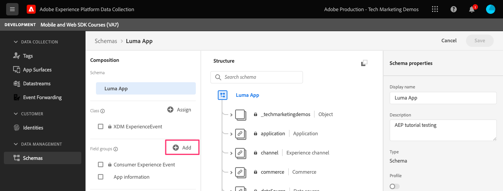

# Données du cycle de vie

Découvrez comment collecter des données de cycle de vie dans une application mobile.

>[!INFO]
>
> Ce tutoriel sera remplacé par un nouveau tutoriel utilisant un nouvel exemple d’application mobile à la fin novembre 2023.

L’extension de cycle de vie du SDK Mobile Adobe Experience Platform active les données de cycle de vie de collecte de votre application mobile. L’extension Adobe Experience Platform Edge Network envoie ces données de cycle de vie à Platform Edge Network, où elles sont ensuite transférées vers d’autres applications et services conformément à votre configuration de flux de données. En savoir plus sur les [Extension Lifecycle](https://developer.adobe.com/client-sdks/documentation/lifecycle-for-edge-network/) dans la documentation du produit.


## Conditions préalables

* Création et exécution de l’application avec les SDK installés et configurés.
* Importation du SDK Assurance.

  ```swift
  import AEPAssurance
  ```

* Enregistrez l’extension Assurance comme décrit dans la section [leçon précédente](install-sdks.md).

## Objectifs d&#39;apprentissage

Dans cette leçon, vous allez :

* Ajoutez le groupe de champs de cycle de vie au schéma.
* Activez des mesures de cycle de vie précises en démarrant/mettant correctement en pause lorsque l’application passe du premier plan à l’arrière-plan.
* Envoyez des données de l’application à Platform Edge Network.
* Validez dans Assurance.

## Ajout d’un groupe de champs de cycle de vie au schéma

Le groupe de champs Événement d’expérience client que vous avez ajouté dans la variable [leçon précédente](create-schema.md) contient déjà les champs de cycle de vie. vous pouvez donc ignorer cette étape. Si vous n’utilisez pas le groupe de champs Événement d’expérience client dans votre propre application, vous pouvez ajouter les champs de cycle de vie en procédant comme suit :

1. Accédez à l’interface du schéma comme décrit dans la section [leçon précédente](create-schema.md).
1. Ouvrez le schéma &quot;Luma App&quot; et sélectionnez **[!UICONTROL Ajouter]**.
   
1. Dans la barre de recherche, saisissez &quot;cycle de vie&quot;.
1. Cochez la case en regard de **[!UICONTROL Détails du cycle de vie mobile AEP]**.
1. Sélectionnez **[!UICONTROL Ajouter des groupes de champs]**.
   
1. Sélectionnez **[!UICONTROL Enregistrer]**.
   


## Modifications de l’implémentation

Maintenant, vous pouvez mettre à jour `AppDelegate.swift` pour enregistrer les événements de cycle de vie :

1. Une fois lancée, si votre application reprend à partir d’un état d’arrière-plan, iOS peut appeler votre `applicationWillEnterForeground:` déléguée . Ajouter `lifecycleStart:`

   ```swift
   MobileCore.lifecycleStart(additionalContextData: nil)
   ```

1. Lorsque l’application entre en arrière-plan, suspendez la collecte de données du cycle de vie de l’application. `applicationDidEnterBackground:` déléguée .

   ```swift
   MobileCore.lifecyclePause()
   ```

>[!NOTE]
>
>Pour iOS 13 et versions ultérieures, veuillez consulter la section [documentation](https://developer.adobe.com/client-sdks/documentation/mobile-core/lifecycle/#register-lifecycle-with-mobile-core-and-add-appropriate-startpause-calls) pour un code légèrement différent.

## Validation avec Assurance

1. Consultez la section [instructions de configuration](assurance.md) et connectez votre simulateur ou votre appareil à Assurance.
1. Lancez l’application.
1. Envoyez l’application en arrière-plan. Vérifier `LifecyclePause`.
1. Amener l’application au premier plan. Vérifier `LifecycleResume`.
   


## Transfert de données vers Platform Edge Network

L’exercice précédent distribue les événements de premier plan et d’arrière-plan au SDK Mobile. Pour envoyer ces événements à Platform Edge Network, suivez les étapes répertoriées. [here](https://developer.adobe.com/client-sdks/documentation/lifecycle-for-edge-network/#configure-a-rule-to-forward-lifecycle-metrics-to-platform). Une fois que les événements sont envoyés à Platform Edge Network, ils sont transférés vers d’autres applications et services en fonction de votre configuration de flux de données.

Une fois que vous avez ajouté la règle pour envoyer les événements de cycle de vie à Platform Edge Network, vous devriez voir `Application Close (Background)` et `Application Launch (Foreground)` événements contenant des données XDM dans Assurance.


Suivant : **[Suivi des événements](events.md)**

>[!NOTE]
>
>Merci d’investir votre temps à apprendre sur le SDK Adobe Experience Platform Mobile. Si vous avez des questions, souhaitez partager des commentaires généraux ou avez des suggestions sur le contenu futur, partagez-les à ce sujet. [Article de discussion de la communauté Experience League](https://experienceleaguecommunities.adobe.com/t5/adobe-experience-platform-launch/tutorial-discussion-implement-adobe-experience-cloud-in-mobile/td-p/443796)