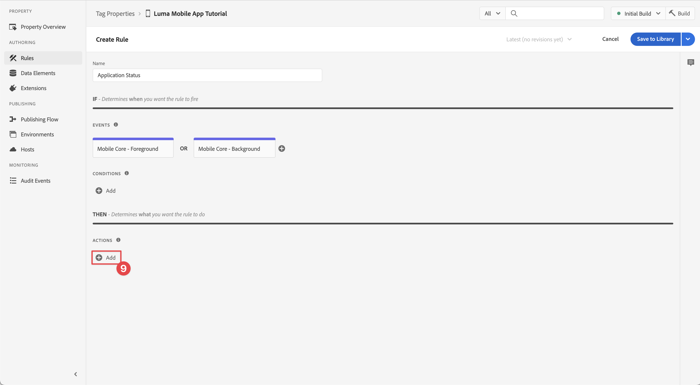

# Collecter les données du cycle de vie

Découvrez comment collecter des données de cycle de vie dans une application mobile.

L’extension de cycle de vie du SDK Mobile Adobe Experience Platform active les données de cycle de vie de collecte de votre application mobile. L’extension Adobe Experience Platform Edge Network envoie ces données de cycle de vie à Platform Edge Network, où elles sont ensuite transférées vers d’autres applications et services conformément à votre configuration de flux de données. En savoir plus sur les [Extension Lifecycle](https://developer.adobe.com/client-sdks/documentation/lifecycle-for-edge-network/) dans la documentation du produit.


## Conditions préalables

* Création et exécution de l’application avec les SDK installés et configurés. Dans le cadre de cette leçon, vous avez déjà commencé la surveillance du cycle de vie. Voir [Installation des SDK - Mise à jour d’AppDelegate](install-sdks.md#update-appdelegate) pour la révision.
* Enregistrez l’extension Assurance comme décrit dans la section [leçon précédente](install-sdks.md).

## Objectifs d&#39;apprentissage

Dans cette leçon, vous allez :

<!--
* Add lifecycle field group to the schema.
* -->
* Activez des mesures de cycle de vie précises en démarrant/mettant correctement en pause lorsque l’application passe du premier plan à l’arrière-plan.
* Envoyez des données de l’application à Platform Edge Network.
* Validez dans Assurance.

<!--
## Add lifecycle field group to schema

The Consumer Experience Event field group you added in the [previous lesson](create-schema.md) already contains the lifecycle fields, so you can skip this step. If you don't use Consumer Experience Event field group in your own app, you can add the lifecycle fields by doing the following:

1. Navigate to the schema interface as described in the [previous lesson](create-schema.md).
1. Open the **Luma Mobile App Event Schema** schema and select **[!UICONTROL Add]** next to Field groups.
    
1. In the search bar, enter "lifecycle".
1. Select the checkbox next to **[!UICONTROL AEP Mobile Lifecycle Details]**.
1. Select **[!UICONTROL Add field groups]**.
    
1. Select **[!UICONTROL Save]**.
    
-->

## Modifications de l’implémentation

Vous pouvez maintenant mettre à jour votre projet pour enregistrer les événements de cycle de vie.

1. Accédez à **[!DNL Luma]** > **[!DNL Luma]** > **[!UICONTROL SceneDelegate]** dans le navigateur de projet Xcode.

1. Une fois lancée, si votre application reprend à partir d’un état d’arrière-plan, iOS peut appeler votre `sceneWillEnterForeground:` déléguez . C’est là que vous souhaitez déclencher un événement de début de cycle de vie. Ajoutez ce code à `func sceneWillEnterForeground(_ scene: UIScene)`:

   ```swift
   // When in foreground start lifecycle data collection
   MobileCore.lifecycleStart(additionalContextData: nil)
   ```

1. Lorsque l’application entre en arrière-plan, vous souhaitez suspendre la collecte des données du cycle de vie de l’application `sceneDidEnterBackground:` déléguée . Ajoutez ce code à  `func sceneDidEnterBackground(_ scene: UIScene)`:

   ```swift
   // When in background pause lifecycle data collection
   MobileCore.lifecyclePause()
   ```

## Validation avec Assurance

1. Consultez la section [instructions de configuration](assurance.md#connecting-to-a-session) pour connecter le simulateur ou l’appareil à Assurance.
1. Envoyez l’application en arrière-plan. Vérifier **[!UICONTROL LifecyclePause]** dans l’interface utilisateur d’Assurance.
1. Amener l’application au premier plan. Vérifier **[!UICONTROL LifecycleResume]** dans l’interface utilisateur d’Assurance.
   


## Transfert de données vers Platform Edge Network

L’exercice précédent distribue les événements de premier plan et d’arrière-plan au SDK Adobe Experience Platform Mobile. Pour transférer ces événements vers Platform Edge Network :

1. Sélectionner **[!UICONTROL Règles]** dans la propriété Balises.
   
1. Sélectionner **[!UICONTROL Version initiale]** comme bibliothèque à utiliser.
1. Sélectionnez **[!UICONTROL Créer une règle]**.
   
1. Dans le **[!UICONTROL Créer une règle]** écran, entrer `Application Status` pour **[!UICONTROL Nom]**.
1. Sélectionner  **[!UICONTROL Ajouter]** below **[!UICONTROL ÉVÉNEMENTS]**.
   
1. Dans le **[!UICONTROL Configuration d’événement]** étape :
   1. Sélectionner **[!UICONTROL Mobile Core]** comme la propriété **[!UICONTROL Extension]**.
   1. Sélectionner **[!UICONTROL Premier plan]** comme la propriété **[!UICONTROL Type d’événement]**.
   1. Sélectionnez **[!UICONTROL Conserver les modifications]**.
      
1. De retour dans le **[!UICONTROL Créer une règle]** écran, sélectionnez  **[!UICONTROL Ajouter]** en regard de **[!UICONTROL Mobile Core - Premier plan]**.
   
1. Dans le **[!UICONTROL Configuration d’événement]** étape :
   1. Sélectionner **[!UICONTROL Mobile Core]** comme la propriété **[!UICONTROL Extension]**.
   1. Sélectionner **[!UICONTROL Contexte]** comme la propriété **[!UICONTROL Type d’événement]**.
   1. Sélectionnez **[!UICONTROL Conserver les modifications]**.
      
1. De retour dans le **[!UICONTROL Créer une règle]** écran, sélectionnez  **[!UICONTROL Ajouter]** underneath **[!UICONTROL ACTIONS]**.
   
1. Dans le **[!UICONTROL Configuration d’action]** étape :
   1. Sélectionner **[!UICONTROL Adobe Experience Edge Network]** comme la propriété **[!UICONTROL Extension]**.
   1. Sélectionner **[!UICONTROL Transfert d’un événement vers Edge Network]** comme la propriété **[!UICONTROL Type d’action]**.
   1. Sélectionnez **[!UICONTROL Conserver les modifications]**.
      
1. Sélectionner **[!UICONTROL Enregistrer dans la bibliothèque]**.
   
1. Sélectionner **[!UICONTROL Build]** pour recréer la bibliothèque.
   

Une fois la propriété créée, les événements sont envoyés à Platform Edge Network et les événements sont transférés vers d’autres applications et services en fonction de votre configuration de flux de données.

Vous devriez voir **[!UICONTROL Fermeture de l’application (arrière-plan)]** et **[!UICONTROL Lancement d’application (premier plan)]** événements contenant des données XDM dans Assurance.


>[!SUCCESS]
>
>Vous avez maintenant configuré votre application pour envoyer des événements d’état d’application (de premier plan, en arrière-plan) au réseau Adobe Experience Platform Edge et tous les services que vous avez définis dans votre flux de données.
>
> Merci d’investir votre temps à apprendre sur le SDK Adobe Experience Platform Mobile. Si vous avez des questions, souhaitez partager des commentaires généraux ou avez des suggestions sur le contenu futur, partagez-les à ce sujet. [Article de discussion de la communauté Experience League](https://experienceleaguecommunities.adobe.com/t5/adobe-experience-platform-data/tutorial-discussion-implement-adobe-experience-cloud-in-mobile/td-p/443796)

Suivant : **[Suivi des données d’événement](events.md)**
