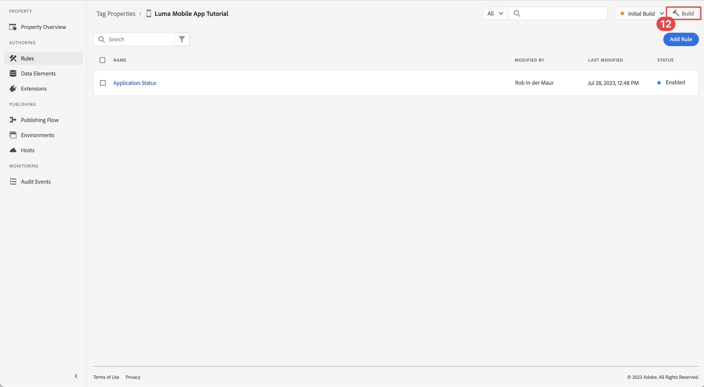
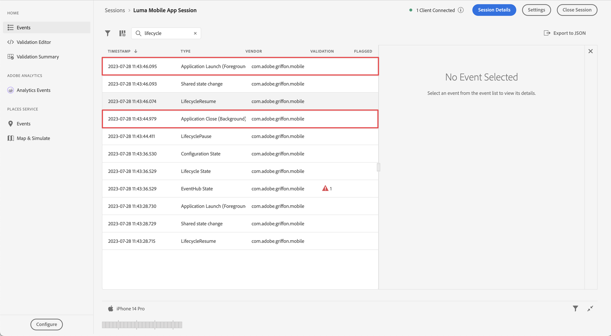

# Collecter des données de cycle de vie

Découvrez comment collecter des données de cycle de vie dans une application mobile.

L’extension Adobe Experience Platform Mobile SDK Lifecycle permet de collecter des données de cycle de vie à partir de votre application mobile. L’extension Adobe Experience Platform Edge Network envoie ces données de cycle de vie à Platform Edge Network, où elles sont ensuite transférées à d’autres applications et services en fonction de la configuration de votre train de données. En savoir plus sur l’extension [Lifecycle](https://developer.adobe.com/client-sdks/documentation/lifecycle-for-edge-network/) dans la documentation du produit.


## Conditions préalables

* Application créée et exécutée avec succès avec les SDK installés et configurés. Dans le cadre de cette leçon, vous avez déjà commencé la surveillance du cycle de vie. Voir [Installation des SDK - Mise à jour d’AppDelegate](install-sdks.md#update-appdelegate) pour révision.
* enregistré l’extension Assurance comme décrit dans la [leçon précédente](install-sdks.md).

## Objectifs d’apprentissage

Dans cette leçon, vous allez :

<!--
* Add lifecycle field group to the schema.
* -->
* Activez des mesures de cycle de vie précises en démarrant/mettant correctement en pause lorsque l’application passe du premier plan à l’arrière-plan.
* Envoyez des données de l’application vers Platform Edge Network.
* Validez dans Assurance.

<!--
## Add lifecycle field group to schema

The Consumer Experience Event field group you added in the [previous lesson](create-schema.md) already contains the lifecycle fields, so you can skip this step. If you don't use Consumer Experience Event field group in your own app, you can add the lifecycle fields by doing the following:

1. Navigate to the schema interface as described in the [previous lesson](create-schema.md).
1. Open the **Luma Mobile App Event Schema** schema and select **[!UICONTROL Add]** next to Field groups.
    {zoomable="yes"}
1. In the search bar, enter "lifecycle".
1. Select the checkbox next to **[!UICONTROL AEP Mobile Lifecycle Details]**.
1. Select **[!UICONTROL Add field groups]**.
    {zoomable="yes"}
1. Select **[!UICONTROL Save]**.
    {zoomable="yes"}
-->

## Modifications de la mise en œuvre

Vous pouvez maintenant mettre à jour votre projet pour enregistrer les événements de cycle de vie.

>[!BEGINTABS]

>[!TAB iOS]

1. Accédez à **[!DNL Luma]** > **[!DNL Luma]** > **[!UICONTROL SceneDelegate]** dans le navigateur de projet Xcode.

1. Une fois lancée, si votre application reprend à partir d’un état d’arrière-plan, iOS peut appeler votre méthode de délégué `sceneWillEnterForeground:`, qui est l’endroit où vous souhaitez déclencher un événement de début de cycle de vie. Ajoutez ce code à `func sceneWillEnterForeground(_ scene: UIScene)` :

   ```swift
   // When in foreground start lifecycle data collection
   MobileCore.lifecycleStart(additionalContextData: nil)
   ```

1. Lorsque l’application entre en arrière-plan, vous devez suspendre la collecte de données de cycle de vie à partir de la méthode de délégué `sceneDidEnterBackground:` de votre application. Ajoutez ce code à `func sceneDidEnterBackground(_ scene: UIScene)` :

   ```swift
   // When in background pause lifecycle data collection
   MobileCore.lifecyclePause()
   ```

>[!TAB Android]

1. Accédez à **[!UICONTROL app]** > **[!UICONTROL kotlin+java]** > **[!UICONTROL com.adobe.luma.tutorial.android]** > **[!UICONTROL LumaApplication]** dans le navigateur d’Android Studio.

1. Une fois lancée, si votre application reprend à partir d’un état d’arrière-plan, Android peut appeler votre `fun onActivityResumed function` de remplacement et cette fonction est l’endroit où vous souhaitez déclencher un événement de début de cycle de vie. Ajoutez ce code à `override fun onActivityResumed(activity: Activity)` :

   ```kotlin
   // When in foreground start lifecycle data collection
   MobileCore.lifecycleStart(null)
   ```

1. Lorsque l’application entre en arrière-plan, vous devez suspendre la collecte de données de cycle de vie à partir de la fonction `override fun onActivityPaused` de votre application. Ajoutez ce code à `override fun onActivityPaused(activity: Activity)` :

   ```kotlin
   // When in background pause lifecycle data collection
   MobileCore.lifecyclePause()
   ```

>[!ENDTABS]


## Valider avec Assurance

1. Consultez la section [instructions de configuration](assurance.md#connecting-to-a-session) pour connecter votre simulateur ou votre appareil à Assurance.
1. Envoyez l’application en arrière-plan. Recherchez des événements **[!UICONTROL LifecyclePause]** dans l’interface utilisateur d’Assurance.
1. Mettez l’application au premier plan. Recherchez les événements **[!UICONTROL LifecycleResume]** dans l’interface utilisateur d’Assurance.
   {zoomable="yes"}


## Transférer les données vers Platform Edge Network

L’exercice précédent distribue les événements de premier plan et d’arrière-plan à Adobe Experience Platform Mobile SDK. Pour transférer ces événements vers Platform Edge Network :

1. Sélectionnez **[!UICONTROL Règles]** dans la propriété Balises.
   {zoomable="yes"}
1. Sélectionnez **[!UICONTROL Version initiale]** comme bibliothèque à utiliser.
1. Sélectionnez **[!UICONTROL Créer une règle]**.
   {zoomable="yes"}
1. Dans l’écran **[!UICONTROL Créer une règle]**, saisissez `Application Status` pour **[!UICONTROL Nom]**.
1. Sélectionnez  **[!UICONTROL Ajouter]** ci-dessous **[!UICONTROL ÉVÉNEMENTS]**.
   {zoomable="yes"}
1. À l’étape **[!UICONTROL Configuration d’événement]** :
   1. Sélectionnez **[!UICONTROL Mobile Core]** comme **[!UICONTROL Extension]**.
   1. Sélectionnez **[!UICONTROL Premier plan]** comme **[!UICONTROL Type d’événement]**.
   1. Sélectionnez **[!UICONTROL Conserver les modifications]**.
      {zoomable="yes"}
1. De retour dans l’écran **[!UICONTROL Créer une règle]**, sélectionnez  **[!UICONTROL Ajouter]** en regard de **[!UICONTROL Mobile Core - Premier plan]**.
   {zoomable="yes"}
1. À l’étape **[!UICONTROL Configuration d’événement]** :
   1. Sélectionnez **[!UICONTROL Mobile Core]** comme **[!UICONTROL Extension]**.
   1. Sélectionnez **[!UICONTROL Arrière-plan]** comme **[!UICONTROL Type d’événement]**.
   1. Sélectionnez **[!UICONTROL Conserver les modifications]**.
      {zoomable="yes"}
1. De retour dans l’écran **[!UICONTROL Créer une règle]**, sélectionnez  **[!UICONTROL Ajouter]** sous **[!UICONTROL ACTIONS]**.

   {zoomable="yes"}

1. À l’étape **[!UICONTROL Configuration d’action]** :
   1. Sélectionnez **[!UICONTROL Adobe Experience Edge Network]** comme **[!UICONTROL extension]**.
   1. Sélectionnez **[!UICONTROL Transférer l’événement vers Edge Network]** comme **[!UICONTROL Type d’action]**.
   1. Sélectionnez **[!UICONTROL Conserver les modifications]**.
      {zoomable="yes"}
1. Sélectionnez **[!UICONTROL Enregistrer dans la bibliothèque]**.
   {zoomable="yes"}
1. Sélectionnez **[!UICONTROL Créer]** pour recréer la bibliothèque.
   {zoomable="yes"}

Une fois la propriété créée, les événements sont envoyés à Platform Edge Network et les événements sont transférés à d’autres applications et services en fonction de la configuration de votre flux de données.

Vous devriez voir les événements **[!UICONTROL Fermeture de l’application (arrière-plan)]** et **[!UICONTROL Lancement de l’application (premier plan)]** contenant des données XDM dans Assurance.

{zoomable="yes"}

>[!SUCCESS]
>
>Vous avez maintenant configuré votre application pour envoyer des événements d’état d’application (premier plan, arrière-plan) à Adobe Experience Platform Edge Network et à tous les services que vous avez définis dans votre flux de données.
>
> Merci d’avoir consacré votre temps à découvrir Adobe Experience Platform Mobile SDK. Si vous avez des questions, souhaitez partager des commentaires généraux ou des suggestions sur le contenu futur, partagez-les dans ce [article de discussion de la communauté Experience League](https://experienceleaguecommunities.adobe.com/t5/adobe-experience-platform-data/tutorial-discussion-implement-adobe-experience-cloud-in-mobile/td-p/443796)

Suivant : **[Suivi des données d’événement](events.md)**
