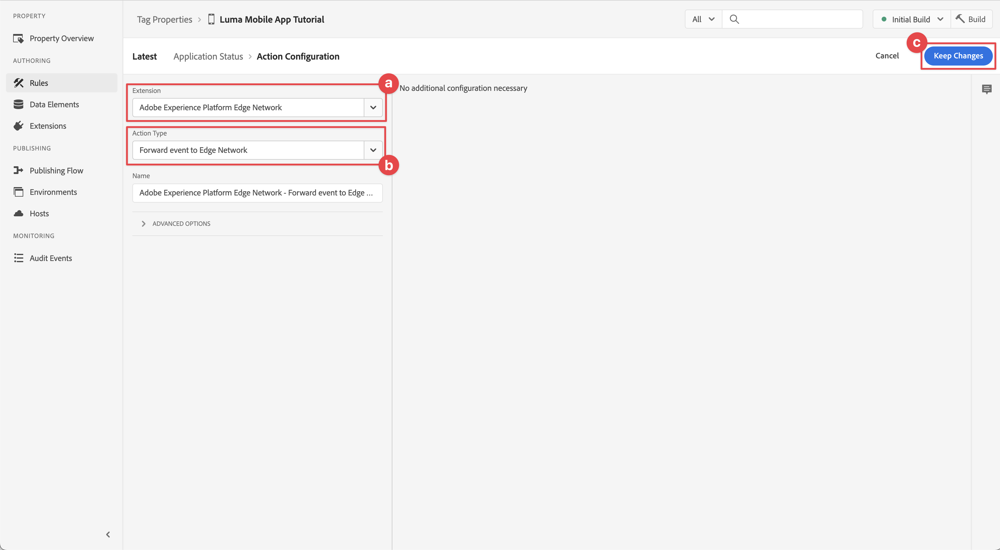

# Collecter les données du cycle de vie

Découvrez comment collecter des données de cycle de vie dans une application mobile.

L’extension de cycle de vie du SDK Mobile Adobe Experience Platform active les données de cycle de vie de collecte de votre application mobile. L’extension Adobe Experience Platform Edge Network envoie ces données de cycle de vie à l’Edge Network Platform, où elles sont ensuite transférées vers d’autres applications et services conformément à votre configuration de flux de données. Pour en savoir plus sur l’ [extension de cycle de vie](https://developer.adobe.com/client-sdks/documentation/lifecycle-for-edge-network/) dans la documentation du produit.


## Conditions préalables

* Création et exécution de l’application avec les SDK installés et configurés. Dans le cadre de cette leçon, vous avez déjà commencé la surveillance du cycle de vie. Voir [Installation des SDK - Mise à jour d’AppDelegate](install-sdks.md#update-appdelegate) pour révision.
* Enregistrement de l’extension Assurance comme décrit dans la [leçon précédente](install-sdks.md).

## Objectifs d&#39;apprentissage

Dans cette leçon, vous allez :

<!--
* Add lifecycle field group to the schema.
* -->
* Activez des mesures de cycle de vie précises en démarrant/mettant correctement en pause lorsque l’application passe du premier plan à l’arrière-plan.
* Envoyez des données de l’application à l’Edge Network Platform.
* Validez dans Assurance.

<!--
## Add lifecycle field group to schema

The Consumer Experience Event field group you added in the [previous lesson](create-schema.md) already contains the lifecycle fields, so you can skip this step. If you don't use Consumer Experience Event field group in your own app, you can add the lifecycle fields by doing the following:

1. Navigate to the schema interface as described in the [previous lesson](create-schema.md).
1. Open the **Luma Mobile App Event Schema** schema and select **[!UICONTROL Add]** next to Field groups.
    
1. In the search bar, enter "lifecycle".
1. Select the checkbox next to **[!UICONTROL AEP Mobile Lifecycle Details]**.
1. Select **[!UICONTROL Add field groups]**.
    
1. Select **[!UICONTROL Save]**.
    
-->

## Modifications de l’implémentation

Vous pouvez maintenant mettre à jour votre projet pour enregistrer les événements de cycle de vie.

1. Accédez à **[!DNL Luma]** > **[!DNL Luma]** > **[!UICONTROL SceneDelegate]** dans le navigateur de projet Xcode.

1. Une fois lancée, si votre application reprend à partir d’un état d’arrière-plan, iOS peut appeler votre méthode de délégation `sceneWillEnterForeground:` et c’est là que vous souhaitez déclencher un événement de début de cycle de vie. Ajoutez ce code à `func sceneWillEnterForeground(_ scene: UIScene)` :

   ```swift
   // When in foreground start lifecycle data collection
   MobileCore.lifecycleStart(additionalContextData: nil)
   ```

1. Lorsque l’application entre en arrière-plan, vous souhaitez suspendre la collecte des données du cycle de vie de la méthode de délégation `sceneDidEnterBackground:` de votre application. Ajoutez ce code à `func sceneDidEnterBackground(_ scene: UIScene)` :

   ```swift
   // When in background pause lifecycle data collection
   MobileCore.lifecyclePause()
   ```

## Valider avec Assurance

1. Consultez la section [instructions de configuration](assurance.md#connecting-to-a-session) pour connecter votre simulateur ou périphérique à Assurance.
1. Envoyez l’application en arrière-plan. Recherchez les événements **[!UICONTROL LifecyclePause]** dans l’interface utilisateur d’assurance.
1. Amener l’application au premier plan. Recherchez les événements **[!UICONTROL LifecycleResume]** dans l’interface utilisateur d’assurance.
   


## Transfert de données vers l’Edge Network Platform

L’exercice précédent distribue les événements de premier plan et d’arrière-plan au SDK Adobe Experience Platform Mobile. Pour transférer ces événements à l’Edge Network Platform :

1. Sélectionnez **[!UICONTROL Rules]** dans la propriété Tags.
   
1. Sélectionnez **[!UICONTROL Initial Build]** comme bibliothèque à utiliser.
1. Sélectionnez **[!UICONTROL Créer une règle]**.
   
1. Dans l’écran **[!UICONTROL Créer une règle]**, saisissez `Application Status` pour **[!UICONTROL Nom]**.
1. Sélectionnez  **&#x200B;**&#x200B;sous **[!UICONTROL EVENTS]**.
   
1. À l’étape **[!UICONTROL Event Configuration]** :
   1. Sélectionnez **[!UICONTROL Mobile Core]** comme **[!UICONTROL Extension]**.
   1. Sélectionnez **[!UICONTROL Foreground]** comme **[!UICONTROL Type d’événement]**.
   1. Sélectionnez **[!UICONTROL Conserver les modifications]**.

      
1. De retour dans l’écran **[!UICONTROL Créer une règle]**, sélectionnez  **[!UICONTROL Ajouter]** en regard de **[!UICONTROL Mobile Core - Premier plan]**.
   
1. À l’étape **[!UICONTROL Event Configuration]** :
   1. Sélectionnez **[!UICONTROL Mobile Core]** comme **[!UICONTROL Extension]**.
   1. Sélectionnez **[!UICONTROL Arrière-plan]** comme **[!UICONTROL Type d’événement]**.
   1. Sélectionnez **[!UICONTROL Conserver les modifications]**.

      
1. De retour dans l’écran **[!UICONTROL Créer une règle]**, sélectionnez  **[!UICONTROL Ajouter]** sous **[!UICONTROL ACTIONS]**.
   
1. À l’étape **[!UICONTROL Configuration de l’action]** :
   1. Sélectionnez **[!UICONTROL Adobe d’Experience Edge Network]** comme **[!UICONTROL extension]**.
   1. Sélectionnez **[!UICONTROL Forward event to Edge Network]** comme **[!UICONTROL Type d’action]**.
   1. Sélectionnez **[!UICONTROL Conserver les modifications]**.

      
1. Sélectionnez **[!UICONTROL Enregistrer dans la bibliothèque]**.
   
1. Sélectionnez **[!UICONTROL Build]** pour recréer la bibliothèque.
   

Une fois la propriété créée, les événements sont envoyés à l’Edge Network Platform et les événements sont transférés vers d’autres applications et services en fonction de votre configuration de flux de données.

Vous devriez voir les événements **[!UICONTROL Fermeture de l’application (arrière-plan)]** et **[!UICONTROL Lancement d’application (premier plan)]** contenant des données XDM dans Assurance.


>[!SUCCESS]
>
>Vous avez maintenant configuré votre application pour envoyer des événements d’état (de premier plan, en arrière-plan) à l’Edge Network Adobe Experience Platform et tous les services que vous avez définis dans votre flux de données.
>
> Merci d’investir votre temps à apprendre sur le SDK Adobe Experience Platform Mobile. Si vous avez des questions, souhaitez partager des commentaires généraux ou avez des suggestions sur le contenu à venir, partagez-les sur cet [post de discussion de la communauté Experience League](https://experienceleaguecommunities.adobe.com/t5/adobe-experience-platform-data/tutorial-discussion-implement-adobe-experience-cloud-in-mobile/td-p/443796?profile.language=fr)

Suivant : **[Track event data](events.md)**
