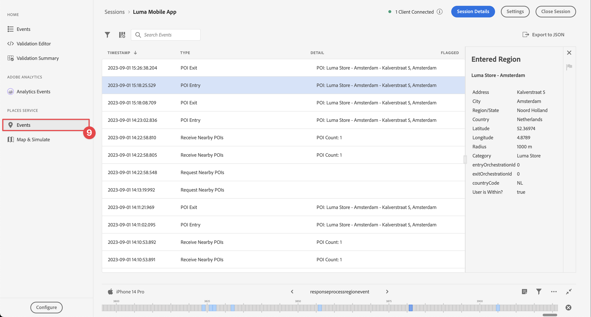
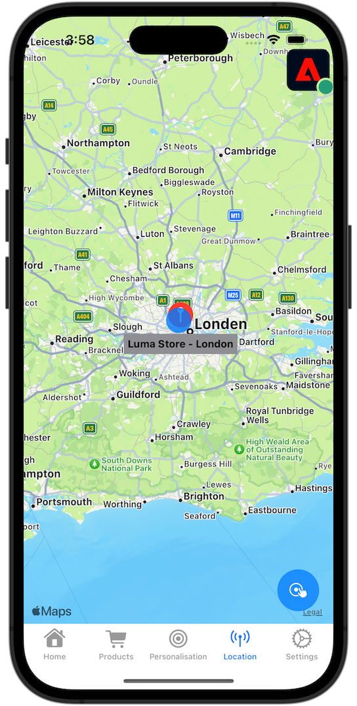

# Utiliser des emplacements

Découvrez comment utiliser le service de géolocalisation Places dans votre application.

Le service Adobe Experience Platform Data Collection Places est un service de géolocalisation qui permet aux applications mobiles reconnaissant l’emplacement de l’application de comprendre le contexte de l’emplacement. Le service utilise des interfaces SDK riches et faciles à utiliser, accompagnées d’une base de données flexible de points ciblés (POI).

## Conditions préalables

* Toutes les dépendances de package sont en place dans le projet Xcode.
* Extensions enregistrées dans AppDelegate.
* Configuré MobileCore pour utiliser votre appId de développement.
* SDK importés.
* Création et exécution de l’application réussie avec les modifications ci-dessus.

## Objectifs d&#39;apprentissage

Dans cette leçon, vous allez

* Découvrez comment définir des points ciblés dans le service Places.
* Mettez à jour votre propriété de balise avec l’extension Places.
* Mettez à jour votre schéma pour capturer les événements de géolocalisation.
* Validez la configuration dans Assurance.
* Mettez à jour votre application pour enregistrer l’extension Places.
* Mettez en oeuvre le suivi de la géolocalisation à partir du service Places dans votre application.


## Configuration

Pour que le service Places fonctionne dans votre application et dans le SDK Mobile, vous devez effectuer une configuration.

### Définition des emplacements

Vous définissez certains points ciblés dans le service Places.

1. Dans l’interface utilisateur de la collecte de données, sélectionnez **[!UICONTROL Places]**.
1. Sélectionnez .
1. Dans le menu contextuel, sélectionnez **[!UICONTROL Gérer les bibliothèques]**.
   
1. Dans la boîte de dialogue **[!UICONTROL Gérer les bibliothèques]**, sélectionnez **[!UICONTROL Nouveau]**.
1. Dans la boîte de dialogue **[!UICONTROL Créer une bibliothèque]**, saisissez un **[!UICONTROL nom]**, par exemple `Luma`.
1. Sélectionnez **[!UICONTROL Confirmer]**.
   
1. Pour fermer la boîte de dialogue **[!UICONTROL Gérer les bibliothèques]**, sélectionnez **[!UICONTROL Fermer]**.
1. De retour dans **[!UICONTROL Gestion des points ciblés]**, sélectionnez **[!UICONTROL Importer les points ciblés]**.
1. Sélectionnez **[!UICONTROL Démarrer]** dans la boîte de dialogue **[!UICONTROL Importer des emplacements]**.
1. Sélectionnez **[!DNL Luma]** dans la liste des bibliothèques,
1. Sélectionnez **[!UICONTROL Suivant]**.
   
1. Téléchargez le fichier ZIP [Luma POIs](assets/luma_pois.csv.zip) et extrayez-le vers un emplacement sur votre ordinateur.
1. Dans la boîte de dialogue **[!UICONTROL Importer des emplacements]**, faites glisser et déposez le fichier `luma_pois.csv` extrait sur **[!UICONTROL Choisir un fichier CSV - Effectuez un glisser-déposer de votre fichier]**. Vous devriez voir **[!UICONTROL Validation Success]** - **[!UICONTROL Le fichier CSV a été validé avec succès]**.
1. Sélectionnez **[!UICONTROL Commencer l’importation]**. **[!UICONTROL Success]** - **[!UICONTROL 6 nouveaux points ciblés ont été ajoutés]**.
1. Sélectionnez **[!UICONTROL Done]**.
1. Dans **[!UICONTROL Gestion des points ciblés]**, vous devriez constater que six nouveaux magasins Luma sont ajoutés à la liste. Vous pouvez basculer entre la liste  et la vue de carte .
   .


### Installation de l’extension Places

1. Accédez à **[!UICONTROL Balises]** et recherchez votre propriété de balise mobile, puis ouvrez la propriété .
1. Sélectionnez **[!UICONTROL Extensions]**.
1. Sélectionnez **[!UICONTROL Catalog]**.
1. Recherchez l’extension **[!UICONTROL Places]** .
1. Installez l’extension .

   

1. Dans la boîte de dialogue **[!UICONTROL Installer l’extension]** :
   1. Sélectionnez **[!DNL Luma]** dans la liste **[!UICONTROL Sélectionner une bibliothèque]**.
   1. Vérifiez que vous avez sélectionné votre bibliothèque de travail, par exemple **[!UICONTROL Initial Build]**.
   1. Sélectionnez **[!UICONTROL Enregistrer dans la bibliothèque et créer]** depuis **[!UICONTROL Enregistrer dans la bibliothèque]**.

      .

1. Votre bibliothèque est reconstruite.


### Vérification de votre schéma

Vérifiez si votre schéma, tel que défini dans [Créer un schéma](create-schema.md), incorpore les groupes de champs et les classes nécessaires pour collecter les données des points ciblés et de géolocalisation.

1. Accédez à l’interface de collecte de données et sélectionnez **[!UICONTROL Schémas]** dans le rail de gauche.
1. Sélectionnez **[!UICONTROL Parcourir]** dans la barre supérieure.
1. Sélectionnez votre schéma pour l’ouvrir.
1. Dans l’éditeur de schéma, sélectionnez **[!UICONTROL Événement d’expérience client]**.
1. Un objet **[!UICONTROL placeContext]** s’affiche avec un objet et des champs pour capturer les données d’interaction des points ciblés et de géolocalisation.
   .


### Mettre à jour la propriété de balise

L’extension Places pour les balises permet de surveiller les événements de géolocalisation et de déclencher des actions en fonction de ces événements. Vous pouvez utiliser cette fonctionnalité pour minimiser le codage de l’API que vous devez implémenter dans l’application.

**Éléments de données**

Vous devez d’abord créer plusieurs éléments de données.

1. Accédez à la propriété de balise dans l’interface utilisateur de la collecte de données.
1. Sélectionnez **[!UICONTROL Data Elements]** dans le rail de gauche.
1. Sélectionnez **[!UICONTROL Ajouter un élément de données]**.
1. Dans l’écran **[!UICONTROL Créer un élément de données]** , saisissez un nom, par exemple `Name - Entered`.
1. Sélectionnez **[!UICONTROL Places]** dans la liste **[!UICONTROL Extension]**.
1. Sélectionnez **[!UICONTROL Name]** dans la liste **[!UICONTROL Data Element Type]**.
1. Sélectionnez **[!UICONTROL POI actuel]** sous **[!UICONTROL TARGET]**.
1. Sélectionnez **[!UICONTROL Enregistrer dans la bibliothèque]**.
   

1. Répétez les étapes 4 à 8 en utilisant les informations du tableau ci-dessous, pour créer des éléments de données supplémentaires.

   | Nom | Extension | Type d’élément de données | CIBLE |
   |---|---|---|---|
   | `Name - Exited` | Places | Nom | Dernier point ciblé de sortie |
   | `Category - Current` | Places | Catégorie | Point ciblé actuel |
   | `Category - Exited` | Places | Catégorie | Dernier point ciblé de sortie |
   | `City - Current` | Places | Ville | Point ciblé actuel |
   | `City - Exited` | Places | Ville | Dernier point ciblé de sortie |

   La liste des éléments de données doit être la suivante.

   

**Règles**

Vous allez ensuite définir des règles pour travailler avec ces éléments de données.

1. Dans la propriété de balise, sélectionnez **[!UICONTROL Rules]** dans le rail de gauche.
1. Sélectionnez **[!UICONTROL Ajouter une règle]**.
1. Dans l’écran **[!UICONTROL Créer une règle]** , saisissez un nom pour la règle, par exemple `POI - Entry`.
1. Sélectionnez  sous **[!UICONTROL EVENTS]**.
   1. Sélectionnez **[!UICONTROL Places]** dans la liste **[!UICONTROL Extension]** et **[!UICONTROL Entrer sur le point ciblé]** dans la liste **[!UICONTROL Type d’événement]**.
   1. Sélectionnez **[!UICONTROL Conserver les modifications]**.

      .
1. Sélectionnez  sous **[!UICONTROL ACTIONS]**.
   1. Sélectionnez **[!UICONTROL Mobile Core]** dans la liste **[!UICONTROL Extension]**, puis **[!UICONTROL Joindre des données]** dans la liste **[!UICONTROL Type d’action]**. Cette action associe des données de payload.
   1. Dans la **[!UICONTROL charge utile JSON]**, collez la charge utile suivante :

      ```json
      {
          "xdm": {
              "eventType": "location.entry",
              "placeContext": {
                  "geo": {
                      "city": "{%%City - Current%%}"
                  },
                  "POIinteraction": {
                      "poiDetail": {
                          "name": "{%%Name - Current%%}",
                          "category": "{%%Category - Current%%}"
                      },
                      "poiEntries": {
                          "value": 1
                      }
                  }
              }
          }
      }
      ```

      Vous pouvez également insérer des valeurs d’espace réservé d’élément de données `{%% ... %%}` dans le fichier JSON en sélectionnant les . Une boîte de dialogue contextuelle vous permet de sélectionner un élément de données que vous avez créé.

   1. Sélectionnez **[!UICONTROL Conserver les modifications]**.

      

1. Sélectionnez  en regard de l’action **[!UICONTROL Mobile Core - Attach Data]** .
   1. Sélectionnez **[!UICONTROL Adobe Experience Platform Edge Network]** dans la liste **[!UICONTROL Extension]** et sélectionnez **[!UICONTROL Forward event to Edge Network]**. Cette action garantit que l’événement et les données de payload supplémentaires sont transférés à l’Edge Network Platform.
   1. Sélectionnez **[!UICONTROL Conserver les modifications]**.

1. Pour enregistrer la règle, sélectionnez **[!UICONTROL Enregistrer dans la bibliothèque]**.

   

Créons une autre règle

1. Dans l’écran **[!UICONTROL Créer une règle]** , saisissez un nom pour la règle, par exemple `POI - Exit`.
1. Sélectionnez  sous **[!UICONTROL EVENTS]**.
   1. Sélectionnez **[!UICONTROL Places]** dans la liste **[!UICONTROL Extension]** et **[!UICONTROL Quitter POI]** dans la liste **[!UICONTROL Type d’événement]**.
   1. Sélectionnez **[!UICONTROL Conserver les modifications]**.
1. Sélectionnez  sous **[!UICONTROL ACTIONS]**.
   1. Sélectionnez **[!UICONTROL Mobile Core]** dans la liste **[!UICONTROL Extension]**, puis **[!UICONTROL Attach Data]** dans la liste **[!UICONTROL Action Type]**.
   1. Dans la **[!UICONTROL charge utile JSON]**, collez la charge utile suivante :

      ```json
      {
          "xdm": {
              "eventType": "location.exit",
              "placeContext": {
                  "geo": {
                      "city": "{%%City - Exited%%}"
                  },
                  "POIinteraction": {
                      "poiExits": {
                          "value": 1
                      },
                      "poiDetail": {
                          "name": "{%%Name - Exited%%}",
                          "category": "{%%Category - Exited%%}"
                      }
                  }
              }
          }
      }
      ```

   1. Sélectionnez **[!UICONTROL Conserver les modifications]**.

1. Sélectionnez  en regard de l’action **[!UICONTROL Mobile Core - Attach Data]** .
   1. Sélectionnez **[!UICONTROL Adobe Experience Platform Edge Network]** dans la liste **[!UICONTROL Extension]** et sélectionnez **[!UICONTROL Forward event to Edge Network]**.
   1. Sélectionnez **[!UICONTROL Conserver les modifications]**.

1. Pour enregistrer la règle, sélectionnez **[!UICONTROL Enregistrer dans la bibliothèque]**.

   


Pour vous assurer que toutes les modifications apportées à votre balise sont publiées

1. Sélectionnez **[!UICONTROL Initial Build]** comme bibliothèque à créer.
1. Sélectionnez **[!UICONTROL Build]**.
   


## Validation de la configuration dans Assurance

Pour valider votre configuration dans Assurance :

1. Accédez à l’interface utilisateur d’assurance.
1. Si ce n’est pas déjà le cas dans le rail de gauche, sélectionnez **[!UICONTROL Configurer]** dans le rail de gauche, puis  en regard de **[!UICONTROL Événements]** et **[!UICONTROL Map &amp; Simulate]** sous **[!UICONTROL PLACES SERVICE]**.
1. Sélectionnez **[!UICONTROL Enregistrer]**.
1. Sélectionnez **[!UICONTROL Map &amp; Simulate]** dans le rail de gauche.
1. Déplacez la carte vers un emplacement de l’un de vos points ciblés.
1. Sélectionnez  Simuler la charge des points ciblés. Votre point ciblé est identifié à l’aide d’un cercle et d’une broche.
1. Sélectionnez votre point ciblé.
1. Dans la fenêtre contextuelle, sélectionnez  **[!UICONTROL Simuler l’événement d’entrée]**.
   
1. Sélectionnez **[!UICONTROL Events]** dans le rail de gauche et vous devriez voir les événements que vous avez simulés.
   


## Mise en oeuvre de Places dans votre application

Comme indiqué dans les leçons précédentes, l’installation d’une extension de balise mobile fournit uniquement la configuration. Vous devez ensuite installer et enregistrer le SDK Places. Si ces étapes ne sont pas claires, consultez la section [Installer les SDK](install-sdks.md) .

>[!NOTE]
>
>Si vous avez terminé la section [Installer les SDK](install-sdks.md) , le SDK Places est déjà installé et vous pouvez ignorer cette étape.
>

1. Dans Xcode, assurez-vous que [AEP Places](https://github.com/adobe/aepsdk-places-ios) est ajouté à la liste des modules dans les dépendances de modules. Voir [Swift Package Manager](install-sdks.md#swift-package-manager).
1. Accédez à **[!DNL Luma]** > **[!DNL Luma]** > **[!DNL AppDelegate]** dans le navigateur de projet Xcode.
1. Assurez-vous que `AEPPlaces` fait partie de votre liste d’importations.

   ```swift
   import AEPPlaces
   ```

1. Vérifiez que `Places.self` fait partie du tableau des extensions que vous enregistrez.

   ```swift
   let extensions = [
       AEPIdentity.Identity.self,
       Lifecycle.self,
       Signal.self,
       Edge.self,
       AEPEdgeIdentity.Identity.self,
       Consent.self,
       UserProfile.self,
       Places.self,
       Messaging.self,
       Optimize.self,
       Assurance.self
   ]
   ```

1. Accédez à **[!DNL Luma]** > **[!DNL Luma]** > **[!DNL Utils]** > **[!UICONTROL MobileSDK]** dans le navigateur de projet Xcode et recherchez la fonction `func processRegionEvent(regionEvent: PlacesRegionEvent, forRegion region: CLRegion) async` . Ajoutez le code suivant :

   ```swift
   // Process geolocation event
   Places.processRegionEvent(regionEvent, forRegion: region)
   ```

   Cette API [`Places.processRegionEvent`](https://developer.adobe.com/client-sdks/documentation/places/api-reference/#processregionevent) communique les informations de géolocalisation au service Places.

1. Accédez à **[!DNL Luma]** > **[!DNL Luma]** > **[!DNL Views]** > **[!DNL Location]** > **[!DNL GeofenceSheet]** dans le navigateur de projet de Xcode.

   1. Pour le bouton Entrée, saisissez le code suivant :

   ```swift
   // Simulate geofence entry event
   Task {
       await MobileSDK.shared.processRegionEvent(regionEvent: .entry, forRegion: region)
   }
   ```

   1. Pour le bouton Quitter , saisissez le code suivant :

   ```swift
   // Simulate geofence exit event
   Task {
       await MobileSDK.shared.processRegionEvent(regionEvent: .exit, forRegion: region)
   }
   ```

## Validation à l’aide de votre application

1. Ouvrez votre application sur un appareil ou dans le simulateur.

1. Accédez à l’onglet **[!UICONTROL Location]** .

1. Déplacez (faites glisser) la carte pour vous assurer que le cercle central bleu se trouve au-dessus de l’un de vos points ciblés, par exemple Londres.

1. Appuyer  jusqu’à ce que la catégorie et le nom s’affichent dans le libellé à l’emplacement rouge avec l’épingle.

1. Appuyez sur le libellé du point ciblé, ce qui ouvre la feuille **[!UICONTROL Point ciblé le plus proche]**.

   

1. Appuyez sur les boutons **[!UICONTROL Entry]** ou **[!UICONTROL Exit]** pour simuler les événements d’entrée et de sortie de géobarrière de l’application.

   

1. Les événements doivent s’afficher dans l’interface utilisateur d’Assurance.


## Étapes suivantes

Vous devriez maintenant disposer de tous les outils pour commencer à ajouter d’autres fonctionnalités à votre fonctionnalité de géolocalisation dans l’application. Lorsque vous avez transféré les événements à l’Edge Network, une fois que vous avez configuré l’application pour [Experience Platform](platform.md), les événements d’expérience apparaissant pour le profil utilisé dans l’application doivent s’afficher.

Dans la section Journey Optimizer de ce tutoriel, vous verrez que les événements d’expérience peuvent être utilisés pour déclencher des parcours (voir [notification push](journey-optimizer-inapp.md) et [messagerie in-app](journey-optimizer-push.md) avec Journey Optimizer). Par exemple, l’exemple habituel d’envoi à l’utilisateur de votre application d’une notification push avec une promotion de produit lorsque cet utilisateur accède à la clôture d’une boutique physique.

Vous avez vu une mise en oeuvre de la fonctionnalité de votre application, principalement pilotée par le service Places, ainsi que par les éléments de données et les règles que vous avez définis dans votre propriété de balise. Par conséquent, minimisez le code dans votre application. Vous pouvez également mettre en oeuvre la même fonctionnalité directement dans votre application à l’aide de l’API [`Edge.sendEvent`](https://developer.adobe.com/client-sdks/documentation/edge-network/api-reference/#sendevent) (voir [Événements](events.md) pour plus d’informations) avec une charge utile XDM contenant un objet `placeContext` renseigné.

>[!SUCCESS]
>
>Vous avez désormais activé l’application pour les services de géolocalisation à l’aide de l’extension Places dans le SDK Mobile Experience Platform.
>
>Merci d’investir votre temps à apprendre sur le SDK Adobe Experience Platform Mobile. Si vous avez des questions, souhaitez partager des commentaires généraux ou avez des suggestions sur le contenu à venir, partagez-les sur cet [post de discussion de la communauté Experience League](https://experienceleaguecommunities.adobe.com/t5/adobe-experience-platform-data/tutorial-discussion-implement-adobe-experience-cloud-in-mobile/td-p/443796).

Suivant : **[Mapper les données à Adobe Analytics](analytics.md)**
