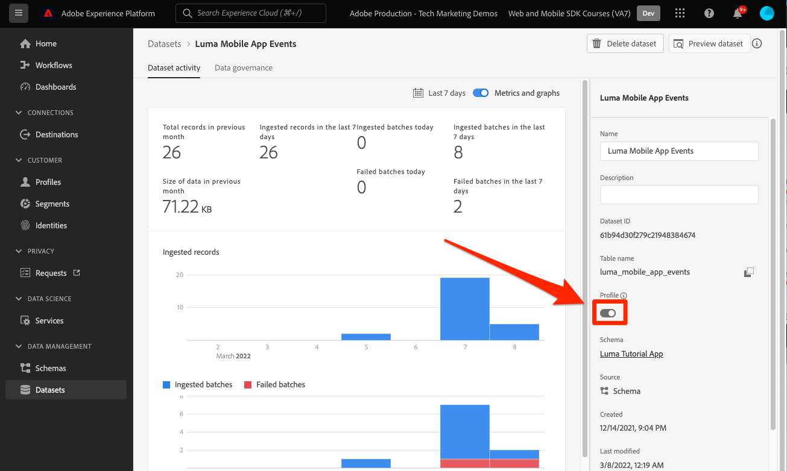

# Envoi de données à Adobe Experience Platform

Découvrez comment envoyer des données à Adobe Experience Platform.

Cette leçon facultative s’applique à tous les clients de Real-time Customer Data Platform (Real-Time CDP), Journey Optimizer et Customer Journey Analytics. Experience Platform, la base des produits Experience Cloud, est un système ouvert qui transforme toutes vos données — Adobe et non-Adobe — en profils clients robustes qui se mettent à jour en temps réel et utilisent des insights pilotés par l’IA pour vous aider à fournir les expériences adéquates sur chaque canal.

Le [event](events.md), [cycle de vie](lifecycle-data.md), et [identité](identity.md) les données que vous avez collectées et envoyées à Platform Edge Network dans les leçons précédentes sont transférées aux services configurés dans votre flux de données, y compris Adobe Experience Platform.

## Conditions préalables

Votre organisation doit être configurée et des autorisations doivent être accordées pour Adobe Experience Platform.

Si vous n’y avez pas accès, vous pouvez [ignorer cette leçon](install-sdks.md).

## Objectifs d&#39;apprentissage

Dans cette leçon, vous allez :

* Créez un jeu de données Experience Platform.
* Validez les données du jeu de données.
* Activez votre schéma et votre jeu de données pour Real-time Customer Profile.
* Validation des données dans Real-time Customer Profile.
* Validez les données dans le graphique d’identités.

## Créer un jeu de données

Toutes les données correctement ingérées dans Adobe Experience Platform sont conservées en tant que jeux de données dans le lac de données. Un jeu de données est une structure de stockage et de gestion pour une collection de données, généralement sous la forme d’un tableau, qui contient un schéma (des colonnes) et des champs (des lignes). Les jeux de données contiennent également des métadonnées qui décrivent divers aspects des données stockées. Voir [documentation](https://experienceleague.adobe.com/docs/experience-platform/catalog/datasets/overview.html?lang=fr) pour plus d’informations.

1. Accédez à l’interface de l’Experience Platform en la sélectionnant dans le menu 3x3 en haut à droite.
   

1. Sélectionner **[!UICONTROL Jeux de données]** dans le menu de navigation de gauche.

1. **[!UICONTROL Création d’un jeu de données]**.
   

1. Sélectionnez **[!UICONTROL Créer un jeu de données à partir d&#39;un schéma]**.
   

1. Recherchez votre schéma et sélectionnez .

1. Sélectionnez **[!UICONTROL Suivant]**.
   

1. Fournissez une **[!UICONTROL Nom]**, **[!UICONTROL Description]**, puis sélectionnez **[!UICONTROL Terminer]**.
   

## Mise à jour du flux de données

Une fois que vous avez créé votre jeu de données, veillez à [mettre à jour votre flux de données](create-datastream.md) pour ajouter Adobe Experience Platform. Cette mise à jour assure les flux de données dans Platform.

## Validation des données dans le jeu de données

Maintenant que vous avez créé un jeu de données et mis à jour votre flux de données pour envoyer des données à l’Experience Platform, toutes les données XDM envoyées à Platform Edge Network sont transférées à Platform et arrivent dans le jeu de données.

Ouvrez l’application et accédez aux écrans dans lesquels vous effectuez le suivi des événements. Vous pouvez également déclencher des mesures de cycle de vie.

Ouvrez votre jeu de données dans l’interface de Platform. Vous devriez voir les données arriver par lots au jeu de données.

Vous devriez également pouvoir voir des exemples d’enregistrements et de champs à l’aide de la variable **[!UICONTROL Prévisualisation d’un jeu de données]** fonctionnalité :

Platform constitue un outil plus robuste pour valider les données. [query service](https://experienceleague.adobe.com/docs/platform-learn/tutorials/queries/explore-data.html?lang=fr).

## Activation de Real-time Customer Profile

Le profil client en temps réel de l’Experience Platform vous permet de créer une vue d’ensemble de chaque client qui combine des données issues de plusieurs canaux, notamment des données en ligne, hors ligne, CRM et tierces. Le profil vous permet de consolider vos diverses données client en une vue unifiée offrant un compte horodaté et exploitable de chaque interaction client.

### Activation du schéma

1. Ouvrir votre schéma
1. Activer **[!UICONTROL Profil]**
1. Sélectionner **[!UICONTROL Les données de ce schéma contiendront une identité Principale dans le champ identityMap .]** dans le modal
1. **** Enregistrement du schéma

   

### Activer le jeu de données

1. Ouvrir votre jeu de données
1. Activer **[!UICONTROL Profil]**

   

### Validation des données dans Profile

Ouvrez l’application et accédez aux écrans dans lesquels vous effectuez le suivi des événements. Connectez-vous à l’application Luma et effectuez un achat.

Utilisez Assurance pour trouver l’une des identités transmises dans identityMap (Email, lumaCrmId ou ECID) :

>[!TIP]
>
>   La valeur de la variable `lumaCrmId` is `112ca06ed53d3db37e4cea49cc45b71e`

Dans l’interface de Platform, accédez à **[!UICONTROL Profils]** > **[!UICONTROL Parcourir]**, recherchez la valeur d’identité que vous venez de saisir, puis ouvrez le profil :

Sur le **[!UICONTROL Détail]** vous pouvez afficher des informations de base sur l’utilisateur, y compris le **[!UICONTROL ** identités liées **]**:

Sur le **[!UICONTROL Événements]**, vous pouvez voir les événements collectés à partir de la mise en oeuvre de votre application mobile pour cet utilisateur :

Dans l’écran des détails du profil, cliquez sur le lien pour afficher le graphique d’identités ou accédez à **[!UICONTROL Identités]** > **[!UICONTROL Graphique d’identités]** et recherchez la valeur d’identité. Cette visualisation vous présente toutes les identités liées entre elles dans un profil et leur origine. Voici un exemple de graphique d’identités construit à partir des données collectées à l’issue de ce tutoriel sur le SDK Mobile (source de données 2) et du [Tutoriel du SDK Web](https://experienceleague.adobe.com/docs/platform-learn/implement-web-sdk/overview.html?lang=fr) (Source de données 1) :

Les spécialistes du marketing et de l’analyse peuvent en faire bien plus avec les données capturées dans Experience Platform, notamment en les analysant dans Customer Journey Analytics et en créant des segments dans Real-time Customer Data Platform. Vous partez pour un bon départ !

Suivant : **[Messagerie push avec Journey Optimizer](journey-optimizer-push.md)**

>[!NOTE]
>
>Merci d’avoir consacré votre temps à l’apprentissage du SDK Adobe Experience Platform Mobile. Si vous avez des questions, souhaitez partager des commentaires généraux ou avez des suggestions sur le contenu futur, partagez-les à ce sujet. [Article de discussion de la communauté Experience League](https://experienceleaguecommunities.adobe.com/t5/adobe-experience-platform-launch/tutorial-discussion-implement-adobe-experience-cloud-in-mobile/td-p/443796)
