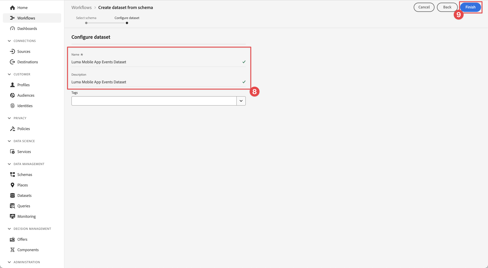
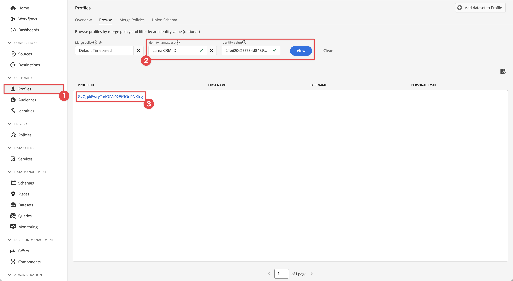

# Envoi de données à Experience Platform

Découvrez comment envoyer des données d’application mobile à Adobe Experience Platform.

Cette leçon facultative est pertinente pour tous les clients et clientes de Real-Time Customer Data Platform (Real-Time CDP), Journey Optimizer et Customer Journey Analytics. Experience Platform, la base des produits Experience Cloud, est un système ouvert qui transforme toutes vos données (Adobe et hors Adobe) en profils clients fiables. Ces profils client sont mis à jour en temps réel et utilisent des informations basées sur l’IA pour vous aider à offrir les expériences adéquates sur chaque canal.

Les données [événement](events.md), [cycle de vie](lifecycle-data.md) et [identité](identity.md) que vous avez collectées et envoyées à Platform Edge Network dans des leçons précédentes sont transférées vers les services configurés dans votre flux de données, y compris Adobe Experience Platform.

{zoomable="yes"}

## Conditions préalables

Votre organisation doit être configurée et des autorisations accordées pour Adobe Experience Platform.

Si vous n’y avez pas accès, vous pouvez [ignorer cette leçon](install-sdks.md).

## Objectifs d’apprentissage

Dans cette leçon, vous allez :

* Créez un jeu de données Experience Platform.
* Configurez votre flux de données pour transférer des données vers Experience Platform.
* Validez les données dans le jeu de données.
* Activez votre schéma et votre jeu de données pour le profil client en temps réel.
* Validez les données dans le profil client en temps réel.
* Validez les données dans le graphique d’identité.

## Créer un jeu de données

Toutes les données correctement ingérées par Adobe Experience Platform sont conservées sous forme de jeux de données dans le lac de données. Un jeu de données est une structure de stockage et de gestion pour une collecte de données (généralement sous la forme d’un tableau) qui contient un schéma (des colonnes) et des champs (des lignes). Les jeux de données contiennent également des métadonnées qui décrivent divers aspects des données stockées. Pour plus d’informations, consultez la [documentation](https://experienceleague.adobe.com/fr/docs/experience-platform/catalog/datasets/overview).

1. Accédez à l’interface utilisateur d’Experience Platform. Sélectionnez **[!UICONTROL Experience Platform]** dans le menu Applications  en haut à droite.

1. Sélectionnez **[!UICONTROL Jeux de données]** dans le menu de navigation de gauche.

1. Sélectionnez  **[!UICONTROL Créer un jeu de données]**.

1. Sélectionnez **[!UICONTROL Créer un jeu de données à partir d&#39;un schéma]**.
   {zoomable="yes"}

1. Recherchez votre schéma. par exemple, en utilisant `Luma Mobile` dans le champ de recherche.
1. Sélectionnez votre schéma, par exemple **[!DNL Luma Mobile App Event Schema]**.

1. Sélectionnez **[!UICONTROL Suivant]**.
   {zoomable="yes"}

1. Fournissez un **[!UICONTROL Nom]**, par exemple `Luma Mobile App Events Dataset` et un **[!UICONTROL Description]**.

1. Sélectionnez **[!UICONTROL Terminer]**.
   {zoomable="yes"}

## Ajouter un service de flux de données Adobe Experience Platform

Pour envoyer vos données XDM d’Edge Network vers Adobe Experience Platform, ajoutez le service Adobe Experience Platform au flux de données que vous avez configuré dans le cadre de l’étape [Créer un flux de données](create-datastream.md).

>[!IMPORTANT]
>
>Vous ne pouvez activer le service Adobe Experience Platform que lorsque vous avez créé un jeu de données d’événement.

1. Dans l’interface utilisateur de collecte de données, sélectionnez **[!UICONTROL Flux de données]** et votre flux de données.

1. Sélectionnez ensuite  **[!UICONTROL Ajouter un service]**.

1. Sélectionnez **[!UICONTROL Adobe Experience Platform]** dans la liste [!UICONTROL Service].

1. Activez le service en activant **[!UICONTROL Activé]**.

1. Sélectionnez le **[!UICONTROL Jeu de données d’événement]** que vous avez créé précédemment , par exemple **[!DNL Luma Mobile App Event Dataset]**.

1. Sélectionnez **[!UICONTROL Enregistrer]**.

   {zoomable="yes"}
1. La configuration finale doit ressembler à ceci.

   {zoomable="yes"}

## Valider des données dans le jeu de données

Maintenant que vous avez créé un jeu de données et mis à jour votre flux de données pour envoyer des données à Experience Platform, toutes les données XDM envoyées à Platform Edge Network sont transférées à Platform et entrent dans le jeu de données.

Ouvrez l’application et accédez aux écrans où vous effectuez le suivi des événements. Vous pouvez également déclencher des mesures de cycle de vie.

Ouvrez votre jeu de données dans l’interface de Platform. Vous devriez voir les données arrivant par lots au jeu de données. Les données arrivent généralement par microlots toutes les 15 minutes, de sorte que vous pouvez ne pas voir vos données immédiatement.

{zoomable="yes"}

Vous devriez également voir des exemples d’enregistrements et de champs utilisant la fonctionnalité **[!UICONTROL Aperçu du jeu de données]** :
{zoomable="yes"}

Le [service de requête](https://experienceleague.adobe.com/fr/docs/platform-learn/tutorials/queries/explore-data) de Platform est un outil plus robuste pour valider les données.

## Activer le profil client en temps réel

Le profil client en temps réel d’Experience Platform vous permet de créer une vue d’ensemble de chaque client qui combine des données issues de plusieurs canaux, notamment des données en ligne, hors ligne, CRM et tierces. Le profil vous permet de consolider vos diverses données client en une vue unifiée offrant un compte horodaté et exploitable de chaque interaction client.

### Activer le schéma

1. Ouvrez votre schéma, par exemple **[!DNL Luma Mobile App Event Schema]**.
1. Activez **[!UICONTROL Profil]**.
1. Sélectionnez **[!UICONTROL Les données de ce schéma contiennent une identité principale dans le champ identityMap .]** dans la boîte de dialogue.
1. **[!UICONTROL Enregistrez]** le schéma.

   {zoomable="yes"}

### Activer le jeu de données

1. Ouvrez votre jeu de données, par exemple **[!DNL Luma Mobile App Event Dataset]**.
1. Activez **[!UICONTROL Profil]**.

   {zoomable="yes"}

### Validation des données dans le profil

Ouvrez l’application et accédez aux écrans où vous effectuez le suivi des événements, par exemple : connectez-vous à l’application Luma et effectuez un achat.

Utilisez Assurance pour rechercher l’une des identités transmises dans identityMap (Email, lumaCrmId ou ECID), par exemple l’identifiant CRM.

{zoomable="yes"}

Dans l’interface de Platform,

1. Accédez à **[!UICONTROL Profils]**, puis sélectionnez **[!UICONTROL Parcourir]** dans la barre supérieure.
1. Spécifiez les détails de l’identité que vous venez d’acquérir, par exemple `Luma CRM ID` pour **[!UICONTROL Espace de noms d’identité]** et la valeur que vous avez copiée pour **[!UICONTROL Valeur d’identité]**. Sélectionnez ensuite **[!UICONTROL Afficher]**.
1. Pour afficher les détails, sélectionnez le profil.

{zoomable="yes"}

Sur l’écran **[!UICONTROL Détail]**, vous pouvez voir des informations de base sur l’utilisateur, y compris les **[!UICONTROL **&#x200B; identités liées &#x200B;**]** :
{zoomable="yes"}

Sur le **[!UICONTROL Événements]**, vous pouvez voir les événements collectés à partir de l’implémentation de votre application mobile pour cet utilisateur :

{zoomable="yes"}

Dans l’écran des détails du profil :

1. Pour afficher le graphique d’identités, cliquez sur le lien ou accédez à **[!UICONTROL Identités]**, puis sélectionnez **[!UICONTROL Graphique d’identités]** dans la barre supérieure.
1. Pour rechercher la valeur d’identité, spécifiez `Luma CRM ID` comme **[!UICONTROL Espace de noms d’identité]** et la valeur copiée comme **[!UICONTROL Valeur d’identité]**. Sélectionnez ensuite **[!UICONTROL Afficher]**.

   Cette visualisation vous montre les identités qui sont liées entre elles dans un profil et leur origine. Voici un exemple de graphique d’identités construit à partir des données collectées lors de la réalisation de ce tutoriel Mobile SDK (Data Source 2) et du tutoriel [Web SDK](https://experienceleague.adobe.com/fr/docs/platform-learn/implement-web-sdk/overview) (Data Source 1) :

   {zoomable="yes"}

## Étapes suivantes

Les spécialistes du marketing et de l’analyse peuvent faire beaucoup plus avec les données capturées dans Experience Platform, notamment les analyser dans Customer Journey Analytics et créer des segments dans Real-Time Customer Data Platform. Vous avez pris un bon départ !

>[!SUCCESS]
>
>Vous avez maintenant configuré votre application pour envoyer des données non seulement à Edge Network, mais également à Adobe Experience Platform. Merci d’avoir consacré votre temps à découvrir Adobe Experience Platform Mobile SDK. Si vous avez des questions, souhaitez partager des commentaires généraux ou des suggestions sur le contenu futur, partagez-les dans ce [article de discussion de la communauté Experience League](https://experienceleaguecommunities.adobe.com/t5/adobe-experience-platform-data/tutorial-discussion-implement-adobe-experience-cloud-in-mobile/td-p/443796?profile.language=fr).
>

Suivant : **[Créer et envoyer des notifications push](journey-optimizer-push.md)**
