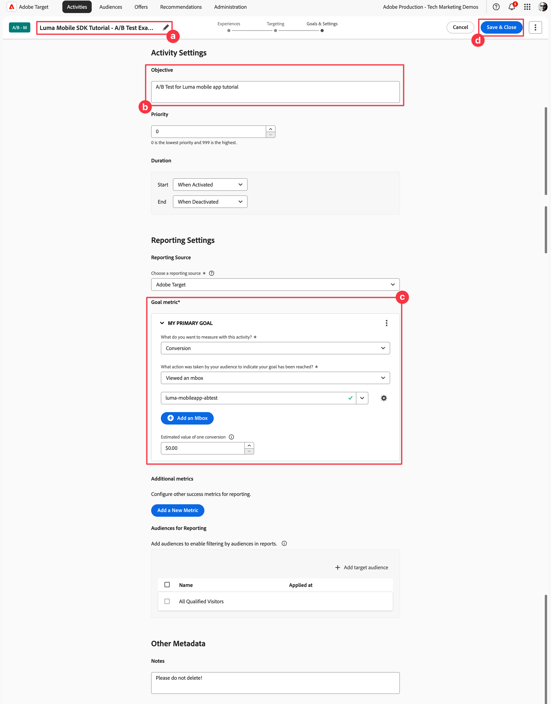

# Optimisation et personnalisation avec Adobe Target

Découvrez comment optimiser et personnaliser les expériences dans vos applications mobiles avec le SDK Mobile Platform et Adobe Target.

Target fournit tout ce dont vous avez besoin pour personnaliser les expériences de vos clients. Target vous aide à optimiser les recettes de vos sites web et mobiles, de vos applications, de vos médias sociaux et d’autres canaux numériques. Target peut effectuer des tests A/B, des tests multivariés, recommander des produits et du contenu, cibler du contenu, personnaliser automatiquement le contenu à l’aide de l’IA, etc. Cette leçon porte principalement sur la fonctionnalité de test A/B de Target. Voir [Présentation des tests A/B](https://experienceleague.adobe.com/docs/target/using/activities/abtest/test-ab.html?lang=en) pour plus d’informations.


Avant de pouvoir effectuer des tests A/B avec Target, vous devez vous assurer que les configurations et intégrations appropriées sont en place.

>[!NOTE]
>
>Cette leçon est facultative et s’applique uniquement aux utilisateurs d’Adobe Target qui souhaitent effectuer des tests A/B.


## Conditions préalables

* Création et exécution de l’application avec les SDK installés et configurés.
* Accès à Adobe Target avec des autorisations, des rôles, des espaces de travail et des propriétés correctement configurés, comme décrit [here](https://experienceleague.adobe.com/docs/target/using/administer/manage-users/enterprise/property-channel.html?lang=fr).


## Objectifs d&#39;apprentissage

Dans cette leçon, vous allez :

* Mettez à jour votre flux de données pour l’intégration de Target.
* Mettez à jour votre propriété de balise avec l’extension Journey Optimizer - Decisioning.
* Mettez à jour votre schéma pour capturer les événements de proposition.
* Validez la configuration dans Assurance.
* Créez un test A/B simple dans Target.
* Mettez à jour votre application pour enregistrer l’extension Optimizer.
* Mettez en oeuvre le test A/B dans votre application.
* Validez l’implémentation dans Assurance.


## Configuration

>[!TIP]
>
>Si vous avez déjà configuré votre application dans le cadre du [Offres Journey Optimizer](journey-optimizer-offers.md) leçon : vous avez peut-être déjà effectué certaines des étapes de cette section de configuration.

### Mise à jour de la configuration des flux de données

#### Adobe Target

Pour vous assurer que les données envoyées de votre application mobile à Experience Platform Edge Network sont transférées vers Adobe Target, vous devez mettre à jour la configuration de la banque de données.

1. Dans l’interface utilisateur de la collecte de données, sélectionnez **[!UICONTROL Datastreams]**, puis sélectionnez votre flux de données, par exemple **[!DNL Luma Mobile App]**.
1. Sélectionner **[!UICONTROL Ajouter un service]** et sélectionnez **[!UICONTROL Adobe Target]** de la **[!UICONTROL Service]** liste.
1. Si vous êtes client Target Premium et souhaitez utiliser des jetons de propriété, saisissez la variable **[!UICONTROL Jeton de propriété]** que vous souhaitez utiliser pour cette intégration. Les utilisateurs de Target Standard peuvent ignorer cette étape.

   Vous trouverez vos propriétés dans l’interface utilisateur de Target, dans **[!UICONTROL Administration]** > **[!UICONTROL Propriétés]**. Sélectionner  pour afficher le jeton de propriété de la propriété que vous souhaitez utiliser. Le jeton de propriété a un format semblable à `"at_property": "xxxxxxxx-xxxx-xxxxx-xxxx-xxxxxxxxxxxx"`; vous ne devez saisir que la valeur `xxxxxxxx-xxxx-xxxxx-xxxx-xxxxxxxxxxxx`.

   Vous pouvez éventuellement spécifier un ID d’environnement cible. Target utilise des environnements pour organiser vos sites et environnements de préproduction afin de faciliter la gestion et la création de rapports. Les environnements prédéfinis incluent Production, Test et Développement. Voir [Environnements](https://experienceleague.adobe.com/docs/target/using/administer/environments.html?lang=en) et [Identifiant d’environnement de Target](https://experienceleague.adobe.com/docs/platform-learn/implement-web-sdk/applications-setup/setup-target.html?lang=en#target-environment-id) pour plus d’informations.

   Vous pouvez éventuellement spécifier un espace de noms d’identifiant tiers Target pour prendre en charge la synchronisation des profils sur un espace de noms d’identité (par exemple, un identifiant CRM). Voir [Espace de noms d’ID tiers de Target](https://experienceleague.adobe.com/docs/platform-learn/implement-web-sdk/applications-setup/setup-target.html?lang=en#target-third-party-id-namespace) pour plus d’informations.

1. Sélectionnez **[!UICONTROL Enregistrer]**.

   


#### Adobe Journey Optimizer

Pour vous assurer que les données envoyées de votre application mobile au réseau Edge sont transférées vers Journey Optimizer - Gestion des décisions, mettez à jour votre configuration de flux de données.

1. Dans l’interface utilisateur de la collecte de données, sélectionnez **[!UICONTROL Datastreams]**, puis sélectionnez votre flux de données, par exemple **[!DNL Luma Mobile App]**.
1. Sélectionner  pour **[!UICONTROL Experience Platform]** et sélectionnez  **[!UICONTROL Modifier]** dans le menu contextuel.
1. Dans le **[!UICONTROL Datastreams]** >  >  **[!UICONTROL Adobe Experience Platform]** Vérifiez que la variable **[!UICONTROL Offer decisioning]**, **[!UICONTROL Segmentation Edge]**, et **[!UICONTROL Destinations de personnalisation]** sont sélectionnées. Si vous suivez également les leçons Journey Optimizer, vous pouvez sélectionner **[!UICONTROL Adobe Journey Optimizer]**. Voir [Paramètres Adobe Experience Platform](https://experienceleague.adobe.com/docs/experience-platform/datastreams/configure.html?lang=en#aep) pour plus d’informations.
1. Pour enregistrer votre configuration de flux de données, sélectionnez **[!UICONTROL Enregistrer]** .

   


### Installer Adobe Journey Optimizer - Extension des balises de prise de décision

1. Accédez à **[!UICONTROL Balises]**, recherchez la propriété de balise mobile, puis ouvrez la propriété .
1. Sélectionner **[!UICONTROL Extensions]**.
1. Sélectionner **[!UICONTROL Catalogue]**.
1. Recherchez le **[!UICONTROL Adobe Journey Optimizer - Prise de décision]** extension .
1. Installation l’extension. L’extension ne nécessite pas de configuration supplémentaire.

   


### Mettre à jour votre schéma

1. Accédez à l’interface de collecte de données et sélectionnez **[!UICONTROL Schémas]** dans le rail de gauche.
1. Sélectionner **[!UICONTROL Parcourir]** dans la barre supérieure.
1. Sélectionnez votre schéma pour l’ouvrir.
1. Dans l’éditeur de schéma, sélectionnez  **[!UICONTROL Ajouter]** en regard de **[!UICONTROL Groupes de champs]**.
1. Dans le **[!UICONTROL Ajouter des groupes de champs]** boîte de dialogue, recherche `proposition`, sélectionnez **[!UICONTROL Événement d’expérience - Interactions de propositions]** et sélectionnez **[!UICONTROL Ajouter des groupes de champs]**.
   
1. Pour enregistrer les modifications apportées à votre schéma, sélectionnez **[!UICONTROL Enregistrer]**.


### Validation de la configuration dans Assurance

Pour valider votre configuration dans Assurance :

1. Accédez à l’interface utilisateur d’assurance.
1. Sélectionner **[!UICONTROL Configurer]** dans le rail de gauche et sélectionnez  en regard de **[!UICONTROL Validation de la configuration]** underneath **[!UICONTROL PRISE DE DÉCISION ADOBE JOURNEY OPTIMIZER]**.
1. Sélectionnez **[!UICONTROL Enregistrer]**.
1. Sélectionner **[!UICONTROL Validation de la configuration]** dans le rail de gauche. La configuration du flux de données est validée et celle du SDK dans votre application.
   

## Création d’un test A/B

Il existe de nombreux types d’activités que vous pouvez créer dans Adobe Target et mettre en oeuvre dans une application mobile, comme indiqué dans l’introduction. Pour cette leçon, vous allez mettre en oeuvre un test A/B.

1. Dans l’interface utilisateur de Target, sélectionnez **[!UICONTROL Activités]** dans la barre supérieure.
1. Sélectionner **[!UICONTROL Créer une activité]** et **[!UICONTROL Test A/B]** dans le menu contextuel.
1. Dans le **[!UICONTROL Créer une activité de test A/B]** boîte de dialogue, sélectionnez **[!UICONTROL Mobile]** comme la propriété **[!UICONTROL Type]**, sélectionnez un espace de travail dans la **[!UICONTROL Choisir Workspace]** et sélectionnez votre propriété dans la liste **[!UICONTROL Choisir la propriété]** répertorie si vous êtes un client Target Premium et que vous avez spécifié un jeton de propriété dans le flux de données.
1. Sélectionnez **[!UICONTROL Créer]**.
   

1. Dans le **[!UICONTROL Activité sans titre]** , au niveau de l’écran **[!UICONTROL Expériences]** étape :

   1. Entrée `luma-mobileapp-abtest` in **[!UICONTROL Sélectionner un emplacement]** underneath **[!UICONTROL EMPLACEMENT 1]**. Ce nom d’emplacement (souvent appelé mbox) est utilisé ultérieurement dans la mise en oeuvre de l’application.
   1. Sélectionner  en regard de **[!UICONTROL Contenu par défaut]** et sélectionnez **[!UICONTROL Création d’une offre JSON]** dans le menu contextuel.
   1. Copiez le fichier JSON suivant dans **[!UICONTROL Saisie d’un objet JSON valide]**.

      ```json
      { 
          "title": "Luma Anaolog Watch",
          "text": "Designed to stand up to your active lifestyle, this women's Luma Analog Watch features a tasteful brushed chrome finish and a stainless steel, water-resistant construction for lasting durability.", 
          "image": "https://luma.enablementadobe.com/content/dam/luma/en/products/gear/watches/Luma_Analog_Watch.jpg" 
      }
      ```

   1. Sélectionner **[!UICONTROL + Ajouter une expérience]**.

      

   1. Répétez les étapes b et c pour l’expérience B, mais utilisez plutôt le fichier JSON suivant :

      ```json
      { 
          "title": "Aim Analog Watch",
          "text": "The flexible, rubberized strap is contoured to conform to the shape of your wrist for a comfortable all-day fit. The face features three illuminated hands, a digital read-out of the current time, and stopwatch functions.", 
          "image": "https://luma.enablementadobe.com/content/dam/luma/en/products/gear/watches/Aim_Watch.jpg" 
      }
      ```

   1. Sélectionnez **[!UICONTROL Suivant]**.

      

1. Dans le **[!DNL Targeting]** passez en revue la configuration de votre test A/B. Par défaut, les deux offres sont réparties de manière égale entre tous les visiteurs. Sélectionnez **[!UICONTROL Suivant]** pour continuer.

   

1. Dans le **[!UICONTROL Objectifs et paramètres]** étape :

   1. Renommez votre activité sans titre, par exemple en `Luma Mobile SDK Tutorial - A/B Test Example`.
   1. Saisissez un **[!UICONTROL Objectif]** pour votre test A/B, par exemple `A/B Test for Luma mobile app tutorial`.
   1. Sélectionner **[!UICONTROL Conversion]**, **[!UICONTROL Affichage d’une mbox]** dans le **[!UICONTROL Mesure de l’objectif]** > **[!UICONTROL MON OBJECTIF DE PRINCIPAL]** et saisissez votre nom d’emplacement (mbox, par exemple). `luma-mobileapp-abtest`.
   1. Sélectionnez **[!UICONTROL Enregistrer et fermer]**.

      

1. De retour dans le **[!UICONTROL Toutes les activités]** écran :

   1. Sélectionner  dans votre activité.
   1. Sélectionner  **[!UICONTROL Activer]** pour activer votre test A/B.

   


## Implémentation de Target dans votre application

Comme indiqué dans les leçons précédentes, l’installation d’une extension de balise mobile fournit uniquement la configuration. Vous devez ensuite installer et enregistrer le SDK Optimiser. Si ces étapes ne sont pas claires, passez en revue la [Installation des SDK](install-sdks.md) .

>[!NOTE]
>
>Si vous avez terminé la [Installation des SDK](install-sdks.md) , le SDK est déjà installé et vous pouvez ignorer cette étape.
>

1. Dans Xcode, assurez-vous que [Optimisation AEP](https://github.com/adobe/aepsdk-messaging-ios) est ajouté à la liste des modules dans les dépendances de modules. Voir [Swift Package Manager](install-sdks.md#swift-package-manager).
1. Accédez à **[!DNL Luma]** > **[!DNL Luma]** > **[!DNL AppDelegate]** dans le navigateur de projet Xcode.
1. Assurez-vous que `AEPOptimize` fait partie de votre liste d’importations.

   `import AEPOptimize`

1. Assurez-vous que `Optimize.self` fait partie du tableau des extensions que vous enregistrez.

   ```swift
   let extensions = [
       AEPIdentity.Identity.self,
       Lifecycle.self,
       Signal.self,
       Edge.self,
       AEPEdgeIdentity.Identity.self,
       Consent.self,
       UserProfile.self,
       Places.self,
       Messaging.self,
       Optimize.self,
       Assurance.self
   ]
   ```

1. Accédez à **[!DNL Luma]** > **[!DNL Luma]** > **[!DNL Utils]** > **[!DNL MobileSDK]** dans le navigateur de projet Xcode. Recherchez le ` func updatePropositionAT(ecid: String, location: String) async` de la fonction Ajoutez le code suivant :

   ```swift
   // set up the XDM dictionary, define decision scope and call update proposition API
   Task {
       let ecid = ["ECID" : ["id" : ecid, "primary" : true] as [String : Any]]
       let identityMap = ["identityMap" : ecid]
       let xdmData = ["xdm" : identityMap]
       let decisionScope = DecisionScope(name: location)
       Optimize.clearCachedPropositions()
       Optimize.updatePropositions(for: [decisionScope], withXdm: xdmData)
   }
   ```

   Cette fonction :

   * Configuration d’un dictionnaire XDM `xdmData`, contenant l’ECID pour identifier le profil pour lequel vous devez présenter le test A/B, et
   * définit une `decisionScope`, un tableau d’emplacements sur lequel présenter le test A/B.

   La fonction appelle ensuite deux API : [`Optimize.clearCachedPropositions`](https://developer.adobe.com/client-sdks/documentation/adobe-journey-optimizer-decisioning/api-reference/#clearpropositions) et [`Optimize.updatePropositions`](https://developer.adobe.com/client-sdks/documentation/adobe-journey-optimizer-decisioning/api-reference/#updatepropositions). Ces fonctions effacent toutes les propositions mises en cache et mettent à jour les propositions de ce profil. Dans ce contexte, une proposition est l’expérience (offre) sélectionnée dans l’activité Target (votre test A/B) et que vous avez définie dans [Création d’un test A/B](#create-an-ab-test).

1. Accédez à **[!DNL Luma]** > **[!DNL Luma]** > **[!DNL Views]** > **[!DNL Personalization]** > **[!DNL TargetOffersView]** dans le navigateur de projet Xcode. Recherchez le `func onPropositionsUpdateAT(location: String) async {` et examinez le code de cette fonction. La partie la plus importante de cette fonction est la fonction  [`Optimize.onPropositionsUpdate`](https://developer.adobe.com/client-sdks/documentation/adobe-journey-optimizer-decisioning/api-reference/#onpropositionsupdate) appel API, qui :
   * récupère les propositions du profil actuel en fonction de la portée de la décision (qui est l’emplacement que vous avez défini dans le test A/B),
   * récupère l&#39;offre à partir de la proposition,
   * libère le contenu de l’offre afin qu’elle puisse s’afficher correctement dans l’application ; et
   * déclenche la variable `displayed()` action sur l’offre qui renvoie un événement à Platform Edge Network informant que l’offre s’affiche.

1. Toujours dans **[!DNL TargetOffersView]**, ajoutez le code suivant au `.onFirstAppear` modifier. Ce code garantit que le rappel pour la mise à jour des offres n’est enregistré qu’une seule fois.

   ```swift
   // Invoke callback for offer updates
   Task {
       await self.onPropositionsUpdateAT(location: location)
   }
   ```

1. Toujours dans **[!DNL TargetOffersView]**, ajoutez le code suivant au `.task` modifier. Ce code met à jour les offres lorsque la vue est actualisée.

   ```swift
   // Clear and update offers
   await self.updatePropositionsAT(ecid: currentEcid, location: location)
   ```

Vous pouvez envoyer des paramètres Target supplémentaires (comme des paramètres de mbox, de profil, de produit ou de commande) dans une requête de personnalisation au réseau Experience Edge, en les ajoutant dans un dictionnaire de données lors de l’appel de la fonction [`Optimize.updatePropositions`](https://developer.adobe.com/client-sdks/documentation/adobe-journey-optimizer-decisioning/api-reference/#updatepropositions) API. Voir pour plus d’informations [Paramètres Target](https://developer.adobe.com/client-sdks/documentation/adobe-journey-optimizer-decisioning/#target-parameters).


## Validation à l’aide de l’application

1. Recréez et exécutez l’application dans le simulateur ou sur un appareil physique à partir de Xcode, en utilisant .

1. Accédez au **[!UICONTROL Personnalisation]** .

1. Faites défiler l’écran jusqu’en bas pour voir l’une des deux offres que vous avez définies dans votre test A/B affichée dans la **[!UICONTROL TARGET]** mosaïque.

   


## Validation de la mise en oeuvre dans Assurance

Pour valider le test A/B dans Assurance :

1. Consultez la section [instructions de configuration](assurance.md#connecting-to-a-session) pour connecter le simulateur ou l’appareil à Assurance.
1. Sélectionner **[!UICONTROL Configurer]** dans le rail de gauche et sélectionnez  en regard de **[!UICONTROL Révision et simulation]** underneath **[!UICONTROL PRISE DE DÉCISION ADOBE JOURNEY OPTIMIZER]**.
1. Sélectionnez **[!UICONTROL Enregistrer]**.
1. Sélectionner **[!UICONTROL Révision et simulation]** dans le rail de gauche. La configuration du flux de données est validée et celle du SDK dans votre application.
1. Sélectionner **[!UICONTROL Demandes]** dans la barre supérieure. Vous voyez votre **[!DNL Target]** requêtes.
   

1. Vous pouvez explorer **[!UICONTROL Simuler]** et **[!UICONTROL Liste des événements]** onglets pour d’autres fonctionnalités vérifiant votre configuration pour les offres Target.

## Étapes suivantes

Vous devez maintenant disposer de tous les outils pour commencer à ajouter d’autres tests A/B ou d’autres activités Target (comme le ciblage d’expérience, le test multivarié), le cas échéant, à votre application. Des informations plus détaillées sont disponibles dans la section [Référentiel GitHub pour l’extension Optimiser](https://github.com/adobe/aepsdk-optimize-ios) où vous pouvez également trouver un lien vers un [tutoriel](https://opensource.adobe.com/aepsdk-optimize-ios/#/tutorials/README) sur le suivi des offres Adobe Target.

>[!SUCCESS]
>
>Vous avez activé l’application pour les tests A/B et affiché les résultats d’un test A/B avec Adobe Target et l’extension Adobe Journey Optimizer - Prise de décision pour le SDK Mobile Adobe Experience Platform.
>
>Merci d’investir votre temps à apprendre sur le SDK Adobe Experience Platform Mobile. Si vous avez des questions, souhaitez partager des commentaires généraux ou avez des suggestions sur le contenu futur, partagez-les à ce sujet. [Article de discussion de la communauté Experience League](https://experienceleaguecommunities.adobe.com/t5/adobe-experience-platform-data/tutorial-discussion-implement-adobe-experience-cloud-in-mobile/td-p/443796).

Suivant : **[Conclusion et prochaines étapes](conclusion.md)**
