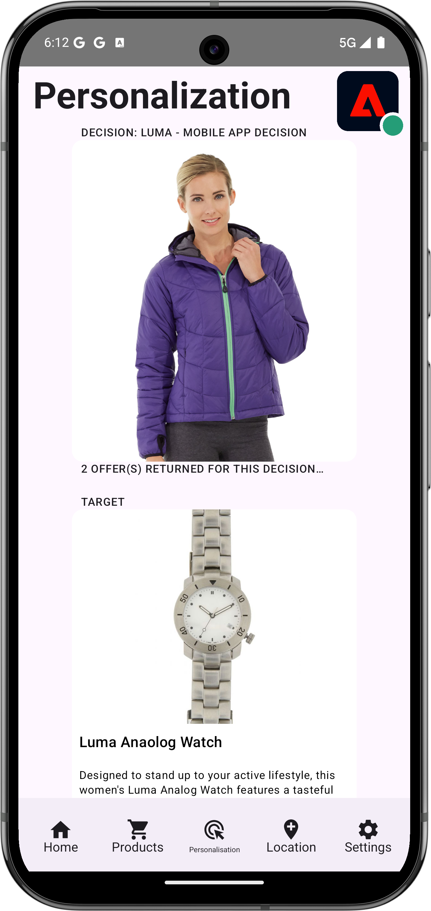
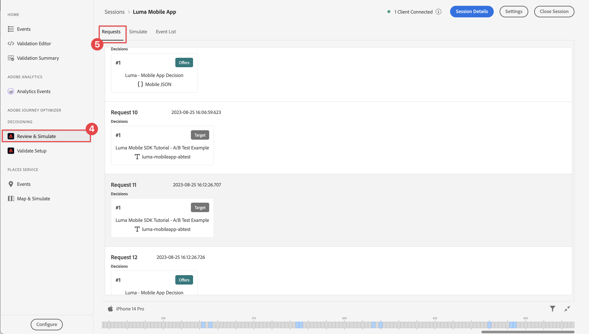

# Optimisation et personnalisation avec Adobe Target

Découvrez comment optimiser et personnaliser les expériences de vos applications mobiles avec Platform Mobile SDK et Adobe Target.

Target fournit tout ce dont vous avez besoin pour personnaliser les expériences de vos clients. Target vous aide à maximiser les recettes de vos sites web et mobiles, de vos applications, de vos médias sociaux et de vos autres canaux numériques. Target peut effectuer des tests A/B, multivarier des tests, recommander des produits et du contenu, cibler du contenu, personnaliser automatiquement le contenu avec l’IA, etc. Cette leçon se concentre sur la fonctionnalité de test A/B de Target. [&#x200B; Pour plus d’informations](https://experienceleague.adobe.com/fr/docs/target/using/activities/abtest/test-ab) consultez la présentation du test A/B .

{zoomable="yes"}

Avant d’effectuer des tests A/B avec Target, vous devez vous assurer que les configurations et intégrations appropriées sont en place.

>[!NOTE]
>
>Cette leçon est facultative et s’applique uniquement aux utilisateurs d’Adobe Target qui souhaitent effectuer des tests A/B.


## Conditions préalables

* Application créée et exécutée avec succès avec les SDK installés et configurés.
* Accès à Adobe Target avec des [autorisations, rôles, espaces de travail et propriétés correctement configurés](https://experienceleague.adobe.com/fr/docs/target/using/administer/manage-users/enterprise/property-channel).


## Objectifs d’apprentissage

Dans cette leçon, vous allez :

* Mettez à jour votre flux de données pour l’intégration de Target.
* Mettez à jour la propriété de balise avec l’extension Offer Decisioning et Target.
* Mettez à jour votre schéma pour capturer les événements de proposition.
* Validez la configuration dans Assurance.
* Créez un test A/B simple dans Target.
* Mettez à jour votre application pour enregistrer l’extension Optimizer.
* Implémentez le test A/B dans votre application.
* Validez la mise en œuvre dans Assurance.


## Configuration

>[!TIP]
>
>Si vous avez déjà configuré votre application dans le cadre de la leçon [Offres Journey Optimizer](journey-optimizer-offers.md), vous avez peut-être déjà effectué certaines des étapes de cette section de configuration.

### Mettre à jour la configuration du flux de données

#### Adobe Target

Pour que les données envoyées de votre application mobile à Experience Platform Edge Network soient transférées vers Adobe Target, vous devez mettre à jour la configuration de votre flux de données.

1. Dans l’interface utilisateur de collecte de données, sélectionnez **[!UICONTROL Flux de données]**, puis sélectionnez votre flux de données, par exemple **[!DNL Luma Mobile App]**.
1. Sélectionnez **[!UICONTROL Ajouter un service]** puis **[!UICONTROL Adobe Target]** dans la liste **[!UICONTROL Service]**.
1. Si vous êtes un client Target Premium et souhaitez utiliser des jetons de propriété, saisissez la valeur Target **[!UICONTROL Jeton de propriété]** que vous souhaitez utiliser pour cette intégration. Les utilisateurs de Target Standard peuvent ignorer cette étape.

   Vos propriétés se trouvent dans l’interface utilisateur de Target, dans **[!UICONTROL Administration]** > **[!UICONTROL Propriétés]**. Sélectionnez  pour afficher le jeton de propriété de la propriété que vous souhaitez utiliser. Le format du jeton de propriété est du type `"at_property": "xxxxxxxx-xxxx-xxxxx-xxxx-xxxxxxxxxxxx"` ; vous ne devez entrer que la valeur `xxxxxxxx-xxxx-xxxxx-xxxx-xxxxxxxxxxxx`.

   Vous pouvez éventuellement spécifier un identifiant d’environnement cible. Target utilise des environnements pour organiser vos sites et environnements de pré-production afin de faciliter la gestion et la création de rapports séparée. Les environnements prédéfinis comprennent la production, l’évaluation et le développement. Voir [Environnements](https://experienceleague.adobe.com/fr/docs/target/using/administer/environments) et [Identifiant d’environnement Target](https://experienceleague.adobe.com/fr/docs/platform-learn/implement-web-sdk/applications-setup/setup-target) pour plus d’informations.

   Vous pouvez éventuellement spécifier un espace de noms d’identifiant tiers cible pour prendre en charge la synchronisation des profils sur un espace de noms d’identité (par exemple, l’identifiant CRM). Voir [Espace de noms d’identifiant tiers cible](https://experienceleague.adobe.com/fr/docs/platform-learn/implement-web-sdk/applications-setup/setup-target) pour plus d’informations.

1. Sélectionnez **[!UICONTROL Enregistrer]**.

   {zoomable="yes"}


#### Adobe Journey Optimizer

Pour vous assurer que les données envoyées de votre application mobile à Edge Network sont transférées vers Journey Optimizer - Gestion des décisions, mettez à jour la configuration de votre flux de données.

1. Dans l’interface utilisateur de collecte de données, sélectionnez **[!UICONTROL Flux de données]**, puis sélectionnez votre flux de données, par exemple **[!DNL Luma Mobile App]**.
1. Sélectionnez  pour **[!UICONTROL Experience Platform]** et sélectionnez  **[!UICONTROL Modifier]** dans le menu contextuel.
1. Dans l’écran **[!UICONTROL Flux de données]** >  > **[!UICONTROL Adobe Experience Platform]**, assurez-vous que les **[!UICONTROL destinations Offer Decisioning]**, **[!UICONTROL segmentation Edge]** et **[!UICONTROL Personalization]** sont sélectionnées. Si vous suivez également les leçons Journey Optimizer, sélectionnez **[!UICONTROL Adobe Journey Optimizer]**. Voir [Paramètres Adobe Experience Platform](https://experienceleague.adobe.com/fr/docs/experience-platform/datastreams/configure) pour plus d&#39;informations.
1. Pour enregistrer la configuration de votre flux de données, sélectionnez **[!UICONTROL Enregistrer]** .

   {zoomable="yes"}


### Installation de l’extension Offer Decisioning and Target tags

Bien que cette leçon porte sur les tests A/B dans Target, le résultat d’un test est considéré comme une offre et est implémenté dans l’infrastructure Adobe à l’aide de l’extension Adobe Offer Decisioning and Target tags. Cette extension gère les deux offres diffusées par Journey Optimizer et Target.

1. Accédez à **[!UICONTROL Balises]**, recherchez la propriété de balise mobile et ouvrez la propriété.
1. Sélectionnez **[!UICONTROL Extensions]**.
1. Sélectionnez **[!UICONTROL Catalogue]**.
1. Recherchez l’extension **[!UICONTROL Offer Decisioning et Target]**.
1. Installez l’extension . L’extension ne nécessite pas de configuration supplémentaire.

   {zoomable="yes"}


### Mise à jour du schéma

1. Accédez à l’interface de collecte de données et sélectionnez **[!UICONTROL Schémas]** dans le rail de gauche.
1. Sélectionnez **[!UICONTROL Parcourir]** dans la barre supérieure.
1. Sélectionnez votre schéma pour l’ouvrir.
1. Dans l’éditeur de schémas, sélectionnez  **[!UICONTROL Ajouter]** en regard de **[!UICONTROL Groupes de champs]**.
1. Dans la boîte de dialogue **[!UICONTROL Ajouter des groupes de champs]**, recherchez des `proposition`, sélectionnez **[!UICONTROL Événement d’expérience - Interactions de proposition]** et sélectionnez **[!UICONTROL Ajouter des groupes de champs]**.
   {zoomable="yes"}
1. Pour enregistrer les modifications apportées à votre schéma, sélectionnez **[!UICONTROL Enregistrer]**.


### Validation de la configuration dans Assurance

Pour valider votre configuration dans Assurance :

1. Accédez à l’interface utilisateur d’Assurance.
1. Sélectionnez **[!UICONTROL Configurer]** dans le rail de gauche et sélectionnez  en regard de **[!UICONTROL Valider la configuration]** sous **[!UICONTROL OFFER DECISIONING ET TARGET]**.
1. Sélectionnez **[!UICONTROL Enregistrer]**.
1. Sélectionnez **[!UICONTROL Valider la configuration]** dans le rail de gauche. La configuration des trains de données est validée, ainsi que la configuration SDK dans votre application.
   {zoomable="yes"}

## Création d’un test A/B

Il existe de nombreux types d’activités que vous pouvez créer dans Adobe Target et implémenter dans une application mobile, comme mentionné dans l’introduction. Pour cette leçon, vous allez mettre en œuvre un test A/B.

1. Dans l’interface utilisateur de Target, sélectionnez **[!UICONTROL Activités]** dans la barre supérieure.
1. Sélectionnez **[!UICONTROL Créer une activité]** et **[!UICONTROL Test A/B]** dans le menu contextuel.
1. Dans la boîte de dialogue **[!UICONTROL Créer une activité de test A/B]**, sélectionnez **[!UICONTROL Mobile]** comme **[!UICONTROL Type]**, puis sélectionnez un espace de travail dans la liste **[!UICONTROL Choisir Workspace]**. Sélectionnez votre propriété dans la liste **[!UICONTROL Choisir une propriété]** si vous êtes un client Target Premium et que vous avez spécifié un jeton de propriété dans le flux de données.
1. Sélectionnez **[!UICONTROL Créer]**.
   {zoomable="yes"}

1. Sur l’écran **[!UICONTROL Activité sans titre]**, à l’étape **[!UICONTROL Expériences]** :

   1. Saisissez `luma-mobileapp-abtest` dans **[!UICONTROL Sélectionner l’emplacement]** sous **[!UICONTROL Emplacement 1]**. Ce nom d’emplacement (souvent appelé mbox) est utilisé ultérieurement dans la mise en œuvre de l’application.
   1. Sélectionnez  en regard de **[!UICONTROL Contenu]** et sélectionnez **[!UICONTROL Créer une offre JSON]** dans le menu contextuel.
   1. Dans la boîte de dialogue **[!UICONTROL Créer une offre JSON]**, collez le code JSON suivant.

      ```json
      { 
          "title": "Luma Anaolog Watch",
          "text": "Designed to stand up to your active lifestyle, this women's Luma Analog Watch features a tasteful brushed chrome finish and a stainless steel, water-resistant construction for lasting durability.", 
          "image": "https://luma.enablementadobe.com/content/dam/luma/en/products/gear/watches/Luma_Analog_Watch.jpg" 
      }
      ```

      {zoomable="yes"}

      Sélectionnez **[!UICONTROL Créer]**.

   1. Sélectionnez **[!UICONTROL +]** en regard de **[!UICONTROL Expériences]** pour ajouter **[!UICONTROL Expérience B]**.


   1. Répétez les étapes b et c pour l’expérience B, mais utilisez plutôt `Aim Analog Watch` comme titre et collez le code JSON suivant :

      ```json
      { 
          "title": "Aim Analog Watch",
          "text": "The flexible, rubberized strap is contoured to conform to the shape of your wrist for a comfortable all-day fit. The face features three illuminated hands, a digital read-out of the current time, and stopwatch functions.", 
          "image": "https://luma.enablementadobe.com/content/dam/luma/en/products/gear/watches/Aim_Watch.jpg" 
      }
      ```


1. À l’étape **[!DNL Targeting]**, passez en revue la configuration de votre test A/B. Par défaut, les deux offres sont attribuées de manière égale à tous les visiteurs. Sélectionnez **[!UICONTROL Suivant]** pour continuer.

   {zoomable="yes"}

1. À l’étape **[!UICONTROL Objectifs et paramètres]** :

   1. Renommez votre activité sans titre, par exemple en `Luma Mobile SDK Tutorial - A/B Test Example`.
   1. Saisissez un **[!UICONTROL Objectif]** pour votre test A/B, par exemple `A/B Test for Luma mobile app tutorial`.
   1. Sélectionnez **[!UICONTROL Conversion]**, **[!UICONTROL Affichage d’une mbox]** dans la mosaïque **[!UICONTROL Mesure de l’objectif]** > **[!UICONTROL MON OBJECTIF de PRINCIPAL]** et saisissez le nom de votre emplacement (mbox), par exemple `luma-mobileapp-abtest`.
   1. Sélectionnez **[!UICONTROL Enregistrer et fermer]**.

      {zoomable="yes"}

1. De retour dans l’écran **[!UICONTROL Toutes les activités]** :

   1. Sélectionnez  à votre activité.
   1. Sélectionnez  **[!UICONTROL Activer]** pour activer votre test A/B.

   {zoomable="yes"}


## Implémentation de Target dans l’application

Comme nous l’avons vu dans les leçons précédentes, l’installation d’une extension de balise mobile fournit uniquement la configuration . Vous devez ensuite installer et enregistrer le SDK d’optimisation. Si ces étapes ne sont pas claires, consultez la section [Installation des SDK](install-sdks.md).

>[!NOTE]
>
>Si vous avez terminé la section [Installation des SDK](install-sdks.md), le SDK est déjà installé et vous pouvez ignorer cette étape.
>

>[!BEGINTABS]

>[!TAB iOS]

1. Dans Xcode, assurez-vous que [AEP Optimize](https://github.com/adobe/aepsdk-messaging-ios) est ajouté à la liste des packages dans les dépendances de packages. Voir [Gestionnaire de packages Swift](install-sdks.md#swift-package-manager).
1. Accédez à **[!DNL Luma]** > **[!DNL Luma]** > **[!DNL AppDelegate]** dans le navigateur de projet Xcode.
1. Assurez-vous que `AEPOptimize` fait partie de votre liste d’importations.

   `import AEPOptimize`

1. Assurez-vous que `Optimize.self` fait partie du tableau d’extensions que vous enregistrez.

   ```swift
   let extensions = [
       AEPIdentity.Identity.self,
       Lifecycle.self,
       Signal.self,
       Edge.self,
       AEPEdgeIdentity.Identity.self,
       Consent.self,
       UserProfile.self,
       Places.self,
       Messaging.self,
       Optimize.self,
       Assurance.self
   ]
   ```

1. Accédez à **[!DNL Luma]** > **[!DNL Luma]** > **[!DNL Utils]** > **[!DNL MobileSDK]** dans le navigateur de projet Xcode. Recherchez la fonction ` func updatePropositionAT(ecid: String, location: String) async`. Ajoutez le code suivant :

   ```swift
   // set up the XDM dictionary, define decision scope and call update proposition API
   Task {
       let ecid = ["ECID" : ["id" : ecid, "primary" : true] as [String : Any]]
       let identityMap = ["identityMap" : ecid]
       let xdmData = ["xdm" : identityMap]
       let decisionScope = DecisionScope(name: location)
       Optimize.clearCachedPropositions()
       Optimize.updatePropositions(for: [decisionScope], withXdm: xdmData) { data, error in
           if let error = error {
               Logger.aepMobileSDK.error("MobileSDK - updatePropositionsAT: Error updating propositions: \(error.localizedDescription)")
           }
       }
   }
   ```

   Cette fonction :

   * met en place un `xdmData` de dictionnaire XDM contenant l’ECID pour identifier le profil pour lequel vous devez présenter le test A/B ; et
   * définit un `decisionScope`, un tableau d’emplacements sur lesquels présenter le test A/B.

   Ensuite, la fonction appelle deux API : [`Optimize.clearCachedPropositions`](https://developer.adobe.com/client-sdks/documentation/adobe-journey-optimizer-decisioning/api-reference/#clearpropositions) et [`Optimize.updatePropositions`](https://developer.adobe.com/client-sdks/documentation/adobe-journey-optimizer-decisioning/api-reference/#updatepropositions). Ces fonctions effacent toutes les propositions mises en cache et mettent à jour les propositions pour ce profil. Dans ce contexte, une proposition est l’expérience (offre) sélectionnée à partir de l’activité Target (votre test A/B) et que vous avez définie dans [Créer un test A/B](#create-an-ab-test).

1. Accédez à **[!DNL Luma]** > **[!DNL Luma]** > **[!DNL Views]** > **[!DNL Personalization]** > **[!DNL TargetOffersView]** dans le navigateur de projet Xcode. Recherchez la fonction `func onPropositionsUpdateAT(location: String) async {` et inspectez le code de cette fonction. La partie la plus importante de cette fonction est l’appel API [`Optimize.onPropositionsUpdate`](https://developer.adobe.com/client-sdks/documentation/adobe-journey-optimizer-decisioning/api-reference/#onpropositionsupdate), qui :
   * récupère les propositions du profil actuel en fonction de la portée de décision (qui est l’emplacement que vous avez défini dans le test A/B),
   * récupère l&#39;offre de la proposition,
   * déplie le contenu de l’offre afin qu’elle puisse être affichée correctement dans l’application, et
   * déclenche l’action `displayed()` sur l’offre qui renvoie un événement à Platform Edge Network informant de l’affichage de l’offre.

1. Toujours en **[!DNL TargetOffersView]**, ajoutez le code suivant au modificateur `.onFirstAppear`. Ce code garantit que le rappel pour la mise à jour des offres n’est enregistré qu’une seule fois.

   ```swift
   // Invoke callback for offer updates
   Task {
       await self.onPropositionsUpdateAT(location: location)
   }
   ```

1. Toujours en **[!DNL TargetOffersView]**, ajoutez le code suivant au modificateur `.task`. Ce code met à jour les offres lors de l’actualisation de la vue.

   ```swift
   // Clear and update offers
   await self.updatePropositionsAT(ecid: currentEcid, location: location)
   ```

>[!TAB Android]

1. Dans Android Studio, assurez-vous que [aepsdk-optimized-android](https://github.com/adobe/aepsdk-optimize-android) fait partie des dépendances dans **[!UICONTROL build.gradle.kts]** dans **[!UICONTROL Android]**  > **[!UICONTROL Scripts Gradle]**. Voir [Gradle](install-sdks.md#gradle).
1. Accédez à **[!DNL app]** > **[!DNL kotlin+java]** > **[!UICONTROL com.adobe.luma.tutorial.android]** > **[!UICONTROL MainActivity]** dans le navigateur d’Android Studio.
1. Assurez-vous que `Optimize` fait partie de votre liste d’importations.

   ```kotlin
   import com.adobe.marketing.mobile.optimize.Optimize
   ```

1. Assurez-vous que `Optimize.EXTENSION` fait partie du tableau d’extensions que vous enregistrez.

   ```kotlin
   val extensions = listOf(
      Identity.EXTENSION,
      Lifecycle.EXTENSION,
      Signal.EXTENSION,
      Edge.EXTENSION,
      Consent.EXTENSION,
      UserProfile.EXTENSION,
      Places.EXTENSION,
      Messaging.EXTENSION,
      Optimize.EXTENSION,
      Assurance.EXTENSION
   )
   ```

1. Accédez à **[!UICONTROL Android]**  > **[!DNL app]** > **[!DNL kotlin+java]** > **[!DNL com.adobe.luma.tutorial.android]** > **[!DNL models]** > **[!UICONTROL MobileSDK]** dans le navigateur d’Android Studio. Recherchez la fonction ` suspend fun updatePropositionsAT(ecid: String, location: String)`. Ajoutez le code suivant :

   ```kotlin
   // set up the XDM dictionary, define decision scope and call update proposition API
   withContext(Dispatchers.IO) {
       val ecidMap = mapOf("ECID" to mapOf("id" to ecid, "primary" to true))
       val identityMap = mapOf("identityMap" to ecidMap)
       val xdmData = mapOf("xdm" to identityMap)
       val decisionScope = DecisionScope(location)
       Optimize.clearCachedPropositions()
       Optimize.updatePropositions(listOf(decisionScope), xdmData, null, object :
           AdobeCallbackWithOptimizeError<MutableMap<DecisionScope?, OptimizeProposition?>?> {
           override fun fail(optimizeError: AEPOptimizeError?) {
               val responseError = optimizeError
               Log.i("MobileSDK", "updatePropositionsAT error: ${responseError}")
           }
           override fun call(propositionsMap: MutableMap<DecisionScope?, OptimizeProposition?>?) {
               val responseMap = propositionsMap
               Log.i("MobileSDK", "updatePropositionsOD call: ${responseMap}")
           }
       })
   }
   ```

   Cette fonction :

   * met en place un `xdmData` de dictionnaire XDM contenant l’ECID pour identifier le profil pour lequel vous devez présenter le test A/B ; et
   * définit un `decisionScope`, un tableau d’emplacements sur lesquels présenter le test A/B.

   Ensuite, la fonction appelle deux API : [`Optimize.clearCachedPropositions`](https://developer.adobe.com/client-sdks/documentation/adobe-journey-optimizer-decisioning/api-reference/#clearpropositions) et [`Optimize.updatePropositions`](https://developer.adobe.com/client-sdks/documentation/adobe-journey-optimizer-decisioning/api-reference/#updatepropositions). Ces fonctions effacent toutes les propositions mises en cache et mettent à jour les propositions pour ce profil. Dans ce contexte, une proposition est l’expérience (offre) sélectionnée à partir de l’activité Target (votre test A/B) et que vous avez définie dans [Créer un test A/B](#create-an-ab-test).

1. Accédez à **[!DNL app]** > **[!DNL kotlin+java]** > **[!DNL com.adobe.luma.tutorial.android]** > **[!DNL views]** > **[!DNL TargetOffers.kt]** dans le navigateur d’Android Studio. Recherchez la fonction `fun onPropositionsUpdateAT(location: String): List<OfferItem>` et inspectez le code de cette fonction. La partie la plus importante de cette fonction est l’appel API [`Optimize.onPropositionsUpdate`](https://developer.adobe.com/client-sdks/documentation/adobe-journey-optimizer-decisioning/api-reference/#onpropositionsupdate), qui :
   * récupère les propositions du profil actuel en fonction de la portée de décision (qui est l’emplacement que vous avez défini dans le test A/B),
   * récupère l&#39;offre de la proposition,
   * déplie le contenu de l’offre afin qu’elle puisse être affichée correctement dans l’application, et
   * renvoie l’offre.

1. Toujours en **[!DNL TargetOffers.kt]**, ajoutez la fonction `LaunchedEffect` pour vous assurer que les offres sont actualisées au lancement de l’onglet Personalization .

   ```kotlin
   // recompose the view when the number of received offers changes
   LaunchedEffect(offersAT.count()) {
       updatePropositionsAT(currentEcid, MobileSDK.shared.targetLocation.value)
       offersAT = onPropositionsUpdateAT(MobileSDK.shared.targetLocation.value)
   }
   ```

>[!ENDTABS]

Vous pouvez envoyer des paramètres Target supplémentaires (tels que des paramètres de mbox, de profil, de produit ou de commande) dans une requête de personnalisation au réseau Experience Edge, en les ajoutant dans un dictionnaire de données lors de l’appel de l’API [`Optimize.updatePropositions`](https://developer.adobe.com/client-sdks/documentation/adobe-journey-optimizer-decisioning/api-reference/#updatepropositions). Voir pour plus d’informations [Paramètres cible](https://developer.adobe.com/client-sdks/documentation/adobe-journey-optimizer-decisioning/#target-parameters).


## Validation à l’aide de l’application

>[!BEGINTABS]

>[!TAB iOS]

1. Recréez et exécutez l’application dans le simulateur ou sur un appareil physique à partir de Xcode, à l’aide de .

1. Accédez à l’onglet **[!UICONTROL Personalization]**.

1. Faites défiler l’écran jusqu’en bas pour afficher l’une des deux offres que vous avez définies dans votre test A/B affiché dans la mosaïque **[!UICONTROL TARGET]**.

   


>[!TAB Android]

1. Recréez et exécutez l’application dans le simulateur ou sur un appareil physique à partir d’Android Studio, à l’aide de .

1. Accédez à l’onglet **[!DNL Personalization]**.

1. L’une des deux offres que vous avez définies dans votre test A/B s’affiche dans la zone inférieure de la mosaïque **[!UICONTROL TARGET]**.

   


>[!ENDTABS]

## Validation de la mise en œuvre dans Assurance

Pour valider le test A/B dans Assurance :

1. Consultez la section [instructions de configuration](assurance.md#connecting-to-a-session) pour connecter votre simulateur ou votre appareil à Assurance.
1. Sélectionnez **[!UICONTROL Configurer]** dans le rail de gauche et sélectionnez  en regard de **[!UICONTROL Vérifier et simuler]** sous **[!UICONTROL OFFER DECISIONING ET TARGET]**.
1. Sélectionnez **[!UICONTROL Enregistrer]**.
1. Sélectionnez **[!UICONTROL Vérifier et simuler]** dans le rail de gauche. La configuration des trains de données est validée, ainsi que la configuration SDK dans votre application.
1. Sélectionnez **[!UICONTROL Demandes]** dans la barre supérieure. Vous voyez vos requêtes **[!DNL Target]**.
   {zoomable="yes"}

1. Vous pouvez explorer les onglets **[!UICONTROL Simuler]** et **[!UICONTROL Liste d’événements]** pour accéder à des fonctionnalités supplémentaires qui vous aident à valider la configuration de vos offres Target.

## Étapes suivantes

Vous devriez maintenant disposer de tous les outils nécessaires pour commencer à ajouter d’autres tests A/B ou d’autres activités Target (telles que le ciblage d’expérience, le test multivarié), le cas échéant, à votre application. Vous trouverez des informations plus détaillées dans le référentiel [GitHub pour l’extension Optimize](https://github.com/adobe/aepsdk-optimize-ios) où vous trouverez également un lien vers un [tutoriel](https://opensource.adobe.com/aepsdk-optimize-ios/#/tutorials/README) dédié sur le suivi des offres d’Adobe Target.

>[!SUCCESS]
>
>Vous avez activé l’application pour les tests A/B et affiché les résultats d’un test A/B avec l’extension Offer Decisioning and Target pour Adobe Experience Platform Mobile SDK.
>
>Merci d’avoir consacré votre temps à découvrir Adobe Experience Platform Mobile SDK. Si vous avez des questions, souhaitez partager des commentaires généraux ou des suggestions sur le contenu futur, partagez-les dans ce [article de discussion de la communauté Experience League](https://experienceleaguecommunities.adobe.com/t5/adobe-experience-platform-data/tutorial-discussion-implement-adobe-experience-cloud-in-mobile/td-p/443796?profile.language=fr).

Suivant : **[Conclusion et prochaines étapes](conclusion.md)**
