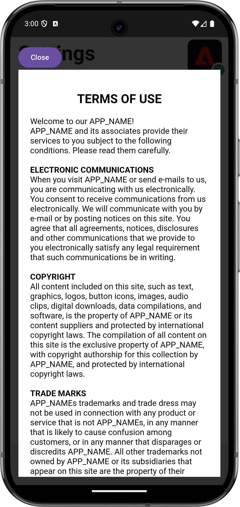

# Gestion des vues web

Découvrez comment gérer la collecte de données avec des vues web dans une application mobile.

## Conditions préalables

* Application créée et exécutée avec succès avec les SDK installés et configurés.

## Objectifs d’apprentissage

Dans cette leçon, vous allez :

* Comprenez pourquoi vous devez accorder une attention particulière aux WebViews dans votre application.
* comprendre le code requis pour éviter les problèmes de suivi ;

## Problèmes potentiels de tracking

Des ECID (Experience Cloud Identity) distincts sont générés lorsque vous envoyez des données à partir de la partie native de votre application et d’une vue web dans l’application. Ces ECID distincts génèrent des accès déconnectés et des données de visite et de visiteur exagérées. Vous trouverez plus d’informations sur l’ECID dans la [ présentation de l’ECID ](https://experienceleague.adobe.com/fr/docs/experience-platform/identity/features/ecid).

Pour résoudre les accès déconnectés et les données gonflées, vous devez transmettre l’ECID de l’utilisateur de la partie native de votre application à un WebView que vous souhaitez peut-être utiliser dans votre application.

L’extension AEP Edge Identity utilisée dans le WebView collecte l’ECID actif et l’ajoute à l’URL au lieu d’envoyer une demande de nouvel ID à Adobe. L’implémentation utilise ensuite cet ECID pour demander l’URL.

## Mise en œuvre

Pour implémenter l’affichage web :

>[!BEGINTABS]

>[!TAB iOS]

Accédez à **[!DNL Luma]** > **[!DNL Luma]** > **[!DNL Views]** > **[!DNL Info]** > **[!DNL TermsOfServiceSheet]**, puis localisez la fonction `func loadUrl()` dans la classe `final class SwiftUIWebViewModel: ObservableObject`. Ajoutez l&#39;appel suivant pour gérer l&#39;affichage web :

```swift
// Handle web view
AEPEdgeIdentity.Identity.getUrlVariables {(urlVariables, error) in
    if let error = error {
        print("Error with Webview", error)
        return;
    }
    
    if let urlVariables: String = urlVariables {
        urlString.append("?" + urlVariables)
        guard let url = URL(string: urlString) else {
            return
        }
        DispatchQueue.main.async {
            self.webView.load(URLRequest(url: url))
        }
    }
    Logger.aepMobileSDK.info("Successfully retrieved urlVariables for WebView, final URL: \(urlString)")
}
```

L’API [`AEPEdgeIdentity.Identity.getUrlVariables`](https://developer.adobe.com/client-sdks/documentation/identity-for-edge-network/api-reference/#geturlvariables) configure les variables pour que l’URL contienne toutes les informations pertinentes, telles que l’ECID, etc. Dans cet exemple, vous utilisez un fichier local, mais les mêmes concepts s’appliquent aux pages distantes.

Pour en savoir plus sur l’API `Identity.getUrlVariables`, consultez le guide de référence de l’API d’extension [Identity for Edge Network](https://developer.adobe.com/client-sdks/documentation/identity-for-edge-network/api-reference/#geturlvariables).


>[!TAB Android]

Accédez à **[!UICONTROL Android]**  > **[!DNL app]** > **[!DNL kotlin+java]** > **[!DNL com.adobe.luma.tutorial.android]** > **[!DNL views]** > **[!DNL WebViewModel]**, puis localisez la fonction `fun loadUrl()` dans le `class WebViewModel: ViewModel()`. Ajoutez l&#39;appel suivant pour gérer l&#39;affichage web :

```kotlin
// Handle web view
Identity.getUrlVariables {
    urlVariables = it
    val baseUrl = getHtmlFileUrl("tou.html")

    val finalUrl = if (urlVariables.isNotEmpty()) {
        "$baseUrl?$urlVariables"
    } else {
        baseUrl
    }

    Handler(Looper.getMainLooper()).post {
        webView.loadUrl(finalUrl)
    }
    MobileSDK.shared.logInfo("TermsOfServiceSheet - loadUrl: Successfully loaded WebView with URL: $finalUrl")
}
```

L’API [`Identity.getUrlVariables`](https://developer.adobe.com/client-sdks/documentation/identity-for-edge-network/api-reference/#geturlvariables) configure les variables pour que l’URL contienne toutes les informations pertinentes, telles que l’ECID, etc. Dans cet exemple, vous utilisez un fichier local, mais les mêmes concepts s’appliquent aux pages distantes.

Pour en savoir plus sur l’API `Identity.getUrlVariables`, consultez le guide de référence de l’API d’extension [Identity for Edge Network](https://developer.adobe.com/client-sdks/documentation/identity-for-edge-network/api-reference/#geturlvariables).

>[!ENDTABS]

## Validation dans l’application

Pour exécuter le code :

1. Consultez la section [instructions de configuration](assurance.md#connecting-to-a-session) pour connecter votre simulateur ou votre appareil à Assurance.
1. Accédez à la **[!UICONTROL Paramètres]** dans l’application.
1. Appuyez sur le bouton **[!DNL View...]** pour afficher la **[!DNL Terms of Use]**.

>[!BEGINTABS]

>[!TAB iOS]

 

>[!TAB Android]

 

>[!ENDTABS]


## Valider avec Assurance

1. Dans l’interface utilisateur d’Assurance, recherchez l’événement **[!UICONTROL Variables d’URL de réponse d’identité d’Edge]** du fournisseur **[!UICONTROL com.adobe.griffon.mobile]**.
1. Sélectionnez l’événement et passez en revue le champ **[!UICONTROL urlvariable]** dans l’objet **[!UICONTROL ACPExtensionEventData]**, en confirmant que les paramètres suivants sont présents dans l’URL : `adobe_mc`, `mcmid` et `mcorgid`.

   {zoomable="yes"}

   Un exemple de champ de `urvariables` est visible ci-dessous :

   * Original (avec caractères d’échappement)

     ```html
     adobe_mc=TS%3D1636526122%7CMCMID%3D79076670946787530005526183384271520749%7CMCORGID%3D7ABB3E6A5A7491460A495D61%40AdobeOrg
     ```

   * Enjolivé

     ```html
     adobe_mc=TS=1636526122|MCMID=79076670946787530005526183384271520749|MCORGID=7ABB3E6A5A7491460A495D61@AdobeOrg
     ```

Malheureusement, le débogage de la session web est limité. Par exemple, vous ne pouvez pas utiliser Adobe Experience Platform Debugger dans votre navigateur pour continuer à déboguer la session webview.

>[!NOTE]
>
>L’assemblage des visiteurs via ces paramètres d’URL est pris en charge dans Platform Web SDK (versions 2.11.0 ou ultérieures) et lors de l’utilisation de `VisitorAPI.js`.


>[!SUCCESS]
>
>Vous avez maintenant configuré votre application pour afficher le contenu basé sur une URL dans une vue web à l’aide du même ECID que l’ECID déjà émis par Adobe Experience Platform Mobile SDK.
>
>Merci d’avoir consacré votre temps à découvrir Adobe Experience Platform Mobile SDK. Si vous avez des questions, souhaitez partager des commentaires généraux ou des suggestions sur le contenu futur, partagez-les dans ce [article de discussion de la communauté Experience League](https://experienceleaguecommunities.adobe.com/t5/adobe-experience-platform-data/tutorial-discussion-implement-adobe-experience-cloud-in-mobile/td-p/443796?profile.language=fr)

Suivant : **[Identité](identity.md)**
