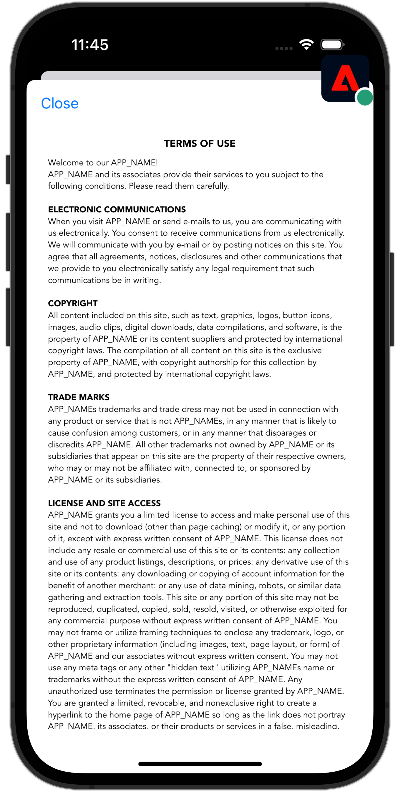

# Gestion des WebViews

Découvrez comment gérer la collecte de données avec WebViews dans une application mobile.

## Conditions préalables

* Création et exécution de l’application avec les SDK installés et configurés.

## Objectifs d&#39;apprentissage

Dans cette leçon, vous allez :

* Comprenez pourquoi vous devez prendre en compte de manière particulière les WebViews dans votre application.
* Comprendre le code requis pour éviter les problèmes de suivi.

## Problèmes de suivi potentiels

Si vous envoyez des données à partir de la partie native de l’application et d’une vue WebView au sein de l’application, chacune génère son propre identifiant Experience Cloud (ECID), ce qui entraîne des accès déconnectés et une augmentation des données de visite/visiteur. Vous trouverez plus d’informations sur l’ECID dans la section [Présentation d’ECID](https://experienceleague.adobe.com/docs/experience-platform/identity/ecid.html?lang=en).

Pour résoudre cette situation indésirable, il est important de transmettre l’ECID de l’utilisateur de la partie native de votre application à un WebView que vous souhaitez peut-être utiliser dans votre application.

L’extension AEP Edge Identity utilisée dans WebView collecte l’ECID actuel et l’ajoute à l’URL au lieu d’envoyer une demande d’Adobe d’un nouvel ID. L’implémentation utilise ensuite cet ECID pour demander l’URL.

## Mise en œuvre

Accédez à **[!DNL Luma]** > **[!DNL Luma]** > **[!DNL Views]** > **[!DNL Info]** > **[!DNL TermsOfServiceSheet]**, puis localisez la variable `func loadUrl()` dans la fonction `final class SwiftUIWebViewModel: ObservableObject` classe . Ajoutez l’appel suivant pour gérer l’affichage web :

```swift
// Handle web view
AEPEdgeIdentity.Identity.getUrlVariables {(urlVariables, error) in
    if let error = error {
        print("Error with Webview", error)
        return;
    }
    
    if let urlVariables: String = urlVariables {
        urlString.append("?" + urlVariables)
        guard let url = URL(string: urlString) else {
            return
        }
        DispatchQueue.main.async {
            self.webView.load(URLRequest(url: url))
        }
    }
    Logger.aepMobileSDK.info("Successfully retrieved urlVariables for WebView, final URL: \(urlString)")
}
```

La variable [`AEPEdgeIdentity.Identity.getUrlVariables`](https://developer.adobe.com/client-sdks/documentation/identity-for-edge-network/api-reference/#geturlvariables) L’API configure les variables pour que l’URL contienne toutes les informations pertinentes, comme ECID, et plus encore. Dans cet exemple, vous utilisez un fichier local, mais les mêmes concepts s’appliquent aux pages distantes.

Vous pouvez en savoir plus sur les `Identity.getUrlVariables` de l’API [Guide de référence de l’API d’extension Identity for Edge Network](https://developer.adobe.com/client-sdks/documentation/identity-for-edge-network/api-reference/#geturlvariables).

## Valider

Pour exécuter le code :

1. Consultez la section [instructions de configuration](assurance.md#connecting-to-a-session) pour connecter le simulateur ou l’appareil à Assurance.
1. Accédez au **[!UICONTROL Paramètres]** dans l’application
1. Appuyez sur le bouton **[!DNL View...]** pour afficher le **[!DNL Terms of Use]**.

    

1. Dans l’interface utilisateur d’Assurance, recherchez le **[!UICONTROL Variables d’URL de réponse Edge Identity]** de l’événement **[!UICONTROL com.adobe.griffon.mobile]** fournisseur.
1. Sélectionnez l’événement et passez en revue la variable **[!UICONTROL urlvariable]** dans le champ **[!UICONTROL ACPExtensionEventData]** , confirmant que les paramètres suivants sont présents dans l’URL : `adobe_mc`, `mcmid`, et `mcorgid`.

   

   Un exemple `urvariables` est visible ci-dessous :

   * Original (avec caractères avec échappement)

     ```html
     adobe_mc=TS%3D1636526122%7CMCMID%3D79076670946787530005526183384271520749%7CMCORGID%3D7ABB3E6A5A7491460A495D61%40AdobeOrg
     ```

   * Beautified

     ```html
     adobe_mc=TS=1636526122|MCMID=79076670946787530005526183384271520749|MCORGID=7ABB3E6A5A7491460A495D61@AdobeOrg
     ```

Malheureusement, le débogage de la session web est limité. Par exemple, vous ne pouvez pas utiliser l’Adobe Experience Platform Debugger dans votre navigateur pour continuer le débogage de la session d’affichage Web.

>[!NOTE]
>
>L’assemblage de visiteurs via ces paramètres d’URL est pris en charge dans le SDK Web Platform (versions 2.11.0 ou ultérieures) et lors de l’utilisation de `VisitorAPI.js`.


>[!SUCCESS]
>
>Vous avez maintenant configuré votre application pour afficher le contenu basé sur une URL dans un affichage web à l’aide du même ECID que celui déjà émis par le SDK Adobe Experience Platform Mobile.
>
>Merci d’investir votre temps à apprendre sur le SDK Adobe Experience Platform Mobile. Si vous avez des questions, souhaitez partager des commentaires généraux ou avez des suggestions sur le contenu futur, partagez-les à ce sujet. [Article de discussion de la communauté Experience League](https://experienceleaguecommunities.adobe.com/t5/adobe-experience-platform-data/tutorial-discussion-implement-adobe-experience-cloud-in-mobile/td-p/443796)

Suivant : **[Identité](identity.md)**
