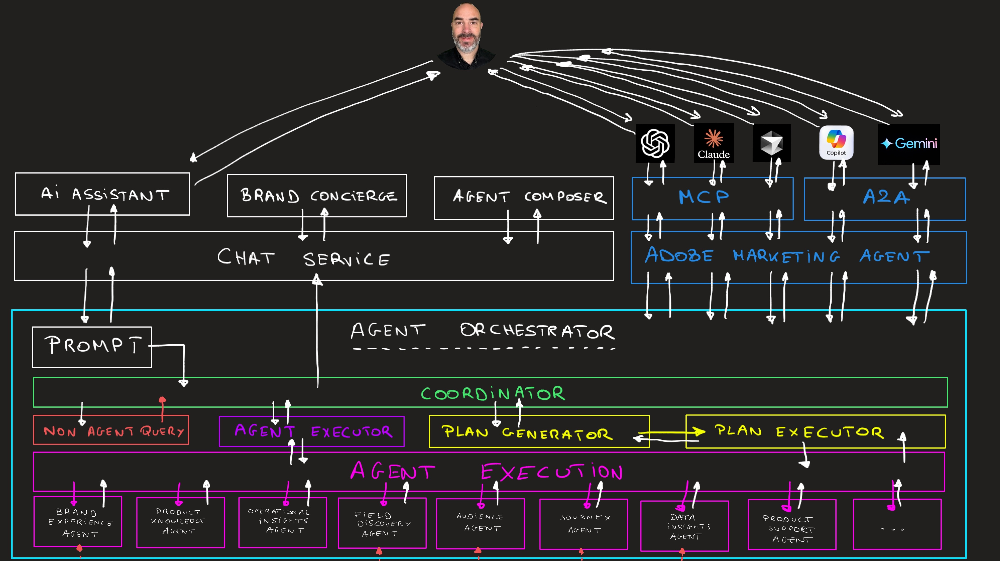

# Présentation - Agentic AI Tech Labs

{width="50px" align="left"}

## Architecture de l’IA dédiée aux agences

Dans cette vidéo, vous découvrirez l’architecture sous-jacente à la partie IA dédiée aux agents du tutoriel One Adobe.

>[!VIDEO](https://video.tv.adobe.com/v/3481416?quality=12&learn=on)

Téléchargez l’image de présentation de l’architecture ci-dessous :

### Prise en main

[Prise en main](./modules/getting-started/gettingstarted/getting-started.md){target="_blank"}

Dans ce module de base, vous allez tout préparer pour pouvoir accéder à l’environnement de démonstration et l’utiliser.

### Laboratoires technologiques d’IA dédiés aux agences

[1.1 Agent Orchestrator](./modules/agents/module1.1/agentorchestrator.md)

**Objectif**

Découvrez comment utiliser les agents Adobe Experience Platform et Agent Orchestrator pour :

- Analyse des tendances d’achat
- Identification des audiences à forte propension
- Validation des performances du parcours
- Création d&#39;un nouveau parcours pour le déploiement CitiSignal Fiber Max

Vous apprendrez également à utiliser Adobe Marketing Agent en combinaison avec des outils tels que Microsoft 365 Copilot, ChatGPT pour Enterprise, Google Gemini Enterprise et Claude.

[1.4 Brand Concierge](./modules/agents/module1.4/brandconcierge.md)

**Objectif**

Brand Concierge est un compagnon numérique optimisé par l’IA qui transforme la façon dont les marques interagissent avec les visiteurs de leur site web. Contrairement aux chatbots génériques, Brand Concierge offre des expériences de conversation personnalisées et adaptées aux intentions de chaque visiteur. Il permet aux visiteurs de découvrir des produits, de comparer des options, d’obtenir des réponses instantanées et de recevoir des recommandations guidées en temps réel. La plateforme sert à la fois le B2C et le B2B et agit comme une extension intelligente de votre marque sur n’importe quel canal numérique, tout en préservant la voix de votre marque, l’intégrité de votre contenu et la conformité.

Dans cet exercice, vous apprendrez à :

- Configuration de votre instance Brand Concierge dans votre sandbox Adobe Experience Platform
- Mise en œuvre de Brand Concierge sur votre site web AEM CS/EDS

[1.5 Analytics et agents](./modules/agents/module1.5/analyticsagents.md)

**Objectif**

En tant qu’analyste de données, développeur d’IA ou architecte d’applications d’IA, vous apprendrez à automatiser les tâches de création de rapports telles que la création de rapports, la planification d’analyses à l’aide d’agents externes. Vous apprendrez à extraire de nouvelles données de campagne, d&#39;audience ou de performances dans vos workflows agentiques.

Dans cet exercice, vous apprendrez à :

- Connectez ChatGPT et/ou Claude.ai à **&#x200B;**&#x200B;et effectuez des tâches d&#39;analyse des données
- Connectez ChatGPT et/ou Claude.ai à **&#x200B;**&#x200B;et effectuez des tâches d’analyse des données

[1.6 AEM et agents](./modules/agents/module1.6/aemagents.md){target="_blank"}

**Objectif**

Adobe Experience Manager comprend désormais plusieurs agents spécifiquement conçus, chacun conçu pour assumer un travail qui a toujours exigé des tonnes d&#39;efforts manuels. Il ne s’agit pas d’assistants d’IA génériques, mais d’agents formés au domaine qui connaissent profondément AEM et qui opèrent sur le contenu, le code, les ressources, la gouvernance et l’optimisation.

- **Agent de production Experience**, qui accélère les mises à jour, les modifications de contenu et même les migrations complètes du site.
- **Agent de gouvernance** applique automatiquement la marque, les droits et les règles de conformité.
- **Discovery Agent**, prépare le contenu pour la découverte native de l’IA et agit comme un stratège intelligent.
- **Agent d’optimisation de contenu** crée instantanément des variations de ressources spécifiques à un canal et prêtes pour les performances.
- **Agent de développement** accélère les développeurs grâce à un dépannage assisté par IA et à l’optimisation des performances.

Dans cet exercice, vous apprendrez à utiliser ces agents à l’aide de l’assistant AI et du curseur via la configuration personnalisée du serveur MCP.

[1.7 Outils de développement intelligents pour Adobe Commerce](./modules/agents/module1.7/aiassisteddev.md)

**Objectif**

Dans ce module, vous utiliserez des outils de développement intelligents tels que Cursor pour développer une extension de votre environnement Adobe Commerce as a Cloud Service. L’objectif de cette extension est de transférer les événements de commande entrants vers un point d’entrée tiers. Le transfert d’événement dans Adobe Commerce as a Cloud Service repose sur Adobe I/O App Builder, Adobe I/O Events et Adobe I/O Runtime. La configuration de tous ces services sera assistée par Cursor.

{width="50px" align="left"}

>[!NOTE]
>
>Si vous avez des questions, si vous souhaitez partager des commentaires généraux ou si vous avez des suggestions sur le contenu futur, veuillez contacter directement les initiés techniques, en envoyant un e-mail à **&#x200B;**.
