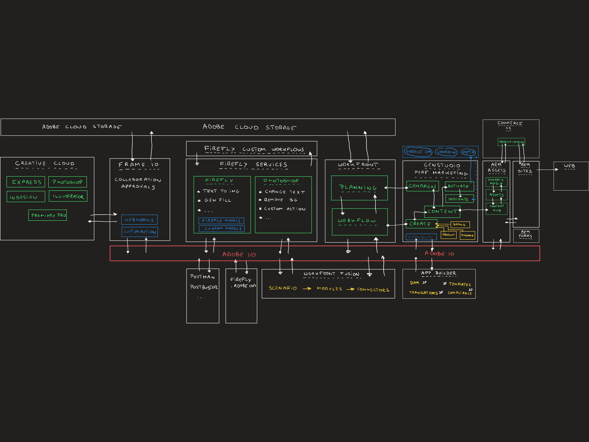

# One Adobe Tutorial - Architecture Overview

{width="50px" align="left"}

## One Adobe Architecture Overview

In this video, you&#39;ll learn about the architecture behind the full end-to-end One Adobe tutorial.

>[!VIDEO](https://video.tv.adobe.com/v/3481417?quality=12&learn=on)

Download the architecture overview image below:

## Agentic AI Architecture Overview

In this video, you&#39;ll learn about the architecture behind the Agentic AI part of the One Adobe tutorial.

>[!VIDEO](https://video.tv.adobe.com/v/3481416?quality=12&learn=on)

Download the architecture overview image below:

## Content Architecture Overview

In this video, you&#39;ll learn about the architecture behind the GenStudio part of this tutorial.

>[!VIDEO](https://video.tv.adobe.com/v/3481414?quality=12&learn=on)

Download the architecture overview image below:

## Data Architecture Overview

In this video, you&#39;ll learn about the architecture behind the Adobe Experience Platform and Applications part of this tutorial.

>[!VIDEO](https://video.tv.adobe.com/v/3481415?quality=12&learn=on)

Download the architecture overview image below:

>[!NOTE]
>
>Si vous avez des questions, si vous souhaitez partager des commentaires généraux ou si vous avez des suggestions sur le contenu futur, veuillez contacter directement les initiés techniques, en envoyant un e-mail à **techinsiders@adobe.com**.
