# 1.1.1 Assistant IA et Agent Orchestrator

## Vidéo

Dans cette vidéo, vous obtiendrez une explication et une démonstration de toutes les étapes impliquées dans cet exercice.

>[!VIDEO](https://video.tv.adobe.com/v/3477257?quality=12&learn=on)

## 1.1.1.1 Définir le contexte dans Agent Orchestrator

Accédez à [](https://experience.adobe.com/#/ai-assistant/chat).

Vous devriez alors voir ceci. Assurez-vous d’être dans le `--aepImsOrgName--` d’organisation.


Cliquez sur la fenêtre **context**.


Définissez le contexte sur :

- **Sandbox** : **Prod - One Adobe (VA7)**

Le paramètre Sandbox permet d’identifier le sandbox que l’assistant AI doit examiner lorsqu’il pose des questions.

- **Vue de données** : **Vue de données client unifiée Adobe One**

Le paramètre Vue de données permet d’identifier l’assistant AI de vue de données à examiner lors de la pose de questions.

Cliquez sur **Définir le contexte**.


## 1.1.1.2 Commencez par les tendances d’achat globales pour ancrer le contexte et zoomer sur la fibre

**Intention**

Obtenez une impulsion de niveau supérieur sur la demande de catégorie (mobile, fixe, Internet, télévision, fibre optique), en particulier pour les 60 derniers jours. Cela définit des niveaux de référence pour la saisonnalité, les effets de promotion et la variance régionale après le déploiement à New York.

Saisissez l’invite **Prompt** suivante, puis cliquez sur le bouton **envoyer**.

```
Show me purchases by mainCategory over the last 2 months.
```

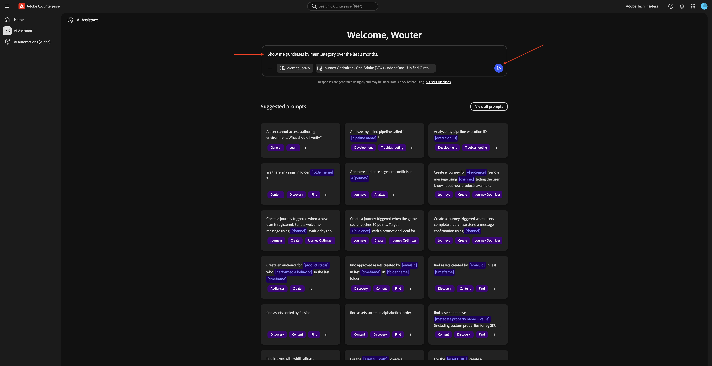

Vous devriez alors voir ceci :


Saisissez l’invite **Prompt** suivante, puis cliquez sur le bouton **envoyer**.

```
Show me purchases by mainCategory = Fiber over the last 2 months per week
```

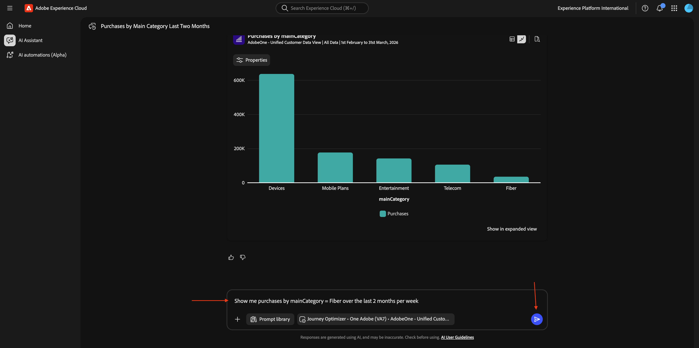

Vous devriez ensuite voir ceci, qui examine les tendances spécifiques à la fibre optique.

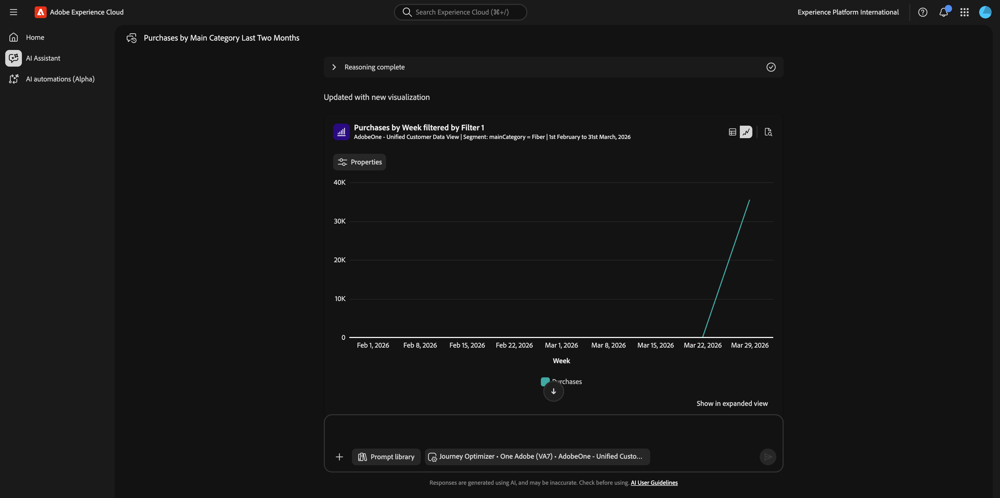

## 1.1.1.3 Corréler les commandes avec les préférences de contenu

**Intention**

Testez l&#39;hypothèse selon laquelle une préférence pour un genre spécifique (p. ex., science-fiction, sports, dramatique) prédit le comportement de mise à niveau de la large bande, en particulier pour les besoins en bande passante élevée.

Tout d’abord, vous devez déterminer quel champ est utilisé pour stocker la préférence de genre.

Saisissez l’invite **Prompt** suivante, puis cliquez sur le bouton **envoyer**.

```
Which field is used to store the preferred genre?
```


Vous devriez ensuite voir ceci, qui indique que le champ utilisé pour le genre est **`--aepTenantId--.individualCharacteristics.telco.mediaPreferences.favouriteGenre`**.


Avec ces informations, vous pouvez commencer à analyser en profondeur les données d’achat.

Saisissez l’invite **Prompt** suivante, puis cliquez sur le bouton **envoyer**.

```
Show me purchases by preferred genre for the last 2 months
```


Vous devriez alors voir ceci. Cliquez sur l’icône du bloc **Raisonnement terminé** pour comprendre ce qui se passe en coulisses dans Agent Orchestrator.

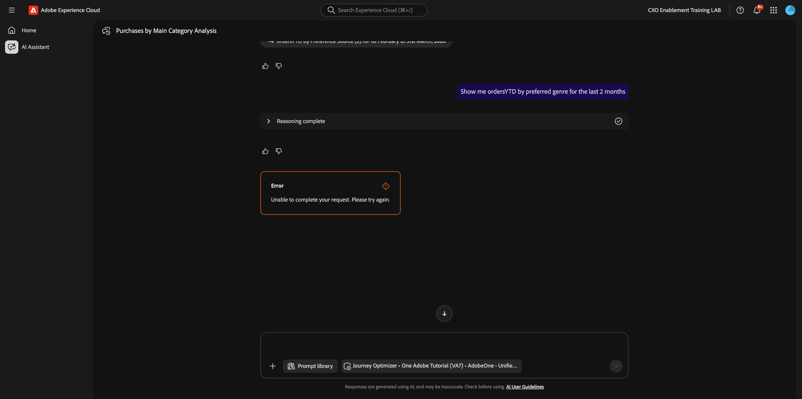

Une explication similaire devrait s’afficher.


## 1.1.1.4 Identifier Les Parcours Fibre Existants

**Intention**

Découvrez quels parcours actifs ou récemment conclus incluent « Fibre » dans le titre, par exemple, « Fibre Upgrade NYC - Sept », « Fibre Trial - Streaming Bundle ».

Saisissez l’invite **Prompt** suivante, puis cliquez sur le bouton **envoyer**.

```
What journeys exist? 
```


Vous devriez alors voir ceci. Cliquez sur l’icône **aperçu**.

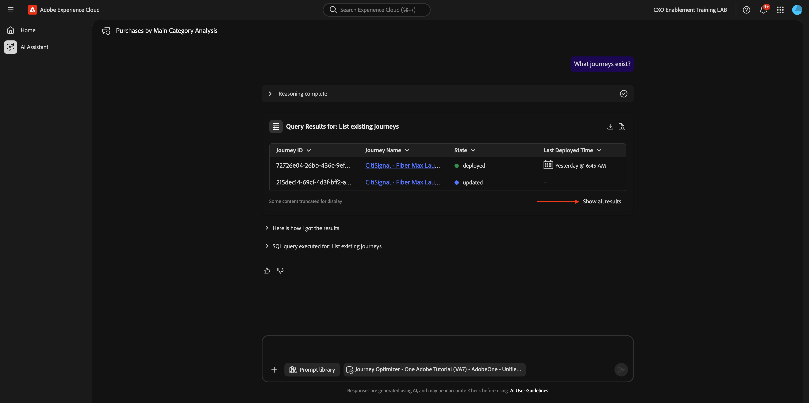

Vous devriez alors voir une liste plus grande de parcours actifs ou passés. Cliquez sur l’icône **télécharger** pour télécharger une liste de ces parcours.

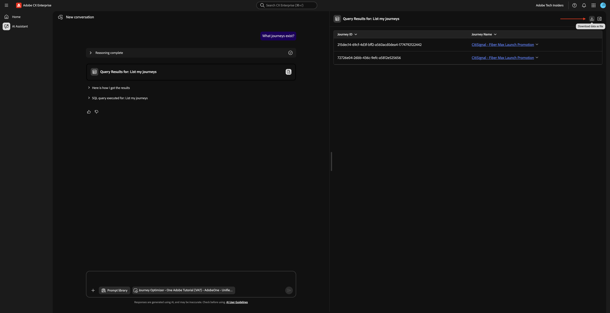

Un fichier CSV contenant toutes les sorties de l’assistant d’IA est alors généré.

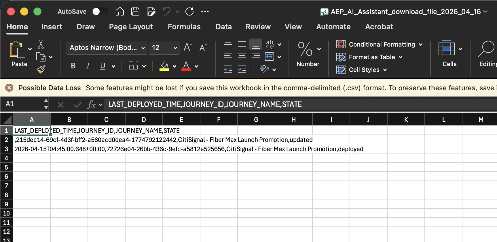

Cliquez pour fermer le volet de droite. Saisissez l’invite **Prompt** suivante, puis cliquez sur le bouton **envoyer**.

```
Which of these journeys has 'Fiber' in its name?
```


Vous devriez alors voir quelque chose comme ça.

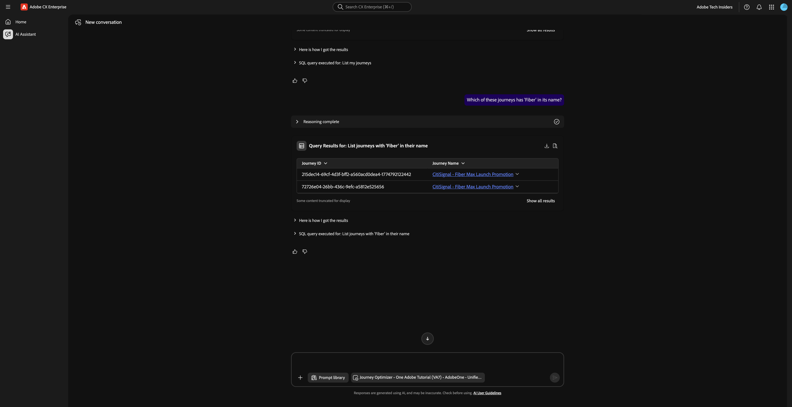

Saisissez l’invite **Prompt** suivante, puis cliquez sur le bouton **envoyer**.

```
give more details about the first one
```

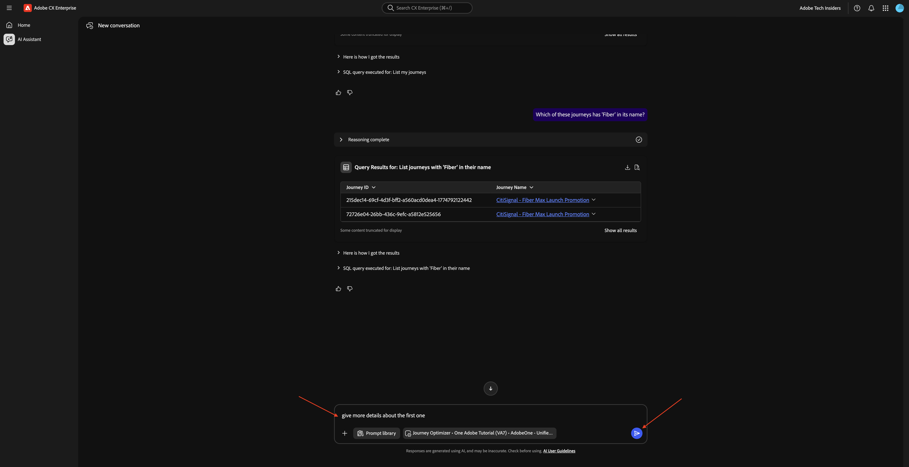

Vous devriez alors voir ceci. Cliquez sur le lien pour ouvrir le parcours.


Une nouvelle fenêtre s’ouvre et vous accédez immédiatement à l’aperçu des détails du Parcours.


## 1.1.1.5 Vérifier quelle audience est utilisée

**Intention** :

Comprenez la définition de départ du parcours « CitiSignal - Promotion de lancement Fibre Max » : les caractéristiques qui ont motivé le ciblage (par exemple, « Préférence de genre SciFi », « Appareils 4+ », « Diffusion ≥ 300GB/mois »).

Saisissez ce qui suit **Invite** :

```
Which audiences are used by the journey named
```

Saisissez ensuite manuellement les `+CitiSignal fib` pour activer la saisie automatique. Sélectionnez le parcours **Promotion de lancement CitiSignal - Fibre max**.


Vous devriez alors voir ceci. Cliquez sur le bouton **envoyer**.

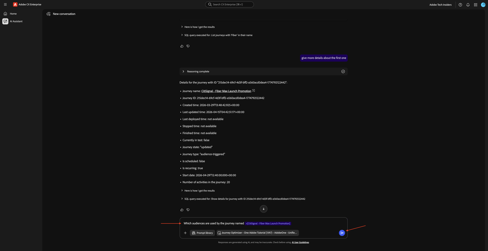

Vous devriez alors voir ceci.


## 1.1.1.6 Validation des performances du parcours via l’analyse des abandons

**Intention**

Vous souhaitez comprendre l’abandon des performances du parcours pour déterminer s’il existe des nœuds ou des conditions dans le parcours qui enregistrent un pourcentage élevé de profils abandonnés. Cela permet de comprendre si des ajustements supplémentaires sont nécessaires dans le parcours.

Saisissez l’invite **Prompt** suivante, puis cliquez sur le bouton **envoyer**.

```
Create a fall-out report on the "CitiSignal - Fiber Max Launch Promotion" journey
```


Vous devriez alors voir ceci.

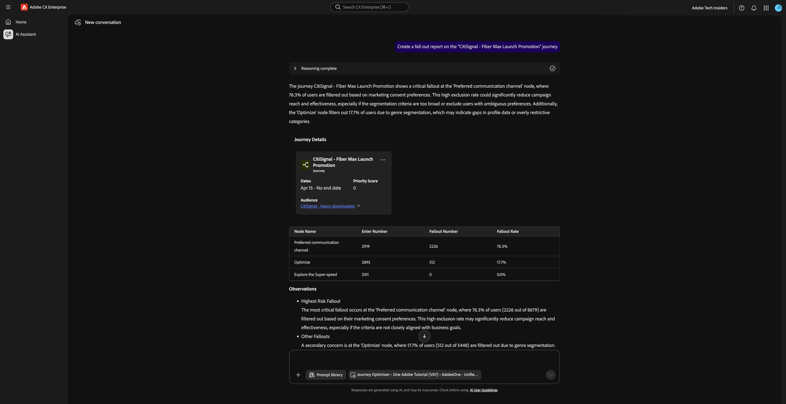

Faites défiler l’écran vers le bas. Vous pouvez maintenant consulter le tableau en examinant chaque nœud et ses numéros d’entrée, numéros d’abandon et taux d’abandon respectifs.

L’assistant d’IA vous fournit des observations et des recommandations.

Cliquez sur la phrase **Explication**.


Vous pouvez ensuite afficher des informations supplémentaires et un contexte.


## 1.1.1.7 Créer une audience

**Intention**

Sur la base des résultats et des recherches ci-dessus, il existe une corrélation entre les clients qui consomment beaucoup de données et qui ont un genre préféré de science-fiction ou de fantasy. Vous allez maintenant combiner ces attributs dans une audience.

Saisissez l’invite **Prompt** suivante, puis cliquez sur le bouton **envoyer**.

```
Create an audience that combines people with an average download usage per month of over 2000 GB and a preferred genre of sci-fi or fantasy.
```


Examinez le plan. Saisissez `yes` et cliquez sur **Envoyer**.

>[!NOTE]
>
>Ce plan est généré à partir d’un guide de référence dans le système. Les clients pourront éventuellement personnaliser les plans et ajouter leurs propres plans, mais pour l’instant, ils sont statiques.


Consultez la **Définition de l’audience**. Saisissez `yes` et cliquez sur le bouton **Envoyer**.


Vérifiez l’estimation de la taille du segment. Saisissez `yes` et cliquez sur le bouton **Envoyer**.


Cliquez sur **Vérifier**.


Examinez la **Proposition d’audience**. Cliquez sur **Créer**.


Votre audience a maintenant été créée. Cliquez sur le lien pour ouvrir l’audience.

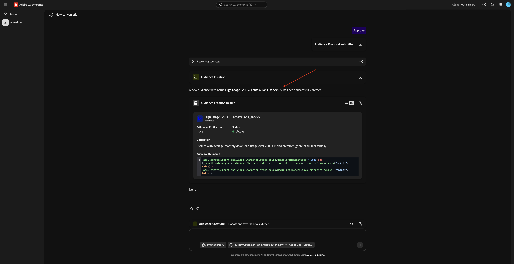

>[!NOTE]
>
>Lors de la création d’une audience, il faudra 24 heures avant que l’audience ne soit disponible pour l’assistant d’IA à des fins d’utilisation ultérieure.

Vous devriez alors voir ceci.

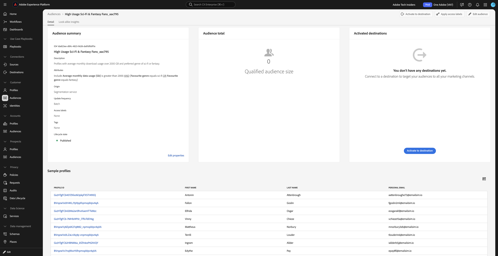

## 1.1.1.8 Rechercher les audiences existantes alignées sur une utilisation élevée et vérifier si elles sont en cours d’utilisation

**Intention** :

Localisez toute audience dont le nom comporte des « téléchargeurs volumineux », définis par des seuils mensuels d’utilisation des données.

>[!NOTE]
>
>À l’étape précédente, vous avez créé une nouvelle audience. Gardez à l’esprit qu’il faudra 24 heures avant que l’audience ne soit disponible pour l’assistant AI à des fins d’utilisation ultérieure. Vous devez maintenant utiliser une autre audience, déjà existante.

Saisissez l’invite **Prompt** suivante, puis cliquez sur le bouton **envoyer**.

```
Is there an audience that has "heavy downloaders" in the title?
```


Vous devriez alors voir ceci.

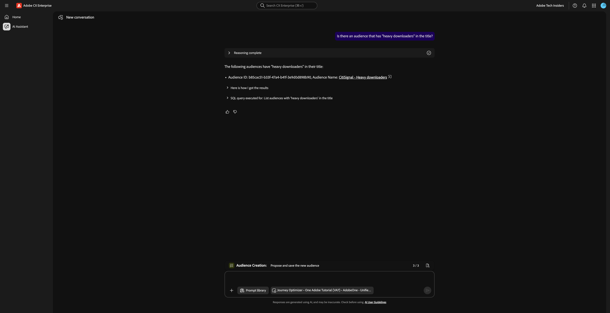

Vous souhaitez maintenant voir toutes vos audiences et à quel point elles ont changé au cours des derniers jours.

Saisissez l’invite **Prompt** suivante, puis cliquez sur le bouton **envoyer**.

```
List how much all my audiences changed over the last few days.
```


Vous devriez alors voir ceci. Cliquez sur **Afficher tous les résultats**.


Vous devriez alors voir ceci. Cliquez pour fermer le volet de droite.


Faites défiler l’écran vers le bas pour passer en revue les étapes effectuées par l’assistant AI.


Il existe déjà certaines audiences pour les « téléchargeurs lourds ». Voyons s’ils sont déjà utilisés.

Saisissez l’invite **Prompt** suivante, puis cliquez sur le bouton **envoyer**.

```
Which of the above are used in a journey? 
```


Vous devriez alors voir quelque chose de similaire à ceci.


Vous devez maintenant vérifier si ce parcours est actif. Saisissez l’invite **Prompt** suivante, puis cliquez sur le bouton **envoyer**.

```
Are these journeys active? 
```


Vous devriez alors voir quelque chose de similaire à ceci. Aucun de ces parcours n’est en cours d’exécution.


Pour le lancement prochain de Fibre Max, vous devez maintenant créer un nouveau parcours.

## 1.1.1.9 Créer un nouveau Parcours pour Fibre Max Launch

**Intention** :

Créez un nouveau parcours ciblant l’audience composée :

Téléchargeurs lourds ∩ SciFi Preference.

Saisissez l’invite **Prompt** suivante, puis cliquez sur le bouton **envoyer**.

```
Create a  journey towards the audience Heavy Downloaders - Sci-Fi Preference. The journey is for the rollout of fiber broadband. There will 2 versions of an email  based on  a split of the audience based on who is in the "Eligble for Fiber upgrade" audience.  After 3 days, profiles from both email treatments who have not purchased fibre max will be sent a follow up email. 
```


Vous devriez alors voir ceci. Saisissez `yes` et cliquez sur Envoyer.


Vous devriez alors voir ceci. Saisissez `yes` et cliquez sur Envoyer.


Vous devriez alors voir ceci. Saisissez `the first one` et cliquez sur Envoyer.


Vous devriez alors voir ceci. Saisissez `yes` et cliquez sur Envoyer.


Cliquez sur **Vérifier**.


Mettez à jour le nom du parcours avec votre LDAP pour le rendre unique. Cliquez sur **Enregistrer**.


Votre parcours a été créé en mode brouillon. Cliquez sur votre parcours pour l’ouvrir.


Vous devriez alors voir ceci.

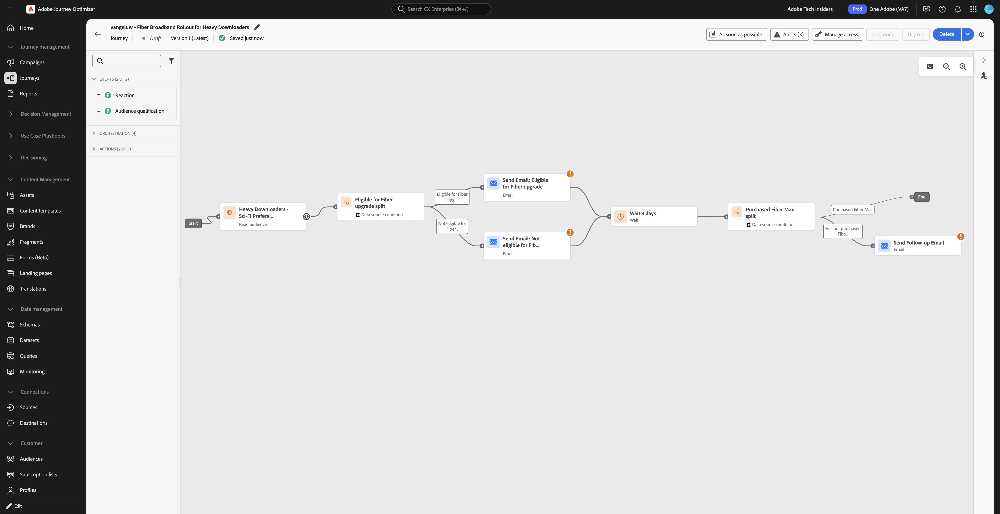

## Gestion des conflits de Parcours 1.1.1.10

Saisissez l’invite **Prompt** suivante, puis cliquez sur le bouton **envoyer**.

```
How can I manage journey conflicts?
```


Consultez les informations.


Faites défiler vers le bas et sélectionnez l’**Sources** pour vérifier que les informations proviennent d’Experience League.


Saisissez l’invite **Prompt** suivante, puis cliquez sur le bouton **envoyer**.

```
List any conflicts for the journey +CitiSignal Fiber Max
```

Sélectionnez ensuite manuellement le parcours **Promotion de lancement CitiSignal - Fibre max** dans la liste.


Vous devriez alors voir ceci. Cliquez sur **envoyer**.


Examinez les informations relatives aux conflits de parcours potentiels.


## Expériences 1.1.1.11

Saisissez l’invite **Prompt** suivante, puis cliquez sur le bouton **envoyer**.

```
How are the experiments performing for the journey named 'CitiSignal - Fiber Max Launch Promotion'?
```


Vous devriez alors voir ceci :


Faites défiler vers le bas et cliquez sur l’une des suggestions. Cliquez sur **envoyer**.

>[!NOTE]
>
>Les suggestions sont dynamiques. Vous devez donc vous attendre à voir des suggestions différentes chaque fois qu’une réponse est générée. Vos suggestions seront probablement différentes de celles affichées dans cette capture d’écran.


Vous devriez alors voir une réponse détaillée liée à la suggestion qui a été choisie.


Vous avez maintenant terminé ce Lab.

## Étapes suivantes

Accédez à [Adobe Marketing Agent pour ChatGPT Enterprise](./ex2.md){target="_blank"}

Revenir à [](./agentorchestrator.md){target="_blank"}

[Revenir à tous les modules](./../../../overview.md){target="_blank"}
