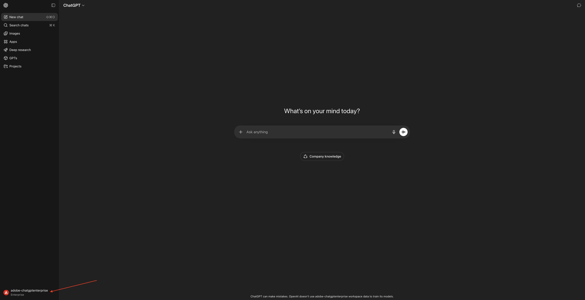
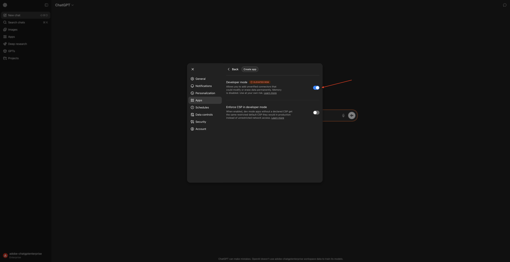
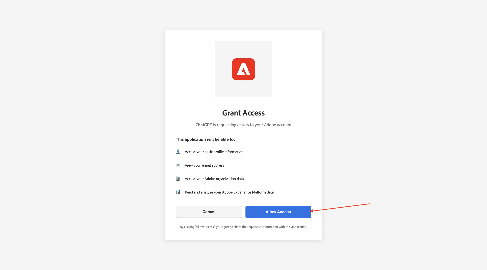
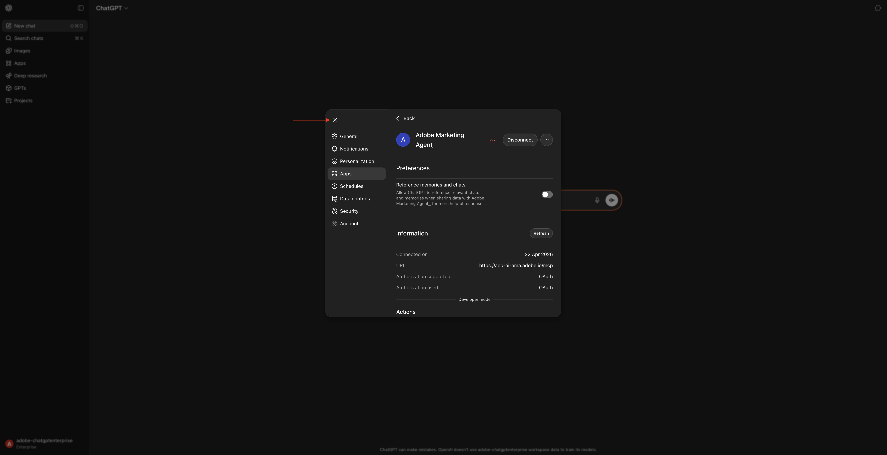
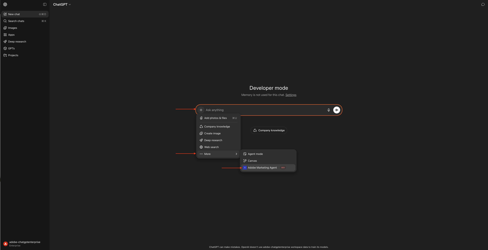
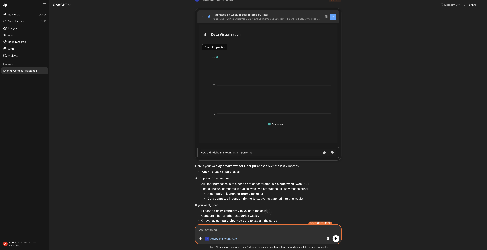
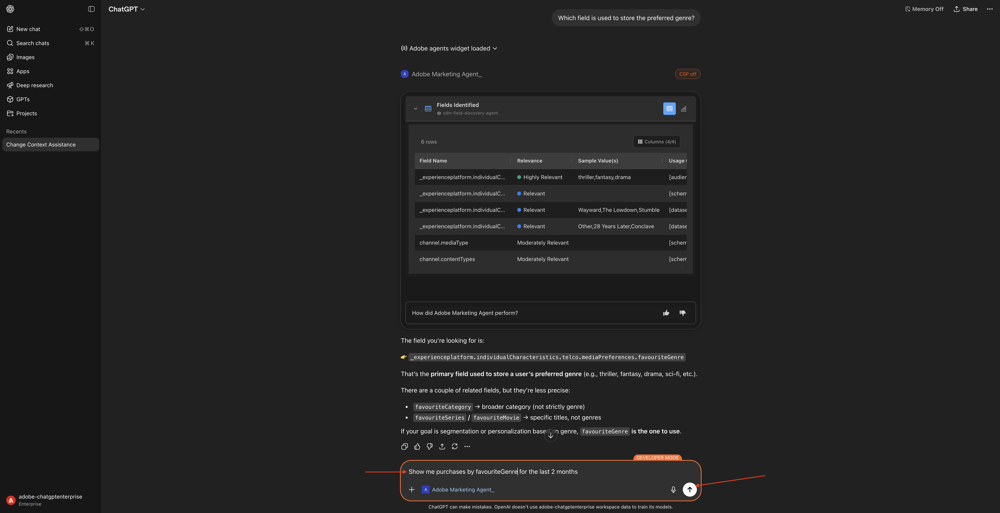
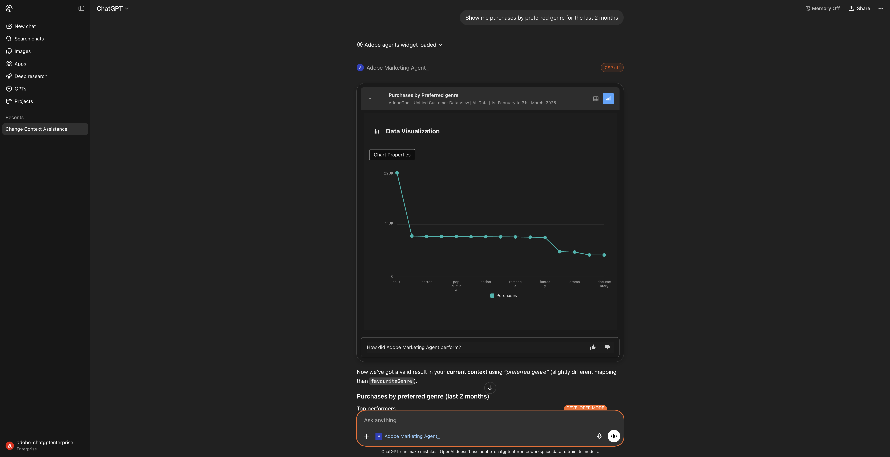
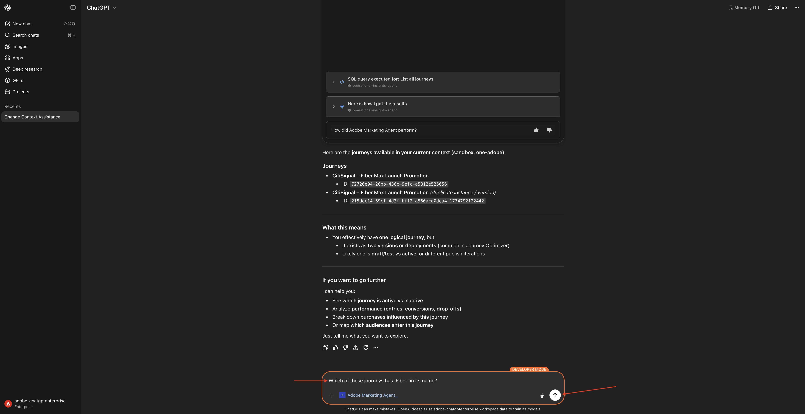

# 1.1.2 Adobe Marketing Agent pour ChatGPT Enterprise

## Vidéo

Dans cette vidéo, vous obtiendrez une explication et une démonstration de toutes les étapes impliquées dans cet exercice.

>[!VIDEO](https://video.tv.adobe.com/v/3478410?quality=12&learn=on)

## 1.1.2.1 Créer une application personnalisée dans ChatGPT Enterprise pour Adobe Marketing Agent

>[!NOTE]
>
>L’utilisation de Adobe Marketing Agent dans ChatGPT nécessite ce qui suit :
>- une version payante du ChatGPT Enterprise d’OpenAI
>- en utilisant le client web ChatGPT Enterprise

Accédez à [](https://chatgpt.com/){target="_blank"} et connectez-vous à l’aide des détails de votre compte. Une fois la connexion effectuée, vous devriez voir ceci. Cliquez sur votre nom d’utilisateur.



Sélectionnez **Paramètres**.


Accédez à **Applications** puis sélectionnez **Paramètres avancés**.


Activez le **mode Développeur** puis cliquez sur **Précédent**.



Cliquez sur **Créer une application**.


Renseignez les champs comme suit :

- **Nom** : `Adobe Marketing Agent`
- **URL du serveur MCP** : `https://aep-ai-ama.adobe.io/mcp`
- **Authentification** : `OAuth`

Cochez la case **Je comprends et je souhaite continuer**.

Cliquez sur **Créer**.


ChatGPT va maintenant essayer de se connecter à votre compte Adobe. Sélectionnez **Autoriser l’accès** puis vous devrez vous connecter à l’aide de votre compte Adobe.



Une fois la connexion établie, vous devriez voir que votre Adobe Marketing Agent est maintenant connecté.


## 1.1.2.2 Définir le contexte dans Adobe Marketing Agent

Fermez cette fenêtre.



Vous devriez alors voir ceci. Cliquez sur l’icône **+**, accédez à **Plus** puis sélectionnez **Adobe Marketing Agent**.



Avant d’interagir davantage avec Adobe Marketing Agent par le biais du ChatGPT, le contexte doit être défini.

Pour cet exercice, le contexte doit être défini pour utiliser :

- **Organisation IMS** : `--aepImsOrgName--`.

- **Sandbox** : **Prod - One Adobe**

Le paramètre Sandbox permet d’identifier le sandbox que le GPT de conversation doit examiner lorsqu’il pose des questions.

- **Vue de données** : **AdobeOne - Vue de données client unifiée**

Le paramètre Vue de données permet d’identifier la vue de données que le GPT de conversation doit examiner lors de la pose de questions.

Saisissez l’invite **Prompt** suivante, puis cliquez sur le bouton **envoyer**.

```
change context
```


Vous devriez alors voir une fenêtre similaire, affichant la sélection actuelle de l’organisation, du sandbox et de la vue de données. Remplacez ces champs par l’organisation, le sandbox et la vue de données appropriés en fonction des informations ci-dessus.


Votre contexte est maintenant correctement défini, vous pouvez donc commencer à envoyer des invites spécifiques.

## 1.1.2.3 Commencez par les tendances d’achat globales pour ancrer le contexte et zoomer sur la fibre

**Intention**

Obtenez une impulsion de niveau supérieur sur la demande de catégorie (mobile, fixe, Internet, télévision, fibre optique), en particulier pour les 60 derniers jours. Cela définit des niveaux de référence pour la saisonnalité, les effets de promotion et la variance régionale après le déploiement à New York.

Saisissez l’invite **Prompt** suivante, puis cliquez sur le bouton **envoyer**.

```
Show me purchases by mainCategory over the last 2 months.
```


Vous devriez alors voir ceci :


Saisissez l’invite **Prompt** suivante, puis cliquez sur le bouton **envoyer**.

```
Show me purchases by mainCategory = Fiber over the last 2 months per week
```


Vous devriez ensuite voir ceci, qui examine les tendances spécifiques à la fibre optique.



## 1.1.2.4 Corréler les commandes avec les préférences de contenu

**Intention**

Testez l&#39;hypothèse selon laquelle une préférence pour un genre spécifique (p. ex., science-fiction, sports, dramatique) prédit le comportement de mise à niveau de la large bande, en particulier pour les besoins en bande passante élevée.

Tout d’abord, vous devez déterminer quel champ est utilisé pour stocker la préférence de genre.

Saisissez l’invite **Prompt** suivante, puis cliquez sur le bouton **envoyer**.

```
Which field is used to store the preferred genre?
```


Vous devriez ensuite voir ceci, qui indique que le champ utilisé pour le genre est **`--aepTenantId--.individualCharacteristics.telco.mediaPreferences.favouriteGenre`**.


Avec ces informations, vous pouvez commencer à analyser en profondeur les données d’achat.

Saisissez l’invite **Prompt** suivante, puis cliquez sur le bouton **envoyer**.

```
Show me purchases by favouriteGenre for the last 2 months
```



Vous devriez alors voir ceci.



## 1.1.2.5 Identifier Les Parcours Fibre Existants

**Intention**

Découvrez quels parcours actifs ou récemment conclus incluent « Fibre » dans le titre, par exemple, « Fibre Upgrade NYC - Sept », « Fibre Trial - Streaming Bundle ».

Saisissez l’invite **Prompt** suivante, puis cliquez sur le bouton **envoyer**.

```
What journeys exist? 
```


Vous devriez alors voir ceci.


Saisissez l’invite **Prompt** suivante, puis cliquez sur le bouton **envoyer**.

```
Which of these journeys has 'Fiber' in its name?
```



Vous devriez alors voir ceci.


Saisissez l’invite **Prompt** suivante, puis cliquez sur le bouton **envoyer**.

```
show me the details of the journey 'CitiSignal - Fiber Max Launch Promotion'
```


Vous devriez alors voir ceci.


## 1.1.2.6 Validation des performances du parcours via l’analyse des abandons

**Intention**

Vous souhaitez comprendre l’abandon des performances du parcours pour déterminer s’il existe des nœuds ou des conditions dans le parcours qui enregistrent un pourcentage élevé de profils abandonnés. Cela permet de comprendre si des ajustements supplémentaires sont nécessaires dans le parcours.

Saisissez l’invite **Prompt** suivante, puis cliquez sur le bouton **envoyer**.

```
Create a fall-out report on the "CitiSignal - Fiber Max Launch Promotion" journey
```


Vous devriez alors voir ceci.


Faites défiler l’écran vers le bas. Vous pouvez maintenant consulter le tableau en examinant chaque nœud et ses numéros d’entrée, numéros d’abandon et taux d’abandon respectifs.


Faites défiler la page vers le bas pour afficher les observations et les recommandations.


Vous avez maintenant terminé ce Lab.

## Étapes suivantes

Accéder à [](./ex3.md){target="_blank"}

Revenir à [](./agentorchestrator.md){target="_blank"}

[Revenir à tous les modules](./../../../overview.md){target="_blank"}
