# 1.1.4 Adobe Marketing Agent pour Google Gemini Enterprise

[!BADGE Beta]

+++Détails Beta
En utilisant le Adobe Marketing Agent avec Google Gemini Enterprise Beta, vous reconnaissez que le Beta est fourni « en l’état », sans garantie d’aucune sorte. Adobe n’a aucune obligation de tenir à jour, corriger, mettre à jour, modifier, remplacer ou prendre en charge Beta. Il est recommandé de faire preuve de prudence et de ne pas se fier, de quelque manière que ce soit, au bon fonctionnement ou aux performances de ce Beta et/ou des éléments qui l’accompagnent. Le Beta est considéré comme des informations confidentielles d’Adobe.  Tout « commentaire » (informations relatives à la version Beta, y compris, mais sans s’y limiter, les problèmes ou défauts que vous rencontrez lors de son utilisation, les suggestions, les améliorations et les recommandations) que vous fournissez à Adobe est par la présente cédé à Adobe. Cela inclut tous les droits, titres et intérêts relatifs à ce commentaire.

+++

## Conditions préalables

Pour suivre les étapes de cet atelier, comme indiqué ci-dessous, vous devez disposer des droits d’accès suivants :

- Accès à Real-Time CDP, Journey Optimizer et Customer Journey Analytics
- Accès à l’assistant d’IA dans Adobe Experience Cloud
- Accès à AEP Agent Orchestrator
- Accès à Google Gemini Enterprise

## Vidéo

Dans cette vidéo, vous obtiendrez une explication et une démonstration de toutes les étapes impliquées dans cet exercice.

>[!VIDEO](https://video.tv.adobe.com/v/3481322?quality=12&learn=on)

## 1.1.4.1 l’accès à Google Gemini Enterprise

Accédez à [&#128279;](https://cloud.google.com/gemini-enterprise). Cliquez sur **Commencer l’essai gratuit de 30 jours**.


Saisissez l’adresse e-mail de votre compte Google et cliquez sur **Continuer avec l’e-mail**.

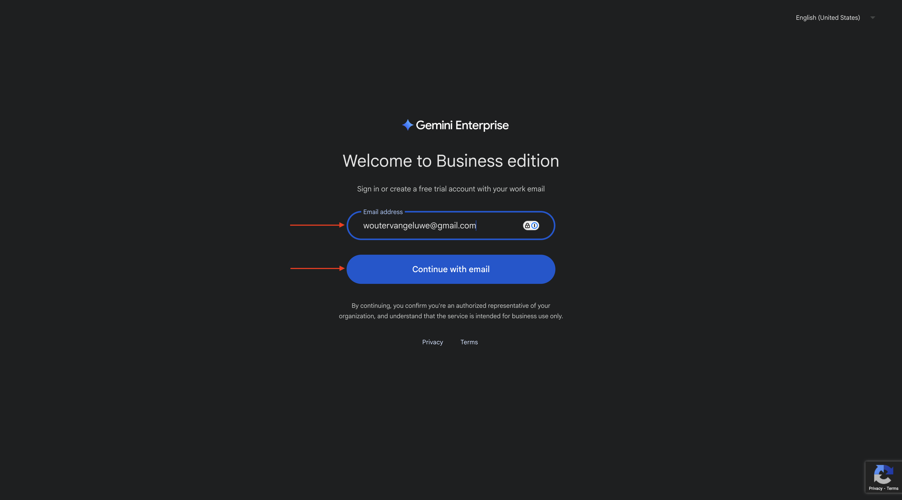

Indiquez vos nom et prénom, puis cliquez sur **Accepter et commencer**.


Cliquez sur **Je ferai ceci plus tard**.


Vous devriez alors voir ceci.


Accédez à [&#128279;](https://cloud.google.com/gemini-enterprise).

Vous devriez alors voir quelque chose comme ça. Vous devrez peut-être d’abord créer votre compte de facturation, puis le sélectionner ici par la suite.


Cliquez sur **Commencer une période d’essai gratuite de 30 jours**.


Cliquez sur **Continuer et activez l’API**.

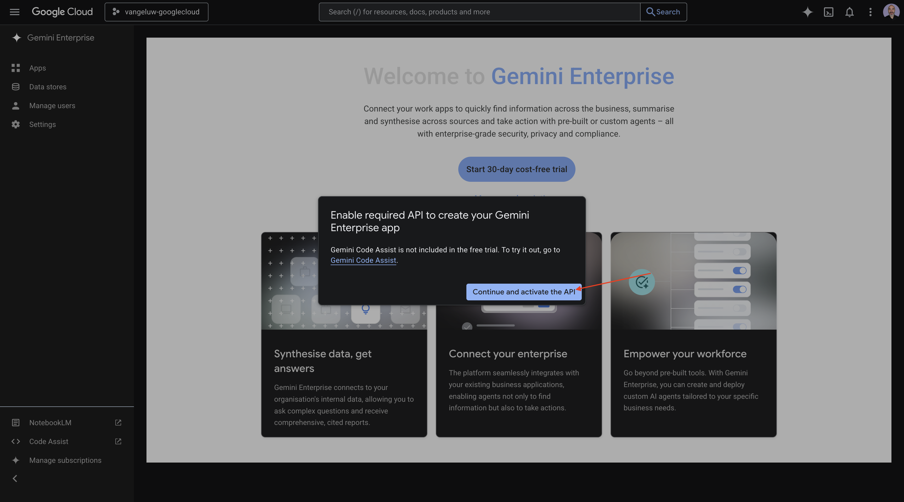

Cliquez sur **Créer**.


Vous devriez alors voir ceci.


## 1.1.4.2 Créer votre agent personnalisé à l’aide de A2A

Accédez à [&#128279;](https://console.cloud.google.com/gemini-enterprise). Cliquez sur **Agents**.


Cliquez sur **+Ajouter un agent**.

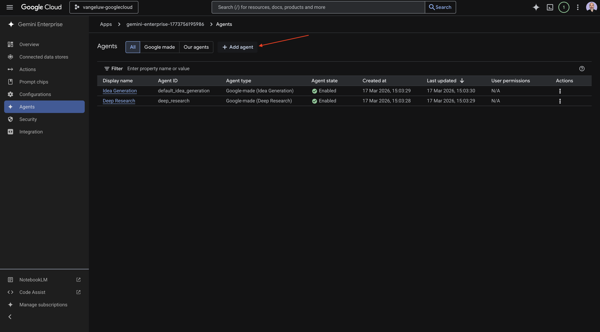

Sélectionnez **Agent personnalisé via A2A**.

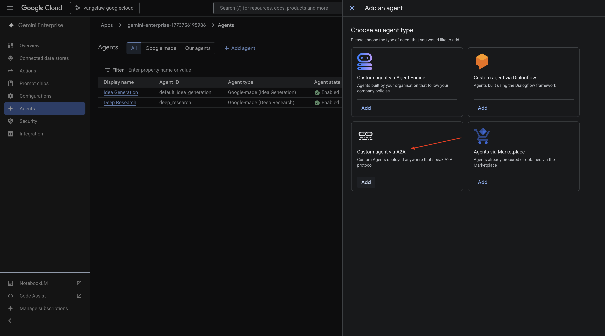

Collez le code **JSON de la carte d’agent**.

>[!NOTE]
>
>Contactez votre représentant Adobe pour obtenir les informations **JSON de la carte d’agent**.


Après avoir collé le **JSON de la carte d’agent**, cliquez sur **Prévisualiser les détails de l’agent**.

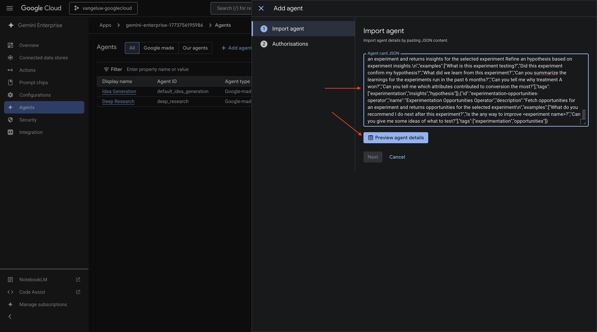

Vous devriez alors voir quelque chose comme ça. Faites défiler vers le bas et cliquez sur **Suivant**.


Vous devriez alors voir quelque chose comme ça.


Renseignez les champs de votre instance .

- **Identifiant client** :

```
--aepImsOrgId--
```

- **Secret client** :

```
AdobeMarketingAgent
```

- **URL d’autorisation** :

```
https://XXX.adobe.io/authorize
```

- **URL du jeton** :

```
https://XXX.adobe.io/token
```

- **Portées** :

```
openid email profile
```

Cliquez sur **Terminer**.

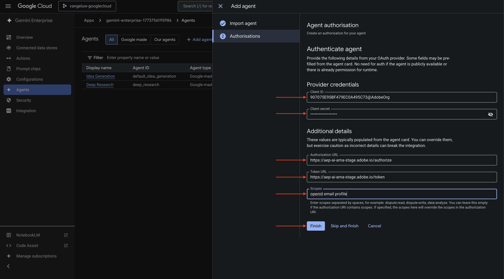

Vous devriez alors voir ceci.


## 1.1.4.3 Connexion à Adobe Marketing Agent

Accédez à **Aperçu** puis cliquez sur **Aperçu**.

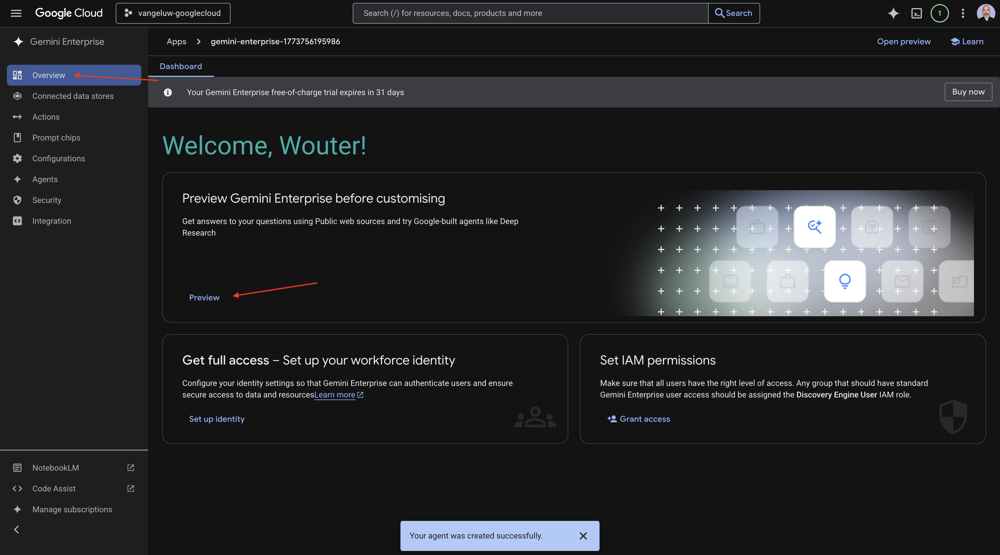

Cliquez sur **Commencer**

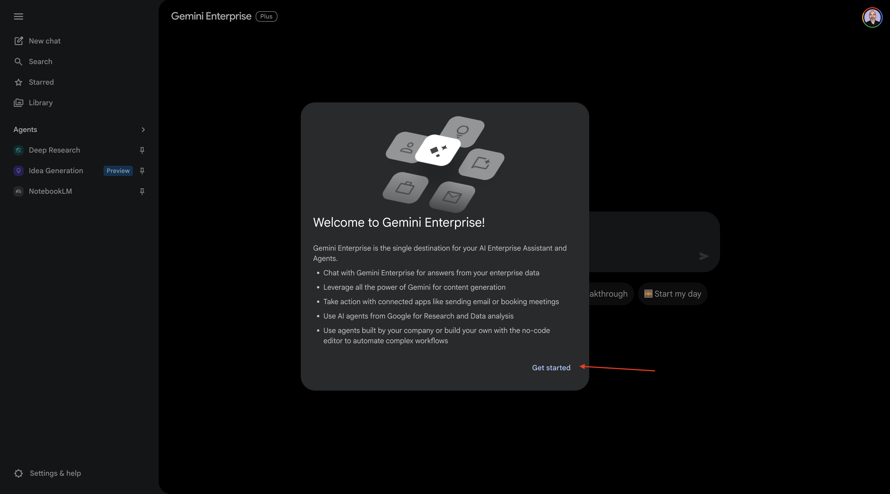

Accédez à **Agents**. Vous devriez voir **&#x200B;**&#x200B;ici.

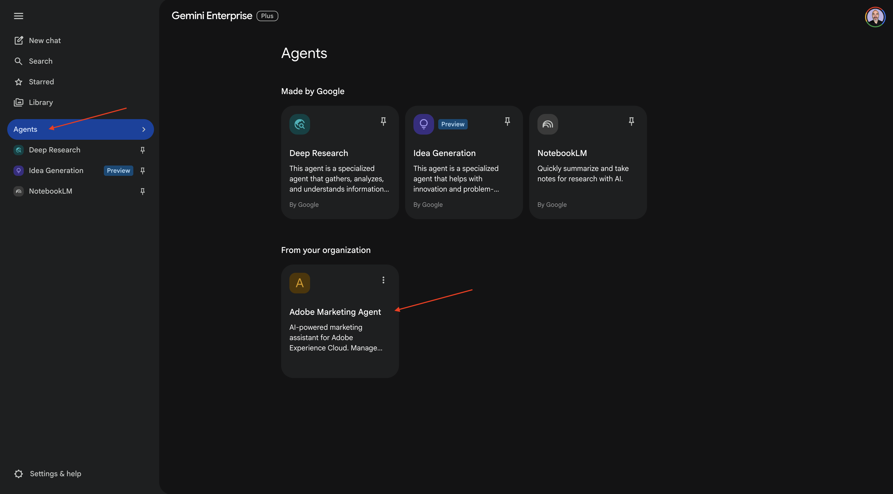

Cliquez sur le **de 3 points...**, puis sélectionnez **Épingler**.


Accédez à **Nouveau chat** et saisissez le symbole **@** dans le chat. Cliquez sur **&#x200B;**.


Saisissez la `login` de commande, puis cliquez sur **Envoyer**.


Vous devriez alors voir ceci. Cliquez sur **Autoriser**.


Cliquez sur **Autoriser l’accès** et effectuez la connexion à l’aide de votre Adobe ID, puis sélectionnez l’instance `--aepImsOrgName--` lorsque vous y êtes invité.

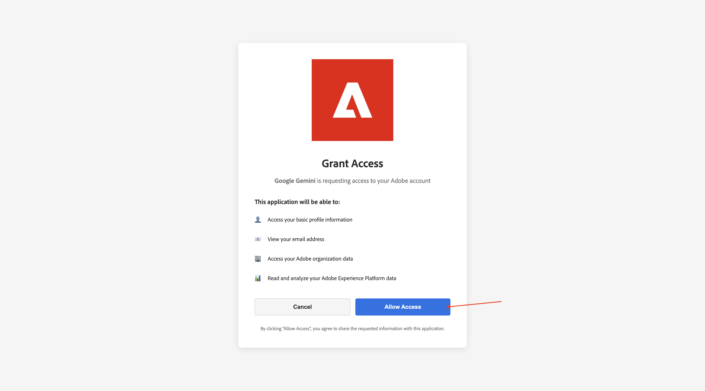

Vous devriez alors voir ceci.

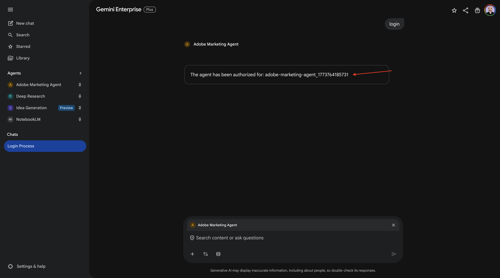

## 1.1.4.4 Définir le contexte dans Adobe Marketing Agent

Avant d’interagir davantage avec Adobe Marketing Agent via Copilot, le contexte doit être défini.

Pour cet exercice, le contexte doit être défini pour utiliser :

- **Sandbox** : **Prod - Accélérer (VA7)**

  Le paramètre sandbox permet d’identifier le sandbox que l’assistant AI doit examiner lorsqu’il pose des questions.

- **Vue de données** : **Accélérer le B2C 2026**

Le paramètre de vue de données permet d’identifier la vue de données que l’assistant AI doit examiner lors de la pose de questions.

Pour modifier le sandbox, saisissez la commande suivante, puis cliquez sur le bouton **envoyer**.

```javascript
list sandboxes
```

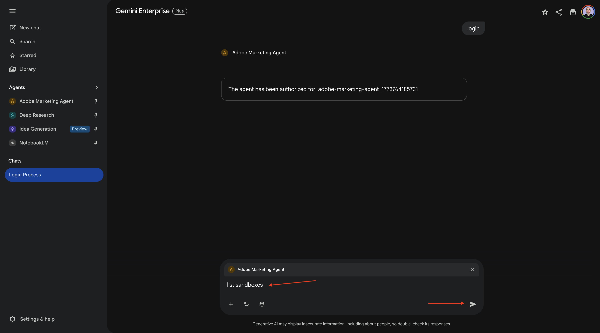

Vous devriez alors voir quelque chose de similaire à ceci. Saisissez la `switch to sandbox accelerate` de commande et cliquez sur le bouton **Envoyer**.


Vous devriez alors voir ceci. Pour modifier la vue de données, saisissez la commande suivante puis cliquez sur le bouton **envoyer**.

```javascript
list dataviews
```

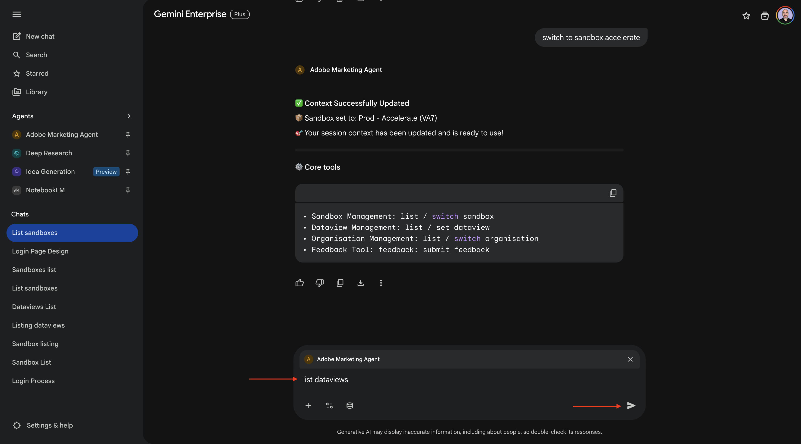

Vous devriez alors voir quelque chose de similaire à ceci. Saisissez la `switch dataview to Accelerate 2026 B2C` de commande et cliquez sur le bouton **Envoyer**.


Vous devriez alors voir ceci. Le contexte est maintenant correctement défini afin que vous puissiez commencer à envoyer des invites spécifiques.


## 1.1.4.5 Commencez par les tendances d’achat globales pour ancrer le contexte et zoomer sur la fibre

**Intention**

Obtenez une impulsion de niveau supérieur sur la demande de catégorie (mobile, fixe, Internet, télévision, fibre optique), en particulier pour les 60 derniers jours. Cela définit des niveaux de référence pour la saisonnalité, les effets de promotion et la variance régionale après le déploiement à New York.

Saisissez l’invite **Prompt** suivante, puis cliquez sur le bouton **envoyer**.

```javascript
Show me purchases by mainCategory over the last 7 months.
```


Vous devriez alors voir ceci :


Saisissez l’invite **Prompt** suivante, puis cliquez sur le bouton **envoyer**.

```javascript
Show me purchases by mainCategory = Fiber over the last 7 months broken down by week
```


Vous devriez ensuite voir ceci, qui examine les tendances spécifiques à la fibre optique.

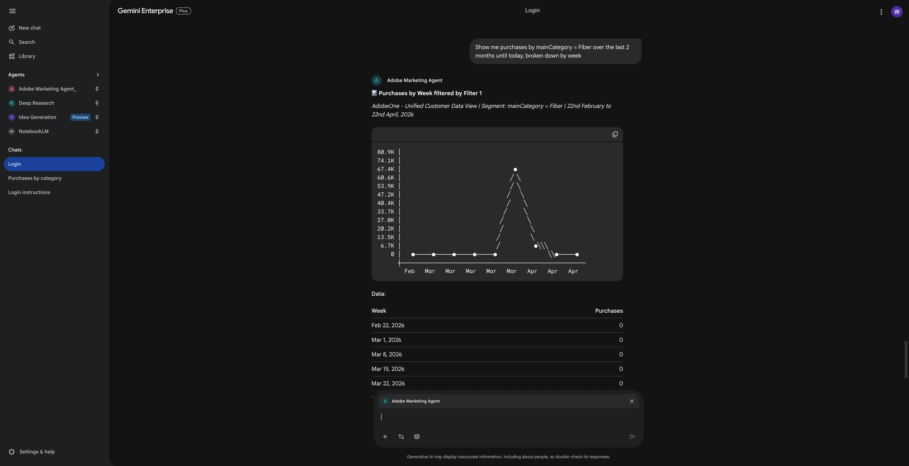

## 1.1.4.6 Corréler les commandes avec les préférences de contenu

**Intention**

Testez l&#39;hypothèse selon laquelle une préférence pour un genre spécifique (p. ex., science-fiction, sports, dramatique) prédit le comportement de mise à niveau de la large bande, en particulier pour les besoins en bande passante élevée.

Tout d’abord, vous devez déterminer quel champ est utilisé pour stocker la préférence de genre.

Saisissez l’invite **Prompt** suivante, puis cliquez sur le bouton **envoyer**.

```javascript
Which field is used to store the preferred genre
```


Vous devriez alors voir ceci, qui indique que le champ utilisé pour le genre est **_experienceplatform.individualFeatures.preferences.preferences.preferencesGenre**.


Avec ces informations, vous pouvez commencer à analyser en profondeur les données d’achat.

Saisissez l’invite **Prompt** suivante, puis cliquez sur le bouton **envoyer**.

```javascript
Show me ordersYTD by preferredGenre for the last 7 months
```


Vous devriez alors voir ceci.


## 1.1.4.7 Identifier Les Parcours Fibre Existants

**Intention**

Découvrez quels parcours actifs ou récemment conclus incluent « Fibre » dans le titre, par exemple, « Fibre Upgrade NYC - Sept », « Fibre Trial - Streaming Bundle ».

Saisissez l’invite **Prompt** suivante, puis cliquez sur le bouton **envoyer**.

```javascript
What journeys exist? 
```

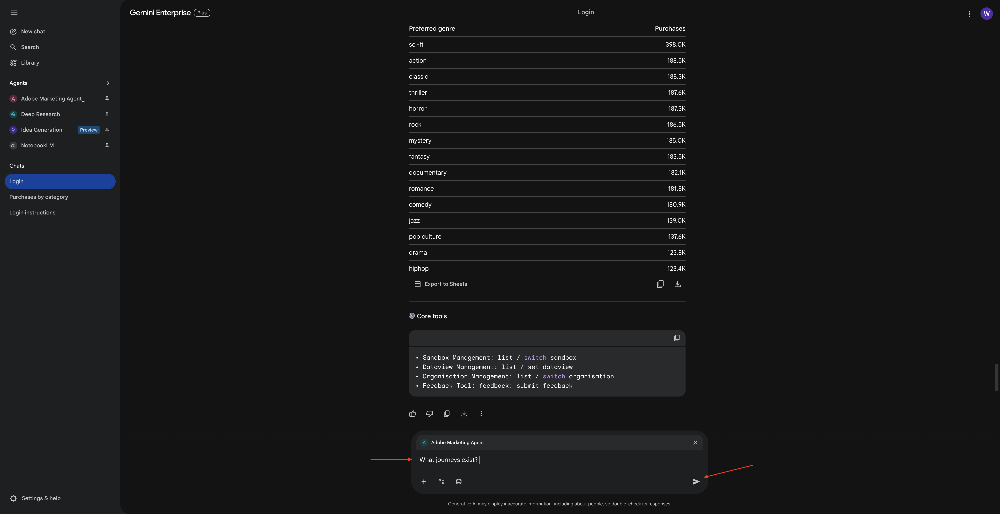

Vous devriez alors voir une liste des parcours.

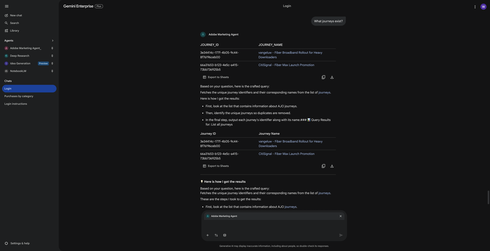

Saisissez l’invite **Prompt** suivante, puis cliquez sur le bouton **envoyer**.

```javascript
Which of these journeys has 'Fiber' in its name?
```


Vous devriez alors voir ceci.


Saisissez l’invite **Prompt** suivante, puis cliquez sur le bouton **envoyer**.

```javascript
Show me the details of the journey 'CitiSignal - Fiber Max Launch Promotion'
```


Vous devriez alors voir ceci.


## 1.1.4.8 Validation des performances du parcours via l’analyse des abandons

**Intention**

Vous souhaitez comprendre l’abandon des performances du parcours pour déterminer s’il existe des nœuds ou des conditions dans le parcours qui enregistrent un pourcentage élevé de profils abandonnés. Cela permet de comprendre si des ajustements supplémentaires sont nécessaires dans le parcours.

Saisissez l’invite **Prompt** suivante, puis cliquez sur le bouton **envoyer**.

```javascript
Create a fall-out report on the "CitiSignal - Fiber Max Launch Promotion" journey
```

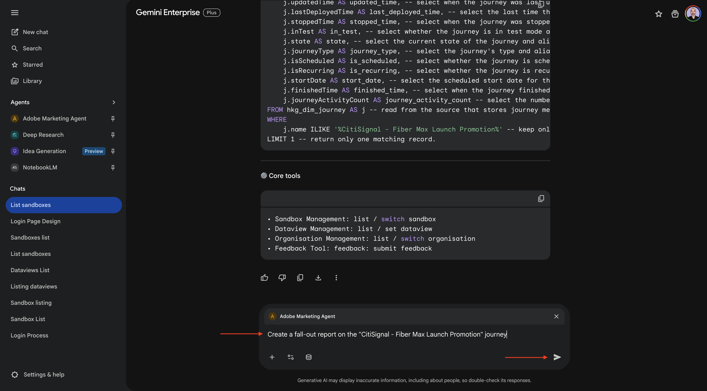

Vous devriez alors voir ceci.


Vous avez maintenant terminé ce Lab.

## Étapes suivantes

Accédez à [1.1.5 Adobe Marketing Agent pour Claude](./ex5.md){target="_blank"}

Revenir à [&#128279;](./agentorchestrator.md){target="_blank"}

[Revenir à tous les modules](./../../../overview.md){target="_blank"}
