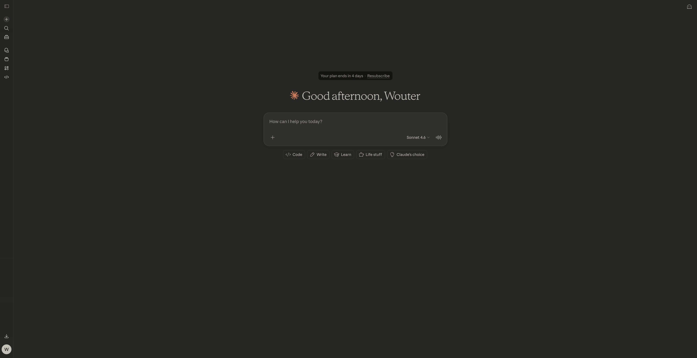
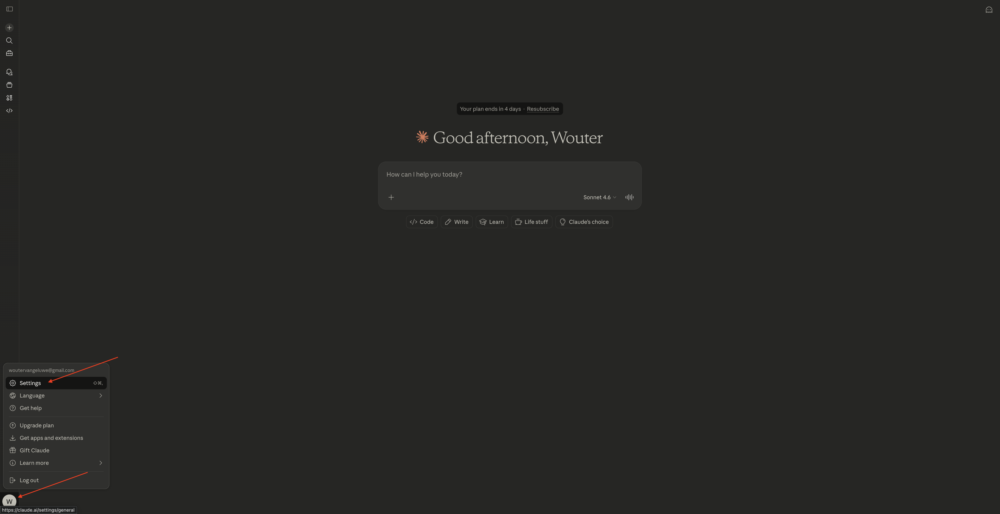
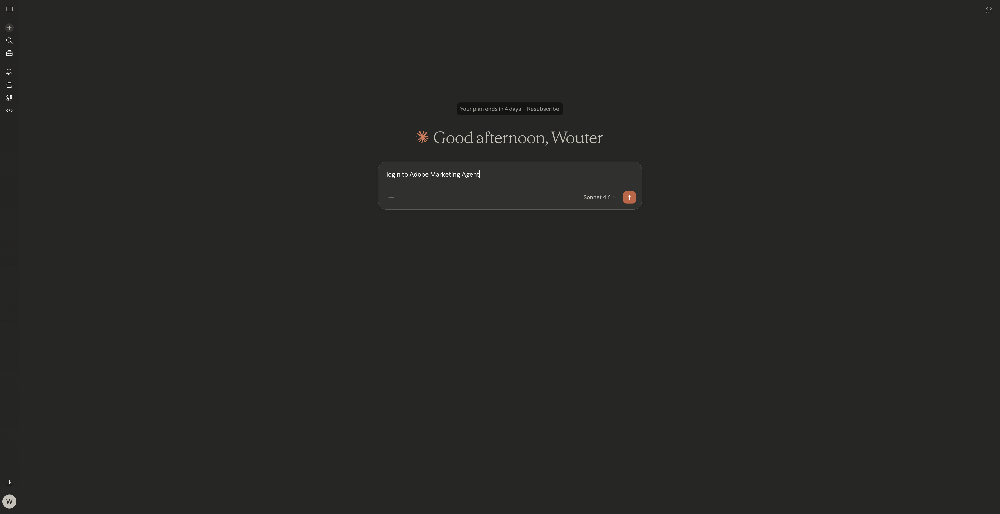
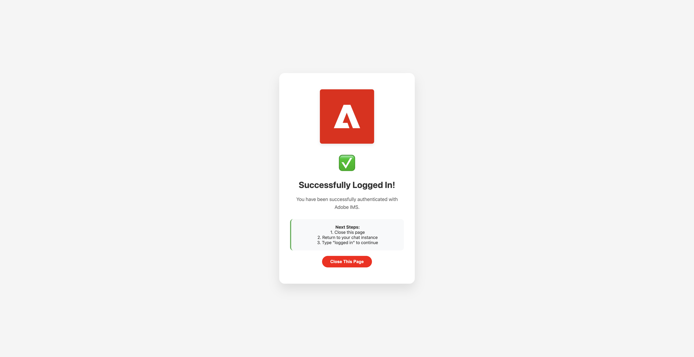
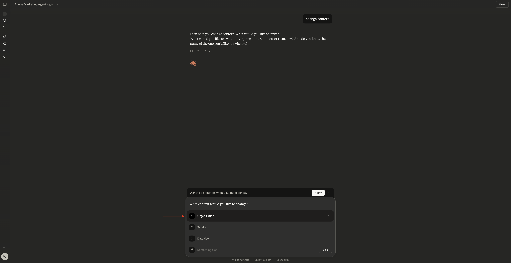
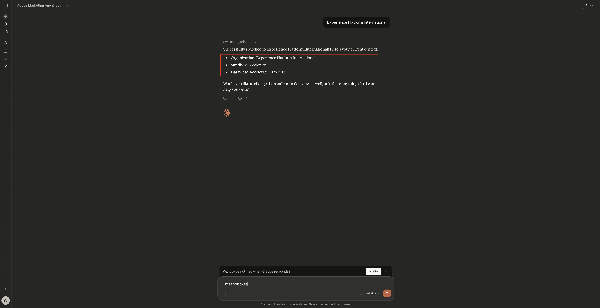
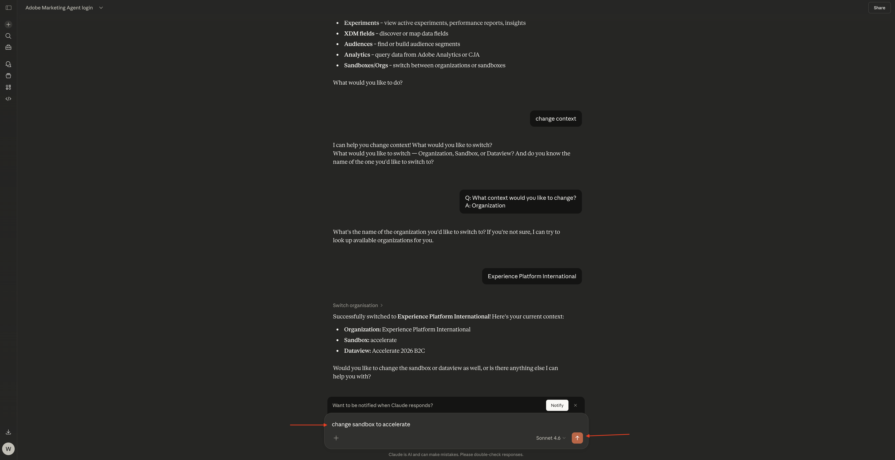

# 1.1.5 Adobe Marketing Agent pour Claude

[!BADGE Beta]

+++Détails Beta
En utilisant le Adobe Marketing Agent avec Claude Beta, vous reconnaissez que le Beta est fourni « en l&#39;état » sans garantie d&#39;aucune sorte. Adobe n’a aucune obligation de tenir à jour, corriger, mettre à jour, modifier, remplacer ou prendre en charge Beta. Il est recommandé de faire preuve de prudence et de ne pas se fier, de quelque manière que ce soit, au bon fonctionnement ou aux performances de ce Beta et/ou des éléments qui l’accompagnent. Le Beta est considéré comme des informations confidentielles d’Adobe.  Tout « commentaire » (informations relatives à la version Beta, y compris, mais sans s’y limiter, les problèmes ou défauts que vous rencontrez lors de son utilisation, les suggestions, les améliorations et les recommandations) que vous fournissez à Adobe est par la présente cédé à Adobe. Cela inclut tous les droits, titres et intérêts relatifs à ce commentaire.

+++

## Conditions préalables

Pour suivre les étapes de cet atelier, comme indiqué ci-dessous, vous devez disposer des droits d’accès suivants :

- Accès à Real-Time CDP, Journey Optimizer et Customer Journey Analytics
- Accès à l’assistant d’IA dans Adobe Experience Cloud
- Accès à AEP Agent Orchestrator
- Accès à Claude

## Vidéo

Dans cette vidéo, vous obtiendrez une explication et une démonstration de toutes les étapes impliquées dans cet exercice.

>[!VIDEO](https://video.tv.adobe.com/v/3482212?quality=12&learn=on)

Ce laboratoire est en cours de développement.

## 1.1.5.1 Créer une application personnalisée dans Claude.ai pour CJA

>[!NOTE]
>
>L’utilisation de Adobe Marketing Agent dans Claude.ai requiert les éléments suivants :
>- une version payante de Claude.ai

Accédez à [](https://claude.ai/){target="_blank"} et connectez-vous à l’aide des détails de votre compte. Une fois la connexion effectuée, vous devriez voir ceci.



Cliquez pour ouvrir votre compte, puis sélectionnez **Paramètres**.



Accédez à **Connecteurs** puis cliquez sur **Accéder à la personnalisation**.


Cliquez sur **+**, puis sélectionnez **Ajouter un connecteur personnalisé**.


Renseignez les champs comme suit :

- **Nom** : `Adobe Marketing Agent`
- **URL du serveur MCP** : demandez à votre représentant Adobe

Cliquez sur **Ajouter**.


Vous devriez alors voir ceci. Cliquez sur **+** pour démarrer une nouvelle conversation.


Cliquez sur l’icône **+**, accédez à **Connecteurs** et assurez-vous que **Adobe Marketing Agent** est activé.


## 1.1.5.2 Authentifier et définir le contexte

Avant d’interagir davantage avec Adobe Marketing Agent via Claude.ai, vous devez vous connecter et définir le contexte.

Saisissez l’invite suivante et cliquez sur **envoyer**.

```
login to Adobe Marketing Agent
```



Sélectionnez **Toujours autoriser**.


Cliquez sur le lien pour vous connecter à l’agent marketing **.


Cliquez sur **Ouvrir le lien**.


Cliquez sur **Autoriser l’accès**.


Une fois l’authentification terminée, vous devriez voir ceci. Revenez à Claude.



Saisissez la commande suivante, puis cliquez sur **envoyer**.

```javascript
logged in
```


Vous êtes maintenant connecté. L’étape suivante consiste à définir le contexte. Saisissez l’invite suivante et cliquez sur **envoyer**.


```javascript
change context
```


Sélectionnez **Organisation**. Vous pouvez également répéter cette commande pour modifier ultérieurement le sandbox et la vue de données.



Saisissez le nom de votre instance et cliquez sur **envoyer**.


Sélectionnez **Toujours autoriser**.


Vous devriez alors voir quelque chose comme ça.



Si le sandbox n’est pas encore défini correctement, vous pouvez utiliser la commande suivante pour passer au sandbox que vous devez utiliser. Cliquez sur **envoyer**. Vous pouvez également utiliser la `change context` de commande ci-dessus, puis sélectionner **sandbox**

```javascript
change sandbox to --aepSandboxName--
```



Si la vue de données n’est pas encore définie correctement, vous pouvez utiliser la commande suivante pour passer au sandbox que vous devez utiliser (remplacez XXX dans la commande ci-dessous par le nom de votre vue de données). Cliquez sur **envoyer**. Vous pouvez également utiliser la `change context` de commande ci-dessus, puis sélectionner **vue de données**

```javascript
change dataview to XXX
```


Une fois que les **Organisation**, **Sandbox** et **Vue de données** sont correctement définis, vous pouvez commencer à poser des questions à Adobe Marketing Agent.

## Étapes suivantes

Revenir à [](./agentorchestrator.md){target="_blank"}

[Revenir à tous les modules](./../../../overview.md){target="_blank"}
