# 1.1.6 Agent Orchestrator v2

[!BADGE Beta]

+++Détails Beta
En utilisant le Beta d’Agent Orchestrator v2, vous reconnaissez que le Beta est fourni « en l’état », sans garantie d’aucune sorte. Adobe n’a aucune obligation de tenir à jour, corriger, mettre à jour, modifier, remplacer ou prendre en charge Beta. Il est recommandé de faire preuve de prudence et de ne pas se fier, de quelque manière que ce soit, au bon fonctionnement ou aux performances de ce Beta et/ou des éléments qui l’accompagnent. Le Beta est considéré comme des informations confidentielles d’Adobe.  Tout « commentaire » (informations relatives à la version Beta, y compris, mais sans s’y limiter, les problèmes ou défauts que vous rencontrez lors de son utilisation, les suggestions, les améliorations et les recommandations) que vous fournissez à Adobe est par la présente cédé à Adobe. Cela inclut tous les droits, titres et intérêts relatifs à ce commentaire.

+++

## Conditions préalables

Pour suivre les étapes de cet atelier, comme indiqué ci-dessous, vous devez disposer des droits d’accès suivants :

- Accès à Real-Time CDP, Journey Optimizer et Customer Journey Analytics
- Accès à l’assistant d’IA dans Adobe Experience Cloud
- Accès à AEP Agent Orchestrator v2
- Node.js 18+ doit être installé sur votre système

## Configuration 1.1.6.1 d’Agent Orchestrator v2

### IAM

Ajoutez-vous au groupe ci-dessous à l’aide de l’IAM pour accéder aux informations d’identification LLM.

>[!NOTE]
>
>Certaines des instructions ci-dessous sont spécifiques à Adobe. Demandez à votre représentant Adobe de vous fournir des informations sur le GRP à utiliser.

```
GRP-XXX
```

### Installation d’Agent Orchestrator v2

Ouvrez une nouvelle fenêtre de terminal sur votre ordinateur.

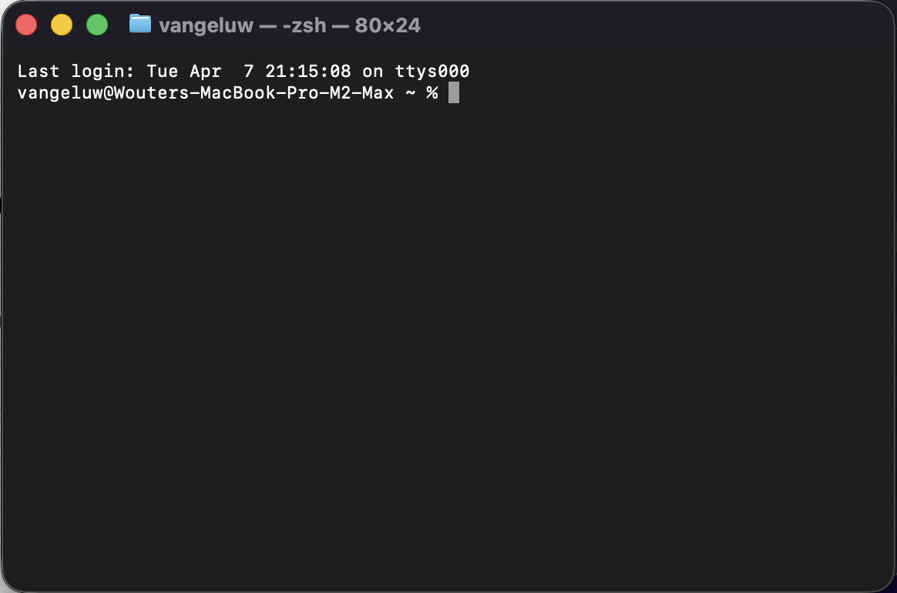

>[!NOTE]
>
>Les commandes ci-dessous nécessitent une URL spécifique à utiliser. Veuillez interroger votre représentant Adobe sur l’URL à utiliser.

Exécutez la commande suivante.

```
npm login --registry=https://XXX/ --auth-type=web
```


Vous devriez alors voir ceci. Appuyez sur **Entrée**.

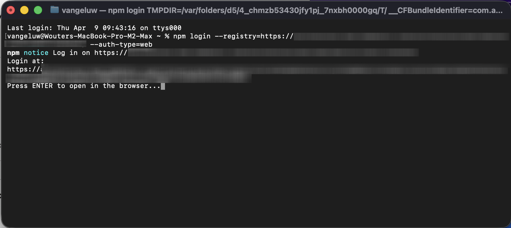

Sélectionnez **SSO SAML**.


Cliquez sur **Oui**.


Vous devriez alors voir ceci.


Exécutez la commande suivante.

```
npm install -g ao --no-fund --registry=https://XXX/
```


Vous devriez alors voir ceci. Exécutez la commande suivante :

```
ao --help
```


Agent Orchestrator v2 est maintenant installé. Exécutez la commande suivante pour démarrer **Agent Orchestrator v2**.

```
ao web
```

Vous devriez alors voir ceci. Appuyez sur **Entrée** pour ouvrir l’interface utilisateur web d’Agent Orchestrator v2.


## 1.1.6.2 Configurer Agent Orchestrator v2

Cliquez sur **Utiliser des LLM AO**.


Cliquez sur **Connexion à la production**.


Cliquez sur l’icône **calques**.


Sélectionnez **Assistant AEP AI (Exécution de code - BashKit)**.


Cliquez sur l’icône **profil**, puis sélectionnez **Paramètres**.


Accédez à **Plugins** et cliquez sur **cja**.


Cliquez sur **Installer**.


## 1.1.6.3 Définir le contexte

Cliquez sur **Nouvelle conversation**.

Vérifiez que votre instance est définie pour utiliser l’instance **Experience Platform International** et le sandbox **Accélérer**.

Saisissez la commande suivante, puis cliquez sur **Envoyer**.

```
list dataviews
```


Saisissez la commande suivante, puis cliquez sur **Envoyer**.

```
switch to dataview Accelerate 2026 B2C
```


Vous devriez alors voir ceci.


## 1.1.6.4 Commencez par les tendances d’achat globales pour ancrer le contexte et zoomer sur la fibre

**Intention**

Obtenez une impulsion de niveau supérieur sur la demande de catégorie (mobile, fixe, Internet, télévision, fibre optique), en particulier pour les 60 derniers jours. Cela définit des niveaux de référence pour la saisonnalité, les effets de promotion et la variance régionale après le déploiement à New York.

Saisissez l’invite **Prompt** suivante, puis cliquez sur le bouton **envoyer**.

```javascript
Show me purchases by mainCategory over the last 7 months.
```


Vous devriez alors voir ceci :

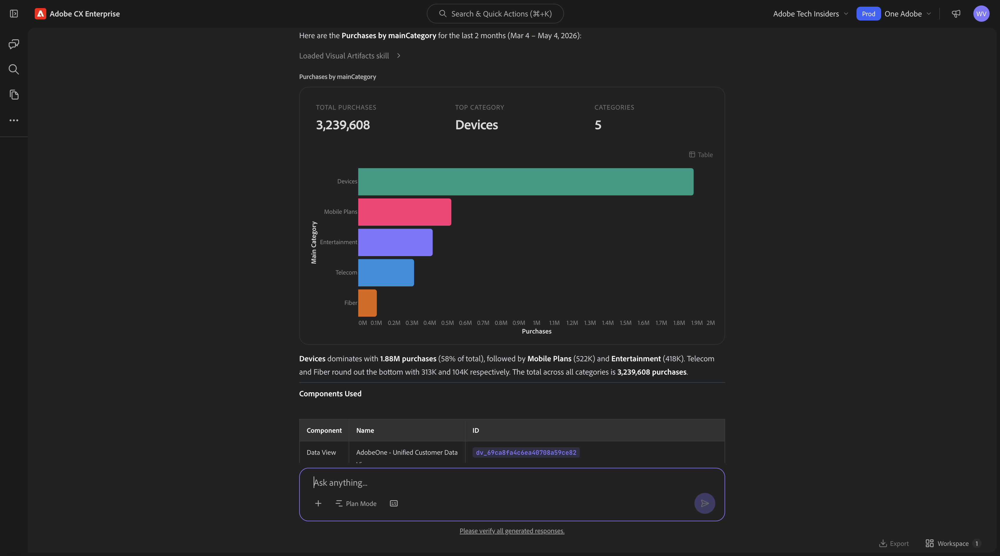

Saisissez l’invite **Prompt** suivante, puis cliquez sur le bouton **envoyer**.

```javascript
Show me purchases by mainCategory = Fiber over the last 7 months per week
```

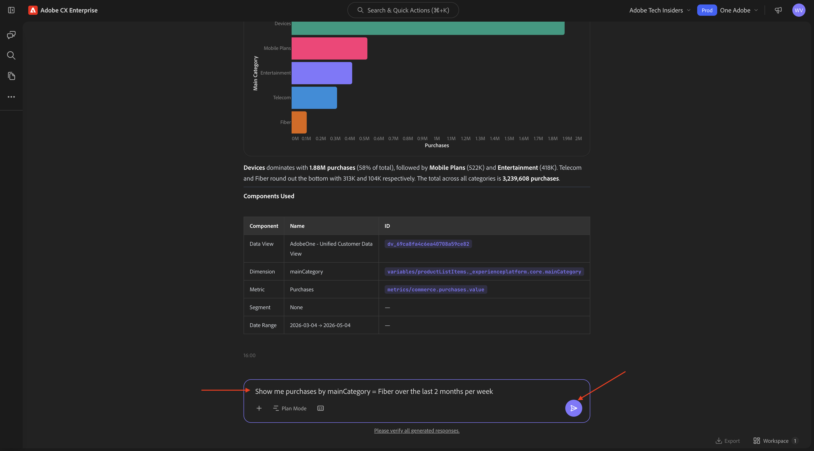

Vous devriez ensuite voir ceci, qui examine les tendances spécifiques à la fibre optique.


## 1.1.6.5 Corréler les commandes avec les préférences de contenu

**Intention**

Testez l&#39;hypothèse selon laquelle une préférence pour un genre spécifique (p. ex., science-fiction, sports, dramatique) prédit le comportement de mise à niveau de la large bande, en particulier pour les besoins en bande passante élevée.

Tout d’abord, vous devez déterminer quel champ est utilisé pour stocker la préférence de genre.

Saisissez l’invite **Prompt** suivante, puis cliquez sur le bouton **envoyer**.

```javascript
Which field is used to store the preferred genre?
```

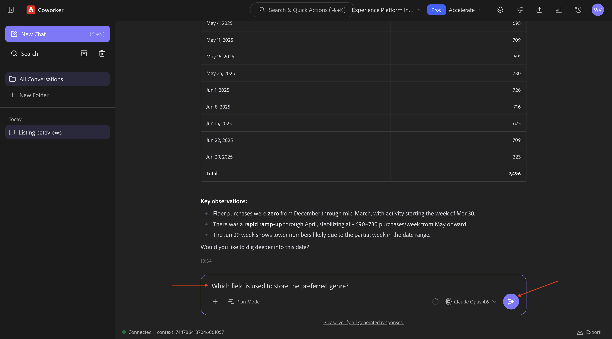

Vous devriez alors voir ceci, qui indique que le champ utilisé pour le genre est **_experienceplatform.individualFeatures.preferences.preferences.preferencesGenre**.


Avec ces informations, vous pouvez commencer à analyser en profondeur les données d’achat.

Saisissez l’invite **Prompt** suivante, puis cliquez sur le bouton **envoyer**.

```javascript
Show me ordersYTD by preferredGenre for the last 7 months
```

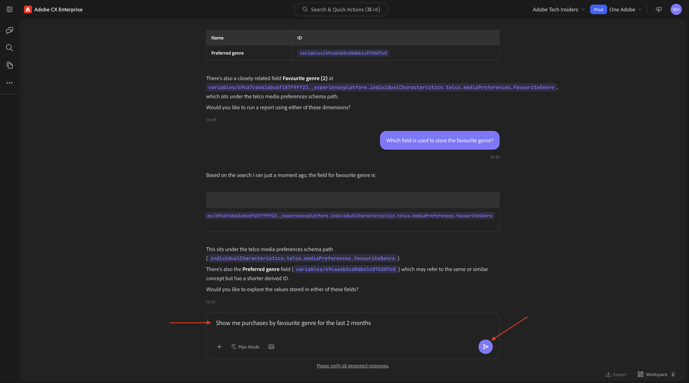

Vous devriez alors voir ceci.

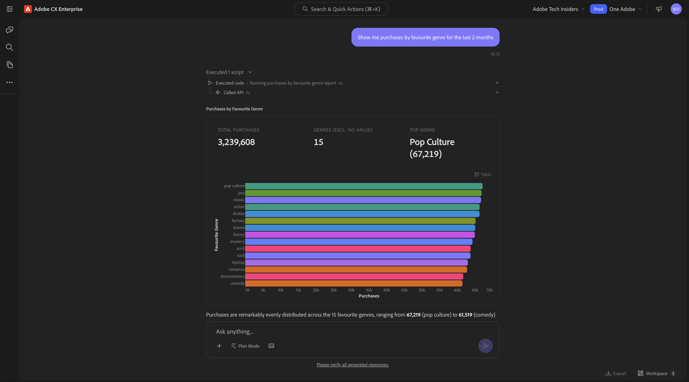


## 1.1.6.6 Identifier Les Parcours Fibre Existants

**Intention**

Découvrez quels parcours actifs ou récemment conclus incluent « Fibre » dans le titre, par exemple, « Fibre Upgrade NYC - Sept », « Fibre Trial - Streaming Bundle ».

Saisissez l’invite **Prompt** suivante, puis cliquez sur le bouton **envoyer**.

```javascript
What journeys exist? 
```

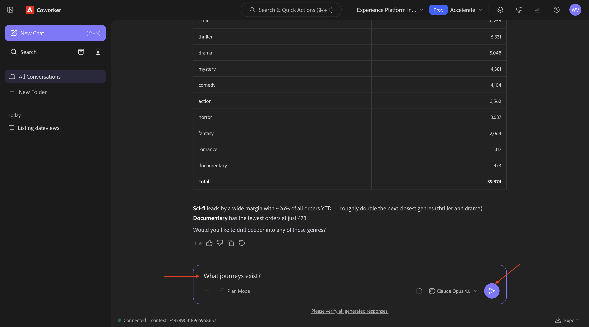

Vous devriez alors voir ceci.


Saisissez l’invite **Prompt** suivante, puis cliquez sur le bouton **envoyer**.

```javascript
Which of these journeys has 'Fiber' in its name?
```

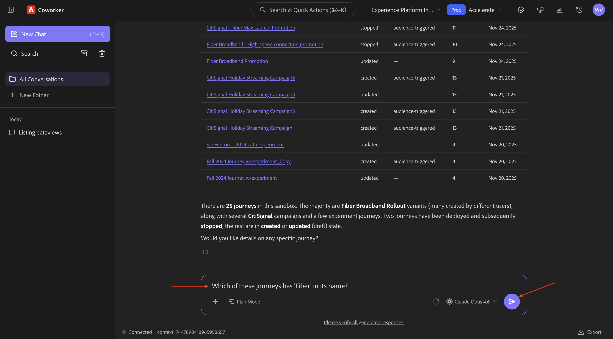

Vous devriez alors voir ceci. Cliquez sur le lien sur l’un des parcours.


Une nouvelle fenêtre s’ouvre et vous accédez immédiatement à l’aperçu des détails du Parcours.

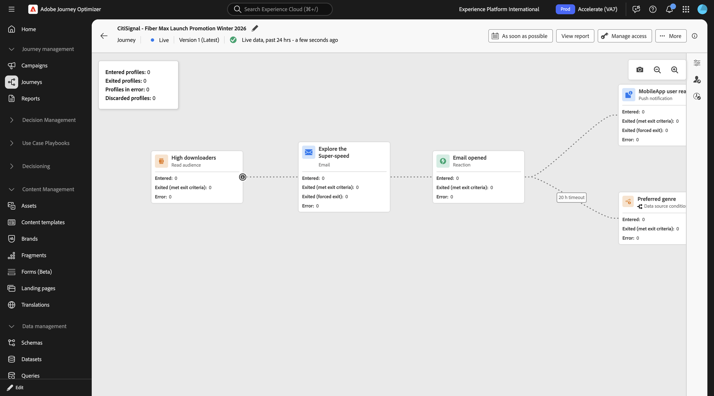

## 1.1.6.7 Vérifier quelle audience est utilisée

**Intention** :

Comprenez la définition de départ du parcours « CitiSignal - Promotion de lancement Fibre Max » : les caractéristiques qui ont motivé le ciblage (par exemple, « Préférence de genre SciFi », « Appareils 4+ », « Diffusion ≥ 300GB/mois »).

Saisissez l’invite **Prompt** suivante, puis cliquez sur le bouton **envoyer**.

```javascript
What was the initial audience in the journey named CitiSignal - Fiber Max Launch Promotion Winter 2026?
```

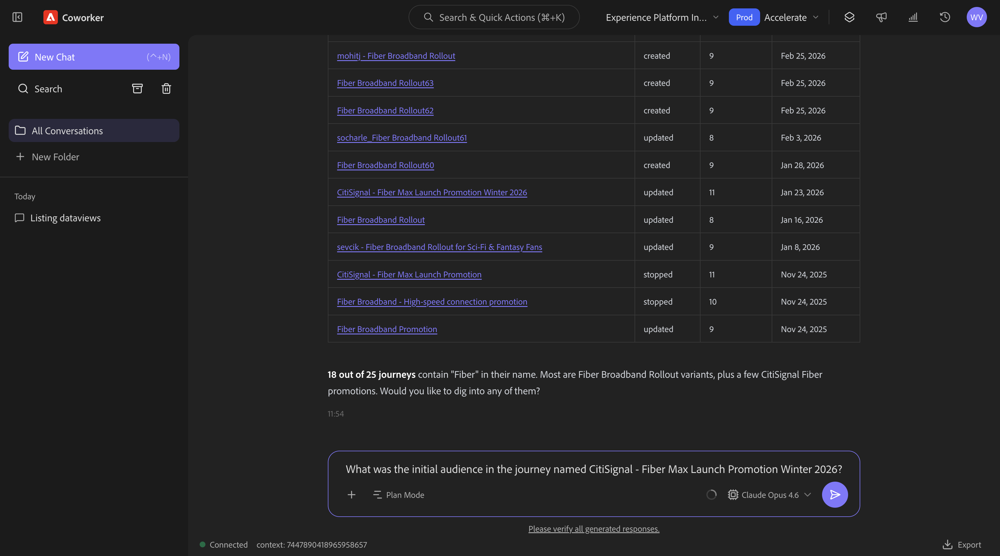

Vous devriez alors voir ceci.


## 1.1.6.8 Validation des performances du parcours via l’analyse des abandons

**Intention**

Vous souhaitez comprendre l’abandon des performances du parcours pour déterminer s’il existe des nœuds ou des conditions dans le parcours qui enregistrent un pourcentage élevé de profils abandonnés. Cela permet de comprendre si des ajustements supplémentaires sont nécessaires dans le parcours.

Saisissez l’invite **Prompt** suivante, puis cliquez sur le bouton **envoyer**.

```javascript
Create a fall-out report on the "CitiSignal - Fiber Max Launch Promotion" journey
```

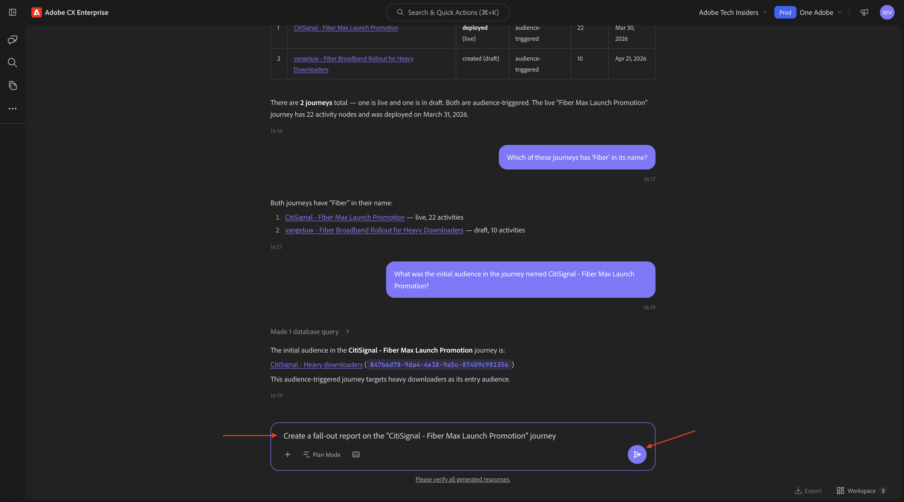

Vous devriez alors voir ceci.


## 1.1.6.9 Créer une audience

**Intention**

Sur la base des résultats et des recherches ci-dessus, il existe une corrélation entre les clients qui consomment beaucoup de données et qui ont un genre préféré de science-fiction ou de fantasy. Vous allez maintenant combiner ces attributs dans une audience.

Saisissez l’invite **Prompt** suivante, puis cliquez sur le bouton **envoyer**.

```javascript
Create an audience that combines people with an average download usage per month of over 2000 GB and a preferred genre of sci-fi or fantasy.
```


Examinez le plan. Cliquez sur **Accepter le plan**.


Votre audience a maintenant été créée.


>[!NOTE]
>
>Lors de la création d’une audience, il faudra 24 heures avant que l’audience ne soit disponible pour l’assistant d’IA à des fins d’utilisation ultérieure.

## 1.1.6.10 Rechercher les audiences existantes alignées sur une utilisation élevée et vérifier si elles sont en cours d’utilisation

**Intention** :

Localisez toute audience dont le nom comporte des « téléchargeurs volumineux », définis par des seuils mensuels d’utilisation des données.

>[!NOTE]
>
>À l’étape précédente, vous avez créé une nouvelle audience. Gardez à l’esprit qu’il faudra 24 heures avant que l’audience ne soit disponible pour l’assistant AI à des fins d’utilisation ultérieure. Vous devez maintenant utiliser une autre audience, déjà existante.

Saisissez l’invite **Prompt** suivante, puis cliquez sur le bouton **envoyer**.

```javascript
Is there an audience that has "heavy downloaders" in the title?
```


Vous devriez alors voir ceci. Vous souhaitez maintenant voir toutes vos audiences et à quel point elles ont changé au cours des derniers jours.

Saisissez l’invite **Prompt** suivante, puis cliquez sur le bouton **envoyer**.

```javascript
List how much these audiences changed over the last few days.
```


Vous devriez alors voir ceci. Cliquez sur **Afficher plus**.


Vous devriez alors voir ceci. Cliquez pour fermer le volet de droite.

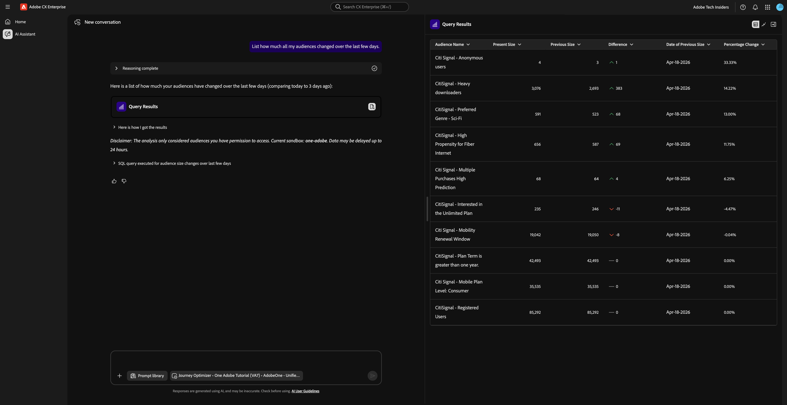

Faites défiler l’écran vers le bas pour passer en revue les étapes effectuées par l’assistant AI.

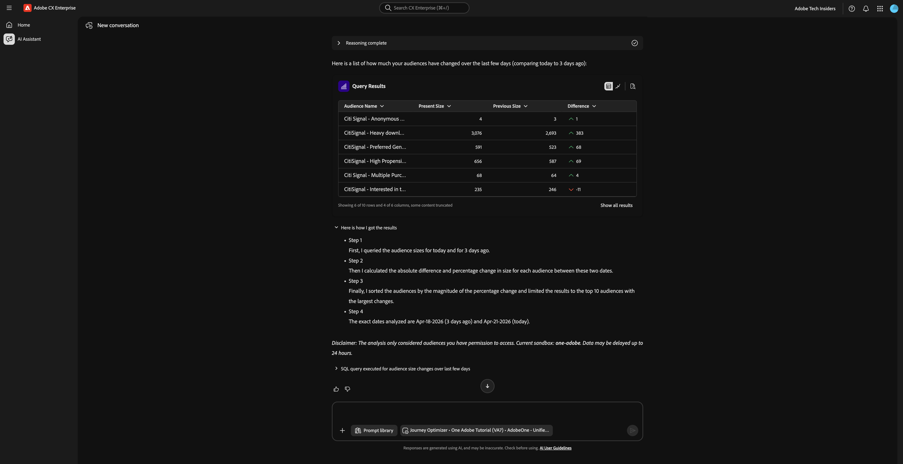

Il existe déjà certaines audiences pour les « téléchargeurs lourds ». Voyons s’ils sont déjà utilisés.

Saisissez l’invite **Prompt** suivante, puis cliquez sur le bouton **envoyer**.

```javascript
Which of the above are used in a journey? 
```

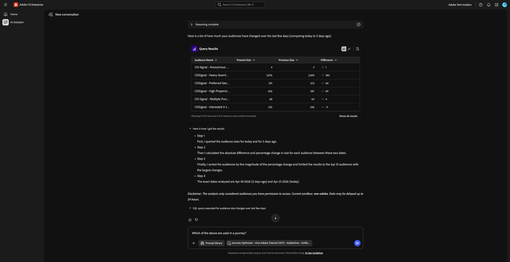

Vous devriez alors voir quelque chose de similaire à ceci.


Vous devez maintenant vérifier si ce parcours est actif. Saisissez l’invite **Prompt** suivante, puis cliquez sur le bouton **envoyer**.

```javascript
Are these journeys active? 
```


Vous devriez alors voir quelque chose de similaire à ceci. Aucun de ces parcours n’est en cours d’exécution.


Pour le lancement prochain de Fibre Max, vous devez maintenant créer un nouveau parcours.

## 1.1.6.11 Créer un nouveau Parcours pour Fibre Max Launch

**Intention** :

Créez un nouveau parcours ciblant l’audience composée :

Téléchargeurs lourds ∩ SciFi Preference.

Saisissez l’invite **Prompt** suivante, puis cliquez sur le bouton **envoyer**.

```javascript
Create a  journey towards the audience Heavy Downloaders - Sci-Fi Preference_kbaa_5207bf. The journey is for the rollout of fiber broadband. There will 2 versions of an email  based on  a split of the audience based on who is in the "Eligble for Fiber upgrade" audience.  After 3 days, profiles from both email treatments who have not purchased fibre max will be sent a follow up email. 
```

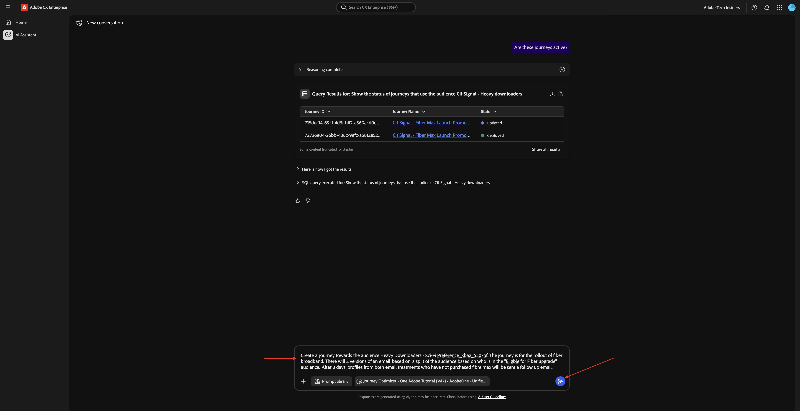

Vous devriez alors voir ceci. Saisissez `yes` et cliquez sur Générer.


Vous devriez alors voir ceci. Saisissez `yes` et cliquez sur Générer.


Vous devriez alors voir ceci. Saisissez `The first one` et cliquez sur Envoyer.


Vous devriez alors voir ceci. Saisissez `yes` et cliquez sur Envoyer.


Examinez la réponse. Saisissez `yes` et cliquez sur Envoyer.

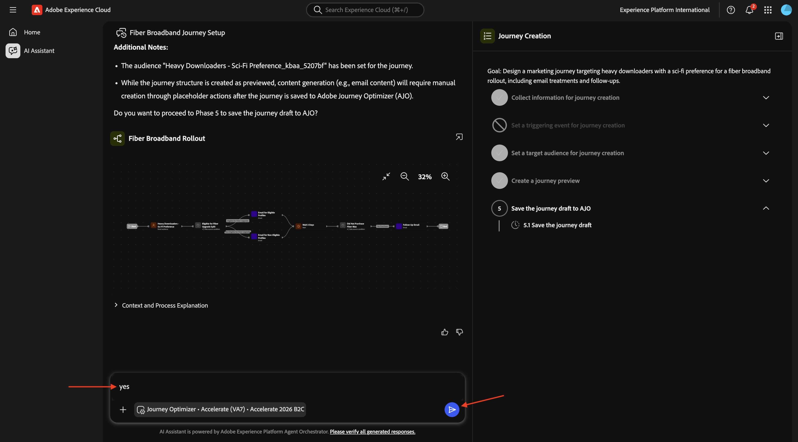

Cliquez sur **Vérifier**.


Mettez à jour le nom du parcours avec votre LDAP pour le rendre unique. Cliquez sur **Enregistrer**.


Votre parcours a été créé en mode brouillon.


## Gestion des conflits de Parcours 1.1.6.12

Saisissez l’invite **Prompt** suivante, puis cliquez sur le bouton **envoyer**.

```javascript
How can I manage journey conflicts?
```

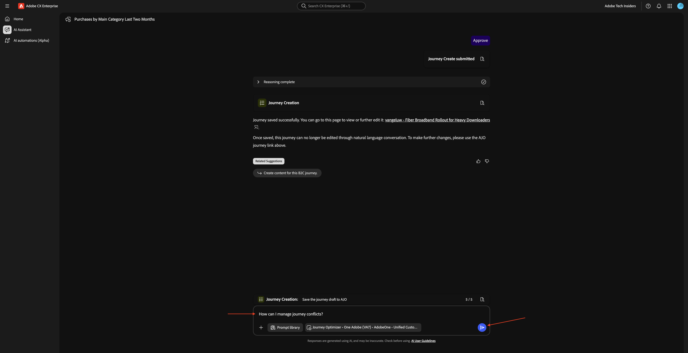

Consultez les informations.


Faites défiler vers le bas et sélectionnez l’**Sources** pour vérifier que les informations proviennent d’Experience League.


Saisissez l’invite **Prompt** suivante, puis cliquez sur le bouton **envoyer**.

```javascript
List any conflicts for the journey +CitiSignal Fiber Max
```

Sélectionnez ensuite manuellement le parcours **Promotion de lancement CitiSignal - Fibre max** dans la liste.


Vous devriez alors voir ceci. Cliquez sur **envoyer**.


Consultez les informations de conflit de parcours.


Faites défiler la page vers le bas pour rechercher plus de détails sur les conflits de parcours.


## Expériences 1.1.6.13

Saisissez l’invite **Prompt** suivante, puis cliquez sur le bouton **envoyer**.

```javascript
How are the experiments performing for the journey named 'CitiSignal - Fiber Max Launch Promotion'?
```


Vous devriez alors voir ceci :

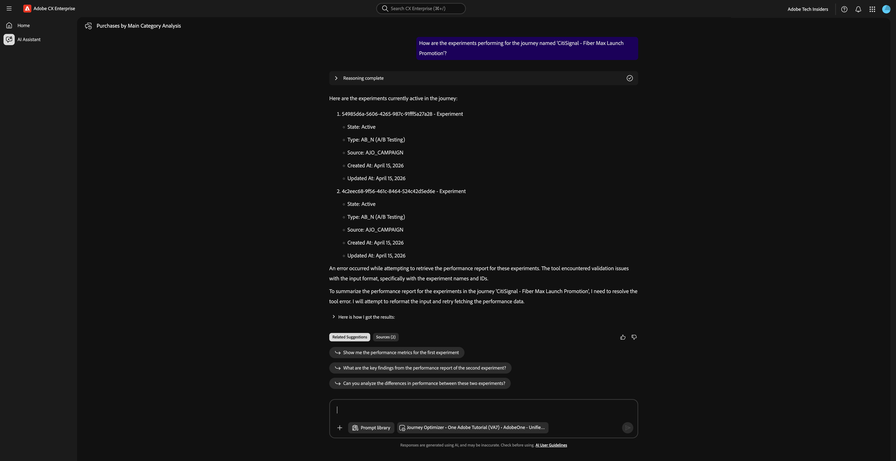

Faites défiler vers le bas et cliquez sur l’une des suggestions. Cliquez sur **envoyer**.

>[!NOTE]
>
>Les suggestions sont dynamiques. Vous devez donc vous attendre à voir des suggestions différentes chaque fois qu’une réponse est générée. Vos suggestions seront probablement différentes de celles affichées dans cette capture d’écran.


Vous devriez alors voir une réponse détaillée liée à la suggestion qui a été choisie.


Vous avez maintenant terminé ce Lab.

## Étapes suivantes

Revenir à [&#128279;](./agentorchestrator.md){target="_blank"}

[Revenir à tous les modules](./../../../overview.md){target="_blank"}
