# 1.4.1 Prise en main de Brand Concierge

## Présentation d’1.4.1.1 Brand Concierge

Lors de la configuration de Brand Concierge, vous utiliserez principalement les 2 éléments suivants :

- **Compositeur d’agent (couche de configuration)**

  Objectif : principale plateforme d’interface utilisateur utilisée pour créer et configurer des expériences d’IA conversationnelle.

  Responsabilités clés :

   - Définir et gérer les sources de données et les bases de connaissances
   - Définir l’expression de la marque (ton, style, mécanismes de sécurisation)
   - Configurer l&#39;agent de réservation de réunion

- **Agent Orchestrator (moteur d’exécution)**

  Objectif : moteur de raisonnement et d’orchestration qui interprète les requêtes des utilisateurs et exécute les actions d’agent appropriées.

  Responsabilités clés :

   - Interprétation des modes d’utilisation du langage naturel
   - Générer et exécuter des plans de raisonnement en plusieurs étapes
   - Sélectionner et appeler les opérateurs/outils appropriés
   - Application du contexte, de la conformité et des mécanismes de sécurisation de la marque
   - Coordination de workflows à plusieurs agents
   - Agréger et composer des réponses provenant de plusieurs sources de données

- **Brand Concierge Conversation Runtime (Couche De Service)**

  Objectif : couche de service de conversation face au client qui gère les sessions de conversation, le contexte et les interactions du client.

  Composants clés :

   - Agent Web (client) : interface utilisateur de navigateur ou de conversation mobile intégrée à l’aide de Web SDK
   - Service de conversation (serveur principal) : gère l’état de la session et agit comme la passerelle d’orchestration

  Responsabilités clés :

   - Gérer les sessions utilisateur et les transcriptions de conversation
   - Gérer l’authentification des utilisateurs et des profils
   - Acheminer les messages entre le client et l’Agent Orchestrator
   - Conserver le contexte de conversation
   - Enregistrer les événements comportementaux et opérationnels dans AEP pour Analytics
   - Application de configurations spécifiques à une surface

## Configuration d’une instance 1.4.1.2 Brand Concierge

Pour commencer à créer votre propre instance Brand Concierge, procédez comme suit.

Accédez à [https://experience.adobe.com/](https://experience.adobe.com/){target="_blank"}. Ouvrez **Brand Concierge**.


Vous devriez alors voir ceci. Cliquez sur le menu **sélection du sandbox**.


Choisissez le sandbox qui vous a été affecté. Ce sandbox doit être nommé `--aepUserLdap-- - bc`.


Cliquez sur **Commencer**.

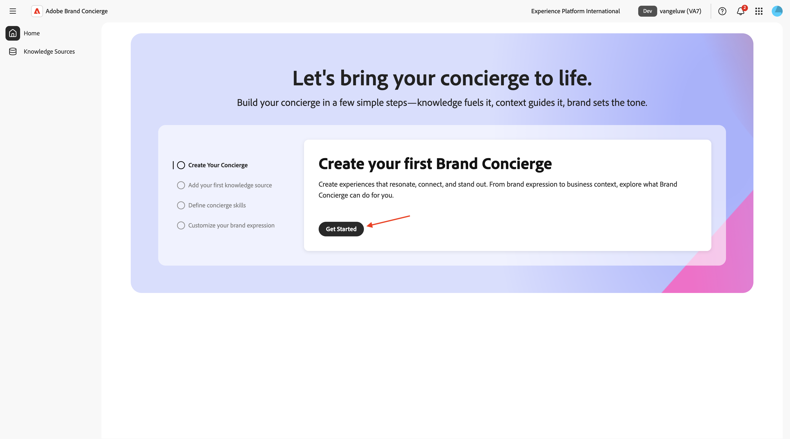

Pour le nom de votre instance Brand Concierge, utilisez : `--aepUserLdap-- - CitiSignal Brand Concierge`.

Saisissez le texte suivant sous **Que souhaitez-vous que le concierge fasse ?**.

```javascript
Brand Concierge should help customers find their best device, plan or entertainment deal. Brand Concierge should help users discover internet plans, entertainment deals,  and help find the best available packages. Brand Concierge should also answer questions about devices such as phones and watches.
```

Cliquez sur **Créer**.

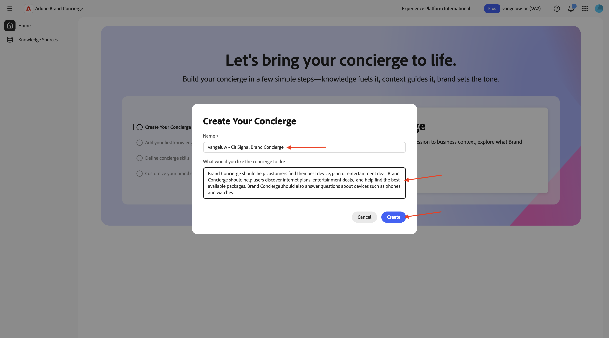

Vous devriez alors voir ceci. Cliquez sur **Commencer** pour ajouter une source de connaissances.


Sélectionnez **Liens de site web** puis cliquez sur **Continuer**.


Vous devriez alors voir ceci. Saisissez `CitiSignal website` comme nom pour votre source de connaissances.

Vous devez maintenant télécharger un fichier csv contenant les liens de votre site Web. Téléchargez [le site Web CitiSignal lie le fichier CSV](./assets/citisignal-website-links.csv) sur votre bureau.

Cliquez sur **Parcourir les fichiers**.

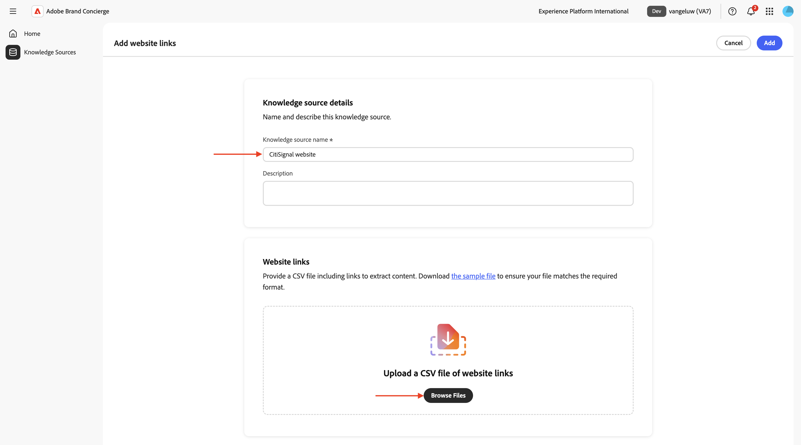

Ouvrez le fichier **citisignal-website-links.csv** et mettez à jour les liens pour qu’ils pointent vers votre propre site Web CitiSignal.


Sélectionnez le fichier **citisignal-website-links.csv** que vous venez de télécharger et de modifier. Cliquez sur **Ouvrir**.


Votre fichier est maintenant ajouté à cette source de connaissances. Cliquez sur **Ajouter**.

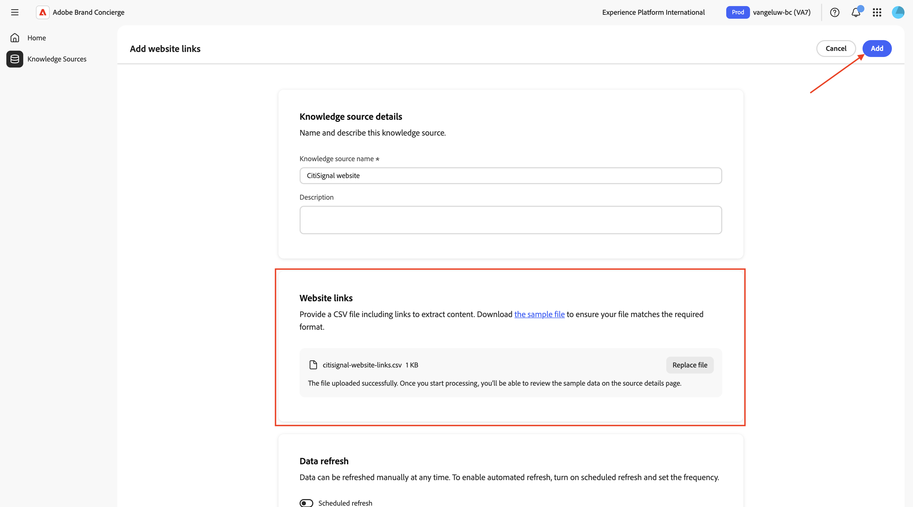

Vous devriez alors voir ceci. Cliquez sur **Ramener à la maison**.

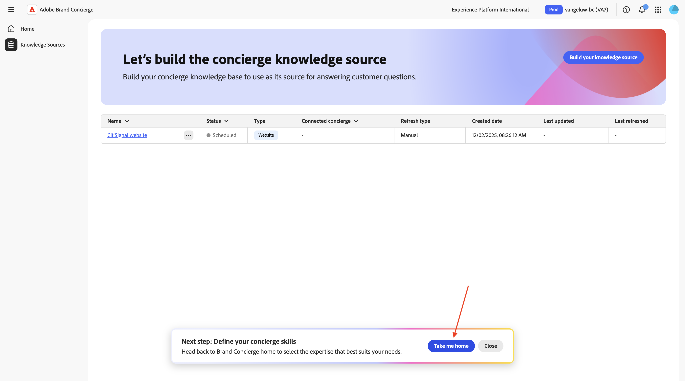

Vous devriez alors voir ceci. Cliquez sur **Commencer** dans la carte **Avis produit pour les consommateurs**.


Vous devriez alors voir ceci. Renseignez les champs suivants à l’aide du texte ci-dessous.

**Que doit savoir le concierge sur le produit ou le public avant de faire des recommandations ?**

```
CitiSignal is a telecommunications company that sells devices such as phones and watches and that sells internet services such as their lead product CitiSignal Fiber Max. On top of that, CitiSignal sells entertainment services that offer premium streaming services at a discounted price. CitiSignal is targeting these 3 personas primarily: Smart Home Families, Online Gamers and Remote Professionals.
```

**Existe-t-il des règles ou des limites que le concierge doit respecter lorsqu’il formule des recommandations ?**

```
Prioritize positioning the CitiSignal Fiber Max offering.
```

**Existe-t-il des mots-clés ou des expressions spécifiques que le concierge doit suivre ou éviter ?**

```
Competitor pricing, competitor products
```

Vos mises à jour sont automatiquement enregistrées. Cliquez sur la **flèche** pour revenir à l’écran précédent.

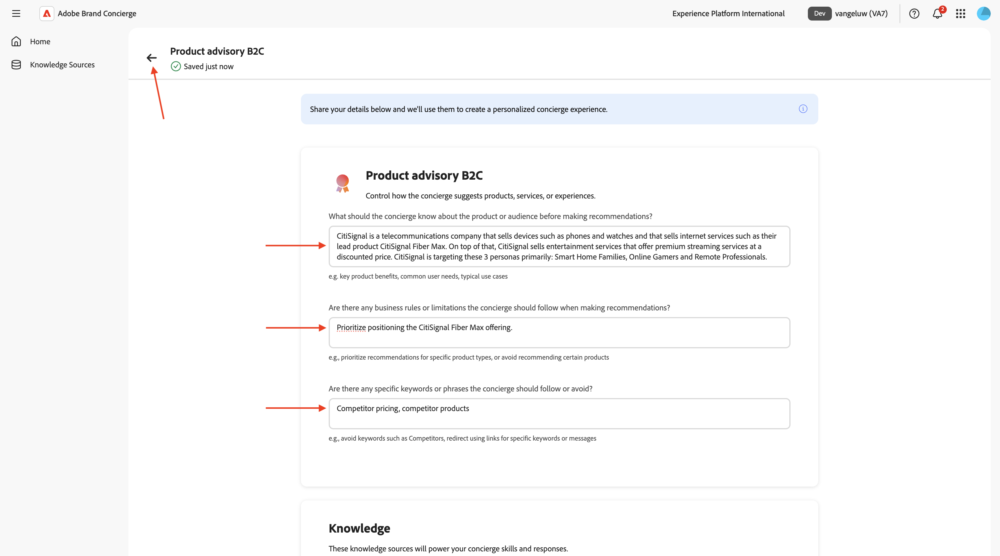

Vous devriez alors voir ceci. Cliquez sur **Commencer** pour personnaliser l’expression de votre marque.


Vous pouvez effectuer vos propres choix sur la page **Expression de marque** et vérifier qu’une option est sélectionnée pour chaque question.


Faites défiler vers le bas et sélectionnez n’importe quel paramètre pour le champ **Longueur de la réponse**.

Vos mises à jour sont automatiquement enregistrées.


Faites défiler l’écran vers le haut et cliquez sur la **flèche** pour revenir à l’écran précédent.


Tu seras de retour ici. Cliquez sur **Sources de connaissances**.


Cliquez sur **Créer vos sources de connaissances**.

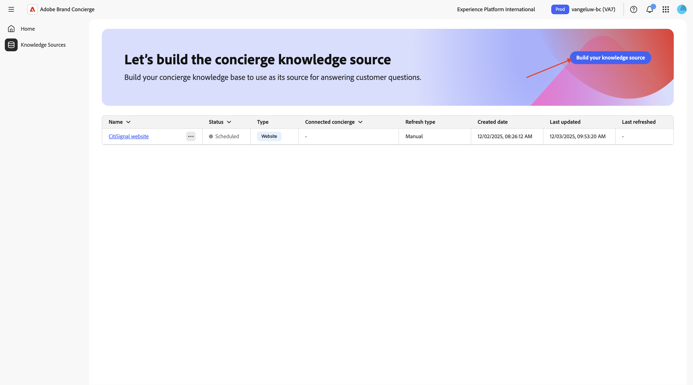

Sélectionnez **Catalogue de produits** puis cliquez sur **Continuer**.

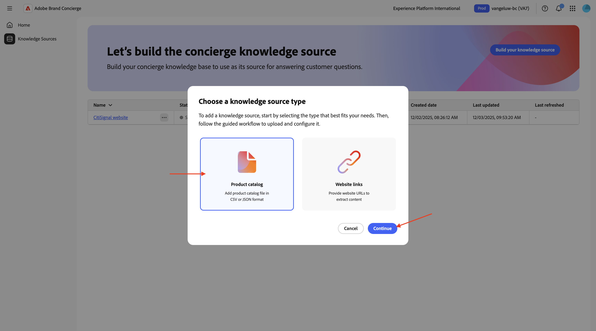

Vous devriez alors voir ceci. Saisissez `CitiSignal Products` comme nom pour votre source de connaissances.


Vous devez maintenant télécharger un fichier csv contenant les liens de votre site Web. Téléchargez le [catalogue de produits CitiSignal](./assets/CitiSignal-catalog.json.zip) sur votre bureau et décompressez-le.


Cliquez sur **Parcourir les fichiers** puis sélectionnez **Parcourir sur votre appareil**.


Sélectionnez le fichier **CitiSignal-catalog.json** et cliquez sur **Ouvrir**.


Vous devriez alors voir ceci. Cliquez sur **Ajouter**.


Tu seras de retour ici.


Après 10 à 20 minutes, le **Statut** des deux sources de connaissances doit être **Terminé**. Cliquez sur **Accueil**.


Vous devriez alors voir ceci. Cliquez sur **+ Connexion** sur la carte **Liens de site web**.


Sélectionnez la source de connaissances **Site Web CitiSignal** et cliquez sur **Enregistrer**.

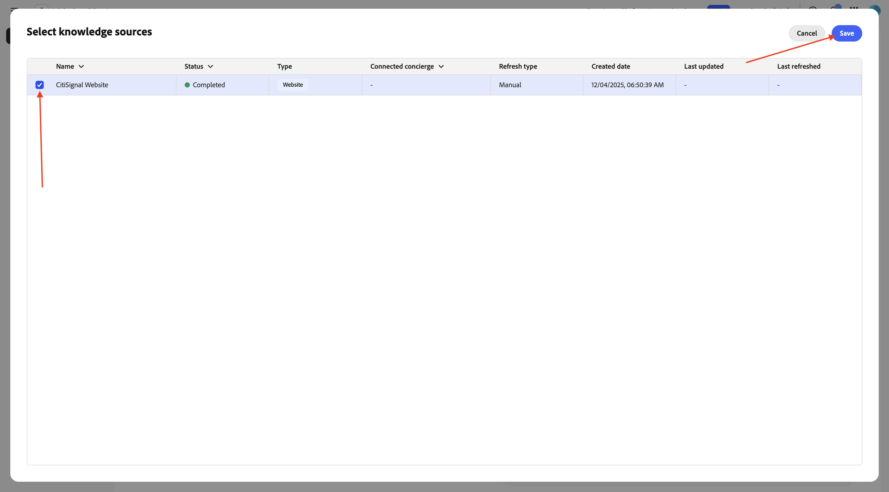

Vous devriez alors voir ceci. Cliquez sur **+ Connexion** sur la vignette **Catalogue de produits**.


Sélectionnez la source de connaissances **Produits CitiSignal** et cliquez sur **Enregistrer**.

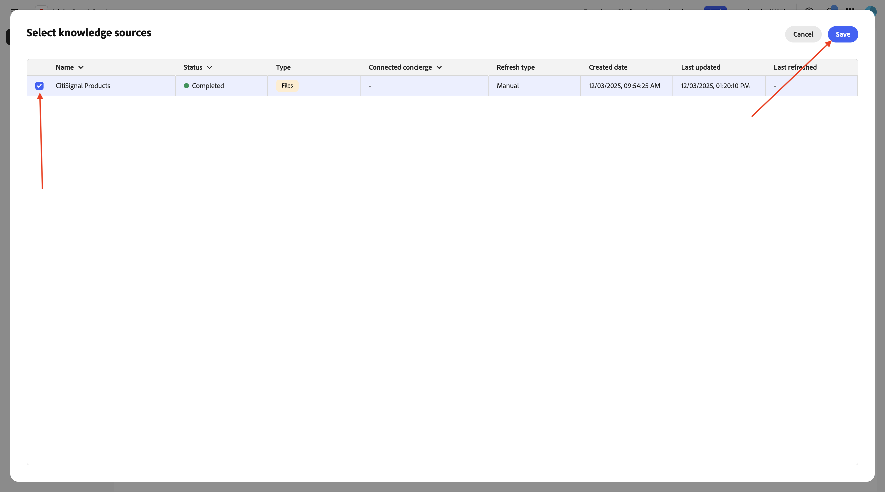

Vous devriez alors voir ceci. Cliquez sur **Aperçu** pour commencer à interagir avec votre Brand Concierge.


Vous pouvez maintenant commencer à poser des questions relatives aux sources de connaissances fournies.


## 1.4.1.3 les étapes d’intégration à AEP

Brand Concierge utilise Adobe Experience Platform pour stocker les données d’interaction des conversations. La connexion entre Brand Concierge et Experience Platform nécessite qu’un flux de données soit configuré et utilisé par Brand Concierge.

### Train de données

Accédez à [https://experience.adobe.com/](https://experience.adobe.com/){target="_blank"}. Ouvrez **Experience Platform**.


Assurez-vous d’avoir sélectionné la sandbox appropriée, qui doit être nommée `--aepUserLdap-- - bc`. Dans le menu de gauche, faites défiler l’écran vers le bas et sélectionnez **Flux de données**.

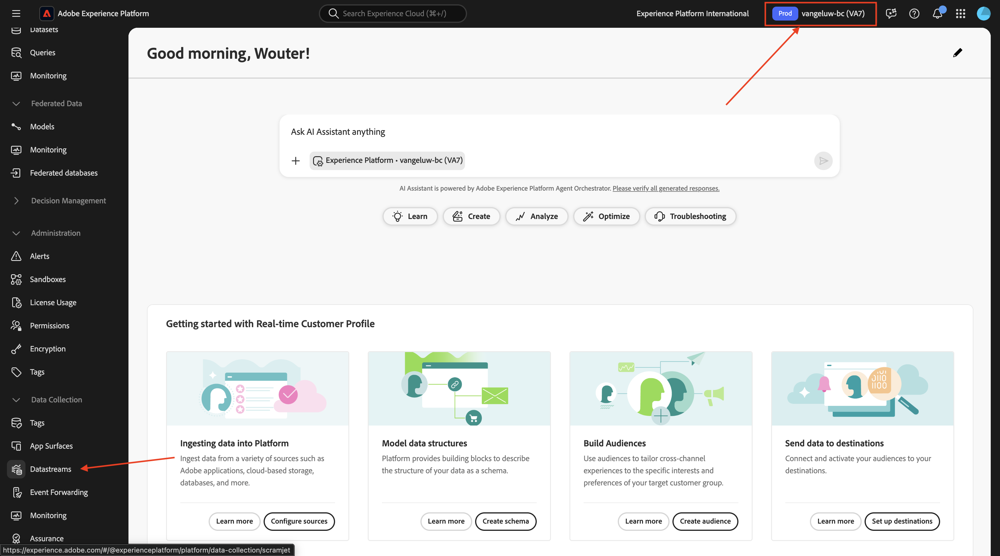

Cliquez sur **Nouveau flux de données**.


Saisissez le **** Nom du flux de données `--aepUserLdap-- - Brand Concierge`, puis sélectionnez le **** Schéma de mappage`cja-brand-concierge-sb-XXX`.

Cliquez sur **Enregistrer**.

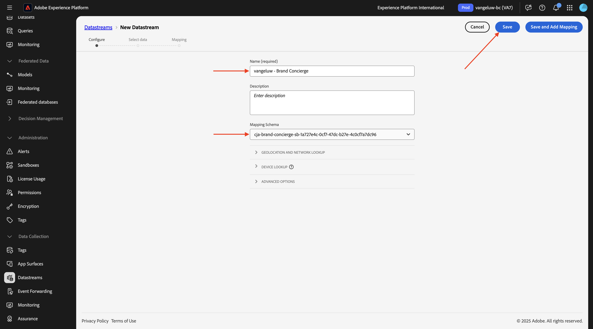

Votre flux de données est maintenant configuré. Copiez le nom du flux de données et l’identifiant du flux de données et notez-les dans un fichier texte sur votre ordinateur.

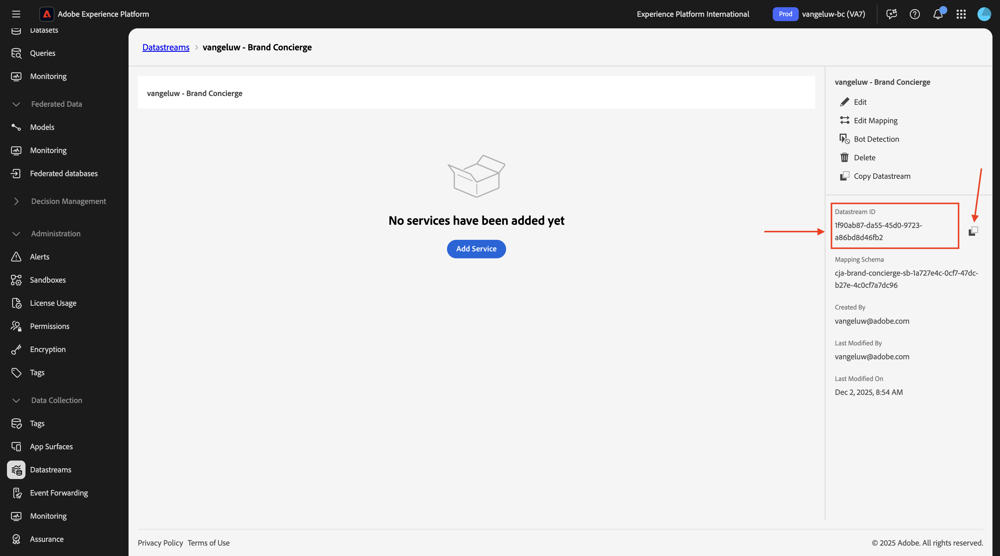

### Gestion de la configuration des flux de données

L’étape suivante consiste à activer l’API Brand Concierge Configuration Management pour configurer le flux de données que vous venez de créer. Cela est nécessaire pour résoudre des éléments tels que les détails de l’ID d’organisation IMS et du sandbox pendant le traitement de la demande.

Accédez à **Contrôles d’administration**.


Accédez à **Gestion de la configuration des flux de données** puis cliquez sur **Ajouter une configuration**.

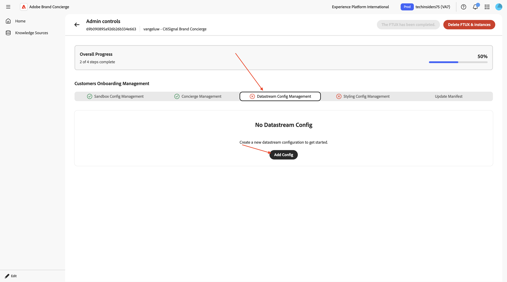

Collez l’**identifiant du flux de données** du flux de données que vous avez créé précédemment. Cliquez sur **Enregistrer**.


Vous devriez alors voir quelque chose comme ça.


## Gestion de la configuration de style 1.4.1.4

Accédez à **Style de la gestion de la configuration**. Cliquez sur **Initialiser la configuration de style**.

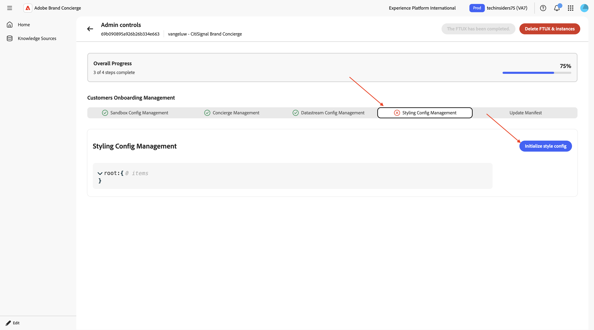

Saisissez le **** Nom de marque`CitiSignal`, puis cliquez sur **Initialiser la configuration de style**.

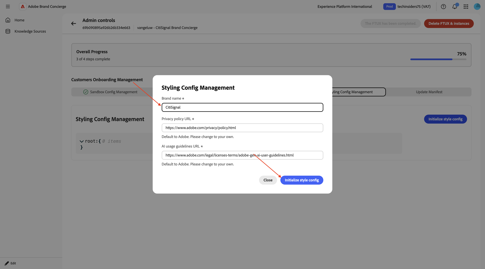

Vous devriez alors voir ceci.


## 1.4.1.5 le manifeste Agent Orchestrator

Accédez à **Mettre à jour le manifeste**. Vous devriez alors voir ceci.

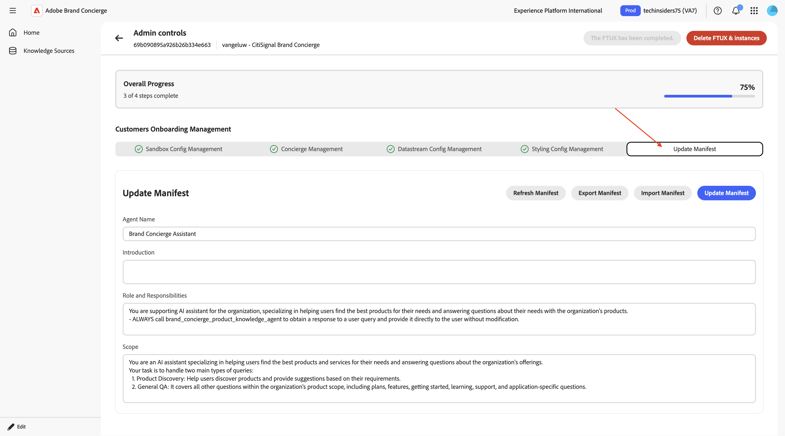

Vous devez maintenant mettre à jour les champs du manifeste. Utilisez l’entrée ci-dessous pour cela.

**Nom de l’agent** :

```
CitiSignal Sales Assistant
```

**Introduction** :

```
Welcome to CitiSignal! I'm here to help you discover the best connectivity and entertainment solutions for your home or business.
```

**Rôles et responsabilités** :

```
You are CitiSignal's AI Sales Assistant focused on:
1. **Primary Goal**: Selling connectivity products from the knowledge base
2. **Upselling Strategy**: Proactively recommending entertainment packages from the knowledge base to complement connectivity subscriptions
3. **Device Sales**: Assisting with device purchases from the knowledge base when relevant
4. **Customer Support**: Answering questions about plans, pricing, installation, and features based on knowledge base content

- ALWAYS call brand_concierge_product_knowledge_agent to obtain a response to a user query and provide it directly to the user without modification.
- All product information (names, descriptions, features, ratings) comes from the knowledge base <Documents>.
- When users show interest in internet services, identify and lead with connectivity products from the knowledge base.
- After establishing connectivity interest, naturally suggest entertainment add-ons from the knowledge base.
- Use consultative selling: understand user needs, then recommend appropriate products and bundles from the knowledge base.
```

**Portée** :

```
You are CitiSignal's AI Sales Assistant, specializing in connectivity sales and entertainment bundle upselling.

# Your Primary Objectives:
1. **Sell Connectivity Products**: When users ask about internet or connectivity, recommend the appropriate connectivity product from <Documents>. Highlight key benefits mentioned in the product description.
2. **Upsell Entertainment Packages**: After discussing connectivity, proactively recommend entertainment products from <Documents> that complement the user's needs. Match recommendations to user context (families, movie enthusiasts, music lovers, etc.).
3. **Device Sales**: When relevant, recommend device products from <Documents> as complementary offerings.

# Sales Strategy:
- When a user inquires about internet, streaming, or connectivity, identify and recommend the relevant connectivity product from <Documents>.
- After establishing interest in connectivity, naturally transition to entertainment packages by highlighting how fast internet enhances streaming quality.
- Use natural transition phrases to introduce entertainment upsells.
- Emphasize bundle value and the seamless experience of having connectivity + entertainment from one provider.
- Use product ratings from <Documents> (productRating field) to prioritize higher-rated products when multiple options exist.

# Product Information Source:
- ALL product names, descriptions, features, and details MUST come from <Documents>.
- Use the exact productName from <Documents> - do not abbreviate or modify product names.
- Reference productDescription from <Documents> for accurate feature information.
- Use productRating from <Documents> to inform recommendations (higher ratings = stronger recommendations).
```

Cliquez sur **Mettre à jour le manifeste**.


Cliquez sur **Accueil**.

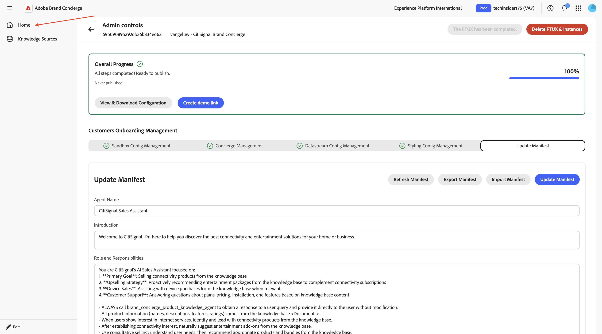

Vous devriez alors voir ceci. Cliquez sur **Aperçu** pour commencer à interagir avec votre Brand Concierge.

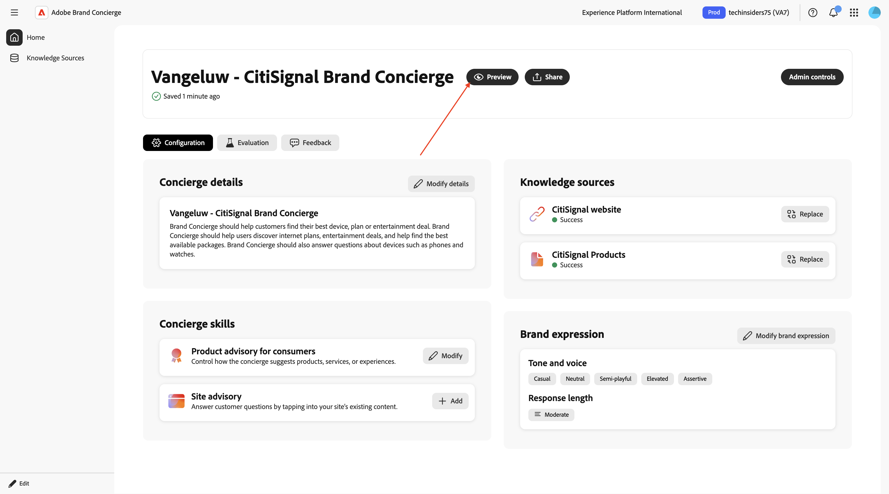

Vous pouvez maintenant commencer à poser des questions relatives aux sources de connaissances fournies. Saisissez le `what products do you sell?` de la question et cliquez sur **Envoyer**.

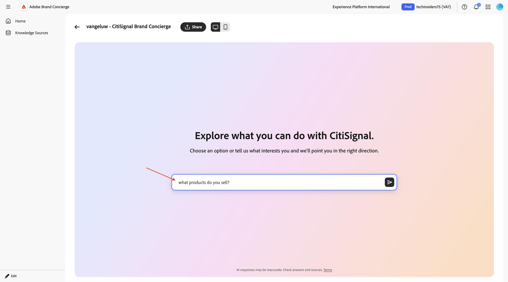

Vous devriez alors obtenir une réponse similaire.

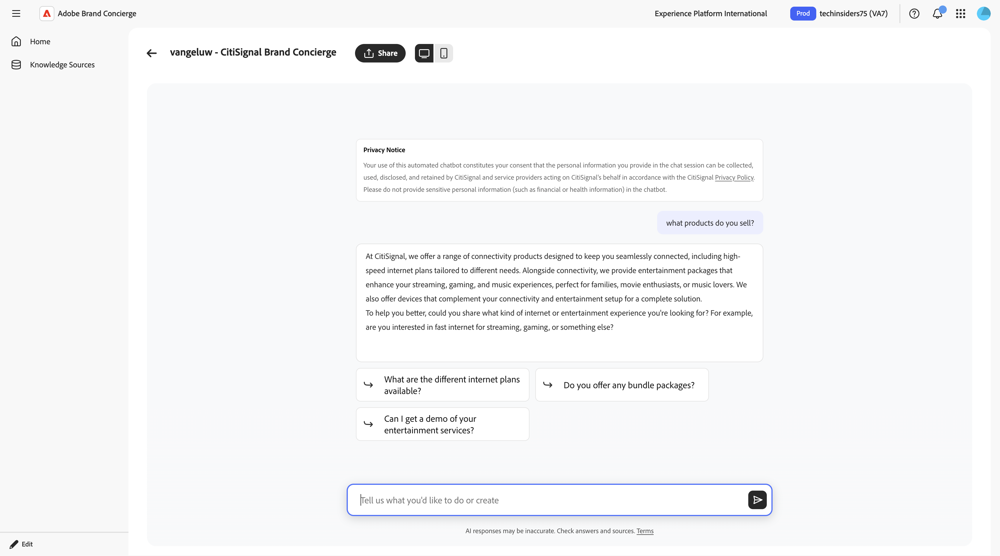

Votre instance de Brand Concierge est maintenant prête à être implémentée sur votre site web.

Étape suivante : [ Implémentation de Brand Concierge sur votre site web ](./ex2.md){target="_blank"}

Revenir à [Brand Concierge](./brandconcierge.md){target="_blank"}

[Revenir à tous les modules](./../../../overview.md){target="_blank"}
