# 1.4.1 Prise en main de Brand Concierge

## Présentation d’1.4.1.1 Brand Concierge

Lors de la configuration de Brand Concierge, vous utiliserez principalement les 2 éléments suivants :

- **Compositeur d’agent (couche de configuration)**

  Objectif : principale plateforme d’interface utilisateur utilisée pour créer et configurer des expériences d’IA conversationnelle.

  Responsabilités clés :

   - Définir et gérer les sources de données et les bases de connaissances
   - Définir l’expression de la marque (ton, style, mécanismes de sécurisation)
   - Configurer l&#39;agent de réservation de réunion

- **Agent Orchestrator (moteur d’exécution)**

  Objectif : moteur de raisonnement et d’orchestration qui interprète les requêtes des utilisateurs et exécute les actions d’agent appropriées.

  Responsabilités clés :

   - Interprétation des modes d’utilisation du langage naturel
   - Générer et exécuter des plans de raisonnement en plusieurs étapes
   - Sélectionner et appeler les opérateurs/outils appropriés
   - Application du contexte, de la conformité et des mécanismes de sécurisation de la marque
   - Coordination de workflows à plusieurs agents
   - Agréger et composer des réponses provenant de plusieurs sources de données

- **Brand Concierge Conversation Runtime (Couche De Service)**

  Objectif : couche de service de conversation face au client qui gère les sessions de conversation, le contexte et les interactions du client.

  Composants clés :

   - Agent Web (client) : interface utilisateur de navigateur ou de conversation mobile intégrée à l’aide de Web SDK
   - Service de conversation (serveur principal) : gère l’état de la session et agit comme la passerelle d’orchestration

  Responsabilités clés :

   - Gérer les sessions utilisateur et les transcriptions de conversation
   - Gérer l’authentification des utilisateurs et des profils
   - Acheminer les messages entre le client et l’Agent Orchestrator
   - Conserver le contexte de conversation
   - Enregistrer les événements comportementaux et opérationnels dans AEP pour Analytics
   - Application de configurations spécifiques à une surface

## Configuration d’une instance 1.4.1.2 Brand Concierge

Pour commencer à créer votre propre instance Brand Concierge, procédez comme suit.

Accédez à [&#128279;](https://experience.adobe.com/){target="_blank"}. Ouvrez **&#x200B;**.

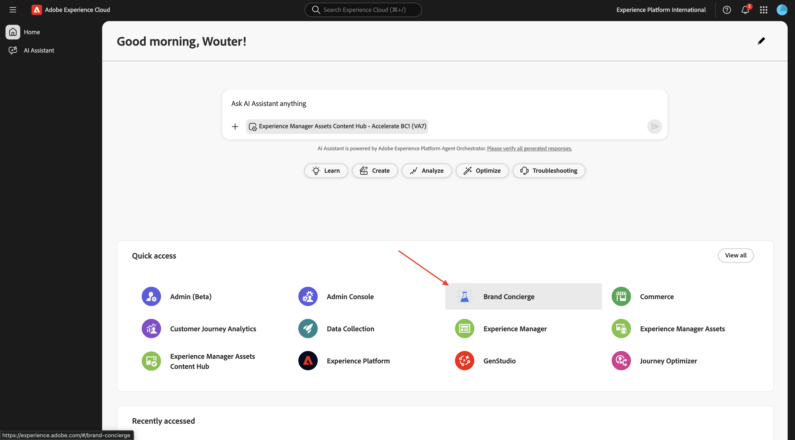

Vous devriez alors voir ceci. Cliquez sur le menu **sélection du sandbox**. Choisissez le sandbox qui vous a été affecté. Ce sandbox doit être nommé `techinsidersX` (remplacez X par le numéro qui vous a été attribué).

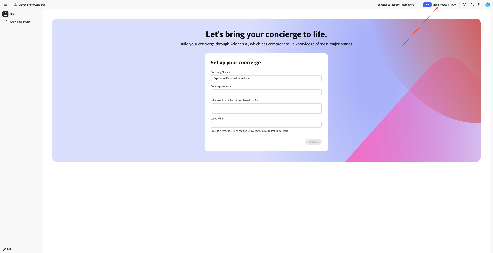

Renseignez ensuite les variables suivantes :

- **Nom de la société** : CitiSignal

- **nom du concierge** : `CitiSignal Sales Assistant`.

Saisissez le texte suivant sous **Que souhaitez-vous que le concierge fasse ?**.

```javascript
Brand Concierge should help customers find their best device, plan or entertainment deal. Brand Concierge should help users discover internet plans, entertainment deals,  and help find the best available packages. Brand Concierge should also answer questions about devices such as phones and watches.
```

- **Lien vers le site Web** : indiquez le lien vers le site Web que vous utilisez

Cliquez sur **Continuer**.


Vous devriez alors voir ceci. Ces informations ont été générées à l’aide de l’IA en fonction des entrées fournies sur la page précédente. Vérifiez les informations et une fois que vous en êtes satisfait, cliquez sur **Générer le concierge**.


Vous devriez alors voir ceci. Cliquez sur **+ Ajouter** en regard de **Avis aux consommateurs**.

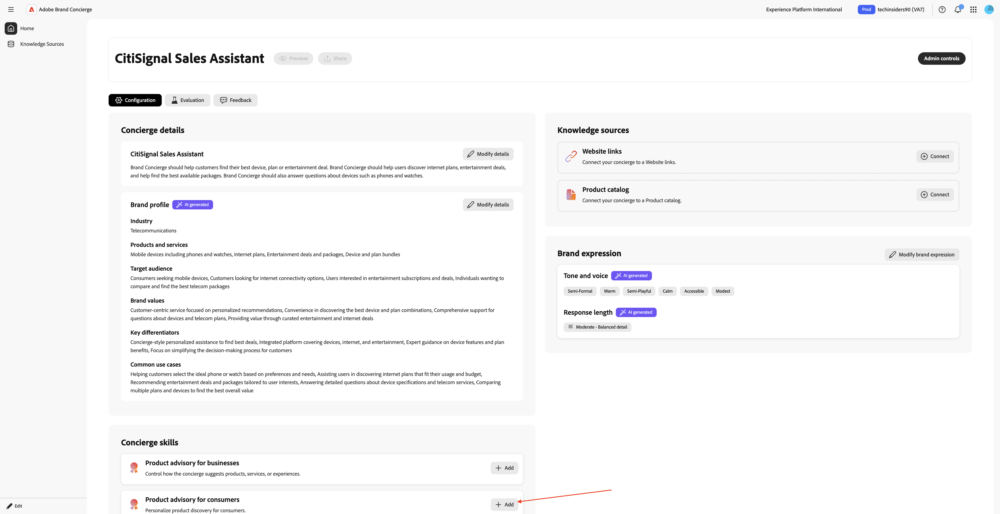

Vous devriez alors voir ceci. Renseignez les champs suivants à l’aide du texte ci-dessous.

**Que doit savoir le concierge sur le produit ou le public avant de faire des recommandations ?**

```
CitiSignal is a telecommunications company that sells devices such as phones and watches and that sells internet services such as their lead product CitiSignal Fiber Max. On top of that, CitiSignal sells entertainment services that offer premium streaming services at a discounted price. CitiSignal is targeting these 3 personas primarily: Smart Home Families, Online Gamers and Remote Professionals.
```

**Existe-t-il des règles ou des limites que le concierge doit respecter lorsqu’il formule des recommandations ?**

```
Prioritize positioning the CitiSignal Fiber Max offering.
```

**Existe-t-il des mots-clés ou des expressions spécifiques que le concierge doit suivre ou éviter ?**

```
Competitor pricing, competitor products
```

Cliquez sur **Enregistrer**.

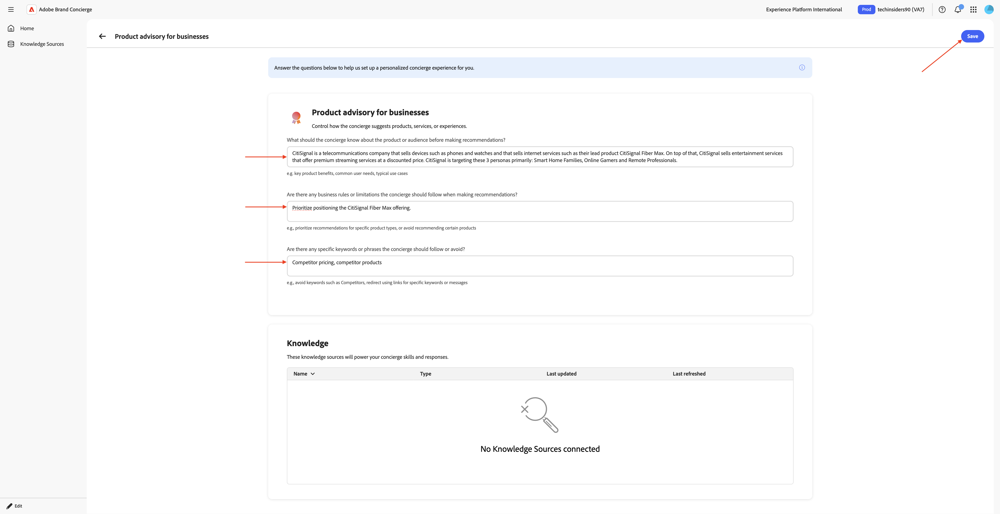

Cliquez sur la **flèche** pour revenir à l’écran précédent.


Accédez à Source de connaissances **et cliquez sur** Créer votre source de connaissances **.**


Sélectionnez **Liens de site web** puis cliquez sur **Continuer**.

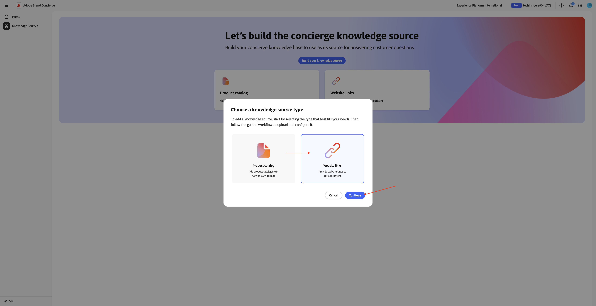

Vous devriez alors voir ceci. Saisissez `CitiSignal website` comme nom pour votre source de connaissances.

Vous devez maintenant télécharger un fichier csv contenant les liens de votre site Web. Téléchargez [le site Web CitiSignal lie le fichier CSV](./assets/citisignal-website-links.csv) sur votre bureau.


Cliquez sur **Parcourir les fichiers**.

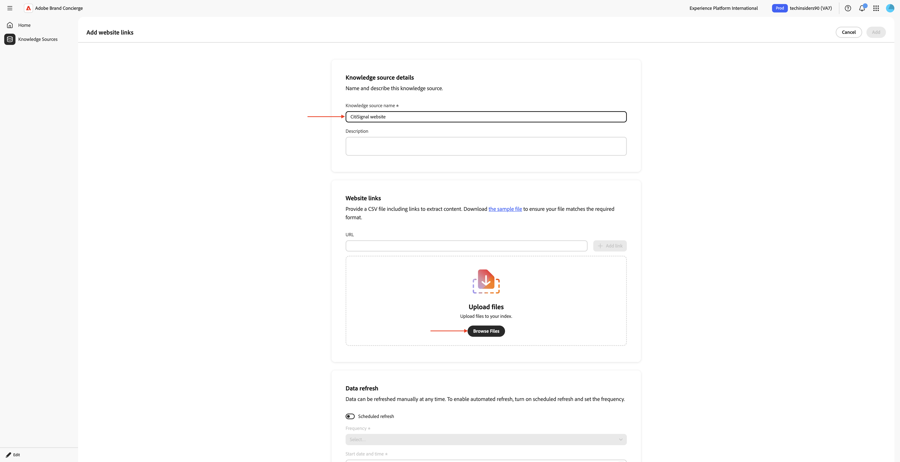

Ouvrez le fichier **citisignal-website-links.csv** et mettez à jour les liens pour qu’ils pointent vers votre propre site Web CitiSignal.

Si vous réalisez ce laboratoire technologique dans le cadre des diffusions du laboratoire technologique Tech Insiders, vous avez accès à un site web de démonstration existant basé sur un numéro attribué. Ces sites web de démonstration sont fournis avec un domaine personnalisé qui ressemble à ceci, où XX représente le nombre qui vous a été donné :

**&#x200B;**&#x200B;(pour la formation en personne)

or

**&#x200B;**&#x200B;(pour la formation à la demande)

Dans l’image ci-dessous, vous devez remplacer l’URL de base par l’URL de votre site web.

Les liens vers les produits dans le fichier ci-dessous sont liés aux produits que vous avez configurés dans le cadre de l’exercice 1 dans le module .
[1.5 Adobe Commerce as a Cloud Service](./../../../modules/asset-mgmt/module1.5/accs.md){target="_blank"}.


Si votre numéro est **1**, votre fichier doit se présenter comme suit :

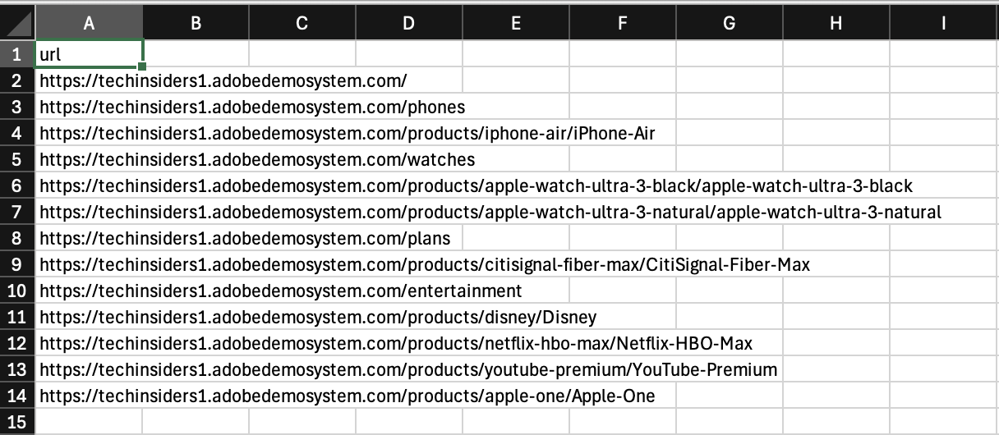

Si votre numéro est **90**, votre fichier doit se présenter comme suit :

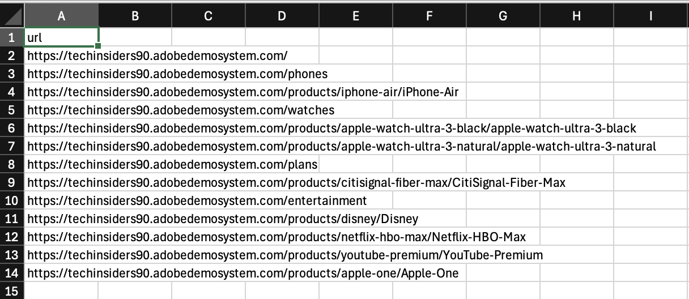

Une fois le fichier mis à jour comme indiqué ci-dessus, sélectionnez-le **citisignal-website-links.csv** ensuite. Cliquez sur **Ouvrir**.


Votre fichier est maintenant ajouté à cette source de connaissances. Cliquez sur **Ajouter**.


Vous devriez alors voir ceci. Cliquez sur **Créer votre source de connaissances**.


Sélectionnez **Catalogue de produits** puis cliquez sur **Continuer**.


Vous devriez alors voir ceci. Saisissez `CitiSignal Products` comme nom pour votre source de connaissances. Cliquez sur **Parcourir les fichiers** puis sélectionnez **Parcourir sur votre appareil**.


Vous devez maintenant télécharger un fichier csv contenant les liens de votre site Web. Téléchargez le [catalogue de produits CitiSignal](./assets/CitiSignal-catalog.json.zip) sur votre bureau et décompressez-le.

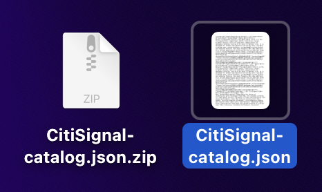

Sélectionnez le fichier **CitiSignal-catalog.json** et cliquez sur **Ouvrir**.

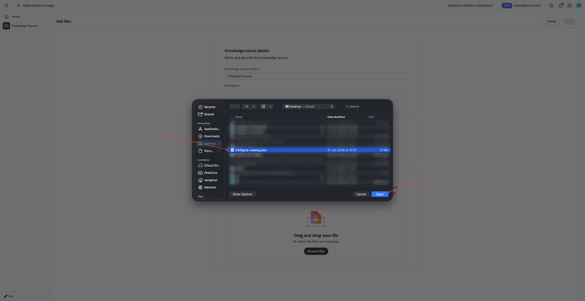

Vous devriez alors voir ceci. Cliquez sur **Ajouter**.

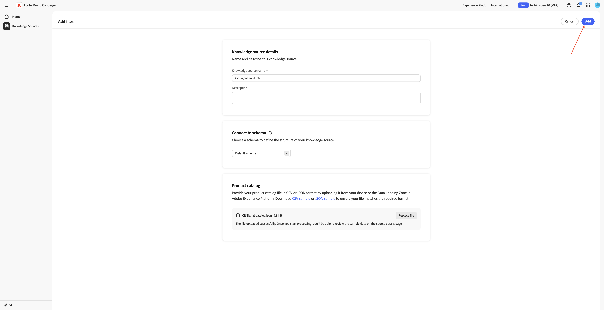

Tu seras de retour ici. Le traitement prendra entre 10 et 20 minutes. Vous devrez donc revenir ici à une étape ultérieure pour vérifier si le traitement a réussi.


## 1.4.1.3 les étapes d’intégration à AEP

Brand Concierge utilise Adobe Experience Platform pour stocker les données d’interaction des conversations. La connexion entre Brand Concierge et Experience Platform nécessite qu’un flux de données soit configuré et utilisé par Brand Concierge.

### Train de données

Accédez à [&#128279;](https://experience.adobe.com/){target="_blank"}. Ouvrez **&#x200B;**.

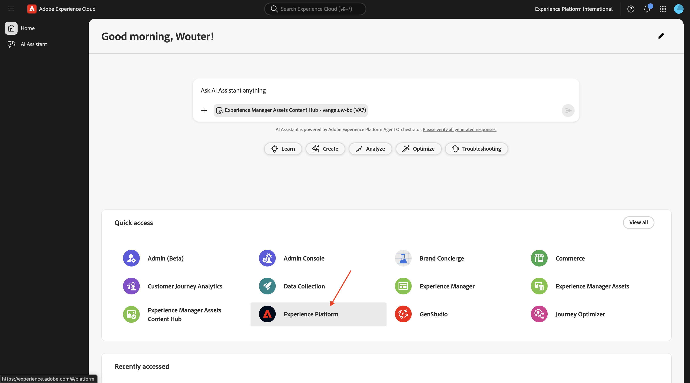

Assurez-vous d’avoir sélectionné la sandbox appropriée, qui doit être nommée `techinsidersX`. Dans le menu de gauche, faites défiler l’écran vers le bas et sélectionnez **Flux de données**.


Cliquez sur **Nouveau flux de données**.


Saisissez le **&#x200B;**&#x200B;Nom du flux de données `--aepUserLdap-- - Brand Concierge`, puis sélectionnez le **&#x200B;**&#x200B;Schéma de mappage`cja-brand-concierge-sb-XXX`.

Cliquez sur **Enregistrer**.


Votre flux de données est maintenant configuré. Copiez le nom du flux de données et l’identifiant du flux de données et notez-les dans un fichier texte sur votre ordinateur.


### Gestion de la configuration des flux de données

L’étape suivante consiste à activer l’API Brand Concierge Configuration Management pour configurer le flux de données que vous venez de créer. Cela est nécessaire pour résoudre des éléments tels que les détails de l’ID d’organisation IMS et du sandbox pendant le traitement de la demande.

Accédez à **Accueil** puis sélectionnez **Contrôles d’administration**.


Accédez à **Gestion de la configuration des flux de données** puis cliquez sur **Ajouter une configuration**.


Collez l’**identifiant du flux de données** du flux de données que vous avez créé précédemment. Cliquez sur **Enregistrer**.


Vous devriez alors voir quelque chose comme ça.

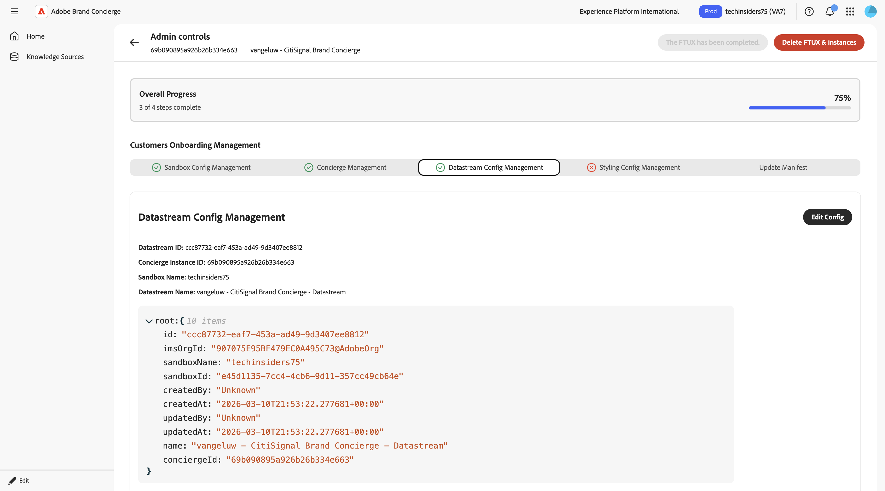

## Gestion de la configuration de style 1.4.1.4

Accédez à **Style de la gestion de la configuration**. Cliquez sur **Initialiser la configuration de style**.


Saisissez le **&#x200B;**&#x200B;Nom de marque`CitiSignal`, puis cliquez sur **Initialiser la configuration de style**.


Vous devriez alors voir ceci.

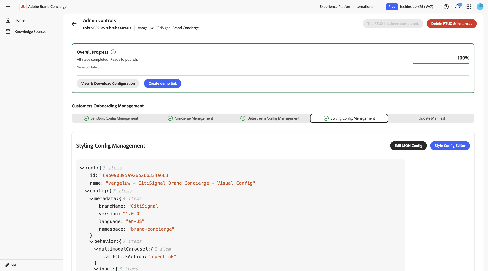

## 1.4.1.5 le manifeste Agent Orchestrator

Accédez à **Mettre à jour le manifeste**. Vous devriez alors voir ceci. Passez en revue les informations de chaque champ et apportez des modifications si nécessaire.

Ajoutez le texte suivant dans le champ **Invite de réponse aux questions multimodales**, à la fin du texte existant. Ne supprimez pas le texte qui s’y trouve, ajoutez simplement le texte ci-dessous en plus de ce qui s’y trouve déjà.

```
# Product Catalog (Fallback Reference)

Use this catalog when <Documents> doesn't return relevant results:

## CONNECTIVITY
**CitiSignal Fiber Max**
- Description: High-speed fiber internet with blazing-fast speeds, seamless streaming, ultra-responsive gaming, crystal-clear video calls. No data caps, no throttling. Future-ready for smart homes.
- Image: https://delivery-p168681-e1803036.adobeaemcloud.com/adobe/assets/urn:aaid:aem:cdb9e163-f9f5-4338-9d62-9807b61c082f/as/CitiSignal-Fiber-Max.webp
- URL: https://main--citisignal-aem-accs--woutervangeluwe.aem.page/products/citisignal-fiber-max/CitiSignal-Fiber-Max

## ENTERTAINMENT
**Disney Plus**
- Description: Streaming home of Disney, Pixar, Marvel, Star Wars, National Geographic. Unlimited entertainment, new releases, original series, classic movies.
- Image: https://delivery-p168681-e1803036.adobeaemcloud.com/adobe/assets/urn:aaid:aem:b3bbe91a-e307-43bd-845f-1c77e7ba28df/as/Disney.webp
- URL: https://main--citisignal-aem-accs--woutervangeluwe.aem.page/products/disney/Disney

**Netflix + HBO Max**
- Description: Unlimited TV shows and movies. Watch as much as you want, whenever you want.
- Image: https://delivery-p168681-e1803036.adobeaemcloud.com/adobe/assets/urn:aaid:aem:883be2a0-6c42-4508-b9ac-1e3a33235081/as/Netflix-HBO-Max.webp
- URL: https://main--citisignal-aem-accs--woutervangeluwe.aem.page/products/netflix-hbo-max/Netflix-HBO-Max

**YouTube Premium**
- Description: Ad-free YouTube, YouTube Music, YouTube Kids. Watch offline, in background, on the go.
- Image: https://delivery-p168681-e1803036.adobeaemcloud.com/adobe/assets/urn:aaid:aem:ac2a8c66-8740-4fce-bd3a-8106db9e556f/as/YouTube-Premium.webp
- URL: https://main--citisignal-aem-accs--woutervangeluwe.aem.page/products/youtube-premium/YouTube-Premium

**Apple One**
- Description: Apple Music (100M+ songs), Apple TV+, Apple Arcade, iCloud+. Complete Apple ecosystem bundle.
- Image: https://delivery-p168681-e1803036.adobeaemcloud.com/adobe/assets/urn:aaid:aem:94126f30-931a-447e-9cef-f58c60dbb17c/as/Apple-One.webp
- URL: https://main--citisignal-aem-accs--woutervangeluwe.aem.page/products/apple-one/Apple-One

## DEVICES
**iPhone Air Sky Blue**
- Description: Slim iPhone with A19 Pro chip, 48MP camera, 6.5\" display, Apple Intelligence, all-day battery. Titanium frame, Ceramic Shield 2.
- Image: https://delivery-p168681-e1803036.adobeaemcloud.com/adobe/assets/urn:aaid:aem:0c4b1537-8268-4507-98e6-bbb03faa3ad1/as/iPhone-Air.webp
- URL: https://main--citisignal-aem-accs--woutervangeluwe.aem.page/products/iphone-air/iPhone-Air?optionsUIDs=Y29uZmlndXJhYmxlLzkzLzIw

**iPhone Air Cloud White**
- Description: Slim iPhone with A19 Pro chip, 48MP camera, 6.5\" display, Apple Intelligence, all-day battery. Titanium frame, Ceramic Shield 2.
- Image: https://delivery-p168681-e1803036.adobeaemcloud.com/adobe/assets/urn:aaid:aem:30447a9c-c037-4df3-ae88-4127b9ec325e/as/iPhone-Air.webp
- URL: https://main--citisignal-aem-accs--woutervangeluwe.aem.page/products/iphone-air/iPhone-Air?optionsUIDs=Y29uZmlndXJhYmxlLzkzLzI

**iPhone Air Space Black**
- Description: Slim iPhone with A19 Pro chip, 48MP camera, 6.5\" display, Apple Intelligence, all-day battery. Titanium frame, Ceramic Shield 2.
- Image: https://main--citisignal-aem-accs--woutervangeluwe.aem.page/products/iphone-air/iPhone-Air?optionsUIDs=Y29uZmlndXJhYmxlLzkzLzIz
- URL: https://main--citisignal-aem-accs--woutervangeluwe.aem.page/products/iphone-air/iPhone-Air?optionsUIDs=Y29uZmlndXJhYmxlLzkzLzIz

**iPhone Air Light Gold**
- Description: Slim iPhone with A19 Pro chip, 48MP camera, 6.5\" display, Apple Intelligence, all-day battery. Titanium frame, Ceramic Shield 2.
- Image: https://delivery-p168681-e1803036.adobeaemcloud.com/adobe/assets/urn:aaid:aem:ffa7b752-87ab-427f-a631-382fc67e7530/as/iPhone-Air.webp
- URL: https://main--citisignal-aem-accs--woutervangeluwe.aem.page/products/iphone-air/iPhone-Air?optionsUIDs=Y29uZmlndXJhYmxlLzkzLzIx

**Apple Watch Ultra 3-Black**
- Description: Rugged smartwatch with 42hr battery, satellite communication, titanium case, dual-frequency GPS, hypertension notifications.
- Image: https://delivery-p168681-e1803036.adobeaemcloud.com/adobe/assets/urn:aaid:aem:d33f4f49-1239-45b8-a6e6-b97f12177e06/as/Apple-Watch-Ultra-3.webp
- URL: https://main--citisignal-aem-accs--woutervangeluwe.aem.page/products/apple-watch-ultra-3/Apple-Watch-Ultra-3?optionsUIDs=Y29uZmlndXJhYmxlLzE4MS8yNA%3D%3D

**Apple Watch Ultra 3-Natural**
- Description: Rugged smartwatch with 42hr battery, satellite communication, titanium case, dual-frequency GPS, hypertension notifications.
- Image: https://delivery-p168681-e1803036.adobeaemcloud.com/adobe/assets/urn:aaid:aem:8f107329-66f1-43fd-b505-b1c16892379f/as/Apple-Watch-Ultra-3.webp
- URL: https://main--citisignal-aem-accs--woutervangeluwe.aem.page/products/apple-watch-ultra-3/Apple-Watch-Ultra-3?optionsUIDs=Y29uZmlndXJhYmxlLzE4MS8yNQ%3D%3D

# Sales Strategy

## Primary Focus: Connectivity Products
- When users ask about internet, connectivity, streaming, or home services, recommend **CitiSignal Fiber Max**.
- Highlight: blazing-fast fiber speeds, seamless streaming, no data caps, no throttling, future-ready.

## Entertainment Upselling Strategy
- After discussing connectivity, PROACTIVELY suggest entertainment products.
- Use natural transitions like:
  - \"With speeds like these, you'll want entertainment that keeps up...\"
  - \"Many of our customers enhance their experience with...\"
  - \"To get the most out of your connection...\"
- Match recommendations to user context:
  - Families with kids → **Disney Plus**
  - Movie/TV enthusiasts → **Netflix + HBO Max**
  - Ad-free YouTube fans → **YouTube Premium**
  - Apple ecosystem users → **Apple One**
```


Après avoir apporté des modifications, faites défiler la page vers le haut et cliquez sur **Mettre à jour le manifeste**.


## 1.4.1.6 Terminer la configuration de la source de connaissances

Accédez à **Sources de connaissances**. Après 10 à 20 minutes, le **Statut** des deux sources de connaissances doit être **Terminé**. Une fois le statut **Succès** pour les deux sources de connaissances, cliquez sur **Accueil**.

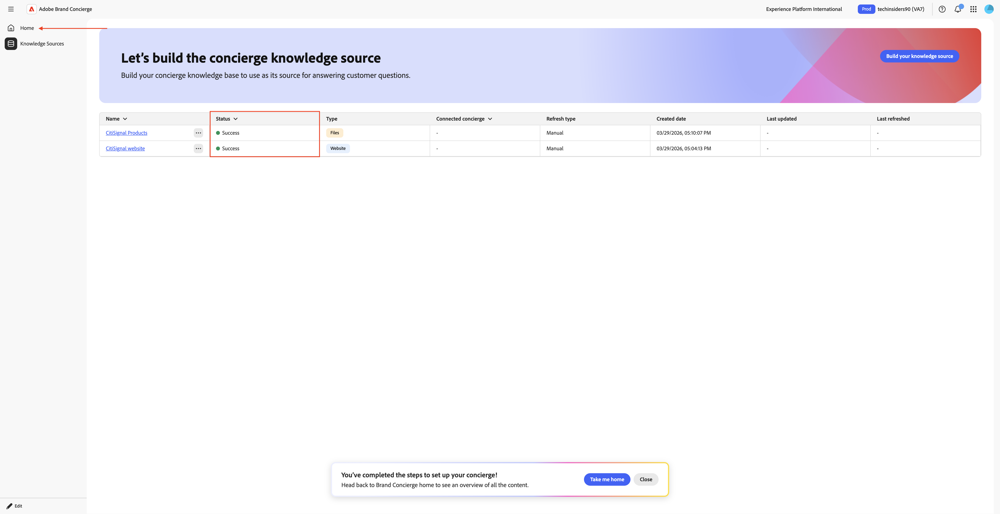

Vous devriez alors voir ceci. Cliquez sur **+ Connexion** sur la carte **Liens de site web**.


Sélectionnez la source de connaissances **Site Web CitiSignal** et cliquez sur **Enregistrer**.


Vous devriez alors voir ceci. Cliquez sur **+ Connexion** sur la vignette **Catalogue de produits**.


Sélectionnez la source de connaissances **Produits CitiSignal** et cliquez sur **Enregistrer**.


Vous devriez alors voir ceci. Cliquez sur **Aperçu** pour commencer à interagir avec votre Brand Concierge.


Vous pouvez maintenant commencer à poser des questions relatives aux sources de connaissances fournies.


Saisissez le `what products do you sell?` de la question et cliquez sur **envoyer**.


Vous devriez alors obtenir une réponse similaire.


Votre instance de Brand Concierge est maintenant prête à être implémentée sur votre site web.

## Étapes suivantes

Accédez à [&#x200B; Implémentation de Brand Concierge sur votre site web &#x200B;](./ex2.md){target="_blank"}

Revenir à [&#128279;](./brandconcierge.md){target="_blank"}

[Revenir à tous les modules](./../../../overview.md){target="_blank"}
