# 1.6.1 Prise en main des agents AEM

>[!IMPORTANT]
>
>Votre sandbox AEM CS est peut-être en veille. Étant donné que la réactivation d’un sandbox prend entre 10 et 15 minutes, il serait judicieux de lancer le processus de réactivation maintenant afin de ne pas avoir à l’attendre plus tard.

## 1.6.1.1 Discovery Agent

L’agent de découverte Adobe Experience Manager (AEM) est un outil optimisé par l’IA d’AEM as a Cloud Service qui permet aux utilisateurs et utilisatrices de rechercher, de récupérer et d’utiliser du contenu (y compris Assets, des fragments de contenu et la Forms adaptative) à l’aide d’invites en langage naturel. Il n’est plus nécessaire d’effectuer un filtrage manuel, complexe ou basé sur les clics, car il permet de comprendre l’intention et de rechercher dans le référentiel.

Pour utiliser l’**agent de découverte**, vous allez d’abord créer des balises dans Adobe Experience Manager, puis baliser certaines ressources à l’aide de ces balises. Une fois cette opération terminée, vous pourrez utiliser l’assistant d’IA pour découvrir des ressources de manière simple et conviviale pour l’entreprise.

Accédez à [&#128279;](https://my.cloudmanager.adobe.com){target="_blank"}. L’organisation que vous devez sélectionner est `--aepImsOrgName--`.

### Création et utilisation de balises avec Assets

Cliquez pour ouvrir votre programme Cloud Manager, qui doit utiliser les options de dénomination suivantes :

- **`Tech Insiders - AEM + ACCS X`** où X représente le nombre qui vous a été attribué.
- **`Tech Insiders On Demand - AEM + ACCS X`** où X représente le nombre qui vous a été attribué.
- **`--aepUserLdap-- - CitiSignal AEM+ACCS`**, dans ce cas, vous n’avez pas de nombre, car vous utilisez votre propre programme AEM que vous avez créé vous-même.

Dans cet exemple, le programme **Insiders techniques - AEM + ACCS 100** sera utilisé. Vous devez utiliser votre propre programme.


Cliquez sur l’URL de votre environnement pour l’ouvrir.


Cliquez sur l’icône **outils**.


Sous **Général**, cliquez sur **Balisage**.

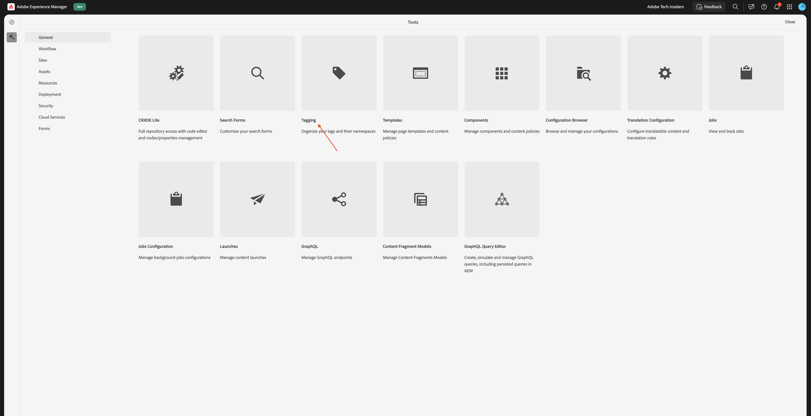

Vous devriez alors voir ceci. Cliquez sur **Créer** puis sélectionnez **Créer un espace de noms**.


Dans le champ **Titre**, saisissez : `--aepUserLdap-- - CitiSignal`. Cliquez sur **Créer**.

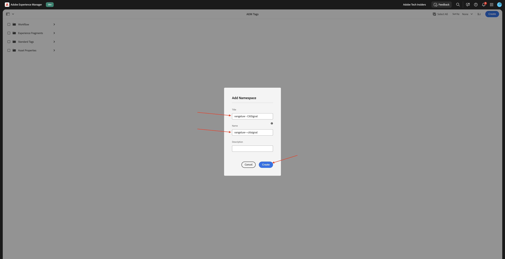

Explorez l’espace de noms **`--aepUserLdap-- - CitiSignal`** en cliquant dessus. Cliquez sur **Créer** puis sélectionnez **Créer une balise**.

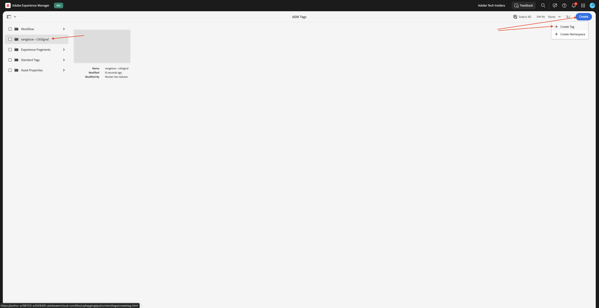

Dans le champ **Titre**, saisissez : `--aepUserLdap-- - Campaign`. Cliquez sur **Envoyer**.


Sélectionnez le **`--aepUserLdap-- - Campaign`** de balise en cliquant dessus. Cliquez sur **Créer** puis sélectionnez **Créer une balise**.


Dans le champ **Titre**, saisissez : `--aepUserLdap-- - Winter 2026`. Cliquez sur **Envoyer**.

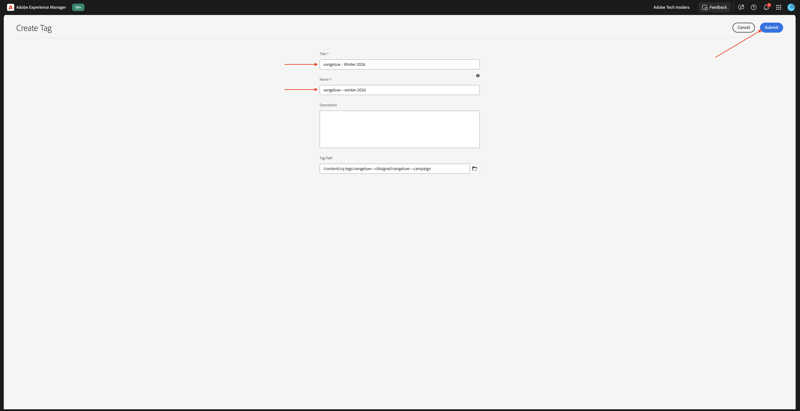

Sélectionnez la balise **Campaign** en cliquant dessus. Cliquez sur **Créer** puis sélectionnez **Créer une balise**.


Dans le champ **Titre**, saisissez : `--aepUserLdap-- - Spring 2026`. Cliquez sur **Envoyer**.

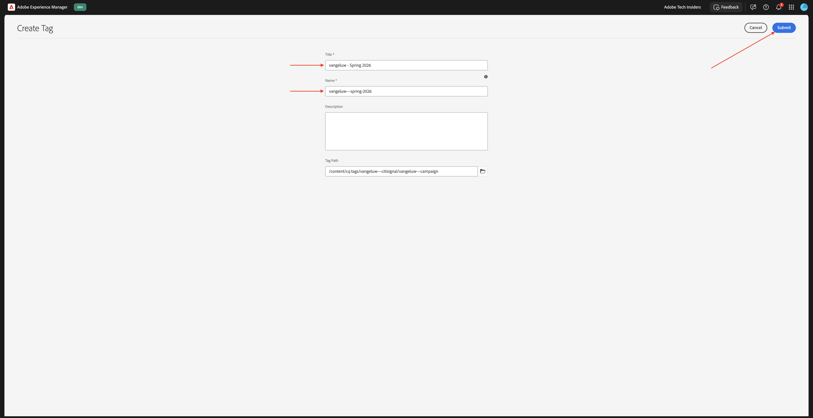

Vous devriez maintenant avoir ceci.

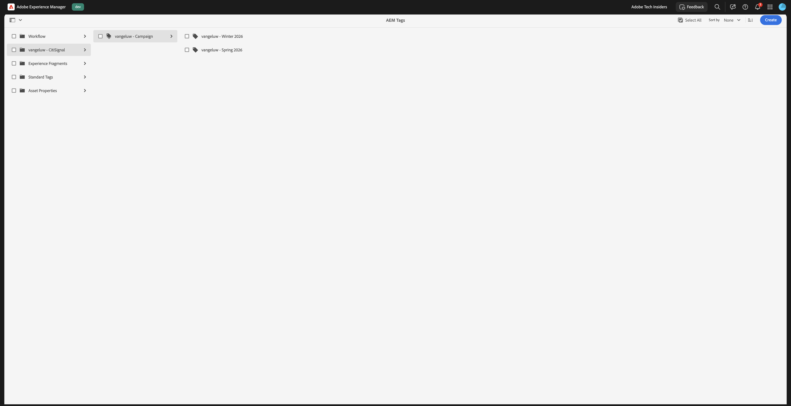

Cliquez sur **&#x200B;**&#x200B;puis sur **Assets**.

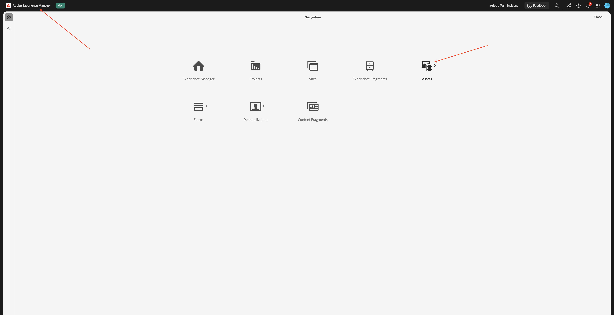

Cliquez sur **Fichiers**.

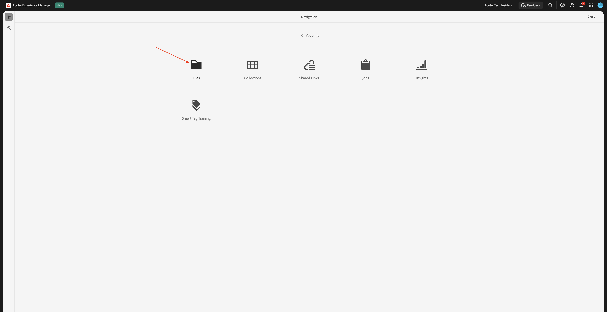

Cliquez sur le dossier **CitiSignal** pour l&#39;ouvrir.

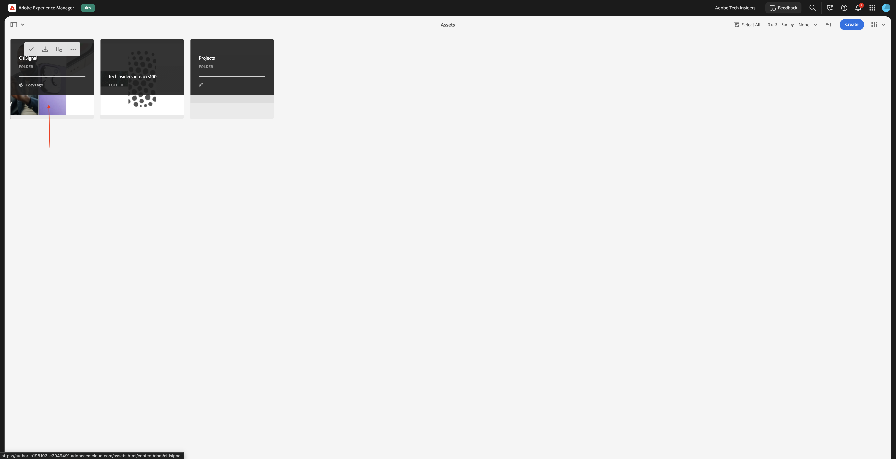

Cliquez sur **Créer** puis sélectionnez **Fichiers**.

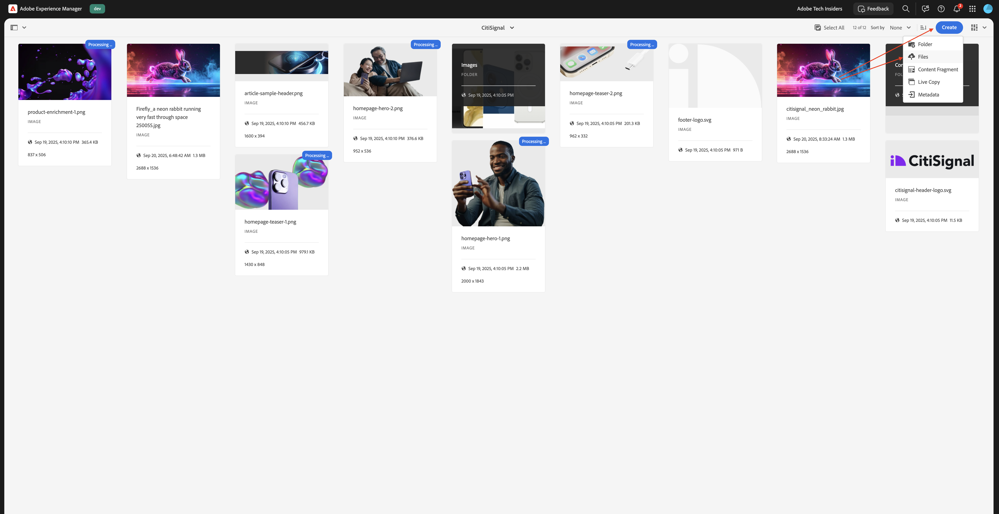

Téléchargez le fichier [citisignal-images-campaign.zip](./assets/citisignal-images-campaign.zip) et décompressez-le sur votre bureau.

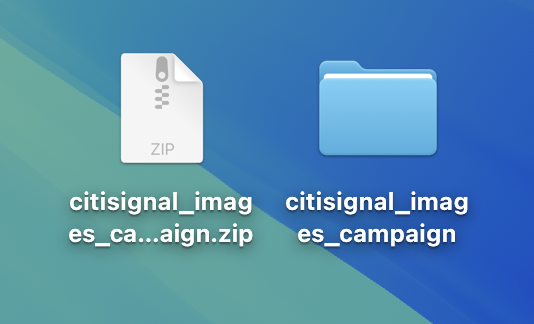

Sélectionnez les 3 fichiers que vous venez de télécharger et cliquez sur **ouvrir**.


Cliquez sur **Télécharger**.

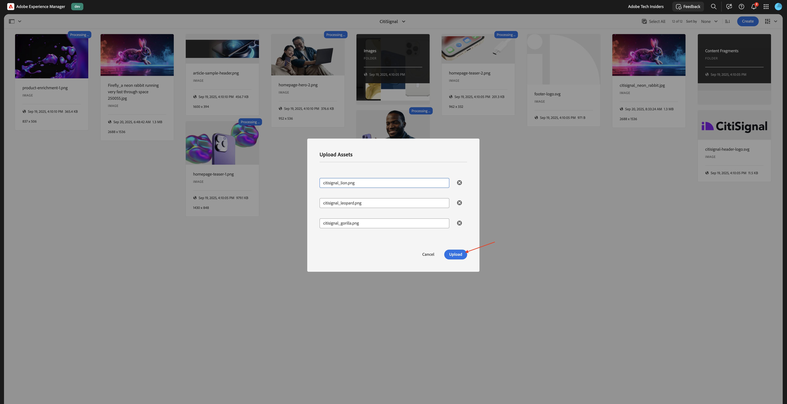

Vous devriez alors voir ceci.

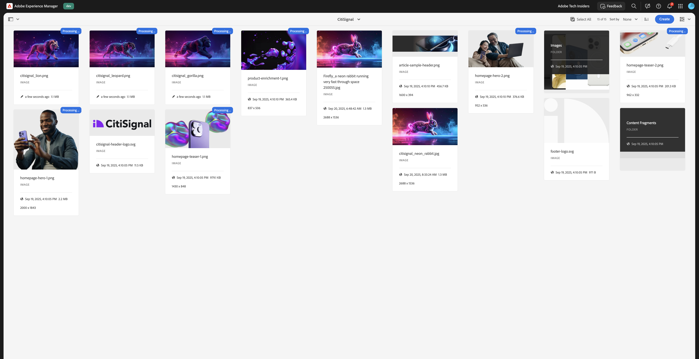

Sélectionnez la première image (citisignal_lion.png), puis cliquez sur **Propriétés**.

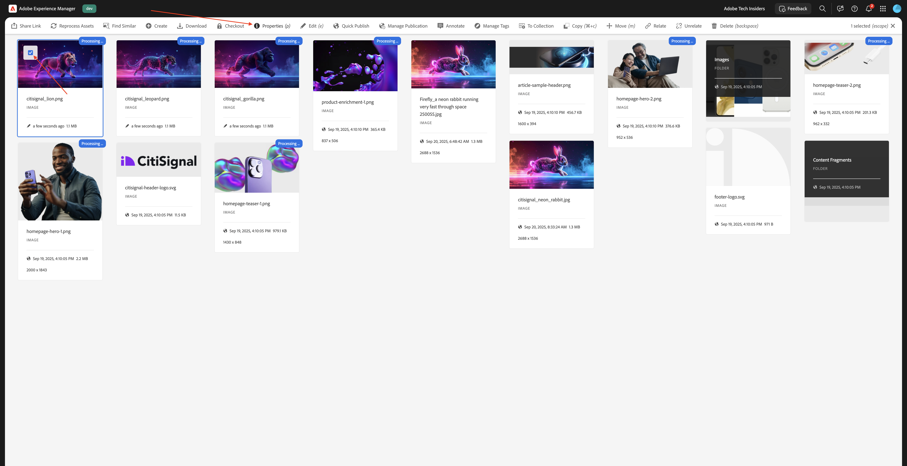

Cliquez sur l’icône **dossier** sous Balises.


Sélectionnez la **`--aepUserLdap-- - Spring 2026`** de balise et cliquez sur **Sélectionner**.


Cliquez sur **Enregistrer et fermer**.

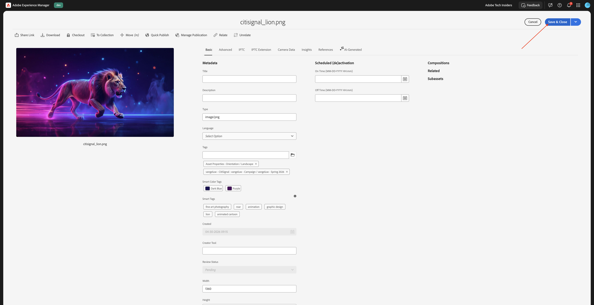

Répétez ces étapes pour ces images :

- `citisignal_leopard.png`
- `citisignal_gorilla.png`
- `citisignal_neon_rabbit.png`

Une fois la balise sélectionnée pour toutes les images, accédez à **&#x200B;**.


Cliquez sur l’icône **profil** en haut à droite de votre écran. Cliquez sur **Changer de vue**.

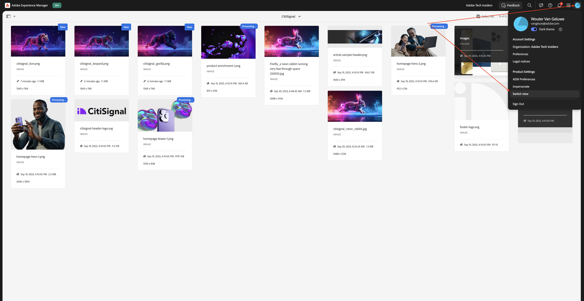

Vous devriez alors voir ceci.

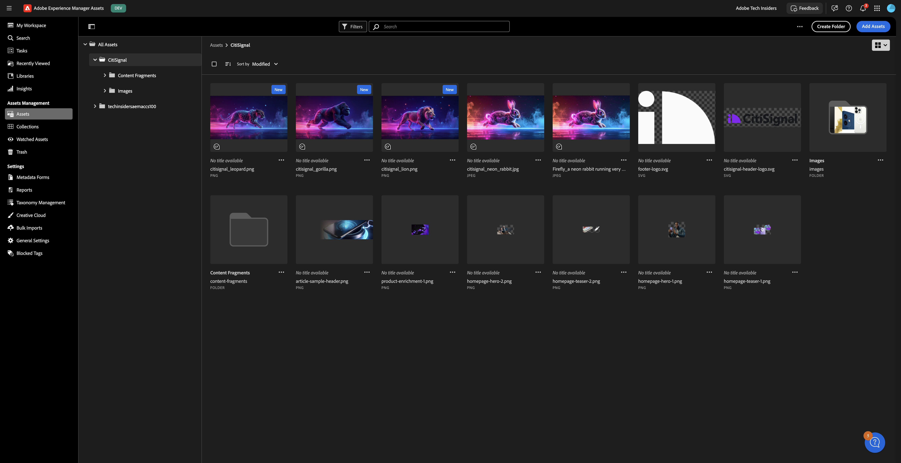

Double-cliquez pour ouvrir la première image.

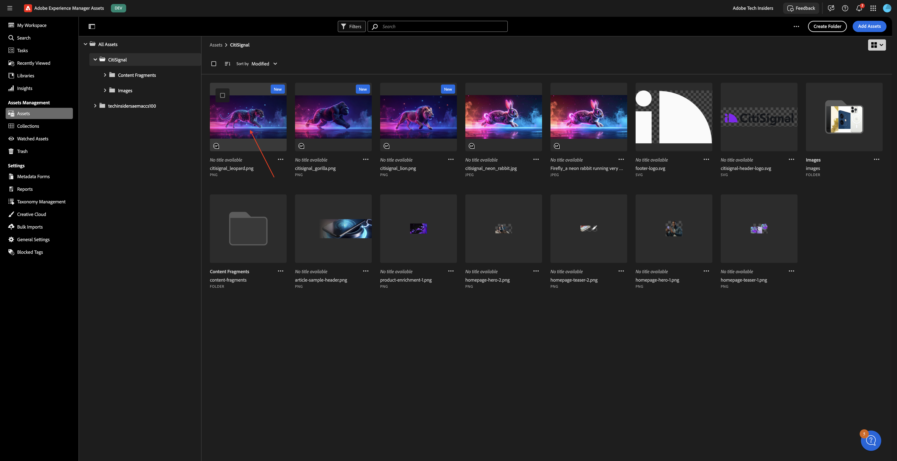

Sélectionnez **Approuvé** puis cliquez sur **Enregistrer**.


Sous **Balises**, vous pouvez voir la balise que vous avez sélectionnée précédemment.


Répétez ce processus afin que les 4 images soient approuvées.


Ensuite, accédez à **Mon espace de travail** et cliquez pour ouvrir **Assistant IA**.


Saisissez l’invite suivante et cliquez sur **Envoyer**.

```javascript
find all assets tagged with '--aepUserLdap-- - Spring 2026'
```


Si vous avez accès à plusieurs environnements AEM Assets CS, voici ce que vous verrez. Cliquez sur la réponse proposée pour l’environnement que vous souhaitez utiliser, puis cliquez sur **Envoyer**.


Vous devriez alors voir une réponse similaire. Cliquez sur l’icône pour développer l’assistant d’IA en plein écran.


Passez en revue les réponses.

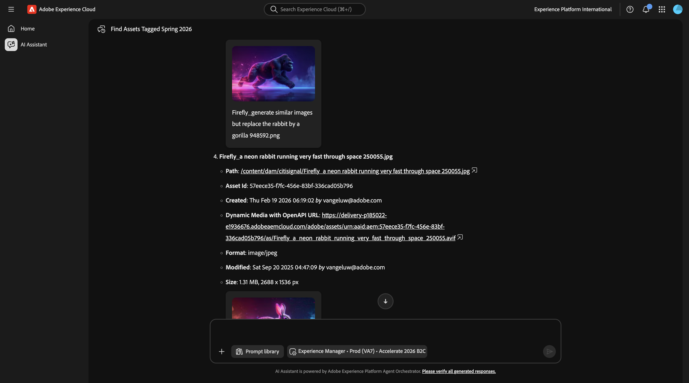

Cliquez sur l’icône **Afficher les informations** sur l’une des ressources.


Une vue agrandie de la ressource que vous avez sélectionnée s’affiche alors, avec quelques métadonnées.


## Agent de production 1.6.1.2 Experience

### Mise à jour de contenu - Assets

La compétence Mise à jour de contenu permet de mettre à jour facilement le contenu existant, notamment les fragments de contenu, les pages, les formulaires et les ressources. L’agent peut effectuer des actions telles que la mise à jour, la suppression, le remplacement ou l’ajout d’éléments de contenu pour que les expériences restent exactes et à jour. Les entrées peuvent être des descriptions en langage naturel et, lorsqu’elles sont utilisées avec des PDF et des captures d’écran Jira, elles peuvent également fournir des entrées.

Revenez à l’écran de l’assistant d’IA. Fermez le panneau latéral.


Sélectionnez l’une des invites proposées et cliquez sur **Envoyer**.

`For the first image, generate renditions for Instagram and LinkedIn posts`

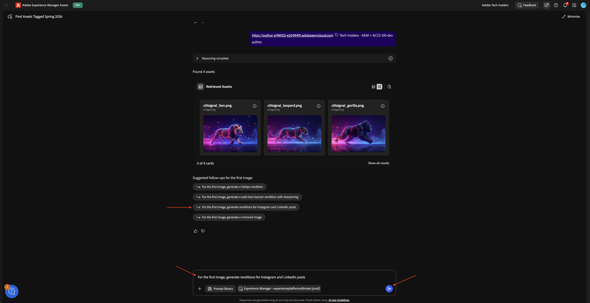

Après quelques minutes, vous devriez voir une réponse similaire.

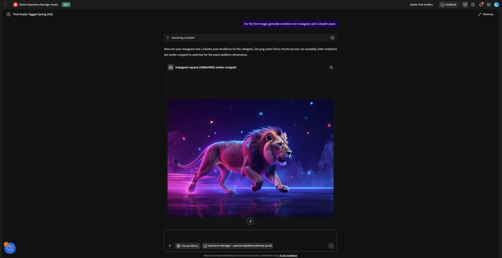

Examinez les images qui ont été générées.


N’hésitez pas à tester d’autres invites. Faites défiler vers le haut et sélectionnez l’une des autres invites proposées, ou saisissez la vôtre, puis cliquez sur **Envoyer**.

`For the first image, generate a mirrored image`


Examinez les images qui ont été générées.

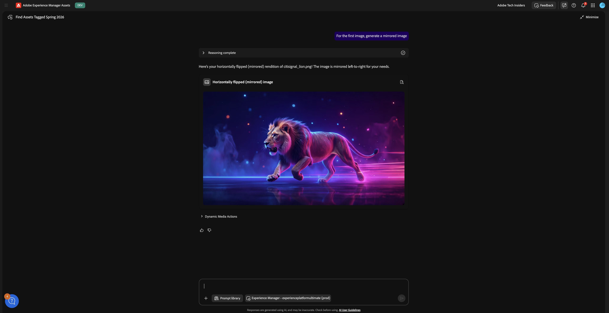

### Mise à jour de contenu - Pages

Revenez à votre environnement de création Adobe Experience Manager, puis accédez à **Sites**.


Accédez à **CitiSignal**. Cliquez sur **Créer** puis sélectionnez **Page**.

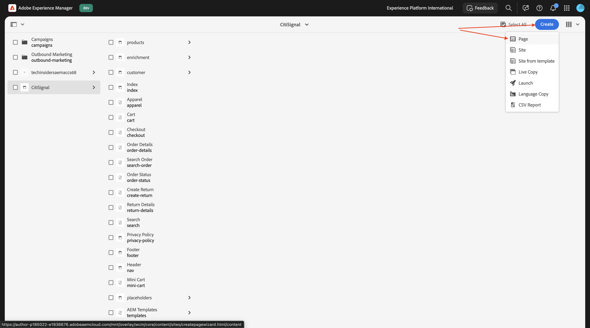

Sélectionnez **Page** et cliquez sur **Suivant**.


Saisissez les valeurs suivantes :

- Titre : **Fibre max**
- Nom : **fibre-max**
- Titre de la page : **Fibre max**

Cliquez sur **Créer**.


Sélectionnez **Ouvrir**.


Vous devriez alors voir ceci.


Cliquez dans la zone vierge pour sélectionner le composant **section**. Cliquez ensuite sur l’icône plus **+** dans le menu de droite et sélectionnez **Héros**.


Vous devriez alors voir ceci. Cliquez sur **+ Ajouter** pour ajouter une image.


Sélectionnez votre référentiel de ressources. Ouvrez ensuite le dossier **CitiSignal**.


Choisissez l&#39;image du lion que vous avez téléchargé précédemment. Cliquez sur **Sélectionner**.


Vous devriez alors voir ceci. Cliquez sur la zone **texte** pour modifier le texte.


Collez ce texte dans la zone :

```
This winter, be as fast as a lion.
```

Sélectionnez **Titre 1** puis cliquez sur **Terminé**.


Vous devriez alors voir ceci. Accédez à **Arborescence de contenu** et sélectionnez la zone **Section**.

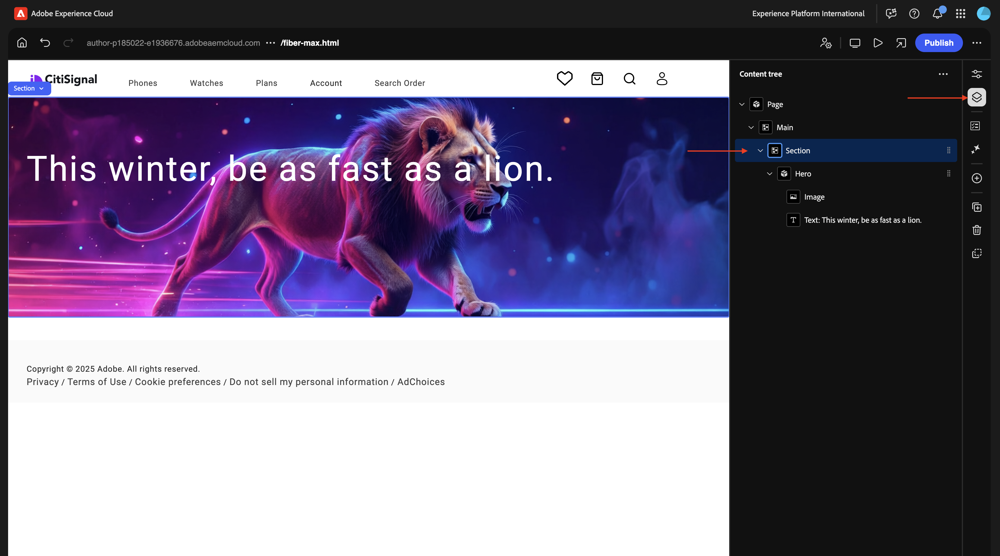

Cliquez sur l’icône **+**, puis sélectionnez **Cartes**.


Vous devriez alors voir ceci. Assurez-vous que dans l’arborescence **Contenu**, **Cartes** est sélectionné.

Cliquez ensuite 4 fois sur le bouton **+**.


Vous devriez maintenant voir ceci, où il y a 4 objets **Card** dans l&#39;objet **Cards**.


Sélectionnez la première **Carte**. Cliquez sur la zone **texte** pour modifier le texte.


Collez le texte suivant. Vérifiez que la première ligne de texte utilise **Titre 1**. Cliquez sur **Terminé**.

```
99.9% network reliability

Game, video chat and stream on multiple devices with ultra low lag.
```


Sélectionnez la deuxième **Carte**. Cliquez sur la zone **texte** pour modifier le texte.


Collez le texte suivant. Vérifiez que la première ligne de texte utilise **Titre 1**. Cliquez sur **Terminé**.

```
3-year

price lock guarantee

For new and existing Fiber Max customers on all internet plans.

No hidden fees.
```


Sélectionnez la troisième **Carte**. Cliquez sur la zone **texte** pour modifier le texte.


Collez le texte suivant. Vérifiez que la première ligne de texte utilise **Titre 1**. Cliquez sur **Terminé**.

```
More ways to save

Save over 45% on the best entertainment with CitiSignal
```

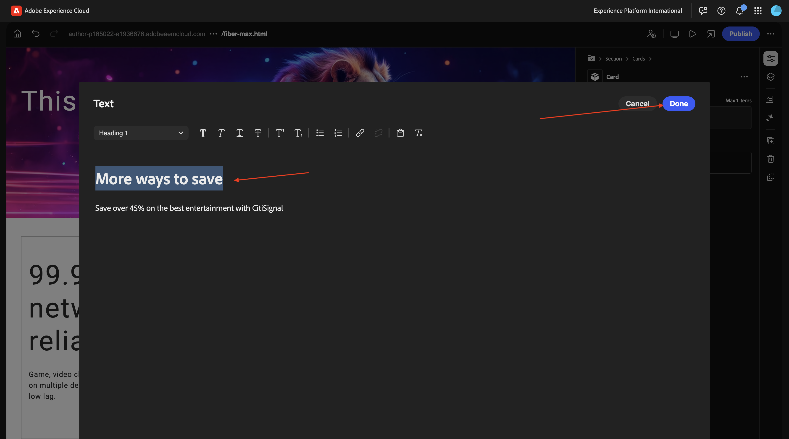

Sélectionnez la quatrième **Carte**. Cliquez sur la zone **texte** pour modifier le texte.

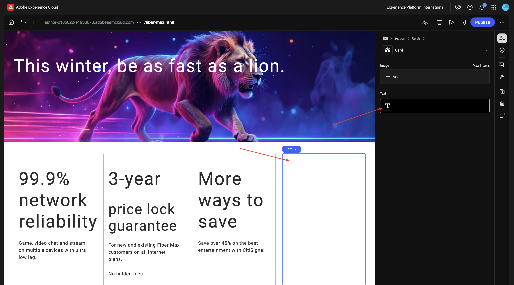

Collez le texte suivant. Vérifiez que la première ligne de texte utilise **Titre 1**. Cliquez sur **Terminé**.

```
Get Fiber Max now!

Fill out the form here to get started.
```


Vous devriez maintenant avoir ceci. Cliquez sur **Publier**.


Cliquez de nouveau sur **Publier**.

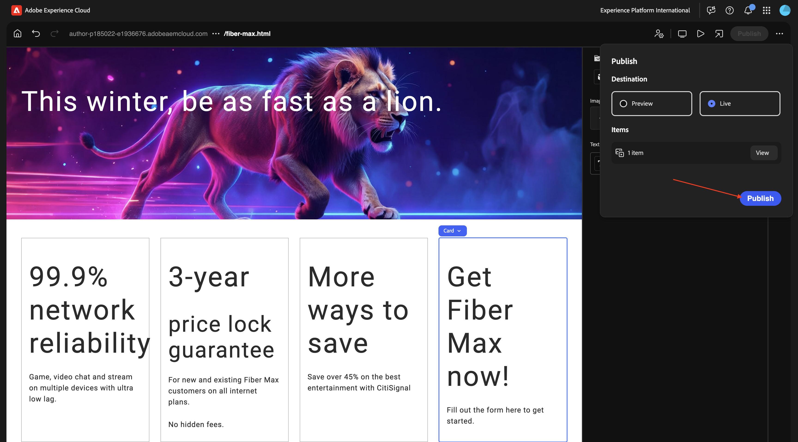

Cliquez sur **Ouvrir la page**.


Copiez l’URL de la page comme vous en aurez besoin ensuite.

L’URL doit être similaire à ceci : `https://author-pXXXXXX-eXXXXXXX.adobeaemcloud.com/content/CitiSignal/fiber-max.html`.

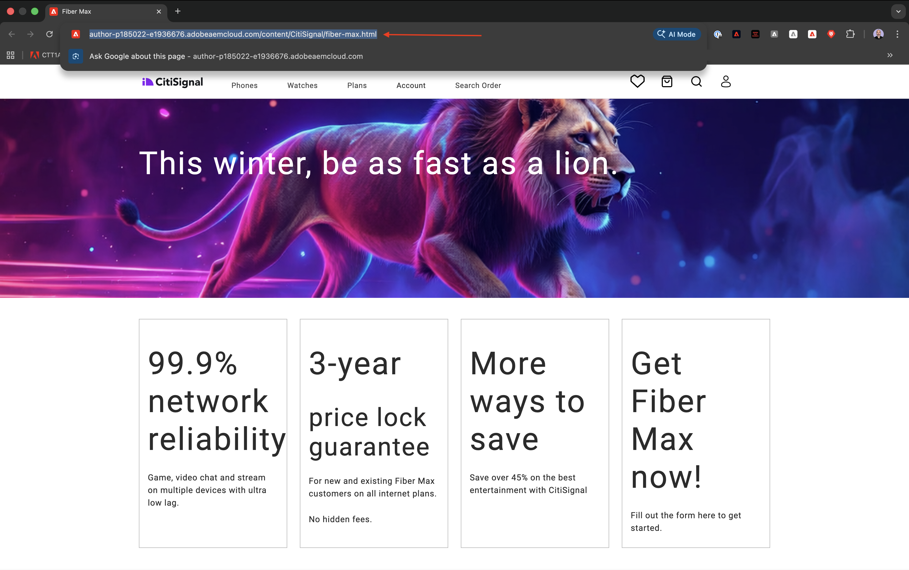

Accédez à [&#128279;](https://experience.adobe.com/#/experiencemanager/). Cliquez pour ouvrir **Assistant IA**.


Collez l’invite suivante et cliquez sur **envoyer**. Remplacez XXX dans cette invite par l’URL que vous avez copiée à l’étape précédente.

```
On the page XXX, please make the following changes:

- change the word 'winter' to 'spring'
- change the word 'lion' to 'leopard'
- change the image in the hero block to use the image 'citisignal_leopard.png'
- change the text '99.9% network reliability' to '99.999% network reliability'
```


Après 1-2 minutes, vous devriez voir ceci. Saisissez le `generate` d’invite et cliquez sur **Envoyer**.


Quelques minutes plus tard, une confirmation comme celle-ci devrait s’afficher indiquant que les modifications ont été effectuées. Cliquez sur **Prévisualiser la page mise à jour**.

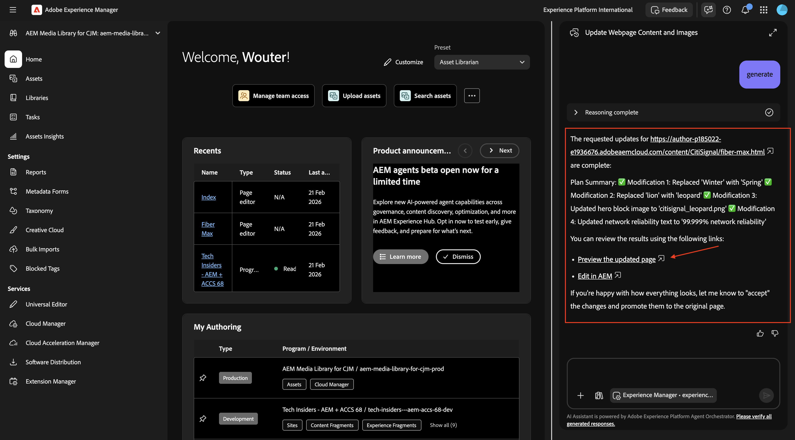

Vous obtenez maintenant une confirmation visuelle des modifications qui ont été apportées. Cette page d’aperçu est fournie uniquement à titre d’information. Vous ne pouvez pas agir à partir de cette page.


Pour agir, cliquez sur **Modifier dans AEM**.


Dans l’éditeur universel, vous voyez désormais toutes les modifications en détail, avec la possibilité de tout modifier. Une fois la page vérifiée, cliquez sur **Publier**.


Cliquez de nouveau sur **Publier**. La modification que vous avez apportée n’a pas encore été publiée dans votre environnement de production. Au lieu de cela, il a été publié sous **Lancements** dans AEM.

Les lancements vous permettent de développer efficacement du contenu en vue d’une publication ultérieure. Un lancement est créé pour vous permettre d’apporter des modifications en vue d’une publication ultérieure, tout en conservant vos pages actives. Cela signifie que vous modifiez deux versions simultanément : les pages qui sont actuellement publiées et une version de ces pages, qui sera publiée à un moment donné dans le futur. Une fois ce délai écoulé, vous pouvez remplacer les pages d’origine et publier la nouvelle version.


Pour **Promouvoir** vos modifications en attente pour une version ultérieure, revenez à AEM. Cliquez sur **&#x200B;**&#x200B;en haut de la page, cliquez sur l’icône **marteau**, puis sélectionnez **Lancements**.


Un **Launch** en attente devrait maintenant s’afficher. Cochez la case en regard de l’**Launch** en attente.

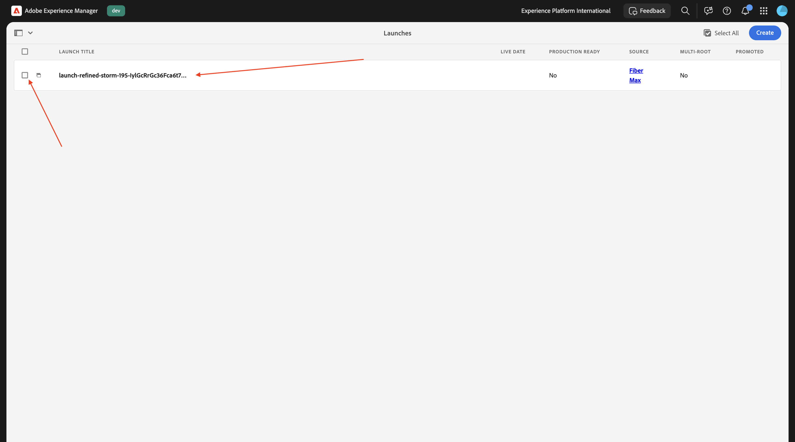

Cliquez sur **Promouvoir**.


Sélectionnez **Promouvoir le lancement complet** et cliquez sur **Suivant**.


Cliquez sur **Promouvoir**.

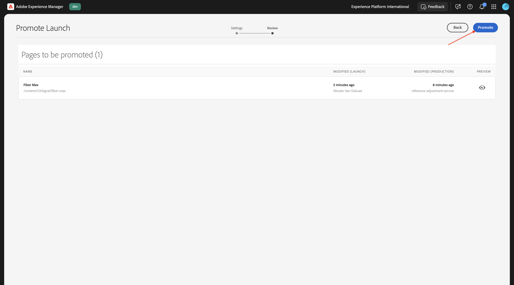

Vous devriez maintenant voir ceci. Vos modifications sont en cours de production.

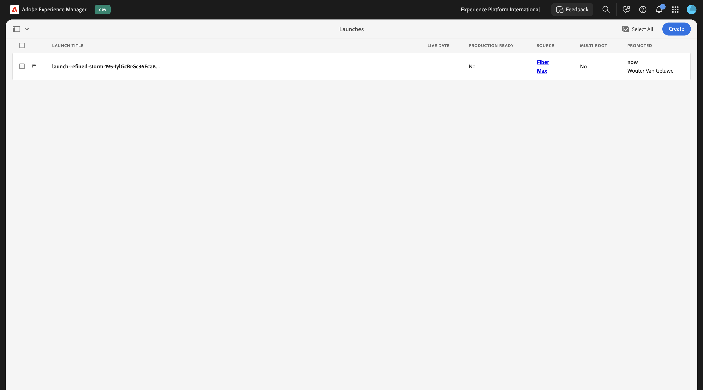

Actualisez votre page. Toutes vos modifications devraient maintenant s’afficher sur la page publiée.

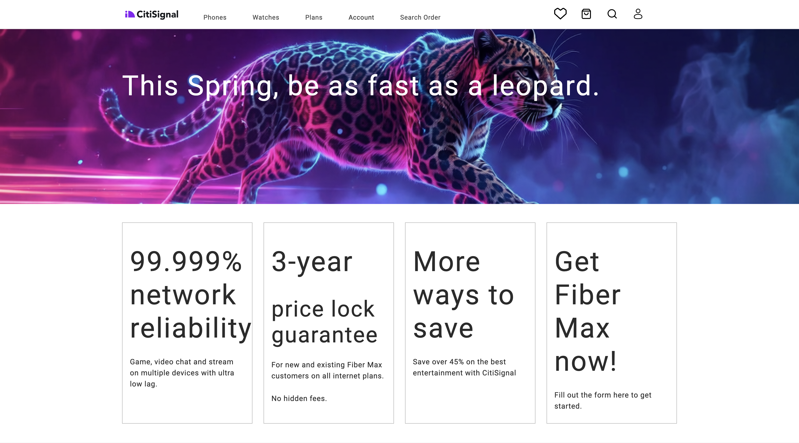

Au lieu de suivre le processus de promotion manuel, vous pouvez également saisir le `accept` d’invite dans l’assistant AI.

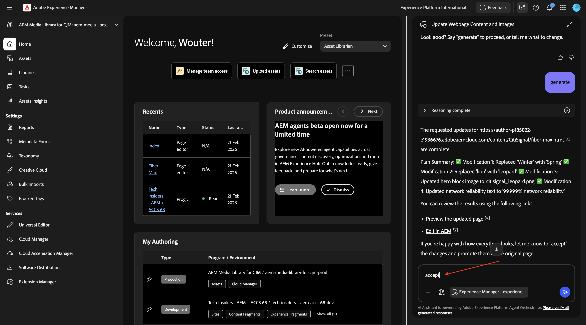

Vous devriez ensuite obtenir une confirmation que les modifications sont publiées.


### Mise à jour de contenu - Création de formulaire

Dans le module [Adobe Experience Manager Forms avec Edge Delivery Services](./../../asset-mgmt/module1.3/aemforms.md){target="_blank"} vous trouverez les étapes de création d&#39;un formulaire de manière manuelle.

La compétence Création de formulaire permet désormais aux utilisateurs et utilisatrices de créer des formulaires adaptatifs par le biais d’invites de langage naturel sans dépendre du développement ou des équipes informatiques. Cette fonctionnalité accélère le développement des formulaires tout en maintenant la cohérence de la marque et en permettant aux utilisateurs professionnels de créer des formulaires sans avoir une connaissance technique approfondie des produits.

Accédez à [&#128279;](https://experience.adobe.com/#/ai-assistant/chat).


Saisissez l’invite suivante et cliquez sur **envoyer**.

```
Create a new adaptive form using Edge Delivery Services and the existing CitiSignal site, with the following details:
- Form name: "citisignal-fiber-max-interest-2"
- Form fields: 4 text input fields are needed, for "first-name", "last-name", "email" and "city"
- When the form is submitted, send the submission to a spreadsheet, with this URL: https://docs.google.com/spreadsheets/d/1WwKrcM8mZ2d_W3sMheUAw3nFhP_OFk05TsqxhHkudfQ/edit?usp=sharing.
```

## Étapes suivantes

Accédez à [1.6.2 Serveurs et curseur AEM MCP](./ex2.md){target="_blank"}

Revenir à [AEM et agents](./aemagents.md){target="_blank"}

[Revenir à tous les modules](./../../../overview.md){target="_blank"}
