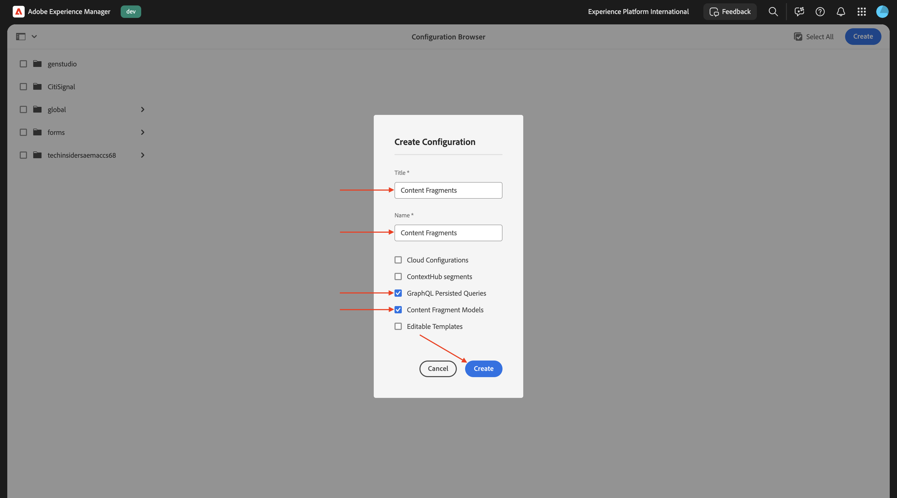
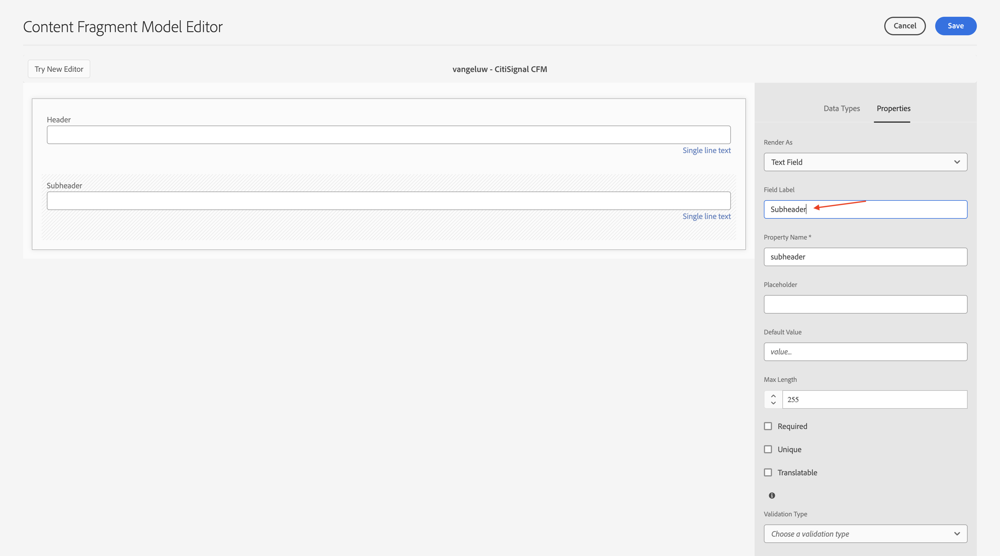
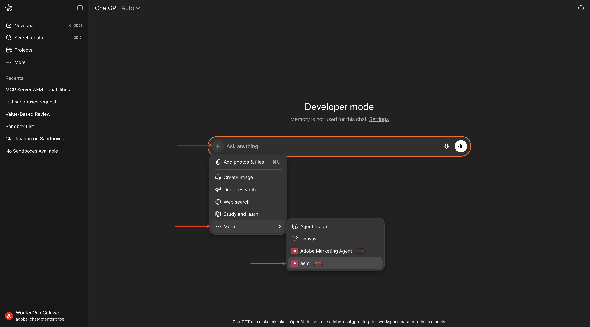
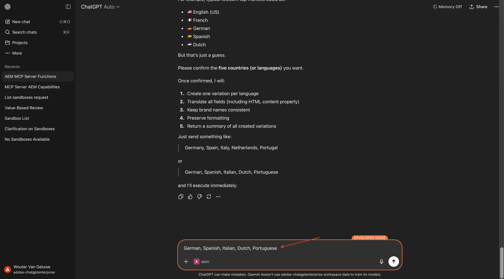

# 1.6.3 Mise à l’échelle des fragments de contenu avec le serveur ChatGPT et MCP

>[!IMPORTANT]
>
>Pour réaliser cet exercice, vous devez avoir accès à un environnement AEM Sites et Assets CS avec services de développement intégré (EDS) fonctionnel, et les différents agents AEM doivent être activés pour l’organisation IMS que vous utilisez.
>
>Si vous ne disposez pas encore d’un tel environnement, passez à l’exercice [Adobe Experience Manager Cloud Service &amp; Edge Delivery Services](./../../../modules/asset-mgmt/module2.1/aemcs.md){target="_blank"}. Suivez les instructions qui s’affichent à cet endroit et vous aurez accès à un tel environnement.

>[!IMPORTANT]
>
>Si vous avez précédemment configuré un programme AEM CS avec un environnement AEM Sites et Assets CS, il se peut que votre sandbox AEM CS ait été mis en veille. Étant donné que la réactivation d’un tel sandbox prend entre 10 et 15 minutes, il serait judicieux de lancer le processus de réactivation maintenant afin de ne pas avoir à l’attendre plus tard.

## 1.6.3.1 Créer un modèle de fragment de contenu

Revenez à votre environnement de création Adobe Experience Manager, sur **Outils**, puis accédez à **Navigateur de configuration**.


Cliquez sur **Créer**.


Utilisez des `Content Fragments` pour les champs **Titre** et **Nom**.

Assurez-vous que les options **Modèles de fragment de contenu** et **Requêtes persistantes GraphQL** sont toutes deux activées.

Cliquez sur **Créer**.



Revenez à votre environnement de création Adobe Experience Manager, puis accédez à **Fragments de contenu**.


Accédez à **Modèles de fragment de contenu**, sélectionnez votre configuration **Fragments de contenu** puis cliquez sur **Créer**.


Utilisez le nom `--aepUserLdap-- - CitiSignal CFM`. Cliquez sur **Créer et ouvrir**.


Vous devriez alors voir ceci. Faites glisser et déposez un champ **texte monoligne** sur la zone de travail.


Remplacez le champ **Libellé du champ** par `Header`.


Revenez à **Types de données**. Faites glisser et déposez un champ **texte monoligne** sur la zone de travail.


Remplacez le champ **Libellé du champ** par `Subheader`.



Revenez à **Types de données**. Faites glisser et déposez un champ **texte multiligne** sur la zone de travail.


Remplacez le champ **Libellé du champ** par `Detail Description`.


Revenez à **Types de données**. Faites glisser et déposez un champ **texte monoligne** sur la zone de travail.


Remplacez le champ **Libellé du champ** par `CTA Text`.


Revenez à **Types de données**. Faites glisser et déposez un champ **texte monoligne** sur la zone de travail.


Remplacez le champ **Libellé du champ** par `CTA Link`. Cliquez sur **Enregistrer**.


Vous devriez alors voir ceci.


Sélectionnez votre modèle de fragment de contenu et cliquez sur **Publier**.


Cliquez sur **Publier**.


## 1.6.3.2 Créer un fragment de contenu

Revenez à votre environnement de création Adobe Experience Manager, puis accédez à **Fragments de contenu**.


Vous devriez alors voir ceci. Cliquez sur **Créer** puis sélectionnez **Dossier**.


Saisissez le titre : `--aepUserLdap-- - CF`. Cliquez sur **Créer**.


Revenez à votre environnement de création Adobe Experience Manager, puis accédez à **Assets**.


Accédez à **Fichiers**.


Sélectionnez le dossier que vous venez de créer, qui doit être nommé `--aepUserLdap-- - CF` et cliquez sur **Propriétés**.


Accédez à **Services cloud** puis cliquez sur l’icône **dossier**.


Sélectionnez la configuration cloud que vous avez créée précédemment et qui doit être nommée **Fragments de contenu**. Cliquez sur **Sélectionner**.


Vous devriez alors voir ceci. Cliquez sur **Enregistrer et fermer**.


Revenez à votre environnement de création Adobe Experience Manager, puis accédez à **Fragments de contenu**.


Vous devriez alors voir ceci. Cliquez sur **Créer** puis sélectionnez **Fragment de contenu**.


Sélectionnez le **modèle de fragment de contenu** que vous avez créé précédemment et qui doit être nommé `--aepUserLdap-- - CitiSignal CFM`. Utilisez le nom `--aepUserLdap-- CitiSignal Fiber Max`.

Cliquez sur **Créer et ouvrir**.


Vous devriez alors voir ceci.


Renseignez les champs comme suit :

- **En-tête** : `CitiSignal Fiber Max`
- **Sous-en-tête** : `Experience high speed internet now`
- **Description détaillée** :

```
Experience the future of connectivity with CitiSignal Fiber Max, the ultimate solution for high-speed internet. Designed for homes and businesses that demand performance, Fiber Max delivers blazing-fast fiber speeds, ensuring seamless streaming, ultra-responsive gaming, and crystal-clear video calls.

Key Features:

Unmatched Speed: Enjoy lightning-fast downloads and uploads powered by cutting-edge fiber technology.
Reliable Performance: Consistent connectivity for work, entertainment, and everything in between.
Future-Ready: Built to handle the growing demands of smart homes and digital lifestyles.
Unlimited Potential: No data caps, no throttling—just pure speed.
Why Choose CitiSignal Fiber Max? Stay ahead with internet that works as hard as you do. Whether you’re powering a remote office or streaming in 4K, Fiber Max ensures you never miss a beat.
```

**Texte CTA** : `Upgrade now by signing your new contract!`
**Lien CTA** : `https://techinsiders68.adobedemosystem.com/`

Cliquez sur **Publier** puis sélectionnez **Maintenant**.


Cliquez sur **Publier**.


## 1.6.3.3 Configurer le serveur MCP dans ChatGPT

>[!NOTE]
>
>L’utilisation de Adobe Marketing Agent dans ChatGPT nécessite ce qui suit :
>- une version payante du ChatGPT Enterprise d’OpenAI
>- en utilisant le client web ChatGPT Enterprise

Accédez à [https://chatgpt.com/](https://chatgpt.com/){target="_blank"} et connectez-vous à l’aide des détails de votre compte. Une fois la connexion effectuée, vous devriez voir ceci. Cliquez sur votre nom d’utilisateur, puis sélectionnez **Paramètres**.


Accédez à **Applications** puis sélectionnez **Paramètres avancés**.


Activez le **mode Développeur** puis cliquez sur **Précédent**.


Cliquez sur **Créer une application**.


Renseignez les champs comme suit :

- **Nom** : `aem`
- **URL du serveur MCP** : `https://mcp.adobeaemcloud.com/adobe/mcp/content`
- **Authentification** : `OAuth`

Cochez la case **Je comprends et je souhaite continuer**.

Cliquez sur **Créer**.


ChatGPT va maintenant essayer de se connecter à votre compte Adobe. Sélectionnez **Autoriser l’accès** puis vous devrez vous connecter à l’aide de votre compte Adobe.

Une fois la connexion établie, vous devriez voir que votre Adobe Marketing Agent est maintenant connecté.


## 1.6.3.4 Utiliser le serveur AEM MCP dans ChatGPT

Fermez cette fenêtre.


Vous devriez alors voir ceci. Cliquez sur l’icône **+**, accédez à **Plus** puis sélectionnez **aem**.



Saisissez l’invite suivante et cliquez sur **Envoyer**.

```
I just created a new custom mcp server named 'aem'. what can I do with that?
```


Vous devriez alors voir quelque chose comme ça. Saisissez l’invite suivante et cliquez sur **Envoyer**.

```
use the author url https://author-pXXXXXX-eXXXXXXX.adobeaemcloud.com/ from now on
```


Vous devriez alors voir quelque chose comme ça. Saisissez l’invite suivante et cliquez sur **Envoyer**.

```
find the content fragment --aepUserLdap-- - CitiSignal Fiber Max and make a variation called --aepUserLdap-- - CitiSignal Fiber Max (FR), then translate all fields into french
```


Cliquez sur **CreateFragmentVariation**.


Cliquez sur **UpdateFragment**.


Vous devriez alors voir ceci. Votre variation de fragment a été créée avec succès.


Votre nouvelle variation apparaît désormais également dans l’interface utilisateur d’AEM.


Ensuite, utilisez le ChatGPT pour traduire votre fragment de contenu en davantage de variations. Saisissez l’invite suivante et cliquez sur **Envoyer**.

```
now do the same thing for the 5 top country's languages that CitiSignal does business with
```


Confirmez votre choix de langue.



Cliquez sur **CreateFragmentVariation**.


Cliquez sur **UpdateFragment**.


Répétez ce processus pour chacune des langues que vous avez sélectionnées. Une fois cette opération terminée, vous devriez voir quelque chose comme ceci :


Revenez à l’interface utilisateur d’AEM et actualisez votre écran. Vous pouvez maintenant voir vos nouvelles variations dans votre fragment de contenu.


## Étapes suivantes

Revenir à [AEM et agents](./aemagents.md){target="_blank"}

[Revenir à tous les modules](./../../../overview.md){target="_blank"}
