# 1.5.1 Prise en main d’Adobe Commerce as a Cloud Service

Accédez à [](https://experience.adobe.com/){target="_blank"}. Assurez-vous que vous vous trouvez dans l’environnement correct, qui doit être nommé `--aepImsOrgName--`. Cliquez sur ****.


## 1.5.1.1 Créer votre instance ACCS

Vous devriez alors voir ceci. Cliquez sur **+ Ajouter une instance**.

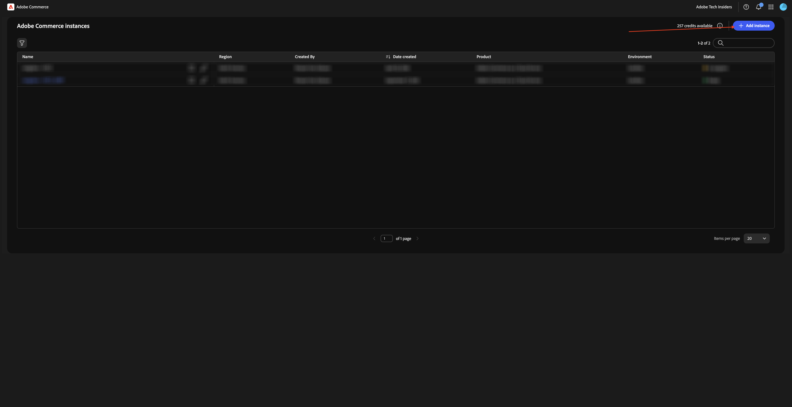

Renseignez les champs comme suit :

- **Nom de l’instance** :

```
--aepUserLdap-- - ACCS
```

- **Environnement** : `Sandbox`
- **Region** : `North America`

Cliquez sur **Ajouter une instance**.

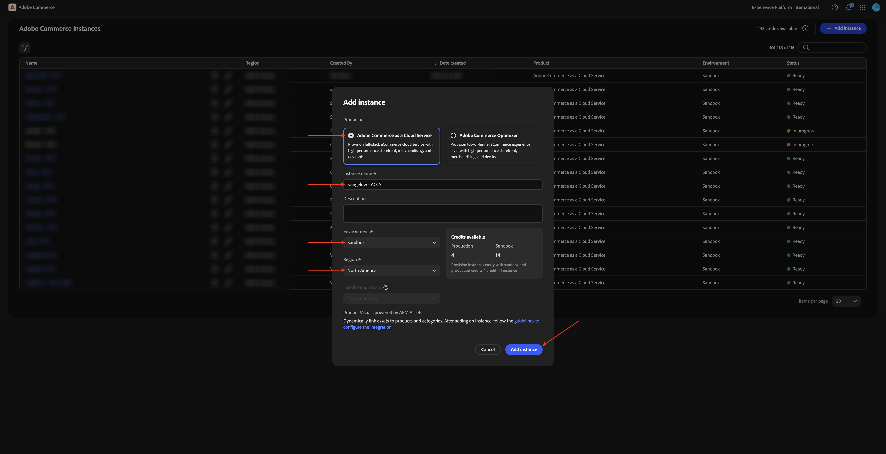

Votre instance est en cours de création. Cela peut prendre 5 à 10 minutes.

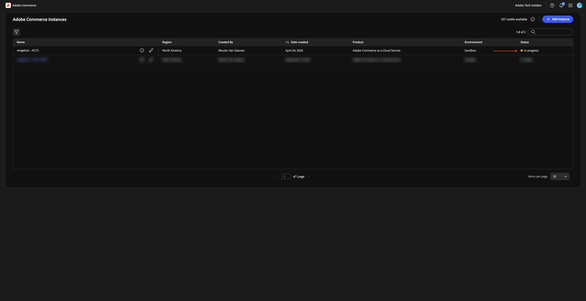

Une fois l’instance prête, cliquez sur votre instance pour l’ouvrir.


## 1.5.1.2 Configurer votre boutique CitiSignal

Vous devriez alors voir ceci. Cliquez sur **Se connecter avec Adobe ID** puis connectez-vous.


Une fois la connexion effectuée, vous devriez voir cette page d’accueil. La première étape consiste à configurer votre boutique CitiSignal dans Commerce. Cliquez sur **Magasins**.


Cliquez sur **Toutes les boutiques**.

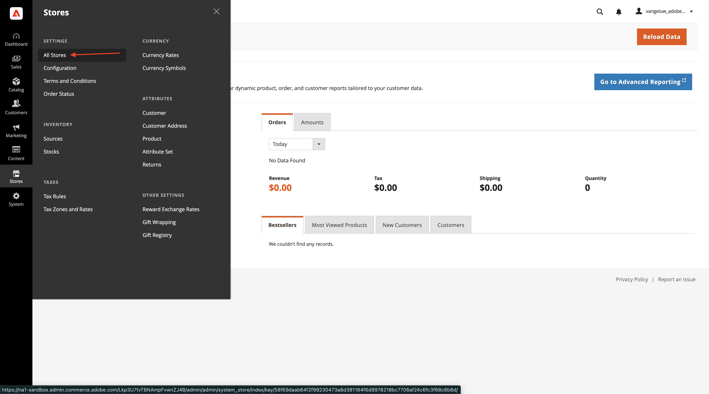

Cliquez sur **Créer un site web**.

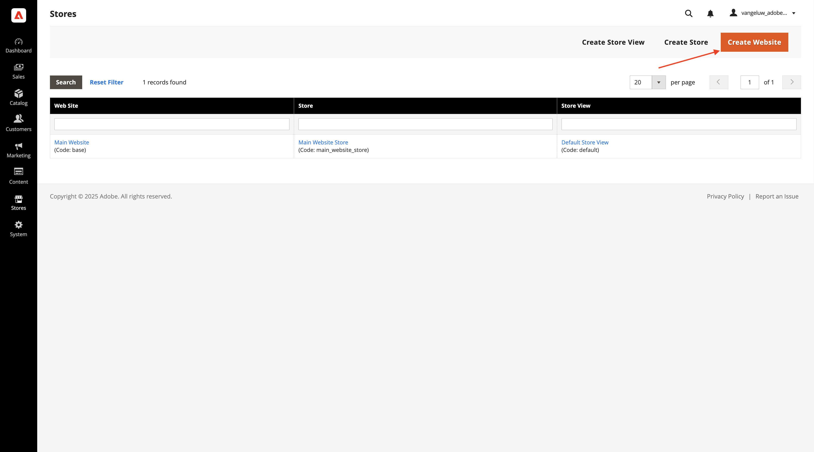

Renseignez les champs comme suit :

- **Nom** :

```
CitiSignal
```

- **Code** :

```
citisignal
```

Cliquez sur **Enregistrer le site web**.


Tu devrais alors être de retour ici. Cliquez sur **Créer une boutique**.

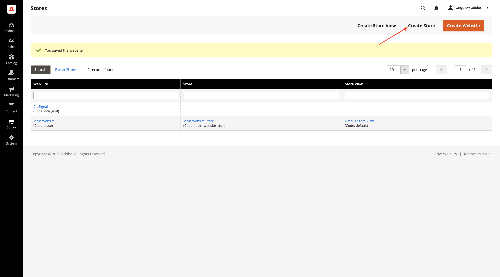

Renseignez les champs comme suit :

- **Site web** :

```
CitiSignal
```

- **Nom** :

```
CitiSignal
```

- **Code** :

```
citisignal
```

- **Catégorie racine** : `Default Category`

Cliquez sur **Enregistrer la boutique**.

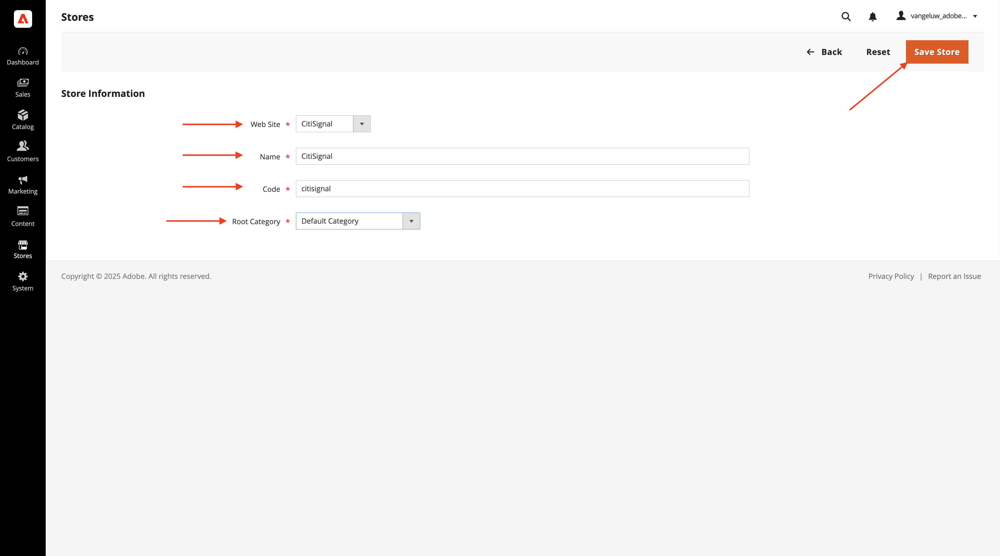

Tu devrais alors être de retour ici. Cliquez sur **Créer une vue de magasin**.


Renseignez les champs comme suit :

- **Store** :

```
CitiSignal
```

- **Nom** :

```
CitiSignal
```

- **Code** :

```
citisignal
```

- **Statut** : `Enabled`

Cliquez sur **Enregistrer la vue de la boutique**.


Vous devriez alors voir ce message. Cliquez sur **OK**.


Tu devrais alors être de retour ici. Cliquez sur le site Web **CitiSignal** pour l&#39;ouvrir.


Cochez la case pour définir ce site Web comme site Web par défaut.

Cliquez sur **Enregistrer le site web**.


Tu devrais alors être de retour ici.


## 1.5.1.3 Configurer les catégories et les produits

Accédez à **Catalogue** puis sélectionnez **Catégories**.

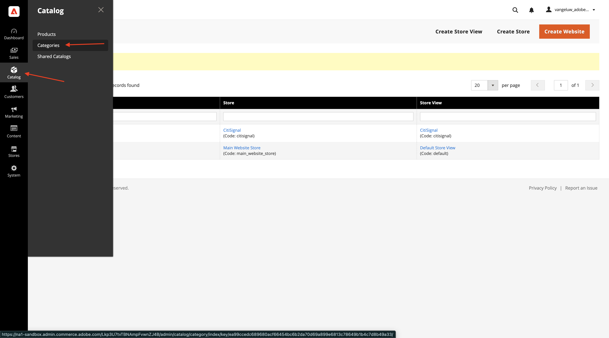

Sélectionnez **Catégorie par défaut** puis cliquez sur **Ajouter une sous-catégorie**.


Saisissez le nom suivant, puis cliquez sur **Enregistrer**.

```
Phones
```

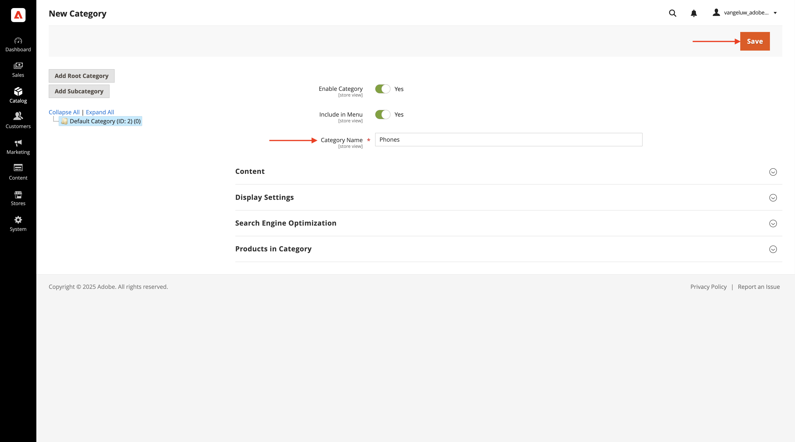

Sélectionnez **Catégorie par défaut** puis cliquez de nouveau sur **Ajouter une sous-catégorie**.


Saisissez le nom suivant, puis cliquez sur **Enregistrer**.

```
Watches
```


Sélectionnez **Catégorie par défaut** puis cliquez de nouveau sur **Ajouter une sous-catégorie**.

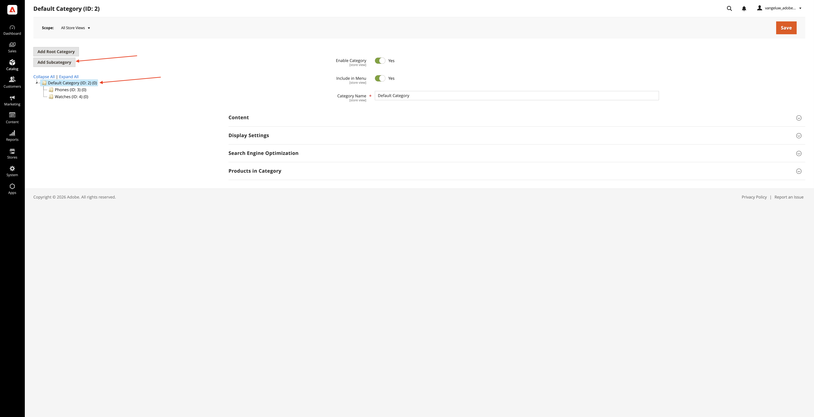

Saisissez le nom suivant, puis cliquez sur **Enregistrer**.

```
Plans
```


Sélectionnez **Catégorie par défaut** puis cliquez de nouveau sur **Ajouter une sous-catégorie**.


Saisissez le nom suivant, puis cliquez sur **Enregistrer**.

```
Entertainment
```


4 catégories doivent alors être créées.

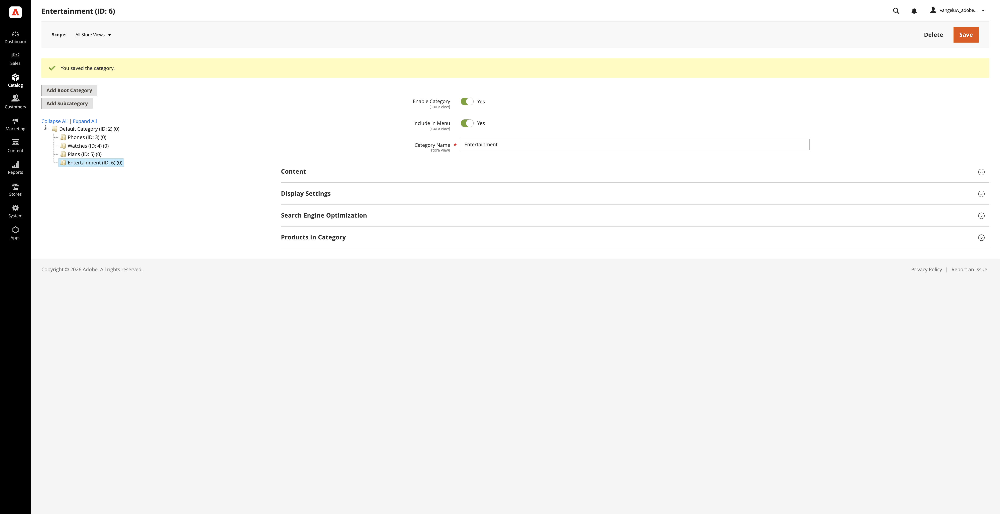

Ensuite, accédez à **Catalogue** puis sélectionnez **Produits**.


Vous devriez alors voir ceci. Cliquez sur **Ajouter un produit**.

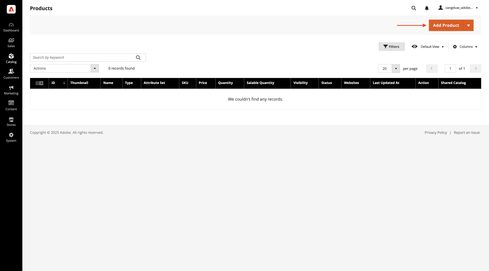

Configurez votre produit comme suit :

- **Nom du produit** :

```
iPhone Air
```

- **SKU** :

>[!NOTE]
>
>Veuillez vous assurer que le champ SKU est identique à la valeur ci-dessous et qu’il n’y a pas d’espace dans ce champ.

```
iPhone-Air
```

- **Prix** :

```
999
```

- **Quantité** :

```
10000
```

- **Catégories** : sélectionnez `Phones`

Cliquez sur **Enregistrer**.

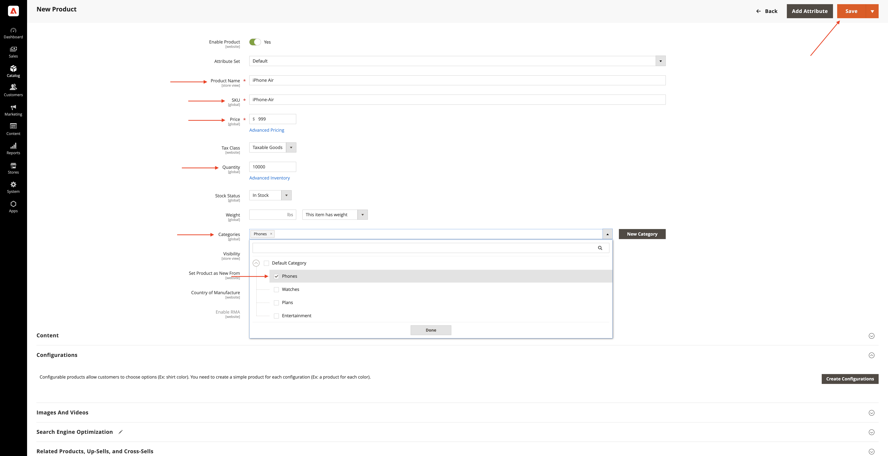

Faites défiler jusqu’à **Configurations** et cliquez sur **Créer des configurations**.


Vous devriez alors voir ceci. Cliquez sur **Créer un attribut**.


Définissez le **Libellé par défaut** sur la valeur ci-dessous, puis cliquez sur **Ajouter une option** sous **Gérer les options**.

```
Storage
```

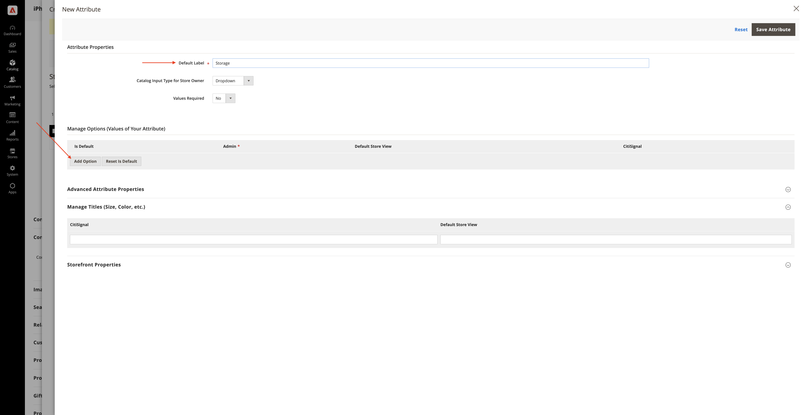

Configurez la première option en utilisant la valeur ci-dessous dans les 3 colonnes, puis cliquez de nouveau sur **Ajouter une option**.

```
256GB
```

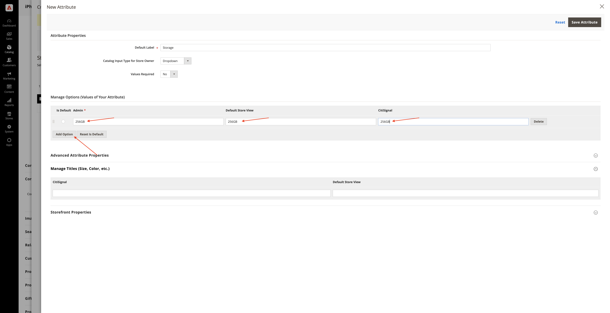

Configurez la deuxième option en utilisant la valeur ci-dessous dans les 3 colonnes, puis cliquez de nouveau sur **Ajouter une option**.

```
512GB
```

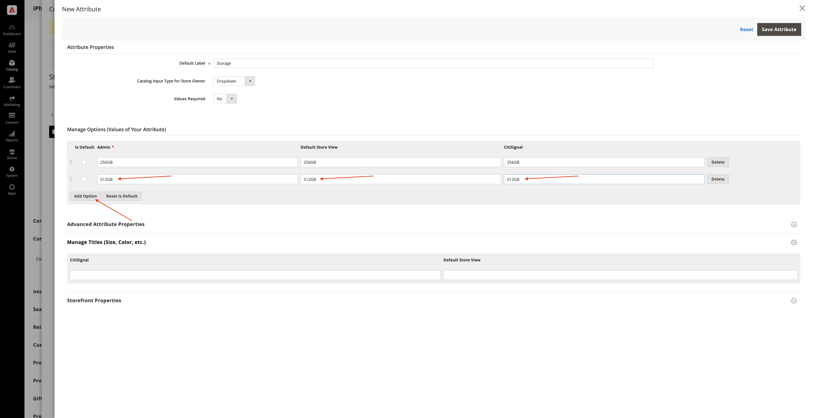

Configurez la troisième option en utilisant la valeur ci-dessous dans les 3 colonnes.

```
1TB
```

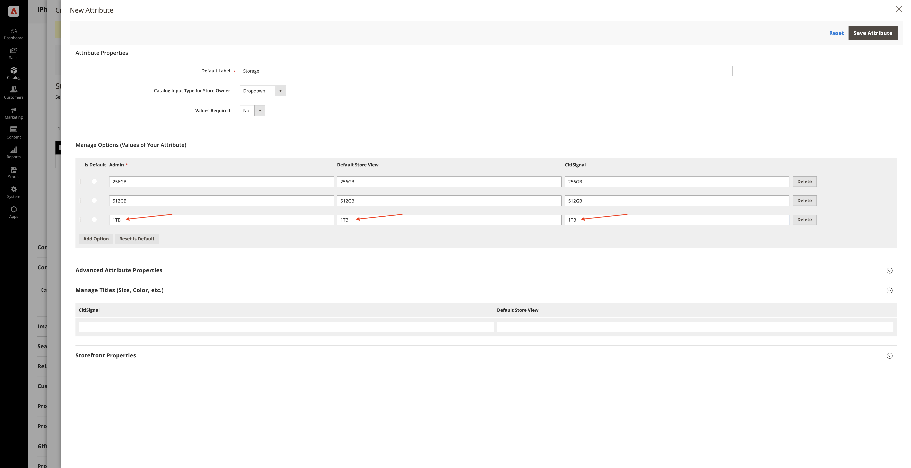

Faites défiler jusqu’à **Propriétés du storefront**. Définissez les options suivantes sur **Oui** :

- **Utiliser dans la recherche**
- **Autoriser les balises HTML sur Storefront**
- **Visible sur les pages de catalogue sur Storefront**
- **Utiliser dans la liste de produits**

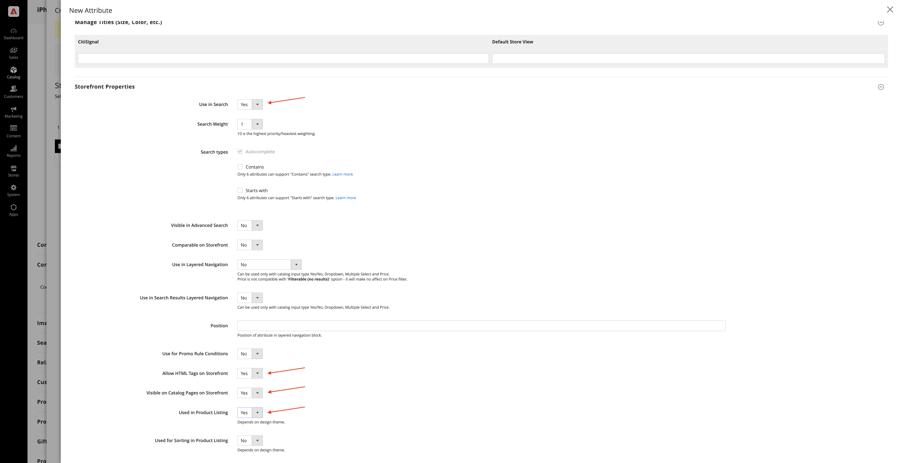

Faites défiler vers le haut et cliquez sur **Enregistrer l’attribut**.


Vous devriez alors voir ceci. Sélectionnez les deux attributs **couleur** et **stockage**, puis cliquez sur **Suivant**.


Vous devriez alors voir ceci. Vous devez maintenant ajouter les options de couleur disponibles. Pour ce faire, cliquez sur **Créer une valeur**.

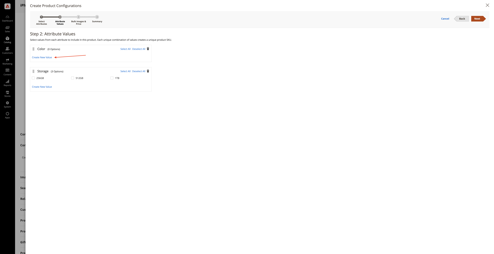

Saisissez la valeur `Sky-Blue` et cliquez sur **Créer une valeur**.


Saisissez la valeur `Light-Gold` et cliquez sur **Créer une valeur**.

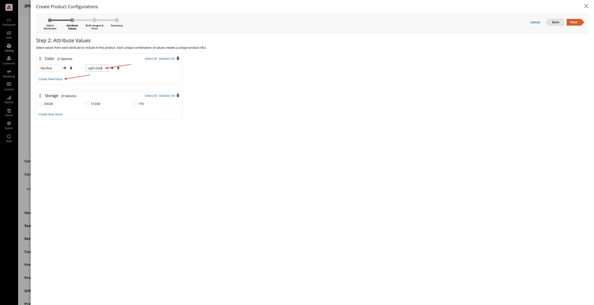

Saisissez la valeur `Cloud-White` et cliquez sur **Créer une valeur**.

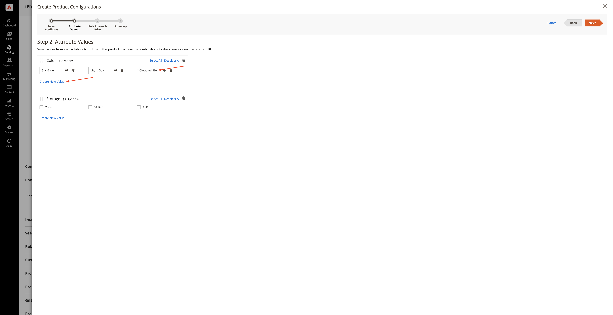

Saisissez la valeur `Space-Black`. Cliquez sur **Tout sélectionner**


Sélectionnez les 3 options sous **Stockage** et cliquez sur **Suivant**.


Laissez les paramètres par défaut et cliquez sur **Suivant**.


Vous devriez alors voir ceci. Cliquez sur **Générer des produits**.

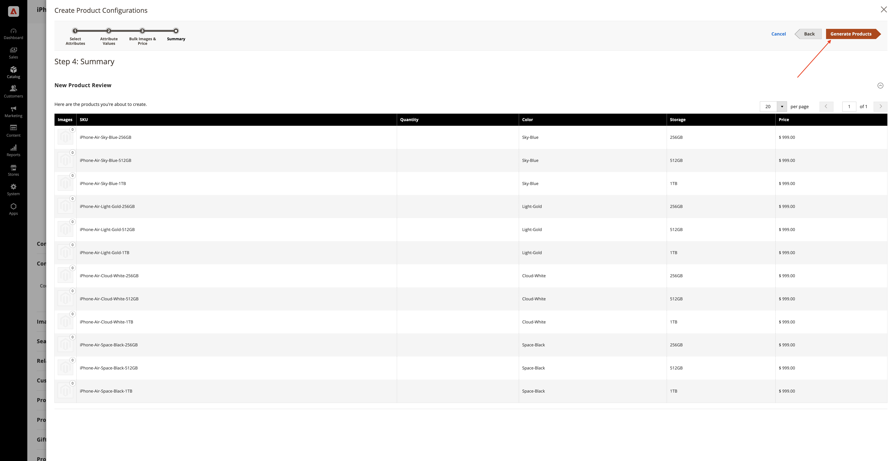

Définissez la **Quantité** de chaque produit à `10000`. Assurez-vous également que la colonne **SKU** ne comporte aucun espace dans l’un des SKU.

Cliquez sur **Enregistrer**.

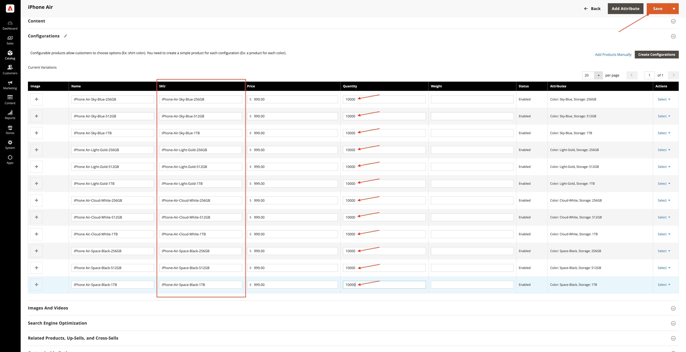

Cliquez sur **Confirmer**.


Faites défiler jusqu’à **Produit dans Sites web** et cochez la case **CitiSignal**.

Cliquez sur **Enregistrer**.

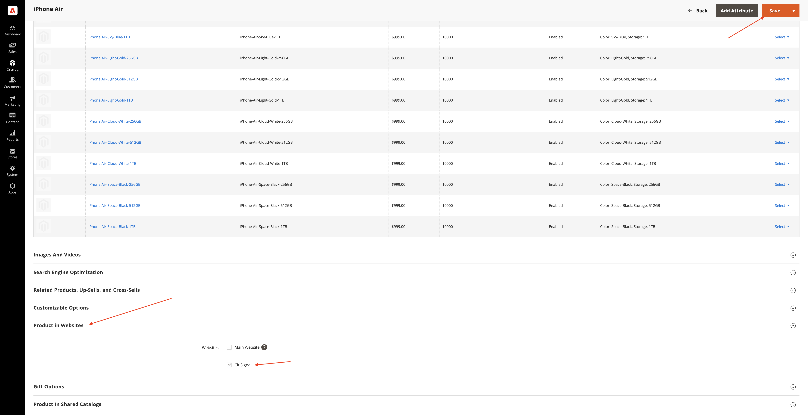

Vous devriez alors voir ceci. Cliquez sur **Précédent**.

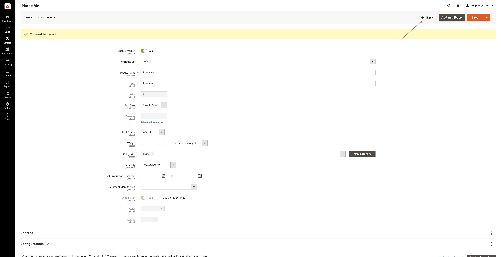

Le produit **iPhone Air** et ses variantes s’affichent désormais dans le catalogue de produits.

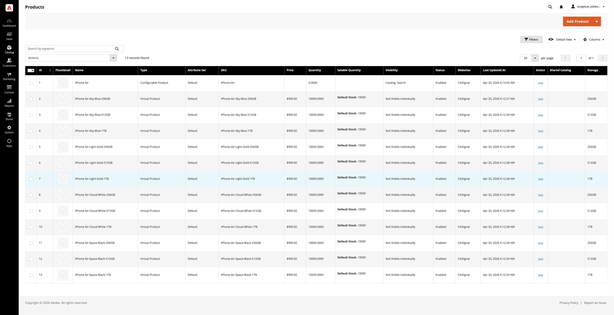

## 1.5.1.4 Importer Des Produits

CitiSignal vend plus de produits, donc pour créer les produits restants dans le catalogue de produits, vous devez maintenant les importer.

Accédez à **Système** puis à **Importer**.


Sélectionnez les valeurs suivantes :

- **Type d’entité** : `Products`
- **Comportement d’importation** : `Add/Update`
- **Stratégie de validation** : `Skip error entries`

Cliquez sur **Choisir un fichier**.


Téléchargez ce fichier sur votre ordinateur : [product_catalog_import.csv.zip](./assets/product_catalog_import.csv.zip). Extrayez le fichier sur votre bureau.


Sélectionnez le **`product_catalog_import.csv`** de fichier et cliquez sur **Ouvrir**.


Vous devriez alors voir ceci. Cliquez sur **Vérifier les données**.

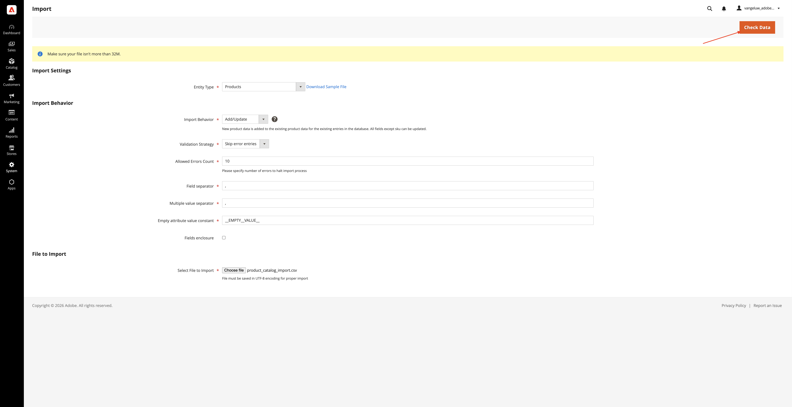

Vous devriez alors voir ceci. Cliquez sur **Importer**.

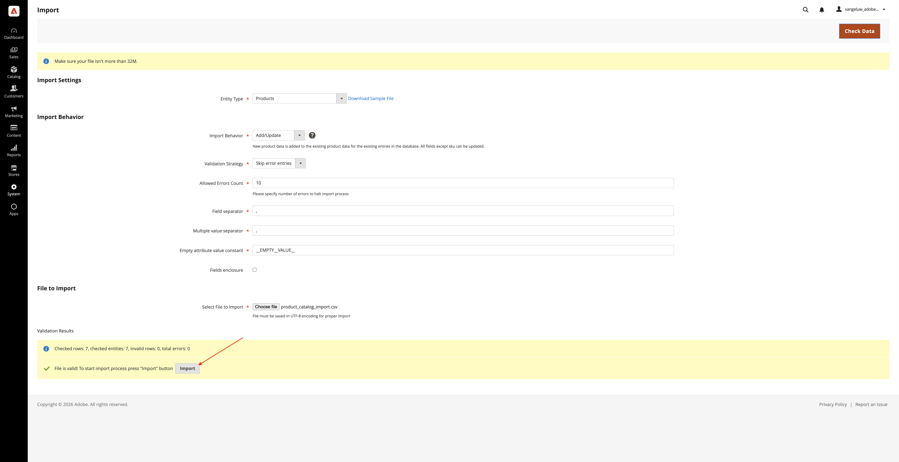

Vous devriez alors voir ceci.

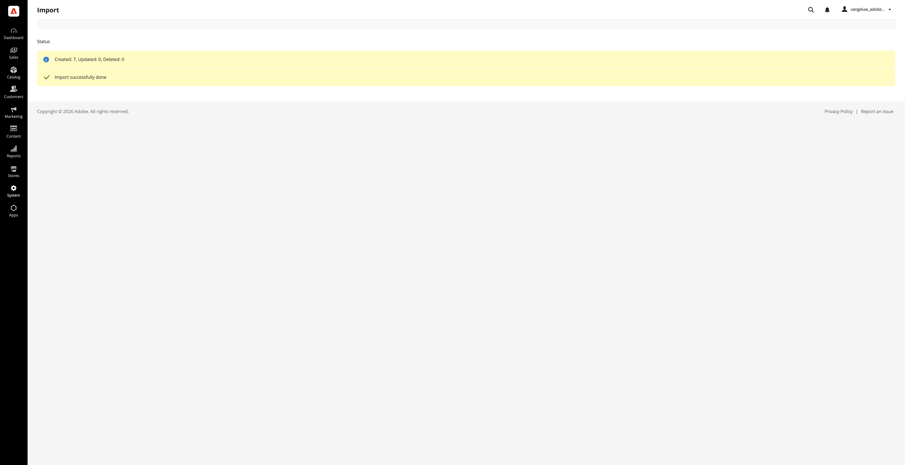

Accédez à **Catalogue** puis à **Produits**.

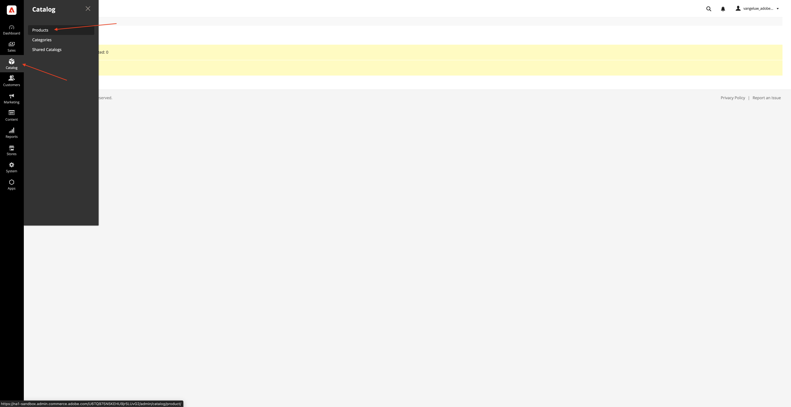

Faites défiler la page vers le bas pour trouver les produits que vous venez d’importer.

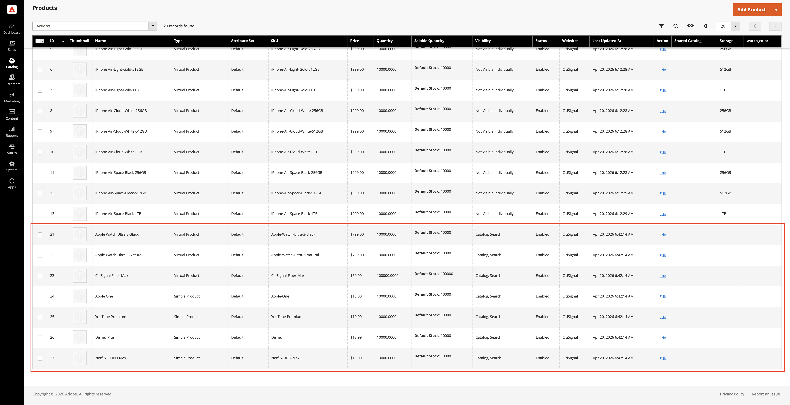

Étape suivante : [Connexion d’ACCS au storefront AEM Sites CS/EDS](./ex2.md){target="_blank"}

Revenir à [Adobe Commerce as a Cloud Service](./accs.md){target="_blank"}

[Revenir à tous les modules](./../../../overview.md){target="_blank"}
