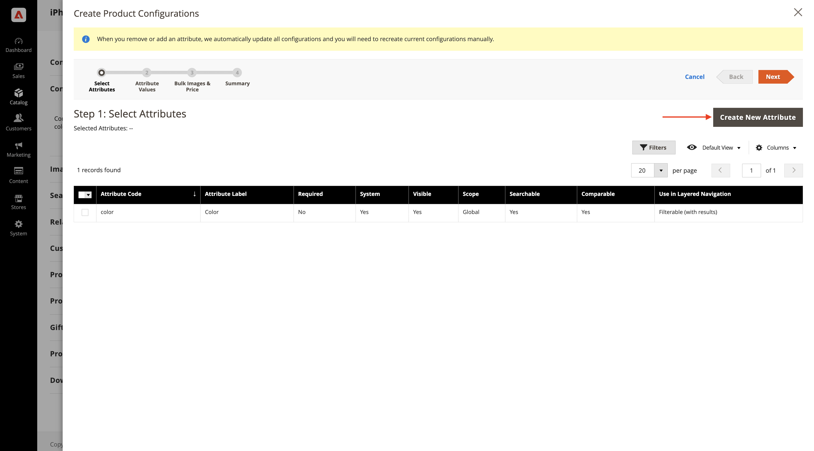
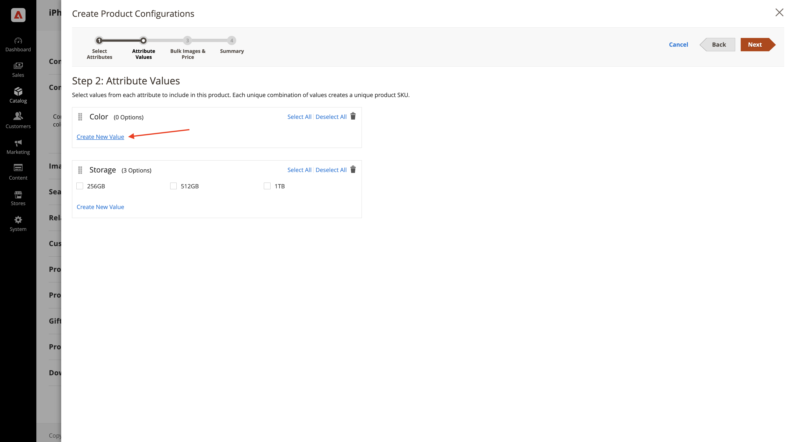
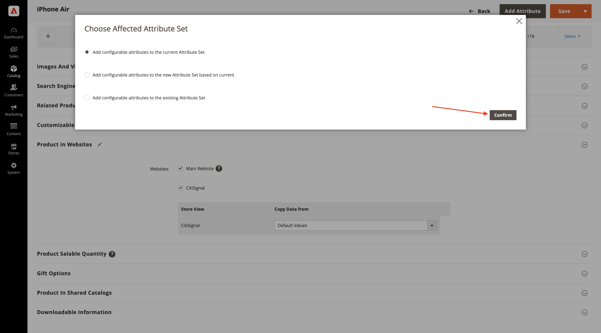

# 1.5.1 Prise en main d’Adobe Commerce as a Cloud Service

Accédez à [https://experience.adobe.com/](https://experience.adobe.com/){target="_blank"}. Assurez-vous que vous vous trouvez dans l’environnement correct, qui doit être nommé `--aepImsOrgName--`. Cliquez sur **Commerce**.

## 1.5.1.1 Créer votre instance ACCS

Vous devriez alors voir ceci. Cliquez sur **+ Ajouter une instance**.

Renseignez les champs comme suit :

- **Nom de l’instance** : `--aepUserLdap-- - ACCS`
- **Environnement** : `Sandbox`
- **Region** : `North America`

Cliquez sur **Ajouter une instance**.

Votre instance est en cours de création. Cela peut prendre 5 à 10 minutes.

Une fois l’instance prête, cliquez sur votre instance pour l’ouvrir.

## 1.5.1.2 Configurer votre boutique CitiSignal

Vous devriez alors voir ceci. Cliquez sur **Se connecter avec Adobe ID** puis connectez-vous.

Une fois la connexion effectuée, vous devriez voir cette page d’accueil. La première étape consiste à configurer votre boutique CitiSignal dans Commerce. Cliquez sur **Magasins**.

Cliquez sur **Toutes les boutiques**.

Cliquez sur **Créer un site web**.

Renseignez les champs comme suit :

- **Nom** : `CitiSignal`
- **Code** : `citisignal`

Cliquez sur **Enregistrer le site web**.

Tu devrais alors être de retour ici. Cliquez sur **Créer une boutique**.

Renseignez les champs comme suit :

- **Site Web** : `CitiSignal`
- **Nom** : `CitiSignal`
- **Code** : `citisignal`
- **Catégorie racine** : `Default Category`

Cliquez sur **Enregistrer la boutique**.

Tu devrais alors être de retour ici. Cliquez sur **Créer une vue de magasin**.

Renseignez les champs comme suit :

- **Store** : `CitiSignal`
- **Nom** : `CitiSignal`
- **Code** : `citisignal`
- **Statut** : `Enabled`

Cliquez sur **Enregistrer la vue de la boutique**.

Vous devriez alors voir ce message. Cliquez sur **OK**.

Tu devrais alors être de retour ici.

## 1.5.1.3 Configurer les catégories et les produits

Accédez à **Catalogue** puis sélectionnez **Catégories**.

Sélectionnez **Catégorie par défaut** puis cliquez sur **Ajouter une sous-catégorie**.

Saisissez le nom `Phones`, puis cliquez sur **Enregistrer**.

Sélectionnez **Catégorie par défaut** puis cliquez de nouveau sur **Ajouter une sous-catégorie**.

Saisissez le nom `Watches`, puis cliquez sur **Enregistrer**.

Vous devriez alors avoir 2 catégories créées.

Ensuite, accédez à **Catalogue** puis sélectionnez **Produits**.

Vous devriez alors voir ceci. Cliquez sur **Ajouter un produit**.

Configurez votre produit comme suit :

- **Nom du produit** : `iPhone Air`
- **SKU** : `iPhone-Air`
- **Prix** : `999`
- **Quantité** : `10000`
- **Catégories** : sélectionnez `Phones`

Cliquez sur **Enregistrer**.

Faites défiler jusqu’à **Configurations** et cliquez sur **Créer des configurations**.

Vous devriez alors voir ceci. Cliquez sur **Créer un attribut**.

Définissez le **Libellé par défaut** sur `Storage`, puis cliquez sur **Ajouter une option** sous **Gérer les options**.

Configurez la première option en utilisant le nom `256GB` dans les 3 colonnes, puis cliquez de nouveau sur **Ajouter une option**.

Configurez la deuxième option en utilisant le nom `512GB` dans les 3 colonnes, puis cliquez de nouveau sur **Ajouter une option**.

Configurez la troisième option en utilisant le nom `1TB` dans les 3 colonnes, puis cliquez de nouveau sur **Ajouter une option**.

Faites défiler jusqu’à **Propriétés du storefront**. Définissez les options suivantes sur **Oui** :

- **Utiliser dans la recherche**
- **Autoriser les balises HTML sur Storefront**
- **Visible sur les pages de catalogue sur Storefront**
- **Utiliser dans la liste de produits**

Faites défiler vers le haut et cliquez sur **Enregistrer l’attribut**.

Vous devriez alors voir ceci. Sélectionnez les deux attributs **couleur** et **stockage**, puis cliquez sur **Suivant**.

Vous devriez alors voir ceci. Vous devez maintenant ajouter les options de couleur disponibles. Pour ce faire, cliquez sur **Créer une valeur**.

Saisissez la valeur `Sky-Blue` et cliquez sur **Créer une valeur**.

Saisissez la valeur `Light-Gold` et cliquez sur **Créer une valeur**.

Saisissez la valeur `Cloud-White` et cliquez sur **Créer une valeur**.

Saisissez la valeur `Space-Black`. Cliquez sur **Tout sélectionner**

Sélectionnez les 3 options sous **Stockage** et cliquez sur **Suivant**.

Laissez les paramètres par défaut et cliquez sur **Suivant**.

Vous devriez alors voir ceci. Cliquez sur **Générer des produits**.

Cliquez sur **Enregistrer**.

Faites défiler jusqu’à **Produit dans Sites web** et cochez la case **CitiSignal**.

Cliquez sur **Enregistrer**.

Cliquez sur **Confirmer**.

Vous devriez alors voir ceci. Cliquez sur **Précédent**.

Le produit **iPhone Air** et ses variantes s’affichent désormais dans le catalogue de produits.

Étape suivante : [Connexion d’ACCS au storefront AEM Sites CS/EDS](./ex2.md){target="_blank"}

Revenir à [Adobe Commerce as a Cloud Service](./accs.md){target="_blank"}

[Revenir à tous les modules](./../../../overview.md){target="_blank"}
