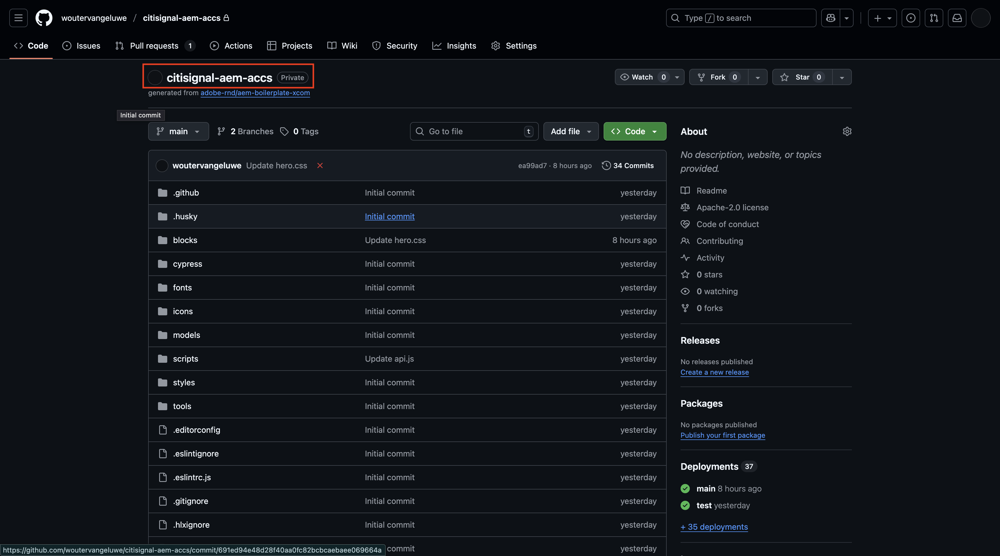

# 1.5.2 Connexion d’ACCS au storefront AEM Sites CS/EDS

>[!IMPORTANT]
>
>Pour effectuer cet exercice, vous devez avoir accès à un environnement AEM Sites et Assets CS avec EDS fonctionnel.
>
>Si vous ne disposez pas encore d’un tel environnement, passez à l’exercice [Adobe Experience Manager Cloud Service &amp; Edge Delivery Services](./../../../modules/asset-mgmt/module2.1/aemcs.md){target="_blank"}. Suivez les instructions qui s’affichent à cet endroit et vous aurez accès à un tel environnement.

>[!IMPORTANT]
>
>Si vous avez précédemment configuré un programme AEM CS avec un environnement AEM Sites et Assets CS, il se peut que votre sandbox AEM CS ait été mis en veille. Étant donné que la réactivation d’un tel sandbox prend entre 10 et 15 minutes, il serait judicieux de lancer le processus de réactivation maintenant afin de ne pas avoir à l’attendre plus tard.

Dans cet exercice, vous allez lier le storefront AEM Sites CS/EDS au serveur principal ACCS. Pour le moment, lorsque vous ouvrez votre storefront AEM Sites CS/EDS et accédez à la page de liste de produits **Phones**, vous ne voyez aucun produit.

À la fin de cet exercice, vous devriez voir les produits que vous avez configurés dans l’exercice précédent apparaître sur la page de liste de produits **Phones** sur votre storefront AEM Sites CS/EDS.

Accédez à [https://experience.adobe.com/](https://experience.adobe.com/){target="_blank"}. Assurez-vous que vous vous trouvez dans l’environnement correct, qui doit être nommé `--aepImsOrgName--`. Cliquez sur **Commerce**.

Cliquez sur l’icône **info** en regard de votre instance ACCS, qui doit être nommée `--aepUserLdap-- - ACCS`.

Vous devriez alors voir ceci. Copiez le point d’entrée **GraphQL**.

Accédez à [https://da.live/app/adobe-commerce/storefront-tools/tools/config-generator/config-generator](https://da.live/app/adobe-commerce/storefront-tools/tools/config-generator/config-generator). Vous devez maintenant générer un fichier config.json qui sera utilisé pour lier votre storefront AEM Sites CS à votre serveur principal ACCS.

Sur la page **Générateur de configuration**, collez l’URL du point d’entrée **GraphQL** que vous avez copiée.

Cliquez sur **Générer**.

Copiez la payload JSON générée dans son intégralité.

Accédez au référentiel GitHub créé lors de la configuration de votre environnement AEM Sites CS/EDS. Ce référentiel a été créé dans l’exercice [1.1.2 Configuration de votre environnement AEM CS](./../../../modules/asset-mgmt/module2.1/ex3.md){target="_blank"} et doit être nommé **citisignal-aem-accs**.

Dans le répertoire racine, faites défiler l’écran vers le bas et cliquez pour ouvrir le fichier **config.json**.

Cliquez sur l&#39;icône **Edition**.

Supprimez tout le texte actuel et remplacez-le en collant la payload JSON que vous avez copiée sur la page **Générateur de configuration**.

Cliquez sur **Valider les modifications...**.

Cliquez sur **Valider les modifications**.

Le fichier **config.json** a été mis à jour. Vos modifications devraient s’afficher sur le site web dans quelques minutes. Pour vérifier si les modifications ont été récupérées avec succès, accédez à la page du produit **Phones**. Vous devriez maintenant voir l’**iPhone Air** apparaître sur la page.

Pour accéder à votre site web, vous devez accéder à `main--citisignal-aem-accs--XXX.aem.page` et/ou `main--citisignal-aem-accs--XXX.aem.live`, après avoir remplacé XXX par votre compte utilisateur GitHub, qui est `woutervangeluwe` dans cet exemple.

Dans cet exemple, l’URL complète devient :
`https://main--citisignal-aem-accs--woutervangeluwe.aem.page` et/ou `https://main--citisignal-aem-accs--woutervangeluwe.aem.live`

Bien que le produit s’affiche maintenant avec succès, aucune image n’est encore disponible pour le produit. Vous allez configurer le lien avec AEM Assets CS pour les images de produit dans l’exercice suivant.

Étape suivante : [Connecter ACCS à AEM Assets CS](./ex3.md){target="_blank"}

Revenir à [Adobe Commerce as a Cloud Service](./accs.md){target="_blank"}

[Revenir à tous les modules](./../../../overview.md){target="_blank"}
