# 1.5.3 Connexion d’ACCS à AEM Assets CS

>[!IMPORTANT]
>
>Pour effectuer cet exercice, vous devez avoir accès à un environnement AEM Sites et Assets CS avec EDS fonctionnel.
>
>Si vous ne disposez pas encore d’un tel environnement, passez à l’exercice [Adobe Experience Manager Cloud Service &amp; Edge Delivery Services](./../../../modules/asset-mgmt/module2.1/aemcs.md){target="_blank"}. Suivez les instructions qui s’affichent à cet endroit et vous aurez accès à un tel environnement.

>[!IMPORTANT]
>
>Si vous avez précédemment configuré un programme AEM CS avec un environnement AEM Sites et Assets CS, il se peut que votre sandbox AEM CS ait été mis en veille. Étant donné que la réactivation d’un tel sandbox prend entre 10 et 15 minutes, il serait judicieux de lancer le processus de réactivation maintenant afin de ne pas avoir à l’attendre plus tard.

Après avoir terminé l’exercice précédent, vous pouviez voir un produit renvoyé par l’ACCS à votre site web, mais il n’avait pas encore d’image. À la fin de cet exercice, vous devriez également voir une image renvoyée.

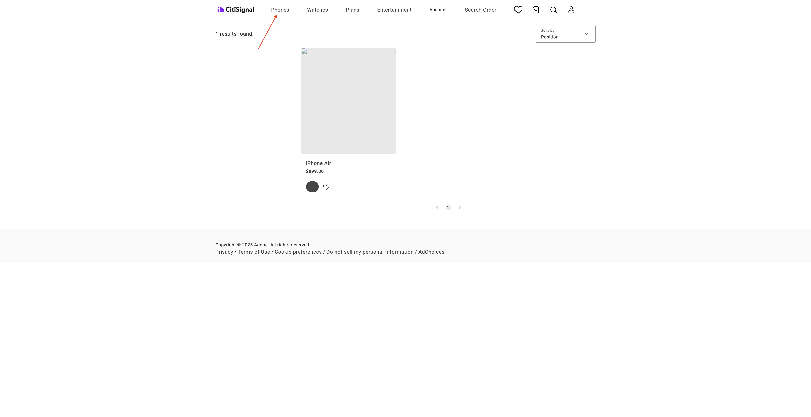

## 1.5.3.1 la configuration du pipeline de mise à jour

Accédez à [](https://my.cloudmanager.adobe.com){target="_blank"}. L’organisation que vous devez sélectionner est `--aepImsOrgName--`.

Cliquez pour ouvrir votre programme Cloud Manager, qui doit être nommé comme l’un des suivants :

- `--aepUserLdap-- - CitiSignal AEM+ACCS`
- Pour les sessions de l’atelier technique en personne : **Insiders techniques - AEM + ACCS XX** (remplacez XX par le numéro qui vous a été attribué).
- Pour les sessions guidées à la demande : **Tech Insiders On Demand - AEM + ACCS XX** (remplacez XX par le numéro qui vous a été attribué)


Faites défiler l’écran vers le bas, puis cliquez sur **Accéder aux informations sur le référentiel** dans l’onglet **Pipelines**.

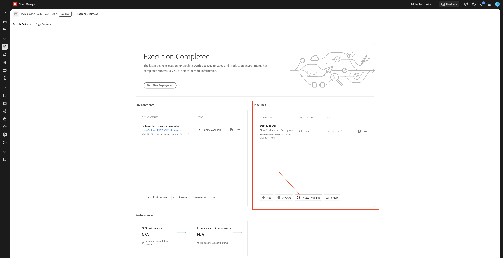

Vous devriez alors voir ceci. Cliquez sur **Générer un mot de passe**.


Cliquez de nouveau sur **Générer un mot de passe**.


Vous devriez alors disposer d’un mot de passe. Cliquez ensuite sur l’icône **copy** en regard du champ **ligne de commande Git**.


Créez un nouveau répertoire à un emplacement de votre choix sur votre ordinateur et nommez-le **GitHub du pipeline**.


Cliquez avec le bouton droit sur votre dossier, puis sélectionnez **Nouveau terminal dans le dossier**.


Vous devriez alors voir ceci.

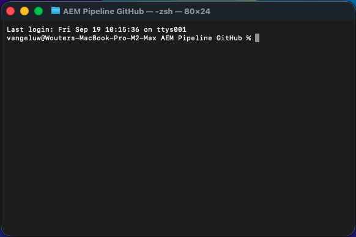

Collez la commande **ligne de commande Git** que vous avez copiée précédemment dans la fenêtre Terminal.


Vous devez saisir un nom d’utilisateur. Copiez le nom d’utilisateur du pipeline de programme Cloud Manager **Accéder aux informations sur le référentiel** et appuyez sur **Entrée**.


Ensuite, vous devez saisir le mot de passe. Copiez le mot de passe du pipeline du programme Cloud Manager **Accéder aux informations sur le référentiel** et appuyez sur **Entrée**.


Cela peut prendre une minute. Une fois l’opération terminée, vous disposez d’une copie locale du référentiel Git lié au pipeline de votre programme.


Un nouveau répertoire s’affiche dans le répertoire **GitHub** du pipeline AEM. Ouvrez ce répertoire.


Sélectionnez tous les fichiers de ce répertoire et supprimez-les tous.


Vérifiez que le répertoire est vide.

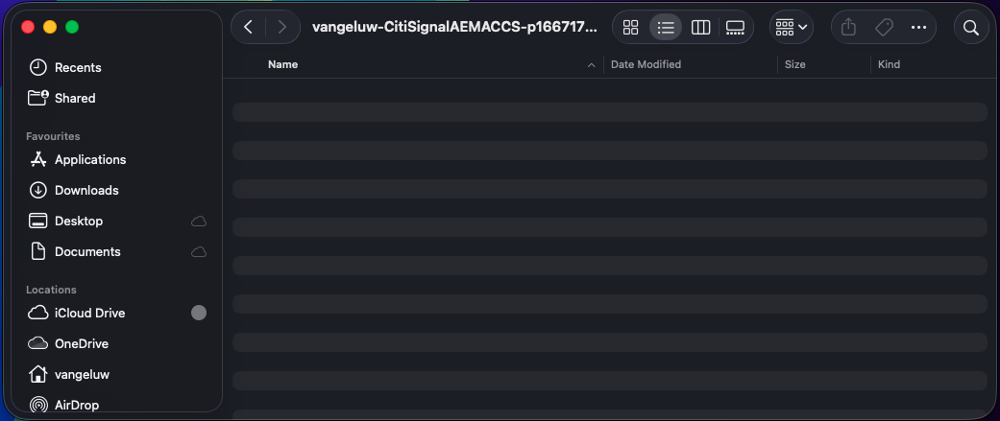

Accédez à [](https://github.com/ankumalh/assets-commerce). Cliquez sur **&lt;> Code** puis sélectionnez **Télécharger le fichier ZIP**. Téléchargez le fichier, puis déposez-le sur votre bureau.


Copiez ensuite le fichier **assets-commerce-main.zip** sur votre bureau et décompressez-le. Ouvrez le dossier **assets-commerce-main**.

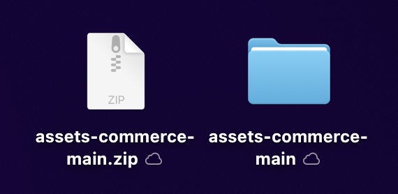

Copiez tous les fichiers du répertoire **assets-commerce-main** dans le répertoire vide du répertoire du référentiel de pipeline de votre programme.

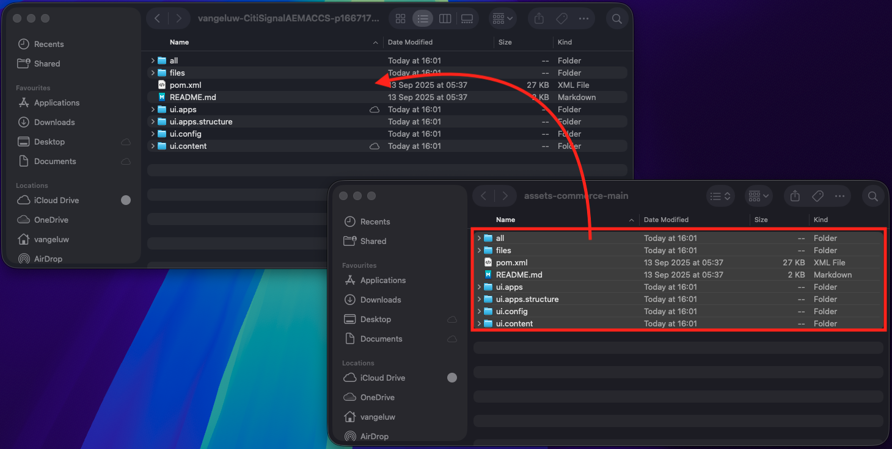

Ouvrez ensuite **Microsoft Visual Studio Code** et ouvrez le dossier contenant le référentiel de pipeline de votre programme dans **Microsoft Visual Studio Code**.


Accédez à **Rechercher** dans le menu de gauche et recherchez `<my-app>`. Vous devez remplacer toutes les occurrences de `<my-app>` par `techinsiderscitisignalaemaccs`.

Cliquez sur l’icône **tout remplacer**.

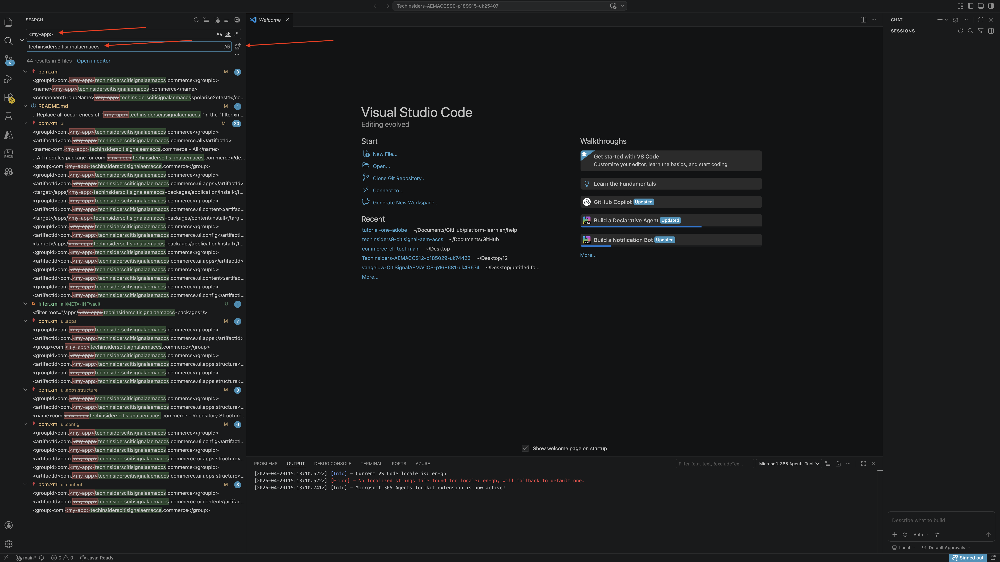

Cliquez sur **Remplacer**.


Les nouveaux fichiers sont maintenant prêts à être chargés à nouveau dans le référentiel Git lié au référentiel Pipeline de votre programme. Pour ce faire, ouvrez le dossier **GitHub du pipeline** et cliquez avec le bouton droit de la souris sur le dossier contenant les nouveaux fichiers. Sélectionnez **Nouveau terminal dans le dossier**.


Vous devriez alors voir ceci. Collez la commande suivante et appuyez sur **entrée**.

```
git add .
```


Vous devriez alors voir ceci. Collez la commande suivante et appuyez sur **entrée**.

```
git commit -m "add assets integration"
```


Vous devriez alors voir ceci. Collez la commande suivante et appuyez sur **entrée**.

```
git push origin main
```


Vous devriez alors voir ceci. Vos modifications ont maintenant été déployées dans le référentiel Git de votre pipeline de programme.

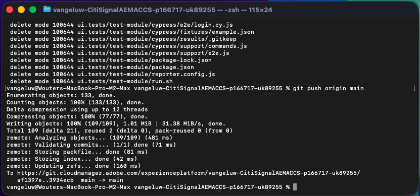

Revenez à Cloud Manager et cliquez sur **Fermer**.


Après avoir apporté des modifications au référentiel Git du pipeline, vous devez exécuter à nouveau le pipeline **Déployer vers l’environnement de développement**. Cliquez sur le **de 3 points...** et sélectionnez **Exécuter**.


Cliquez sur **Exécuter**. L’exécution d’un déploiement de pipeline peut prendre entre 10 et 15 minutes. Vous devez attendre que le déploiement du pipeline se termine avec succès avant de continuer.

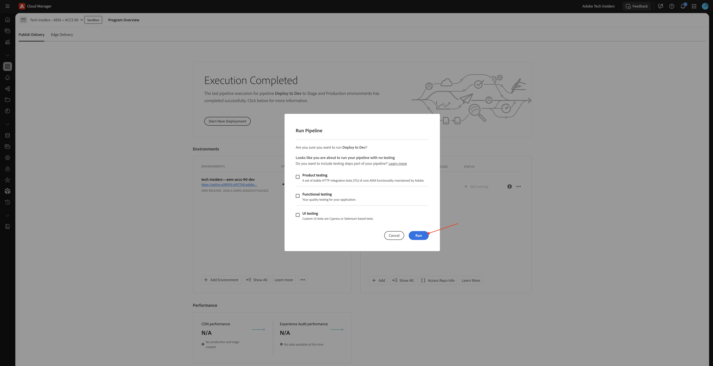

## 1.5.3.2 Activer l’intégration d’AEM Assets dans ACCS

Revenez à votre instance ACCS. Dans le menu de gauche, accédez à **Magasins** puis sélectionnez **Configuration**.


Faites défiler le menu vers le bas jusqu’à **SERVICES ADOBE** puis ouvrez **Intégration d’AEM Assets**. Vous devriez alors voir ceci.


Dans la liste déroulante de l’**environnement**, sélectionnez votre environnement.

Ensuite, définissez **Propriétaire de la visualisation** sur `AEM Assets` (décochez la case **utiliser la valeur du système** si nécessaire).

Ensuite, définissez **Synchronisation activée** sur `Yes` (décochez la case **Utiliser la valeur du système** si nécessaire).

Assurez-vous que ces paramètres sont définis comme suit :

- **Règle de correspondance des ressources** : `Match by product SKU`
- **Correspondance par nom d’attribut de SKU de produit** : `commerce:skus`

Cliquez sur **Enregistrer la configuration**.


Vous devriez alors voir ceci.


## 1.5.3.3 Update config.json

Accédez au référentiel GitHub créé lors de la configuration de votre environnement AEM Sites CS/EDS.

Dans le répertoire racine, faites défiler l’écran vers le bas et cliquez pour ouvrir le fichier **config.json**.

Vous devriez voir la ligne ci-dessous dans votre fichier **config.json** (ligne 17 dans cette image), assurez-vous qu’elle est définie sur **true**.

```json
 "commerce-assets-enabled": "true",
```

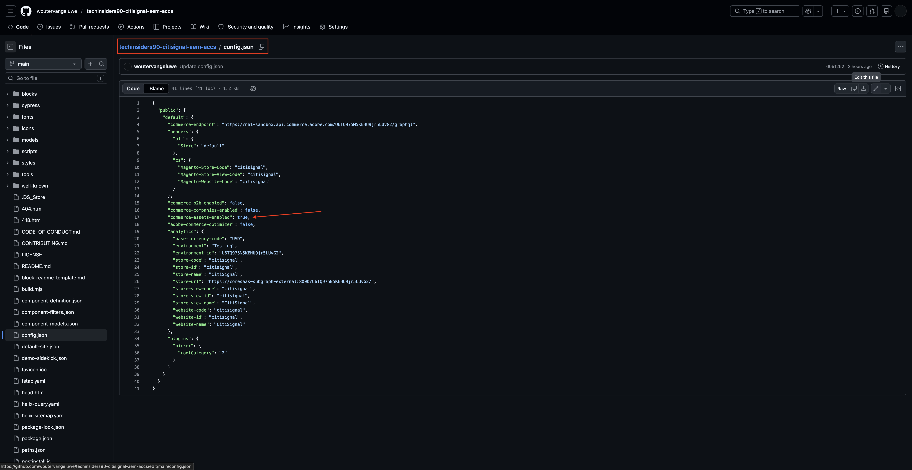

Si la valeur de **commerce-assets-enabled** est définie sur **false**, mettez à jour votre fichier et définissez la valeur sur **true**. Validez ensuite vos modifications.

## 1.5.3.4 la vérification des champs Commerce dans AEM Assets CS

Connectez-vous à votre environnement de création AEM CS et accédez à **Assets**.


Accédez à **Fichiers**.

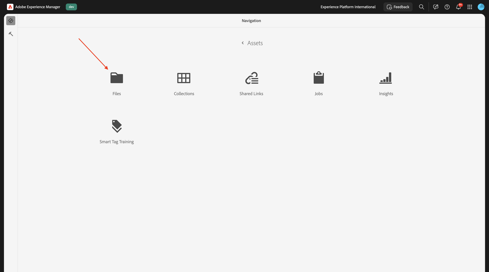

Ouvrez le dossier **CitiSignal**.


Pointez sur une ressource et cliquez sur l’icône **info**.


Vous devriez maintenant voir un onglet **** contenant 2 nouveaux attributs de métadonnées.

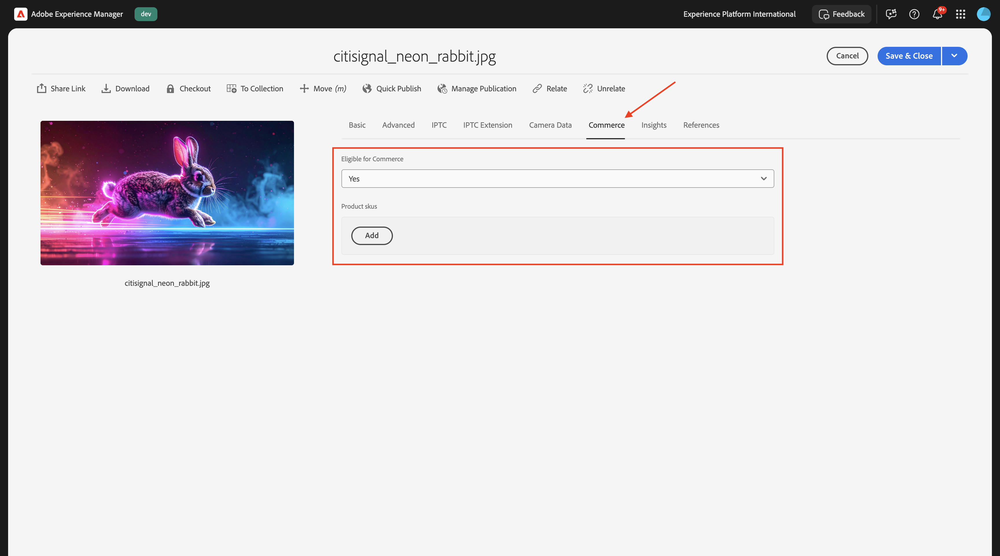

Votre environnement AEM Assets CS prend désormais en charge l’intégration de Commerce. Vous pouvez maintenant commencer à charger les images du produit.

## 1.5.3.4 Charger l’Assets du produit et créer un lien vers les produits

[Téléchargez les images du produit ici](./images/Product_Images.zip). Une fois téléchargés, exportez les fichiers sur votre bureau.

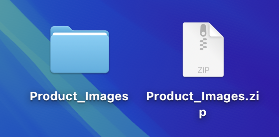

Cliquez sur **Créer** puis sélectionnez **Dossier**.


Saisissez la valeur **Product_Images** pour les champs **Titre** et **Nom**. Cliquez sur **Créer**.


Cliquez pour ouvrir le dossier que vous venez de créer.


Cliquez sur **Créer** puis sélectionnez **Fichiers**.


Accédez au dossier **Product_Images** sur le bureau, sélectionnez tous les fichiers, puis cliquez sur **Ouvrir**.


Cliquez sur **Télécharger**.

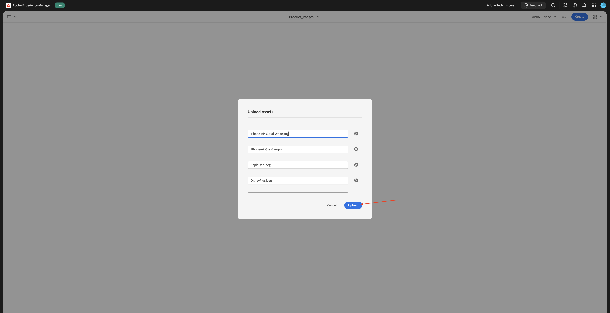

Vos images seront alors disponibles dans votre dossier. Pointez sur le produit **iPhone-Air-Light-Gold.png** et cliquez sur l’icône **Propriétés**.


Faites défiler vers le bas et définissez le champ **Statut de la révision** sur **Approuvé**. L’intégration AEM Assets CS - ACCS ne fonctionne que pour les images approuvées.


Faites défiler l’écran vers le haut, accédez à l’onglet **** puis cliquez sur **Ajouter** sous **SKU de produit**.


Ajoutez les SKU suivants pour ce produit :

| Clé | Valeur | Utilisation |
|:-------------:| :---------------:| :---------------:|
| `iPhone-Air-Light-Gold` | `1` | `thumbnail, image, swatch_image, small_image` |
| `iPhone-Air-Light-Gold-256GB` | `1` | `thumbnail, image, swatch_image, small_image` |
| `iPhone-Air-Light-Gold-512GB` | `1` | `thumbnail, image, swatch_image, small_image` |
| `iPhone-Air-Light-Gold-1TB` | `1` | `thumbnail, image, swatch_image, small_image` |

Tu devrais avoir ça. Cliquez sur **Enregistrer et fermer**.

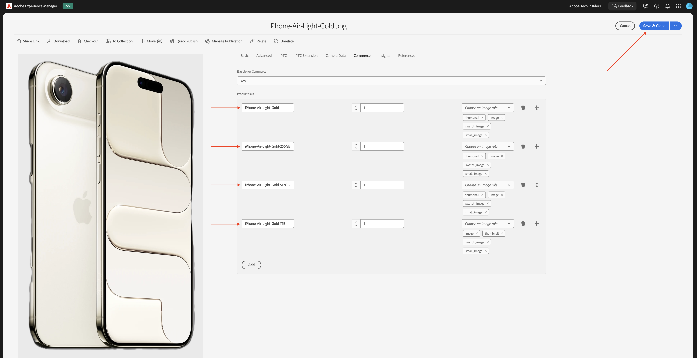

Pointez sur le produit **iPhone-Air-Space-Black.png** et cliquez sur l’icône **Propriétés**.


Faites défiler vers le bas et définissez le champ **Statut de la révision** sur **Approuvé**. L’intégration AEM Assets CS - ACCS ne fonctionne que pour les images approuvées.


Faites défiler l’écran vers le haut, accédez à l’onglet **** puis cliquez sur **Ajouter** sous **SKU de produit**.


Ajoutez les SKU suivants pour ce produit :

| Clé | Valeur | Utilisation |
|:-------------:| :---------------:| :---------------:|
| `iPhone-Air-Space-Black` | `1` | `thumbnail, image, swatch_image, small_image` |
| `iPhone-Air-Space-Black-256GB` | `1` | `thumbnail, image, swatch_image, small_image` |
| `iPhone-Air-Space-Black-512GB` | `1` | `thumbnail, image, swatch_image, small_image` |
| `iPhone-Air-Space-Black-1TB` | `1` | `thumbnail, image, swatch_image, small_image` |
| `iPhone-Air` | `1` | `thumbnail, image, swatch_image, small_image` |

Tu devrais avoir ça. Cliquez sur **Enregistrer et fermer**.


Pointez sur le produit **iPhone-Air-Sky-Blue.png** et cliquez sur l’icône **Propriétés**.


Faites défiler vers le bas et définissez le champ **Statut de la révision** sur **Approuvé**. L’intégration AEM Assets CS - ACCS ne fonctionne que pour les images approuvées.

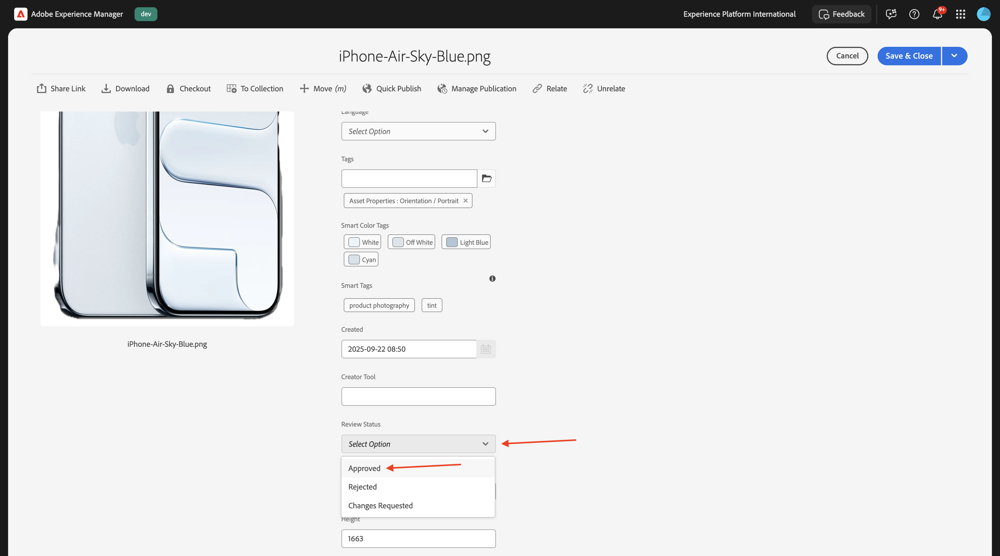

Faites défiler l’écran vers le haut, accédez à l’onglet **** puis cliquez sur **Ajouter** sous **SKU de produit**.


Ajoutez les SKU suivants pour ce produit :

| Clé | Valeur | Utilisation |
|:-------------:| :---------------:| :---------------:|
| `iPhone-Air-Sky-Blue` | `1` | `thumbnail, image, swatch_image, small_image` |
| `iPhone-Air-Sky-Blue-256GB` | `1` | `thumbnail, image, swatch_image, small_image` |
| `iPhone-Air-Sky-Blue-512GB` | `1` | `thumbnail, image, swatch_image, small_image` |
| `iPhone-Air-Sky-Blue-1TB` | `1` | `thumbnail, image, swatch_image, small_image` |

Tu devrais avoir ça. Cliquez sur **Enregistrer et fermer**.

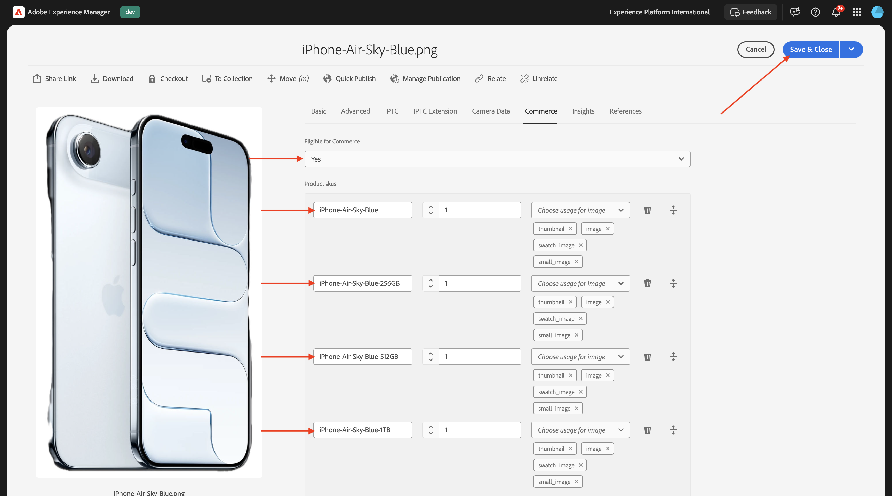

Pointez sur le produit **iPhone-Air-Cloud-White.png** et cliquez sur l’icône **Propriétés**.


Faites défiler vers le bas et définissez le champ **Statut de la révision** sur **Approuvé**. L’intégration AEM Assets CS - ACCS ne fonctionne que pour les images approuvées.


Faites défiler l’écran vers le haut, accédez à l’onglet **** puis cliquez sur **Ajouter** sous **SKU de produit**.

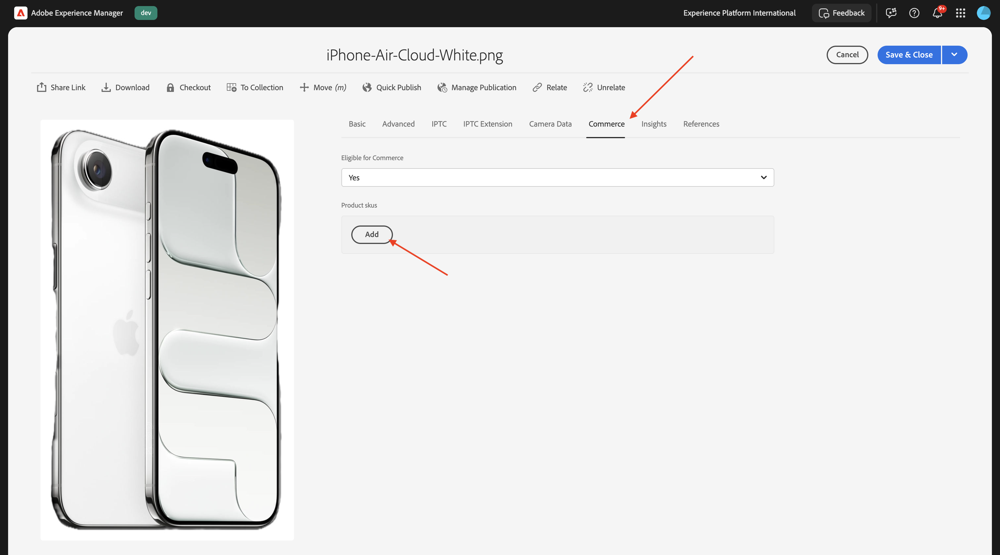

Ajoutez les SKU suivants pour ce produit :

| Clé | Valeur | Utilisation |
|:-------------:| :---------------:| :---------------:|
| `iPhone-Air-Cloud-White` | `1` | `thumbnail, image, swatch_image, small_image` |
| `iPhone-Air-Cloud-White-256GB` | `1` | `thumbnail, image, swatch_image, small_image` |
| `iPhone-Air-Cloud-White-512GB` | `1` | `thumbnail, image, swatch_image, small_image` |
| `iPhone-Air-Cloud-White-1TB` | `1` | `thumbnail, image, swatch_image, small_image` |

Tu devrais avoir ça. Cliquez sur **Enregistrer et fermer**.


Chaque image iPhone Air **** doit désormais avoir une **pouces verts vers le haut**, indiquant que la ressource a été approuvée.

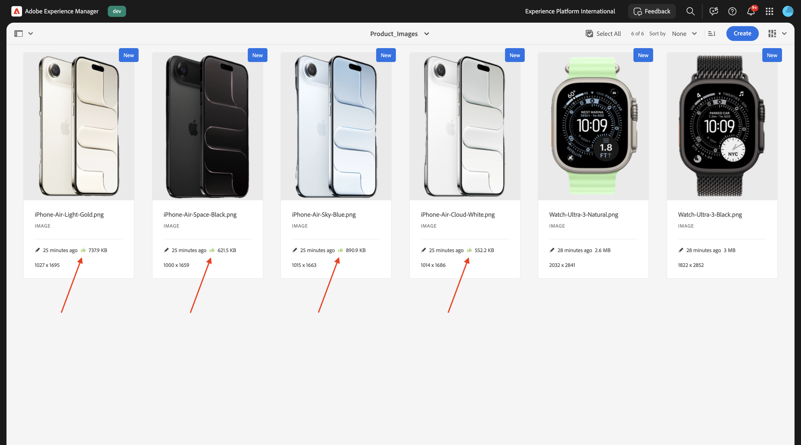

Vous devez maintenant répéter ces étapes pour les produits restants, en utilisant le tableau ci-dessous. N’oubliez pas d’approuver chaque image, puis de la configurer. sous les paramètres de SKU dans l’onglet ****.

| Nom du produit | Clé | Valeur | Utilisation |
|:-------------:|:-------------:| :---------------:| :---------------:|
| Apple Watch Ultra 3-Noir | `Apple-Watch-Ultra-3-Black` | `1` | `thumbnail, image, swatch_image, small_image` |
| Apple Watch Ultra 3-Naturel | `Apple-Watch-Ultra-3-Natural` | `1` | `thumbnail, image, swatch_image, small_image` |
| Fibre CitiSignal max | `CitiSignal-Fiber-Max` | `1` | `thumbnail, image, swatch_image, small_image` |
| Apple One | `Apple-One` | `1` | `thumbnail, image, swatch_image, small_image` |
| YouTube Premium | `YouTube-Premium` | `1` | `thumbnail, image, swatch_image, small_image` |
| Disney Plus | `Disney` | `1` | `thumbnail, image, swatch_image, small_image` |
| Netflix + HBO Max | `Netflix-HBO-Max` | `1` | `thumbnail, image, swatch_image, small_image` |

Toutes vos images doivent alors être approuvées.


## 1.5.3.5 Vérifier les images de produit sur le storefront AEM Sites CS/EDS

>[!NOTE]
>
>Le déploiement des modifications que vous avez apportées ci-dessus peut prendre jusqu’à 15 minutes. Si votre image ne s’affiche pas encore, patientez 15 minutes, puis réessayez.

Pour vérifier que l&#39;intégration fonctionne, vous devez ouvrir votre site Web CitiSignal.

Vous devriez alors voir ceci. Accédez à **Téléphones**.

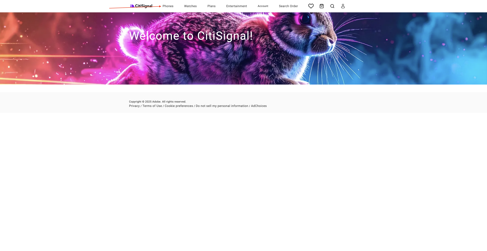

Vous devriez alors voir une image de produit affichée pour **iPhone Air**. Cliquez sur **iPhone Air**.


Vous devriez alors voir ceci. Modifiez les options de couleur et de stockage pour que les images changent de manière dynamique en fonction des choix que vous avez effectués.


Voici un exemple de modification de la couleur en **Or clair** et de la taille de stockage en **256GB**.


Revenir à [Adobe Commerce as a Cloud Service](./accs.md){target="_blank"}

[Revenir à tous les modules](./../../../overview.md){target="_blank"}
