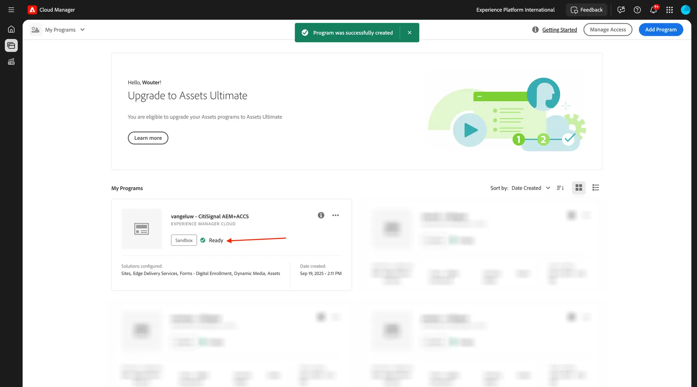

# 1.1.1 Création de votre programme Cloud Manager

Accédez à [https://my.cloudmanager.adobe.com](https://my.cloudmanager.adobe.com){target="_blank"}. L’organisation que vous devez sélectionner est `--aepImsOrgName--`. Vous verrez alors quelque chose comme ceci. Cliquez sur **Ajouter un programme**.

{zoomable="yes"}

Pour le **Nom du programme**, utilisez `--aepUserLdap-- - CitiSignal`. Cliquez sur **Continuer**.

{zoomable="yes"}

Assurez-vous que les options suivantes sont sélectionnées :

- Sites
- Ressources
- Edge Delivery Services

Cliquez sur **Créer**.

{zoomable="yes"}

La création de vos environnements prendra du temps, entre 10 et 20 minutes.

{zoomable="yes"}

Pendant que vous patientez, vous pouvez déjà commencer par l’exercice [1.1.2 Créer votre site web basé sur des documents](./ex2.md){target="_blank"}.

Une fois les environnements créés et prêts à l’emploi, vous recevrez un e-mail de confirmation avant de revenir ici.

{zoomable="yes"}

Une fois que vous avez reçu votre confirmation par e-mail, revenez sur [https://my.cloudmanager.adobe.com](https://my.cloudmanager.adobe.com){target="_blank"}. Vous verrez alors que le statut de votre programme est passé à **Prêt**. Cliquez sur votre programme pour l’ouvrir.

{zoomable="yes"}

Consultez l’onglet **Pipelines**. Cliquez sur le **de 3 points...**, puis sur **Exécuter**.

{zoomable="yes"}

Cliquez sur **Exécuter**.

{zoomable="yes"}

Cliquez ensuite sur le **de 3 points...** dans l’onglet **Environnements** et cliquez sur **Afficher les détails**.

{zoomable="yes"}

Vous verrez ensuite les détails de votre environnement, y compris l’URL de votre environnement **de création**, dont vous aurez besoin dans l’exercice suivant.

{zoomable="yes"}

Une fois l’exécution du pipeline terminée, vous pouvez passer à l’exercice suivant.

Étape suivante : [1.1.2 Créer votre site web basé sur des documents](./ex2.md){target="_blank"}

Revenir à [Adobe Experience Manager Cloud Service et Edge Delivery Services](./aemcs.md){target="_blank"}

[Revenir à tous les modules](./../../../overview.md){target="_blank"}
