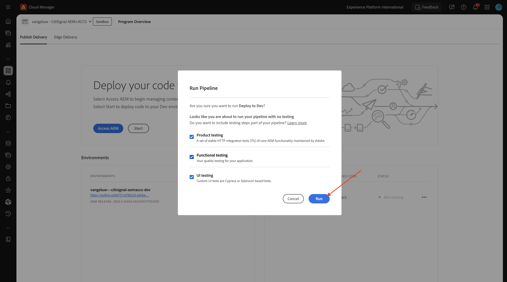

# 1.1.1 Création de votre programme Cloud Manager

Accédez à [https://my.cloudmanager.adobe.com](https://my.cloudmanager.adobe.com){target="_blank"}. L’organisation que vous devez sélectionner est `--aepImsOrgName--`. Vous verrez alors quelque chose comme ceci. Cliquez sur **Ajouter un programme**.

Pour le **Nom du programme**, utilisez `--aepUserLdap-- - CitiSignal AEM+ACCS`. Sélectionnez l’option **Configurer un sandbox**. Cliquez sur **Continuer**.

Assurez-vous que les options suivantes sont sélectionnées :

- Sites
- Formulaires
- Ressources

Cliquez sur la flèche de **Assets** pour afficher la liste des options.

Assurez-vous que les options suivantes sont sélectionnées :

- Content Hub

Faites défiler la liste vers le bas.

Assurez-vous que les options suivantes sont sélectionnées :

- Edge Delivery Services
- Dynamic Media

Cliquez sur **Créer**.

La création de votre environnement prendra du temps, entre 10 et 20 minutes.

Une fois les environnements créés et prêts à l’emploi, vous recevrez un e-mail de confirmation avant de revenir ici.

Une fois que vous avez reçu votre confirmation par e-mail, revenez sur [https://my.cloudmanager.adobe.com](https://my.cloudmanager.adobe.com){target="_blank"}. Vous verrez alors que le statut de votre programme est passé à **Prêt**. Cliquez sur votre programme pour l’ouvrir.

Consultez l’onglet **Pipelines**. Cliquez sur le **de 3 points...**, puis sur **Exécuter**.

Cliquez sur **Exécuter**.

Cliquez ensuite sur le **de 3 points...** dans l’onglet **Environnements** et cliquez sur **Afficher les détails**.

Vous verrez ensuite les détails de votre environnement, y compris l’URL de votre environnement **de création**, dont vous aurez besoin dans l’exercice suivant.

Jetez un coup d’œil à la ligne **Content Hub**, puis sélectionnez **Cliquer pour activer**.

Cliquez sur **Activer**.

L&#39;activation de **Content Hub** a maintenant commencé. Cela peut prendre 10 minutes ou plus.

Au bout d’environ 10 minutes, l’activation de **Content Hub** sera terminée.
Ensuite, jetez un coup d’œil à la ligne **Dynamic Media** et sélectionnez **Cliquer pour activer**.

Cliquez sur **Activer**.

L’activation de **Dynamic Media** a maintenant commencé. Cela peut prendre 10 minutes ou plus.

Au bout d’environ 10 minutes, l’activation de **Dynamic Media** est terminée.

Une fois l’exécution du pipeline terminée, vous pouvez passer à l’exercice suivant.

Étape suivante : [Configuration de votre environnement AEM CS](./ex3.md){target="_blank"}

Revenir à [Adobe Experience Manager Cloud Service et Edge Delivery Services](./aemcs.md){target="_blank"}

[Revenir à tous les modules](./../../../overview.md){target="_blank"}
