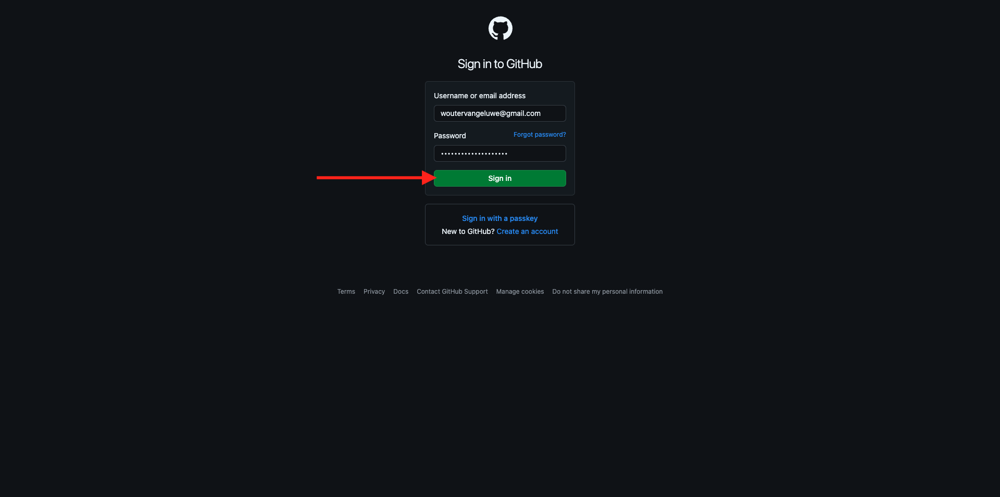
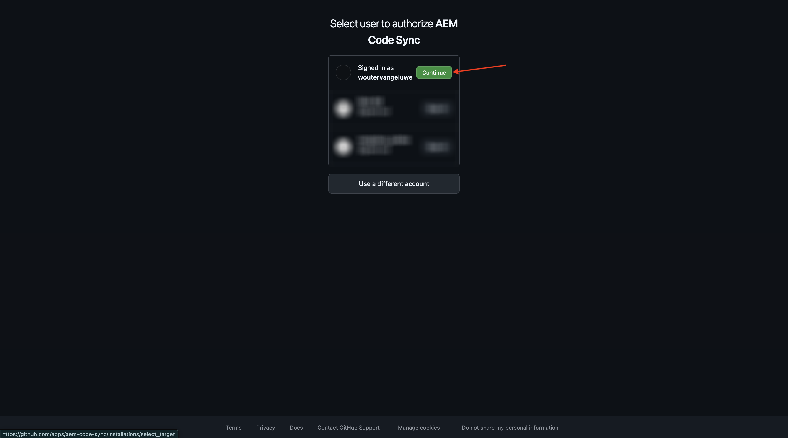
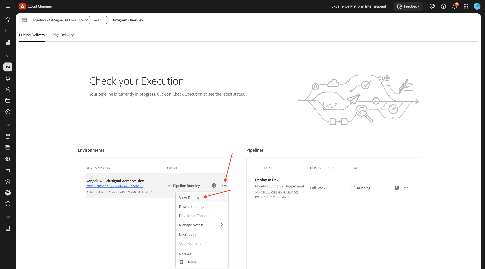
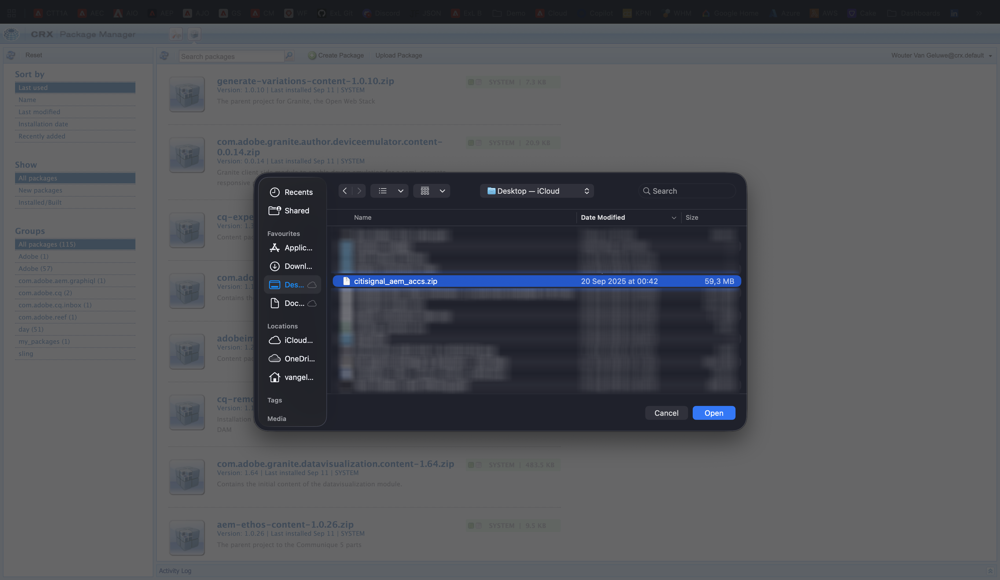

# 1.1.2 Configuration de votre environnement AEM CS

## 1.1.2.1 Configurer votre référentiel GitHub

Accédez à [https://github.com](https://github.com){target="_blank"}. Cliquez sur **Se connecter**.


Saisissez vos informations d’identification. Cliquez sur **Se connecter**.



Une fois connecté, votre tableau de bord GitHub s’affiche.


Accédez à [https://github.com/adobe-rnd/aem-boilerplate-xcom](https://github.com/adobe-rnd/aem-boilerplate-xcom){target="_blank"}. Tu verras ça. Cliquez sur **Utiliser ce modèle** puis sur **Créer un référentiel**.


Pour le **Nom du référentiel**, utilisez `citisignal-aem-accs`. Définissez la visibilité sur **Privé**. Cliquez sur **Créer un référentiel**.


Au bout de quelques secondes, votre référentiel sera alors créé.


Ensuite, accédez à [https://github.com/apps/aem-code-sync](https://github.com/apps/aem-code-sync){target="_blank"}. Cliquez sur **Installer** ou **Configurer**.


Cliquez sur le bouton **Continuer** en regard de votre compte utilisateur GitHub.



Cliquez sur **Configurer** en regard de votre compte utilisateur GitHub.


Cliquez sur **Sélectionner uniquement les référentiels** puis ajoutez le référentiel que vous venez de créer.


Faites défiler vers le bas et cliquez sur **Enregistrer**.


Vous obtiendrez alors cette confirmation.


## 1.1.2.2 Mettre à jour le fichier fstab.yaml

Dans votre référentiel GitHub, cliquez sur pour ouvrir le fichier `fstab.yaml`.


Cliquez sur l’icône **modifier**.


Vous devez maintenant mettre à jour la valeur du champ **url** à la ligne 3.


Vous devez remplacer la valeur actuelle par l’URL de votre environnement AEM Sites CS spécifique, en combinaison avec les paramètres de votre référentiel GitHub.

Il s’agit de la valeur actuelle de l’URL : `https://author-p130360-e1272151.adobeaemcloud.com/bin/franklin.delivery/adobe-rnd/aem-boilerplate-xcom/main`.

3 parties de l’URL doivent être mises à jour

`https://XXX/bin/franklin.delivery/YYY/ZZZ/main`

XXX doit être remplacé par l’URL de votre environnement de création AEM CS.

Vous devriez être remplacé par votre compte utilisateur GitHub.

ZZZ doit être remplacé par le nom du référentiel GitHub que vous avez utilisé dans l’exercice précédent.

Vous trouverez l’URL de votre environnement de création AEM CS à l’adresse [https://my.cloudmanager.adobe.com](https://my.cloudmanager.adobe.com){target="_blank"}. Cliquez sur votre **Programme** pour l’ouvrir.


Cliquez ensuite sur le **de 3 points...** dans l’onglet **Environnements** et cliquez sur **Afficher les détails**.



Vous verrez ensuite les détails de votre environnement, y compris l’URL de votre environnement **de création**. Copiez l’URL.


XXX = `author-p166717-e1786231.adobeaemcloud.com`

Pour le nom de compte d’utilisateur GitHub, vous pouvez facilement le trouver dans l’URL de votre navigateur. Dans cet exemple, le nom du compte utilisateur est `woutervangeluwe`.

AAAA = `woutervangeluwe`


Pour le nom du référentiel GitHub, vous pouvez également le trouver dans la fenêtre du navigateur que vous avez ouverte dans GitHub. Dans ce cas, le nom du référentiel est `citisignal`.

ZZZ = `citisignal-aem-accs`


La combinaison de ces 3 valeurs entraîne la création de cette nouvelle URL qui doit être configurée dans le `fstab.yaml` de fichiers.

`https://author-p166717-e1786231.adobeaemcloud.com/bin/franklin.delivery/woutervangeluwe/citisignal-aem-accs/main`

Vous devez également vérifier que ces lignes de code sont également ajoutées au fichier :

```
folders:
  /products/: /products/default
```

>[!IMPORTANT]
>
>Vous pouvez voir ces lignes de code aux lignes 6 et 7 dans l’image ci-dessous. Si ces lignes sont manquantes, ajoutez-les manuellement.

Cliquez sur **Valider les modifications...**.


Cliquez sur **Valider les modifications**.


Le fichier `fstab.yaml` a été mis à jour.

## 1.1.2.3 Charger des ressources et un site CitiSignal

Accédez à [https://my.cloudmanager.adobe.com](https://my.cloudmanager.adobe.com){target="_blank"}. Cliquez sur votre **Programme** pour l’ouvrir.


Cliquez ensuite sur l’URL de votre environnement de création.


Cliquez sur **Se connecter avec Adobe**.


Votre environnement de création s’affiche alors.


Votre URL ressemblera à ceci : `https://author-p166717-e1786231.adobeaemcloud.com/ui#/aem/aem/start.html?appId=aemshell`

Vous devez maintenant accéder à l’environnement **Gestionnaire de packages CRX** d’AEM. Pour ce faire, supprimez `ui#/aem/aem/start.html?appId=aemshell` de l’URL et remplacez-la par `crx/packmgr`, ce qui signifie que votre URL doit maintenant ressembler à ceci :
`https://author-p166717-e1786231.adobeaemcloud.com/crx/packmgr`.
Appuyez sur **Entrée** pour charger l’environnement du gestionnaire de packages.


Cliquez ensuite sur **Télécharger le package**.


Cliquez sur **Parcourir** pour localiser le package à charger.

Le package à charger est appelé **citisignal-assets.zip** et peut être téléchargé ici : [https://one-adobe-tech-insiders.s3.us-west-2.amazonaws.com/one-adobe/citisignal_aem_accs.zip](https://one-adobe-tech-insiders.s3.us-west-2.amazonaws.com/one-adobe/citisignal_aem_accs.zip){target="_blank"}.


Sélectionnez le `citisignal_aem_accs.zip` du package et cliquez sur **Ouvrir**.



Cliquez ensuite sur **OK**.


Le package sera ensuite chargé. Cliquez ensuite sur **Installer** sur le package que vous venez de télécharger.


Cliquez sur **Installer**.


Au bout de quelques minutes, votre package sera alors installé.


Vous pouvez maintenant fermer cette fenêtre.

## 1.1.2.4 Publication de ressources CitiSignal

Accédez à [https://my.cloudmanager.adobe.com](https://my.cloudmanager.adobe.com){target="_blank"}. Cliquez sur votre **Programme** pour l’ouvrir.


Cliquez ensuite sur l’URL de votre environnement de création.


Cliquez sur **Se connecter avec Adobe**.


Votre environnement de création s’affiche alors. Cliquez sur **Assets**.


Cliquez sur **Fichiers**.


Cliquez pour sélectionner le dossier **CitiSignal**, puis cliquez sur **Gérer la publication**.


Cliquez sur **Suivant**.


Cliquez sur **Publier**.


Vos ressources ont maintenant été publiées.

## 1.1.2.5 Publier le site web de CitiSignal

Cliquez sur le nom du produit **Adobe Experience Manager** dans le coin supérieur gauche de votre écran, puis cliquez sur la **flèche** en regard de **Assets**.


Cliquez ensuite sur **Sites**.


Vous devriez alors voir votre site Web **CitiSignal** qui a été créé après avoir installé le package auparavant.


Pour lier votre site au référentiel GitHub que vous avez créé précédemment, vous devez créer une configuration **Edge Delivery Services**.

La première étape pour ce faire consiste à créer une **configuration cloud**.

Pour ce faire, cliquez sur le nom du produit **Adobe Experience Manager** dans le coin supérieur gauche de l&#39;écran, puis cliquez sur l&#39;icône **Outils** et sélectionnez **Général**. Cliquez pour ouvrir **Explorateur de configurations**.


Vous devriez alors voir ceci. Cliquez sur **Créer**.


Définissez les champs **Titre** et **Nom** sur `CitiSignal`. Cochez la case **Configurations cloud**.

Cliquez sur **Créer**.


Tu devrais avoir ça.


Ensuite, vous devez mettre à jour certains champs de la **configuration cloud** que vous venez de créer.

Pour ce faire, cliquez sur le nom du produit **Adobe Experience Manager** dans le coin supérieur gauche de l’écran, puis cliquez sur l’icône **outils** et sélectionnez **Services cloud**. Cliquez pour ouvrir la configuration **Edge Delivery Services**.


Sélectionnez **CitiSignal**, cliquez sur **Créer** et sélectionnez **Configuration**.


Vous devez maintenant remplir les champs **Organisation** et **Nom du site**. Pour ce faire, consultez d’abord l’URL de votre référentiel GitHub.


- **Organisation** : utilisez le nom de votre nom d’organisation GitHub, dans cet exemple, il est `woutervangeluwe`
- **Nom du site** : utilisez le nom du référentiel GitHub, qui doit être `citisignal-aem-accs`.

Cliquez sur **Enregistrer et fermer**.


Tu devrais avoir ça. Cochez la case en regard de la configuration cloud Edge que vous venez de créer, puis cliquez sur **Publier**.


## 1.1.2.6 Mettre à jour le fichier paths.json

Dans votre référentiel GitHub, cliquez sur pour ouvrir le fichier `paths.json`.


Cliquez sur l’icône **modifier**.


Vous devez maintenant mettre à jour le texte `aem-boilerplate-commerce` par `CitiSignal` aux lignes 3, 4, 5, 6, 7 et 10.

Cliquez sur **Valider les modifications**.


Cliquez sur **Valider les modifications**.


Le fichier `paths.json` a été mis à jour.

## 1.1.2.7 Publier le site web de CitiSignal

Cliquez sur le nom du produit **Adobe Experience Manager** dans le coin supérieur gauche de l’écran, puis sélectionnez **Sites**.


Ensuite, cliquez sur la case à cocher devant **CitiSignal**. Cliquez ensuite sur **Gérer la publication**.


Cliquez sur **Suivant**.


Cliquez sur **Inclure les paramètres enfants**.


Cochez la case **Inclure les enfants**, puis cliquez pour désélectionner les autres cases. Cliquez sur **OK**.


Cliquez sur **Publier**.


On vous renverra ensuite ici. Cliquez sur **CitiSignal**, cochez la case en regard de **index**, puis cliquez sur **Modifier**.


Votre site web s’ouvre alors dans l’**éditeur universel**.


Vous pourrez désormais accéder à votre site web en accédant à `main--citisignal-aem-accs--XXX.aem.page` et/ou `main--citisignal-aem-accs--XXX.aem.live`, après avoir remplacé XXX par votre compte utilisateur GitHub, qui est `woutervangeluwe` dans cet exemple.

Dans cet exemple, l’URL complète devient :
`https://main--citisignal-aem-accs--woutervangeluwe.aem.page` et/ou `https://main--citisignal-aem-accs--woutervangeluwe.aem.live`

Cela peut prendre un certain temps avant que toutes les ressources ne s’affichent correctement, car elles doivent d’abord être publiées.

Vous verrez alors ceci :


## Performances de la page de test 1.1.2.8

Accédez à [https://pagespeed.web.dev/](https://pagespeed.web.dev/){target="_blank"}. Saisissez votre URL et cliquez sur **Analyser**.


Votre site web obtient un score élevé dans les visualisations pour appareils mobiles et pour ordinateurs de bureau :

**Mobile** :


**Ordinateur de bureau** :


Étape suivante : [développer un bloc personnalisé](./ex3.md){target="_blank"}

Revenir à [Adobe Experience Manager Cloud Service et Edge Delivery Services](./aemcs.md){target="_blank"}

[Revenir à tous les modules](./../../../overview.md){target="_blank"}
