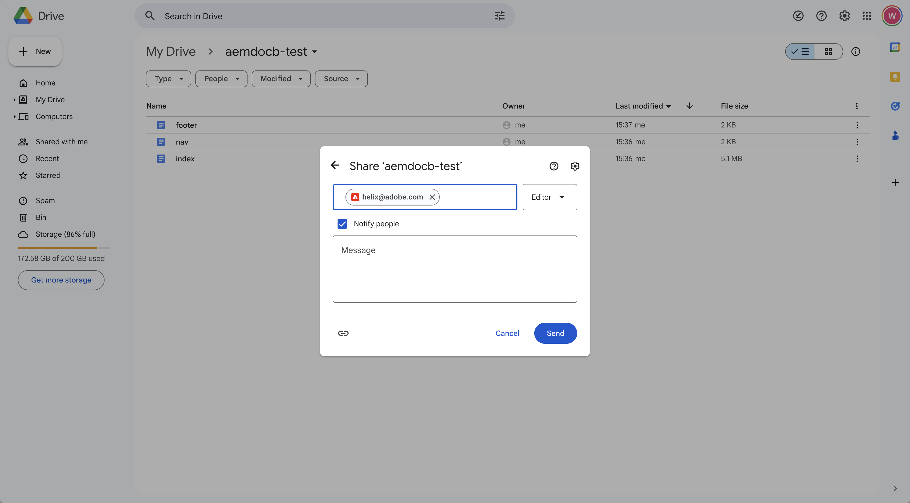
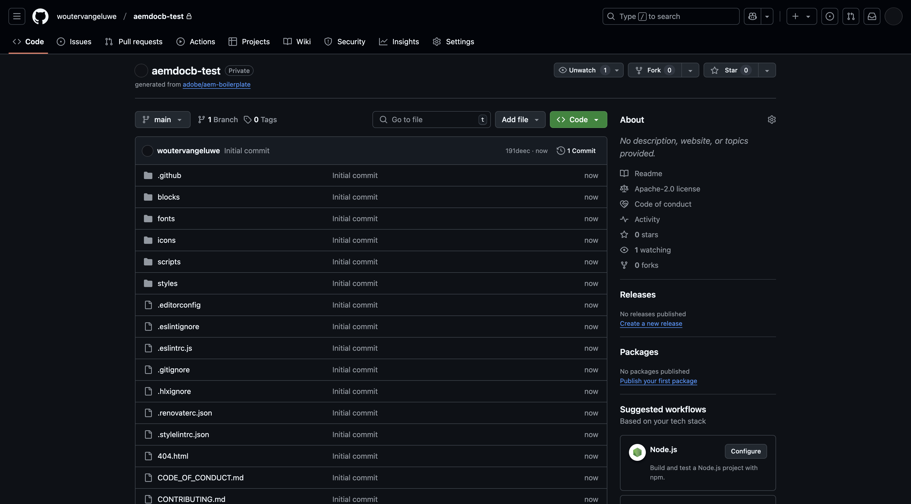
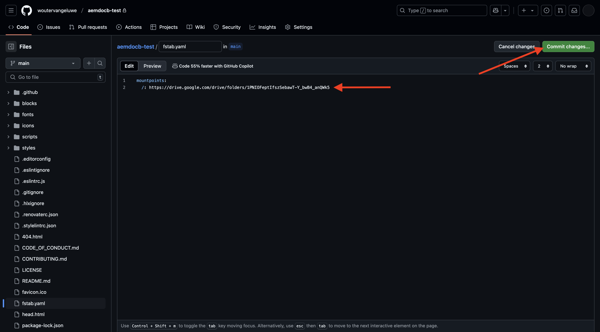
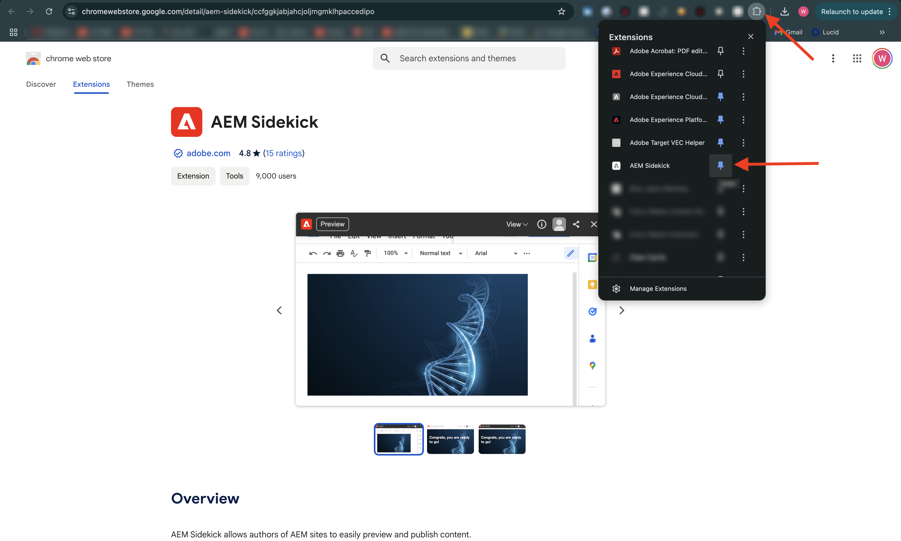

# 1.1.2 Création de votre site web basé sur des documents

En attendant la création de votre programme Cloud Manager, vous disposez de suffisamment de temps pour configurer votre premier site web de création documentaire. L’exercice ci-dessous est basé sur le tutoriel du développeur [aem.live](https://www.aem.live/developer/tutorial){target="_blank"}. Suivez les étapes ci-dessous pour commencer.

## 1.1.2.1 Configurer votre lecteur Google

Accédez à [https://drive.google.com](https://drive.google.com){target="_blank"}. Cliquez sur **+ Nouveau** puis sur **Nouveau dossier**.

{zoomable="yes"}

Nommez votre dossier `aemdocb-test`. Cliquez sur **Créer**.

{zoomable="yes"}

Téléchargez le fichier [aemboilerplate.zip](./../../../assets/aem/aemboilerplate.zip){target="_blank"} et extrayez-le sur votre ordinateur.

{zoomable="yes"}

Vous verrez 3 fichiers dans ce dossier. Copiez ces fichiers dans votre nouveau dossier Google Drive.

{zoomable="yes"}

Vous devez maintenant convertir ces fichiers en fichier Google natif. Pour ce faire, ouvrez chaque fichier, puis accédez à **Fichier** > **Enregistrer sous Google Docs**.

{zoomable="yes"}

Vous devez effectuer cette opération pour les 3 fichiers, puis vous verrez 6 fichiers dans votre dossier Google Drive.

{zoomable="yes"}

Vous l’avez ensuite dans votre dossier .

{zoomable="yes"}

Pour que la démonstration de création documentaire fonctionne, vous devez maintenant partager votre dossier Google Drive avec l’adresse e-mail **helix@adobe.com**. Cliquez sur le nom de votre dossier, puis sur **Partager** et de nouveau sur **Partager**.

{zoomable="yes"}

Saisissez l’adresse électronique **helix@adobe.com** puis cliquez sur **Envoyer**.

{zoomable="yes"}

Ensuite, copiez et notez l’URL de votre dossier Google Drive, car vous en aurez besoin dans l’exercice suivant. Cliquez sur le nom de votre dossier, sur **Partager**, puis sur **Copier le lien**.

{zoomable="yes"}

`https://drive.google.com/drive/folders/1PNIOFeptIfszSebawT-Y_bwB4_anQWk5?usp=drive_link`

Vous devez supprimer le paramètre de chaîne de requête `?usp=drive_link` pour que l’URL ressemble à ceci :

`https://drive.google.com/drive/folders/1PNIOFeptIfszSebawT-Y_bwB4_anQWk5`

## 1.1.2.2 Configurer votre référentiel GitHub

Accédez à [https://github.com](https://github.com){target="_blank"}. Cliquez sur **Se connecter**.

{zoomable="yes"}

Saisissez vos informations d’identification. Cliquez sur **Se connecter**.

{zoomable="yes"}

Une fois connecté, votre tableau de bord GitHub s’affiche.

{zoomable="yes"}

Accédez à [https://github.com/adobe/aem-boilerplate](https://github.com/adobe/aem-boilerplate){target="_blank"}. Tu verras ça. Cliquez sur **Utiliser ce modèle** puis sur **Créer un référentiel**.

{zoomable="yes"}

Pour le **Nom du référentiel**, utilisez `aemdocb-test`. Définissez la visibilité sur **Privé**. Cliquez sur **Créer un référentiel**.

{zoomable="yes"}

Au bout de quelques secondes, votre référentiel sera alors créé.

{zoomable="yes"}

Ensuite, accédez à [https://github.com/apps/aem-code-sync](https://github.com/apps/aem-code-sync){target="_blank"}. Cliquez sur **Configurer**.

{zoomable="yes"}

Cliquez sur votre compte GitHub.

{zoomable="yes"}

Cliquez sur **Sélectionner uniquement les référentiels** puis ajoutez le référentiel que vous venez de créer. Cliquez ensuite sur **Installer**.

{zoomable="yes"}

Vous obtiendrez alors cette confirmation.

{zoomable="yes"}

## 1.1.2.3 Mettre à jour le fichier fstab.yaml

Dans votre référentiel GitHub, cliquez sur pour ouvrir le fichier `fstab.yaml`.

{zoomable="yes"}

Cliquez sur l’icône **modifier**.

{zoomable="yes"}

Vous devez maintenant mettre à jour la valeur du champ **url** à la ligne 2.

{zoomable="yes"}

Vous devez remplacer la valeur actuelle par l’URL de votre environnement AEM CS spécifique, en combinaison avec les paramètres de votre référentiel GitHub.

Il s’agit de la valeur actuelle de l’URL : `https://drive.google.com/drive/u/0/folders/1MGzOt7ubUh3gu7zhZIPb7R7dyRzG371j`.

Remplacez cette valeur par l’URL que vous avez copiée à partir de votre dossier Google Drive, `https://drive.google.com/drive/folders/1PNIOFeptIfszSebawT-Y_bwB4_anQWk5`. Cliquez sur **Valider les modifications...**.

{zoomable="yes"}

Cliquez sur **Valider les modifications**.

{zoomable="yes"}

## 1.1.2.4 Installer l’extension AEM Sidekick

Accédez à [https://chromewebstore.google.com/detail/aem-sidekick/ccfggkjabjahcjoljmgmklhpaccedipo](https://chromewebstore.google.com/detail/aem-sidekick/ccfggkjabjahcjoljmgmklhpaccedipo){target="_blank"}. Cliquez sur **Ajouter à Chrome**.

{zoomable="yes"}

Épinglez l’extension **AEM Sidekick**.

{zoomable="yes"}

## 1.1.2.5 et publier votre site web basé sur des documents

Revenez à votre dossier Google Drive. Dans la barre des tâches, cliquez sur l’extension **AEM Sidekick**. Une fenêtre contextuelle de la barre AEM Sidekick apparaît alors dans votre dossier.

{zoomable="yes"}

Sélectionnez les 3 fichiers dans votre dossier Google Drive. Cliquez sur **Aperçu**.

{zoomable="yes"}

Cliquez de nouveau sur **Aperçu**.

{zoomable="yes"}

Cliquez pour fermer la boîte de dialogue contextuelle verte.

{zoomable="yes"}

Sélectionnez à nouveau les 3 fichiers dans votre dossier Google Drive. Cliquez maintenant sur **Publier**.

{zoomable="yes"}

Cliquez sur **Publier**.

{zoomable="yes"}

Cliquez pour fermer à nouveau la boîte de dialogue verte. Sélectionnez à présent le fichier **index**, cliquez sur **Copier les URL** puis sur **Copier les URL dynamiques**.

{zoomable="yes"}

L’URL qui a été copiée ressemblera à ceci : `https://main--aemdocb-test--woutervangeluwe.aem.live/`.

Dans l’URL ci-dessus :

- **main** fait référence à la branche de votre référentiel GitHub
- **aemdocb-test** fait référence au nom du référentiel GitHub
- **woutervangeluwe** fait référence au nom du compte utilisateur GitHub
- **.live** fait référence à l’environnement en ligne de votre instance AEM
- Vous pouvez remplacer **.live** par **.page** pour ouvrir l’environnement de prévisualisation de votre instance AEM

Ouvrez une nouvelle fenêtre de navigateur et accédez à l’URL.

{zoomable="yes"}

## 1.1.2.6 Apporter une modification et publier votre modification

Revenez sur votre lecteur Google et ouvrez le filtre **index** dans Google.

{zoomable="yes"}

Remplacez le texte **Test** par tout autre texte de votre choix. Cliquez sur **Aperçu**.

{zoomable="yes"}

La version d’aperçu de votre site web s’ouvre alors. Vérifiez votre modification et cliquez sur **Publier**.

{zoomable="yes"}

Vous verrez alors la version en direct de votre site web.

{zoomable="yes"}

L’exercice ci-dessus était un bon moyen de commencer et de découvrir vous-même la création basée sur des documents. Vous pouvez maintenant passer à l’exercice suivant, au cours duquel vous allez configurer votre propre site web de démonstration à l’aide de CitiSignal en tant que marque de démonstration.

Étape suivante : [1.1.3 Configurer votre environnement AEM CS](./ex3.md){target="_blank"}

Revenir à [Adobe Experience Manager Cloud Service et Edge Delivery Services](./aemcs.md){target="_blank"}

[Revenir à tous les modules](./../../../overview.md){target="_blank"}
