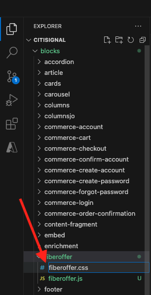

# 1.1.4 Bloc personnalisé avancé

Dans l’exercice précédent, vous avez configuré un bloc personnalisé de base appelé **Offre Fibre optique** qui présente sur votre site web des champs tels que **Texte de l’offre**, **CTA de l’offre** et **Image de l’offre**.

Vous pouvez maintenant continuer à travailler sur ce bloc.

{zoomable="yes"}

## 1.1.4.1 Donner un style à votre bloc

Maintenant que vous disposez d’un bloc **fiberoffer** fonctionnel, vous pouvez lui appliquer un style.

Revenez à Visual Studio Code et ouvrez le dossier **blocs**. Vous devriez maintenant voir plusieurs dossiers qui font référence à un bloc spécifique. Pour rendre votre bloc **fiberoffer** plus avancé, vous devez maintenant créer un dossier pour votre bloc personnalisé.

{zoomable="yes"}

Sélectionnez le dossier **blocs**, puis cliquez sur l’icône **Créer un dossier**.

{zoomable="yes"}

Nommez votre `fiberoffer` de dossier et appuyez sur **entrée**.

{zoomable="yes"}

Sélectionnez le nouveau dossier **fiberoffer** et cliquez sur l’icône **Créer un fichier**.

{zoomable="yes"}

Un nouveau fichier est maintenant créé. Saisissez le nom **fiberoffer.js** et appuyez sur Entrée.

{zoomable="yes"}

Vous pouvez désormais implémenter la décoration de bloc en ajoutant le code JavaScript suivant dans le fichier **fiberoffer.js**.

Enregistrez le fichier.

```js
export default function decorate(block) {
  const offerText = block.children[0];
  const offerCTA = block.children[1];
  const offerImage = block.children[2];

  offerText.id = 'offerText';
  offerText.className = 'offerText';
  offerCTA.id = 'offerCTA';
  offerCTA.className = 'offerCTA';
  offerImage.id = 'offerImage';
  offerImage.className = 'offerImage';
}
```

{zoomable="yes"}

Sélectionnez le nouveau dossier **fiberoffer** et cliquez de nouveau sur l’icône **Créer un fichier**.

{zoomable="yes"}

Un nouveau fichier est maintenant créé. Saisissez le nom **fiberoffer.css** et appuyez sur Entrée.

{zoomable="yes"}

Copiez et collez le code CSS suivant dans le fichier nouvellement créé.

```js
.offerText, .offerCTA, .offerImage{
    color: #14161A;
    font-size: 30px;
    padding: 0 0 24px;
    display: flex;
    flex-direction: column;
    margin: 1rem 0;
    text-align: center;
}
```

Enregistrez vos modifications.

{zoomable="yes"}

Vous avez apporté plusieurs modifications à votre projet qui doivent être validées dans votre référentiel GitHub. Pour ce faire, ouvrez **GitHub Desktop**.

Vous devriez alors voir les 2 fichiers que vous venez de modifier sous **Modifications**. Vérifiez vos modifications.

Saisissez un nom pour votre requête de tirage, `js css`. Cliquez sur **Valider dans la ressource principale**.

{zoomable="yes"}

Vous devriez alors voir ceci. Cliquez sur **Push origin**.

{zoomable="yes"}

Dans votre navigateur, accédez à votre compte GitHub et au référentiel que vous avez créé pour CitiSignal. Vous devriez ensuite voir un élément similaire, montrant que vos modifications ont été reçues.

{zoomable="yes"}

Vous pourrez désormais afficher les modifications apportées à votre site web en accédant à `main--citisignal-aem-accs--XXX.aem.page` et/ou `main--citisignal-aem-accs--XXX.aem.live`, après avoir remplacé XXX par votre compte utilisateur GitHub, ce qui est `woutervangeluwe` dans cet exemple.

Dans cet exemple, l’URL complète devient :
`https://main--citisignal-aem-accs--woutervangeluwe.aem.page` et/ou `https://main--citisignal-aem-accs--woutervangeluwe.aem.live`

Vous devriez alors voir ceci, avec la mise en forme appliquée à votre page.

{zoomable="yes"}

## 1.1.4.2 Ajouter une logique et charger des données à partir d’un point d’entrée externe

Pour cet exercice, vous allez effectuer une configuration « brute » d’Adobe Web SDK et vous allez demander la meilleure offre à Adobe Journey Optimizer Offer Decisioning.

Pour être clair : il ne s’agit pas d’une implémentation recommandée de Web SDK pour AEM as a Cloud Service. Dans l’exercice suivant, vous allez mettre en œuvre la collecte de données à l’aide d’un plug-in spécifique développé à cet effet.

Cet exercice a pour but de vous montrer quelques éléments de base dans JavaScript, tels que le chargement d’une bibliothèque JS externe, l’utilisation de la bibliothèque **alloy.js**, l’envoi d’une requête, etc.

La bibliothèque **alloy.js** est la bibliothèque de Web SDK qui permet d’envoyer des requêtes d’un site web à Adobe Edge Network, et de là, à des applications comme Adobe Experience Platform, Adobe Analytics, Adobe Target, etc.

Ajoutez ce code sous le code précédent que vous avez ajouté pour le style de votre bloc :

```javascript
var script1 = document.createElement('script');
  script1.text = "!function(n,o){o.forEach(function(o){n[o]||((n.__alloyNS=n.__alloyNS||[]).push(o),n[o]=function(){var u=arguments;return new Promise(function(i,l){n[o].q.push([i,l,u])})},n[o].q=[])})}(window,['alloy']);"
  document.head.appendChild(script1);

  var script2 = document.createElement('script');
  script2.async = true;
  script2.src = "https://cdn1.adoberesources.net/alloy/2.14.0/alloy.min.js";
  document.head.appendChild(script2);

  alloy("configure", {
    "edgeConfigId": "045c5ee9-468f-47d5-ae9b-a29788f5948f",
    "orgId": "907075E95BF479EC0A495C73@AdobeOrg",
    "defaultConsent": "in"
  });
```

Tu devrais avoir ça.

La première balise script (script1) que vous avez ajoutée est une fonction utilisée par Web SDK qui crée un objet window appelé **alloy**.

La deuxième balise de script (script2) charge la bibliothèque alloy.js de manière asynchrone à partir du réseau CDN d’Adobe.

Le troisième bloc de code configure essentiellement l’objet alloy pour envoyer des données à une organisation Adobe IMS et à un flux de données spécifiques.

Dans le module **Prise en main**, vous avez déjà configuré un flux de données appelé `--aepUserLdap-- - One Adobe Datastream`. Le champ **edgeConfigId** dans le code ci-dessus fait référence à l’identifiant du flux de données configuré.

Vous n’avez pas besoin de modifier le champ **edgeConfigId** pour le moment. Dans l’exercice suivant, vous serez en mesure de le faire à l’aide du plug-in **MarTech**.

{zoomable="yes"}

Vous devriez maintenant avoir ceci.

{zoomable="yes"}

Ajoutez ensuite ce bloc sous le code précédent que vous avez ajouté dans.

```javascript
var ECID = "";

  alloy("getIdentity")
    .then(function (result) {
      // The command succeeded.
      console.log("ECID:", result.identity.ECID);
      ECID = result.identity.ECID;
      getOffer(ECID);

    })
    .catch(function (error) {
      // The command failed.
      // "error" will be an error object with additional information.
    });
```

Ce bloc de code est utilisé pour récupérer la valeur de l’Experience Cloud ID (ECID). L’ECID est l’identifiant d’appareil unique de votre navigateur.

Comme vous pouvez le voir dans le code ci-dessus, une fois l’ECID récupéré, une autre fonction est appelée. Cette fonction est appelée **getOffer()** et vous l’ajouterez ensuite.

{zoomable="yes"}

Ajoutez ensuite le code ci-dessous sous le

```javascript
async function getOffer(ECID) {
  var url = "https://edge.adobedc.net/ee/irl1/v1/interact?configId=045c5ee9-468f-47d5-ae9b-a29788f5948f";

  var timestamp = new Date().toISOString();

  var offerRequest = {
    "events": [
      {
        "xdm": {
          "eventType": "decisioning.propositionDisplay",
          "timestamp": timestamp,
          "_experienceplatform": {
            "identification": {
              "core": {
                "ecid": ECID
              }
            }
          },
          "identityMap": {
            "ECID": [
              {
                "id": ECID
              }
            ]
          }
        },
        "query": {
          "personalization": {
            "schemas": [
              "https://ns.adobe.com/personalization/default-content-item",
              "https://ns.adobe.com/personalization/html-content-item",
              "https://ns.adobe.com/personalization/json-content-item",
              "https://ns.adobe.com/personalization/redirect-item",
              "https://ns.adobe.com/personalization/ruleset-item",
              "https://ns.adobe.com/personalization/message/in-app",
              "https://ns.adobe.com/personalization/message/content-card",
              "https://ns.adobe.com/personalization/dom-action"
            ],
            "decisionScopes": [
              "eyJ4ZG06YWN0aXZpdHlJZCI6ImRwczpvZmZlci1hY3Rpdml0eToxYTI3ODk3NzAzYTY5NWZmIiwieGRtOnBsYWNlbWVudElkIjoiZHBzOm9mZmVyLXBsYWNlbWVudDoxYTI0ZGM2MWJmYjJlMjIwIn0=",
              "eyJ4ZG06YWN0aXZpdHlJZCI6ImRwczpvZmZlci1hY3Rpdml0eToxYTI3ODk3NzAzYTY5NWZmIiwieGRtOnBsYWNlbWVudElkIjoiZHBzOm9mZmVyLXBsYWNlbWVudDoxYTI0ZGM0MzQyZjJlMjFlIn0="
            ]
          }
        }
      }
    ]
  }

  try {
    const response = await fetch(url, {
      method: "POST",
      headers: {
        "Content-Type": "application/json"
      },
      body: JSON.stringify(offerRequest),
    });

    if (response.status === 200) {
      var body = await response.json();
      console.log("Offer Decisioning Response: ", body);

      const decisions = body["handle"];

      decisions.forEach(decision => {
        if (decision["type"] == "personalization:decisions") {
          console.log("Offer Decisioning decision detail: ", decision);
          const payloads = decision["payload"];

          if (payloads === undefined || payloads.length == 0) {
            //do nothing
          } else {
            payloads.forEach(payload => {
              if (payload["placement"]["name"] == "Web - Image") {
                console.log("Web-Image payload");
                const items = payload["items"];
                items.forEach(item => {
                  if (item["id"].includes("dps:fallback-offer")) {
                    console.log("Item details: ", item);
                    const deliveryURL = item["data"]["deliveryURL"];

                    document.querySelector("#offerImage").innerHTML = "";
                  } else if (item["id"].includes("dps:personalized-offer")) {
                    console.log("Item details: ", item);
                    const deliveryURL = item["data"]["deliveryURL"];
                    console.log("Web-Image Personalized Offer Content: ", deliveryURL)

                    document.querySelector("#offerImage").innerHTML = "";
                  }
                });
              } else if (payload["placement"]["name"] == "Web - JSON") {
                console.log("Web-JSON payload");
                const items = payload["items"];
                items.forEach(item => {
                  if (item["id"].includes("dps:fallback-offer")) {
                    const content = JSON.parse(item["data"]["content"]);

                    console.log("Web-JSON Fallback Content: ", content)

                    document.querySelector("#offerText").innerHTML = content.text;
                    document.querySelector("#offerCTA").innerHTML = content.cta;
                  } else if (item["id"].includes("dps:personalized-offer")) {
                    const content = JSON.parse(item["data"]["content"]);

                    console.log("Web-JSON Personalized Offer Content: " + content);

                    document.querySelector("#offerText").innerHTML = content.text;
                    document.querySelector("#offerCTA").innerHTML = content.cta;
                  }
                });
              }
            });
          }
          document.querySelector("#offerImage").style.display = "block";
          document.querySelector("#offerText").style.display = "block";
          document.querySelector("#offerCTA").style.display = "block";
        }
      });
    } else {
      console.warn("Offer Decisioning Response unsuccessful:", response.body);
    }
  } catch (error) {
    console.error("Error when getting Offer Decisioning Response:", error);
  }
}
```

Il est très important que ce bloc de code soit collé sous le crochet de fermeture que vous pouvez voir à la ligne 42 dans cet exemple. Le code que vous venez de coller est une fonction distincte qui a besoin de son propre emplacement dans ce fichier et ne peut pas être imbriquée dans la fonction **par défaut** ci-dessus.

{zoomable="yes"}

Le bloc de code que vous venez de coller simule une requête qui serait normalement effectuée par Web SDK/alloy.js. Dans cet exemple, une requête **fetch** sera envoyée à **edge.adobedc.net**.

Dans la requête, 2 **portées de décision** sont spécifiées, ce qui demandera à Adobe Journey Optimizer Offer Decisioning de fournir une décision sur l’offre qui doit être vue par cet ECID.

Une fois la réponse reçue, ce code analyse la réponse et filtre des éléments tels que l’URL de l’image à afficher et la réponse JSON contenant des éléments tels que le texte de l’offre et le CTA de l’offre, après quoi il les affiche sur le site web.

Rappelez-vous : cette approche est utilisée uniquement à des fins d’activation et n’est pas la meilleure pratique pour implémenter la collecte de données.

Enregistrez vos modifications. Ensuite, ouvrez **Github Desktop**, attribuez un nom à votre requête de tirage et cliquez sur **Valider dans la requête principale**.

{zoomable="yes"}

Cliquez ensuite sur **Origine push**.

{zoomable="yes"}

Vous pourrez désormais afficher les modifications apportées à votre site web en accédant à `main--citisignal-aem-accs--XXX.aem.page` et/ou `main--citisignal-aem-accs--XXX.aem.live`, après avoir remplacé XXX par votre compte utilisateur GitHub, ce qui est `woutervangeluwe` dans cet exemple.

Dans cet exemple, l’URL complète devient :
`https://main--citisignal-aem-accs--woutervangeluwe.aem.page` et/ou `https://main--citisignal-aem-accs--woutervangeluwe.aem.live`

Vous devriez alors voir ceci.

{zoomable="yes"}

Étape suivante : [Plug-in AEM Edge Delivery Services MarTech](./ex5.md){target="_blank"}

Revenir à [Adobe Experience Manager Cloud Service et Edge Delivery Services](./aemcs.md){target="_blank"}

[Revenir à tous les modules](./../../../overview.md){target="_blank"}
