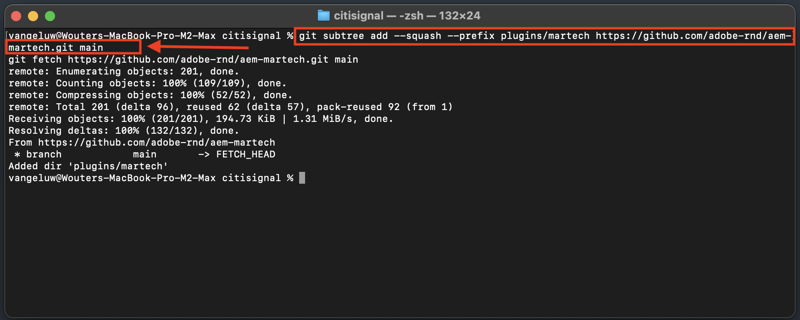
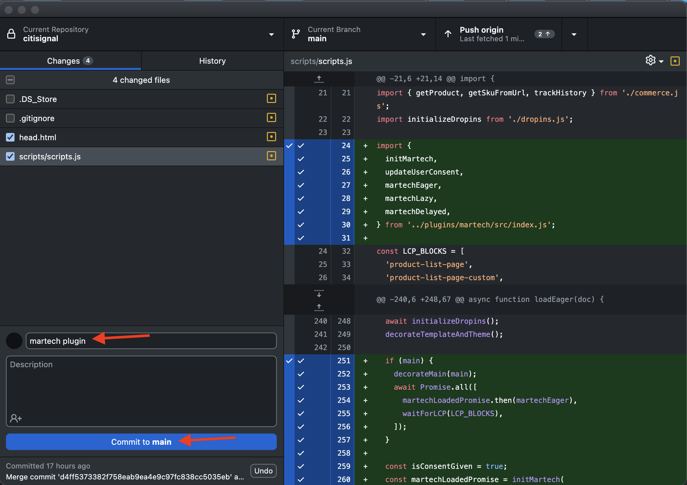
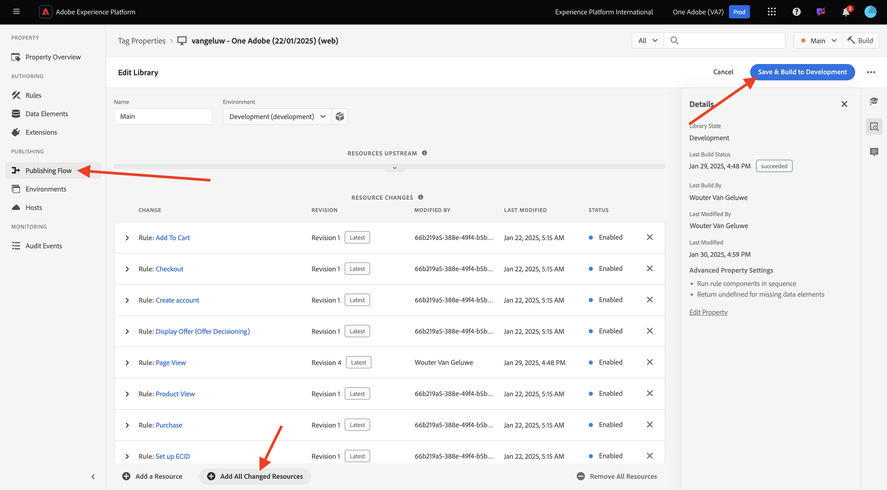
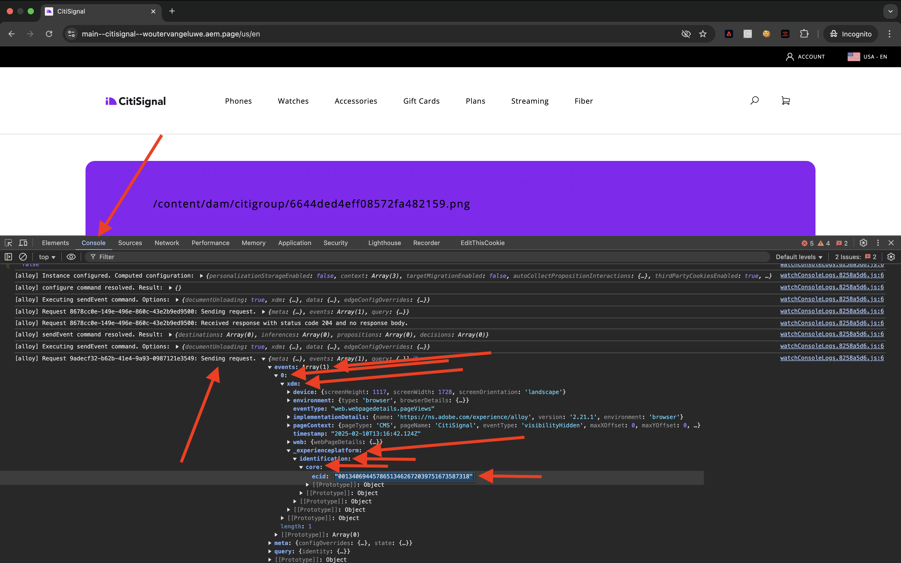

# 1.1.6 Plug-in AEM Edge Delivery Services MarTech

Le plug-in AEM MarTech permet de configurer rapidement une pile MarTech complète pour votre projet AEM.

>[!NOTE]
>
>Ce plug-in est actuellement disponible pour les clients en collaboration avec l’ingénierie AEM dans le cadre de projets de co-innovation. Vous trouverez plus d’informations sur [https://github.com/adobe-rnd/aem-martech](https://github.com/adobe-rnd/aem-martech).

## 1.1.6.1 Ajouter le module externe à votre référentiel

Accédez au dossier que vous utilisez pour votre référentiel GitHub **citisignal**. Cliquez avec le bouton droit sur le nom du dossier, puis sélectionnez **Nouveau terminal dans le dossier**.

{zoomable="yes"}

Tu verras ça. Collez la commande suivante et appuyez sur **entrée**.

```
git subtree add --squash --prefix plugins/martech https://github.com/adobe-rnd/aem-martech.git main
```

Vous devriez alors voir ceci.

{zoomable="yes"}

Accédez au dossier que vous utilisez pour votre référentiel **citisignal** GitHub, ouvrez le dossier **plugins**. Vous devriez maintenant voir un dossier nommé **martech**.

{zoomable="yes"}

## 1.1.6.2 head.html

Dans Visual Studio Code, ouvrez le fichier **head.html**. Copiez le code ci-dessous et collez-le dans le fichier **head.html**.

```javascript
<link rel="preload" as="script" crossorigin="anonymous" href="/plugins/martech/src/index.js"/>
<link rel="preload" as="script" crossorigin="anonymous" href="/plugins/martech/src/alloy.min.js"/>
<link rel="preconnect" href="https://edge.adobedc.net"/>
<!-- change to adobedc.demdex.net if you enable third party cookies -->
```

Enregistrez vos modifications.

{zoomable="yes"}

## 1.1.6.3 scripts.js

Dans Visual Studio Code, accédez au dossier **scripts** et ouvrez le fichier **scripts.js**. Copiez le code ci-dessous et collez-le dans le fichier **scripts.js**, sous les scripts d’importation existants.

```javascript
import {
  initMartech,
  updateUserConsent,
  martechEager,
  martechLazy,
  martechDelayed,
} from '../plugins/martech/src/index.js';
```

Enregistrez vos modifications.

{zoomable="yes"}

Dans Visual Studio Code, dans le fichier **scripts.js**, recherchez le code suivant :

```javascript
const AUDIENCES = {
  mobile: () => window.innerWidth < 600,
  desktop: () => window.innerWidth >= 600,
  // define your custom audiences here as needed
};
```

Sous **const AUDIENCES = {...};** le code ci-dessous :

```javascript
  const isConsentGiven = true;
  const martechLoadedPromise = initMartech(
    // The WebSDK config
    // Documentation: https://experienceleague.adobe.com/fr/docs/experience-platform/web-sdk/commands/configure/overview#configure-js
    {
      datastreamId: "XXX",
      orgId: "XXX",
      defaultConsent: 'in',
      onBeforeEventSend: (payload) => {
        // set custom Target params 
        // see doc at https://experienceleague.adobe.com/fr/docs/platform-learn/migrate-target-to-websdk/send-parameters#parameter-mapping-summary
        payload.data.__adobe.target ||= {};

        // set custom Analytics params
        // see doc at https://experienceleague.adobe.com/fr/docs/analytics/implementation/aep-edge/data-var-mapping
        payload.data.__adobe.analytics ||= {};
      },

      // set custom datastream overrides
      // see doc at:
      // - https://experienceleague.adobe.com/fr/docs/experience-platform/web-sdk/commands/datastream-overrides
      // - https://experienceleague.adobe.com/fr/docs/experience-platform/datastreams/overrides
      edgeConfigOverrides: {
        // Override the datastream id
        // datastreamId: '...'

        // Override AEP event datasets
        // com_adobe_experience_platform: {
        //   datasets: {
        //     event: {
        //       datasetId: '...'
        //     }
        //   }
        // },

        // Override the Analytics report suites
        // com_adobe_analytics: {
        //   reportSuites: ['...']
        // },

        // Override the Target property token
        // com_adobe_target: {
        //   propertyToken: '...'
        // }
      },
    },
    // The library config
    {
      launchUrls: ["XXX"],
      personalization: !!getMetadata('target') && isConsentGiven,
    },
  );
```

{zoomable="yes"}

Il existe quelques variables que vous devez remplacer dans le code ci-dessus, par les variables de votre propre environnement :

- `datastreamId: "XXX"`
- `orgId: "XXX"`
- `launchUrls: ["XXX"]`

Pour trouver ces variables, suivez ces instructions :

### datastreamId

Accédez à [https://platform.adobe.com/](https://platform.adobe.com/) puis à **Flux de données** dans le menu de gauche. Assurez-vous que vous vous trouvez dans le bon sandbox, qui devrait être `--aepSandboxName--`. Recherchez le flux de données créé dans la section Prise en main de ce tutoriel, qui doit être nommé `--aepUserLdap-- - One Adobe Datastream`. Cliquez sur l’icône **copy** pour copier l’**identifiant de flux de données** et le coller dans Visual Studio Code, dans le fichier **scripts.js**, en remplaçant la valeur d’espace réservé `XXX` en regard de `datastreamId:`.

{zoomable="yes"}

### orgId

Accédez à [https://platform.adobe.com/](https://platform.adobe.com/) puis à **Requêtes** dans le menu de gauche. Sous **Informations d’identification**, vous trouverez le **ID d’organisation IMS** sous **Nom d’utilisateur**. Cliquez sur l’icône **copy** pour copier l’**ID d’organisation IMS** et le coller dans Visual Studio Code, dans le fichier **scripts.js**, en remplaçant la valeur d’espace réservé `XXX` en regard de `orgId:`.

{zoomable="yes"}

### launchUrls

Accédez à [https://platform.adobe.com/](https://platform.adobe.com/) puis à **Balises** dans le menu de gauche. Recherchez votre propriété à l’aide de votre protocole LDAP, qui doit être `--aepUserLdap--`. Ouvrez votre propriété Web.

{zoomable="yes"}

Dans le menu de gauche, accédez à **Environnements** puis cliquez sur l’icône **Installer** de l’environnement **Développement**.

{zoomable="yes"}

Vous trouverez ensuite l’URL dont vous avez besoin, mais elle se trouve dans une balise HTML `<script></script>`. Vous ne devez copier que la pièce commençant à `https` jusqu&#39;à `.min.js`.

{zoomable="yes"}

L’URL ressemble à ceci : `https://assets.adobedtm.com/b754ed1bed61/b9f7c7c484de/launch-5fcd90e5b482-development.min.js`. Assurez-vous qu’aucun autre texte n’est copié, car cela provoquerait des erreurs. Dans Visual Studio Code, dans le fichier **scripts.js**, remplacez la valeur d’espace réservé `XXX` dans le tableau `launchUrls:`.

Vous disposez désormais des trois variables dont vous avez besoin. Votre `scripts.js` de fichier doit maintenant ressembler à ceci :

{zoomable="yes"}

Ensuite, recherchez ce bloc de code :

```javascript
const main = doc.querySelector('main');
  if (main) {
    decorateMain(main);
    document.body.classList.add('appear');
    await loadSection(main.querySelector('.section'), waitForFirstImage);	
  }
```

{zoomable="yes"}

Remplacez-le par ce bloc de code :

```javascript
const main = doc.querySelector('main');
  if (main) {
    decorateMain(main);
    document.body.classList.add('appear');
    await Promise.all([
      martechLoadedPromise.then(martechEager),
      loadSection(main.querySelector('.section'), waitForFirstImage)
    ]);
  }
```

{zoomable="yes"}

Ensuite, recherchez et faites défiler l’écran jusqu’à `async function loadLazy(doc) {`.

{zoomable="yes"}

Sous la ligne `autolinkModals(doc);`, ajoutez la ligne de code suivante :

```javascript
await martechLazy();
```

{zoomable="yes"}

Ensuite, recherchez et faites défiler l’écran jusqu’à la ligne `function loadDelayed() {`.

{zoomable="yes"}

Ajoutez ce bloc de code sous la ligne `// load anything that can be postponed to the latest here`.

```javascript
window.setTimeout(() => {
    martechDelayed();
    return import('./delayed.js');
  }, 3000);
```

{zoomable="yes"}

Ensuite, recherchez et accédez à la ligne qui contient `window.adobeDataLayer.push`.

{zoomable="yes"}

L&#39;objet `pageContext` défini comme suit. Vous devez maintenant ajouter deux objets sous `pageContext`.

```javascript
	pageContext: {
      pageType,
      pageName: document.title,
      eventType: 'visibilityHidden',
      maxXOffset: 0,
      maxYOffset: 0,
      minXOffset: 0,
      minYOffset: 0,
    }
```

Voici le code qui doit être ajouté :

```javascript
	,
    _experienceplatform: {
      identification:{
        core:{
          ecid: sessionStorage.getItem("com.adobe.reactor.dataElements.ECID")
        }
      }
    },
    web: {
      webPageDetails:{
        name: document.title,
        URL: window.location.href
      }
    }
```

**window.adobeDataLayer.push** doit maintenant ressembler à ceci :

```javascript
  window.adobeDataLayer.push({
    pageContext: {
      pageType,
      pageName: document.title,
      eventType: 'visibilityHidden',
      maxXOffset: 0,
      maxYOffset: 0,
      minXOffset: 0,
      minYOffset: 0,
    },
    _experienceplatform: {
      identification:{
        core:{
          ecid: sessionStorage.getItem("com.adobe.reactor.dataElements.ECID")
        }
      }
    },
    web: {
      webPageDetails:{
        name: document.title,
        URL: window.location.href
      }
    }
  });
```

{zoomable="yes"}

Vous avez apporté toutes les modifications requises dans le fichier **scripts.js**.

Ouvrez le client de bureau GitHub et validez vos modifications.

{zoomable="yes"}

Cliquez sur **Pousser l’origine** pour pousser vos modifications vers votre référentiel GitHub.

{zoomable="yes"}

## 1.1.6.4 l’extension ACDL dans la propriété Tags

Pour que le plug-in AEM Edge Delivery Services MarTech fonctionne correctement, vous devez ajouter l’extension pour .

Accédez à [https://experience.adobe.com/#/data-collection/](https://experience.adobe.com/#/data-collection/). Recherchez puis ouvrez la propriété Balises pour le Web, qui est nommée `--aepUserLdap-- - One Adobe (DD/MM/YYYY)`.

{zoomable="yes"}

Accédez à **Extensions**, à **Catalogue**. Cliquez sur l’extension **Couche de données client Adobe** puis sur **Installer**.

{zoomable="yes"}

Vous devriez alors voir ceci. Il n&#39;est pas nécessaire de changer quoi que ce soit pour le moment. Cliquez sur **Enregistrer dans la bibliothèque**.

{zoomable="yes"}

Votre extension est ensuite ajoutée à votre propriété Tags.

{zoomable="yes"}

Accédez à **Flux de publication** et ouvrez votre bibliothèque **principale**. Cliquez sur **Ajouter toutes les ressources modifiées** puis sur **Enregistrer et créer dans le développement**.

{zoomable="yes"}

Vos modifications sont maintenant déployées.

## 1.1.6.5 Envoyer des données à Adobe Experience Platform Edge Network

Vous pourrez désormais afficher les modifications apportées à votre site web en accédant à `main--citisignal--XXX.aem.page/us/en` et/ou `main--citisignal--XXX.aem.live/us/en`, après avoir remplacé XXX par votre compte utilisateur GitHub, ce qui est `woutervangeluwe` dans cet exemple.

Dans cet exemple, l’URL complète devient :
`https://main--citisignal--woutervangeluwe.aem.page/us/en` et/ou `https://main--citisignal--woutervangeluwe.aem.live/us/en`

>[!NOTE]
>
>Pensez à ouvrir une page web incognito pour vous assurer que vous commencez la collecte de données avec un profil neuf et propre. Cela facilite le débogage et le dépannage.

{zoomable="yes"}

Dans Chrome, ouvrez **Outils de développement** en accédant à **Plus d’outils** > **Outils de développement**.

{zoomable="yes"}

Dans la vue **Console**, plusieurs lignes commencent par `[alloy]`. Examinez les requêtes. L’une d’elles doit ressembler à ceci et comporter le corps de la requête comme indiqué dans l’image.

`[alloy] Request 55a9ddbc-0521-4ba3-b527-3da2cb35328a: Sending request.`

Ouvrez la payload et accédez au `events[0].xdm._experienceplatform.identification.core.ecid` de champs, puis copiez l’ECID.

{zoomable="yes"}

## 1.1.6.6 Afficher le profil client dans Adobe Experience Platform

Connectez-vous à Adobe Experience Platform en accédant à cette URL : [https://experience.adobe.com/platform](https://experience.adobe.com/platform).

Une fois connecté, vous accédez à la page d’accueil de Adobe Experience Platform.

{zoomable="yes"}

Avant de continuer, vous devez sélectionner un **sandbox**. Le sandbox à sélectionner est nommé ``--aepSandboxName--``. Après avoir sélectionné la sandbox appropriée, la modification d’écran s’affiche et vous êtes maintenant dans votre sandbox dédiée.

{zoomable="yes"}

Dans le menu de gauche, accédez à **Client** > **Profils** > **Parcourir**. Sélectionnez l’**Espace de noms d’identité** de **ECID**, puis collez l’**ECID** que vous avez copié à l’étape précédente. Cliquez sur **Afficher**. Un profil doit alors s’afficher dans la liste. Cliquez dessus pour l’ouvrir.

{zoomable="yes"}

Vous verrez ensuite l’aperçu du **Tableau de bord du profil** qui affiche l’ECID. Accédez ensuite à **Événements**.

{zoomable="yes"}

Sous **Événements**, vous verrez plusieurs événements d’expérience, y compris un événement avec eventType **web.webpagedetails.pageViews**. Cliquez sur **Afficher JSON** pour afficher tous les événements qui ont été collectés.

{zoomable="yes"}

Dans la vue **JSON**, vérifiez l’événement avec eventType **web.webpagedetails.pageViews** pour afficher des éléments tels que **Nom de la page** et l’**URL de la page**.

{zoomable="yes"}

Vous avez maintenant terminé cet exercice.

Étape suivante : [Résumé et avantages](./summary.md){target="_blank"}

Revenir à [Adobe Experience Manager Cloud Service et Edge Delivery Services](./aemcs.md){target="_blank"}

[Revenir à tous les modules](./../../../overview.md){target="_blank"}
